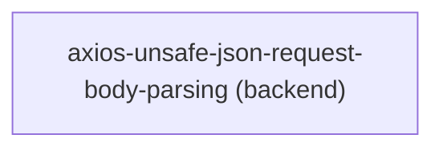

# Mapa de Conceptos

```mermaid
graph TD
  axios-unsafe-json-request-body-parsing["axios-unsafe-json-request-body-parsing (backend)"]
  %% Sin relaciones definidas. Edita relations/graph.json para conectarlos.
```
