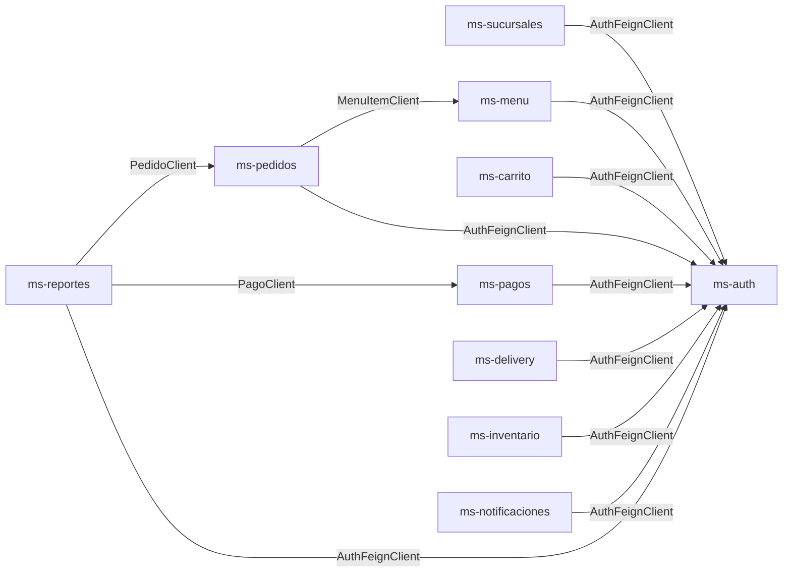
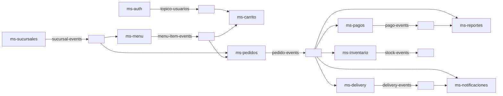
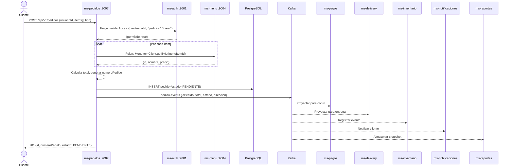

# Guion de Defensa Técnica — Microservicios Restaurant

> **Estructura por componente:** Definición → Función → Implementación → Flujo → Justificación → Evidencia

---

## Tabla Resumen de Microservicios

| Microservicio | Puerto | BD PostgreSQL | Kafka | Feign (consume) | Estado |
|---|---|---|---|---|---|---|
| **Eureka Server** | 8761 | — | — | — | Completo |
| **ms-auth** | 9001 | auth | Producer: `topico-usuarios` | — (expone endpoint) | Completo |
| **ms-sucursales** | 9003 | sucursales | Producer: `sucursal-events` | ms-auth | Completo |
| **ms-menu** | 9004 | menu | Producer: `menu-item-events`<br/>Consumer: `sucursal-events` | ms-auth | Completo |
| **ms-carrito** | 9006 | carrito | Consumer: `menu-item-events`, `topico-usuarios` | ms-auth | Completo |
| **ms-pedidos** | 9007 | pedidos | Producer: `pedido-events`<br/>Consumer: `sucursal-events`, `menu-item-events` | ms-auth, ms-menu | Completo |
| **ms-pagos** | 9008 | pagos | Producer: `pago-events`<br/>Consumer: `pedido-events` | ms-auth | Completo |
| **ms-delivery** | 9009 | delivery | Producer: `delivery-events`<br/>Consumer: `pedido-events` | ms-auth | Completo |
| **ms-inventario** | 9010 | inventario | Producer: `stock-events`<br/>Consumer: `pedido-events` | ms-auth | Completo |
| **ms-notificaciones** | 9011 | notificaciones | Consumer: `pedido-events`, `delivery-events` | ms-auth | Completo |
| **ms-reportes** | 9012 | reportes | Consumer: `pedido-events`, `pago-events` | ms-auth, ms-pagos, ms-pedidos | Completo |

---

## 1. Microservicio

### Qué es

Cada microservicio es una aplicación Spring Boot autónoma que forma parte del ecosistema Restaurant. Se comunican entre sí mediante REST (Feign) para llamadas síncronas y Kafka para eventos asíncronos. Todos se registran en Eureka para descubrimiento de servicios.

### Para qué sirve en el proyecto

Cada uno resuelve una responsabilidad de negocio concreta:

| Microservicio | Responsabilidad principal |
|---|---|
| **Eureka** | Registro y descubrimiento de servicios |
| **ms-auth** | Autenticación (JWT), autorización y gestión de credenciales/usuarios |
| **ms-sucursales** | CRUD de sucursales (locales del restaurante) |
| **ms-menu** | Gestión del menú: categorías e ítems de carta |
| **ms-carrito** | Carrito de compras del cliente |
| **ms-pedidos** | Gestión del ciclo de vida de pedidos |
| **ms-pagos** | Procesamiento de pagos |
| **ms-delivery** | Gestión de entregas a domicilio |
| **ms-inventario** | Gestión de insumos y movimientos de stock (Kardex) |
| **ms-notificaciones** | Envío de notificaciones (email, SMS, push) |
| **ms-reportes** | Generación de reportes consolidados |

### Cómo está implementado

Todos siguen la misma estructura de paquetes:

```
cl.triskeledu.<microservicio>/
├── client/          → Feign clients
├── config/          → CORS y configuración
├── controller/      → REST controllers
├── dto/
│   ├── request/      → DTOs de entrada
│   ├── response/     → DTOs de salida
│   └── event/        → DTOs de eventos Kafka
├── entity/
│   ├── enums/        → Enumeraciones JPA
│   └── ...           → Entidades JPA principales
├── exception/        → Excepciones custom + GlobalExceptionHandler
├── listener/         → Kafka consumers
├── mapper/           → Interfaces MapStruct
├── proyecciones/     → Entidades CQRS (réplicas locales)
├── repository/       → Interfaces JpaRepository
├── service/
│   └── impl/         → Lógica de negocio
└── RestaurantXxxApplication.java
```

### Qué flujo sigue

1. El controller recibe la petición HTTP y delega al service.
2. El service ejecuta la lógica de negocio, invoca al repository, y opcionalmente llama a otros microservicios vía Feign.
3. El repository interactúa con PostgreSQL.
4. Los Kafka listeners consumen eventos de otros microservicios y actualizan tablas de proyección locales (patrón CQRS).
5. La respuesta sale como DTO hacia el cliente.

### Por qué se hizo así

- **Arquitectura de microservicios** permite despliegue independiente y escalado por dominio.
- **CQRS** (proyecciones locales) evita llamadas síncronas entre microservicios para datos de lectura.
- **Feign** simplifica el consumo de APIs REST de forma declarativa.
- **Kafka** desacopla la comunicación asíncrona entre servicios (eventos de usuario, pedido, menú).

### Evidencia a mostrar

- Eureka dashboard con todos los servicios registrados en sus puertos.
- Docker-compose con las bases de datos PostgreSQL levantadas.
- Postman: `GET http://localhost:8761/` (Eureka UI).

---

## 2. POM padre e hijo

### Qué es

El **POM padre** (`Restaurant/pom.xml`) centraliza la gestión de dependencias y versiones. Cada **POM hijo** (uno por microservicio) hereda del padre y agrega solo las dependencias específicas que necesita.

### Para qué sirve en el proyecto

Evita duplicar versiones en cada microservicio y garantiza consistencia en toda la plataforma (Java 21, Spring Boot 3.5.13, Spring Cloud 2025.0.0, MapStruct 1.5.5, Lombok 1.18.44).

### Cómo está implementado

**POM padre** define:

| Propiedad | Valor |
|---|---|
| `java.version` | 21 |
| `spring-boot.version` | 3.5.13 |
| `spring-cloud.version` | 2025.0.0 |
| `mapstruct.version` | 1.5.5.Final |
| `lombok.version` | 1.18.44 |
| `postgresql-connector-j.version` | 42.7.3 |

Usa `<dependencyManagement>` para importar BOMs de Spring Boot y Spring Cloud, y declara versiones comunes para MapStruct, Lombok, PostgreSQL, H2, Hibernate Validator.

**POM hijo** ejemplo (ms-pedidos):

```xml
<parent>
    <groupId>cl.triskeledu</groupId>
    <artifactId>restaurant</artifactId>
    <version>0.0.1-SNAPSHOT</version>
</parent>
<artifactId>cl-triskeledu-pedidos</artifactId>
```

Dependencias típicas de un hijo: `spring-boot-starter-web`, `spring-boot-starter-data-jpa`, `postgresql`, `spring-kafka` (si aplica), `spring-boot-starter-validation`, `lombok`, `mapstruct`, `spring-cloud-starter-netflix-eureka-client`, `spring-cloud-starter-openfeign`, `spring-boot-starter-actuator`.

**ms-auth** adicionalmente incluye: `spring-boot-starter-security`, `jjwt-api/impl/jackson` (v0.11.5).

**Eureka** solo incluye: `spring-cloud-starter-netflix-eureka-server`.

### Qué flujo sigue

1. El desarrollador compila desde la raíz (`mvn clean install`).
2. Maven resuelve versiones desde el padre.
3. Cada hijo se empaqueta como JAR ejecutable (gracias a `spring-boot-maven-plugin` con goal `repackage`).

### Por qué se hizo así

Centralizar versiones en el POM padre evita conflictos de dependencias y facilita actualizaciones (basta cambiar una propiedad para que todos los microservicios adopten la nueva versión).

### Evidencia a mostrar

- Mostrar `Restaurant/pom.xml` (padre) con las propiedades y `dependencyManagement`.
- Mostrar el `pom.xml` de tu microservicio (hijo) con las dependencias específicas.

---

## 3. application.yml

### Qué es

Archivo de configuración de Spring Boot donde se definen las propiedades de cada microservicio: puerto, conexión a BD, registro en Eureka, y otras configuraciones.

### Para qué sirve en el proyecto

Permite que cada microservicio se conecte a su propia base de datos, se registre en Eureka para ser descubierto, y funcione de forma independiente.

### Cómo está implementado

Configuración común a todos los microservicios:

```yaml
server:
  port: <PUERTO_DEL_MS>
  error:
    include-stacktrace: never

spring:
  application:
    name: <NOMBRE_DEL_MS>
  datasource:
    driver-class-name: org.postgresql.Driver
    url: jdbc:postgresql://localhost:5433/<nombre_bd>
    username: postgres
    password: 123
  jpa:
    hibernate:
      ddl-auto: update
    database: postgresql
    database-platform: org.hibernate.dialect.PostgreSQLDialect

eureka:
  client:
    register-with-eureka: true
    fetch-registry: true
    service-url:
      defaultZone: http://localhost:8761/eureka
  instance:
    prefer-ip-address: true
    instance-id: "${spring.application.name}:${random.value}"
    lease-renewal-interval-in-seconds: 15
    lease-expiration-duration-in-seconds: 60
```

Configuración especial: **ms-auth** incluye además:

```yaml
app:
  jwt:
    secret: 404E635266556A586E3272357538782F413F4428472B4B6250645367566B5970
    expiration: 86400000        # 24 horas
    refresh-expiration: 604800000  # 7 días
```

### Qué flujo sigue

1. Spring Boot lee `application.yml` al arrancar.
2. Configura el datasource PostgreSQL en el puerto 5433.
3. Hibernate crea/actualiza las tablas (`ddl-auto: update`).
4. El microservicio se registra en Eureka en `http://localhost:8761/eureka`.
5. Feign usa Eureka para resolver los nombres de los microservicios al hacer llamadas.

### Por qué se hizo así

- `include-stacktrace: never` evita exorar detalles internos en respuestas de error.
- `instance-id` con `${random.value}` permite múltiples instancias del mismo servicio sin conflictos.
- `lease-renewal-interval-in-seconds: 15` y `lease-expiration-duration-in-seconds: 60` permiten detección rápida de caídas.
- Puerto 5433 para PostgreSQL (para no chocar con otras instancias locales).

### Evidencia a mostrar

- Mostrar el `application.yml` de tu microservicio.
- Abrir DBeaver y mostrar la base de datos y tablas correspondientes.

---

## 4. Modelo de datos

### Qué es

El modelo de datos es la representación de las tablas en PostgreSQL que cada microservicio gestiona. Se implementa mediante entidades JPA (`@Entity`).

### Para qué sirve en el proyecto

Cada microservicio tiene su propia base de datos (patrón Database per Service). Las relaciones entre servicios se manejan mediante IDs lógicos (no FK de BD), y los datos de otros servicios se replican localmente mediante proyecciones CQRS alimentadas por Kafka.

### Cómo está implementado

**Diagrama de tablas por microservicio:**

#### ms-auth (BD: `auth`)
```
user_credentials                    usuarios
┌──────────────────┐               ┌──────────────────┐
│ id (PK, BIGSERIAL)│◄─────────────│ credencial_id (FK)│
│ username (UNIQUE) │              │ id (PK, BIGSERIAL) │
│ password (BCrypt) │              │ nombre             │
│ rol (ENUM)        │              │ apellido           │
│ activo            │              │ telefono           │
│ creado_en         │              │ direccion          │
│ actualizado_en    │              │ imagen_url         │
└──────────────────┘              │ sucursal_id        │
                                   │ activo             │
                                   │ creado_en          │
                                   │ actualizado_en     │
                                   └──────────────────┘
```
Relación: `usuarios.credencial_id → user_credentials.id` (OneToOne, FK real).

#### ms-sucursales (BD: `sucursales`)
```
sucursales
┌──────────────────┐
│ id (PK, BIGSERIAL)│
│ nombre            │
│ direccion         │
│ telefono          │
│ activa            │
│ creado_en         │
│ actualizado_en    │
└──────────────────┘
```

#### ms-menu (BD: `menu`)
```
categorias                    menu_items
┌──────────────────┐         ┌──────────────────┐
│ id (PK)           │◄────────│ categoria_id (FK) │
│ nombre (UNIQUE)   │         │ id (PK)           │
│ descripcion       │         │ nombre            │
│ activa            │         │ descripcion       │
│ creado_en         │         │ precio            │
│ actualizado_en    │         │ imagen_url        │
└──────────────────┘         │ disponible        │
                              │ sucursal_id       │
                              │ eliminado         │
                              │ creado_en         │
                              │ actualizado_en    │
                              └──────────────────┘
```
Relación: `menu_items.categoria_id → categorias.id` (ManyToOne, FK real).

#### ms-carrito (BD: `carrito`)
```
carritos                       carrito_items
┌──────────────────┐          ┌──────────────────┐
│ id (PK)           │◄─────────│ carrito_id (FK)   │
│ usuario_id        │          │ id (PK)           │
│ sucursal_id       │          │ menu_item_id       │
│ total             │          │ precio_unitario    │
│ creado_en         │          │ cantidad           │
│ actualizado_en    │          │ subtotal           │
└──────────────────┘          └──────────────────┘
```
Relación: `carrito_items.carrito_id → carritos.id` (ManyToOne, cascade ALL, orphanRemoval).

#### ms-pedidos (BD: `pedidos`)
```
pedidos                         pedido_items
┌──────────────────┐            ┌──────────────────┐
│ id (PK)           │◄───────────│ pedido_id (FK)    │
│ numero_pedido     │            │ id (PK)           │
│ usuario_id        │            │ menu_item_id      │
│ sucursal_id       │            │ nombre_snapshot    │
│ estado (ENUM)     │            │ precio_unitario    │
│ tipo (ENUM)       │            │ cantidad           │
│ total             │            │ subtotal           │
│ notas             │            └──────────────────┘
│ creado_en         │
│ actualizado_en    │
└──────────────────┘
```
Enum `EstadoPedido`: PENDIENTE, CONFIRMADO, EN_PREPARACION, LISTO, EN_CAMINO, ENTREGADO, CANCELADO.
Enum `TipoPedido`: DELIVERY, EN_LOCAL.

#### ms-pagos (BD: `pagos`)
```
pagos
┌──────────────────┐
│ id (PK)           │
│ pedido_id          │
│ monto              │
│ metodo (ENUM)      │
│ estado (ENUM)      │
│ transaccion_id     │
│ creado_en          │
│ actualizado_en     │
└──────────────────┘
```
Enum `MetodoPago`: EFECTIVO, TARJETA_CREDITO, TARJETA_DEBITO, TRANSFERENCIA.
Enum `EstadoPago`: PENDIENTE, APROBADO, RECHAZADO, REEMBOLSADO.

#### ms-delivery (BD: `delivery`)
```
deliveries
┌──────────────────┐
│ id (PK)           │
│ pedido_id (UNIQUE)│
│ repartidor_id      │
│ direccion_entrega  │
│ estado (ENUM)      │
│ observaciones      │
│ creado_en          │
│ actualizado_en     │
└──────────────────┘
```
Enum `EstadoDelivery`: BUSCANDO_REPARTIDOR, ASIGNADO, EN_CAMINO, ENTREGADO, CANCELADO.

#### ms-inventario (BD: `inventario`)
```
insumos                           movimientos_inventario
┌──────────────────┐              ┌──────────────────┐
│ id (PK)           │◄──────────────│ insumo_id          │
│ sucursal_id       │              │ id (PK)           │
│ nombre            │              │ tipo (ENUM)        │
│ unidad_medida     │              │ cantidad           │
│ stock_actual      │              │ referencia         │
│ stock_minimo      │              │ creado_en          │
│ creado_en         │              └──────────────────┘
│ actualizado_en    │
└──────────────────┘
```
Unique constraint: `(sucursal_id, nombre)`.
Enum `TipoMovimiento`: ENTRADA, SALIDA.

#### ms-notificaciones (BD: `notificaciones`)
```
notificaciones
┌──────────────────┐
│ id (PK)           │
│ destinatario      │
│ tipo (ENUM)       │
│ asunto            │
│ cuerpo            │
│ estado (ENUM)     │
│ creado_en         │
└──────────────────┘
```
Enum `TipoNotificacion`: EMAIL, SMS, PUSH.
Enum `EstadoNotificacion`: PENDIENTE, ENVIADO, FALLIDO.

#### ms-reportes (BD: `reportes`)
```
reporte_snapshots
┌──────────────────┐
│ id (PK)           │
│ sucursal_id       │
│ tipo (ENUM)       │
│ data_json (TEXT)   │
│ creado_en         │
└──────────────────┘
```
Enum `TipoReporte`: VENTAS_DIARIAS, TOP_PLATOS, KARDEX_MENSUAL, RENDIMIENTO_REPARTIDORES.

### Tablas de proyección CQRS (kerbeladas por Kafka)

Varios microservicios tienen tablas de proyección local que se alimentan mediante eventos Kafka:

| Tabla de proyección | Ubicada en | Alimentada por topic | Contiene |
|---|---|---|---|
| `proyeccion_sucursales` | ms-menu, ms-pedidos | `sucursal-events` | id, nombre, direccion, activa |
| `proyeccion_menu_items` | ms-pedidos, ms-carrito | `menu-item-events` / `topico-menu` | id, nombre, precio, disponible |
| `clientes_proyeccion` | ms-carrito | `topico-usuarios` / `usuario-events` | id, nombre_completo, direccion, telefono |
| `proyeccion_pedidos` | ms-pagos, ms-delivery | `pedido-events` | id_pedido, id_cliente, id_sucursal, estado, direccion_entrega |

### Por qué se hizo así

- **BD por servicio**: Cada microservicio gestiona sus propios datos, evitando acoplamiento.
- **IDs lógicos** en lugar de FK entre BDs: `usuario_id`, `sucursal_id`, `pedido_id` se almacenan como `Long` sin relación JPA, ya que referencian datos de otros microservicios.
- **Proyecciones CQRS**: Se replican localmente los datos necesarios de otros servicios para evitar llamadas síncronas en lectura.
- **Soft delete**: Entidades como `MenuItem` usan flag `eliminado` y `Categoria` usa flag `activa`.

### Evidencia a mostrar

- Abrir DBeaver, conectar a PostgreSQL puerto 5433, mostrar la BD de tu microservicio y las tablas creadas por Hibernate.
- Mostrar la relación entre tablas (e.g., `pedidos` → `pedido_items`).

---

## 5. Clase Application

### Qué es

Es la clase `main` que arranca cada microservicio Spring Boot.

### Para qué sirve en el proyecto

Es el punto de entrada que configura y levanta el contexto de Spring, activando Eureka, Feign, Kafka, Security y demás capacidades según el microservicio.

### Cómo está implementado

Todos los microservicios (excepto Eureka y ms-auth) tienen:

```java
@SpringBootApplication
@EnableFeignClients
public class RestaurantXxxApplication {
    public static void main(String[] args) {
        SpringApplication.run(RestaurantXxxApplication.class, args);
    }
}
```

| Microservicio | Anotaciones de la clase main |
|---|---|
| Eureka | `@SpringBootApplication(exclude = {ValidationAutoConfiguration.class})`, `@EnableEurekaServer` |
| ms-auth | `@SpringBootApplication` (sin `@EnableFeignClients` — no consume otros servicios) |
| Todos los demás | `@SpringBootApplication`, `@EnableFeignClients` |

### Qué anotaciones importantes tiene

- **`@SpringBootApplication`**: Activa auto-configuración, escaneo de componentes y configuración.
- **`@EnableFeignClients`**: Activa la generación de proxies para los interfaces `@FeignClient`.
- **`@EnableEurekaServer`**: (Solo Eureka) Levanta el servidor de registro.

### Por qué se hizo así

- No se necesita `@EnableEurekaClient` porque la dependencia `spring-cloud-starter-netflix-eureka-client` + la configuración `register-with-eureka: true` en `application.yml` lo auto-activan.
- No se necesita `@EnableKafka` explícito porque `spring-kafka` en el POM auto-configura los listeners.

### Evidencia a mostrar

- Abrir la clase `RestaurantXxxApplication.java` de tu microservicio y mostrar las anotaciones.

---

## 6. Excepciones

### Qué es

Un sistema centralizado de manejo de errores que convierte las excepciones de negocio en respuestas HTTP estructuradas con formato JSON consistente.

### Para qué sirve en el proyecto

Evita que la API devuelva stack traces o errores genéricos 500 sin contexto. Cada microservicio define sus excepciones de negocio y un `GlobalExceptionHandler` que las intercepta y devuelve respuestas claras y predecibles.

### Cómo está implementado

Todos los microservicios siguen el mismo patrón:

**Clases de excepción custom** (una por cada tipo de error de negocio):

| Microservicio | Excepciones custom |
|---|---|
| ms-auth | `CredencialesInvalidasException` (401), `CuentaDesactivadaException` (403), `UsuarioYaExisteException` (409), `CredencialYaVinculadaException` (409), `UsuarioNotFoundException` (404), `TokenInvalidoException` |
| ms-sucursales | `SucursalNotFoundException` (404), `AccesoDenegadoException` (403) |
| ms-menu | `MenuItemNotFoundException` (404), `CategoriaNotFoundException` (404), `ItemDuplicadoException` (409), `CategoriaDuplicadaException` (409), `ItemNoDisponibleException` (409), `AccesoDenegadoException` (403) |
| ms-carrito | `CarritoNotFoundException` (404), `ItemNotFoundException` (404), `AccesoDenegadoException` (403) |
| ms-pedidos | `PedidoNotFoundException` (404), `EstadoInvalidoException` (409), `AccesoDenegadoException` (403) |
| ms-pagos | `PagoNotFoundException` (404), `AccesoDenegadoException` (403) |
| ms-delivery | `DeliveryNotFoundException` (404), `AccesoDenegadoException` (403) |
| ms-inventario | `InsumoNotFoundException` (404), `InsumoDuplicadoException` (409), `StockInsuficienteException` (409), `AccesoDenegadoException` (403) |
| ms-notificaciones | `NotificacionNotFoundException` (404), `AccesoDenegadoException` (403) |
| ms-reportes | `ReporteNoGeneradoException` (422), `AccesoDenegadoException` (403) |

**GlobalExceptionHandler** (`@RestControllerAdvice`) común a todos:

```java
@RestControllerAdvice
public class GlobalExceptionHandler {
    // Maneja excepciones específicas con HttpStatus adecuado
    // Formato de respuesta: { "timestamp", "status", "error", "mensaje" }
    // Para validaciones: añade campo "errores" con detalle por campo
}
```

Formato de respuesta de error:
```json
{
    "timestamp": "2025-01-15T10:30:00",
    "status": 404,
    "error": "Not Found",
    "mensaje": "Pedido no encontrado con ID: 5"
}
```

### Qué flujo sigue

1. El service lanza una excepción custom (e.g., `new PedidoNotFoundException("...")`).
2. Spring la propaga al controller.
3. El `GlobalExceptionHandler` intercepta la excepción según su tipo.
4. Construye un JSON con timestamp, status HTTP, error y mensaje.
5. Devuelve la `ResponseEntity` con el status HTTP correspondiente.

### Por qué se hizo así

Centralizar el manejo de errores en un `@RestControllerAdvice` evita repetir bloques try-catch en cada controller y garantiza respuestas consistentes. Las excepciones custom permiten distinguir errores de negocio (404, 409, 403) de errores inesperados (500).

### Evidencia a mostrar

- Mostrar las clases de excepción custom de tu microservicio.
- Mostrar el `GlobalExceptionHandler`.
- En Postman, provocar un error (e.g., GET un ID inexistente) y mostrar la respuesta JSON.

---

## 7. Entity / modelo JPA

### Qué es

Las entidades JPA son clases Java anotadas con `@Entity` que representan las tablas de la base de datos. Cada microservicio define sus entidades con atributos, validaciones y relaciones.

### Para qué sirve en el proyecto

Permiten que Hibernate/JPA genere las tablas automáticamente (`ddl-auto: update`) y provean la capa de persistencia accesible desde los repositories.

### Cómo está implementado

Ejemplo detallado — **Pedido** (ms-pedidos):

```java
@Entity
@Table(name = "pedidos")
@Getter @Setter @NoArgsConstructor @AllArgsConstructor @Builder
public class Pedido {
    @Id
    @GeneratedValue(strategy = GenerationType.IDENTITY)
    private Long id;

    @Column(name = "numero_pedido", nullable = false, unique = true, length = 20)
    private String numeroPedido;

    @Column(name = "usuario_id", nullable = false)
    private Long usuarioId;  // FK lógica (sin relación JPA)

    @Column(name = "sucursal_id", nullable = false)
    private Long sucursalId;  // FK lógica

    @Enumerated(EnumType.STRING)
    @Column(name = "estado", nullable = false, length = 20)
    private EstadoPedido estado;

    @OneToMany(mappedBy = "pedido", cascade = CascadeType.ALL, orphanRemoval = true, fetch = FetchType.LAZY)
    @Builder.Default
    private List<PedidoItem> items = new ArrayList<>();

    @Column(name = "total", nullable = false, precision = 10, scale = 2)
    private BigDecimal total;

    @CreationTimestamp
    @Column(name = "creado_en", nullable = false, updatable = false)
    private LocalDateTime creadoEn;

    @UpdateTimestamp
    @Column(name = "actualizado_en", nullable = false)
    private LocalDateTime actualizadoEn;
}
```

Anotaciones clave usadas en las entidades:

| Anotación | Uso |
|---|---|
| `@Entity`, `@Table` | Mapeo clase → tabla BD |
| `@Id`, `@GeneratedValue(IDENTITY)` | Clave primaria auto-incremental |
| `@Column` | Restricciones (nullable, length, precision, unique) |
| `@Enumerated(STRING)` | Persistencia de enums como texto |
| `@OneToMany`, `@ManyToOne` | Relaciones entre entidades (con `cascade`, `orphanRemoval`, `fetch=LAZY`) |
| `@CreationTimestamp`, `@UpdateTimestamp` | Auditoría automática de timestamps |
| `@Builder.Default` | Valores por defecto en entidades con Lombok `@Builder` |

### Qué flujo sigue

1. Hibernate Lee la entidad y genera/actualiza la tabla en PostgreSQL (gracias a `ddl-auto: update`).
2. El repository opera sobre la entidad usando métodos de `JpaRepository`.
3. El mapper convierte Entity ↔ DTO.
4. El service orquesta la lógica y el controller expone la respuesta.

### Por qué se hizo así

- **FKs lógicos** (`Long usuarioId`) en lugar de relaciones JPA cross-service: cada microservicio gestiona su propia BD y no puede tener FK hacia tablas de otro microservicio.
- **FetchType.LAZY** en relaciones OneToMany: evita cargar datos innecesarios.
- **CascadeType.ALL + orphanRemoval**: al eliminar un `Pedido` se eliminan sus `PedidoItem`, y al remover un item de la lista se elimina de la BD.
- **Soft delete** (`eliminado`, `activo`): en lugar de borrar físicamente.

### Evidencia a mostrar

- Mostrar la entidad principal de tu microservicio en el IDE.
- En DBeaver, mostrar la tabla y sus columnas generadas por Hibernate.

---

## 8. Repository

### Qué es

Interfaces que extienden `JpaRepository` de Spring Data JPA para proveer operaciones CRUD y consultas personalizadas sobre las entidades.

### Para qué sirve en el proyecto

Abstrae el acceso a datos. No se escriben queries SQL manuales para operaciones comunes; Spring Data genera las implementaciones automáticamente.

### Cómo está implementado

Ejemplo — **PedidoRepository** (ms-pedidos):

```java
@Repository
public interface PedidoRepository extends JpaRepository<Pedido, Long> {
    Optional<Pedido> findByIdWithItems(Long id);  // JOIN FETCH

    List<Pedido> findByUsuarioIdOrderByCreadoEnDesc(Long usuarioId);
    List<Pedido> findBySucursalIdAndEstadoOrderByCreadoEnAsc(Long sucursalId, EstadoPedido estado);

    @Query("SELECT p FROM Pedido p WHERE p.sucursalId = :sucursalId AND p.estado NOT IN :estados")
    List<Pedido> findBySucursalIdAndEstadoNotIn(@Param("sucursalId") Long sucursalId,
                                                @Param("estados") List<EstadoPedido> estados);

    @Query("SELECT p FROM Pedido p LEFT JOIN FETCH p.items WHERE p.id = :id")
    Optional<Pedido> findByIdWithItems(@Param("id") Long id);
}
```

Resumen de repositories por microservicio:

| Microservicio | Repository | Extiende | Métodos custom |
|---|---|---|---|
| ms-auth | `UserCredentialRepository` | `JpaRepository<UserCredential, Long>` | `findByUsername`, `existsByUsername`, `actualizarEstado`(@Modifying), `actualizarPassword`(@Modifying), `contarActivosPorRol` |
| ms-auth | `UsuarioRepository` | `JpaRepository<Usuario, Long>` | `findByCredencialId`, `existsByCredencialId`, `findBySucursalIdAndActivoTrue...`, `reasignarSucursal`(@Modifying), `actualizarEstadoPorCredencial`(@Modifying) |
| ms-sucursales | `SucursalRepository` | `JpaRepository<Sucursal, Long>` | `findByActivaTrueOrderByNombreAsc`, `actualizarEstado`(@Modifying) |
| ms-menu | `CategoriaRepository` | `JpaRepository<Categoria, Long>` | `findByNombreIgnoreCase`, `existsByNombreIgnoreCase`, `findByActivaTrueOrderByNombreAsc`, `actualizarEstado`(@Modifying) |
| ms-menu | `MenuItemRepository` | `JpaRepository<MenuItem, Long>` | `findByDisponibleTrueAndEliminadoFalse...`, `findDisponiblesBySucursal`(@Query), `findByIdAndDisponibleTrueAndEliminadoFalse`, `actualizarDisponibilidadPorCategoria`(@Modifying) |
| ms-carrito | `CarritoRepository` | `JpaRepository<Carrito, Long>` | `findByUsuarioId` |
| ms-pedidos | `PedidoRepository` | `JpaRepository<Pedido, Long>` | `findByUsuarioId...`, `findByIdWithItems`(@Query JOIN FETCH), `findBySucursalIdAndEstadoNotIn`(@Query) |
| ms-pagos | `PagoRepository` | `JpaRepository<Pago, Long>` | `findByPedidoId` |
| ms-delivery | `DeliveryRepository` | `JpaRepository<Delivery, Long>` | `findByPedidoId` |
| ms-inventario | `InsumoRepository` | `JpaRepository<Insumo, Long>` | `findBySucursalId`, `existsBySucursalIdAndNombreIgnoreCase` |
| ms-inventario | `MovimientoRepository` | `JpaRepository<MovimientoInventario, Long>` | `findByInsumoIdOrderByCreadoEnDesc` |
| ms-notificaciones | `NotificacionRepository` | `JpaRepository<Notificacion, Long>` | `findByEstado` |
| ms-reportes | `ReporteSnapshotRepository` | `JpaRepository<ReporteSnapshot, Long>` | `findByTipoOrderByCreadoEnDesc`, `findBySucursalIdAndTipoOrderByCreadoEnDesc` |

### Por qué se hizo así

- **Derived queries** (e.g., `findByUsuarioIdOrderByCreadoEnDesc`): Spring Data genera el SQL automáticamente a partir del nombre del método.
- **`@Query` JPQL** (e.g., `findByIdWithItems`): Se usa cuando la query requiere `JOIN FETCH` para evitar el problema N+1.
- **`@Modifying`** (e.g., `actualizarEstado`): Permite ejecutar UPDATEs directos sin cargar la entidad completa.

### Evidencia a mostrar

- Mostrar el repository de tu microservicio con sus métodos custom.
- En Postman, hacer un `GET /api/v1/...` que use un método custom del repository.

---

## 9. DTO

### Qué es

Los DTOs (Data Transfer Objects) son clases que definen la estructura de los datos que la API recibe (Request) y devuelve (Response), separando la representación externa de la entidad interna de BD.

### Para qué sirve en el proyecto

Separa la capa de持久encia de la capa de presentación. No se expone directamente la entidad JPA al exterior, lo que permite:
- Eliminar campos sensibles (e.g., `password` de `UserCredential`).
- Agregar validaciones (`@NotNull`, `@NotBlank`, `@Size`).
- Modificar la estructura de la BD sin romper la API.

### Cómo está implementado

Todos los microservicios siguen el patrón:

```
dto/
├── request/   → DTOs de entrada (con validaciones)
├── response/  → DTOs de salida (sin datos sensibles)
└── event/     → DTOs paraConsumir/Producir eventos Kafka
```

Ejemplo — **PedidoRequestDTO** (ms-pedidos):

```java
@Data @Builder @NoArgsConstructor @AllArgsConstructor
public class PedidoRequestDTO {
    @NotNull(message = "El ID del usuario es obligatorio")
    private Long usuarioId;

    @NotNull(message = "El ID de la sucursal es obligatorio")
    private Long sucursalId;

    @NotNull(message = "El tipo de pedido es obligatorio")
    private TipoPedido tipo;

    @NotEmpty(message = "El pedido debe tener al menos un ítem")
    @Valid
    private List<PedidoItemRequestDTO> items;

    @Size(max = 500, message = "Las notas no pueden exceder 500 caracteres")
    private String notas;
}
```

Ejemplo — **PedidoResponseDTO** (ms-pedidos):

```java
@Data @Builder @NoArgsConstructor @AllArgsConstructor
public class PedidoResponseDTO {
    private Long id;
    private String numeroPedido;
    private Long usuarioId;
    private Long sucursalId;
    private EstadoPedido estado;
    private TipoPedido tipo;
    private BigDecimal total;
    private String notas;
    private List<PedidoItemResponseDTO> items;
    private LocalDateTime creadoEn;
    private LocalDateTime actualizadoEn;
}
```

Permisos comunes: Todos los microservicios tienen un `PermisoResponseDTO` que usan para la respuesta del Feign client a ms-auth:

```java
@Data @Builder @NoArgsConstructor @AllArgsConstructor
public class PermisoResponseDTO {
    private boolean permitido;
    private String mensaje;
}
```

### Por qué se hizo así

- Los Request DTO llevan validaciones (`@NotNull`, `@NotBlank`, `@Size`, `@DecimalMin`) que se activan con `@Valid` en el controller.
- Los Response DTO omiten datos sensibles (nunca se expone el password).
- Los Event DTOs se usan para deserializar/serializar eventos Kafka.

### Evidencia a mostrar

- Mostrar los DTOs Request y Response de tu microservicio.
- En Postman, mostrar el JSON enviado (request) y el JSON recibido (response).

---

## 10. Mapper

### Qué es

Componente encargado de convertir entre Entity y DTO (y viceversa). En este proyecto se usa **MapStruct**, un generador de código en tiempo de compilación.

### Para qué sirve en el proyecto

Evita escribir código repetitivo de mapeo manual. MapStruct genera la implementación automáticamente, respetando las convenciones de nombres de atributos.

### Cómo está implementado

Todos los microservicios (excepto Eureka) usan el mismo patrón:

```java
@Mapper(componentModel = "spring")
public interface PedidoMapper {
    PedidoResponseDTO toResponseDTO(Pedido pedido);
    PedidoItemResponseDTO toItemResponseDTO(PedidoItem item);
}
```

La anotación `componentModel = "spring"` hace que MapStruct genere una clase `PedidoMapperImpl` anotada con `@Component`, que se inyecta automáticamente.

| Microservicio | Mapper | Métodos |
|---|---|---|
| ms-auth | `UsuarioMapper` | `toResponseDTO(Usuario)`, `toEntity(UsuarioRequestDTO)`, `updateEntityFromDto` |
| ms-sucursales | `SucursalMapper` | `toResponseDTO`, `toEntity`, `updateEntityFromDto` |
| ms-menu | `MenuItemMapper` | `toResponseDTO`, `toEntity`, `updateEntityFromDto` |
| ms-menu | `CategoriaMapper` | `toResponseDTO`, `toEntity`, `updateEntityFromDto` |
| ms-carrito | `CarritoMapper` | `toResponseDTO(Carrito)`, `toItemResponseDTO(CarritoItem)` |
| ms-pedidos | `PedidoMapper` | `toResponseDTO(Pedido)`, `toItemResponseDTO(PedidoItem)` |
| ms-pagos | `PagoMapper` | `toResponseDTO(Pago)`, `toEntity(PagoRequestDTO)` |
| ms-delivery | `DeliveryMapper` | `toResponseDTO(Delivery)`, `toEntity(DeliveryRequestDTO)` |
| ms-inventario | `InventarioMapper` | `toInsumoResponseDTO`, `toInsumoEntity`, `updateInsumoFromDto`, `toMovimientoResponseDTO` |
| ms-notificaciones | `NotificacionMapper` | `toResponseDTO`, `toEntity` |
| ms-reportes | `ReporteMapper` | `toResponseDTO` |

**Nota:** Algunos microservicios (ms-pagos, ms-delivery, ms-pedidos) tienen el mapper definido pero usan un método manual `mapToDTO()` en el service en lugar de inyectar el mapper. Esto es una inconsistencia conocida.

### Qué flujo sigue

1. El controller recibe un `RequestDTO`.
2. El mapper (o mapeo manual) convierte `RequestDTO → Entity`.
3. El repository guarda la `Entity`.
4. El mapper convierte `Entity → ResponseDTO`.
5. El controller devuelve el `ResponseDTO`.

### Por qué se hizo así

MapStruct genera código en compilación (no usa reflexión en runtime), lo que lo hace más performante que alternativas como ModelMapper. La anotación `componentModel = "spring"` permite inyección por constructor.

### Evidencia a mostrar

- Mostrar la interface del mapper de tu microservicio.
- Mostrar el `target/generated-sources/annotations/...MapperImpl.java` generado por MapStruct.

---

## 11. Service (lógica de negocio)

### Qué es

La capa de servicio contiene la lógica de negocio del microservicio. Implementa validaciones, reglas de negocio y orquesta las operaciones entre el repository, los Feign clients y los Kafka listeners.

### Para qué sirve en el proyecto

Es donde reside el comportamiento esperado del sistema: crear un pedido con validación de ítems, verificar stock antes de una salida, calcular totales, validar permisos, etc.

### Cómo está implementado

Todos siguen el patrón Interface + Impl:

```java
public interface PedidoService {
    PedidoResponseDTO crear(PedidoRequestDTO dto);
    PedidoResponseDTO obtenerPorId(Long id);
    // ...
}

@Service
@RequiredArgsConstructor
@Slf4j
public class PedidoServiceImpl implements PedidoService {
    private final PedidoRepository pedidoRepository;
    // ...
}
```

Resumen de lógica de negocio por microservicio:

#### ms-auth — `AuthServiceImpl`
- **registrar()**: Normaliza username, verifica duplicado, hashea password (BCrypt), crea `UserCredential`, crea `Usuario` por defecto, genera JWT + refresh token.
- **login()**: Busca usuario, verifica BCrypt, valida `activo`, genera JWT + refresh token.
- **refresh()**: Valida refresh token, genera nuevo access token.
- Seguridad: Spring Security con `JwtAuthFilter`, stateless sessions, JWT HS256.

#### ms-menu — `CategoriaServiceImpl` / `MenuItemServiceImpl`
- **crear(categoria)**: Valida permisos vía Feign (`validarAcceso`), verifica nombre duplicado.
- **crear(menuItem)**: Verifica nombre duplicado en la categoría, guarda con `disponible=true, eliminado=false`.
- **eliminar(id)**: Soft delete (set `eliminado=true, disponible=false`).

#### ms-pedidos — `PedidoServiceImpl`
- **crear()**: Crea pedido con `estado=PENDIENTE`, genera `numeroPedido`, itera items con precios mock (TODO: consultar ms-menu vía Feign), calcula total, guarda.
- **cambiarEstado()**: Cambia estado del pedido (sin validación de máquina de estados — TODO).
- **cancelar()**: Valida que estado sea PENDIENTE o CONFIRMADO, cambia a CANCELADO.

#### ms-pagos — `PagoServiceImpl`
- **iniciarPago()**: Crea pago forzando `estado=APROBADO` (happy path mockeado).
- **confirmarPago()**: Busca pago por ID, actualiza estado y transaccionId.

#### ms-carrito — `CarritoServiceImpl`
- **Todos los métodos son TODO/stubs** (retornan `null`). La lógica pendiente incluye: buscar carrito por usuario, agregar items consultando ms-menu vía Feign, recalcular totales.

#### ms-delivery — `DeliveryServiceImpl`
- **crearDelivery()**: Crea delivery con `estado=BUSCANDO_REPARTIDOR`.
- **asignarRepartidor()**: Asigna repartidorId y cambia estado a `ASIGNADO`.
- **actualizarEstado()**: Cambia estado sin validación de transiciones.

#### ms-inventario — `InventarioServiceImpl`
- **crearInsumo()**: Valida duplicado (sucursal + nombre), crea con `stockActual=0`.
- **registrarMovimiento()**: Si `ENTRADA` suma al stock; si `SALIDA` valida que `stockActual >= cantidad`, lanza `StockInsuficienteException` si no alcanza.
- **actualizarInsumo()**: No permite modificar `stockActual` (solo vía movimientos).

#### ms-notificaciones — `NotificacionServiceImpl`
- **Todos los métodos son TODO/stubs** (retornan `null`).

#### ms-reportes — `ReporteServiceImpl`
- **Todos los métodos son TODO/stubs** (retornan `null`).

### Por qué se hizo así

- `@Transactional` en métodos de escritura para garantizar rollback automático en caso de error.
- `@Slf4j` para trazabilidad en cada operación.
- Inyección de `AuthFeignClient` en varios servicios para futura validación de permisos (patrón preparado pero no implementado en todos).

### Evidencia a mostrar

- Mostrar la clase `ServiceImpl` de tu microservicio.
- En Postman, hacer un POST para crear un recurso y luego un GET para verificar.

---

## 12. Client Feign

### Qué es

Interfaces anotadas con `@FeignClient` que permiten consumir APIs REST de otros microservicios de forma declarativa, sin escribir código HTTP manual.

### Para qué sirve en el proyecto

Permite la comunicación síncrona entre microservicios. Feign resuelve automáticamente la dirección del servicio vía Eureka (service discovery), por lo que no se necesitan URLs hardcodeadas.

### Cómo está implementado

**AuthFeignClient** — presente en todos los microservicios (excepto ms-auth y eureka):

```java
@FeignClient(name = "ms-auth", path = "/api/v1/auth")
public interface AuthFeignClient {
    @GetMapping("/validar-acceso")
    ResponseEntity<PermisoResponseDTO> validarAcceso(
        @RequestParam("credencialId") Long credencialId,
        @RequestParam("modulo") String modulo,
        @RequestParam("accion") String accion
    );
}
```

**MenuItemClient** — solo en ms-pedidos:

```java
@FeignClient(name = "ms-menu", path = "/api/v1/menu")
public interface MenuItemClient {
    @GetMapping("/{id}")
    MenuItemClientResponseDTO getById(@PathVariable Long id);
}
```

| Microservicio | Feign Client | Servicio consumido | Endpoint | Estado |
|---|---|---|---|---|---|
| ms-sucursales | `AuthFeignClient` | ms-auth | `GET /api/v1/auth/validar-acceso` | Usado con fallback |
| ms-menu | `AuthFeignClient` | ms-auth | `GET /api/v1/auth/validar-acceso` | Usado con fallback |
| ms-carrito | `AuthFeignClient` | ms-auth | `GET /api/v1/auth/validar-acceso` | Usado con fallback |
| ms-pedidos | `AuthFeignClient` | ms-auth | `GET /api/v1/auth/validar-acceso` | Usado con fallback |
| ms-pedidos | `MenuItemClient` | ms-menu | `GET /api/v1/menu/{id}` | Usado en `crear()` |
| ms-pagos | `AuthFeignClient` | ms-auth | `GET /api/v1/auth/validar-acceso` | Usado con fallback |
| ms-delivery | `AuthFeignClient` | ms-auth | `GET /api/v1/auth/validar-acceso` | Usado con fallback |
| ms-inventario | `AuthFeignClient` | ms-auth | `GET /api/v1/auth/validar-acceso` | Usado con fallback |
| ms-notificaciones | `AuthFeignClient` | ms-auth | `GET /api/v1/auth/validar-acceso` | Usado con fallback |
| ms-reportes | `AuthFeignClient` | ms-auth | `GET /api/v1/auth/validar-acceso` | Usado con fallback |
| ms-reportes | `PagoClient` | ms-pagos | `GET /api/v1/pagos` | Usado en reportes |
| ms-reportes | `PedidoClient` | ms-pedidos | `GET /api/v1/pedidos` | Usado en reportes |

### Qué flujo sigue

1. El service inyecta el Feign client.
2. Al invocar el método, Feign resuelve `ms-auth` vía Eureka → obtiene la IP:puerto.
3. Construye la petición HTTP: `GET http://ms-auth/api/v1/auth/validar-acceso?credencialId=X&modulo=Y&accion=Z`.
4. Recibe la respuesta `PermisoResponseDTO` y la usa para validar permisos.

### Por qué se hizo así

- **Declarativo**: Solo se define la interfaz, Spring genera la implementación.
- **Service discovery**: Feign + Eureka eliminan la necesidad de URLs hardcodeadas.
- **Extensible**: Se pueden agregar fallbacks con Resilience4j (aún no implementado).

### Evidencia a mostrar

- Mostrar la interfaz `@FeignClient` de tu microservicio.
- Mostrar el `AuthFeignClient` en el service donde se inyecta.

---

## 13. Controller

### Qué es

Clases anotadas con `@RestController` que exponen endpoints REST y actúan como puerta de entrada a la lógica de negocio del microservicio.

### Para qué sirve en el proyecto

Es la interfaz HTTP que recibe peticiones del cliente (frontend u otros microservicios), delega al service, y devuelve respuestas estructuradas.

### Cómo está implementado

Todos los controllers siguen el patrón:

```java
@RestController
@RequestMapping("/api/v1/<recurso>")
@RequiredArgsConstructor
@Slf4j
public class PedidoController {
    private final PedidoService pedidoService;

    @PostMapping
    public ResponseEntity<PedidoResponseDTO> crear(@Valid @RequestBody PedidoRequestDTO dto) {
        log.info("[PedidoController] POST /pedidos");
        return ResponseEntity.status(HttpStatus.CREATED).body(pedidoService.crear(dto));
    }
    // ...
}
```

Resumen de endpoints por microservicio:

#### ms-auth — `AuthController` (`/api/v1/auth`)

| Método | Endpoint | Descripción |
|---|---|---|
| POST | `/register` | Registrar nuevo usuario |
| POST | `/login` | Autenticar usuario |
| POST | `/refresh` | Renovar access token |
| POST | `/logout` | Cerrar sesión |
| GET | `/health` | Health check |
| GET | `/validar-acceso` | Validar permisos (consumido por Feign) |

#### ms-auth — `UsuarioController` (`/api/v1/usuarios`)

| Método | Endpoint |
|---|---|
| POST | `/` |
| GET | `/{id}`, `/credencial/{credencialId}`, `/sucursal/{sucursalId}` |
| PUT | `/{id}` |
| PATCH | `/{id}/sucursal` |
| DELETE | `/{id}` |

#### ms-sucursales (`/api/v1/sucursales`)

| Método | Endpoint |
|---|---|
| POST | `/` |
| GET | `/{id}`, `/` (activas), `/todas` |
| PUT | `/{id}` |
| PATCH | `/{id}/estado` |

#### ms-menu

- `MenuItemController` (`/api/v1/menu`): POST `/`, GET `/{id}`, GET `/` o `/disponibles`, PUT `/{id}`, PATCH `/{id}/disponibilidad`, DELETE `/{id}` (soft delete)
- `CategoriaController` (`/api/v1/categorias`): POST `/`, GET `/{id}`, GET `/` (activas), GET `/todas`, PUT `/{id}`, PATCH `/{id}/estado`

#### ms-carrito (`/api/v1/carrito`)

| Método | Endpoint |
|---|---|
| GET | `/usuario/{usuarioId}` |
| POST | `/`, `/usuario/{usuarioId}/items` |
| PATCH | `/usuario/{usuarioId}/items/{itemId}` (stub) |
| DELETE | `/usuario/{usuarioId}/items/{itemId}`, `/usuario/{usuarioId}` |

#### ms-pedidos (`/api/v1/pedidos`)

| Método | Endpoint |
|---|---|
| POST | `/` |
| GET | `/{id}`, `/` (todos), `/sucursal/{sucursalId}/activos`, `/cliente/{usuarioId}` |
| PATCH | `/{id}/estado`, `/{id}/cancelar` |

#### ms-pagos (`/api/v1/pagos`)

| Método | Endpoint |
|---|---|
| POST | `/` |
| PATCH | `/{id}/estado` |
| GET | `/{id}`, `/`, `/pedido/{pedidoId}` |

#### ms-delivery (`/api/v1/delivery`)

| Método | Endpoint |
|---|---|
| POST | `/` |
| GET | `/{id}`, `/pedido/{pedidoId}`, `/` |
| PATCH | `/{id}/asignar`, `/{id}/estado` |

#### ms-inventario (`/api/v1/inventario`)

| Método | Endpoint |
|---|---|
| POST | `/insumos` |
| PUT | `/insumos/{id}` |
| GET | `/` (todos), `/{id}`, `/insumos/sucursal/{sucursalId}` |
| POST | `/movimientos` |
| PATCH | `/{id}/stock` |
| GET | `/insumos/{insumoId}/kardex` |

#### ms-notificaciones (`/api/v1/notificaciones`)

| Método | Endpoint |
|---|---|
| POST | `/` |
| GET | `/{id}`, `/estado/{estado}` |

#### ms-reportes (`/api/v1/reportes`)

| Método | Endpoint |
|---|---|
| POST | `/generar` |
| GET | `/tipo/{tipo}` |

### Por qué se hizo así

- Versionado en la URL (`/api/v1/`) para evolución futura.
- `@Valid` en los request DTO para activar validaciones de Bean Validation.
- Códigos HTTP semánticos: 201 para creación, 200 para lecturas/actualizaciones, 204 para deletes, 404 para not found.

### Evidencia a mostrar

- Mostrar el controller de tu microservicio en el IDE.
- En Postman, mostrar el request y response de al menos un endpoint POST y un GET.

---

## 14. Kafka

### Qué es

Apache Kafka es un sistema de mensajería asíncrona que permite desacoplar la comunicación entre microservicios mediante un patrón de publicación/suscripción (publish/subscribe).

### Para qué sirve en el proyecto

Permite que un microservicio publique un evento cuando cambia su estado, y otros microservicios lo consuman para actualizar sus proyecciones locales (patrón CQRS), sin necesidad de llamadas síncronas.

### Cómo está implementado

#### Productores (Publishers)

| Topic | Producer | Evento | Datos enviados |
|---|---|---|---|
| `topico-usuarios` | ms-auth | Creación, actualización o eliminación de usuario | `AuthEventDTO {id, nombre, apellido, direccion, telefono}` |
| `sucursal-events` | ms-sucursales | Creación, actualización, cambio de estado | `SucursalEventDTO {id, nombre, direccion, activa}` |
| `menu-item-events` | ms-menu | Creación, actualización, cambio disponibilidad, soft delete | `MenuItemEventDTO {id, nombre, precio, disponible}` |
| `pedido-events` | ms-pedidos | Creación, cambio de estado, cancelación | `PedidoEventDTO {idPedido, idCliente, total, estado, direccionEntrega}` |
| `pago-events` | ms-pagos | Inicio de pago, cambio de estado | `PagoEventDTO {pagoId, pedidoId, estado, monto, metodo}` |
| `delivery-events` | ms-delivery | Creación, asignación repartidor, cambio estado | `DeliveryEventDTO {deliveryId, pedidoId, estado, repartidorId}` |
| `stock-events` | ms-inventario | Movimiento de stock (entrada/salida) | `StockEventDTO {insumoId, tipoMovimiento, cantidad, stockActual, stockBajo}` |

El producer usa `KafkaTemplate<String, Object>` en cada ServiceImpl:

```java
// Ejemplo en PedidoServiceImpl
private void notificarCambioPedido(Pedido pedido) {
    PedidoEventDTO evento = PedidoEventDTO.builder()
            .idPedido(pedido.getId())
            .idCliente(pedido.getUsuarioId())
            .total(pedido.getTotal().doubleValue())
            .estado(pedido.getEstado().name())
            .direccionEntrega("") // Se completa si el pedido es DELIVERY
            .build();
    kafkaTemplate.send("pedido-events", evento);
    log.info("Evento pedido-events publicado. ID: {}", pedido.getId());
}
```

#### Consumidores (Listeners)

| Topic | Consumer (microservicio) | Group ID | Clase Listener | Proyección actualizada |
|---|---|---|---|---|
| `sucursal-events` | ms-menu | `menu-group` | `SucursalEventListener` | `SucursalProyeccion` |
| `sucursal-events` | ms-pedidos | `pedidos-group` | `SucursalEventListener` | `SucursalProyeccion` |
| `menu-item-events` | ms-pedidos | `pedidos-group` | `MenuItemEventListener` | `MenuItemProyeccion` |
| `menu-item-events` | ms-carrito | `ms-carrito-group` | `MenuItemKafkaListener` | `MenuItemProyeccion` |
| `topico-usuarios` | ms-carrito | `ms-carrito-group` | `ClienteKafkaListener` | `ClienteProyeccion` |
| `pedido-events` | ms-pagos | `pagos-group` | `PedidoEventListener` | `PedidoProyeccion` |
| `pedido-events` | ms-delivery | `delivery-group` | `PedidoEventListener` | `PedidoProyeccion` |
| `pedido-events` | ms-inventario | `ms-inventario-group` | `PedidoEventListener` | Log de eventos |
| `pedido-events` | ms-notificaciones | `notificaciones-group` | `NotificationEventListener` | `Notificacion` (nueva) |
| `pedido-events` | ms-reportes | `reportes-group` | `ReportEventListener` | `ReporteSnapshot` |
| `pago-events` | ms-reportes | `reportes-group` | `ReportEventListener` | `ReporteSnapshot` |
| `delivery-events` | ms-notificaciones | `notificaciones-group` | `NotificationEventListener` | `Notificacion` (nueva) |

Patrón de consumo (manual con ObjectMapper):

```java
@KafkaListener(topics = "pedido-events", groupId = "pagos-group")
public void consumirEventoPedido(String mensajeJson) {
    try {
        PedidoEventDTO evento = objectMapper.readValue(mensajeJson, PedidoEventDTO.class);
        PedidoProyeccion proyeccion = new PedidoProyeccion(
                evento.getIdPedido(), evento.getIdCliente(),
                evento.getTotal(), evento.getEstado());
        proyeccionRepository.save(proyeccion);
        log.info("Proyección guardada. ID: {}", evento.getIdPedido());
    } catch (Exception e) {
        log.error("Error procesando evento: {}", e.getMessage());
    }
}
```

### Por qué se hizo así

- **Desacoplamiento**: ms-pagos y ms-delivery no necesitan llamar a ms-pedidos para saber el estado de un pedido; reciben el evento y actualizan su réplica local.
- **CQRS**: Las proyecciones permiten consultas locales sin latencia de red entre servicios.
- **Resiliencia**: Si un servicio consumidor está caído, Kafka retiene los mensajes hasta que se recupere.

### Evidencia a mostrar

- Mostrar la clase listener de tu microservicio.
- En logs de la consola, mostrar el mensaje `"Proyección guardada..."`.

---

## 15. Logs

### Qué es

Los logs son registros de eventos que se generan durante la ejecución del microservicio, usando SLF4J (via Lombok `@Slf4j`).

### Para qué sirve en el proyecto

Permiten rastrear qué operaciones se realizan, cuándo, y con qué parámetros. Son esenciales para depuración y auditoría.

### Cómo está implementado

Todos los microservicios usan `@Slf4j` de Lombok, que genera:

```java
private static final Logger log = LoggerFactory.getLogger(XxxServiceImpl.class);
```

Nivel de logging por defecto: **INFO** (Spring Boot default, sin configuración custom en `application.yml`).

**Patrón de logging en services:**

```java
@Service @Slf4j
public class PedidoServiceImpl implements PedidoService {
    public PedidoResponseDTO crear(PedidoRequestDTO dto) {
        log.info("Creando pedido para usuario {} en sucursal {}", dto.getUsuarioId(), dto.getSucursalId());
        // ...
    }
}
```

**Patrón en Kafka listeners:**

```java
log.info("Proyección de Pedido guardada en ms-pagos lista para ser cobrada. ID: {}, Total: {}", evento.getIdPedido(), evento.getTotal());
// en caso de error:
log.error("Error procesando evento de Pedido en ms-pagos: {}", e.getMessage());
```

**Patrón en GlobalExceptionHandler:**

```java
// En el handler genérico:
ex.printStackTrace();  // TODO: reemplazar por log.error()
```

Ubicaciones de logs en cada microservicio:

| Capa | Patrón |
|---|---|
| Controller | `log.info("[XxxController] POST / recurso")` |
| Service | `log.info("Creando/Consultando/Actualizando recurso ID: {}", id)` |
| Kafka Listener | `log.info("Proyección guardada...")` / `log.error("Error procesando evento...")` |
| Exception Handler | `ex.printStackTrace()` (catch-all) |

**Qué NO se loguea:**
- Passwords ni tokens JWT completos.
- Datos sensibles del cliente.
- Stack traces en respuestas HTTP (`include-stacktrace: never`).

### Por qué se hizo así

- Nivel INFO para operaciones normales, ERROR para fallos en Kafka listeners.
- Los logs se generan en los puntos de entrada (controller) y en las operaciones de negocio críticas (service).
- En producción, se debería configurar un sistema de agregación (ELK, Loki, etc.).

### Evidencia a mostrar

- Mostrar los `log.info()` y `log.error()` en tu service y listener.
- En consola, mostrar la salida de logs al hacer una petición en Postman.

---

## 16. Eureka

### Qué es

Netflix Eureka es el servidor de descubrimiento de servicios. Todos los microservicios se registran en Eureka al arrancar.

### Para qué sirve en el proyecto

Permite que los microservicios se encuentren dinámicamente sin necesitar URLs hardcodeadas. Feign usa Eureka para resolver los nombres de servicios (e.g., `ms-auth`) a direcciones IP:puerto.

### Cómo está implementado

**Eureka Server** (puerto 8761):

```java
@SpringBootApplication(exclude = {ValidationAutoConfiguration.class})
@EnableEurekaServer
public class RestaurantEurekaApplication { ... }
```

**Configuración Eureka Server** (`application.yml`):

```yaml
server:
  port: 8761
spring:
  application:
    name: eureka-server
eureka:
  client:
    register-with-eureka: false
    fetch-registry: false
```

**Configuración de cada cliente** (en cada microservicio):

```yaml
eureka:
  client:
    register-with-eureka: true
    fetch-registry: true
    service-url:
      defaultZone: http://localhost:8761/eureka
  instance:
    prefer-ip-address: true
    instance-id: "${spring.application.name}:${random.value}"
    lease-renewal-interval-in-seconds: 15
    lease-expiration-duration-in-seconds: 60
```

### Por qué se hizo así

- `register-with-eureka: false` en el servidor evita que Eureka se registre a sí mismo.
- `prefer-ip-address: true` usa IP en lugar de hostname.
- `instance-id` con sufijo random permite múltiples instancias.
- `lease-renewal-interval` y `lease-expiration` configuran la frecuencia de heartbeat.

### Evidencia a mostrar

- Abrir navegador: `http://localhost:8761/` (Eureka Dashboard).
- Mostrar todos los microservicios registrados con sus puertos.
- En la consola de cada microservicio, mostrar el log de registro exitoso en Eureka.

---

## 17. Postman

### Qué es

Herramienta para probar los endpoints REST expuestos por cada microservicio, verificando que el flujo completo funcione correctamente.

### Para qué sirve en el proyecto

Demuestra que la API responde con los códigos HTTP correctos y los datos esperados.

### Cómo está implementado

Las pruebas sugeridas para cada microservicio:

#### findAll (GET)

| Microservicio | Endpoint | Resultado esperado |
|---|---|---|
| ms-auth | `GET http://localhost:9001/api/v1/usuarios` | Lista de usuarios (requiere JWT) |
| ms-sucursales | `GET http://localhost:9003/api/v1/sucursales` | Lista de sucursales activas |
| ms-menu | `GET http://localhost:9004/api/v1/menu` | Lista de ítems disponibles |
| ms-menu | `GET http://localhost:9004/api/v1/categorias` | Lista de categorías activas |
| ms-carrito | `GET http://localhost:9006/api/v1/carrito/usuario/1` | Carrito del usuario |
| ms-pedidos | `GET http://localhost:9007/api/v1/pedidos` | Lista de pedidos |
| ms-pagos | `GET http://localhost:9008/api/v1/pagos` | Lista de pagos |
| ms-delivery | `GET http://localhost:9009/api/v1/delivery` | Lista de deliveries |
| ms-inventario | `GET http://localhost:9010/api/v1/inventario` | Lista de insumos |
| ms-notificaciones | `GET http://localhost:9011/api/v1/notificaciones/estado/PENDIENTE` | Notificaciones pendientes |
| ms-reportes | `GET http://localhost:9012/api/v1/reportes/tipo/VENTAS_DIARIAS` | Historial de reportes |

#### delete o equivalentes

| Microservicio | Endpoint | Resultado esperado |
|---|---|---|
| ms-auth | `DELETE http://localhost:9001/api/v1/usuarios/1` | Soft delete (activo=false) |
| ms-sucursales | `PATCH http://localhost:9003/api/v1/sucursales/1?activa=false` | Desactivar sucursal |
| ms-menu | `DELETE http://localhost:9004/api/v1/menu/1` | Soft delete (eliminado=true) |
| ms-pedidos | `PATCH http://localhost:9007/api/v1/pedidos/1/cancelar` | Cambiar estado a CANCELADO |
| ms-inventario | (No hay delete, solo PATCH stock) | Movimiento SALIDA |

### Evidencia a mostrar

- Abrir Postman, ejecutar un `GET` para findAll y mostrar la respuesta JSON.
- Ejecutar un `DELETE` o `PATCH` de cancelación y verificar la respuesta.
- Mostrar el status code (200, 201, 204, 404).

---

## 18. GitHub

### Qué es

El repositorio de código donde se aloja el proyecto y se gestiona el versionamiento.

### Para qué sirve en el proyecto

Permite rastrear los aportes de cada miembro del equipo mediante commits, issues y ramas.

### Cómo está implementado

El repositorio contiene todos los microservicios en un mono-repositorio Maven:

```
Restaurant/
├── pom.xml          (POM padre)
├── eureka/
├── ms-auth/
├── ms-sucursales/
├── ms-menu/
├── ms-carrito/
├── ms-pedidos/
├── ms-pagos/
├── ms-delivery/
├── ms-inventario/
├── ms-notificaciones/
├── ms-reportes/
└── ...
```

### Evidencia a mostrar

- Abrir GitHub y mostrar un commit tuyo con tu usuario.
- Mostrar la sección de commits donde se ve tu nombre.
- Si usaste issues, mostrar los issues asignados a ti y su estado.
- Explicar brevemente qué implementaste (e.g., "Yo implementé el microservicio X con sus endpoints CRUD, Kafka consumers y mapeo de DTOs").

---

## 19. Diagrama de Comunicación: Feign vs Kafka

### Llamadas Síncronas (Feign)



### Eventos Asíncronos (Kafka)



### ¿Por qué Kafka y no Feign? ¿Por qué Feign y no Kafka?

| Interacción | Tipo | ¿Por qué? |
|---|---|---|
| **Cualquier MS → ms-auth** | Feign (sync) | La autorización necesita respuesta inmediata. No se puede operar sin saber si el usuario tiene permiso. |
| **ms-pedidos → ms-menu** | Feign (sync) | El precio del ítem se necesita AHORA para calcular el total del pedido. |
| **ms-reportes → ms-pedidos/pagos** | Feign (sync) | El reporte se genera bajo demanda con datos actualizados en ese instante. |
| **ms-pedidos → Kafka** | Kafka (async) | 5 servicios reaccionan al pedido. Si uno falla, el pedido ya está creado. |
| **ms-menu → Kafka** | Kafka (async) | CQRS: los datos del menú se replican localmente en otros MS para lecturas sin latencia de red. |
| **ms-sucursales → Kafka** | Kafka (async) | CQRS: datos de sucursal disponibles localmente sin llamar a ms-sucursales. |
| **ms-auth → Kafka** | Kafka (async) | CQRS: datos del cliente replicados a ms-carrito para consultas locales. |
| **ms-pagos → Kafka** | Kafka (async) | El resultado del pago alimenta reportes sin acoplar los servicios. |
| **ms-delivery → Kafka** | Kafka (async) | Cada cambio de estado dispara notificaciones sin que delivery sepa cómo notificar. |
| **ms-inventario → Kafka** | Kafka (async) | Eventos de stock disponibles para futuros consumidores (dashboard alertas). |

### Flujo Completo: Crear Pedido



---

## Orden recomendado para el video

1. **Presentación del microservicio** (punto 1)
2. **POM y configuración** (puntos 2-3)
3. **Modelo de datos** (punto 4)
4. **Entity, DTO, mapper, repository** (puntos 7-10)
5. **Service y controller** (puntos 11 y 13)
6. **Excepciones y logs** (puntos 6 y 15)
7. **Comunicación con otros microservicios o Kafka** (puntos 12 y 14)
8. **Eureka y pruebas en Postman** (puntos 16 y 17)
9. **GitHub y aporte personal** (punto 18)

---

## Fórmula para cada explicación

> **Definición → Función → Implementación → Flujo → Justificación → Evidencia**

Ejemplo completo:

> "Este repository gestiona la persistencia de la entidad Pedido. Se usa para guardar y consultar pedidos en la base de datos. Está implementado extendiendo JpaRepository, lo que nos da CRUD automático más consultas personalizadas como `findByUsuarioIdOrderByCreadoEnDesc`. El flujo es que el service lo llama con un ID de usuario y el repository devuelve la lista ordenada. Se eligió así porque Spring Data genera las queries automáticamente a partir del nombre del método, reduciendo boilerplate. Aquí lo muestro funcionando en Postman con un GET a `/api/v1/pedidos/cliente/1`."