# Presentación: Arquitectura de Microservicios Restaurant

> **Objetivo:** Guion estructurado para video de defensa técnica (~12-14 minutos)
> **Fórmula:** Definición → Función → Implementación → Flujo → Justificación → Evidencia

---

## 1. Introducción del Proyecto (1 min)

### Problema que resuelve

Un restaurante con múltiples sucursales necesita gestionar: menú, pedidos, pagos, delivery, inventario, notificaciones y reportes. Un sistema monolítico no escala por sucursal, dificulta el despliegue independiente y acopla dominios de negocio que deberían evolucionar por separado.

### Contexto del restaurante

- 4 sucursales (3 activas, 1 cerrada)
- 6 roles de usuario: Super Admin, Admin, Cocinero, Mesero, Repartidor, Cliente
- Operaciones: menú digital, carrito de compras, pedidos (delivery/en local), pagos, tracking de delivery, control de inventario, notificaciones y reportes

### **Guion (lo que dices):**

> "Este proyecto resuelve la gestión integral de un restaurante con múltiples sucursales. En lugar de un monolito, implementé una arquitectura de microservicios donde cada dominio de negocio —autenticación, menú, pedidos, pagos, delivery, inventario, notificaciones y reportes— es un servicio independiente con su propia base de datos. Esto permite escalar por dominio, desplegar sin afectar otros servicios, y usar el patrón de comunicación más adecuado para cada interacción: síncrono con Feign o asíncrono con Kafka."

---

## 2. Arquitectura General (2 min)

### Diagrama de alto nivel

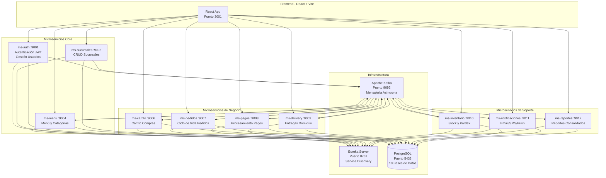

### **Guion:**

> "Esta es la arquitectura general. Tenemos 10 microservicios Java 21 con Spring Boot 3.5, cada uno con su propia base de datos PostgreSQL — esto es el patrón Database per Service. Todos se registran en Eureka para descubrimiento de servicios. La comunicación entre ellos usa dos patrones: Feign para llamadas síncronas —cuando necesito respuesta inmediata— y Kafka para eventos asíncronos —cuando múltiples servicios deben reaccionar sin bloquear al productor."

---

## 3. ¿Por qué Microservicios? (1 min)

### Ventajas de esta arquitectura

| Ventaja | Evidencia en el proyecto |
|---|---|
| **Escalabilidad independiente** | ms-pedidos puede escalar en hora punta sin tocar ms-menu ni ms-auth |
| **Despliegue autónomo** | Un cambio en ms-inventario no requiere redesplegar todo el sistema |
| **Aislamiento de fallos** | Si ms-notificaciones cae, los pedidos se siguen creando |
| **Tecnología adecuada por dominio** | ms-auth usa Spring Security; ms-pedidos usa Kafka; cada uno solo depende de lo que necesita |
| **Database per Service** | Cada MS tiene su BD aislada — no hay FK entre bases de datos |
| **Equipos autónomos** | Cada microservicio puede ser desarrollado por una persona distinta |

### **Guion:**

> "Elegí microservicios por cinco razones. Primero, escalabilidad: si hay 100 pedidos simultáneos, solo escalo ms-pedidos, no todo el sistema. Segundo, despliegue independiente: puedo actualizar ms-menu sin tumbar los pagos. Tercero, aislamiento de fallos: si las notificaciones fallan, los pedidos se siguen procesando. Cuarto, cada servicio usa solo las dependencias que necesita. Y quinto, cada microservicio tiene su propia base de datos —esto es clave: no hay foreign keys entre bases de datos de distintos servicios."

---

## 4. Comunicación Síncrona: Feign (1.5 min)

### Diagrama de llamadas Feign

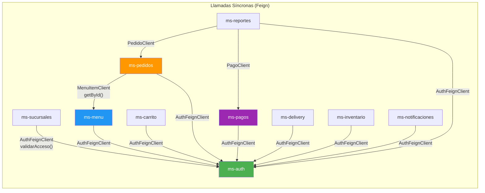

### ¿Cuándo usar Feign?

Feign se usa cuando el servicio **necesita respuesta inmediata** para continuar su operación. Es una llamada bloqueante: el servicio que llama espera la respuesta.

### Tabla de justificación Feign

| Cliente | Origen → Destino | ¿Por qué síncrono? |
|---|---|---|
| `AuthFeignClient` | 9 MS → ms-auth | **Autorización**: No puedo crear un pedido si no sé si el usuario tiene permiso. La respuesta debe ser inmediata. |
| `MenuItemClient` | ms-pedidos → ms-menu | **Precio en tiempo real**: Para calcular el total del pedido necesito el precio actual del ítem del menú ahora, no después. |
| `PagoClient` | ms-reportes → ms-pagos | **Consulta bajo demanda**: El reporte se genera cuando el admin lo pide; necesita datos de pago actualizados en ese momento. |
| `PedidoClient` | ms-reportes → ms-pedidos | **Consulta bajo demanda**: Misma razón — el reporte necesita datos de pedidos actuales al generarse. |

### **Guion:**

> "Para comunicación síncrona uso Feign, que es un cliente HTTP declarativo integrado con Eureka. El caso principal es AuthFeignClient: 9 de los 10 microservicios llaman a ms-auth para validar si un usuario tiene permiso para realizar una operación. Esto DEBE ser síncrono: no puedo crear un pedido sin saber si el usuario está autorizado. También ms-pedidos consulta a ms-menu vía Feign para obtener el precio actual de un ítem —necesito ese dato en tiempo real para calcular el total. Y ms-reportes consulta a ms-pagos y ms-pedidos para generar reportes bajo demanda. En todos estos casos, la respuesta es necesaria AHORA, no después."

---

## 5. Comunicación Asíncrona: Kafka (2 min)

### Diagrama de topics y consumidores

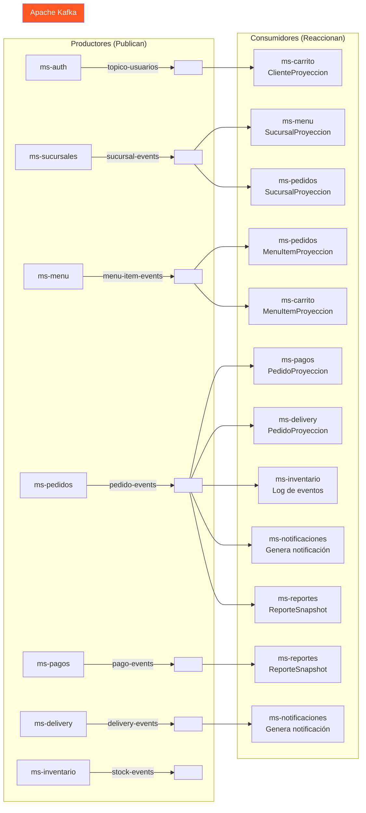

### ¿Cuándo usar Kafka?

Kafka se usa cuando un evento de negocio debe ser **consumido por múltiples servicios sin bloquear al productor**. El productor publica el evento y continúa —no espera respuesta.

### Tabla de justificación Kafka

| Topic | Productor | Consumidores | ¿Por qué asíncrono? |
|---|---|---|---|
| `pedido-events` | ms-pedidos | pagos, delivery, inventario, notificaciones, reportes | **Desacoplamiento**: 5 servicios reaccionan al pedido. Si uno falla, los demás siguen. El pedido se crea aunque ms-pagos esté caído. |
| `menu-item-events` | ms-menu | pedidos, carrito | **CQRS**: En vez de llamar a ms-menu cada vez que se necesita un precio, los datos se replican localmente. Esto elimina latencia de red en lecturas. |
| `sucursal-events` | ms-sucursales | menu, pedidos | **Replicación**: Datos de sucursal disponibles localmente en los MS que los necesitan para filtrar menús y pedidos por sucursal. |
| `pago-events` | ms-pagos | reportes | **Alimentación de reportes**: El resultado de cada pago alimenta el sistema de reportes sin acoplar los servicios. |
| `delivery-events` | ms-delivery | notificaciones | **Notificaciones desacopladas**: Cuando cambia el estado de un delivery, se notifica al cliente sin que delivery sepa cómo enviar notificaciones. |
| `topico-usuarios` | ms-auth | carrito | **Datos de cliente locales**: ms-carrito necesita datos del cliente para mostrar el carrito, pero no debe llamar a ms-auth por cada consulta. |
| `stock-events` | ms-inventario | (futuro dashboard) | **Alertas de stock bajo**: Preparado para que un futuro dashboard de alertas consuma eventos de stock sin acoplamiento. |

### **Guion:**

> "Para comunicación asíncrona uso Apache Kafka con 7 topics. El caso más importante es `pedido-events`: cuando se crea un pedido, ms-pedidos publica un evento y 5 servicios reaccionan de forma independiente —pagos, delivery, inventario, notificaciones y reportes. Esto es clave: si ms-pagos está caído, el pedido se crea igual. Kafka retiene el mensaje y cuando ms-pagos se recupera, lo procesa.
>
> Este patrón se llama CQRS: en vez de llamar a otro servicio por cada consulta, los datos se replican localmente mediante eventos. Por ejemplo, cuando ms-menu crea un ítem, publica `menu-item-events` y tanto ms-pedidos como ms-carrito actualizan su copia local. Así, cuando un cliente ve el menú, ms-carrito no necesita llamar a ms-menu —ya tiene los datos localmente. Esto elimina latencia de red y evita que una caída de ms-menu tumbe el carrito de compras."

---

## 6. ¿Por qué Kafka aquí y Feign allá? — La decisión clave (1 min)

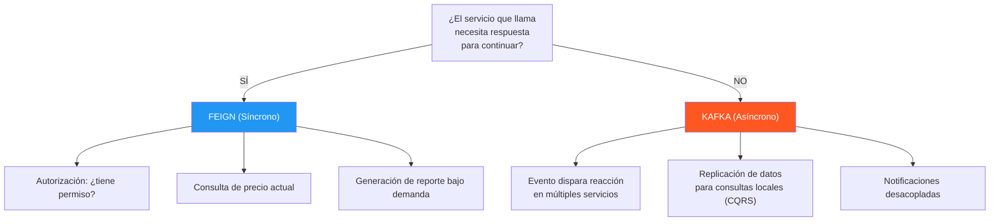

### Regla de decisión

| Si... | Entonces usa... | Porque... |
|---|---|---|
| El resultado determina si la operación continúa o no | **Feign** | No puedes proceder sin saber la respuesta |
| La operación debe completarse aunque el receptor no esté disponible | **Kafka** | El productor no debe bloquearse por un consumidor caído |
| Múltiples servicios necesitan reaccionar al mismo evento | **Kafka** | Un publicador, muchos suscriptores desacoplados |
| Necesitas datos actualizados en el momento exacto de la consulta | **Feign** | Kafka tiene latencia de consumo |
| Quieres evitar llamadas de red en cada lectura (CQRS) | **Kafka** | Los datos se replican proactivamente; las lecturas son locales |

### **Guion:**

> "Esta es probablemente la decisión arquitectónica más importante del proyecto. La regla es simple: si la respuesta determina si puedo continuar o no, uso Feign. Si el evento debe disparar reacciones en otros servicios sin bloquear al productor, uso Kafka.
>
> Ejemplo concreto: cuando un mesero crea un pedido, primero consulto a ms-auth vía Feign: '¿este mesero tiene permiso para crear pedidos?' Si la respuesta es no, el pedido no se crea —necesito esa respuesta ya. Pero una vez creado el pedido, publico un evento a Kafka. Que ms-pagos procese el cobro, que ms-delivery asigne repartidor, que ms-notificaciones avise al cliente —todo eso ocurre después, sin bloquear al mesero. Si las notificaciones fallan, el pedido ya está creado."

---

## 7. Flujos de Negocio (3 min)

### 7.1 Flujo de Autenticación y Autorización

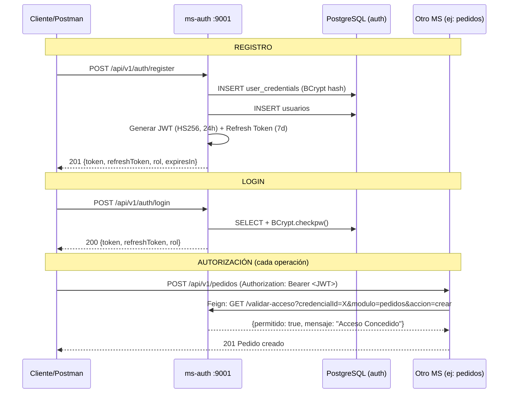

### **Guion flujo auth:**

> "El flujo de autenticación tiene tres fases. Primero, el registro: el usuario envía email y password, que se hashea con BCrypt antes de guardar —nunca almacenamos contraseñas en texto plano. El sistema devuelve un JWT firmado con HMAC-SHA256 que expira en 24 horas, más un refresh token de 7 días.
>
> En el login, se compara el hash BCrypt. Si coincide, se genera un nuevo par de tokens.
>
> Pero lo más interesante es la autorización: cada vez que un microservicio recibe una petición, llama a ms-auth vía Feign con el credencialId, el módulo y la acción. ms-auth verifica el rol del usuario y responde si tiene permiso. Por ejemplo, un cliente no puede crear ítems del menú, pero un admin sí. Esto implementa el patrón zero-trust: ningún microservicio confía en el token por sí solo; siempre valida contra la fuente de autoridad."

### 7.2 Flujo de Crear Pedido (el más importante)

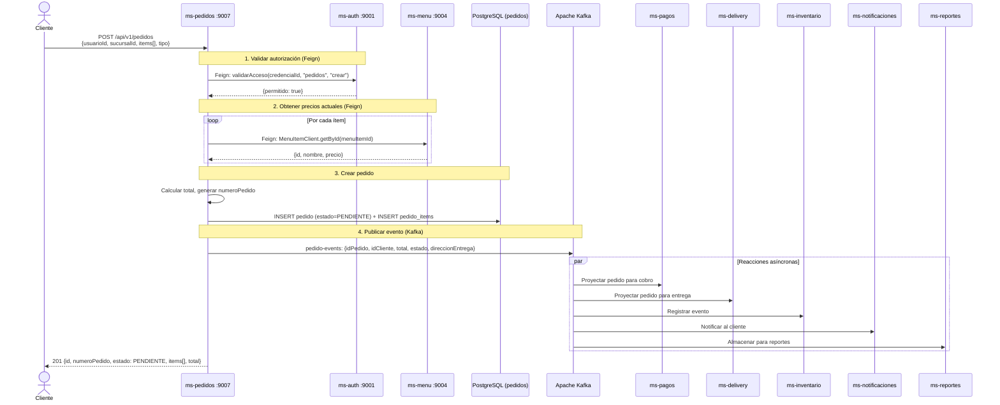

### **Guion flujo pedido:**

> "Este es el flujo más importante del sistema. Cuando un cliente crea un pedido, ocurren 4 pasos. Primero, validación de autorización vía Feign: ¿este usuario puede crear pedidos? Segundo, para cada ítem del pedido, consulto a ms-menu vía Feign para obtener el precio actual —necesito el precio real, no una copia vieja. Tercero, creo el pedido en estado PENDIENTE, genero un número de pedido único, y guardo en la base de datos.
>
> Y aquí viene lo clave —el cuarto paso: publico un evento `pedido-events` a Kafka. A partir de este momento, 5 servicios reaccionan de forma independiente y asíncrona: ms-pagos proyecta el pedido para cobrarlo, ms-delivery lo proyecta para asignar repartidor, ms-inventario registra el evento para trazabilidad de stock, ms-notificaciones genera una notificación al cliente, y ms-reportes almacena un snapshot para reportes futuros. Todo esto ocurre sin que ms-pedidos espere ni se bloquee. Si ms-notificaciones está caído, el pedido ya está creado y el evento se procesará cuando se recupere."

### 7.3 Flujo de Pago

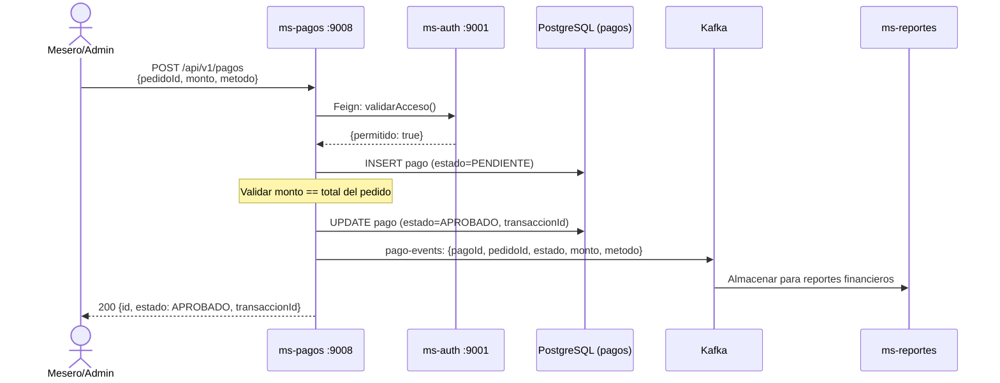

### **Guion flujo pago:**

> "El flujo de pago sigue el mismo patrón: autorización vía Feign, creación del pago, y publicación del evento `pago-events` a Kafka para que ms-reportes lo almacene. La validación de transiciones de estado —por ejemplo, no se puede aprobar un pago ya reembolsado— está implementada con un mapa de transiciones válidas, que es una máquina de estados simple pero efectiva."

### 7.4 Flujo de Delivery

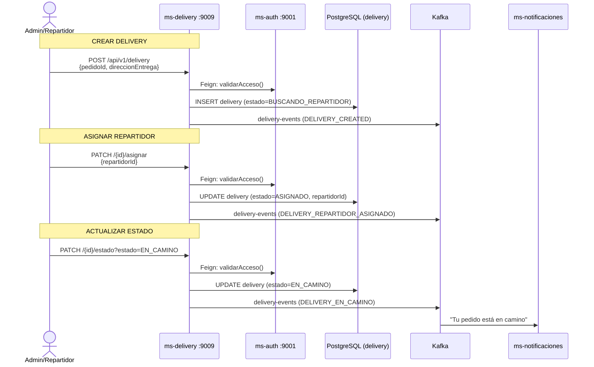

### **Guion flujo delivery:**

> "El delivery tiene un ciclo de vida con 5 estados: buscando repartidor, asignado, en camino, entregado y cancelado. Cada cambio de estado publica un evento a Kafka en el topic `delivery-events`, y ms-notificaciones consume estos eventos para notificar al cliente —'tu pedido está en camino', 'tu pedido fue entregado'. De nuevo, el desacoplamiento es clave: ms-delivery no sabe cómo enviar notificaciones, solo publica eventos. ms-notificaciones decide si es email, SMS o push."

### 7.5 Patrón CQRS: Proyecciones

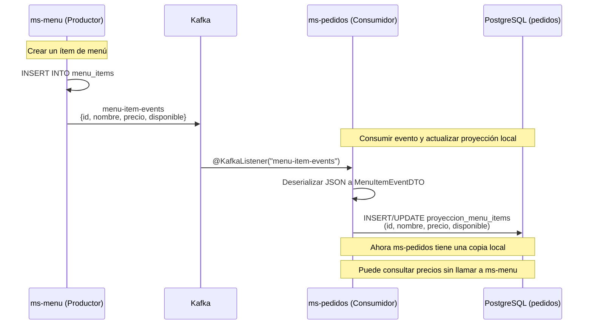

### **Guion CQRS:**

> "Este es el patrón CQRS con proyecciones. En lugar de que ms-pedidos llame a ms-menu cada vez que necesita el precio de un ítem, ms-menu publica un evento cada vez que crea o modifica un ítem. ms-pedidos consume ese evento y actualiza una tabla local llamada `proyeccion_menu_items`. El resultado: cuando ms-pedidos necesita mostrar el menú o calcular un total, lee de su propia base de datos local —cero latencia de red, cero dependencia de que ms-menu esté disponible. Si ms-menu se cae, ms-pedidos sigue funcionando con la última copia de los datos. Esto se replica para sucursales, clientes, y pedidos en todos los microservicios que los necesitan."

---

## 8. Capas Internas de un Microservicio (1 min)

### Patrón CSR (Controller → Service → Repository)

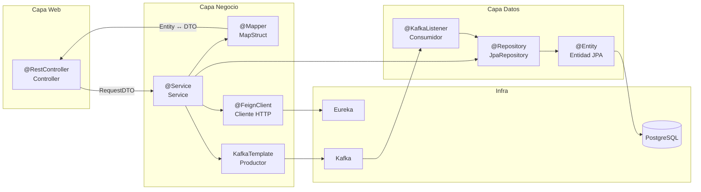

### Estructura de paquetes

```
cl.triskeledu.<microservicio>/
├── client/          → @FeignClient (llamadas a otros MS)
├── config/          → CORS, configuración
├── controller/      → @RestController (endpoints HTTP)
├── dto/
│   ├── request/     → DTOs de entrada (con @Valid)
│   ├── response/    → DTOs de salida
│   └── event/       → DTOs para Kafka
├── entity/          → @Entity JPA
├── exception/       → Excepciones + @RestControllerAdvice
├── listener/        → @KafkaListener (consumidores)
├── mapper/          → MapStruct (Entity ↔ DTO)
├── proyecciones/    → Entidades CQRS (réplicas locales)
├── repository/      → JpaRepository
└── service/impl/    → @Service (lógica de negocio)
```

### **Guion:**

> "Todos los microservicios siguen la misma estructura de paquetes y el patrón CSR: Controller recibe la petición HTTP y delega al Service. El Service contiene la lógica de negocio: valida permisos vía Feign, aplica reglas, usa el Repository para persistir, y opcionalmente publica eventos a Kafka. Los DTOs separan la representación externa de la entidad interna —nunca exponemos la entidad JPA directamente. MapStruct genera el mapeo Entity↔DTO en tiempo de compilación, sin reflexión. Y el GlobalExceptionHandler centraliza todos los errores en un solo lugar, devolviendo siempre el mismo formato JSON."

---

## 9. Errores, Validaciones y Logs (1 min)

### Manejo centralizado de errores

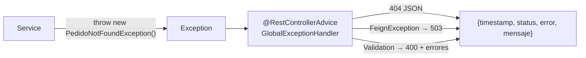

### **Guion:**

> "Todos los errores se manejan de forma centralizada con `@RestControllerAdvice`. Cada microservicio define sus excepciones de negocio —como PedidoNotFoundException— y el GlobalExceptionHandler las intercepta y devuelve un JSON estructurado con timestamp, status HTTP, tipo de error y mensaje. Esto garantiza que el frontend siempre reciba el mismo formato de error, sin stacks traces.
>
> Un detalle importante: las excepciones de Feign —cuando un microservicio no responde— se manejan como 503 Service Unavailable, no como 500. Y si ms-auth no está disponible, los servicios entran en 'modo degradado': permiten la operación pero registran un warning. Así evitamos que una caída de ms-auth tumbe todo el sistema."

---

## 10. Evidencia Final (2 min)

### Evidencia a mostrar en el video

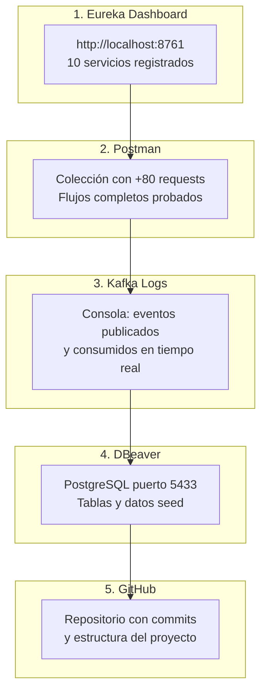

### Checklist de evidencia

| # | Qué mostrar | Dónde | Tiempo |
|---|---|---|---|
| 1 | Eureka Dashboard | `http://localhost:8761` | 20s |
| 2 | Login + obtener JWT | Postman → ms-auth :9001 | 30s |
| 3 | Crear pedido completo | Postman → ms-pedidos :9007 | 60s |
| 4 | Ver evento Kafka en logs | Consola ms-pagos/delivery | 30s |
| 5 | Ver proyección actualizada | DBeaver → BD pagos/delivery | 20s |
| 6 | Probar error (404, 401) | Postman → respuesta JSON | 20s |
| 7 | GitHub: mostrar commits | Navegador → repositorio | 20s |
| 8 | Código: mostrar ServiceImpl | IDE → archivo clave | 30s |

### **Guion cierre:**

> "Para demostrar que todo funciona, vamos a verlo en vivo. Primero, Eureka: todos los microservicios registrados. Luego en Postman, hago login, obtengo el JWT, y creo un pedido completo. Inmediatamente vemos en los logs de ms-pagos y ms-delivery cómo reciben el evento de Kafka y actualizan sus proyecciones. En DBeaver confirmamos que las tablas tienen los datos correctos. Y finalmente en GitHub, mostramos los commits que evidencian el trabajo realizado.
>
> Esta arquitectura de microservicios con comunicación híbrida Feign+Kafka, patrón CQRS con proyecciones, y manejo centralizado de errores, permite que el sistema sea escalable, resiliente y mantenible —cada servicio evoluciona de forma independiente sin afectar al resto."

---

## Orden Recomendado para el Video (12-14 min)

| # | Sección | Tiempo | Acumulado |
|---|---|---|---|
| 1 | Introducción y problema | 1:00 | 1:00 |
| 2 | Arquitectura general (diagrama Mermaid) | 2:00 | 3:00 |
| 3 | ¿Por qué microservicios? | 1:00 | 4:00 |
| 4 | Comunicación: Feign (diagrama) | 1:30 | 5:30 |
| 5 | Comunicación: Kafka (diagrama) | 2:00 | 7:30 |
| 6 | ¿Por qué Kafka vs Feign? (decisión clave) | 1:00 | 8:30 |
| 7 | Flujos de negocio (3 diagramas secuencia) | 2:30 | 11:00 |
| 8 | Capas internas, errores y logs | 1:00 | 12:00 |
| 9 | Evidencia en vivo (Postman, Eureka, logs) | 2:00 | 14:00 |

---

## Resumen de Diagramas Mermaid Incluidos

| # | Diagrama | Tipo | Página |
|---|---|---|---|
| 1 | Arquitectura General | `graph TB` | Sección 2 |
| 2 | Llamadas Feign | `graph LR` | Sección 4 |
| 3 | Topics y Consumidores Kafka | `graph LR` | Sección 5 |
| 4 | Decisión Feign vs Kafka | `graph TD` | Sección 6 |
| 5 | Secuencia: Autenticación | `sequenceDiagram` | Sección 7.1 |
| 6 | Secuencia: Crear Pedido | `sequenceDiagram` | Sección 7.2 |
| 7 | Secuencia: Pago | `sequenceDiagram` | Sección 7.3 |
| 8 | Secuencia: Delivery | `sequenceDiagram` | Sección 7.4 |
| 9 | Secuencia: CQRS Proyecciones | `sequenceDiagram` | Sección 7.5 |
| 10 | Capas Internas CSR | `graph LR` | Sección 8 |
| 11 | Manejo de Errores | `graph LR` | Sección 9 |
| 12 | Evidencia Final | `graph TB` | Sección 10 |
