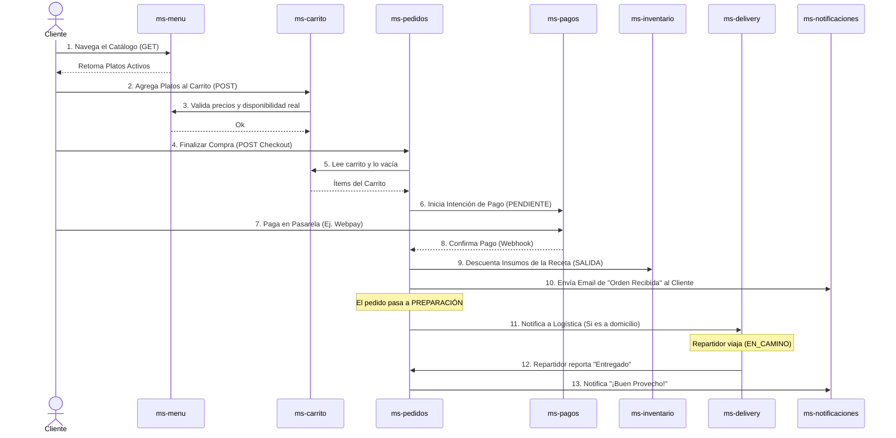
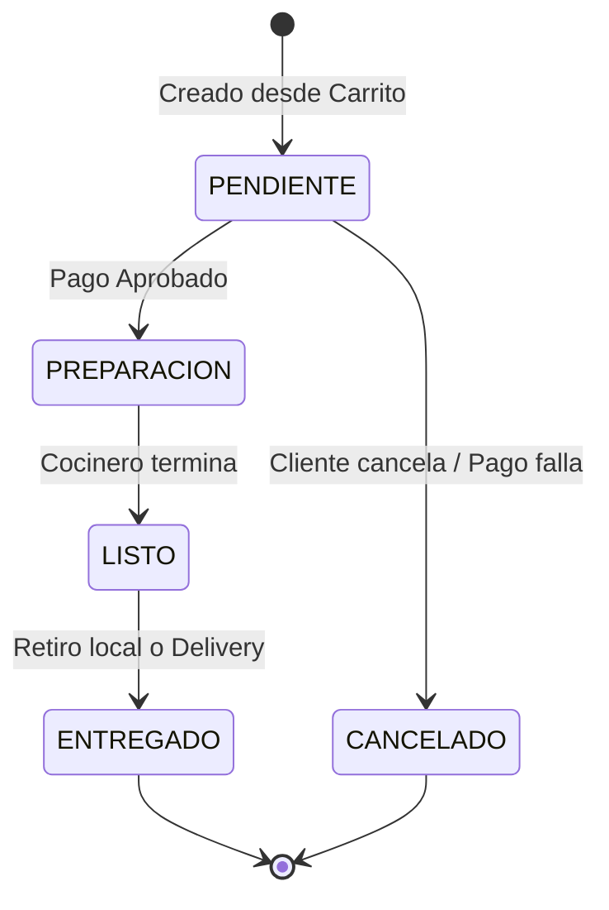
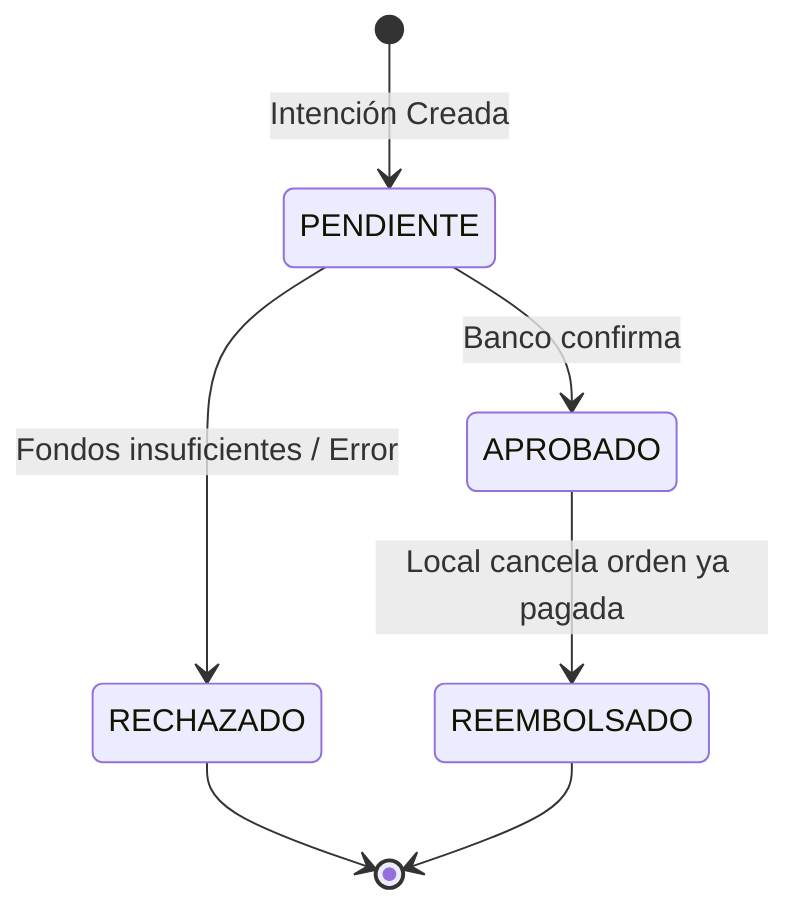
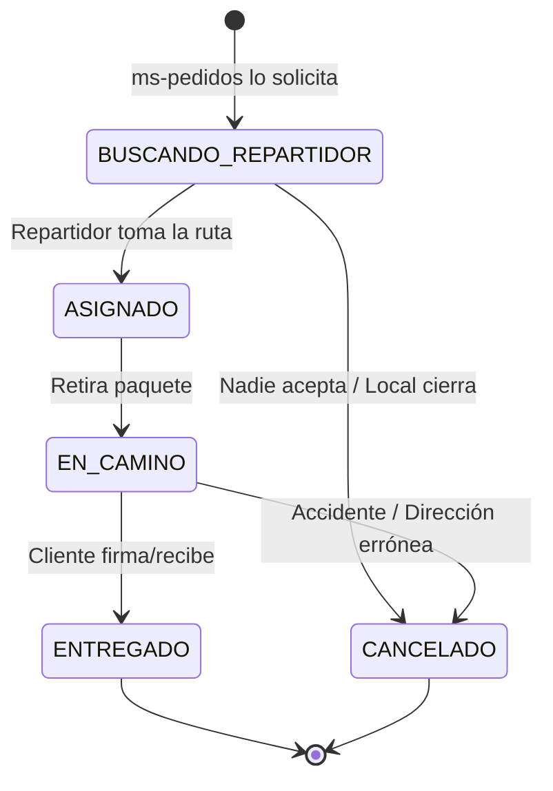

# 📈 Diagramas de Flujo y Arquitectura

Este documento contiene diagramas visuales generados con **Mermaid** para comprender la arquitectura, el flujo de operaciones principales y las máquinas de estados del ecosistema de microservicios del restaurante.

---

## 1. Diagrama de Arquitectura (Interacciones Feign)

El siguiente diagrama muestra el principio "Database per Service" y cómo los microservicios se comunican entre sí de forma declarativa (via Feign) para enriquecer datos o delegar procesos.

```mermaid
graph TD
    %% Definición de Nodos (Microservicios)
    Gateway[API Gateway / Frontend] --> Auth(ms-auth\n[9001])
    Gateway --> Pedidos(ms-pedidos\n[9007])
    Gateway --> Menu(ms-menu\n[9004])
    Gateway --> Carrito(ms-carrito\n[9006])
    
    Auth -.->|Registra perfil| Usuarios(ms-usuarios\n[9002])
    
    Pedidos -.->|Verifica dueño| Usuarios
    Pedidos -.->|Verifica lugar| Sucursales(ms-sucursales\n[9003])
    Pedidos -.->|Verifica precio/stock| Menu
    Pedidos -.->|Descuenta stock| Inventario(ms-inventario\n[9010])
    Pedidos -.->|Paga orden| Pagos(ms-pagos\n[9008])
    Pedidos -.->|Si es envío| Delivery(ms-delivery\n[9009])
    
    Menu -.->|Asocia| Categorias(ms-categorias\n[9005])
    Menu -.->|Disponibilidad| Sucursales
    
    Carrito -.->|Revisa precio| Menu
    Carrito -.->|Revisa ubicación| Sucursales
    
    Inventario -.->|Verifica sucursal| Sucursales
    
    %% Alertas
    Pagos -.->|Recibo| Notificaciones(ms-notificaciones\n[9011])
    Delivery -.->|Tracking| Notificaciones
    Inventario -.->|Alerta stock| Notificaciones
    
    %% Agregación
    Reportes(ms-reportes\n[9012]) -.->|Lee Ventas| Pedidos
    Reportes -.->|Lee Gastos| Inventario
    Reportes -.->|Lee Ingresos| Pagos

    %% Bases de Datos
    Auth --- db1[(DB auth)]
    Usuarios --- db2[(DB users)]
    Sucursales --- db3[(DB sucursales)]
    Categorias --- db4[(DB cat)]
    Menu --- db5[(DB menu)]
    Carrito --- db6[(DB carrito)]
    Pedidos --- db7[(DB pedidos)]
    Pagos --- db8[(DB pagos)]
    Delivery --- db9[(DB delivery)]
    Inventario --- db10[(DB inv)]
    Notificaciones --- db11[(DB notif)]
    Reportes --- db12[(DB reports)]
```

---

## 2. Diagrama de Flujo de Uso (Core Business)

El "Camino Feliz" (Happy Path) desde que un cliente entra a la aplicación hasta que la comida llega a su mesa o puerta.



---

## 3. Diagramas de Estado

Las máquinas de estados finitos son cruciales en 3 microservicios para evitar inconsistencias lógicas.

### 3.1 Estados del Pedido (`ms-pedidos`)


### 3.2 Estados del Pago (`ms-pagos`)


### 3.3 Estados de Delivery (`ms-delivery`)

