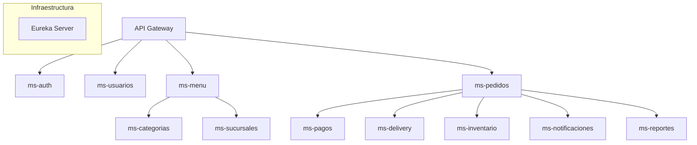

# 📐 Arquitectura y Principios de Diseño

## 1. Topología del Sistema
El sistema se compone de 12 microservicios de negocio y servicios de infraestructura que se comunican entre sí principalmente de forma síncrona mediante **OpenFeign**.

## 2. Principios de Diseño
*   **Database per Service:** Cada microservicio tiene su propia instancia/base de datos PostgreSQL. No existe acceso compartido a nivel de datos.
*   **Aislamiento de Dominio:** Los servicios solo se comunican vía APIs REST. Las relaciones entre servicios se manejan mediante IDs lógicos (`Long productId`), no por claves foráneas de BD.
*   **Comunicación Síncrona:** Uso de OpenFeign para llamadas entre servicios (ej: Pedidos valida stock en Inventario).

## 3. Estándar de Capas (SOP)
Todos los microservicios deben seguir estrictamente la siguiente estructura de paquetes:

| Capa | Responsabilidad |
| :--- | :--- |
| **Controller** | Recibe peticiones HTTP, valida sintaxis con `@Valid` y delega al Service. |
| **Service** | Contiene la lógica de negocio, validaciones de dominio y orquestación. |
| **Repository** | Interfaz JPA para persistencia y consultas personalizadas. |
| **Entity** | Mapeo objeto-relacional (JPA/Hibernate) fuente de verdad de la BD. |
| **DTO (Req/Res)** | Objetos de transferencia desacoplados de la entidad para el exterior. |
| **Mapper** | Conversión bidireccional entre Entity y DTO usando MapStruct. |
| **Client** | Definición de interfaces Feign para llamadas externas. |

## 4. Mapa de Servicios y Puertos

| Servicio | Puerto | Base de Datos |
| :--- | :--- | :--- |
| Eureka | 8761 | N/A |
| ms-auth | 9001 | db_auth |
| ms-usuarios | 9002 | db_usuarios |
| ms-sucursales | 9003 | db_sucursales |
| ms-categorias | 9004 | db_categorias |
| ms-menu | 9005 | db_menu |
| ms-carrito | 9006 | db_carrito |
| ms-pedidos | 9007 | db_pedidos |
| ms-pagos | 9008 | db_pagos |
| ms-delivery | 9009 | db_delivery |
| ms-inventario | 9010 | db_inventario |
| ms-notificaciones | 9011 | db_notif |
| ms-reportes | 9012 | db_reportes |
