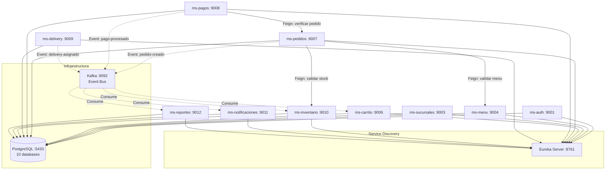

# 📐 Arquitectura y Principios de Diseño

## 1. Topología del Sistema
El sistema se compone de **10 microservicios de negocio** más servicios de infraestructura (Eureka, PostgreSQL, Kafka) que se comunican de forma **híbrida**: síncrona mediante **OpenFeign** y asíncrona mediante **Apache Kafka** (patrón CQRS).

```mermaid
graph TD
    subgraph "Service Discovery"
        EU[Eureka Server :8761]
    end

    subgraph "Infraestructura"
        PG[(PostgreSQL :5433<br/>10 databases)]
        KF[Kafka :9092<br/>Event Bus]
    end

    Auth[ms-auth :9001] --> EU
    Menu[ms-menu :9004] --> EU
    Suc[ms-sucursales :9003] --> EU
    Car[ms-carrito :9006] --> EU
    Ped[ms-pedidos :9007] --> EU
    Pag[ms-pagos :9008] --> EU
    Del[ms-delivery :9009] --> EU
    Inv[ms-inventario :9010] --> EU
    Not[ms-notificaciones :9011] --> EU
    Rep[ms-reportes :9012] --> EU
    
    Auth --> PG
    Menu --> PG
    Suc --> PG
    Car --> PG
    Ped --> PG
    Pag --> PG
    Del --> PG
    Inv --> PG
    Not --> PG
    Rep --> PG

    Ped -.->|Event: pedido-creado| KF
    Pag -.->|Event: pago-procesado| KF
    Del -.->|Event: delivery-asignado| KF
    KF -.->|Consume| Inv
    KF -.->|Consume| Not
    KF -.->|Consume| Rep
    KF -.->|Consume| Car

    Ped -->|Feign: validar menu| Menu
    Ped -->|Feign: validar stock| Inv
    Pag -->|Feign: verificar pedido| Ped
```

## 2. Principios de Diseño
*   **Database per Service:** Cada microservicio tiene su propia base de datos PostgreSQL (10 BDs). No existe acceso compartido a nivel de datos.
*   **Aislamiento de Dominio:** Los servicios solo se comunican vía APIs REST o eventos Kafka. Las relaciones entre servicios se manejan mediante **IDs lógicos** (`Long`), no por claves foráneas JPA cross-service.
*   **Comunicación Híbrida:** Síncrona (OpenFeign + Eureka) para consultas inmediatas. Asíncrona (Kafka + CQRS) para eventos de dominio y proyecciones.
*   **Gestión Eficiente de Conexiones (HikariCP):** Cada microservicio limita su pool a `maximum-pool-size: 3` en desarrollo para evitar saturar PostgreSQL. En producción se recomienda PgBouncer.
*   **Seguridad Centralizada:** Todos los microservicios validan JWT mediante un `AuthFeignClient` que consulta a `ms-auth`. El header `X-Credencial-Id` se propaga en llamadas Feign.

## 3. Estándar de Capas (CSR — Controller → Service → Repository)
Todos los microservicios siguen estrictamente esta estructura de paquetes:

| Capa | Responsabilidad |
| :--- | :--- |
| **Controller** | Recibe peticiones HTTP, valida sintaxis con `@Valid` y delega al Service. |
| **Service (Interface + Impl)** | Contiene la lógica de negocio, validaciones de dominio y orquestación. |
| **Repository** | Interfaz JPA para persistencia y consultas personalizadas. |
| **Entity** | Mapeo objeto-relacional (JPA/Hibernate) con `ddl-auto: update`. |
| **DTO (Request/Response)** | Objetos de transferencia desacoplados de la entidad para el exterior. |
| **Mapper** | Conversión bidireccional Entity ↔ DTO usando MapStruct. |
| **Client (Feign)** | Definición de interfaces Feign para comunicación entre servicios. |
| **Security** | Filtro JWT, `AuthFeignClient` para validación de tokens. |
| **Kafka (Listener/Producer)** | Consumo y producción de eventos de dominio. |
| **Exception** | Clases de excepción personalizadas + `@RestControllerAdvice`. |

## 4. Mapa de Servicios y Puertos

| Servicio | Puerto | Base de Datos | Kafka | Estado |
| :--- | :--- | :--- | :--- | :--- |
| Eureka Server | 8761 | — | — | ✅ |
| ms-auth | 9001 | `auth` | Producer | ✅ 100% |
| ms-sucursales | 9003 | `sucursales` | Producer | 🔶 Scaffolding |
| ms-menu | 9004 | `menu` | Consumer + Producer | ✅ 100% |
| ms-carrito | 9006 | `carrito` | Consumer | 🔶 Scaffolding |
| ms-pedidos | 9007 | `pedidos` | Consumer + Producer | ✅ 100% |
| ms-pagos | 9008 | `pagos` | Consumer + Producer | 🔶 Scaffolding |
| ms-delivery | 9009 | `delivery` | Consumer + Producer | 🔶 Scaffolding |
| ms-inventario | 9010 | `inventario` | Consumer + Producer | ✅ 100% |
| ms-notificaciones | 9011 | `notificaciones` | Consumer + Producer | 🔶 Scaffolding |
| ms-reportes | 9012 | `reportes` | Consumer | 🔶 Scaffolding |

> **Nota:** Los puertos 9002 y 9005 están intencionalmente vacíos (correspondían a `ms-usuarios` y `ms-categorias`, fusionados en `ms-auth` y `ms-menu` respectivamente durante la migración v12→v10).

## 5. Stack Tecnológico

| Componente | Versión |
| :--- | :--- |
| Java | 21 |
| Spring Boot | 3.5.14 |
| Spring Cloud | 2025.0.0 |
| PostgreSQL | 15 (Docker, puerto 5433) |
| Apache Kafka | Confluent 7.5.0 (Docker, puerto 9092) |
| MapStruct | 1.5.5.Final |
| Lombok | 1.18.44 |
| JWT (jjwt) | 0.11.5 |
| Node.js | 22+ |
| React | 19 |
| Vite | 8 |
