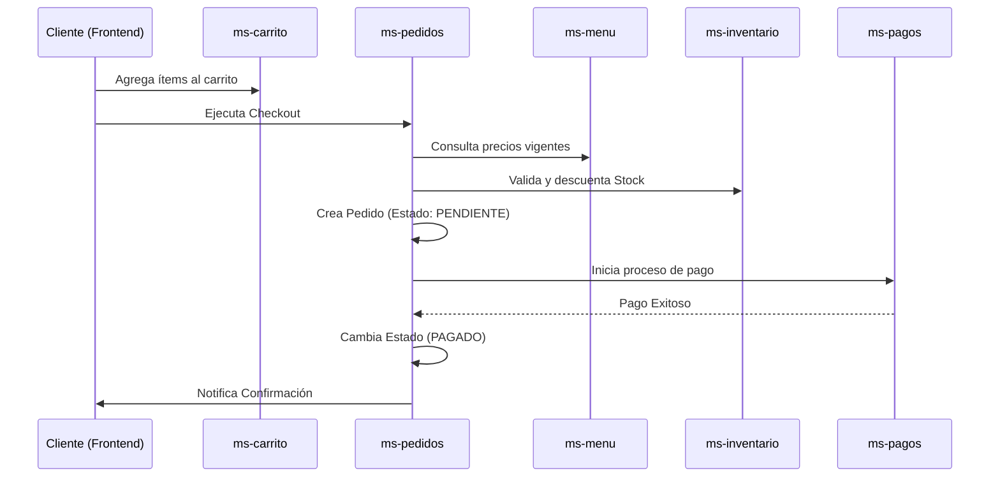

# 🔁 Flujos y Reglas de Negocio Transversales

## 1. Flujo de Compra (End-to-End)
Este es el proceso principal del sistema, involucrando múltiples microservicios:

## 2. Reglas de Negocio Críticas
*   **Validación de Stock:** No se puede confirmar un pedido si alguno de los ítems en `ms-inventario` tiene stock < cantidad solicitada.
*   **Inmutabilidad de Precios:** Una vez creado el pedido, el precio de los ítems se congela. Cambios posteriores en `ms-menu` no afectan pedidos existentes.
*   **Restricción de Rol:** Solo un usuario con `ROLE_RP` (Repartidor) puede cambiar el estado de un pedido a `EN_CAMINO` o `ENTREGADO`.

## 3. Estados del Pedido
1.  `PENDIENTE`: Creado pero sin pago confirmado.
2.  `PAGADO`: Confirmación recibida de `ms-pagos`.
3.  `EN_PREPARACION`: El `COCINERO` aceptó la orden.
4.  `LISTO`: Preparación finalizada.
5.  `EN_CAMINO`: El `REPARTIDOR` retiró el pedido.
6.  `ENTREGADO`: Cliente recibió el producto.
