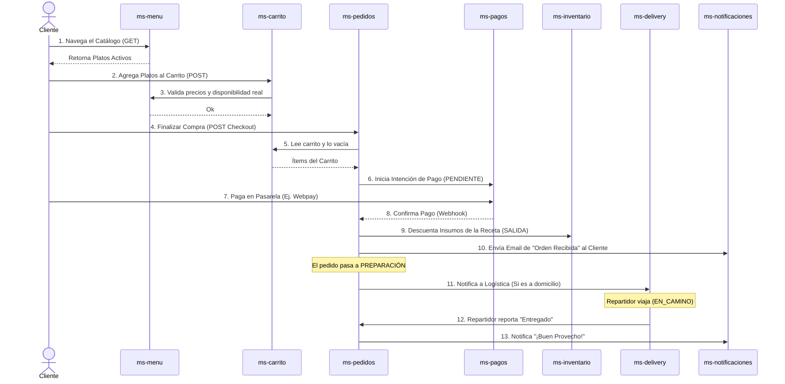
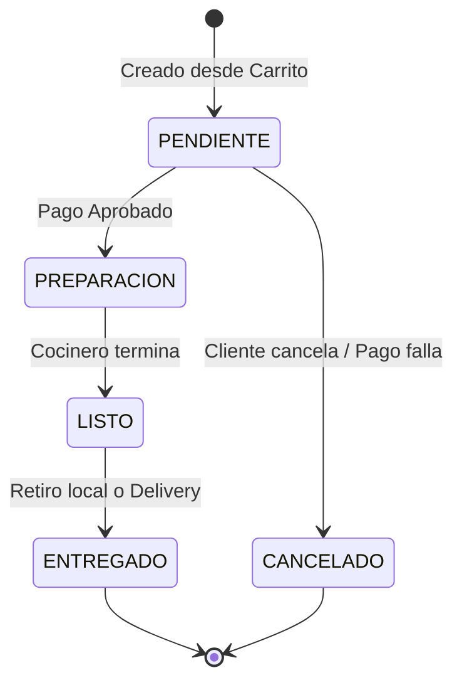
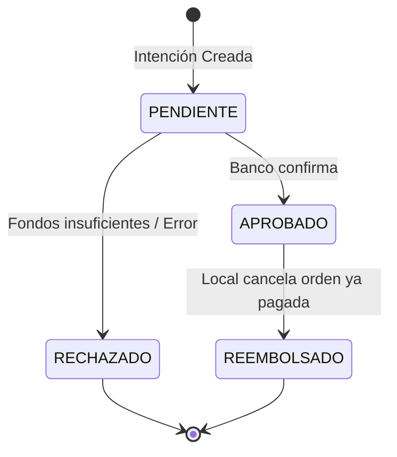
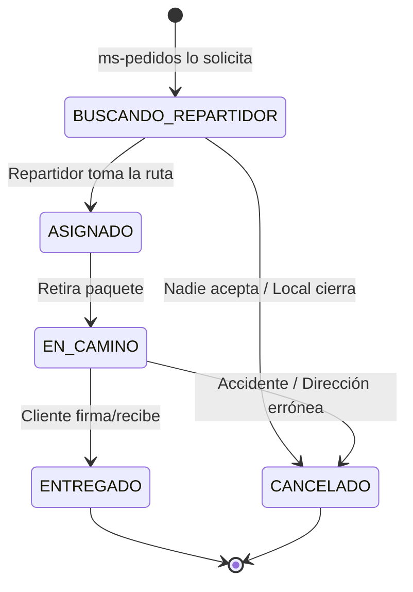
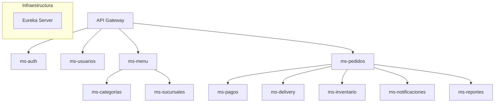
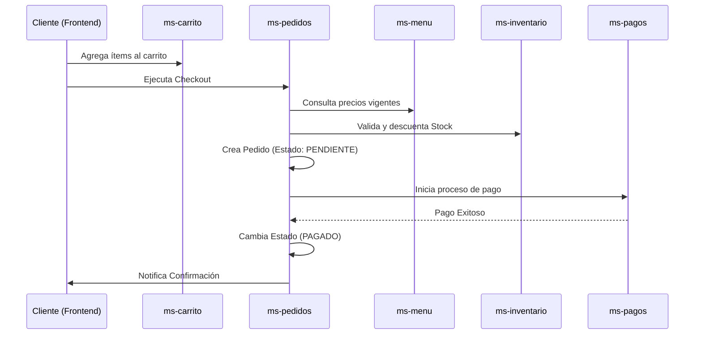

# Contenido del Proyecto

### Archivo: README.md
```md
# 🍽️ Restaurant Platform — Arquitectura de Microservicios

> **Stack:** Java 21 · Spring Boot 3.5 · Spring Cloud 2025 · PostgreSQL · Eureka · OpenFeign  
> **Grupo base:** `cl.triskeledu` · **Puerto Eureka:** `8761`

---

## 📐 Diagrama de Flujo — Los 12 Microservicios

```
                          ┌──────────────────────────┐
                          │      CLIENTE / FRONTEND  │
                          │  (React / Mobile / Admin)│
                          └──────────┬───────────────┘
                                     │  HTTP / REST
                          ┌──────────▼────────────────┐
                          │      API GATEWAY          │  (futuro: puerto 8080)
                          │  Enrutamiento + JWT Filter│
                          └─────┬──────────┬──────────┘
                                │          │
              ┌─────────────────┘          └─────────────────┐
              │                                              │
  ┌───────────▼──────────┐                      ┌────────────▼──────────┐
  │  ms-auth  (:9001)    │                      │  ms-usuarios (:9002)  │
  │  Login / JWT / Roles │◄────────────────────►│  CRUD Usuarios        │
  └──────────────────────┘                      └───────────────────────┘

  ┌──────────────────────┐    ┌──────────────────────┐
  │  ms-sucursales(:9003)│    │  ms-categorias(:9004) │
  │  Sucursales/Locales  │    │  Categorías de Menú   │
  └──────┬───────────────┘    └────────┬─────────────┘
         │                             │
  ┌──────▼──────────────────────────────▼───────────┐
  │              ms-menu (:9005)                    │
  │  Productos del menú · Precio · Stock referencial│
  └──────────────────┬──────────────────────────────┘
                     │
  ┌──────────────────▼─────────────────┐
  │        ms-carrito (:9006)          │
  │  Carrito temporal por usuario/mesa │
  │  Llama a ms-menu para precios      │
  └──────────────────┬─────────────────┘
                     │  (checkout → crea pedido)
  ┌──────────────────▼──────────────────────────────────────┐
  │                ms-pedidos (:9007)  ◄──── NÚCLEO ────    │
  │  Ciclo de vida completo del pedido (PENDIENTE→ENTREGADO)│
  │  Llama: ms-menu, ms-inventario, ms-pagos, ms-delivery   │
  └───────┬────────────────────┬────────────────────────────┘
          │                    │
  ┌───────▼──────────┐  ┌──────▼──────────────────┐
  │  ms-pagos(:9008) │  │  ms-delivery (:9009)    │
  │  Procesamiento   │  │  Asignación repartidor  │
  │  de pagos        │  │  y tracking             │
  └──────────────────┘  └─────────────────────────┘

  ┌──────────────────────────────────────────────────┐
  │           ms-inventario (:9010)                  │
  │  Stock físico por sucursal · Alertas de quiebre  │
  │  Consumido por ms-pedidos y ms-menu              │
  └──────────────────────────────────────────────────┘

  ┌──────────────────────────────────────────────────┐
  │         ms-notificaciones (:9011)                │
  │  Eventos de negocio → Email / Push / SMS         │
  │  Escucha cambios de estado en pedidos/pagos      │
  └──────────────────────────────────────────────────┘

  ┌──────────────────────────────────────────────────┐
  │           ms-reportes (:9012)                    │
  │  Dashboard consolidado · Métricas · KPIs         │
  │  Consulta READ-ONLY a otras BDs (o eventos)      │
  └──────────────────────────────────────────────────┘

  ┌──────────────────────────────────────────────────┐
  │         EUREKA SERVER (:8761)                    │
  │  Registro y descubrimiento de todos los servicios│
  └──────────────────────────────────────────────────┘
```

### Mapa de Puertos

| Servicio            | Puerto | Base de Datos            |
|---------------------|--------|--------------------------|
| Eureka              | 8761   | —                        |
| ms-auth             | 9001   | PostgreSQL: `auth`       |
| ms-usuarios         | 9002   | PostgreSQL: `usuarios`   |
| ms-sucursales       | 9003   | PostgreSQL: `sucursales` |
| ms-categorias       | 9004   | PostgreSQL: `categorias` |
| ms-menu             | 9005   | PostgreSQL: `menu`       |
| ms-carrito          | 9006   | PostgreSQL: `carrito`    |
| ms-pedidos          | 9007   | PostgreSQL: `pedidos`    |
| ms-pagos            | 9008   | PostgreSQL: `pagos`      |
| ms-delivery         | 9009   | PostgreSQL: `delivery`   |
| ms-inventario       | 9010   | PostgreSQL: `inventario` |
| ms-notificaciones   | 9011   | PostgreSQL: `notif`      |
| ms-reportes         | 9012   | PostgreSQL: `reportes`   |

---

## 👥 Roles del Sistema y Visibilidad en el Frontend

El sistema define 5 roles. Cada rol recibe un JWT con claim `roles`, que el frontend utiliza para condicionar la renderización de vistas y rutas.

| Rol               | Código    | Descripción                                         | Vistas habilitadas en Frontend                                                                 |
|-------------------|-----------|-----------------------------------------------------|-----------------------------------------------------------------------------------------------|
| **SUPER_ADMIN**   | `ROLE_SA` | Control total del sistema. Configura todos los MS.  | Todo: gestión de sucursales, usuarios, menú, inventario, reportes, pagos, delivery.           |
| **ADMIN**         | `ROLE_AD` | Administra su sucursal asignada.                    | Menú, carrito, pedidos, inventario de su sucursal, reportes básicos.                          |
| **COCINERO**      | `ROLE_CO` | Visualiza y actualiza pedidos en cocina.            | Vista de cola de pedidos (estado: PENDIENTE → EN_PREPARACION → LISTO).                       |
| **REPARTIDOR**    | `ROLE_RP` | Gestiona entregas asignadas.                        | Vista de deliveries asignados, cambio de estado (EN_CAMINO → ENTREGADO).                     |
| **MESERO**        | `ROLE_ME` | Atiende mesas, toma pedidos y cobra la cuenta.      | Vista de mesas, toma de pedidos presenciales, gestión de pagos/cobros.                       |
| **CLIENTE**       | `ROLE_CL` | Usuario final. Realiza pedidos desde app/web.       | Menú (lectura), carrito, historial de pedidos propios, estado de delivery, perfil propio.    |

### Impacto en el Frontend

```
Token JWT → Frontend decodifica claim "roles" → Guarda en contexto/store
     │
     ├── ROLE_SA / ROLE_AD  → Renderiza sidebar con módulos administrativos
     ├── ROLE_CO            → Renderiza pantalla de cocina (KDS — Kitchen Display)
     ├── ROLE_RP            → Renderiza pantalla de delivery
     ├── ROLE_ME            → Renderiza vista de salón (mesas + cobros)
     └── ROLE_CL            → Renderiza vista de cliente (menú + pedidos propios)
```

> **⚠️ Regla crítica:** La visibilidad en frontend es solo UX. La autorización real
> ocurre en el backend mediante `@PreAuthorize("hasRole('ROLE_AD')")` en cada endpoint.
> Nunca confiar únicamente en la lógica del frontend para proteger recursos.

---

## 🗄️ Principio: Database per Service

### ¿Qué es?

Cada microservicio posee su **propia base de datos PostgreSQL**, completamente aislada.
Ningún servicio puede conectarse directamente a la base de datos de otro servicio.

### Estructura en este proyecto

```
┌─────────────────┐   ┌─────────────────┐   ┌─────────────────┐
│   ms-pedidos    │   │    ms-pagos     │   │  ms-inventario  │
│                 │   │                 │   │                 │
│  DB: pedidos    │   │   DB: pagos     │   │  DB: inventario │
│  Puerto: 5433   │   │  Puerto: 5433   │   │  Puerto: 5433   │
│  Schema: public │   │  Schema: public │   │  Schema: public │
└────────┬────────┘   └────────┬────────┘   └────────┬────────┘
         │                     │                     │
         └─────────────────────┴─────────────────────┘
                     Comunicación SOLO vía
                    OpenFeign (HTTP / REST)
```

### ¿Por qué?

| Problema evitado                 | Explicación                                                              |
|----------------------------------|--------------------------------------------------------------------------|
| **Acoplamiento de esquema**      | Un cambio de tabla en `pagos` no afecta a `pedidos`.                     |
| **Escalabilidad independiente**  | Si los pedidos crecen, solo se escala `ms-pedidos` + su BD.             |
| **Fallos aislados**              | Si `ms-pagos` cae, los pedidos pueden seguir creándose en estado previo. |
| **Tecnología heterogénea**       | Futuro: `ms-reportes` podría usar MongoDB sin afectar al resto.          |

### ¿Cómo se comunican?

1. **OpenFeign (síncrono):** llamadas HTTP REST entre servicios. Preferir para datos críticos en tiempo real (ej: validar precio de menú al crear pedido).
2. **Eventos de dominio (asíncrono — futuro):** mensajería con Kafka/RabbitMQ. Preferir para notificaciones, reportes, y efectos secundarios no bloqueantes.

> **⚠️ Anti-patrón prohibido:** Nunca usar `@JoinTable` ni `ForeignKey` que cruce
> los límites de dos microservicios distintos. Las relaciones entre agregados de
> distintos servicios se representan únicamente como **IDs** (`Long menuItemId`).

---

## 🏗️ Estructura de Paquetes por Microservicio

```
cl.triskeledu.<servicio>/
├── controller/       # Capa REST: recibe requests, delega al service
├── service/          # Lógica de negocio: reglas, orquestación
│   └── impl/         # Implementación concreta del servicio
├── repository/       # Acceso a datos: JPA Repository + queries custom
├── entity/           # Entidades JPA: mapeo a tablas de BD
├── dto/              # Objetos de transferencia (request y response)
│   ├── request/      # DTOs de entrada (recibidos del cliente)
│   └── response/     # DTOs de salida (enviados al cliente)
├── mapper/           # MapStruct: conversión Entity ↔ DTO
├── client/           # Clientes Feign: llamadas a otros microservicios
├── exception/        # Excepciones de dominio y handler global
└── config/           # Configuraciones: Feign, Security, Beans
```

---

## 🔍 Estado de Scaffolding por Microservicio

| Microservicio        | README | Entity | DTO | Repository | Service | Controller | Mapper |
|----------------------|--------|--------|-----|------------|---------|------------|--------|
| **ms-auth**          | ✅     | ✅     | ✅  | ✅         | ✅      | ✅         | ✅     |
| **ms-usuarios**      | ✅     | ✅     | ✅  | ✅         | ✅      | ✅         | ✅     |
| **ms-sucursales**    | ✅     | ✅     | ✅  | ✅         | ✅      | ✅         | ✅     |
| **ms-categorias**    | ✅     | ✅     | ✅  | ✅         | ✅      | ✅         | ✅     |
| **ms-menu**          | ✅     | ✅     | ✅  | ✅         | ✅      | ✅         | ✅     |
| **ms-carrito**       | ✅     | ✅     | ✅  | ✅         | ✅      | ✅         | ✅     |
| **ms-pedidos**       | ✅     | ✅     | ✅  | ✅         | ✅      | ✅         | ✅     |
| **ms-pagos**         | ✅     | ✅     | ✅  | ✅         | ✅      | ✅         | ✅     |
| **ms-delivery**      | ✅     | ✅     | ✅  | ✅         | ✅      | ✅         | ✅     |
| **ms-inventario**    | ✅     | ✅     | ✅  | ✅         | ✅      | ✅         | ✅     |
| **ms-notificaciones**| ✅     | ✅     | ✅  | ✅         | ✅      | ✅         | ✅     |
| **ms-reportes**      | ✅     | ✅     | ✅  | ✅         | ✅      | ✅         | ✅     |
```

### Archivo: Front-end/README.md
```md
# 🚀 Restaurant Frontend — Guía de Arquitectura

Este proyecto frontend está construido con **React** y **TypeScript**, utilizando una arquitectura modular basada en **Features/Domains**. Esta estructura asegura que el código sea escalable, fácil de testear y mantenible a largo plazo.

## 📁 Estructura de Carpetas

```text
src/
├── api/              # Configuración de Axios y clientes de microservicios.
├── assets/           # Recursos estáticos (imágenes, iconos globales).
├── components/       # UI Library compartida (botones, inputs, tablas).
├── config/           # Variables de entorno y constantes de la aplicación.
├── contexts/         # Estado global (Auth, Notificaciones, Temas).
├── features/         # Lógica de negocio dividida por dominios (CORE).
│   ├── auth/         # Login, registro, recuperación.
│   ├── orders/       # Listado de pedidos, detalles, estados.
│   └── ...           # Cada feature tiene sus propias sub-carpetas (api, components, hooks).
├── hooks/            # Hooks de utilidad global (useLocalStorage, useDebounce).
├── layouts/          # Envoltorios de página (MainLayout, SimpleLayout).
├── pages/            # Componentes de ruta que orquestan las features.
├── routes/           # Definición del Router y guardas de seguridad.
├── styles/           # Tokens de diseño, variables CSS y estilos globales.
├── types/            # Interfaces y tipos TypeScript transversales.
└── utils/            # Funciones puras de utilidad (formateadores, validadores).
```

## 🛠️ Reglas de Desarrollo

### 1. Organización por Features
Cada carpeta en `src/features` debe ser autosuficiente. Si un componente solo se usa en "Pedidos", debe vivir en `features/orders/components`. Si se usa en más de una feature, se mueve a `src/components`.

### 2. Conexión con Microservicios
- Los servicios de API deben residir dentro de su respectiva feature (`features/name/api/`).
- Usar el cliente base de `src/api/` que ya maneja la inyección de tokens JWT.
- **Responsabilidad**: La feature pide los datos, la `page` los recibe y los pasa a los componentes.

### 3. Convención de Nombres
- **Componentes**: PascalCase (`ProjectCard.tsx`).
- **Hooks**: camelCase con prefijo use (`useProjectData.ts`).
- **Servicios**: camelCase (`projectService.ts`).
- **Tipos**: PascalCase con prefijo I o sufijo Type si es necesario (`IProject.ts`).

### 4. Seguridad y Roles
- El acceso se gestiona en `src/routes/` mediante componentes de orden superior (HOC) o wrappers.
- Ejemplo: `<ProtectedRoute roles={['ROLE_ADMIN']}>`.

## 🚀 Cómo Crecer sin Desorden
1. **No crees archivos gigantes**: Si un componente pasa de las 200 líneas, sepáralo en sub-componentes.
2. **Separa la lógica**: Usa hooks dentro de las features para manejar el estado y las llamadas a la API.
3. **Tipado estricto**: Evita el uso de `any`. Define interfaces para todas las respuestas de los microservicios.

---
*Este documento es la fuente de verdad para la organización del código.*
```

### Archivo: Front-end/index.html
```html
<!DOCTYPE html>
<html lang="en">

<head>
  <meta charset="UTF-8" />
  <meta name="viewport" content="width=device-width, initial-scale=1.0" />
  <title>Restaurant Platform</title>
  <!-- Modern Font -->
  <link rel="preconnect" href="https://fonts.googleapis.com">
  <link rel="preconnect" href="https://fonts.gstatic.com" crossorigin>
  <link href="https://fonts.googleapis.com/css2?family=Outfit:wght@300;400;500;600;700&display=swap" rel="stylesheet">
</head>

<body class="bg-surface-50 text-surface-900 antialiased font-sans">
  <div id="root"></div>
  <script type="module" src="/src/main.tsx"></script>
</body>

</html>
```

### Archivo: Front-end/package.json
```json
{
  "name": "restaurant-frontend",
  "private": true,
  "version": "0.0.0",
  "type": "module",
  "scripts": {
    "dev": "vite",
    "build": "tsc && vite build",
    "lint": "eslint . --ext ts,tsx --report-unused-disable-directives --max-warnings 0",
    "preview": "vite preview"
  },
  "dependencies": {
    "axios": "^1.6.8",
    "class-variance-authority": "^0.7.0",
    "clsx": "^2.1.1",
    "lucide-react": "^0.378.0",
    "react": "^18.2.0",
    "react-dom": "^18.2.0",
    "react-router-dom": "^6.23.0",
    "tailwind-merge": "^2.3.0"
  },
  "devDependencies": {
    "@types/node": "^20.12.7",
    "@types/react": "^18.2.66",
    "@types/react-dom": "^18.2.22",
    "@typescript-eslint/eslint-plugin": "^7.2.0",
    "@typescript-eslint/parser": "^7.2.0",
    "@vitejs/plugin-react": "^4.2.1",
    "autoprefixer": "^10.4.19",
    "eslint": "^8.57.0",
    "eslint-plugin-react-hooks": "^4.6.0",
    "eslint-plugin-react-refresh": "^0.4.6",
    "postcss": "^8.4.38",
    "tailwindcss": "^3.4.3",
    "typescript": "^5.2.2",
    "vite": "^5.2.0"
  }
}
```

### Archivo: Front-end/postcss.config.js
```js
export default {
  plugins: {
    tailwindcss: {},
    autoprefixer: {},
  },
}
```

### Archivo: Front-end/tailwind.config.js
```js
/** @type {import('tailwindcss').Config} */
export default {
  content: [
    "./index.html",
    "./src/**/*.{js,ts,jsx,tsx}",
  ],
  theme: {
    extend: {
      fontFamily: {
        sans: ['Outfit', 'sans-serif'],
      },
      colors: {
        primary: {
          50: '#fff1f2',
          100: '#ffe4e6',
          200: '#fecdd3',
          300: '#fda4af',
          400: '#fb7185',
          500: '#f43f5e',
          600: '#e11d48',
          700: '#be123c',
          800: '#9f1239',
          900: '#881337',
        },
        surface: {
          50: '#f8fafc',
          100: '#f1f5f9',
          200: '#e2e8f0',
          300: '#cbd5e1',
          400: '#94a3b8',
          500: '#64748b',
          600: '#475569',
          700: '#334155',
          800: '#1e293b',
          900: '#0f172a',
        }
      },
      animation: {
        'fade-in': 'fadeIn 0.3s ease-out forwards',
        'slide-up': 'slideUp 0.4s ease-out forwards',
      },
      keyframes: {
        fadeIn: {
          '0%': { opacity: '0' },
          '100%': { opacity: '1' },
        },
        slideUp: {
          '0%': { opacity: '0', transform: 'translateY(10px)' },
          '100%': { opacity: '1', transform: 'translateY(0)' },
        }
      }
    },
  },
  plugins: [],
}
```

### Archivo: Front-end/tsconfig.json
```json
{
  "compilerOptions": {
    "target": "ES2020",
    "useDefineForClassFields": true,
    "lib": ["ES2020", "DOM", "DOM.Iterable"],
    "module": "ESNext",
    "skipLibCheck": true,

    /* Bundler mode */
    "moduleResolution": "bundler",
    "allowImportingTsExtensions": true,
    "resolveJsonModule": true,
    "isolatedModules": true,
    "noEmit": true,
    "jsx": "react-jsx",

    /* Linting */
    "strict": true,
    "noUnusedLocals": true,
    "noUnusedParameters": true,
    "noFallthroughCasesInSwitch": true,

    /* Path Aliases */
    "baseUrl": ".",
    "paths": {
      "@/*": ["src/*"]
    }
  },
  "include": ["src"],
  "references": [{ "path": "./tsconfig.node.json" }]
}
```

### Archivo: Front-end/tsconfig.node.json
```json
{
  "compilerOptions": {
    "composite": true,
    "skipLibCheck": true,
    "module": "ESNext",
    "moduleResolution": "bundler",
    "allowSyntheticDefaultImports": true
  },
  "include": ["vite.config.ts"]
}
```

### Archivo: Front-end/vite.config.ts
```ts
import { defineConfig } from 'vite'
import react from '@vitejs/plugin-react'
import path from 'path'

// https://vitejs.dev/config/
export default defineConfig({
  plugins: [react()],
  resolve: {
    alias: {
      '@': path.resolve(__dirname, './src'),
    },
  },
  server: {
    port: 3000,
    host: true
  }
})
```

### Archivo: Front-end/src/App.tsx
```tsx
import React, { useEffect } from 'react';
import { AuthProvider } from './contexts/AuthContext';
import { DevToolsProvider, useDevTools } from './contexts/DevToolsContext';
import { setupAxiosInterceptors } from './api/axios';
import { DevPanel } from './components/features/DevPanel';
import AppRouter from './routes/AppRouter';

/**
 * Componente interno que configura los interceptores de Axios
 * una vez que el DevToolsContext está disponible.
 */
const AxiosSetup: React.FC<{ children: React.ReactNode }> = ({ children }) => {
  const { addLog } = useDevTools();

  useEffect(() => {
    setupAxiosInterceptors(addLog);
  }, []); // Solo una vez al montar

  return <>{children}</>;
};

const App: React.FC = () => {
  return (
    <DevToolsProvider>
      <AuthProvider>
        <AxiosSetup>
          <AppRouter />
          <DevPanel />
        </AxiosSetup>
      </AuthProvider>
    </DevToolsProvider>
  );
};

export default App;
```

### Archivo: Front-end/src/main.tsx
```tsx
import React from 'react';
import ReactDOM from 'react-dom/client';
import App from './App';
import './styles/global.css';

ReactDOM.createRoot(document.getElementById('root')!).render(
  <React.StrictMode>
    <App />
  </React.StrictMode>
);
```

### Archivo: Front-end/src/vite-env.d.ts
```ts
/// <reference types="vite/client" />
```

### Archivo: Front-end/src/api/apiClient.ts
```ts
import axios from 'axios';

// URL base para el API Gateway o Microservicios
const BASE_URL = process.env.REACT_APP_API_URL || 'http://localhost:8080/api/v1';

const apiClient = axios.create({
  baseURL: BASE_URL,
  headers: {
    'Content-Type': 'application/json',
  },
});

// Interceptor para inyectar el token JWT en cada petición
apiClient.interceptors.request.use(
  (config) => {
    const token = localStorage.getItem('token');
    if (token && config.headers) {
      config.headers.Authorization = `Bearer ${token}`;
    }
    return config;
  },
  (error) => {
    return Promise.reject(error);
  }
);

// Interceptor para manejar errores globales (ej: 401 Unauthorized)
apiClient.interceptors.response.use(
  (response) => response,
  (error) => {
    if (error.response && error.response.status === 401) {
      // Lógica de logout automático si el token expira
      localStorage.removeItem('token');
      window.location.href = '/login';
    }
    return Promise.reject(error);
  }
);

export default apiClient;
```

### Archivo: Front-end/src/api/axios.ts
```ts
import axios from 'axios';

// Base instance configuration
const axiosInstance = axios.create({
  timeout: 10000,
  headers: {
    'Content-Type': 'application/json',
  },
});

// Interceptor for Authentication
axiosInstance.interceptors.request.use(
  (config) => {
    const token = localStorage.getItem('token');
    if (token) {
      config.headers.Authorization = `Bearer ${token}`;
    }
    return config;
  },
  (error) => Promise.reject(error)
);

// ─── Instancias por microservicio (puertos reales del backend) ───
// Puertos extraídos de cada application.yml del backend

export const apiAuth = axios.create({
  ...axiosInstance.defaults,
  baseURL: import.meta.env.VITE_API_AUTH_URL || 'http://localhost:9001/api/v1/auth',
});

export const apiMenu = axios.create({
  ...axiosInstance.defaults,
  baseURL: import.meta.env.VITE_API_MENU_URL || 'http://localhost:9004/api/v1/menu',
});

export const apiInventario = axios.create({
  ...axiosInstance.defaults,
  baseURL: import.meta.env.VITE_API_INVENTARIO_URL || 'http://localhost:9010/api/v1/inventario',
});

export const apiPedidos = axios.create({
  ...axiosInstance.defaults,
  baseURL: import.meta.env.VITE_API_PEDIDOS_URL || 'http://localhost:9007/api/v1/pedidos',
});

export const apiPagos = axios.create({
  ...axiosInstance.defaults,
  baseURL: import.meta.env.VITE_API_PAGOS_URL || 'http://localhost:9008/api/v1/pagos',
});

export const apiDelivery = axios.create({
  ...axiosInstance.defaults,
  baseURL: import.meta.env.VITE_API_DELIVERY_URL || 'http://localhost:9009/api/v1/delivery',
});

// ─── Hook para inyectar interceptores de logging ─────────────────

import type { ApiLogEntry } from '../contexts/DevToolsContext';
import { generateLogId } from '../contexts/DevToolsContext';

/**
 * Agrega interceptores de request/response a TODAS las instancias de Axios.
 * Se llama una sola vez en el componente raíz (App.tsx) con el addLog del DevToolsContext.
 *
 * Cada llamada queda registrada en el panel de DevTools con:
 *  - método HTTP, URL, duración, status code, body enviado/recibido
 */
export function setupAxiosInterceptors(addLog: (log: ApiLogEntry) => void) {
  const instances = [apiAuth, apiMenu, apiInventario, apiPedidos, apiPagos, apiDelivery];

  instances.forEach((instance) => {
    // Request interceptor — registra el inicio
    instance.interceptors.request.use((config) => {
      // Inyectar token
      const token = localStorage.getItem('token');
      if (token) {
        config.headers.Authorization = `Bearer ${token}`;
      }

      // Guardar timestamp para medir duración
      (config as any).__startTime = Date.now();
      (config as any).__logId = generateLogId();

      return config;
    });

    // Response interceptor — registra éxito o error
    instance.interceptors.response.use(
      (response) => {
        const duration = Date.now() - ((response.config as any).__startTime || Date.now());
        addLog({
          id: (response.config as any).__logId || generateLogId(),
          timestamp: new Date(),
          method: (response.config.method || 'GET').toUpperCase(),
          url: `${response.config.baseURL || ''}${response.config.url || ''}`,
          status: 'success',
          httpCode: response.status,
          duration,
          requestBody: response.config.data ? JSON.parse(response.config.data) : undefined,
          responseData: response.data,
        });
        return response;
      },
      (error) => {
        const config = error.config || {};
        const duration = Date.now() - ((config as any).__startTime || Date.now());

        addLog({
          id: (config as any).__logId || generateLogId(),
          timestamp: new Date(),
          method: (config.method || 'GET').toUpperCase(),
          url: `${config.baseURL || ''}${config.url || ''}`,
          status: 'error',
          httpCode: error.response?.status,
          duration,
          requestBody: config.data ? (() => { try { return JSON.parse(config.data); } catch { return config.data; } })() : undefined,
          errorMessage: error.response?.data?.message || error.message || 'Network Error',
        });

        return Promise.reject(error);
      }
    );
  });
}

export default axiosInstance;
```

### Archivo: Front-end/src/components/Modal.tsx
```tsx
import React from 'react';

interface ModalProps {
  isOpen: boolean;
  onClose: () => void;
  title: string;
  children: React.ReactNode;
}

const Modal: React.FC<ModalProps> = ({ isOpen, onClose, title, children }) => {
  if (!isOpen) return null;

  return (
    <div className="modal-overlay" onClick={onClose}>
      <div className="modal-content" onClick={(e) => e.stopPropagation()}>
        <div className="modal-header">
          <h3>{title}</h3>
          <button className="close-btn" onClick={onClose}>&times;</button>
        </div>
        <div className="modal-body">
          {children}
        </div>
      </div>
    </div>
  );
};

export default Modal;
```

### Archivo: Front-end/src/components/Navbar.tsx
```tsx
import React from 'react';
import { useAuth } from '../contexts/AuthContext';

const Navbar: React.FC = () => {
  const { user, logout } = useAuth();

  return (
    <header className="navbar">
      <div className="navbar-search">
        <input type="text" placeholder="Buscar..." />
      </div>
      <div className="navbar-user">
        <span>Hola, {user?.username}</span>
        <button onClick={logout} className="btn-logout">Cerrar Sesión</button>
      </div>
    </header>
  );
};

export default Navbar;
```

### Archivo: Front-end/src/components/Sidebar.tsx
```tsx
import React from 'react';
import { NavLink } from 'react-router-dom';

const Sidebar: React.FC = () => {
  return (
    <aside className="sidebar">
      <div className="sidebar-logo">
        <h2>RESTAURANT</h2>
      </div>
      <nav className="sidebar-nav">
        <ul>
          <li>
            <NavLink to="/dashboard">Dashboard</NavLink>
          </li>
          <li>
            <NavLink to="/projects">Proyectos</NavLink>
          </li>
          <li>
            <NavLink to="/backlog">Backlog</NavLink>
          </li>
          <li>
            <NavLink to="/profile">Perfil</NavLink>
          </li>
        </ul>
      </nav>
    </aside>
  );
};

export default Sidebar;
```

### Archivo: Front-end/src/components/ui/Badge.tsx
```tsx
import * as React from "react";
import { cva, type VariantProps } from "class-variance-authority";
import { cn } from "../../utils/utils";

const badgeVariants = cva(
  "inline-flex items-center rounded-full px-2.5 py-0.5 text-xs font-semibold transition-colors focus:outline-none focus:ring-2 focus:ring-primary-500 focus:ring-offset-2",
  {
    variants: {
      variant: {
        default: "bg-surface-100 text-surface-900",
        primary: "bg-primary-100 text-primary-800",
        success: "bg-green-100 text-green-800",
        warning: "bg-yellow-100 text-yellow-800",
        error: "bg-red-100 text-red-800",
        outline: "text-surface-900 border border-surface-200 bg-white",
      },
    },
    defaultVariants: {
      variant: "default",
    },
  }
);

export interface BadgeProps
  extends React.HTMLAttributes<HTMLDivElement>,
    VariantProps<typeof badgeVariants> {}

export function Badge({ className, variant, ...props }: BadgeProps) {
  return (
    <div className={cn(badgeVariants({ variant }), className)} {...props} />
  );
}
```

### Archivo: Front-end/src/components/ui/Button.tsx
```tsx
import * as React from "react"
import { cva, type VariantProps } from "class-variance-authority"
import { cn } from "@/utils/utils"

const buttonVariants = cva(
  "inline-flex items-center justify-center whitespace-nowrap rounded-md text-sm font-medium transition-all focus-visible:outline-none focus-visible:ring-1 focus-visible:ring-primary-500 disabled:pointer-events-none disabled:opacity-50 active:scale-[0.98]",
  {
    variants: {
      variant: {
        default:
          "bg-primary-500 text-white shadow hover:bg-primary-600 hover:shadow-lg",
        destructive:
          "bg-red-500 text-white shadow-sm hover:bg-red-600",
        outline:
          "border border-surface-200 bg-white hover:bg-surface-100 text-surface-900",
        secondary:
          "bg-surface-100 text-surface-900 shadow-sm hover:bg-surface-200",
        ghost: "hover:bg-surface-100 hover:text-surface-900",
        link: "text-primary-500 underline-offset-4 hover:underline",
        glass: "glass text-surface-900 hover:bg-white/90",
      },
      size: {
        default: "h-9 px-4 py-2",
        sm: "h-8 rounded-md px-3 text-xs",
        lg: "h-10 rounded-md px-8",
        icon: "h-9 w-9",
      },
    },
    defaultVariants: {
      variant: "default",
      size: "default",
    },
  }
)

export interface ButtonProps
  extends React.ButtonHTMLAttributes<HTMLButtonElement>,
    VariantProps<typeof buttonVariants> {
}

const Button = React.forwardRef<HTMLButtonElement, ButtonProps>(
  ({ className, variant, size, ...props }, ref) => {
    return (
      <button
        className={cn(buttonVariants({ variant, size, className }))}
        ref={ref}
        {...props}
      />
    )
  }
)
Button.displayName = "Button"

export { Button, buttonVariants }
```

### Archivo: Front-end/src/components/ui/Card.tsx
```tsx
import * as React from "react"
import { cn } from "@/utils/utils"

const Card = React.forwardRef<HTMLDivElement, React.HTMLAttributes<HTMLDivElement>>(
  ({ className, ...props }, ref) => (
    <div
      ref={ref}
      className={cn("rounded-xl border border-surface-200 bg-white text-surface-900 shadow-sm glass", className)}
      {...props}
    />
  )
)
Card.displayName = "Card"

const CardHeader = React.forwardRef<HTMLDivElement, React.HTMLAttributes<HTMLDivElement>>(
  ({ className, ...props }, ref) => (
    <div
      ref={ref}
      className={cn("flex flex-col space-y-1.5 p-6", className)}
      {...props}
    />
  )
)
CardHeader.displayName = "CardHeader"

const CardTitle = React.forwardRef<HTMLParagraphElement, React.HTMLAttributes<HTMLHeadingElement>>(
  ({ className, ...props }, ref) => (
    <h3
      ref={ref}
      className={cn("font-semibold leading-none tracking-tight", className)}
      {...props}
    />
  )
)
CardTitle.displayName = "CardTitle"

const CardDescription = React.forwardRef<HTMLParagraphElement, React.HTMLAttributes<HTMLParagraphElement>>(
  ({ className, ...props }, ref) => (
    <p
      ref={ref}
      className={cn("text-sm text-surface-500", className)}
      {...props}
    />
  )
)
CardDescription.displayName = "CardDescription"

const CardContent = React.forwardRef<HTMLDivElement, React.HTMLAttributes<HTMLDivElement>>(
  ({ className, ...props }, ref) => (
    <div ref={ref} className={cn("p-6 pt-0", className)} {...props} />
  )
)
CardContent.displayName = "CardContent"

const CardFooter = React.forwardRef<HTMLDivElement, React.HTMLAttributes<HTMLDivElement>>(
  ({ className, ...props }, ref) => (
    <div
      ref={ref}
      className={cn("flex items-center p-6 pt-0", className)}
      {...props}
    />
  )
)
CardFooter.displayName = "CardFooter"

export { Card, CardHeader, CardFooter, CardTitle, CardDescription, CardContent }
```

### Archivo: Front-end/src/components/ui/Input.tsx
```tsx
import * as React from "react"
import { cn } from "@/utils/utils"

export interface InputProps extends React.InputHTMLAttributes<HTMLInputElement> {}

const Input = React.forwardRef<HTMLInputElement, InputProps>(
  ({ className, type, ...props }, ref) => {
    return (
      <input
        type={type}
        className={cn(
          "flex h-10 w-full rounded-md border border-surface-300 bg-white px-3 py-2 text-sm placeholder:text-surface-400 focus-visible:outline-none focus-visible:ring-2 focus-visible:ring-primary-500 disabled:cursor-not-allowed disabled:opacity-50",
          className
        )}
        ref={ref}
        {...props}
      />
    )
  }
)
Input.displayName = "Input"

export { Input }
```

### Archivo: Front-end/src/components/features/CobrarPedidoModal.tsx
```tsx
import React, { useState, useMemo } from 'react';
import { Button } from '../ui/Button';
import { Input } from '../ui/Input';
import { Badge } from '../ui/Badge';
import { X, CreditCard, Banknote, Landmark, ArrowRightLeft, Receipt, CheckCircle2 } from 'lucide-react';
import { cn } from '../../utils/utils';
import { apiPagos, apiPedidos } from '../../api/axios';
import { formatPrecio, type PedidoMock } from '../../mocks/data';

// ─── Tipos que reflejan el contrato del backend (ms-pagos) ───────

/** Espejo del enum MetodoPago de ms-pagos */
export type MetodoPago = 'EFECTIVO' | 'TARJETA_CREDITO' | 'TARJETA_DEBITO' | 'TRANSFERENCIA';

interface MetodoPagoOption {
  value: MetodoPago;
  label: string;
  icon: React.ComponentType<{ className?: string }>;
}

const METODOS_PAGO: MetodoPagoOption[] = [
  { value: 'EFECTIVO', label: 'Efectivo', icon: Banknote },
  { value: 'TARJETA_CREDITO', label: 'Crédito', icon: CreditCard },
  { value: 'TARJETA_DEBITO', label: 'Débito', icon: CreditCard },
  { value: 'TRANSFERENCIA', label: 'Transferencia', icon: Landmark },
];

const PROPINAS_SUGERIDAS = [
  { label: '10%', value: 0.10 },
  { label: '20%', value: 0.20 },
  { label: '30%', value: 0.30 },
];

interface CobrarPedidoModalProps {
  isOpen: boolean;
  onClose: () => void;
  pedido: PedidoMock;
  /**
   * Callback tras pago exitoso.
   * Permite al componente padre actualizar la UI (ej. liberar mesa).
   */
  onPagoExitoso: (pedidoId: number) => void;
}

/**
 * CobrarPedidoModal — Modal de cobro con selección de propina y método de pago.
 *
 * ENDPOINTS BACKEND:
 *   POST /api/v1/pagos                → Iniciar pago (PagoRequestDTO)
 *   PATCH /api/v1/pedidos/{id}/estado  → Cambiar estado a ENTREGADO (PedidoEstadoRequestDTO)
 *
 * @MOCK — Cuando los microservicios no están disponibles, simula las operaciones
 *         localmente con un console.log y llama onPagoExitoso igualmente.
 */
export const CobrarPedidoModal: React.FC<CobrarPedidoModalProps> = ({
  isOpen,
  onClose,
  pedido,
  onPagoExitoso,
}) => {
  const [metodoPago, setMetodoPago] = useState<MetodoPago>('EFECTIVO');
  const [propinaPercent, setPropinaPercent] = useState<number | null>(0.10);
  const [propinaCustom, setPropinaCustom] = useState<string>('');
  const [isCustomTip, setIsCustomTip] = useState(false);
  const [isProcessing, setIsProcessing] = useState(false);
  const [pagoExitoso, setPagoExitoso] = useState(false);

  const propina = useMemo(() => {
    if (isCustomTip) {
      const parsed = parseInt(propinaCustom, 10);
      return isNaN(parsed) ? 0 : parsed;
    }
    return propinaPercent !== null ? Math.round(pedido.total * propinaPercent) : 0;
  }, [isCustomTip, propinaCustom, propinaPercent, pedido.total]);

  const totalConPropina = pedido.total + propina;

  const handleCobrar = async () => {
    setIsProcessing(true);

    try {
      /**
       * ENDPOINT: POST /api/v1/pagos
       * Body (PagoRequestDTO):
       *   { pedidoId: number, monto: number, metodo: MetodoPago }
       *
       * El monto incluye la propina como parte del total cobrado.
       */
      await apiPagos.post('/', {
        pedidoId: pedido.id,
        monto: totalConPropina,
        metodo: metodoPago,
      });

      /**
       * ENDPOINT: PATCH /api/v1/pedidos/{id}/estado
       * Body (PedidoEstadoRequestDTO):
       *   { estado: "ENTREGADO" }
       *
       * Tras el pago exitoso, marcamos el pedido como entregado.
       */
      await apiPedidos.patch(`/${pedido.id}/estado`, {
        estado: 'ENTREGADO',
      });

      setPagoExitoso(true);
      onPagoExitoso(pedido.id);
    } catch (error) {
      /**
       * @MOCK — Si el backend no está disponible, simulamos éxito local.
       * Eliminar este bloque cuando ms-pagos y ms-pedidos estén activos.
       */
      console.warn('[MOCK] Backend no disponible. Simulando pago exitoso:', {
        pedidoId: pedido.id,
        monto: totalConPropina,
        metodo: metodoPago,
        propina,
      });
      setPagoExitoso(true);
      onPagoExitoso(pedido.id);
    } finally {
      setIsProcessing(false);
    }
  };

  const handleClose = () => {
    setPagoExitoso(false);
    setPropinaPercent(0.10);
    setIsCustomTip(false);
    setPropinaCustom('');
    setMetodoPago('EFECTIVO');
    onClose();
  };

  if (!isOpen) return null;

  return (
    <div className="fixed inset-0 z-50 flex items-center justify-center">
      <div className="absolute inset-0 bg-black/40 backdrop-blur-sm" onClick={handleClose} />

      <div className="relative bg-white rounded-2xl shadow-2xl w-full max-w-md mx-4 animate-slide-up">
        {/* Header */}
        <div className="flex items-center justify-between p-6 border-b border-surface-200">
          <div className="flex items-center gap-2">
            <Receipt className="w-5 h-5 text-primary-500" />
            <div>
              <h2 className="text-lg font-bold text-surface-900">Cobrar Pedido</h2>
              <p className="text-xs text-surface-500">{pedido.numeroPedido} • {pedido.mesaId ? `Mesa ${pedido.mesaId}` : 'Delivery'}</p>
            </div>
          </div>
          <button onClick={handleClose} className="p-2 rounded-lg text-surface-400 hover:text-surface-900 hover:bg-surface-100 transition-colors">
            <X className="w-5 h-5" />
          </button>
        </div>

        {/* Body */}
        {pagoExitoso ? (
          /* ─── Vista de éxito ─── */
          <div className="p-8 flex flex-col items-center text-center space-y-4">
            <div className="h-16 w-16 rounded-full bg-green-100 flex items-center justify-center">
              <CheckCircle2 className="w-8 h-8 text-green-600" />
            </div>
            <h3 className="text-xl font-bold text-surface-900">¡Pago Registrado!</h3>
            <p className="text-sm text-surface-500">
              Total cobrado: <span className="font-semibold text-surface-900">{formatPrecio(totalConPropina)}</span>
            </p>
            <p className="text-xs text-surface-400">
              {METODOS_PAGO.find(m => m.value === metodoPago)?.label} • Propina: {formatPrecio(propina)}
            </p>
            <Button variant="default" onClick={handleClose} className="mt-4">
              Cerrar
            </Button>
          </div>
        ) : (
          /* ─── Formulario de cobro ─── */
          <div className="p-6 space-y-6">
            {/* Resumen del pedido */}
            <div className="bg-surface-50 rounded-xl p-4 space-y-2">
              <p className="text-xs font-medium text-surface-500 uppercase tracking-wider">Resumen</p>
              {pedido.items.map(item => (
                <div key={item.id} className="flex justify-between text-sm">
                  <span className="text-surface-700">{item.cantidad}x {item.nombreSnapshot}</span>
                  <span className="text-surface-900 font-medium">{formatPrecio(item.subtotal)}</span>
                </div>
              ))}
              <hr className="border-surface-200" />
              <div className="flex justify-between text-sm font-semibold">
                <span>Subtotal</span>
                <span>{formatPrecio(pedido.total)}</span>
              </div>
            </div>

            {/* Propina */}
            <div className="space-y-3">
              <p className="text-sm font-medium text-surface-900">Propina</p>
              <div className="grid grid-cols-4 gap-2">
                {PROPINAS_SUGERIDAS.map(tip => (
                  <button
                    key={tip.label}
                    onClick={() => { setPropinaPercent(tip.value); setIsCustomTip(false); }}
                    className={cn(
                      'py-2 rounded-xl text-sm font-medium transition-all border',
                      !isCustomTip && propinaPercent === tip.value
                        ? 'border-primary-500 bg-primary-50 text-primary-700'
                        : 'border-surface-200 text-surface-600 hover:border-surface-300'
                    )}
                  >
                    <span className="block text-base font-bold">{tip.label}</span>
                    <span className="block text-xs text-surface-400">{formatPrecio(Math.round(pedido.total * tip.value))}</span>
                  </button>
                ))}
                <button
                  onClick={() => { setIsCustomTip(true); setPropinaPercent(null); }}
                  className={cn(
                    'py-2 rounded-xl text-sm font-medium transition-all border',
                    isCustomTip
                      ? 'border-primary-500 bg-primary-50 text-primary-700'
                      : 'border-surface-200 text-surface-600 hover:border-surface-300'
                  )}
                >
                  <ArrowRightLeft className="w-4 h-4 mx-auto" />
                  <span className="block text-xs">Otro</span>
                </button>
              </div>
              {isCustomTip && (
                <Input
                  type="number"
                  placeholder="Monto de propina..."
                  value={propinaCustom}
                  onChange={e => setPropinaCustom(e.target.value)}
                  min={0}
                />
              )}
            </div>

            {/* Método de pago */}
            <div className="space-y-3">
              <p className="text-sm font-medium text-surface-900">Método de Pago</p>
              <div className="grid grid-cols-2 gap-2">
                {METODOS_PAGO.map(metodo => {
                  const Icon = metodo.icon;
                  return (
                    <button
                      key={metodo.value}
                      onClick={() => setMetodoPago(metodo.value)}
                      className={cn(
                        'flex items-center gap-2 px-4 py-3 rounded-xl text-sm font-medium transition-all border',
                        metodoPago === metodo.value
                          ? 'border-primary-500 bg-primary-50 text-primary-700'
                          : 'border-surface-200 text-surface-600 hover:border-surface-300'
                      )}
                    >
                      <Icon className="w-4 h-4" />
                      {metodo.label}
                    </button>
                  );
                })}
              </div>
            </div>

            {/* Total */}
            <div className="bg-surface-900 rounded-xl p-4 flex items-center justify-between text-white">
              <div>
                <p className="text-xs text-surface-400">Total a Cobrar</p>
                <p className="text-2xl font-bold">{formatPrecio(totalConPropina)}</p>
              </div>
              {propina > 0 && (
                <Badge variant="success">+{formatPrecio(propina)} propina</Badge>
              )}
            </div>

            {/* Acción */}
            <Button
              variant="default"
              size="lg"
              className="w-full"
              onClick={handleCobrar}
              disabled={isProcessing}
            >
              {isProcessing ? 'Procesando...' : `Cobrar ${formatPrecio(totalConPropina)}`}
            </Button>
          </div>
        )}
      </div>
    </div>
  );
};
```

### Archivo: Front-end/src/components/features/DevPanel.tsx
```tsx
import React, { useState, useEffect } from 'react';
import { useDevTools, type ApiLogEntry } from '../../contexts/DevToolsContext';

import { Badge } from '../ui/Badge';
import {
  Activity, X, Trash2, ChevronDown, ChevronUp,
  Wifi, WifiOff, RefreshCw, ToggleLeft, ToggleRight,
} from 'lucide-react';
import { cn } from '../../utils/utils';


const METHOD_COLOR: Record<string, string> = {
  GET: 'bg-blue-100 text-blue-700',
  POST: 'bg-green-100 text-green-700',
  PATCH: 'bg-yellow-100 text-yellow-700',
  PUT: 'bg-purple-100 text-purple-700',
  DELETE: 'bg-red-100 text-red-700',
};

/**
 * DevPanel — Panel flotante de monitoreo de conexiones API.
 *
 * Muestra en tiempo real:
 *  - Todas las llamadas HTTP (método, URL, status, duración)
 *  - Estado de salud de cada microservicio
 *  - Toggle de modo mock
 *
 * Se activa/desactiva con el botón de Activity en la navbar o con Ctrl+Shift+D.
 */
export const DevPanel: React.FC = () => {
  const {
    panelVisible, setPanelVisible,
    mockMode, setMockMode,
    apiLogs, clearLogs,
    serviceHealth, checkServiceHealth,
  } = useDevTools();

  const [activeTab, setActiveTab] = useState<'logs' | 'health'>('logs');
  const [expandedLog, setExpandedLog] = useState<string | null>(null);
  const [minimized, setMinimized] = useState(false);

  // Hotkey: Ctrl+Shift+D
  useEffect(() => {
    const handler = (e: KeyboardEvent) => {
      if (e.ctrlKey && e.shiftKey && e.key === 'D') {
        e.preventDefault();
        setPanelVisible(!panelVisible);
      }
    };
    window.addEventListener('keydown', handler);
    return () => window.removeEventListener('keydown', handler);
  }, [panelVisible, setPanelVisible]);

  // Health check al abrir el tab
  useEffect(() => {
    if (panelVisible && activeTab === 'health') {
      checkServiceHealth();
    }
  }, [panelVisible, activeTab]);

  if (!panelVisible) return null;

  const successCount = apiLogs.filter(l => l.status === 'success').length;
  const errorCount = apiLogs.filter(l => l.status === 'error').length;
  const onlineServices = serviceHealth.filter(s => s.status === 'online').length;

  return (
    <div className={cn(
      'fixed bottom-4 right-4 z-[60] w-[420px] bg-surface-900 text-white rounded-2xl shadow-2xl border border-surface-700 overflow-hidden transition-all duration-300',
      minimized ? 'h-12' : 'max-h-[70vh]'
    )}>
      {/* Header */}
      <div
        className="flex items-center justify-between px-4 py-2.5 bg-surface-800 cursor-pointer select-none"
        onClick={() => setMinimized(!minimized)}
      >
        <div className="flex items-center gap-2">
          <Activity className="w-4 h-4 text-primary-400" />
          <span className="text-sm font-semibold">DevTools</span>
          <span className="text-xs text-surface-400">
            {successCount}✓ {errorCount}✗
          </span>
          {mockMode && (
            <Badge variant="warning" className="text-[10px] px-1.5 py-0">MOCK</Badge>
          )}
        </div>
        <div className="flex items-center gap-1">
          {minimized ? <ChevronUp className="w-4 h-4" /> : <ChevronDown className="w-4 h-4" />}
          <button
            onClick={(e) => { e.stopPropagation(); setPanelVisible(false); }}
            className="p-1 rounded hover:bg-surface-700 transition-colors"
          >
            <X className="w-3.5 h-3.5" />
          </button>
        </div>
      </div>

      {!minimized && (
        <>
          {/* Mock Mode Toggle */}
          <div className="px-4 py-2 border-b border-surface-700 flex items-center justify-between">
            <span className="text-xs text-surface-400">Modo Mock (datos simulados)</span>
            <button
              onClick={() => setMockMode(!mockMode)}
              className={cn(
                'flex items-center gap-1 px-2 py-1 rounded-lg text-xs font-medium transition-all',
                mockMode
                  ? 'bg-orange-500/20 text-orange-400'
                  : 'bg-green-500/20 text-green-400'
              )}
            >
              {mockMode ? <ToggleRight className="w-4 h-4" /> : <ToggleLeft className="w-4 h-4" />}
              {mockMode ? 'Activado' : 'Desactivado'}
            </button>
          </div>

          {/* Tabs */}
          <div className="flex border-b border-surface-700">
            <button
              onClick={() => setActiveTab('logs')}
              className={cn(
                'flex-1 px-4 py-2 text-xs font-medium transition-colors',
                activeTab === 'logs' ? 'text-white border-b-2 border-primary-500' : 'text-surface-400 hover:text-surface-200'
              )}
            >
              Logs API ({apiLogs.length})
            </button>
            <button
              onClick={() => setActiveTab('health')}
              className={cn(
                'flex-1 px-4 py-2 text-xs font-medium transition-colors',
                activeTab === 'health' ? 'text-white border-b-2 border-primary-500' : 'text-surface-400 hover:text-surface-200'
              )}
            >
              Servicios ({onlineServices}/{serviceHealth.length})
            </button>
          </div>

          {/* Content */}
          <div className="overflow-y-auto max-h-[50vh]">
            {activeTab === 'logs' ? (
              <div>
                {/* Log actions */}
                {apiLogs.length > 0 && (
                  <div className="px-4 py-2 border-b border-surface-800">
                    <button onClick={clearLogs} className="flex items-center gap-1 text-xs text-surface-400 hover:text-red-400 transition-colors">
                      <Trash2 className="w-3 h-3" />
                      Limpiar
                    </button>
                  </div>
                )}

                {apiLogs.length === 0 ? (
                  <div className="px-4 py-8 text-center text-surface-500">
                    <Activity className="w-8 h-8 mx-auto mb-2 opacity-50" />
                    <p className="text-xs">No hay llamadas registradas aún</p>
                    <p className="text-[10px] text-surface-600 mt-1">Las llamadas a la API aparecerán aquí</p>
                  </div>
                ) : (
                  apiLogs.map((log) => (
                    <LogEntry
                      key={log.id}
                      log={log}
                      expanded={expandedLog === log.id}
                      onToggle={() => setExpandedLog(expandedLog === log.id ? null : log.id)}
                    />
                  ))
                )}
              </div>
            ) : (
              <div className="p-4 space-y-2">
                <div className="flex justify-between items-center mb-3">
                  <span className="text-xs text-surface-400">Estado de microservicios</span>
                  <button
                    onClick={checkServiceHealth}
                    className="flex items-center gap-1 text-xs text-surface-400 hover:text-primary-400 transition-colors"
                  >
                    <RefreshCw className="w-3 h-3" />
                    Verificar
                  </button>
                </div>
                {serviceHealth.map((service) => (
                  <div key={service.name} className="flex items-center justify-between py-2 px-3 rounded-lg bg-surface-800">
                    <div className="flex items-center gap-2">
                      {service.status === 'online'
                        ? <Wifi className="w-3.5 h-3.5 text-green-400" />
                        : service.status === 'checking'
                          ? <RefreshCw className="w-3.5 h-3.5 text-yellow-400 animate-spin" />
                          : <WifiOff className="w-3.5 h-3.5 text-red-400" />
                      }
                      <div>
                        <p className="text-xs font-medium">{service.name}</p>
                        <p className="text-[10px] text-surface-500">{service.baseUrl}</p>
                      </div>
                    </div>
                    <Badge variant={
                      service.status === 'online' ? 'success' :
                      service.status === 'checking' ? 'warning' : 'error'
                    } className="text-[10px]">
                      {service.status === 'online' ? 'Online' :
                       service.status === 'checking' ? '...' : 'Offline'}
                    </Badge>
                  </div>
                ))}
              </div>
            )}
          </div>
        </>
      )}
    </div>
  );
};

// ─── Sub-componente: Entrada de log individual ───────────────────

const LogEntry: React.FC<{
  log: ApiLogEntry;
  expanded: boolean;
  onToggle: () => void;
}> = ({ log, expanded, onToggle }) => {
  const time = log.timestamp.toLocaleTimeString('es-CL', { hour: '2-digit', minute: '2-digit', second: '2-digit' });

  return (
    <div className="border-b border-surface-800 last:border-0">
      <button
        onClick={onToggle}
        className="w-full px-4 py-2 flex items-center gap-2 text-left hover:bg-surface-800/50 transition-colors"
      >
        {/* Status dot */}
        <div className={cn('w-2 h-2 rounded-full shrink-0', {
          'bg-green-500': log.status === 'success',
          'bg-red-500': log.status === 'error',
          'bg-yellow-500': log.status === 'pending',
          'bg-orange-400': log.status === 'mock-fallback',
        })} />

        {/* Method badge */}
        <span className={cn('text-[10px] font-bold px-1.5 py-0.5 rounded', METHOD_COLOR[log.method] || 'bg-surface-700 text-surface-300')}>
          {log.method}
        </span>

        {/* URL (truncated) */}
        <span className="text-xs text-surface-300 truncate flex-1 font-mono">
          {log.url.replace(/https?:\/\/localhost:\d+/, '')}
        </span>

        {/* Status code */}
        {log.httpCode && (
          <span className={cn('text-[10px] font-mono font-bold', log.httpCode < 400 ? 'text-green-400' : 'text-red-400')}>
            {log.httpCode}
          </span>
        )}

        {/* Duration */}
        {log.duration !== undefined && (
          <span className="text-[10px] text-surface-500">{log.duration}ms</span>
        )}

        {/* Time */}
        <span className="text-[10px] text-surface-600">{time}</span>
      </button>

      {/* Expanded details */}
      {expanded && (
        <div className="px-4 pb-3 space-y-2">
          {log.errorMessage && (
            <div className="text-xs text-red-400 bg-red-500/10 px-3 py-2 rounded-lg font-mono">
              ✗ {log.errorMessage}
            </div>
          )}
          {log.requestBody && (
            <div>
              <p className="text-[10px] text-surface-500 mb-1">Request Body:</p>
              <pre className="text-[10px] text-surface-300 bg-surface-800 p-2 rounded-lg overflow-x-auto font-mono">
                {JSON.stringify(log.requestBody, null, 2)}
              </pre>
            </div>
          )}
          {log.responseData && (
            <div>
              <p className="text-[10px] text-surface-500 mb-1">Response:</p>
              <pre className="text-[10px] text-surface-300 bg-surface-800 p-2 rounded-lg overflow-x-auto font-mono max-h-32">
                {JSON.stringify(log.responseData, null, 2).slice(0, 500)}
              </pre>
            </div>
          )}
        </div>
      )}
    </div>
  );
};
```

### Archivo: Front-end/src/components/features/EntregarDeliveryModal.tsx
```tsx
import React, { useState } from 'react';
import { Button } from '../ui/Button';
import { Input } from '../ui/Input';
import { X, Truck, CheckCircle2, MapPin } from 'lucide-react';
import { apiDelivery, apiPedidos } from '../../api/axios';
import { formatPrecio, type PedidoMock } from '../../mocks/data';

interface EntregarDeliveryModalProps {
  isOpen: boolean;
  onClose: () => void;
  pedido: PedidoMock;
  /**
   * Callback tras entrega confirmada.
   * Permite al componente padre actualizar la UI.
   */
  onEntregaExitosa: (pedidoId: number) => void;
}

/**
 * EntregarDeliveryModal — Modal para confirmar entrega de un pedido delivery.
 *
 * ENDPOINTS BACKEND:
 *   PATCH /api/v1/delivery/{id}/estado  → Actualizar estado del delivery
 *     Params: estado=ENTREGADO, observaciones (opcional)
 *   PATCH /api/v1/pedidos/{id}/estado   → Cambiar pedido a ENTREGADO
 *     Body: { estado: "ENTREGADO" }
 *
 * @MOCK — Si el backend no está disponible, simula éxito local.
 */
export const EntregarDeliveryModal: React.FC<EntregarDeliveryModalProps> = ({
  isOpen,
  onClose,
  pedido,
  onEntregaExitosa,
}) => {
  const [observaciones, setObservaciones] = useState('');
  const [isProcessing, setIsProcessing] = useState(false);
  const [entregaExitosa, setEntregaExitosa] = useState(false);

  const handleConfirmarEntrega = async () => {
    setIsProcessing(true);

    try {
      /**
       * ENDPOINT: PATCH /api/v1/delivery/{pedidoId}/estado
       * Params:
       *   estado: EstadoDelivery = ENTREGADO
       *   observaciones?: string
       *
       * Confirma que el repartidor ha completado la entrega.
       */
      await apiDelivery.patch(`/${pedido.id}/estado`, null, {
        params: {
          estado: 'ENTREGADO',
          observaciones: observaciones || undefined,
        },
      });

      /**
       * ENDPOINT: PATCH /api/v1/pedidos/{id}/estado
       * Body: { estado: "ENTREGADO" }
       *
       * Sincroniza el estado del pedido principal.
       */
      await apiPedidos.patch(`/${pedido.id}/estado`, {
        estado: 'ENTREGADO',
      });

      setEntregaExitosa(true);
      onEntregaExitosa(pedido.id);
    } catch (error) {
      /**
       * @MOCK — Fallback cuando ms-delivery y ms-pedidos no están activos.
       * Eliminar cuando el backend esté completamente implementado.
       */
      console.warn('[MOCK] Backend no disponible. Simulando entrega exitosa:', {
        pedidoId: pedido.id,
        observaciones,
      });
      setEntregaExitosa(true);
      onEntregaExitosa(pedido.id);
    } finally {
      setIsProcessing(false);
    }
  };

  const handleClose = () => {
    setEntregaExitosa(false);
    setObservaciones('');
    onClose();
  };

  if (!isOpen) return null;

  return (
    <div className="fixed inset-0 z-50 flex items-center justify-center">
      <div className="absolute inset-0 bg-black/40 backdrop-blur-sm" onClick={handleClose} />

      <div className="relative bg-white rounded-2xl shadow-2xl w-full max-w-md mx-4 animate-slide-up">
        {/* Header */}
        <div className="flex items-center justify-between p-6 border-b border-surface-200">
          <div className="flex items-center gap-2">
            <Truck className="w-5 h-5 text-primary-500" />
            <div>
              <h2 className="text-lg font-bold text-surface-900">Confirmar Entrega</h2>
              <p className="text-xs text-surface-500">{pedido.numeroPedido} • Delivery</p>
            </div>
          </div>
          <button onClick={handleClose} className="p-2 rounded-lg text-surface-400 hover:text-surface-900 hover:bg-surface-100 transition-colors">
            <X className="w-5 h-5" />
          </button>
        </div>

        {/* Body */}
        {entregaExitosa ? (
          <div className="p-8 flex flex-col items-center text-center space-y-4">
            <div className="h-16 w-16 rounded-full bg-green-100 flex items-center justify-center">
              <CheckCircle2 className="w-8 h-8 text-green-600" />
            </div>
            <h3 className="text-xl font-bold text-surface-900">¡Entrega Confirmada!</h3>
            <p className="text-sm text-surface-500">
              El pedido {pedido.numeroPedido} ha sido entregado exitosamente.
            </p>
            <Button variant="default" onClick={handleClose} className="mt-4">
              Cerrar
            </Button>
          </div>
        ) : (
          <div className="p-6 space-y-5">
            {/* Resumen del pedido */}
            <div className="bg-surface-50 rounded-xl p-4 space-y-2">
              <div className="flex items-center gap-2 text-xs font-medium text-surface-500 uppercase tracking-wider">
                <MapPin className="w-3 h-3" />
                Detalles de entrega
              </div>
              {pedido.items.map(item => (
                <div key={item.id} className="flex justify-between text-sm">
                  <span className="text-surface-700">{item.cantidad}x {item.nombreSnapshot}</span>
                  <span className="text-surface-900 font-medium">{formatPrecio(item.subtotal)}</span>
                </div>
              ))}
              <hr className="border-surface-200" />
              <div className="flex justify-between text-sm font-bold">
                <span>Total</span>
                <span>{formatPrecio(pedido.total)}</span>
              </div>
              {pedido.notas && (
                <div className="mt-2 p-2 bg-yellow-50 border border-yellow-200 rounded-lg text-xs text-yellow-800">
                  📝 Cliente: {pedido.notas}
                </div>
              )}
            </div>

            {/* Observaciones del repartidor */}
            <div className="space-y-2">
              <label className="text-sm font-medium text-surface-900">
                Observaciones (opcional)
              </label>
              <Input
                placeholder="Ej: Entregado a portería, recibió X persona..."
                value={observaciones}
                onChange={e => setObservaciones(e.target.value)}
              />
            </div>

            {/* Acción */}
            <Button
              variant="default"
              size="lg"
              className="w-full"
              onClick={handleConfirmarEntrega}
              disabled={isProcessing}
            >
              <CheckCircle2 className="w-4 h-4 mr-2" />
              {isProcessing ? 'Confirmando...' : 'Confirmar Entrega'}
            </Button>
          </div>
        )}
      </div>
    </div>
  );
};
```

### Archivo: Front-end/src/components/features/NuevoPedidoModal.tsx
```tsx
import React, { useState, useMemo } from 'react';
import { Button } from '../ui/Button';
import { Input } from '../ui/Input';
import { Badge } from '../ui/Badge';
import { X, Plus, Minus, Search, ShoppingCart } from 'lucide-react';
import { cn } from '../../utils/utils';

/**
 * @MOCK — Imports de datos simulados.
 * Reemplazar por llamadas reales a ms-menu via useFetch.
 */
import { MOCK_MENU_ITEMS, formatPrecio, type MenuItemMock } from '../../mocks/data';

interface CartItem {
  menuItem: MenuItemMock;
  cantidad: number;
  notas: string;
}

interface NuevoPedidoModalProps {
  isOpen: boolean;
  onClose: () => void;
  mesaId?: number;
  mesaNombre?: string;
  onConfirm: (items: CartItem[], notas: string) => void;
}

/**
 * NuevoPedidoModal — Modal para crear un nuevo pedido.
 *
 * Permite buscar ítems del menú, agregar cantidades, notas por ítem
 * y confirmar el pedido.
 *
 * @MOCK — Los datos del menú vienen del archivo de mocks.
 * En producción: const { data: menuItems } = useFetch(apiMenu, '/items/disponibles')
 */
export const NuevoPedidoModal: React.FC<NuevoPedidoModalProps> = ({
  isOpen,
  onClose,
  mesaId,
  mesaNombre,
  onConfirm,
}) => {
  const [searchTerm, setSearchTerm] = useState('');
  const [cart, setCart] = useState<CartItem[]>([]);
  const [notasGenerales, setNotasGenerales] = useState('');
  const [activeCategory, setActiveCategory] = useState<string>('Todos');

  /** @MOCK — Menú disponible filtrado */
  const menuDisponible = MOCK_MENU_ITEMS.filter(item => item.disponible);

  const categorias = useMemo(() => {
    const cats = [...new Set(menuDisponible.map(i => i.categoriaNombre))];
    return ['Todos', ...cats];
  }, []);

  const filteredItems = menuDisponible.filter(item => {
    const matchSearch = item.nombre.toLowerCase().includes(searchTerm.toLowerCase());
    const matchCat = activeCategory === 'Todos' || item.categoriaNombre === activeCategory;
    return matchSearch && matchCat;
  });

  const total = cart.reduce((sum, ci) => sum + ci.menuItem.precio * ci.cantidad, 0);

  const addToCart = (item: MenuItemMock) => {
    setCart(prev => {
      const existing = prev.find(ci => ci.menuItem.id === item.id);
      if (existing) {
        return prev.map(ci =>
          ci.menuItem.id === item.id ? { ...ci, cantidad: ci.cantidad + 1 } : ci
        );
      }
      return [...prev, { menuItem: item, cantidad: 1, notas: '' }];
    });
  };

  const updateQty = (itemId: number, delta: number) => {
    setCart(prev =>
      prev
        .map(ci =>
          ci.menuItem.id === itemId ? { ...ci, cantidad: Math.max(0, ci.cantidad + delta) } : ci
        )
        .filter(ci => ci.cantidad > 0)
    );
  };

  if (!isOpen) return null;

  return (
    <div className="fixed inset-0 z-50 flex items-center justify-center">
      {/* Overlay */}
      <div className="absolute inset-0 bg-black/40 backdrop-blur-sm" onClick={onClose} />

      {/* Modal */}
      <div className="relative bg-white rounded-2xl shadow-2xl w-full max-w-4xl max-h-[90vh] flex flex-col mx-4 animate-slide-up">
        {/* Header */}
        <div className="flex items-center justify-between p-6 border-b border-surface-200">
          <div>
            <h2 className="text-xl font-bold text-surface-900">Nuevo Pedido</h2>
            {mesaNombre && (
              <p className="text-sm text-surface-500 mt-0.5">
                {mesaNombre} {mesaId && `(#${mesaId})`}
              </p>
            )}
          </div>
          <button
            onClick={onClose}
            className="p-2 rounded-lg text-surface-400 hover:text-surface-900 hover:bg-surface-100 transition-colors"
          >
            <X className="w-5 h-5" />
          </button>
        </div>

        {/* Body — Two columns */}
        <div className="flex-1 flex overflow-hidden">
          {/* Left: Menu */}
          <div className="flex-1 flex flex-col border-r border-surface-200 overflow-hidden">
            {/* Search + Categorías */}
            <div className="p-4 space-y-3 border-b border-surface-100">
              <div className="relative">
                <Search className="absolute left-3 top-1/2 -translate-y-1/2 w-4 h-4 text-surface-400" />
                <Input
                  placeholder="Buscar en el menú..."
                  value={searchTerm}
                  onChange={e => setSearchTerm(e.target.value)}
                  className="pl-10"
                />
              </div>
              <div className="flex gap-1 overflow-x-auto">
                {categorias.map(cat => (
                  <button
                    key={cat}
                    onClick={() => setActiveCategory(cat)}
                    className={cn(
                      'px-3 py-1 rounded-full text-xs font-medium whitespace-nowrap transition-colors',
                      activeCategory === cat
                        ? 'bg-primary-500 text-white'
                        : 'bg-surface-100 text-surface-600 hover:bg-surface-200'
                    )}
                  >
                    {cat}
                  </button>
                ))}
              </div>
            </div>

            {/* Items list */}
            <div className="flex-1 overflow-y-auto p-4 space-y-2">
              {filteredItems.map(item => {
                const inCart = cart.find(ci => ci.menuItem.id === item.id);
                return (
                  <div
                    key={item.id}
                    className={cn(
                      'flex items-center justify-between p-3 rounded-xl border transition-all cursor-pointer',
                      inCart
                        ? 'border-primary-300 bg-primary-50'
                        : 'border-surface-200 hover:border-surface-300 hover:bg-surface-50'
                    )}
                    onClick={() => addToCart(item)}
                  >
                    <div className="flex-1 min-w-0">
                      <p className="text-sm font-medium text-surface-900 truncate">{item.nombre}</p>
                      <p className="text-xs text-surface-400 truncate">{item.descripcion}</p>
                    </div>
                    <div className="flex items-center gap-2 ml-3">
                      <span className="text-sm font-semibold text-surface-800">{formatPrecio(item.precio)}</span>
                      {inCart ? (
                        <Badge variant="primary">{inCart.cantidad}</Badge>
                      ) : (
                        <Plus className="w-4 h-4 text-surface-400" />
                      )}
                    </div>
                  </div>
                );
              })}
            </div>
          </div>

          {/* Right: Cart */}
          <div className="w-80 flex flex-col bg-surface-50">
            <div className="p-4 border-b border-surface-200">
              <div className="flex items-center gap-2 text-sm font-semibold text-surface-900">
                <ShoppingCart className="w-4 h-4" />
                Pedido ({cart.length} {cart.length === 1 ? 'ítem' : 'ítems'})
              </div>
            </div>

            <div className="flex-1 overflow-y-auto p-4 space-y-3">
              {cart.length === 0 ? (
                <p className="text-sm text-surface-400 text-center py-8">
                  Agrega ítems del menú
                </p>
              ) : (
                cart.map(ci => (
                  <div key={ci.menuItem.id} className="bg-white rounded-xl p-3 border border-surface-200 space-y-2">
                    <div className="flex items-start justify-between">
                      <p className="text-sm font-medium text-surface-900">{ci.menuItem.nombre}</p>
                      <span className="text-sm font-semibold text-surface-700">{formatPrecio(ci.menuItem.precio * ci.cantidad)}</span>
                    </div>
                    <div className="flex items-center gap-2">
                      <button onClick={() => updateQty(ci.menuItem.id, -1)} className="p-1 rounded-md hover:bg-surface-100">
                        <Minus className="w-3.5 h-3.5" />
                      </button>
                      <span className="text-sm font-semibold min-w-[20px] text-center">{ci.cantidad}</span>
                      <button onClick={() => updateQty(ci.menuItem.id, 1)} className="p-1 rounded-md hover:bg-surface-100">
                        <Plus className="w-3.5 h-3.5" />
                      </button>
                    </div>
                  </div>
                ))
              )}
            </div>

            {/* Notas + Total */}
            <div className="p-4 border-t border-surface-200 space-y-3">
              <Input
                placeholder="Notas generales del pedido..."
                value={notasGenerales}
                onChange={e => setNotasGenerales(e.target.value)}
              />
              <div className="flex items-center justify-between text-lg font-bold text-surface-900">
                <span>Total</span>
                <span>{formatPrecio(total)}</span>
              </div>
              <Button
                variant="default"
                size="lg"
                className="w-full"
                disabled={cart.length === 0}
                onClick={() => {
                  onConfirm(cart, notasGenerales);
                  setCart([]);
                  setNotasGenerales('');
                  onClose();
                }}
              >
                Confirmar Pedido
              </Button>
            </div>
          </div>
        </div>
      </div>
    </div>
  );
};
```

### Archivo: Front-end/src/components/features/StatCard.tsx
```tsx
import React from 'react';
import { Card, CardContent, CardHeader, CardTitle } from '../ui/Card';
import { cn } from '../../utils/utils';

interface StatCardProps {
  title: string;
  value: string | number;
  description?: string;
  trend?: {
    value: number; // e.g., 12.5 para 12.5%
    isPositive: boolean;
  };
  icon?: React.ReactNode;
  className?: string;
}

/**
 * Componente Molecular (Feature): StatCard
 * Construido componiendo componentes atómicos (Card).
 * Ideal para KPIs en dashboards.
 */
export const StatCard: React.FC<StatCardProps> = ({
  title,
  value,
  description,
  trend,
  icon,
  className
}) => {
  return (
    <Card className={cn("hover:shadow-md transition-shadow", className)}>
      <CardHeader className="flex flex-row items-center justify-between pb-2">
        <CardTitle className="text-sm font-medium text-surface-500">
          {title}
        </CardTitle>
        {icon && <div className="text-surface-400">{icon}</div>}
      </CardHeader>
      <CardContent>
        <div className="text-2xl font-bold text-surface-900">{value}</div>
        
        {(description || trend) && (
          <p className="text-xs text-surface-500 mt-1 flex items-center gap-1">
            {trend && (
              <span className={cn(
                "font-medium",
                trend.isPositive ? "text-green-600" : "text-red-600"
              )}>
                {trend.isPositive ? '+' : '-'}{Math.abs(trend.value)}%
              </span>
            )}
            {description && <span>{description}</span>}
          </p>
        )}
      </CardContent>
    </Card>
  );
};
```

### Archivo: Front-end/src/contexts/AuthContext.tsx
```tsx
import React, { createContext, useContext, useState, useEffect } from 'react';

interface IUser {
  id: string;
  username: string;
  roles: string[];
}

interface AuthContextType {
  user: IUser | null;
  isAuthenticated: boolean;
  login: (token: string, userData: IUser) => void;
  logout: () => void;
  hasRole: (role: string) => boolean;
}

const AuthContext = createContext<AuthContextType | undefined>(undefined);

export const AuthProvider: React.FC<{ children: React.ReactNode }> = ({ children }) => {
  const [user, setUser] = useState<IUser | null>(null);

  useEffect(() => {
    const savedUser = localStorage.getItem('user');
    if (savedUser) {
      setUser(JSON.parse(savedUser));
    }
  }, []);

  const login = (token: string, userData: IUser) => {
    localStorage.setItem('token', token);
    localStorage.setItem('user', JSON.stringify(userData));
    setUser(userData);
  };

  const logout = () => {
    localStorage.removeItem('token');
    localStorage.removeItem('user');
    setUser(null);
  };

  const hasRole = (role: string) => {
    return user?.roles.includes(role) || false;
  };

  return (
    <AuthContext.Provider value={{ user, isAuthenticated: !!user, login, logout, hasRole }}>
      {children}
    </AuthContext.Provider>
  );
};

export const useAuth = () => {
  const context = useContext(AuthContext);
  if (context === undefined) {
    throw new Error('useAuth must be used within an AuthProvider');
  }
  return context;
};
```

### Archivo: Front-end/src/contexts/DevToolsContext.tsx
```tsx
import React, { createContext, useContext, useState, useCallback, useRef } from 'react';

// ─── Tipos ───────────────────────────────────────────────────────

export type ApiLogStatus = 'pending' | 'success' | 'error' | 'mock-fallback';

export interface ApiLogEntry {
  id: string;
  timestamp: Date;
  method: string;
  url: string;
  status: ApiLogStatus;
  httpCode?: number;
  duration?: number;
  requestBody?: any;
  responseData?: any;
  errorMessage?: string;
}

export interface ServiceHealth {
  name: string;
  baseUrl: string;
  status: 'online' | 'offline' | 'checking';
  lastCheck?: Date;
}

interface DevToolsContextType {
  /** Si es true, los componentes usan datos @MOCK en lugar de llamar a la API */
  mockMode: boolean;
  setMockMode: (value: boolean) => void;

  /** Si es true, se muestra el panel flotante de logs */
  panelVisible: boolean;
  setPanelVisible: (value: boolean) => void;

  /** Historial de llamadas a la API */
  apiLogs: ApiLogEntry[];
  addLog: (log: ApiLogEntry) => void;
  clearLogs: () => void;

  /** Estado de salud de cada microservicio */
  serviceHealth: ServiceHealth[];
  checkServiceHealth: () => Promise<void>;
}

const DevToolsContext = createContext<DevToolsContextType | undefined>(undefined);

// ─── Microservicios a monitorear ─────────────────────────────────

const SERVICES_CONFIG: Omit<ServiceHealth, 'status'>[] = [
  { name: 'ms-auth',           baseUrl: import.meta.env.VITE_API_AUTH_URL || 'http://localhost:9001' },
  { name: 'ms-menu',           baseUrl: import.meta.env.VITE_API_MENU_URL || 'http://localhost:9004' },
  { name: 'ms-pedidos',        baseUrl: import.meta.env.VITE_API_PEDIDOS_URL || 'http://localhost:9007' },
  { name: 'ms-pagos',          baseUrl: import.meta.env.VITE_API_PAGOS_URL || 'http://localhost:9008' },
  { name: 'ms-delivery',       baseUrl: import.meta.env.VITE_API_DELIVERY_URL || 'http://localhost:9009' },
  { name: 'ms-inventario',     baseUrl: import.meta.env.VITE_API_INVENTARIO_URL || 'http://localhost:9010' },
];

// ─── Provider ────────────────────────────────────────────────────

export const DevToolsProvider: React.FC<{ children: React.ReactNode }> = ({ children }) => {
  const [mockMode, setMockModeState] = useState<boolean>(() => {
    const saved = localStorage.getItem('devtools_mockMode');
    return saved !== null ? JSON.parse(saved) : true; // Mock activado por defecto
  });

  const [panelVisible, setPanelVisible] = useState(false);
  const [apiLogs, setApiLogs] = useState<ApiLogEntry[]>([]);
  const [serviceHealth, setServiceHealth] = useState<ServiceHealth[]>(
    SERVICES_CONFIG.map(s => ({ ...s, status: 'offline' as const }))
  );

  const logCounter = useRef(0);


  const setMockMode = useCallback((value: boolean) => {
    setMockModeState(value);
    localStorage.setItem('devtools_mockMode', JSON.stringify(value));
  }, []);

  const addLog = useCallback((log: ApiLogEntry) => {
    setApiLogs(prev => [log, ...prev].slice(0, 100)); // Máximo 100 logs
  }, []);

  const clearLogs = useCallback(() => {
    setApiLogs([]);
  }, []);

  const checkServiceHealth = useCallback(async () => {
    setServiceHealth(prev => prev.map(s => ({ ...s, status: 'checking' as const })));

    const results = await Promise.all(
      SERVICES_CONFIG.map(async (service) => {
        return new Promise<ServiceHealth>((resolve) => {
          const xhr = new XMLHttpRequest();
          const timer = setTimeout(() => {
            xhr.abort();
            resolve({ ...service, status: 'offline' as const, lastCheck: new Date() });
          }, 3000);

          xhr.open('GET', `${service.baseUrl}/actuator/health`, true);
          xhr.onload = () => {
            clearTimeout(timer);
            // 200 = healthy, 503 = unhealthy but reachable, any response = service exists
            resolve({ ...service, status: xhr.status < 500 ? 'online' as const : 'online' as const, lastCheck: new Date() });
          };
          xhr.onerror = () => {
            clearTimeout(timer);
            resolve({ ...service, status: 'offline' as const, lastCheck: new Date() });
          };
          try {
            xhr.send();
          } catch {
            clearTimeout(timer);
            resolve({ ...service, status: 'offline' as const, lastCheck: new Date() });
          }
        });
      })
    );

    setServiceHealth(results);
  }, []);

  return (
    <DevToolsContext.Provider value={{
      mockMode, setMockMode,
      panelVisible, setPanelVisible,
      apiLogs, addLog, clearLogs,
      serviceHealth, checkServiceHealth,
    }}>
      {children}
    </DevToolsContext.Provider>
  );
};

// ─── Hook ────────────────────────────────────────────────────────

export const useDevTools = () => {
  const context = useContext(DevToolsContext);
  if (!context) {
    throw new Error('useDevTools must be used within a DevToolsProvider');
  }
  return context;
};

/**
 * Genera un ID único para los logs usando un counter global.
 */
let _logIdCounter = 0;
export const generateLogId = (): string => {
  _logIdCounter++;
  return `log-${_logIdCounter}-${Date.now()}`;
};
```

### Archivo: Front-end/src/layouts/AppShell.tsx
```tsx
import React, { useState, useRef, useEffect } from 'react';
import { Outlet, Link, useLocation } from 'react-router-dom';
import { cn } from '../utils/utils';
import { getNavItemsByRole, Role } from '../config/navigation';
import { useAuth } from '../contexts/AuthContext';
import { useDevTools } from '../contexts/DevToolsContext';
import { Settings, LogOut, ChevronDown, Activity } from 'lucide-react';

/**
 * AppShell — Layout principal de la aplicación.
 *
 * Estructura:
 *   ┌──────────────────────────────────────────┐
 *   │          Floating Navbar (top)           │
 *   ├──────────────────────────────────────────┤
 *   │                                          │
 *   │            Page Content                  │
 *   │           (via <Outlet />)               │
 *   │                                          │
 *   └──────────────────────────────────────────┘
 */
export const AppShell: React.FC = () => {
  const location = useLocation();
  const { user, logout } = useAuth();
  const devtools = useDevTools();
  const [settingsOpen, setSettingsOpen] = useState(false);
  const dropdownRef = useRef<HTMLDivElement>(null);

  // TODO: Reemplazar por roles reales del AuthContext
  const userRoles: Role[] = (user?.roles as Role[]) ?? ['ROLE_AD'];
  const navItems = getNavItemsByRole(userRoles);

  // Cerrar dropdown al hacer click fuera
  useEffect(() => {
    const handleClickOutside = (e: MouseEvent) => {
      if (dropdownRef.current && !dropdownRef.current.contains(e.target as Node)) {
        setSettingsOpen(false);
      }
    };
    document.addEventListener('mousedown', handleClickOutside);
    return () => document.removeEventListener('mousedown', handleClickOutside);
  }, []);

  return (
    <div className="min-h-screen bg-surface-50 flex flex-col">
      {/* ─── Floating Navbar ─── */}
      <div className="sticky top-0 z-50 px-4 pt-3 pb-1">
        <nav className="mx-auto max-w-6xl bg-white/80 backdrop-blur-xl border border-surface-200/60 rounded-2xl shadow-lg shadow-surface-900/5 px-2 py-1.5 flex items-center justify-between gap-2">
          {/* Logo */}
          <Link to="/dashboard" className="flex items-center gap-2 px-3 py-1.5 shrink-0">
            <div className="h-8 w-8 rounded-lg bg-primary-500 flex items-center justify-center">
              <span className="text-white font-bold text-sm">R</span>
            </div>
            <span className="text-sm font-bold text-surface-900 hidden sm:inline">Restaurant</span>
          </Link>

          {/* Nav Items (centro) */}
          <div className="flex items-center gap-1 overflow-x-auto scrollbar-hide">
            {navItems.map((item) => {
              const isActive = location.pathname.startsWith(item.href);
              const Icon = item.icon;
              return (
                <Link
                  key={item.href}
                  to={item.href}
                  className={cn(
                    'flex items-center gap-2 px-3 py-2 rounded-xl text-sm font-medium transition-all duration-200 whitespace-nowrap',
                    isActive
                      ? 'bg-primary-500 text-white shadow-md shadow-primary-500/25'
                      : 'text-surface-600 hover:bg-surface-100 hover:text-surface-900'
                  )}
                >
                  <Icon className="w-4 h-4 shrink-0" />
                  <span className="hidden md:inline">{item.title}</span>
                </Link>
              );
            })}
          </div>

          {/* Acciones (derecha) */}
          <div className="flex items-center gap-1 shrink-0" ref={dropdownRef}>
            {/* Botón DevTools */}
            <button
              onClick={() => devtools.setPanelVisible(!devtools.panelVisible)}
              className={cn(
                'p-2 rounded-xl transition-all duration-200',
                devtools.panelVisible
                  ? 'bg-primary-100 text-primary-600'
                  : 'text-surface-400 hover:bg-surface-100 hover:text-surface-900'
              )}
              title="DevTools (Ctrl+Shift+D)"
            >
              <Activity className="w-4 h-4" />
            </button>

            {/* Botón de Configuración con Dropdown */}
            <div className="relative">
              <button
                onClick={() => setSettingsOpen(!settingsOpen)}
                className={cn(
                  'flex items-center gap-1.5 px-3 py-2 rounded-xl text-sm font-medium transition-all duration-200',
                  settingsOpen
                    ? 'bg-surface-100 text-surface-900'
                    : 'text-surface-500 hover:bg-surface-100 hover:text-surface-900'
                )}
              >
                <div className="h-7 w-7 rounded-full bg-primary-100 flex items-center justify-center text-primary-700 font-bold text-xs">
                  {user?.username?.charAt(0).toUpperCase() ?? 'U'}
                </div>
                <span className="hidden lg:inline">{user?.username ?? 'Usuario'}</span>
                <ChevronDown className={cn('w-3.5 h-3.5 transition-transform', settingsOpen && 'rotate-180')} />
              </button>

              {/* Dropdown Menu */}
              {settingsOpen && (
                <div className="absolute right-0 top-full mt-2 w-56 bg-white rounded-xl border border-surface-200 shadow-xl shadow-surface-900/10 py-1 animate-fade-in">
                  <div className="px-4 py-3 border-b border-surface-100">
                    <p className="text-sm font-medium text-surface-900">{user?.username}</p>
                    <p className="text-xs text-surface-500">{user?.roles.join(', ')}</p>
                  </div>
                  
                  <Link
                    to="/settings"
                    onClick={() => setSettingsOpen(false)}
                    className="flex items-center gap-2 px-4 py-2.5 text-sm text-surface-700 hover:bg-surface-50 transition-colors"
                  >
                    <Settings className="w-4 h-4" />
                    Configuración
                  </Link>

                  <hr className="border-surface-100 my-1" />

                  <button
                    onClick={() => { logout(); setSettingsOpen(false); }}
                    className="flex items-center gap-2 px-4 py-2.5 text-sm text-red-600 hover:bg-red-50 transition-colors w-full text-left"
                  >
                    <LogOut className="w-4 h-4" />
                    Cerrar Sesión
                  </button>
                </div>
              )}
            </div>
          </div>
        </nav>
      </div>

      {/* ─── Page Content ─── */}
      <main className="flex-1 overflow-y-auto">
        <Outlet />
      </main>
    </div>
  );
};
```

### Archivo: Front-end/src/layouts/AuthLayout.tsx
```tsx
import React from 'react';
import { Outlet } from 'react-router-dom';

/**
 * AuthLayout — Layout minimalista para las vistas de autenticación (Login, Register).
 * No incluye Sidebar ni Header. Centra el formulario vertical y horizontalmente.
 */
const AuthLayout: React.FC = () => {
  return (
    <div className="min-h-screen bg-gradient-to-br from-surface-900 via-surface-800 to-primary-900 flex items-center justify-center p-4">
      <div className="w-full max-w-md space-y-8">
        {/* Logo / Branding */}
        <div className="text-center">
          <h1 className="text-3xl font-bold text-white tracking-tight">
            Restaurant <span className="text-primary-400">SaaS</span>
          </h1>
          <p className="mt-2 text-sm text-surface-400">
            Sistema de Gestión Integral
          </p>
        </div>

        {/* Formulario (Outlet renderiza LoginPage, RegisterPage, etc.) */}
        <div className="bg-white/10 backdrop-blur-lg rounded-2xl border border-white/20 shadow-2xl p-8">
          <Outlet />
        </div>

        {/* Footer */}
        <p className="text-center text-xs text-surface-500">
          &copy; 2026 Restaurant Management System
        </p>
      </div>
    </div>
  );
};

export default AuthLayout;
```

### Archivo: Front-end/src/layouts/MainLayout.tsx
```tsx
import React from 'react';
import { Outlet } from 'react-router-dom';
import Sidebar from '../components/Sidebar';
import Navbar from '../components/Navbar';

const MainLayout: React.FC = () => {
  return (
    <div className="main-layout">
      <Sidebar />
      <div className="content-wrapper">
        <Navbar />
        <main className="main-content">
          <Outlet />
        </main>
      </div>
    </div>
  );
};

export default MainLayout;
```

### Archivo: Front-end/src/layouts/PageContainer.tsx
```tsx
import React from 'react';
import { cn } from '../utils/utils';

interface PageContainerProps extends React.HTMLAttributes<HTMLDivElement> {
  children: React.ReactNode;
}

/**
 * PageContainer estandariza los márgenes y anchos del contenido de las páginas.
 * Garantiza que todas las vistas mantengan una estructura visual uniforme.
 */
export const PageContainer = React.forwardRef<HTMLDivElement, PageContainerProps>(
  ({ className, children, ...props }, ref) => {
    return (
      <div
        ref={ref}
        className={cn("container mx-auto max-w-7xl px-4 sm:px-6 lg:px-8 py-8 space-y-6", className)}
        {...props}
      >
        {children}
      </div>
    );
  }
);
PageContainer.displayName = 'PageContainer';
```

### Archivo: Front-end/src/pages/CocinaPage.tsx
```tsx
import React, { useState } from 'react';
import { PageContainer } from '../layouts/PageContainer';
import { Card, CardHeader, CardTitle, CardContent, CardFooter } from '../components/ui/Card';
import { Badge } from '../components/ui/Badge';
import { Button } from '../components/ui/Button';
import { CobrarPedidoModal } from '../components/features/CobrarPedidoModal';
import { EntregarDeliveryModal } from '../components/features/EntregarDeliveryModal';
import { Clock, ChefHat, CheckCircle, AlertTriangle, Receipt, Truck } from 'lucide-react';
import { apiPedidos } from '../api/axios';

/**
 * @MOCK — Imports de datos simulados.
 * Reemplazar por: const { data: pedidos } = useFetch(apiPedidos, '/sucursal/1/activos')
 */
import {
  MOCK_PEDIDOS,
  TRANSICIONES_VALIDAS,
  formatPrecio,
  tiempoTranscurrido,
  type PedidoMock,
  type EstadoPedido,
} from '../mocks/data';

type TabFilter = 'TODOS' | 'CONFIRMADO' | 'EN_PREPARACION' | 'LISTO';

const TABS: { label: string; value: TabFilter; icon: React.ComponentType<{className?:string}> }[] = [
  { label: 'Todos', value: 'TODOS', icon: ChefHat },
  { label: 'Pendientes', value: 'CONFIRMADO', icon: Clock },
  { label: 'En Preparación', value: 'EN_PREPARACION', icon: AlertTriangle },
  { label: 'Listos', value: 'LISTO', icon: CheckCircle },
];

const getEstadoBadgeVariant = (estado: EstadoPedido) => {
  const map: Record<string, string> = {
    PENDIENTE: 'warning',
    CONFIRMADO: 'warning',
    EN_PREPARACION: 'primary',
    LISTO: 'success',
    ENTREGADO: 'default',
    CANCELADO: 'error',
  };
  return (map[estado] ?? 'default') as any;
};

/**
 * CocinaPage — Vista KDS (Kitchen Display System)
 */
const CocinaPage: React.FC = () => {
  const [activeTab, setActiveTab] = useState<TabFilter>('TODOS');
  /** @MOCK — Estado local que simula la lista de pedidos */
  const [pedidos, setPedidos] = useState<PedidoMock[]>(MOCK_PEDIDOS);

  // Modal: Cobrar
  const [cobrarModalOpen, setCobrarModalOpen] = useState(false);
  const [pedidoACobrar, setPedidoACobrar] = useState<PedidoMock | null>(null);

  // Modal: Entregar Delivery
  const [entregarModalOpen, setEntregarModalOpen] = useState(false);
  const [pedidoAEntregar, setPedidoAEntregar] = useState<PedidoMock | null>(null);

  const filteredPedidos = pedidos.filter(p => {
    if (activeTab === 'TODOS') return ['CONFIRMADO', 'EN_PREPARACION', 'LISTO'].includes(p.estado);
    return p.estado === activeTab;
  });

  /**
   * Cambia el estado de un pedido.
   * Intenta llamar al endpoint real y si falla, lo hace localmente.
   *
   * ENDPOINT: PATCH /api/v1/pedidos/{id}/estado
   * Body: { estado: string }
   */
  const handleCambiarEstado = async (pedidoId: number, nuevoEstado: EstadoPedido) => {
    try {
      await apiPedidos.patch(`/${pedidoId}/estado`, { estado: nuevoEstado });
    } catch {
      /** @MOCK — Fallback local cuando ms-pedidos no está activo */
      console.warn(`[MOCK] Cambiando estado de pedido ${pedidoId} a ${nuevoEstado}`);
    }

    // Actualizar estado local en ambos casos (éxito real o mock)
    setPedidos(prev =>
      prev.map(p =>
        p.id === pedidoId
          ? { ...p, estado: nuevoEstado, actualizadoEn: new Date().toISOString() }
          : p
      )
    );
  };

  const handleAccionPrincipal = (pedido: PedidoMock) => {
    switch (pedido.estado) {
      case 'CONFIRMADO':
        handleCambiarEstado(pedido.id, 'EN_PREPARACION');
        break;
      case 'EN_PREPARACION':
        handleCambiarEstado(pedido.id, 'LISTO');
        break;
      case 'LISTO':
        // Si es EN_LOCAL → abrir modal de cobro
        // Si es DELIVERY → abrir modal de entrega
        if (pedido.tipo === 'EN_LOCAL') {
          setPedidoACobrar(pedido);
          setCobrarModalOpen(true);
        } else {
          setPedidoAEntregar(pedido);
          setEntregarModalOpen(true);
        }
        break;
    }
  };

  const getBotonAccionLabel = (pedido: PedidoMock): string => {
    switch (pedido.estado) {
      case 'CONFIRMADO': return 'Empezar a Preparar';
      case 'EN_PREPARACION': return 'Marcar como Listo';
      case 'LISTO': return pedido.tipo === 'EN_LOCAL' ? 'Cobrar Cuenta' : 'Confirmar Entrega';
      default: return '';
    }
  };

  const getBotonAccionIcon = (pedido: PedidoMock) => {
    if (pedido.estado === 'LISTO') {
      return pedido.tipo === 'EN_LOCAL'
        ? <Receipt className="w-3.5 h-3.5 mr-1" />
        : <Truck className="w-3.5 h-3.5 mr-1" />;
    }
    return null;
  };

  const handlePedidoFinalizado = (pedidoId: number) => {
    setPedidos(prev =>
      prev.map(p =>
        p.id === pedidoId
          ? { ...p, estado: 'ENTREGADO' as EstadoPedido, actualizadoEn: new Date().toISOString() }
          : p
      )
    );
  };

  return (
    <PageContainer>
      {/* Header */}
      <div className="flex flex-col sm:flex-row sm:items-center justify-between gap-4">
        <div>
          <h2 className="text-2xl font-bold tracking-tight text-surface-900">Cocina (KDS)</h2>
          <p className="text-surface-500">Gestiona los pedidos en tiempo real</p>
        </div>
        <div className="flex items-center gap-2 text-sm text-surface-500">
          <div className="h-2 w-2 rounded-full bg-green-500 animate-pulse" />
          <span>{filteredPedidos.length} pedidos activos</span>
        </div>
      </div>

      {/* Tabs */}
      <div className="flex gap-1 bg-surface-100 p-1 rounded-xl w-fit">
        {TABS.map(tab => {
          const Icon = tab.icon;
          const count = pedidos.filter(p =>
            tab.value === 'TODOS'
              ? ['CONFIRMADO', 'EN_PREPARACION', 'LISTO'].includes(p.estado)
              : p.estado === tab.value
          ).length;

          return (
            <button
              key={tab.value}
              onClick={() => setActiveTab(tab.value)}
              className={`flex items-center gap-2 px-4 py-2 rounded-lg text-sm font-medium transition-all ${
                activeTab === tab.value
                  ? 'bg-white text-surface-900 shadow-sm'
                  : 'text-surface-500 hover:text-surface-700'
              }`}
            >
              <Icon className="w-4 h-4" />
              <span className="hidden sm:inline">{tab.label}</span>
              <span className="bg-surface-200 text-surface-700 text-xs font-semibold px-1.5 py-0.5 rounded-full">
                {count}
              </span>
            </button>
          );
        })}
      </div>

      {/* Grid de Pedidos */}
      {filteredPedidos.length === 0 ? (
        <div className="flex flex-col items-center justify-center py-20 text-surface-400">
          <CheckCircle className="w-16 h-16 mb-4" />
          <h3 className="text-lg font-medium">¡Todo al día!</h3>
          <p className="text-sm">No hay pedidos en esta categoría</p>
        </div>
      ) : (
        <div className="grid gap-4 md:grid-cols-2 lg:grid-cols-3">
          {filteredPedidos.map(pedido => (
            <Card key={pedido.id} className={`transition-all hover:shadow-md ${
              pedido.estado === 'LISTO' ? 'ring-2 ring-green-400 ring-offset-2' : ''
            }`}>
              <CardHeader className="pb-3">
                <div className="flex items-center justify-between">
                  <CardTitle className="text-base font-bold">{pedido.numeroPedido}</CardTitle>
                  <Badge variant={getEstadoBadgeVariant(pedido.estado)}>{pedido.estado.replace('_', ' ')}</Badge>
                </div>
                <div className="flex items-center gap-3 text-xs text-surface-500 mt-1">
                  <span className="flex items-center gap-1">
                    <Clock className="w-3 h-3" />
                    {tiempoTranscurrido(pedido.creadoEn)}
                  </span>
                  <span>{pedido.tipo === 'EN_LOCAL' ? `Mesa ${pedido.mesaId ?? '?'}` : '🚚 Delivery'}</span>
                  <span className="font-medium text-surface-700">{formatPrecio(pedido.total)}</span>
                </div>
              </CardHeader>

              <CardContent className="pt-0 pb-3">
                <div className="space-y-2">
                  {pedido.items.map(item => (
                    <div key={item.id} className="flex items-start justify-between text-sm">
                      <div className="flex gap-2">
                        <span className="font-semibold text-primary-600 min-w-[20px]">{item.cantidad}x</span>
                        <div>
                          <span className="text-surface-800">{item.nombreSnapshot}</span>
                          {item.notas && <p className="text-xs text-surface-400 italic">→ {item.notas}</p>}
                        </div>
                      </div>
                      <span className="text-surface-500 text-xs">{formatPrecio(item.subtotal)}</span>
                    </div>
                  ))}
                </div>
                {pedido.notas && (
                  <div className="mt-3 p-2 bg-yellow-50 border border-yellow-200 rounded-lg text-xs text-yellow-800">
                    📝 {pedido.notas}
                  </div>
                )}
              </CardContent>

              <CardFooter className="pt-0 gap-2">
                <Button
                  variant="default"
                  size="sm"
                  className="flex-1"
                  onClick={() => handleAccionPrincipal(pedido)}
                >
                  {getBotonAccionIcon(pedido)}
                  {getBotonAccionLabel(pedido)}
                </Button>
                {TRANSICIONES_VALIDAS[pedido.estado].includes('CANCELADO') && (
                  <Button
                    variant="destructive"
                    size="sm"
                    onClick={() => handleCambiarEstado(pedido.id, 'CANCELADO')}
                  >
                    Cancelar
                  </Button>
                )}
              </CardFooter>
            </Card>
          ))}
        </div>
      )}

      {/* Modal: Cobrar Pedido (EN_LOCAL cuando está LISTO) */}
      {pedidoACobrar && (
        <CobrarPedidoModal
          isOpen={cobrarModalOpen}
          onClose={() => setCobrarModalOpen(false)}
          pedido={pedidoACobrar}
          onPagoExitoso={handlePedidoFinalizado}
        />
      )}

      {/* Modal: Entregar Delivery (DELIVERY cuando está LISTO) */}
      {pedidoAEntregar && (
        <EntregarDeliveryModal
          isOpen={entregarModalOpen}
          onClose={() => setEntregarModalOpen(false)}
          pedido={pedidoAEntregar}
          onEntregaExitosa={handlePedidoFinalizado}
        />
      )}
    </PageContainer>
  );
};

export default CocinaPage;
```

### Archivo: Front-end/src/pages/DashboardPage.tsx
```tsx
import React from 'react';
import { PageContainer } from '../layouts/PageContainer';
import { StatCard } from '../components/features/StatCard';
import { Card, CardHeader, CardTitle, CardContent } from '../components/ui/Card';
import { Badge } from '../components/ui/Badge';
import { Button } from '../components/ui/Button';
import { TrendingUp, ShoppingCart, Users, Timer } from 'lucide-react';

/**
 * @MOCK — Imports de datos simulados.
 * Reemplazar por hooks reales cuando los microservicios estén disponibles.
 */
import { MOCK_PEDIDOS, formatPrecio, tiempoTranscurrido } from '../mocks/data';

/** @MOCK — KPIs simulados */
const mockStats = [
  { id: 1, title: 'Ventas del Día', value: '$1.245.000', trend: { value: 12.5, isPositive: true }, description: 'vs ayer', icon: <TrendingUp className="w-5 h-5" /> },
  { id: 2, title: 'Pedidos Activos', value: String(MOCK_PEDIDOS.filter(p => !['ENTREGADO', 'CANCELADO'].includes(p.estado)).length), trend: { value: 2.1, isPositive: false }, description: 'vs ayer', icon: <ShoppingCart className="w-5 h-5" /> },
  { id: 3, title: 'Mesas Ocupadas', value: '3/8', description: '37.5% de capacidad', icon: <Users className="w-5 h-5" /> },
  { id: 4, title: 'Tiempo Promedio', value: '18 min', trend: { value: 5, isPositive: true }, description: 'de preparación', icon: <Timer className="w-5 h-5" /> },
];

const getStatusBadgeVariant = (status: string) => {
  switch (status) {
    case 'PENDIENTE': return 'warning';
    case 'CONFIRMADO': return 'warning';
    case 'EN_PREPARACION': return 'primary';
    case 'LISTO': return 'success';
    case 'CANCELADO': return 'error';
    default: return 'default';
  }
};

/**
 * DashboardPage — Página orquestadora del panel Admin.
 */
export const DashboardPage: React.FC = () => {
  return (
    <PageContainer>
      <div className="flex flex-col sm:flex-row sm:items-center justify-between gap-4">
        <div>
          <h2 className="text-2xl font-bold tracking-tight text-surface-900">Dashboard General</h2>
          <p className="text-surface-500">Bienvenido de vuelta. Aquí está el resumen de hoy.</p>
        </div>
      </div>

      {/* KPIs */}
      <div className="grid gap-4 md:grid-cols-2 lg:grid-cols-4">
        {mockStats.map((stat) => (
          <StatCard
            key={stat.id}
            title={stat.title}
            value={stat.value}
            trend={stat.trend}
            description={stat.description}
            icon={stat.icon}
          />
        ))}
      </div>

      <div className="grid gap-4 md:grid-cols-2 lg:grid-cols-7">
        {/* Gráfico placeholder */}
        <Card className="col-span-4">
          <CardHeader>
            <CardTitle>Ventas Recientes</CardTitle>
          </CardHeader>
          <CardContent className="pl-2">
            <div className="h-[300px] flex items-center justify-center border-2 border-dashed border-surface-200 rounded-lg bg-surface-50">
              <p className="text-surface-500 text-sm">Gráfico de Ventas (integrar Recharts)</p>
            </div>
          </CardContent>
        </Card>

        {/* @MOCK — Lista de pedidos recientes */}
        <Card className="col-span-3">
          <CardHeader>
            <CardTitle>Pedidos Activos</CardTitle>
          </CardHeader>
          <CardContent>
            <div className="space-y-4">
              {MOCK_PEDIDOS.filter(p => !['ENTREGADO', 'CANCELADO'].includes(p.estado)).map((order) => (
                <div key={order.id} className="flex items-center justify-between border-b border-surface-100 pb-4 last:border-0 last:pb-0">
                  <div className="space-y-1">
                    <p className="text-sm font-medium leading-none">{order.numeroPedido}</p>
                    <p className="text-xs text-surface-500">
                      {tiempoTranscurrido(order.creadoEn)} • {formatPrecio(order.total)}
                    </p>
                  </div>
                  <Badge variant={getStatusBadgeVariant(order.estado) as any}>
                    {order.estado.replace('_', ' ')}
                  </Badge>
                </div>
              ))}
            </div>
          </CardContent>
        </Card>
      </div>
    </PageContainer>
  );
};

export default DashboardPage;
```

### Archivo: Front-end/src/pages/EntregasPage.tsx
```tsx
import React, { useState } from 'react';
import { PageContainer } from '../layouts/PageContainer';
import { Card } from '../components/ui/Card';
import { Badge } from '../components/ui/Badge';
import { Button } from '../components/ui/Button';
import { EntregarDeliveryModal } from '../components/features/EntregarDeliveryModal';
import { CobrarPedidoModal } from '../components/features/CobrarPedidoModal';
import { Truck, Clock, MapPin, Package, CheckCircle, Phone } from 'lucide-react';
import { apiPedidos } from '../api/axios';

/**
 * @MOCK — Imports de datos simulados.
 * Reemplazar por: const { data } = useFetch(apiDelivery, '/activos')
 */
import {
  MOCK_PEDIDOS,
  formatPrecio,
  tiempoTranscurrido,
  type PedidoMock,
  type EstadoPedido,
} from '../mocks/data';

type DeliveryTab = 'TODOS' | 'CONFIRMADO' | 'EN_PREPARACION' | 'LISTO' | 'EN_CAMINO';

const TABS: { label: string; value: DeliveryTab }[] = [
  { label: 'Todos', value: 'TODOS' },
  { label: 'En Cocina', value: 'CONFIRMADO' },
  { label: 'Preparando', value: 'EN_PREPARACION' },
  { label: 'Listos', value: 'LISTO' },
  { label: 'En Camino', value: 'EN_CAMINO' },
];

const getEstadoBadgeVariant = (estado: EstadoPedido) => {
  const map: Record<string, string> = {
    PENDIENTE: 'warning', CONFIRMADO: 'warning', EN_PREPARACION: 'primary',
    LISTO: 'success', EN_CAMINO: 'primary', ENTREGADO: 'default', CANCELADO: 'error',
  };
  return (map[estado] ?? 'default') as any;
};

/** @MOCK — Pedidos filtrados solo DELIVERY */
const getDeliveryPedidos = (pedidos: PedidoMock[]) =>
  pedidos.filter(p => p.tipo === 'DELIVERY' && !['ENTREGADO', 'CANCELADO'].includes(p.estado));

/**
 * EntregasPage — Panel de gestión de entregas (Delivery).
 *
 * Muestra los pedidos tipo DELIVERY activos con sus estados,
 * permite despachar (LISTO → EN_CAMINO) y confirmar entrega.
 */
const EntregasPage: React.FC = () => {
  const [activeTab, setActiveTab] = useState<DeliveryTab>('TODOS');
  /** @MOCK — Estado local de pedidos */
  const [pedidos, setPedidos] = useState<PedidoMock[]>(MOCK_PEDIDOS);

  // Modal: Entregar
  const [entregarOpen, setEntregarOpen] = useState(false);
  const [pedidoAEntregar, setPedidoAEntregar] = useState<PedidoMock | null>(null);

  // Modal: Cobrar (para delivery que necesitan cobro contra entrega)
  const [cobrarOpen, setCobrarOpen] = useState(false);
  const [pedidoACobrar] = useState<PedidoMock | null>(null);

  const deliveryPedidos = getDeliveryPedidos(pedidos);

  const filteredPedidos = deliveryPedidos.filter(p => {
    if (activeTab === 'TODOS') return true;
    return p.estado === activeTab;
  });

  /**
   * Cambia estado de un pedido con fallback mock.
   * ENDPOINT: PATCH /api/v1/pedidos/{id}/estado
   */
  const handleCambiarEstado = async (pedidoId: number, nuevoEstado: EstadoPedido) => {
    try {
      await apiPedidos.patch(`/${pedidoId}/estado`, { estado: nuevoEstado });
    } catch {
      /** @MOCK — Fallback local */
      console.warn(`[MOCK] Delivery: estado ${pedidoId} → ${nuevoEstado}`);
    }
    setPedidos(prev =>
      prev.map(p =>
        p.id === pedidoId ? { ...p, estado: nuevoEstado, actualizadoEn: new Date().toISOString() } : p
      )
    );
  };

  const handleAccion = (pedido: PedidoMock) => {
    switch (pedido.estado) {
      case 'LISTO':
        // Despachar → pasa a EN_CAMINO
        handleCambiarEstado(pedido.id, 'EN_CAMINO');
        break;
      case 'EN_CAMINO':
        // Confirmar entrega
        setPedidoAEntregar(pedido);
        setEntregarOpen(true);
        break;
    }
  };

  const handleEntregaExitosa = (pedidoId: number) => {
    setPedidos(prev =>
      prev.map(p =>
        p.id === pedidoId ? { ...p, estado: 'ENTREGADO' as EstadoPedido } : p
      )
    );
  };

  const getAccionLabel = (estado: EstadoPedido): string => {
    switch (estado) {
      case 'CONFIRMADO': return 'En cocina...';
      case 'EN_PREPARACION': return 'Preparando...';
      case 'LISTO': return 'Despachar';
      case 'EN_CAMINO': return 'Confirmar Entrega';
      default: return '';
    }
  };

  return (
    <PageContainer>
      {/* Header */}
      <div className="flex flex-col sm:flex-row sm:items-center justify-between gap-4">
        <div>
          <h2 className="text-2xl font-bold tracking-tight text-surface-900">Entregas (Delivery)</h2>
          <p className="text-surface-500">
            {deliveryPedidos.length} pedidos delivery activos
          </p>
        </div>
        <div className="flex items-center gap-3">
          <div className="flex items-center gap-2 px-3 py-1.5 bg-green-50 text-green-700 rounded-lg text-sm font-medium">
            <div className="h-2 w-2 rounded-full bg-green-500 animate-pulse" />
            En línea
          </div>
        </div>
      </div>

      {/* Tabs */}
      <div className="flex gap-1 bg-surface-100 p-1 rounded-xl w-fit overflow-x-auto">
        {TABS.map(tab => {
          const count = tab.value === 'TODOS'
            ? deliveryPedidos.length
            : deliveryPedidos.filter(p => p.estado === tab.value).length;

          return (
            <button
              key={tab.value}
              onClick={() => setActiveTab(tab.value)}
              className={`flex items-center gap-2 px-4 py-2 rounded-lg text-sm font-medium transition-all whitespace-nowrap ${
                activeTab === tab.value
                  ? 'bg-white text-surface-900 shadow-sm'
                  : 'text-surface-500 hover:text-surface-700'
              }`}
            >
              {tab.label}
              <span className="bg-surface-200 text-surface-700 text-xs font-semibold px-1.5 py-0.5 rounded-full">
                {count}
              </span>
            </button>
          );
        })}
      </div>

      {/* Lista de entregas */}
      {filteredPedidos.length === 0 ? (
        <div className="flex flex-col items-center justify-center py-20 text-surface-400">
          <Package className="w-16 h-16 mb-4" />
          <h3 className="text-lg font-medium">Sin entregas pendientes</h3>
          <p className="text-sm">Los pedidos delivery aparecerán aquí</p>
        </div>
      ) : (
        <div className="space-y-3">
          {filteredPedidos.map(pedido => (
            <Card key={pedido.id} className={`transition-all hover:shadow-md ${
              pedido.estado === 'EN_CAMINO' ? 'border-l-4 border-l-primary-500' :
              pedido.estado === 'LISTO' ? 'border-l-4 border-l-green-500' : ''
            }`}>
              <div className="p-4 sm:p-6 flex flex-col sm:flex-row sm:items-center gap-4">
                {/* Icono de estado */}
                <div className={`h-12 w-12 rounded-xl flex items-center justify-center shrink-0 ${
                  pedido.estado === 'EN_CAMINO' ? 'bg-primary-100 text-primary-600' :
                  pedido.estado === 'LISTO' ? 'bg-green-100 text-green-600' :
                  'bg-surface-100 text-surface-500'
                }`}>
                  {pedido.estado === 'EN_CAMINO' ? <Truck className="w-6 h-6" /> :
                   pedido.estado === 'LISTO' ? <Package className="w-6 h-6" /> :
                   <Clock className="w-6 h-6" />}
                </div>

                {/* Info principal */}
                <div className="flex-1 min-w-0 space-y-1">
                  <div className="flex items-center gap-2 flex-wrap">
                    <span className="font-bold text-surface-900">{pedido.numeroPedido}</span>
                    <Badge variant={getEstadoBadgeVariant(pedido.estado)}>
                      {pedido.estado.replace('_', ' ')}
                    </Badge>
                  </div>
                  <div className="flex items-center gap-3 text-xs text-surface-500 flex-wrap">
                    <span className="flex items-center gap-1">
                      <Clock className="w-3 h-3" />
                      {tiempoTranscurrido(pedido.creadoEn)}
                    </span>
                    <span className="flex items-center gap-1">
                      <MapPin className="w-3 h-3" />
                      {/* @MOCK — Dirección simulada */}
                      Av. Principal #1234
                    </span>
                    <span className="flex items-center gap-1">
                      <Phone className="w-3 h-3" />
                      {/* @MOCK — Teléfono simulado */}
                      +56 9 1234 5678
                    </span>
                  </div>
                  <p className="text-xs text-surface-500">
                    {pedido.items.map(i => `${i.cantidad}x ${i.nombreSnapshot}`).join(', ')}
                  </p>
                  {pedido.notas && (
                    <p className="text-xs text-yellow-700 bg-yellow-50 px-2 py-1 rounded inline-block">
                      📝 {pedido.notas}
                    </p>
                  )}
                </div>

                {/* Precio + Acción */}
                <div className="flex items-center gap-3 shrink-0">
                  <span className="text-lg font-bold text-surface-900">{formatPrecio(pedido.total)}</span>
                  {(pedido.estado === 'LISTO' || pedido.estado === 'EN_CAMINO') && (
                    <Button
                      variant={pedido.estado === 'EN_CAMINO' ? 'default' : 'outline'}
                      size="sm"
                      onClick={() => handleAccion(pedido)}
                    >
                      {pedido.estado === 'LISTO' && <Truck className="w-3.5 h-3.5 mr-1" />}
                      {pedido.estado === 'EN_CAMINO' && <CheckCircle className="w-3.5 h-3.5 mr-1" />}
                      {getAccionLabel(pedido.estado)}
                    </Button>
                  )}
                </div>
              </div>
            </Card>
          ))}
        </div>
      )}

      {/* Modal: Confirmar Entrega */}
      {pedidoAEntregar && (
        <EntregarDeliveryModal
          isOpen={entregarOpen}
          onClose={() => setEntregarOpen(false)}
          pedido={pedidoAEntregar}
          onEntregaExitosa={handleEntregaExitosa}
        />
      )}

      {/* Modal: Cobrar contra entrega */}
      {pedidoACobrar && (
        <CobrarPedidoModal
          isOpen={cobrarOpen}
          onClose={() => setCobrarOpen(false)}
          pedido={pedidoACobrar}
          onPagoExitoso={(id) => handleEntregaExitosa(id)}
        />
      )}
    </PageContainer>
  );
};

export default EntregasPage;
```

### Archivo: Front-end/src/pages/LoginPage.tsx
```tsx
import React, { useState } from 'react';
import { useNavigate } from 'react-router-dom';
import { useAuth } from '../contexts/AuthContext';
import { Button } from '../components/ui/Button';
import { Input } from '../components/ui/Input';

const LoginPage: React.FC = () => {
  const [username, setUsername] = useState('');
  const [password, setPassword] = useState('');
  const { login } = useAuth();
  const navigate = useNavigate();

  const handleSubmit = (e: React.FormEvent) => {
    e.preventDefault();
    // TODO: Conectar con ms-auth via apiAuth.post('/login', { username, password })
    // Simulación de login exitoso con rol Admin
    login('fake-jwt-token', { id: '1', username, roles: ['ROLE_AD'] });
    navigate('/dashboard');
  };

  return (
    <form onSubmit={handleSubmit} className="space-y-6">
      <div className="space-y-2">
        <h2 className="text-xl font-semibold text-white">Iniciar Sesión</h2>
        <p className="text-sm text-surface-400">Ingresa tus credenciales para acceder</p>
      </div>

      <div className="space-y-4">
        <div className="space-y-2">
          <label htmlFor="login-username" className="text-sm font-medium text-surface-200">
            Usuario
          </label>
          <Input
            id="login-username"
            type="text"
            placeholder="tu.usuario"
            value={username}
            onChange={(e) => setUsername(e.target.value)}
            required
            className="bg-white/10 border-white/20 text-white placeholder:text-surface-400 focus-visible:ring-primary-400"
          />
        </div>
        <div className="space-y-2">
          <label htmlFor="login-password" className="text-sm font-medium text-surface-200">
            Contraseña
          </label>
          <Input
            id="login-password"
            type="password"
            placeholder="••••••••"
            value={password}
            onChange={(e) => setPassword(e.target.value)}
            required
            className="bg-white/10 border-white/20 text-white placeholder:text-surface-400 focus-visible:ring-primary-400"
          />
        </div>
      </div>

      <Button type="submit" className="w-full" variant="default" size="lg">
        Entrar
      </Button>
    </form>
  );
};

export default LoginPage;
```

### Archivo: Front-end/src/pages/ProfilePage.tsx
```tsx
import React from 'react';
import { useAuth } from '../contexts/AuthContext';
import { PageContainer } from '../layouts/PageContainer';
import { Card, CardHeader, CardTitle, CardContent } from '../components/ui/Card';
import { Badge } from '../components/ui/Badge';
import { Button } from '../components/ui/Button';

const ProfilePage: React.FC = () => {
  const { user, logout } = useAuth();

  return (
    <PageContainer>
      <div>
        <h2 className="text-2xl font-bold tracking-tight text-surface-900">Mi Perfil</h2>
        <p className="text-surface-500">Información de tu cuenta</p>
      </div>

      <Card className="max-w-lg">
        <CardHeader>
          <CardTitle>Datos del Usuario</CardTitle>
        </CardHeader>
        <CardContent className="space-y-4">
          <div className="flex items-center gap-4">
            <div className="h-16 w-16 rounded-full bg-primary-100 flex items-center justify-center text-primary-700 font-bold text-2xl">
              {user?.username?.charAt(0).toUpperCase() ?? 'U'}
            </div>
            <div>
              <p className="font-semibold text-surface-900">{user?.username}</p>
              <div className="flex gap-1 mt-1">
                {user?.roles.map((role) => (
                  <Badge key={role} variant="primary">{role}</Badge>
                ))}
              </div>
            </div>
          </div>

          <hr className="border-surface-200" />

          <div className="flex gap-2">
            <Button variant="outline">Editar Perfil</Button>
            <Button variant="destructive" onClick={logout}>Cerrar Sesión</Button>
          </div>
        </CardContent>
      </Card>
    </PageContainer>
  );
};

export default ProfilePage;
```

### Archivo: Front-end/src/pages/SettingsPage.tsx
```tsx
import React, { useEffect } from 'react';
import { PageContainer } from '../layouts/PageContainer';
import { Card, CardHeader, CardTitle, CardContent, CardDescription } from '../components/ui/Card';
import { Badge } from '../components/ui/Badge';
import { Button } from '../components/ui/Button';
import { useDevTools } from '../contexts/DevToolsContext';
import { useAuth } from '../contexts/AuthContext';
import {
  Wifi, WifiOff,
  RefreshCw, Activity, Shield, LogOut, Trash2,
} from 'lucide-react';
import { cn } from '../utils/utils';

/**
 * SettingsPage — Panel de configuración del sistema.
 *
 * Permite:
 *  - Activar/desactivar el modo mock (datos simulados)
 *  - Ver el estado de conexión de cada microservicio
 *  - Gestionar la sesión (cerrar sesión, ver roles)
 */
const SettingsPage: React.FC = () => {
  const {
    mockMode, setMockMode,
    serviceHealth, checkServiceHealth,
    apiLogs, clearLogs,
    setPanelVisible,
  } = useDevTools();

  const { user, logout } = useAuth();

  // Check health al montar
  useEffect(() => {
    checkServiceHealth();
  }, []);

  const onlineCount = serviceHealth.filter(s => s.status === 'online').length;

  return (
    <PageContainer>
      <div>
        <h2 className="text-2xl font-bold tracking-tight text-surface-900">Configuración</h2>
        <p className="text-surface-500">Ajustes del sistema y herramientas de desarrollo</p>
      </div>

      <div className="grid gap-6 md:grid-cols-2">
        {/* ─── Modo de Datos ─── */}
        <Card>
          <CardHeader>
            <CardTitle className="flex items-center gap-2">
              <Activity className="w-5 h-5 text-primary-500" />
              Modo de Datos
            </CardTitle>
            <CardDescription>
              Controla si la aplicación usa datos simulados (Mock) o llama a los microservicios reales
            </CardDescription>
          </CardHeader>
          <CardContent className="space-y-4">
            <div className="flex items-center justify-between p-4 rounded-xl border border-surface-200 bg-surface-50">
              <div>
                <p className="text-sm font-medium text-surface-900">
                  {mockMode ? 'Modo Mock (Simulado)' : 'Modo Real (API)'}
                </p>
                <p className="text-xs text-surface-500 mt-0.5">
                  {mockMode
                    ? 'Los datos son locales y simulados. Los errores de conexión se ignoran.'
                    : 'Las operaciones llaman directamente a los microservicios.'
                  }
                </p>
              </div>
              <button
                onClick={() => setMockMode(!mockMode)}
                className={cn(
                  'relative inline-flex h-7 w-12 items-center rounded-full transition-colors',
                  mockMode ? 'bg-orange-500' : 'bg-green-500'
                )}
              >
                <span className={cn(
                  'inline-block h-5 w-5 transform rounded-full bg-white shadow-md transition-transform',
                  mockMode ? 'translate-x-6' : 'translate-x-1'
                )} />
              </button>
            </div>

            <div className="flex items-center gap-2">
              <Badge variant={mockMode ? 'warning' : 'success'}>
                {mockMode ? 'MOCK ACTIVO' : 'API REAL'}
              </Badge>
              <span className="text-xs text-surface-400">
                {mockMode
                  ? 'Busca @MOCK en el código para ver qué datos son simulados'
                  : 'Las llamadas fallidas mostrarán errores reales'
                }
              </span>
            </div>
          </CardContent>
        </Card>

        {/* ─── Estado de Microservicios ─── */}
        <Card>
          <CardHeader>
            <div className="flex items-center justify-between">
              <CardTitle className="flex items-center gap-2">
                <Wifi className="w-5 h-5 text-primary-500" />
                Microservicios
              </CardTitle>
              <Button variant="ghost" size="sm" onClick={checkServiceHealth}>
                <RefreshCw className="w-3.5 h-3.5 mr-1" />
                Verificar
              </Button>
            </div>
            <CardDescription>
              {onlineCount}/{serviceHealth.length} servicios detectados
            </CardDescription>
          </CardHeader>
          <CardContent>
            <div className="space-y-2">
              {serviceHealth.map(service => (
                <div key={service.name} className="flex items-center justify-between py-2 px-3 rounded-lg bg-surface-50 border border-surface-100">
                  <div className="flex items-center gap-2">
                    {service.status === 'online'
                      ? <Wifi className="w-4 h-4 text-green-500" />
                      : service.status === 'checking'
                        ? <RefreshCw className="w-4 h-4 text-yellow-500 animate-spin" />
                        : <WifiOff className="w-4 h-4 text-red-400" />
                    }
                    <div>
                      <p className="text-sm font-medium text-surface-900">{service.name}</p>
                      <p className="text-xs text-surface-400">{service.baseUrl}</p>
                    </div>
                  </div>
                  <Badge variant={
                    service.status === 'online' ? 'success' :
                    service.status === 'checking' ? 'warning' : 'error'
                  }>
                    {service.status === 'online' ? 'Online' :
                     service.status === 'checking' ? 'Verificando...' : 'Offline'}
                  </Badge>
                </div>
              ))}
            </div>
          </CardContent>
        </Card>

        {/* ─── DevTools ─── */}
        <Card>
          <CardHeader>
            <CardTitle className="flex items-center gap-2">
              <Activity className="w-5 h-5 text-primary-500" />
              Panel de Desarrollo
            </CardTitle>
            <CardDescription>
              Herramientas de debugging para monitorear llamadas API
            </CardDescription>
          </CardHeader>
          <CardContent className="space-y-3">
            <div className="flex items-center justify-between">
              <span className="text-sm text-surface-700">Logs registrados</span>
              <Badge variant="default">{apiLogs.length}</Badge>
            </div>
            <div className="flex gap-2">
              <Button variant="outline" size="sm" onClick={() => setPanelVisible(true)}>
                <Activity className="w-3.5 h-3.5 mr-1" />
                Abrir Panel
              </Button>
              <Button variant="ghost" size="sm" onClick={clearLogs}>
                <Trash2 className="w-3.5 h-3.5 mr-1" />
                Limpiar Logs
              </Button>
            </div>
            <p className="text-xs text-surface-400">
              Atajo de teclado: <kbd className="px-1.5 py-0.5 bg-surface-100 rounded text-[10px] font-mono">Ctrl+Shift+D</kbd>
            </p>
          </CardContent>
        </Card>

        {/* ─── Sesión ─── */}
        <Card>
          <CardHeader>
            <CardTitle className="flex items-center gap-2">
              <Shield className="w-5 h-5 text-primary-500" />
              Sesión Actual
            </CardTitle>
          </CardHeader>
          <CardContent className="space-y-4">
            <div className="flex items-center gap-4">
              <div className="h-12 w-12 rounded-full bg-primary-100 flex items-center justify-center text-primary-700 font-bold text-lg">
                {user?.username?.charAt(0).toUpperCase() ?? 'U'}
              </div>
              <div>
                <p className="font-semibold text-surface-900">{user?.username ?? 'Usuario'}</p>
                <div className="flex gap-1 mt-1">
                  {user?.roles.map(role => (
                    <Badge key={role} variant="primary" className="text-[10px]">{role}</Badge>
                  ))}
                </div>
              </div>
            </div>
            <Button variant="destructive" size="sm" onClick={logout} className="w-full">
              <LogOut className="w-3.5 h-3.5 mr-1" />
              Cerrar Sesión
            </Button>
          </CardContent>
        </Card>
      </div>
    </PageContainer>
  );
};

export default SettingsPage;
```

### Archivo: Front-end/src/pages/WaiterDashboard.tsx
```tsx
import React, { useState } from 'react';
import { PageContainer } from '../layouts/PageContainer';
import { Card, CardHeader, CardTitle, CardContent } from '../components/ui/Card';
import { Badge } from '../components/ui/Badge';
import { Button } from '../components/ui/Button';
import { NuevoPedidoModal } from '../components/features/NuevoPedidoModal';
import { CobrarPedidoModal } from '../components/features/CobrarPedidoModal';
import { Plus, Users, Clock, Receipt } from 'lucide-react';

/**
 * @MOCK — Imports de datos simulados.
 * Reemplazar por: const { data: mesas } = useFetch(apiPedidos, '/mesas')
 */
import { MOCK_MESAS, formatPrecio, tiempoTranscurrido, type MesaMock, type PedidoMock } from '../mocks/data';

const WaiterDashboard: React.FC = () => {
  /** @MOCK — Estado local simulando las mesas */
  const [mesas, setMesas] = useState<MesaMock[]>(MOCK_MESAS);

  // Modal: Nuevo Pedido
  const [modalOpen, setModalOpen] = useState(false);
  const [selectedMesa, setSelectedMesa] = useState<MesaMock | null>(null);

  // Modal: Cobrar Pedido
  const [cobrarModalOpen, setCobrarModalOpen] = useState(false);
  const [pedidoACobrar, setPedidoACobrar] = useState<PedidoMock | null>(null);

  const mesasOcupadas = mesas.filter(m => m.ocupada).length;
  const totalMesas = mesas.length;

  const handleNuevoPedido = (mesa: MesaMock) => {
    setSelectedMesa(mesa);
    setModalOpen(true);
  };

  const handleCobrar = (mesa: MesaMock) => {
    if (mesa.pedidoActivo) {
      setPedidoACobrar(mesa.pedidoActivo);
      setCobrarModalOpen(true);
    }
  };

  /**
   * @MOCK — Al cobrar exitosamente, libera la mesa localmente.
   * En producción la mesa se actualizará al refetchar el estado real del servidor.
   */
  const handlePagoExitoso = (pedidoId: number) => {
    setMesas(prev =>
      prev.map(m =>
        m.pedidoActivo?.id === pedidoId
          ? { ...m, ocupada: false, pedidoActivo: undefined }
          : m
      )
    );
  };

  return (
    <PageContainer>
      {/* Header */}
      <div className="flex flex-col sm:flex-row sm:items-center justify-between gap-4">
        <div>
          <h2 className="text-2xl font-bold tracking-tight text-surface-900">Mesas y Pedidos</h2>
          <p className="text-surface-500">
            Sucursal Central — {mesasOcupadas}/{totalMesas} mesas ocupadas
          </p>
        </div>
        <Button variant="default" onClick={() => { setSelectedMesa(null); setModalOpen(true); }}>
          <Plus className="w-4 h-4 mr-2" />
          Nuevo Pedido
        </Button>
      </div>

      {/* Grid de Mesas */}
      <div className="grid grid-cols-1 sm:grid-cols-2 md:grid-cols-3 lg:grid-cols-4 gap-4">
        {mesas.map((mesa) => (
          <Card
            key={mesa.id}
            className={`transition-all duration-200 hover:-translate-y-1 hover:shadow-md cursor-pointer border-l-4 ${
              mesa.ocupada ? 'border-l-red-500' : 'border-l-green-500'
            }`}
          >
            <CardHeader className="pb-2">
              <div className="flex items-center justify-between">
                <CardTitle className="text-base">{mesa.nombre}</CardTitle>
                <Badge variant={mesa.ocupada ? 'error' : 'success'}>
                  {mesa.ocupada ? 'Ocupada' : 'Libre'}
                </Badge>
              </div>
              <div className="flex items-center gap-1 text-xs text-surface-400 mt-1">
                <Users className="w-3 h-3" />
                <span>Cap. {mesa.capacidad}</span>
              </div>
            </CardHeader>
            <CardContent>
              {mesa.ocupada && mesa.pedidoActivo ? (
                <div className="space-y-3">
                  <div className="text-xs text-surface-500 flex items-center gap-1">
                    <Clock className="w-3 h-3" />
                    {tiempoTranscurrido(mesa.pedidoActivo.creadoEn)}
                  </div>
                  <div className="space-y-1">
                    {mesa.pedidoActivo.items.slice(0, 3).map(item => (
                      <p key={item.id} className="text-xs text-surface-600 truncate">
                        {item.cantidad}x {item.nombreSnapshot}
                      </p>
                    ))}
                    {mesa.pedidoActivo.items.length > 3 && (
                      <p className="text-xs text-surface-400">+{mesa.pedidoActivo.items.length - 3} más...</p>
                    )}
                  </div>
                  <div className="flex items-center justify-between pt-2 border-t border-surface-100">
                    <span className="text-sm font-bold text-surface-900">
                      {formatPrecio(mesa.pedidoActivo.total)}
                    </span>
                    <Button variant="default" size="sm" onClick={() => handleCobrar(mesa)}>
                      <Receipt className="w-3.5 h-3.5 mr-1" />
                      Cobrar
                    </Button>
                  </div>
                </div>
              ) : (
                <div className="py-2">
                  <Button variant="outline" size="sm" className="w-full" onClick={() => handleNuevoPedido(mesa)}>
                    <Plus className="w-3.5 h-3.5 mr-1" />
                    Asignar Pedido
                  </Button>
                </div>
              )}
            </CardContent>
          </Card>
        ))}
      </div>

      {/* Modal: Nuevo Pedido */}
      <NuevoPedidoModal
        isOpen={modalOpen}
        onClose={() => setModalOpen(false)}
        mesaId={selectedMesa?.id}
        mesaNombre={selectedMesa?.nombre}
        onConfirm={(items, notas) => {
          /** @MOCK — Simula creación del pedido */
          console.log('[MOCK] Pedido creado:', { mesaId: selectedMesa?.id, items, notas });
        }}
      />

      {/* Modal: Cobrar Pedido */}
      {pedidoACobrar && (
        <CobrarPedidoModal
          isOpen={cobrarModalOpen}
          onClose={() => setCobrarModalOpen(false)}
          pedido={pedidoACobrar}
          onPagoExitoso={handlePagoExitoso}
        />
      )}
    </PageContainer>
  );
};

export default WaiterDashboard;
```

### Archivo: Front-end/src/routes/AppRouter.tsx
```tsx
import React from 'react';
import { BrowserRouter as Router, Routes, Route, Navigate } from 'react-router-dom';
import { useAuth } from '../contexts/AuthContext';
import type { Role } from '../config/navigation';

// Layouts
import { AppShell } from '../layouts/AppShell';
import AuthLayout from '../layouts/AuthLayout';

// Pages
import LoginPage from '../pages/LoginPage';
import DashboardPage from '../pages/DashboardPage';
import ProfilePage from '../pages/ProfilePage';
import WaiterDashboard from '../pages/WaiterDashboard';
import CocinaPage from '../pages/CocinaPage';
import EntregasPage from '../pages/EntregasPage';
import SettingsPage from '../pages/SettingsPage';

/**
 * ProtectedRoute — Wrapper de autenticación y autorización.
 */
const ProtectedRoute: React.FC<{ children: React.ReactNode; roles?: Role[] }> = ({ 
  children, 
  roles 
}) => {
  const { isAuthenticated, user } = useAuth();

  if (!isAuthenticated) return <Navigate to="/login" replace />;
  
  if (roles && !roles.some(role => user?.roles.includes(role))) {
    return <Navigate to="/dashboard" replace />;
  }

  return <>{children}</>;
};

const AppRouter: React.FC = () => {
  return (
    <Router>
      <Routes>
        {/* ─── Rutas Públicas ─── */}
        <Route element={<AuthLayout />}>
          <Route path="/login" element={<LoginPage />} />
        </Route>

        {/* ─── Rutas Privadas (AppShell con Floating Navbar) ─── */}
        <Route element={<ProtectedRoute><AppShell /></ProtectedRoute>}>
          <Route path="/dashboard" element={<DashboardPage />} />
          <Route path="/profile" element={<ProfilePage />} />
          <Route path="/settings" element={<SettingsPage />} />

          {/* Cocina (KDS) — CO, AD, SA */}
          <Route
            path="/cocina"
            element={
              <ProtectedRoute roles={['ROLE_CO', 'ROLE_AD', 'ROLE_SA']}>
                <CocinaPage />
              </ProtectedRoute>
            }
          />

          {/* Mesas y Pedidos — ME, AD, SA */}
          <Route 
            path="/mesas" 
            element={
              <ProtectedRoute roles={['ROLE_ME', 'ROLE_AD', 'ROLE_SA']}>
                <WaiterDashboard />
              </ProtectedRoute>
            } 
          />

          {/* Entregas (Delivery) — RP, AD, SA */}
          <Route
            path="/delivery"
            element={
              <ProtectedRoute roles={['ROLE_RP', 'ROLE_AD', 'ROLE_SA']}>
                <EntregasPage />
              </ProtectedRoute>
            }
          />

          <Route path="/" element={<Navigate to="/dashboard" replace />} />
        </Route>

        {/* ─── 404 Fallback ─── */}
        <Route path="*" element={<Navigate to="/dashboard" replace />} />
      </Routes>
    </Router>
  );
};

export default AppRouter;
```

### Archivo: Front-end/src/routes/ProtectedRoute.tsx
```tsx
import React from 'react';
import { Navigate, Outlet } from 'react-router-dom';
import { Role } from '../config/navigation';

interface ProtectedRouteProps {
  allowedRoles: Role[];
}

/**
 * Componente Wrapper para rutas protegidas.
 * Verifica si el usuario está autenticado y tiene el rol necesario.
 * Si no, redirige al login o a una vista de acceso denegado.
 */
export const ProtectedRoute: React.FC<ProtectedRouteProps> = ({ allowedRoles }) => {
  // TODO: Reemplazar por el hook real `useAuth()`
  // const { isAuthenticated, userRoles } = useAuth();
  
  // Mock para propósitos de demostración:
  const isAuthenticated = true;
  const userRoles: Role[] = ['ROLE_AD']; // Simulamos un usuario Admin

  if (!isAuthenticated) {
    return <Navigate to="/login" replace />;
  }

  // Verificamos si al menos uno de los roles del usuario está en la lista de permitidos
  const hasAccess = allowedRoles.some(role => userRoles.includes(role));

  if (!hasAccess) {
    // Si está autenticado pero no tiene permisos
    return <Navigate to="/unauthorized" replace />;
  }

  // Renderiza los componentes hijos (Rutas anidadas)
  return <Outlet />;
};
```

### Archivo: Front-end/src/styles/global.css
```css
@tailwind base;
@tailwind components;
@tailwind utilities;

@layer base {
  body {
    @apply bg-surface-50 text-surface-900 antialiased font-sans;
  }
}

@layer components {
  /* Glassmorphism utility */
  .glass {
    @apply bg-white/70 backdrop-blur-md border border-white/20 shadow-xl;
  }
  
  .glass-dark {
    @apply bg-surface-900/70 backdrop-blur-md border border-surface-700/50 shadow-xl text-white;
  }
}

/* Legacy styles from scaffolding (kept for compatibility during migration) */
:root {
  --primary-color: #f43f5e; /* Rose 500 */
  --bg-color: #f8fafc;
  --text-color: #0f172a;
  --sidebar-width: 240px;
}
```

### Archivo: Front-end/src/utils/utils.ts
```ts
import { clsx, type ClassValue } from "clsx"
import { twMerge } from "tailwind-merge"

export function cn(...inputs: ClassValue[]) {
  return twMerge(clsx(inputs))
}
```

### Archivo: Front-end/src/hooks/useFetch.ts
```ts
import { useState, useEffect, useCallback } from 'react';
import { AxiosInstance, AxiosRequestConfig } from 'axios';

interface UseFetchResult<T> {
  data: T | null;
  error: Error | null;
  isLoading: boolean;
  refetch: () => Promise<void>;
}

/**
 * Hook genérico para realizar peticiones HTTP de forma declarativa.
 * Evita repetir estados de loading, error y data en cada componente.
 * 
 * @param apiInstance Instancia de Axios específica del microservicio
 * @param url Endpoint relativo
 * @param options Configuraciones opcionales de Axios
 * @returns { data, error, isLoading, refetch }
 */
export function useFetch<T>(
  apiInstance: AxiosInstance,
  url: string,
  options?: AxiosRequestConfig
): UseFetchResult<T> {
  const [data, setData] = useState<T | null>(null);
  const [error, setError] = useState<Error | null>(null);
  const [isLoading, setIsLoading] = useState<boolean>(true);

  const fetchData = useCallback(async () => {
    setIsLoading(true);
    setError(null);
    try {
      const response = await apiInstance.request<T>({
        url,
        ...options,
      });
      setData(response.data);
    } catch (err: any) {
      setError(err instanceof Error ? err : new Error(err?.message || 'Error fetching data'));
    } finally {
      setIsLoading(false);
    }
  }, [apiInstance, url, options]);

  useEffect(() => {
    fetchData();
  }, [fetchData]);

  return { data, error, isLoading, refetch: fetchData };
}
```

### Archivo: Front-end/src/docs/frontend_architecture.md
```md
# Arquitectura Frontend: Evitando Código Espagueti y God Components

Para mantener el código mantenible, predecible y con alta capacidad de reutilización (>75%), este proyecto Frontend sigue estrictas pautas de arquitectura basadas en Atomic Design modificado y una estricta separación de responsabilidades.

## 1. Estructura de Directorios

La estructura de `src` está pensada para separar la lógica, la interfaz visual pura y las páginas de negocio:

- `components/ui/` (Componentes Atómicos): Son "tontos" (dumb components). Reciben propiedades (`props`) y emiten eventos (`onChange`, `onClick`). **NUNCA** hacen llamadas a la API ni contienen lógica de negocio. (Ej: `Button.tsx`, `Card.tsx`, `Input.tsx`).
- `components/features/` (Componentes Moleculares): Agrupan componentes UI para formar bloques lógicos del negocio, pero idealmente reciben sus datos por props. (Ej: `MenuCard`, `OrderSummary`).
- `pages/` (Contenedores): Son "inteligentes" (smart components). Aquí es donde se llama a los Hooks (`useFetch`) para obtener datos de la API y luego se pasan esos datos hacia abajo a los `features` o `ui`. **NUNCA** pongas estilos complejos directamente en una página.
- `hooks/`: Contiene la lógica compleja, el manejo del estado global o peticiones de red. (Ej: `useFetch`, `useAuth`, `useCart`). Si un componente empieza a tener muchos `useEffect` o estados, ¡es momento de extraerlos a un Custom Hook!
- `api/`: Centraliza todas las configuraciones de Axios. Cada microservicio tiene su propia instancia (ej. `apiMenu`, `apiInventario`) para soportar diferentes URLs o *timeouts* en el futuro.

## 2. Tailwind CSS y la Utilidad `cn`

Para evitar llenar el HTML de un código espagueti de clases, utilizamos `class-variance-authority` (cva) y `tailwind-merge` a través de la función `cn` (en `src/utils/utils.ts`).

### ❌ Lo que NO debes hacer (Spaghetti Classes):
```tsx
// Mal: Difícil de leer, mantener variantes requiere múltiples operadores ternarios.
<button className={`px-4 py-2 rounded-md ${isPrimary ? 'bg-blue-500 text-white' : 'bg-gray-200'} ${isDisabled ? 'opacity-50 cursor-not-allowed' : ''}`}>
  Click
</button>
```

### ✅ Lo que SÍ debes hacer (Componentes Reutilizables con CVA):
Usa el componente `Button` que ya define estas variantes de forma estructurada.
```tsx
// Bien: Limpio, tipado y fácil de mantener.
import { Button } from '@/components/ui/Button'

<Button variant="primary" size="lg" disabled={isDisabled}>
  Click
</Button>
```

## 3. Prevención de "God Components"

Un *God Component* es un archivo masivo (+300 líneas) que hace *fetch*, maneja el estado local, renderiza modales y listas, y tiene CSS en línea.

**Reglas de Oro:**
1. **Si un componente tiene más de 200 líneas**, probablemente hace demasiadas cosas. Córtalo.
2. **Separación Vista / Controlador:** Si notas que tienes muchos `useState` o lógica de transformación de datos (ej. filtrar una lista), saca esa lógica a un *Custom Hook*. El componente debe limitarse a renderizar lo que el Hook le entrega.
3. **Composición sobre Configuración:** En lugar de crear un `<Modal>` que reciba 50 props para configurar cada detalle, usa componentes compuestos (ver `Card` en `components/ui/Card.tsx`):
   ```tsx
   <Card>
     <CardHeader>
       <CardTitle>Título</CardTitle>
     </CardHeader>
     <CardContent>...</CardContent>
     <CardFooter>...</CardFooter>
   </Card>
   ```
   Esto permite flexibilidad sin enredar el componente padre con infinitas condiciones.

## 4. Consumo de Microservicios

Nunca uses `fetch` o `axios.get` directamente dentro de un `useEffect` en un componente. Utiliza el hook genérico `useFetch`.

```tsx
import { useFetch } from '@/hooks/useFetch';
import { apiMenu } from '@/api/axios';

export function CatalogoPage() {
  const { data, isLoading, error } = useFetch(apiMenu, '/items');

  if (isLoading) return <LoadingSpinner />;
  if (error) return <ErrorMessage error={error} />;

  return <CatalogoList items={data} />;
}
```
```

### Archivo: Front-end/src/config/navigation.ts
```ts
import { 
  LayoutDashboard, 
  ChefHat, 
  UtensilsCrossed,
  Truck, 
  BookOpen,
  Settings,
  UserCircle
} from 'lucide-react';

export type Role = 'ROLE_SA' | 'ROLE_AD' | 'ROLE_CO' | 'ROLE_RP' | 'ROLE_ME' | 'ROLE_CL';

export interface NavItem {
  title: string;
  href: string;
  icon: React.ComponentType<{ className?: string }>;
  roles: Role[];
}

/**
 * Configuración centralizada de la navegación.
 * Cada ítem define su icono de Lucide y los roles que lo pueden ver.
 */
export const navigationConfig: NavItem[] = [
  {
    title: 'Dashboard',
    href: '/dashboard',
    icon: LayoutDashboard,
    roles: ['ROLE_SA', 'ROLE_AD'],
  },
  {
    title: 'Cocina',
    href: '/cocina',
    icon: ChefHat,
    roles: ['ROLE_SA', 'ROLE_AD', 'ROLE_CO'],
  },
  {
    title: 'Mesas',
    href: '/mesas',
    icon: UtensilsCrossed,
    roles: ['ROLE_SA', 'ROLE_AD', 'ROLE_ME'],
  },
  {
    title: 'Entregas',
    href: '/delivery',
    icon: Truck,
    roles: ['ROLE_SA', 'ROLE_AD', 'ROLE_RP'],
  },
  {
    title: 'Menú',
    href: '/menu',
    icon: BookOpen,
    roles: ['ROLE_CL'],
  },
];

/** Ítems de utilidad (derecha de la navbar) */
export const utilityNavItems = [
  { title: 'Perfil', href: '/profile', icon: UserCircle },
  { title: 'Configuración', href: '/settings', icon: Settings },
];

/**
 * Filtra los ítems de navegación según el rol actual del usuario.
 */
export const getNavItemsByRole = (userRoles: Role[]): NavItem[] => {
  return navigationConfig.filter(item =>
    item.roles.some(role => userRoles.includes(role))
  );
};
```

### Archivo: Front-end/src/mocks/data.ts
```ts
/**
 * ═══════════════════════════════════════════════════════════════════
 * @MOCK — ARCHIVO DE DATOS SIMULADOS
 * ═══════════════════════════════════════════════════════════════════
 * 
 * PROPÓSITO: Proveer datos mock tipados para desarrollo frontend
 * cuando los microservicios (ms-pedidos, ms-menu, ms-inventario)
 * no están disponibles.
 * 
 * ⚠️  ELIMINAR ESTE ARCHIVO cuando la integración con el backend
 *     esté completa. Reemplazar las importaciones por llamadas
 *     reales via useFetch() + apiPedidos/apiMenu.
 * ═══════════════════════════════════════════════════════════════════
 */

// ─── Tipos compartidos ───────────────────────────────────────────

export type EstadoPedido = 
  | 'PENDIENTE' 
  | 'CONFIRMADO' 
  | 'EN_PREPARACION' 
  | 'LISTO' 
  | 'EN_CAMINO' 
  | 'ENTREGADO' 
  | 'CANCELADO';

export type TipoPedido = 'EN_LOCAL' | 'DELIVERY';

export interface PedidoItemMock {
  id: number;
  menuItemId: number;
  nombreSnapshot: string;
  precioUnitario: number;
  cantidad: number;
  subtotal: number;
  notas?: string;
}

export interface PedidoMock {
  id: number;
  numeroPedido: string;
  usuarioId: number;
  sucursalId: number;
  mesaId?: number;
  estado: EstadoPedido;
  tipo: TipoPedido;
  total: number;
  notas?: string;
  items: PedidoItemMock[];
  creadoEn: string;
  actualizadoEn: string;
}

export interface MenuItemMock {
  id: number;
  nombre: string;
  descripcion: string;
  precio: number;
  imagenUrl?: string;
  disponible: boolean;
  categoriaId: number;
  categoriaNombre: string;
}

export interface MesaMock {
  id: number;
  nombre: string;
  capacidad: number;
  ocupada: boolean;
  pedidoActivo?: PedidoMock;
}

// ─── Datos Mock ──────────────────────────────────────────────────

/** @MOCK — Menú de ejemplo */
export const MOCK_MENU_ITEMS: MenuItemMock[] = [
  { id: 1, nombre: 'Hamburguesa Clásica', descripcion: 'Carne 200g, queso cheddar, lechuga, tomate', precio: 8500, disponible: true, categoriaId: 1, categoriaNombre: 'Hamburguesas' },
  { id: 2, nombre: 'Hamburguesa Doble', descripcion: 'Doble carne 400g, doble queso, bacon', precio: 12000, disponible: true, categoriaId: 1, categoriaNombre: 'Hamburguesas' },
  { id: 3, nombre: 'Pizza Margarita', descripcion: 'Salsa de tomate, mozzarella, albahaca', precio: 9800, disponible: true, categoriaId: 2, categoriaNombre: 'Pizzas' },
  { id: 4, nombre: 'Pizza Pepperoni', descripcion: 'Salsa de tomate, mozzarella, pepperoni', precio: 11500, disponible: true, categoriaId: 2, categoriaNombre: 'Pizzas' },
  { id: 5, nombre: 'Papas Fritas', descripcion: 'Porción grande con sal y kétchup', precio: 3500, disponible: true, categoriaId: 3, categoriaNombre: 'Acompañamientos' },
  { id: 6, nombre: 'Ensalada César', descripcion: 'Lechuga romana, parmesano, crutones, aderezo', precio: 6200, disponible: true, categoriaId: 3, categoriaNombre: 'Acompañamientos' },
  { id: 7, nombre: 'Coca-Cola 500ml', descripcion: 'Bebida gaseosa', precio: 2000, disponible: true, categoriaId: 4, categoriaNombre: 'Bebidas' },
  { id: 8, nombre: 'Agua Mineral', descripcion: '500ml sin gas', precio: 1200, disponible: true, categoriaId: 4, categoriaNombre: 'Bebidas' },
  { id: 9, nombre: 'Limonada Natural', descripcion: 'Limón fresco, menta, miel', precio: 3000, disponible: false, categoriaId: 4, categoriaNombre: 'Bebidas' },
];

/** @MOCK — Pedidos activos en cocina */
export const MOCK_PEDIDOS: PedidoMock[] = [
  {
    id: 1, numeroPedido: 'PED-20260503-001', usuarioId: 10, sucursalId: 1, mesaId: 3,
    estado: 'CONFIRMADO', tipo: 'EN_LOCAL', total: 22000,
    notas: 'Sin cebolla en la hamburguesa',
    items: [
      { id: 1, menuItemId: 1, nombreSnapshot: 'Hamburguesa Clásica', precioUnitario: 8500, cantidad: 2, subtotal: 17000 },
      { id: 2, menuItemId: 5, nombreSnapshot: 'Papas Fritas', precioUnitario: 3500, cantidad: 1, subtotal: 3500 },
      { id: 3, menuItemId: 7, nombreSnapshot: 'Coca-Cola 500ml', precioUnitario: 2000, cantidad: 1, subtotal: 2000, notas: 'Con hielo' },
    ],
    creadoEn: '2026-05-03T18:30:00', actualizadoEn: '2026-05-03T18:32:00',
  },
  {
    id: 2, numeroPedido: 'PED-20260503-002', usuarioId: 11, sucursalId: 1, mesaId: 5,
    estado: 'EN_PREPARACION', tipo: 'EN_LOCAL', total: 23300,
    items: [
      { id: 4, menuItemId: 3, nombreSnapshot: 'Pizza Margarita', precioUnitario: 9800, cantidad: 1, subtotal: 9800 },
      { id: 5, menuItemId: 2, nombreSnapshot: 'Hamburguesa Doble', precioUnitario: 12000, cantidad: 1, subtotal: 12000 },
      { id: 6, menuItemId: 8, nombreSnapshot: 'Agua Mineral', precioUnitario: 1200, cantidad: 1, subtotal: 1200, notas: 'Bien fría' },
    ],
    creadoEn: '2026-05-03T18:15:00', actualizadoEn: '2026-05-03T18:20:00',
  },
  {
    id: 3, numeroPedido: 'PED-20260503-003', usuarioId: 12, sucursalId: 1,
    estado: 'CONFIRMADO', tipo: 'DELIVERY', total: 15500,
    notas: 'Dejar en portería',
    items: [
      { id: 7, menuItemId: 4, nombreSnapshot: 'Pizza Pepperoni', precioUnitario: 11500, cantidad: 1, subtotal: 11500 },
      { id: 8, menuItemId: 7, nombreSnapshot: 'Coca-Cola 500ml', precioUnitario: 2000, cantidad: 2, subtotal: 4000 },
    ],
    creadoEn: '2026-05-03T18:35:00', actualizadoEn: '2026-05-03T18:35:00',
  },
  {
    id: 4, numeroPedido: 'PED-20260503-004', usuarioId: 13, sucursalId: 1, mesaId: 6,
    estado: 'LISTO', tipo: 'EN_LOCAL', total: 11700,
    items: [
      { id: 9, menuItemId: 1, nombreSnapshot: 'Hamburguesa Clásica', precioUnitario: 8500, cantidad: 1, subtotal: 8500 },
      { id: 10, menuItemId: 5, nombreSnapshot: 'Papas Fritas', precioUnitario: 3500, cantidad: 1, subtotal: 3500, notas: 'Extra sal' },
    ],
    creadoEn: '2026-05-03T18:00:00', actualizadoEn: '2026-05-03T18:25:00',
  },
];

/** @MOCK — Mesas del salón */
export const MOCK_MESAS: MesaMock[] = [
  { id: 1, nombre: 'Mesa 1', capacidad: 4, ocupada: false },
  { id: 2, nombre: 'Mesa 2', capacidad: 2, ocupada: false },
  { id: 3, nombre: 'Mesa 3', capacidad: 6, ocupada: true, pedidoActivo: MOCK_PEDIDOS[0] },
  { id: 4, nombre: 'Mesa 4', capacidad: 4, ocupada: false },
  { id: 5, nombre: 'Mesa 5', capacidad: 8, ocupada: true, pedidoActivo: MOCK_PEDIDOS[1] },
  { id: 6, nombre: 'Mesa 6', capacidad: 4, ocupada: true, pedidoActivo: MOCK_PEDIDOS[3] },
  { id: 7, nombre: 'Mesa 7', capacidad: 2, ocupada: false },
  { id: 8, nombre: 'Mesa 8', capacidad: 4, ocupada: false },
];

// ─── Helpers para simular operaciones de escritura ───────────────

/** @MOCK — Mapa de transiciones válidas de estado */
export const TRANSICIONES_VALIDAS: Record<EstadoPedido, EstadoPedido[]> = {
  PENDIENTE: ['CONFIRMADO', 'CANCELADO'],
  CONFIRMADO: ['EN_PREPARACION', 'CANCELADO'],
  EN_PREPARACION: ['LISTO'],
  LISTO: ['EN_CAMINO', 'ENTREGADO'],
  EN_CAMINO: ['ENTREGADO'],
  ENTREGADO: [],
  CANCELADO: [],
};

/** @MOCK — Formateador de precio chileno */
export const formatPrecio = (precio: number): string => {
  return `$${precio.toLocaleString('es-CL')}`;
};

/** @MOCK — Calcular tiempo transcurrido desde creación */
export const tiempoTranscurrido = (fechaISO: string): string => {
  const diff = Date.now() - new Date(fechaISO).getTime();
  const mins = Math.floor(diff / 60000);
  if (mins < 1) return 'ahora';
  if (mins < 60) return `${mins} min`;
  return `${Math.floor(mins / 60)}h ${mins % 60}m`;
};
```

### Archivo: Restaurant/GUIA-INICIO-SISTEMA.md
```md
# 🍽️ Guía Completa — Iniciar el Sistema Restaurant SaaS

> **Última actualización:** 03-05-2026  
> **Plataforma:** Linux (compatible con Windows adaptando los comandos)

---

## Requisitos Previos

Antes de iniciar, asegúrate de tener instalado:

| Herramienta    | Versión mínima | Verificar con         |
|----------------|---------------|-----------------------|
| Docker Desktop | 24+           | `docker --version`    |
| Docker Compose | v2+           | `docker compose version` |
| Java JDK       | 21            | `java -version`       |
| Maven          | 3.9+          | `mvn -version`        |
| Node.js        | 18+           | `node -v`             |
| npm            | 9+            | `npm -v`              |

---

## Arquitectura del Sistema

```
┌─────────────────────────────────────────────────────────────────┐
│                    Frontend (React + Vite)                      │
│                      http://localhost:3000                      │
└──────────────────────────┬──────────────────────────────────────┘
                           │ HTTP
┌──────────────────────────▼──────────────────────────────────────┐
│                   Eureka Server (Service Registry)              │
│                      http://localhost:8761                      │
└──────────────────────────┬──────────────────────────────────────┘
                           │ Registro
    ┌──────────┬───────────┼───────────┬──────────┬──────────┐
    ▼          ▼           ▼           ▼          ▼          ▼
 ms-auth   ms-menu   ms-pedidos   ms-pagos  ms-delivery  ...más
 :9001     :9004      :9007       :9008      :9009
    │          │           │           │          │
    └──────────┴───────────┼───────────┴──────────┘
                           ▼
              ┌────────────────────────┐
              │  PostgreSQL (Docker)   │
              │     puerto: 5433       │
              │  12 bases de datos     │
              └────────────────────────┘
```

---

## Paso 1 — Iniciar la Base de Datos (Docker)

### 1.1 Asegurar que Docker esté corriendo

```bash
# Verificar que Docker está activo
docker ps
```

Si no devuelve nada o da error, abre Docker Desktop primero.

### 1.2 Levantar PostgreSQL

```bash
# Desde la raíz del proyecto backend
cd Restaurant/

# Levantar el contenedor en segundo plano
docker-compose up -d
```

**¿Qué sucede?**
- Se descarga la imagen `postgres:15-alpine` (solo la primera vez)
- Se crea el contenedor `restaurant-postgres` en el puerto **5433**
- Se ejecuta automáticamente `init-db/init.sql` que crea **12 bases de datos**:

| Base de datos      | Microservicio       |
|--------------------|---------------------|
| `auth`             | ms-auth             |
| `usuarios`         | ms-usuarios         |
| `sucursales`       | ms-sucursales       |
| `categorias`       | ms-categorias       |
| `menu`             | ms-menu             |
| `carrito`          | ms-carrito          |
| `pedidos`          | ms-pedidos          |
| `pagos`            | ms-pagos            |
| `delivery`         | ms-delivery         |
| `inventario`       | ms-inventario       |
| `notificaciones`   | ms-notificaciones   |
| `reportes`         | ms-reportes         |

### 1.3 Verificar que PostgreSQL está corriendo

```bash
docker ps

# Deberías ver algo como:
# CONTAINER ID   IMAGE               PORTS                    NAMES
# abc123         postgres:15-alpine  0.0.0.0:5433->5432/tcp   restaurant-postgres
```

### 1.4 Verificar la creación de las bases de datos

Para conectarte al contenedor y listar todas las bases de datos creadas por el script de inicialización:

```bash
# 1. Obtener el ID o nombre del contenedor (usualmente 'restaurant-postgres')
docker ps

# 2. Conectarse a postgres dentro del contenedor
docker exec -it restaurant-postgres psql -U postgres

# 3. Dentro de psql, listar las bases de datos (con L minúscula)
\l

# 4. Para salir de psql
\q
```

### 1.5 Credenciales de conexión

| Parámetro | Valor          |
|-----------|----------------|
| Host      | `localhost`    |
| Puerto    | `5433`         |
| Usuario   | `postgres`     |
| Contraseña| `123`          |

---

## Paso 2 — Compilar los Microservicios

> ⚠️ **Solo necesario la primera vez** o después de cambios en el código Java.

```bash
# Desde la carpeta Restaurant/ (raíz del proyecto Maven)
cd Restaurant/

# Compilar todos los módulos
mvn clean compile
```

Si necesitas reconstruir todo desde cero:

```bash
mvn clean install -DskipTests
```

---

## Paso 3 — Iniciar Eureka Server

Eureka debe estar corriendo **antes** de iniciar cualquier microservicio.

```bash
# Desde Restaurant/
mvn -f eureka spring-boot:run
```

**Verificar:** Abrir http://localhost:8761 en el navegador. Deberías ver el dashboard de Eureka.

> 💡 Espera ~10 segundos a que Eureka esté completamente listo antes de continuar.

---

## Paso 4 — Iniciar los Microservicios

Cada microservicio se ejecuta en una terminal separada. Al arrancar:
1. Se conecta a su base de datos PostgreSQL individual
2. Hibernate (`ddl-auto: update`) **crea las tablas automáticamente**
3. Se registra en Eureka Server

### Tabla de microservicios y puertos

| Microservicio       | Puerto | Base de datos    | Comando                                    |
|---------------------|--------|------------------|--------------------------------------------|
| ms-auth             | 9001   | auth             | `mvn -f ms-auth spring-boot:run`           |
| ms-usuarios         | 9002   | usuarios         | `mvn -f ms-usuarios spring-boot:run`       |
| ms-sucursales       | 9003   | sucursales       | `mvn -f ms-sucursales spring-boot:run`     |
| ms-menu             | 9004   | menu             | `mvn -f ms-menu spring-boot:run`           |
| ms-categorias       | 9005   | categorias       | `mvn -f ms-categorias spring-boot:run`     |
| ms-carrito          | 9006   | carrito          | `mvn -f ms-carrito spring-boot:run`        |
| ms-pedidos          | 9007   | pedidos          | `mvn -f ms-pedidos spring-boot:run`        |
| ms-pagos            | 9008   | pagos            | `mvn -f ms-pagos spring-boot:run`          |
| ms-delivery         | 9009   | delivery         | `mvn -f ms-delivery spring-boot:run`       |
| ms-inventario       | 9010   | inventario       | `mvn -f ms-inventario spring-boot:run`     |
| ms-notificaciones   | 9011   | notificaciones   | `mvn -f ms-notificaciones spring-boot:run` |
| ms-reportes         | 9012   | reportes         | `mvn -f ms-reportes spring-boot:run`       |

### Iniciar todos de golpe (Linux)

```bash
# Desde Restaurant/
# Eureka primero
mvn -f eureka spring-boot:run &
sleep 10

# Luego todos los microservicios en background
mvn -f ms-auth spring-boot:run &
mvn -f ms-usuarios spring-boot:run &
mvn -f ms-sucursales spring-boot:run &
mvn -f ms-menu spring-boot:run &
mvn -f ms-categorias spring-boot:run &
mvn -f ms-carrito spring-boot:run &
mvn -f ms-pedidos spring-boot:run &
mvn -f ms-pagos spring-boot:run &
mvn -f ms-delivery spring-boot:run &
mvn -f ms-inventario spring-boot:run &
mvn -f ms-notificaciones spring-boot:run &
mvn -f ms-reportes spring-boot:run &
```

### Iniciar solo los esenciales (desarrollo rápido)

Si solo necesitas probar funcionalidades básicas:

```bash
mvn -f eureka spring-boot:run &
sleep 10
mvn -f ms-auth spring-boot:run &
mvn -f ms-menu spring-boot:run &
mvn -f ms-pedidos spring-boot:run &
mvn -f ms-pagos spring-boot:run &
mvn -f ms-inventario spring-boot:run &
```

---

## Paso 5 — Iniciar el Frontend

```bash
# Desde la carpeta Front-end/
cd Front-end/

# Instalar dependencias (solo la primera vez)
npm install

# Iniciar servidor de desarrollo
npm run dev
```

**Resultado:** Frontend disponible en http://localhost:3000

---

## Estado Actual de los Microservicios

> ⚠️ **Importante:** Los controllers de todos los microservicios están definidos (rutas HTTP existen),
> pero la lógica de negocio en los ServiceImpl aún contiene `throw UnsupportedOperationException` 
> en la mayoría de métodos. Esto significa que las **tablas se crean correctamente en la DB**, 
> pero los **endpoints devuelven error 500** al ser invocados.

| Microservicio     | Entities/DDL | Controllers | ServiceImpl        |
|-------------------|:------------:|:-----------:|:------------------:|
| ms-auth           | ✅           | ✅          | 🔶 Parcial         |
| ms-usuarios       | ✅           | ✅          | 🔶 Scaffolding     |
| ms-sucursales     | ✅           | ✅          | 🔶 Scaffolding     |
| ms-menu           | ✅           | ✅          | ✅ Implementado    |
| ms-categorias     | ✅           | ✅          | 🔶 Scaffolding     |
| ms-carrito        | ✅           | ✅          | 🔶 Scaffolding     |
| ms-pedidos        | ✅           | ✅          | ✅ Implementado    |
| ms-pagos          | ✅           | ✅          | 🔶 Scaffolding     |
| ms-delivery       | ✅           | ✅          | 🔶 Scaffolding     |
| ms-inventario     | ✅           | ✅          | ✅ Implementado    |
| ms-notificaciones | ✅           | ✅          | 🔶 Scaffolding     |
| ms-reportes       | ✅           | ✅          | 🔶 Scaffolding     |

> El **Frontend** funciona de forma independiente usando datos **mock** cuando los microservicios 
> no están disponibles. Busca `@MOCK` en el código para identificar todos los bloques simulados.

---

## Comandos Útiles

### Docker

```bash
# Ver contenedores corriendo
docker ps

# Detener PostgreSQL
docker-compose down

# Detener y eliminar datos (reset completo)
docker-compose down -v

# Ver logs de PostgreSQL
docker logs restaurant-postgres
```

### Conectarse a una DB específica

```bash
# Conectarse a la DB de pedidos, por ejemplo
docker exec -it restaurant-postgres psql -U postgres -d pedidos

# para listar las tablas de la db 
\l

# para seleccionar un schema, se usa este mismo para seleccionar otras db dentro de la terminal

\c database_name

#para mostrar todas las tablas de un schema 
\dt 
 
# para ver relaciones 
\d
 
# mostrar todos los schema 
\dn 
# para salir de psql 
\q
```


### Detener todos los microservicios (Linux)

```bash
# Matar todos los procesos Maven de spring-boot:run
pkill -f "spring-boot:run"
```

### Frontend

```bash
# Verificar errores TypeScript sin compilar
npx tsc --noEmit

# Build de producción
npm run build
```

---

## Orden de Apagado

Para apagar el sistema de forma limpia, sigue el orden inverso:

1. **Frontend:** `Ctrl+C` en la terminal de `npm run dev`
2. **Microservicios:** `Ctrl+C` en cada terminal (o `pkill -f "spring-boot:run"`)
3. **Eureka:** `Ctrl+C` en su terminal
4. **PostgreSQL:** `docker-compose down` (o dejar corriendo para la próxima sesión)

---

## Troubleshooting

### El microservicio no arranca — "Connection refused"
→ Verifica que Docker y PostgreSQL estén corriendo: `docker ps`

### Eureka no muestra los microservicios
→ Espera ~30 segundos. Los servicios se registran con delay. Refresca http://localhost:8761

### Error "Port already in use"
→ Otro proceso ocupa el puerto. Busca y mata:
```bash
lsof -i :9004   # Ejemplo para ms-menu
kill -9 <PID>
```

### Frontend muestra datos pero los botones dan error
→ Es normal si el backend no está corriendo. El frontend usa datos `@MOCK` y simula las operaciones con `console.warn`.
```

### Archivo: Restaurant/Pasos-Iniciar-DB-Docker.md
```md
## INICIALIZAR DOCKER DESKTOP##
- se debe inicializar la app de docker o no detectara las imagenes o elementos necesarios
    - comando para verificar docker 
    - " docker ps"
- comando para iniciar la creacion de las db por microservicio
    - " docker-compose up -d " 
```

### Archivo: Restaurant/README.md
```md
# 🍽️ Restaurant Platform — Arquitectura de Microservicios

> **Stack:** Java 21 · Spring Boot 3.5 · Spring Cloud 2025 · PostgreSQL · Eureka · OpenFeign  
> **Grupo base:** `cl.triskeledu` · **Puerto Eureka:** `8761`

---

## 📐 Diagrama de Flujo — Los 12 Microservicios

```
                          ┌──────────────────────────┐
                          │      CLIENTE / FRONTEND  │
                          │  (React / Mobile / Admin)│
                          └──────────┬───────────────┘
                                     │  HTTP / REST
                          ┌──────────▼────────────────┐
                          │      API GATEWAY          │  (futuro: puerto 8080)
                          │  Enrutamiento + JWT Filter│
                          └─────┬──────────┬──────────┘
                                │          │
              ┌─────────────────┘          └─────────────────┐
              │                                              │
  ┌───────────▼──────────┐                      ┌────────────▼──────────┐
  │  ms-auth  (:9001)    │                      │  ms-usuarios (:9002)  │
  │  Login / JWT / Roles │◄────────────────────►│  CRUD Usuarios        │
  └──────────────────────┘                      └───────────────────────┘

  ┌──────────────────────┐    ┌──────────────────────┐
  │  ms-sucursales(:9003)│    │  ms-categorias(:9004) │
  │  Sucursales/Locales  │    │  Categorías de Menú   │
  └──────┬───────────────┘    └────────┬─────────────┘
         │                             │
  ┌──────▼──────────────────────────────▼───────────┐
  │              ms-menu (:9005)                    │
  │  Productos del menú · Precio · Stock referencial│
  └──────────────────┬──────────────────────────────┘
                     │
  ┌──────────────────▼─────────────────┐
  │        ms-carrito (:9006)          │
  │  Carrito temporal por usuario/mesa │
  │  Llama a ms-menu para precios      │
  └──────────────────┬─────────────────┘
                     │  (checkout → crea pedido)
  ┌──────────────────▼──────────────────────────────────────┐
  │                ms-pedidos (:9007)  ◄──── NÚCLEO ────    │
  │  Ciclo de vida completo del pedido (PENDIENTE→ENTREGADO)│
  │  Llama: ms-menu, ms-inventario, ms-pagos, ms-delivery   │
  └───────┬────────────────────┬────────────────────────────┘
          │                    │
  ┌───────▼──────────┐  ┌──────▼──────────────────┐
  │  ms-pagos(:9008) │  │  ms-delivery (:9009)    │
  │  Procesamiento   │  │  Asignación repartidor  │
  │  de pagos        │  │  y tracking             │
  └──────────────────┘  └─────────────────────────┘

  ┌──────────────────────────────────────────────────┐
  │           ms-inventario (:9010)                  │
  │  Stock físico por sucursal · Alertas de quiebre  │
  │  Consumido por ms-pedidos y ms-menu              │
  └──────────────────────────────────────────────────┘

  ┌──────────────────────────────────────────────────┐
  │         ms-notificaciones (:9011)                │
  │  Eventos de negocio → Email / Push / SMS         │
  │  Escucha cambios de estado en pedidos/pagos      │
  └──────────────────────────────────────────────────┘

  ┌──────────────────────────────────────────────────┐
  │           ms-reportes (:9012)                    │
  │  Dashboard consolidado · Métricas · KPIs         │
  │  Consulta READ-ONLY a otras BDs (o eventos)      │
  └──────────────────────────────────────────────────┘

  ┌──────────────────────────────────────────────────┐
  │         EUREKA SERVER (:8761)                    │
  │  Registro y descubrimiento de todos los servicios│
  └──────────────────────────────────────────────────┘
```

### Mapa de Puertos

| Servicio            | Puerto | Base de Datos            |
|---------------------|--------|--------------------------|
| Eureka              | 8761   | —                        |
| ms-auth             | 9001   | PostgreSQL: `auth`       |
| ms-usuarios         | 9002   | PostgreSQL: `usuarios`   |
| ms-sucursales       | 9003   | PostgreSQL: `sucursales` |
| ms-categorias       | 9004   | PostgreSQL: `categorias` |
| ms-menu             | 9005   | PostgreSQL: `menu`       |
| ms-carrito          | 9006   | PostgreSQL: `carrito`    |
| ms-pedidos          | 9007   | PostgreSQL: `pedidos`    |
| ms-pagos            | 9008   | PostgreSQL: `pagos`      |
| ms-delivery         | 9009   | PostgreSQL: `delivery`   |
| ms-inventario       | 9010   | PostgreSQL: `inventario` |
| ms-notificaciones   | 9011   | PostgreSQL: `notif`      |
| ms-reportes         | 9012   | PostgreSQL: `reportes`   |

---

## 👥 Roles del Sistema y Visibilidad en el Frontend

El sistema define 5 roles. Cada rol recibe un JWT con claim `roles`, que el frontend utiliza para condicionar la renderización de vistas y rutas.

| Rol               | Código    | Descripción                                         | Vistas habilitadas en Frontend                                                                 |
|-------------------|-----------|-----------------------------------------------------|-----------------------------------------------------------------------------------------------|
| **SUPER_ADMIN**   | `ROLE_SA` | Control total del sistema. Configura todos los MS.  | Todo: gestión de sucursales, usuarios, menú, inventario, reportes, pagos, delivery.           |
| **ADMIN**         | `ROLE_AD` | Administra su sucursal asignada.                    | Menú, carrito, pedidos, inventario de su sucursal, reportes básicos.                          |
| **COCINERO**      | `ROLE_CO` | Visualiza y actualiza pedidos en cocina.            | Vista de cola de pedidos (estado: PENDIENTE → EN_PREPARACION → LISTO).                       |
| **REPARTIDOR**    | `ROLE_RP` | Gestiona entregas asignadas.                        | Vista de deliveries asignados, cambio de estado (EN_CAMINO → ENTREGADO).                     |
| **MESERO**        | `ROLE_ME` | Atiende mesas, toma pedidos y cobra la cuenta.      | Vista de mesas, toma de pedidos presenciales, gestión de pagos/cobros.                       |
| **CLIENTE**       | `ROLE_CL` | Usuario final. Realiza pedidos desde app/web.       | Menú (lectura), carrito, historial de pedidos propios, estado de delivery, perfil propio.    |

### Impacto en el Frontend

```
Token JWT → Frontend decodifica claim "roles" → Guarda en contexto/store
     │
     ├── ROLE_SA / ROLE_AD  → Renderiza sidebar con módulos administrativos
     ├── ROLE_CO            → Renderiza pantalla de cocina (KDS — Kitchen Display)
     ├── ROLE_RP            → Renderiza pantalla de delivery
     ├── ROLE_ME            → Renderiza vista de salón (mesas + cobros)
     └── ROLE_CL            → Renderiza vista de cliente (menú + pedidos propios)
```

> **⚠️ Regla crítica:** La visibilidad en frontend es solo UX. La autorización real
> ocurre en el backend mediante `@PreAuthorize("hasRole('ROLE_AD')")` en cada endpoint.
> Nunca confiar únicamente en la lógica del frontend para proteger recursos.

---

## 🗄️ Principio: Database per Service

### ¿Qué es?

Cada microservicio posee su **propia base de datos PostgreSQL**, completamente aislada.
Ningún servicio puede conectarse directamente a la base de datos de otro servicio.

### Estructura en este proyecto

```
┌─────────────────┐   ┌─────────────────┐   ┌─────────────────┐
│   ms-pedidos    │   │    ms-pagos     │   │  ms-inventario  │
│                 │   │                 │   │                 │
│  DB: pedidos    │   │   DB: pagos     │   │  DB: inventario │
│  Puerto: 5433   │   │  Puerto: 5433   │   │  Puerto: 5433   │
│  Schema: public │   │  Schema: public │   │  Schema: public │
└────────┬────────┘   └────────┬────────┘   └────────┬────────┘
         │                     │                     │
         └─────────────────────┴─────────────────────┘
                     Comunicación SOLO vía
                    OpenFeign (HTTP / REST)
```

### ¿Por qué?

| Problema evitado                 | Explicación                                                              |
|----------------------------------|--------------------------------------------------------------------------|
| **Acoplamiento de esquema**      | Un cambio de tabla en `pagos` no afecta a `pedidos`.                     |
| **Escalabilidad independiente**  | Si los pedidos crecen, solo se escala `ms-pedidos` + su BD.             |
| **Fallos aislados**              | Si `ms-pagos` cae, los pedidos pueden seguir creándose en estado previo. |
| **Tecnología heterogénea**       | Futuro: `ms-reportes` podría usar MongoDB sin afectar al resto.          |

### ¿Cómo se comunican?

1. **OpenFeign (síncrono):** llamadas HTTP REST entre servicios. Preferir para datos críticos en tiempo real (ej: validar precio de menú al crear pedido).
2. **Eventos de dominio (asíncrono — futuro):** mensajería con Kafka/RabbitMQ. Preferir para notificaciones, reportes, y efectos secundarios no bloqueantes.

> **⚠️ Anti-patrón prohibido:** Nunca usar `@JoinTable` ni `ForeignKey` que cruce
> los límites de dos microservicios distintos. Las relaciones entre agregados de
> distintos servicios se representan únicamente como **IDs** (`Long menuItemId`).

---

## 🏗️ Estructura de Paquetes por Microservicio

```
cl.triskeledu.<servicio>/
├── controller/       # Capa REST: recibe requests, delega al service
├── service/          # Lógica de negocio: reglas, orquestación
│   └── impl/         # Implementación concreta del servicio
├── repository/       # Acceso a datos: JPA Repository + queries custom
├── entity/           # Entidades JPA: mapeo a tablas de BD
├── dto/              # Objetos de transferencia (request y response)
│   ├── request/      # DTOs de entrada (recibidos del cliente)
│   └── response/     # DTOs de salida (enviados al cliente)
├── mapper/           # MapStruct: conversión Entity ↔ DTO
├── client/           # Clientes Feign: llamadas a otros microservicios
├── exception/        # Excepciones de dominio y handler global
└── config/           # Configuraciones: Feign, Security, Beans
```

---

## 🔍 Estado de Scaffolding por Microservicio

| Microservicio        | README | Entity | DTO | Repository | Service | Controller | Mapper |
|----------------------|--------|--------|-----|------------|---------|------------|--------|
| **ms-auth**          | ✅     | ✅     | ✅  | ✅         | ✅      | ✅         | ✅     |
| **ms-usuarios**      | ✅     | ✅     | ✅  | ✅         | ✅      | ✅         | ✅     |
| **ms-sucursales**    | ✅     | ✅     | ✅  | ✅         | ✅      | ✅         | ✅     |
| **ms-categorias**    | ✅     | ✅     | ✅  | ✅         | ✅      | ✅         | ✅     |
| **ms-menu**          | ✅     | ✅     | ✅  | ✅         | ✅      | ✅         | ✅     |
| **ms-carrito**       | ✅     | ✅     | ✅  | ✅         | ✅      | ✅         | ✅     |
| **ms-pedidos**       | ✅     | ✅     | ✅  | ✅         | ✅      | ✅         | ✅     |
| **ms-pagos**         | ✅     | ✅     | ✅  | ✅         | ✅      | ✅         | ✅     |
| **ms-delivery**      | ✅     | ✅     | ✅  | ✅         | ✅      | ✅         | ✅     |
| **ms-inventario**    | ✅     | ✅     | ✅  | ✅         | ✅      | ✅         | ✅     |
| **ms-notificaciones**| ✅     | ✅     | ✅  | ✅         | ✅      | ✅         | ✅     |
| **ms-reportes**      | ✅     | ✅     | ✅  | ✅         | ✅      | ✅         | ✅     |
```

### Archivo: Restaurant/compile.bat
```
@echo off
echo.
echo === COMPILANDO MICROSERVICIOS ===
echo.
call cd C:\Restaurant\ms-auth

call mvn clean install -U

call cd C:\Restaurant\ms-usuarios

call mvn clean install -U

call cd C:\Restaurant\ms-sucursales

call mvn clean install -U

call cd C:\Restaurant\ms-menu

call mvn clean install -U

call cd C:\Restaurant\ms-categorias

call mvn clean install -U

call cd C:\Restaurant\ms-carrito

call mvn clean install -U

call cd C:\Restaurant\ms-pedidos

call mvn clean install -U

call cd C:\Restaurant\ms-pagos

call mvn clean install -U

call cd C:\Restaurant\ms-delivery

call mvn clean install -U

call cd C:\Restaurant\ms-inventario

call mvn clean install -U

call cd C:\Restaurant\ms-notificaciones

call mvn clean install -U

call cd C:\Restaurant\ms-reportes

call mvn clean install -U
echo.
echo === COMPILACION COMPLETADA ===
pause
```

### Archivo: Restaurant/docker-compose.yml
```
services:
  postgres-db:
    image: postgres:15-alpine
    container_name: restaurant-postgres
    environment:
      - POSTGRES_USER=postgres
      - POSTGRES_PASSWORD=123
    ports:
      - "5433:5432"
    volumes:
      - ./init-db:/docker-entrypoint-initdb.d # Script para crear las DBs
      - postgres_data:/var/lib/postgresql/data
    networks:
      - restaurant-network

networks:
  restaurant-network:
    driver: bridge

volumes:
  postgres_data:
```

### Archivo: Restaurant/install.bat
```
@echo off
echo.
echo === REINSTALACION DE DEPENDENCIAS MAVEN ===
echo.

REM Paso 1: Eliminar carpeta local de dependencias
echo Eliminando carpeta .m2 ...
rmdir /s /q %USERPROFILE%\.m2

REM Paso 2: Eliminar carpetas target de los proyectos
echo Eliminando carpetas target ...
rmdir /s /q C:\Restaurant\eureka\target

rmdir /s /q C:\Restaurant\ms-auth\target

rmdir /s /q C:\Restaurant\ms-usuarios\target

rmdir /s /q C:\Restaurant\ms-sucursales\target

rmdir /s /q C:\Restaurant\ms-menu\target

rmdir /s /q C:\Restaurant\ms-categorias\target

rmdir /s /q C:\Restaurant\ms-carrito\target

rmdir /s /q C:\Restaurant\ms-pedidos\target

rmdir /s /q C:\Restaurant\ms-pagos\target

rmdir /s /q C:\Restaurant\ms-delivery\target

rmdir /s /q C:\Restaurant\ms-inventario\target

rmdir /s /q C:\Restaurant\ms-notificaciones\target

rmdir /s /q C:\Restaurant\ms-reportes\target

REM Paso 3: Instalar todas las dependencias forzadamente
echo Descargando dependencias nuevamente con Maven ...
mvn clean install -U -DskipTests

echo.
echo === PROCESO COMPLETADO ===
pause
```

### Archivo: Restaurant/join-files.py
```
import os

def consolidar_archivos(config_extensiones, archivo_salida="myfiles.txt"):
    # Limpiamos la entrada: quitamos espacios y asteriscos para comparar mejor
    # Ejemplo: "*.java; .py; config.xml" -> [".java", ".py", "config.xml"]
    patrones = [p.strip().replace("*", "") for p in config_extensiones.split(";")]
    
    # Abrimos el archivo de salida en modo escritura
    with open(archivo_salida, 'w', encoding='utf-8') as f_destino:
        
        # Recorrido recursivo desde el directorio actual (".")
        for raiz, carpetas, archivos in os.walk("."):
            for nombre_archivo in archivos:
                
                # Evitar que el programa se lea a sí mismo si ya existe el de salida
                if nombre_archivo == archivo_salida:
                    continue
                
                # Verificamos si el archivo coincide con algún patrón
                coincide = False
                for patron in patrones:
                    if patron.startswith("."): # Es una extensión
                        if nombre_archivo.endswith(patron):
                            coincide = True
                            break
                    else: # Es un nombre directo o extensión sin punto
                        if nombre_archivo == patron or nombre_archivo.endswith(f".{patron}"):
                            coincide = True
                            break
                
                if coincide:
                    ruta_completa = os.path.join(raiz, nombre_archivo)
                    
                    try:
                        with open(ruta_completa, 'r', encoding='utf-8', errors='ignore') as f_origen:
                            # Escribir el membrete con el nombre del archivo
                            f_destino.write(f"/* {'='*60} */\n")
                            f_destino.write(f"/* ARCHIVO: {ruta_completa} */\n")
                            f_destino.write(f"/* {'='*60} */\n\n")
                            
                            # Escribir el contenido y un par de saltos de línea al final
                            f_destino.write(f_origen.read())
                            f_destino.write("\n\n")
                            
                        print(f"Procesado: {ruta_completa}")
                    except Exception as e:
                        print(f"Error al leer {ruta_completa}: {e}")

# --- CONFIGURACIÓN ---
# Aquí pones tus extensiones o nombres separados por ";"
extensiones_a_buscar = ".java; .properties; application.yml; .xml; .json; .md; .bat;.sql; .js; .css; .html"

# Ejecutar el programa
consolidar_archivos(extensiones_a_buscar)
print("\n¡Listo! Todo se ha guardado en 'myfiles.txt'")
```

### Archivo: Restaurant/launch.bat
```
@echo off
setlocal

:MENU
cls
echo.
echo ============================================
echo   Restaurant - MENU PRINCIPAL
echo ============================================
echo.
echo   [1] Iniciar todos los servicios (dev)
echo   [2] Iniciar todos los servicios (test)
echo   [3] Compilar microservicios
echo   [4] Reinstalar dependencias Maven
echo.
echo   --- Servicios individuales ---
echo   [5] Iniciar Eureka
echo   [6] Iniciar ms-auth

echo   [7] Iniciar ms-usuarios

echo   [8] Iniciar ms-sucursales

echo   [9] Iniciar ms-menu

echo   [10] Iniciar ms-categorias

echo   [11] Iniciar ms-carrito

echo   [12] Iniciar ms-pedidos

echo   [13] Iniciar ms-pagos

echo   [14] Iniciar ms-delivery

echo   [15] Iniciar ms-inventario

echo   [16] Iniciar ms-notificaciones

echo   [17] Iniciar ms-reportes
echo.
echo   [0] Salir
echo.
echo ============================================
set /p opcion="  Selecciona una opcion: "

if "%opcion%"=="1" goto RUN_ALL
if "%opcion%"=="2" goto RUN_TEST
if "%opcion%"=="3" goto COMPILE
if "%opcion%"=="4" goto INSTALL
if "%opcion%"=="5" goto RUN_EUREKA
if "%opcion%"=="6" goto RUN_AUTH

if "%opcion%"=="7" goto RUN_USUARIOS

if "%opcion%"=="8" goto RUN_SUCURSALES

if "%opcion%"=="9" goto RUN_MENU

if "%opcion%"=="10" goto RUN_CATEGORIAS

if "%opcion%"=="11" goto RUN_CARRITO

if "%opcion%"=="12" goto RUN_PEDIDOS

if "%opcion%"=="13" goto RUN_PAGOS

if "%opcion%"=="14" goto RUN_DELIVERY

if "%opcion%"=="15" goto RUN_INVENTARIO

if "%opcion%"=="16" goto RUN_NOTIFICACIONES

if "%opcion%"=="17" goto RUN_REPORTES
if "%opcion%"=="0" goto SALIR

echo.
echo   Opcion invalida. Intenta de nuevo.
timeout /t 2 /nobreak > nul
goto MENU

REM ============================================

:RUN_ALL
cls
echo.
echo ===== Iniciando Eureka Server =====
start "EUREKA" mvn -f eureka spring-boot:run
timeout /t 5 /nobreak > nul
echo ===== Iniciando Microservicios =====
start "MS-AUTH" mvn -f ms-auth spring-boot:run

start "MS-USUARIOS" mvn -f ms-usuarios spring-boot:run

start "MS-SUCURSALES" mvn -f ms-sucursales spring-boot:run

start "MS-MENU" mvn -f ms-menu spring-boot:run

start "MS-CATEGORIAS" mvn -f ms-categorias spring-boot:run

start "MS-CARRITO" mvn -f ms-carrito spring-boot:run

start "MS-PEDIDOS" mvn -f ms-pedidos spring-boot:run

start "MS-PAGOS" mvn -f ms-pagos spring-boot:run

start "MS-DELIVERY" mvn -f ms-delivery spring-boot:run

start "MS-INVENTARIO" mvn -f ms-inventario spring-boot:run

start "MS-NOTIFICACIONES" mvn -f ms-notificaciones spring-boot:run

start "MS-REPORTES" mvn -f ms-reportes spring-boot:run
echo Todos los servicios han sido lanzados.
pause
goto MENU

:RUN_TEST
cls
echo.
echo ===== Iniciando Eureka Server (test) =====
start "EUREKA" java -jar eureka\target\cl-triskeledu-eureka-1.0-SNAPSHOT.jar --spring.profiles.active=test
timeout /t 5 /nobreak > nul
echo ===== Iniciando Microservicios (test) =====
start "MS-AUTH" java -jar ms-auth\\target\\cl-triskeledu-auth-0.0.1-SNAPSHOT.jar --spring.profiles.active=test

start "MS-USUARIOS" java -jar ms-usuarios\\target\\cl-triskeledu-usuarios-0.0.1-SNAPSHOT.jar --spring.profiles.active=test

start "MS-SUCURSALES" java -jar ms-sucursales\\target\\cl-triskeledu-sucursales-0.0.1-SNAPSHOT.jar --spring.profiles.active=test

start "MS-MENU" java -jar ms-menu\\target\\cl-triskeledu-menu-0.0.1-SNAPSHOT.jar --spring.profiles.active=test

start "MS-CATEGORIAS" java -jar ms-categorias\\target\\cl-triskeledu-categorias-0.0.1-SNAPSHOT.jar --spring.profiles.active=test

start "MS-CARRITO" java -jar ms-carrito\\target\\cl-triskeledu-carrito-0.0.1-SNAPSHOT.jar --spring.profiles.active=test

start "MS-PEDIDOS" java -jar ms-pedidos\\target\\cl-triskeledu-pedidos-0.0.1-SNAPSHOT.jar --spring.profiles.active=test

start "MS-PAGOS" java -jar ms-pagos\\target\\cl-triskeledu-pagos-0.0.1-SNAPSHOT.jar --spring.profiles.active=test

start "MS-DELIVERY" java -jar ms-delivery\\target\\cl-triskeledu-delivery-0.0.1-SNAPSHOT.jar --spring.profiles.active=test

start "MS-INVENTARIO" java -jar ms-inventario\\target\\cl-triskeledu-inventario-0.0.1-SNAPSHOT.jar --spring.profiles.active=test

start "MS-NOTIFICACIONES" java -jar ms-notificaciones\\target\\cl-triskeledu-notificaciones-0.0.1-SNAPSHOT.jar --spring.profiles.active=test

start "MS-REPORTES" java -jar ms-reportes\\target\\cl-triskeledu-reportes-0.0.1-SNAPSHOT.jar --spring.profiles.active=test
echo Todos los servicios han sido lanzados en modo test.
pause
goto MENU

:COMPILE
cls
echo.
echo ===== Compilando microservicios =====
cd /d C:\Restaurant\ms-auth

call mvn clean install -U

cd /d C:\Restaurant\ms-usuarios

call mvn clean install -U

cd /d C:\Restaurant\ms-sucursales

call mvn clean install -U

cd /d C:\Restaurant\ms-menu

call mvn clean install -U

cd /d C:\Restaurant\ms-categorias

call mvn clean install -U

cd /d C:\Restaurant\ms-carrito

call mvn clean install -U

cd /d C:\Restaurant\ms-pedidos

call mvn clean install -U

cd /d C:\Restaurant\ms-pagos

call mvn clean install -U

cd /d C:\Restaurant\ms-delivery

call mvn clean install -U

cd /d C:\Restaurant\ms-inventario

call mvn clean install -U

cd /d C:\Restaurant\ms-notificaciones

call mvn clean install -U

cd /d C:\Restaurant\ms-reportes

call mvn clean install -U
echo Compilacion completada.
pause
goto MENU

:INSTALL
cls
echo.
echo === REINSTALACION DE DEPENDENCIAS MAVEN ===
echo.
echo Eliminando carpeta .m2 ...
rmdir /s /q %USERPROFILE%\.m2
echo Eliminando carpetas target ...
rmdir /s /q C:\Restaurant\eureka\target

rmdir /s /q C:\Restaurant\ms-auth\target

rmdir /s /q C:\Restaurant\ms-usuarios\target

rmdir /s /q C:\Restaurant\ms-sucursales\target

rmdir /s /q C:\Restaurant\ms-menu\target

rmdir /s /q C:\Restaurant\ms-categorias\target

rmdir /s /q C:\Restaurant\ms-carrito\target

rmdir /s /q C:\Restaurant\ms-pedidos\target

rmdir /s /q C:\Restaurant\ms-pagos\target

rmdir /s /q C:\Restaurant\ms-delivery\target

rmdir /s /q C:\Restaurant\ms-inventario\target

rmdir /s /q C:\Restaurant\ms-notificaciones\target

rmdir /s /q C:\Restaurant\ms-reportes\target
echo Descargando dependencias nuevamente con Maven ...
mvn clean install -U -DskipTests
echo.
echo === PROCESO COMPLETADO ===
pause
goto MENU

:RUN_EUREKA
cls
echo.
echo ===== Iniciando Eureka =====
start "EUREKA" mvn -f eureka spring-boot:run
echo Eureka iniciado.
pause
goto MENU

:RUN_AUTH

cls

echo.

echo ===== Iniciando ms-auth =====

start "MS-AUTH" mvn -f ms-auth spring-boot:run

echo ms-auth iniciado.

pause

goto MENU


:RUN_USUARIOS

cls

echo.

echo ===== Iniciando ms-usuarios =====

start "MS-USUARIOS" mvn -f ms-usuarios spring-boot:run

echo ms-usuarios iniciado.

pause

goto MENU


:RUN_SUCURSALES

cls

echo.

echo ===== Iniciando ms-sucursales =====

start "MS-SUCURSALES" mvn -f ms-sucursales spring-boot:run

echo ms-sucursales iniciado.

pause

goto MENU


:RUN_MENU

cls

echo.

echo ===== Iniciando ms-menu =====

start "MS-MENU" mvn -f ms-menu spring-boot:run

echo ms-menu iniciado.

pause

goto MENU


:RUN_CATEGORIAS

cls

echo.

echo ===== Iniciando ms-categorias =====

start "MS-CATEGORIAS" mvn -f ms-categorias spring-boot:run

echo ms-categorias iniciado.

pause

goto MENU


:RUN_CARRITO

cls

echo.

echo ===== Iniciando ms-carrito =====

start "MS-CARRITO" mvn -f ms-carrito spring-boot:run

echo ms-carrito iniciado.

pause

goto MENU


:RUN_PEDIDOS

cls

echo.

echo ===== Iniciando ms-pedidos =====

start "MS-PEDIDOS" mvn -f ms-pedidos spring-boot:run

echo ms-pedidos iniciado.

pause

goto MENU


:RUN_PAGOS

cls

echo.

echo ===== Iniciando ms-pagos =====

start "MS-PAGOS" mvn -f ms-pagos spring-boot:run

echo ms-pagos iniciado.

pause

goto MENU


:RUN_DELIVERY

cls

echo.

echo ===== Iniciando ms-delivery =====

start "MS-DELIVERY" mvn -f ms-delivery spring-boot:run

echo ms-delivery iniciado.

pause

goto MENU


:RUN_INVENTARIO

cls

echo.

echo ===== Iniciando ms-inventario =====

start "MS-INVENTARIO" mvn -f ms-inventario spring-boot:run

echo ms-inventario iniciado.

pause

goto MENU


:RUN_NOTIFICACIONES

cls

echo.

echo ===== Iniciando ms-notificaciones =====

start "MS-NOTIFICACIONES" mvn -f ms-notificaciones spring-boot:run

echo ms-notificaciones iniciado.

pause

goto MENU


:RUN_REPORTES

cls

echo.

echo ===== Iniciando ms-reportes =====

start "MS-REPORTES" mvn -f ms-reportes spring-boot:run

echo ms-reportes iniciado.

pause

goto MENU

:SALIR
cls
echo.
echo   Hasta luego.
echo.
endlocal
exit /b
```

### Archivo: Restaurant/pom.xml
```
<?xml version="1.0" encoding="UTF-8"?>
<project xmlns="http://maven.apache.org/POM/4.0.0"
         xmlns:xsi="http://www.w3.org/2001/XMLSchema-instance"
         xsi:schemaLocation="http://maven.apache.org/POM/4.0.0 http://maven.apache.org/xsd/maven-4.0.0.xsd">

    <!-- Modelo base de Maven -->
    <modelVersion>4.0.0</modelVersion>

    <!--
        *******************************************
        CGV INICIO: PERSONALIZAR PARA CADA PROYECTO
        *******************************************
    -->

    <!--
    Modulos hijos del proyecto.
    Cada uno es un subproyecto independiente (microservicio o libreria comun).
    -->
    <modules>
        <module>eureka</module>      <!-- Servidor Eureka -->
        <module>ms-auth</module>      <!-- Microservicio auth -->
        <module>ms-usuarios</module>      <!-- Microservicio usuarios -->
        <module>ms-sucursales</module>      <!-- Microservicio sucursales -->
        <module>ms-menu</module>      <!-- Microservicio menu -->
        <module>ms-categorias</module>      <!-- Microservicio categorias -->
        <module>ms-carrito</module>      <!-- Microservicio carrito -->
        <module>ms-pedidos</module>      <!-- Microservicio pedidos -->
        <module>ms-pagos</module>      <!-- Microservicio pagos -->
        <module>ms-delivery</module>      <!-- Microservicio delivery -->
        <module>ms-inventario</module>      <!-- Microservicio inventario -->
        <module>ms-notificaciones</module>      <!-- Microservicio notificaciones -->
        <module>ms-reportes</module>      <!-- Microservicio reportes -->
        <!-- CGV: Agrega aqui mas modulos segun sea necesario -->
    </modules>

    <!-- Coordenadas GAV (GroupId, ArtifactId, Version) de mi proyecto padre -->
    <groupId>cl.triskeledu</groupId>
    <artifactId>restaurant</artifactId>
    <version>0.0.1-SNAPSHOT</version>
    <packaging>pom</packaging>
    <name>Proyecto Padre</name>
    <description>Proyecto padre para la gestion de versiones de todos los microservicios</description>

    <!--
        *******************************************
        CGV FIN: PERSONALIZAR PARA CADA PROYECTO
        *******************************************
    -->

    <!--
    Propiedades comunes a todos los modulos.
    Se reutilizan en todo el proyecto para evitar duplicacion.
    -->
    <properties>
        <java.version>21</java.version>                                            <!-- Version de Java a utilizar -->
        <project.build.sourceEncoding>UTF-8</project.build.sourceEncoding>
        <project.reporting.outputEncoding>UTF-8</project.reporting.outputEncoding>
        <spring-boot.version>3.5.13</spring-boot.version>                        <!-- Version de Spring Boot base para microservicios -->
        <spring-cloud.version>2025.0.0</spring-cloud.version>                                 <!-- Version de Spring Cloud -->
        <mapstruct.version>1.5.5.Final</mapstruct.version>
        <lombok.version>1.18.44</lombok.version>
        <lombok-mapstruct-binding.version>0.2.0</lombok-mapstruct-binding.version>
        <jakarta.validation-api.version>3.0.2</jakarta.validation-api.version>
        <postgresql-connector-j.version>42.7.3</postgresql-connector-j.version>
        <com-h2database.version>2.3.232</com-h2database.version>
        <hibernate-validator.version>8.0.1.Final</hibernate-validator.version>
        <jakarta.el.version>4.0.2</jakarta.el.version>
        <maven.compiler.source>${java.version}</maven.compiler.source>
        <maven.compiler.target>${java.version}</maven.compiler.target>
        <maven-compiler-plugin.version>3.11.0</maven-compiler-plugin.version>
        <maven-clean-plugin.version>3.3.1</maven-clean-plugin.version>
    </properties>

    <dependencyManagement>
        <dependencies>

            <dependency>
                <groupId>org.springframework.boot</groupId>
                <artifactId>spring-boot-dependencies</artifactId>
                <version>${spring-boot.version}</version>
                <type>pom</type>
                <scope>import</scope>
            </dependency>

            <dependency>
                <groupId>org.springframework.cloud</groupId>
                <artifactId>spring-cloud-dependencies</artifactId>
                <version>${spring-cloud.version}</version>
                <type>pom</type>
                <scope>import</scope>
            </dependency>

            <dependency>
                <groupId>org.postgresql</groupId>
                <artifactId>postgresql</artifactId>
                <version>${postgresql-connector-j.version}</version>
            </dependency>

            <dependency>
                <groupId>com.h2database</groupId>
                <artifactId>h2</artifactId>
                <version>${com-h2database.version}</version>
            </dependency>

            <dependency>
                <groupId>org.mapstruct</groupId>
                <artifactId>mapstruct</artifactId>
                <version>${mapstruct.version}</version>
            </dependency>

            <dependency>
                <groupId>org.mapstruct</groupId>
                <artifactId>mapstruct-processor</artifactId>
                <version>${mapstruct.version}</version>
            </dependency>

            <dependency>
                <groupId>org.projectlombok</groupId>
                <artifactId>lombok</artifactId>
                <version>${lombok.version}</version>
            </dependency>

            <dependency>
                <groupId>org.springframework.boot</groupId>
                <artifactId>spring-boot-starter-validation</artifactId>
                <version>${spring-boot.version}</version>
            </dependency>

            <dependency>
                <groupId>org.hibernate.validator</groupId>
                <artifactId>hibernate-validator</artifactId>
                <version>${hibernate-validator.version}</version>
            </dependency>

            <dependency>
                <groupId>org.glassfish</groupId>
                <artifactId>jakarta.el</artifactId>
                <version>${jakarta.el.version}</version>
            </dependency>

        </dependencies>
    </dependencyManagement>

    <build>
        <plugins>

            <plugin>
                <groupId>org.apache.maven.plugins</groupId>
                <artifactId>maven-compiler-plugin</artifactId>
                <version>${maven-compiler-plugin.version}</version>
                <configuration>
                    <source>${java.version}</source>
                    <target>${java.version}</target>
                    <release>${java.version}</release>
                    <compilerId>javac</compilerId>
                    <compilerArgs>
                        <arg>-parameters</arg>
                    </compilerArgs>
                    <generatedSourcesDirectory>${project.build.directory}/generated-sources/annotations</generatedSourcesDirectory>
                    <annotationProcessorPaths>
                        <path>
                            <groupId>org.mapstruct</groupId>
                            <artifactId>mapstruct-processor</artifactId>
                            <version>${mapstruct.version}</version>
                        </path>
                        <path>
                            <groupId>org.projectlombok</groupId>
                            <artifactId>lombok</artifactId>
                            <version>${lombok.version}</version>
                        </path>
                        <path>
                            <groupId>org.projectlombok</groupId>
                            <artifactId>lombok-mapstruct-binding</artifactId>
                            <version>${lombok-mapstruct-binding.version}</version>
                        </path>
                    </annotationProcessorPaths>
                </configuration>
            </plugin>

            <plugin>
                <groupId>org.apache.maven.plugins</groupId>
                <artifactId>maven-clean-plugin</artifactId>
                <version>${maven-clean-plugin.version}</version>
                <configuration>
                    <filesets>
                        <fileset>
                            <directory>${project.build.directory}/generated-sources</directory>
                            <includes>
                                <include>**/*</include>
                            </includes>
                        </fileset>
                    </filesets>
                </configuration>
            </plugin>

            <plugin>
                <groupId>org.springframework.boot</groupId>
                <artifactId>spring-boot-maven-plugin</artifactId>
                <version>${spring-boot.version}</version>
                <executions>
                    <execution>
                        <goals>
                            <goal>repackage</goal>
                        </goals>
                    </execution>
                </executions>
            </plugin>

        </plugins>
    </build>

</project>
```

### Archivo: Restaurant/reemplazar.py
```
import os
import shutil

def reemplazar_configs_con_apellido():
    # Directorio base donde están las carpetas ms-*
    base_path = os.getcwd()
    
    # Mapeo de carpeta -> apellido del archivo yml
    # Basado en tu estructura de microservicios
    microservicios = {
        'ms-auth': 'auth',
        'ms-usuarios': 'usuarios',
        'ms-sucursales': 'sucursales',
        'ms-menu': 'menu',
        'ms-categorias': 'categorias',
        'ms-carrito': 'carrito',
        'ms-pedidos': 'pedidos',
        'ms-pagos': 'pagos',
        'ms-delivery': 'delivery',
        'ms-inventario': 'inventario',
        'ms-notificaciones': 'notificaciones',
        'ms-reportes': 'reportes'
    }

    for folder, apellido in microservicios.items():
        ms_folder_path = os.path.join(base_path, folder)
        
        if os.path.isdir(ms_folder_path):
            # 1. Definir rutas
            # Archivo nuevo: ms-sucursales/application-sucursales.yml
            archivo_nuevo = os.path.join(ms_folder_path, f"application-{apellido}.yml")
            
            # Destino: ms-sucursales/src/main/resources/application.yml
            resources_dir = os.path.join(ms_folder_path, 'src', 'main', 'resources')
            destino_final = os.path.join(resources_dir, "application.yml")

            # 2. Asegurar que existe la carpeta resources
            if not os.path.exists(resources_dir):
                os.makedirs(resources_dir)

            # 3. Eliminar el application.yml viejo si existe
            if os.path.exists(destino_final):
                os.remove(destino_final)
                print(f"[{folder}] Borrado application.yml antiguo.")

            # 4. Mover y renombrar el archivo con apellido
            if os.path.exists(archivo_nuevo):
                shutil.move(archivo_nuevo, destino_final)
                print(f"[{folder}] EXITO: application-{apellido}.yml movido a resources/application.yml")
            else:
                print(f"[{folder}] Error: No se encontró el archivo '{os.path.basename(archivo_nuevo)}' en la raíz.")
        else:
            print(f"Saltando: La carpeta {folder} no existe.")

if __name__ == "__main__":
    reemplazar_configs_con_apellido()
```

### Archivo: Restaurant/update-config.py
```
import os
import shutil

def limpiar_y_reemplazar_configs():
    # Directorio base del proyecto
    base_path = os.getcwd()
    
    # Lista de microservicios basada en tu estructura de archivos
    microservicios = [
        'ms-auth', 'ms-usuarios', 'ms-sucursales', 'ms-menu', 
        'ms-categorias', 'ms-carrito', 'ms-pedidos', 'ms-pagos', 
        'ms-delivery', 'ms-inventario', 'ms-notificaciones', 'ms-reportes'
    ]

    for ms in microservicios:
        ms_path = os.path.join(base_path, ms)
        
        if os.path.isdir(ms_path):
            # Ruta estándar de Spring Boot
            resources_dir = os.path.join(ms_path, 'src', 'main', 'resources')
            
            # Archivo nuevo (con apellido) y destino (genérico)
            archivo_nuevo_con_apellido = os.path.join(ms_path, f"application-{ms}.yml")
            archivo_destino_final = os.path.join(resources_dir, "application.yml")

            # 1. Crear carpeta resources si no existe
            if not os.path.exists(resources_dir):
                os.makedirs(resources_dir)

            # 2. ELIMINAR el application.yml viejo si existe en resources
            if os.path.exists(archivo_destino_final):
                try:
                    os.remove(archivo_destino_final)
                    print(f"[{ms}] Eliminado application.yml antiguo.")
                except Exception as e:
                    print(f"[{ms}] Error al eliminar el archivo antiguo: {e}")

            # 3. MOVER y RENOMBRAR el nuevo archivo con apellido
            if os.path.exists(archivo_nuevo_con_apellido):
                try:
                    shutil.move(archivo_nuevo_con_apellido, archivo_destino_final)
                    print(f"[{ms}] REEMPLAZO EXITOSO: application-{ms}.yml -> resources/application.yml")
                except Exception as e:
                    print(f"[{ms}] Error al mover el archivo nuevo: {e}")
            else:
                print(f"[{ms}] Advertencia: No se encontró el archivo 'application-{ms}.yml' en la raíz.")
        else:
            print(f"Omitiendo: La carpeta {ms} no existe en este directorio.")

if __name__ == "__main__":
    limpiar_y_reemplazar_configs()
```

### Archivo: Restaurant/.vscode/launch.json
```json
{
  "version": "0.2.0",
  "configurations": [
    {
      "type": "java",
      "name": "Debug Eureka",
      "request": "launch",
      "cwd": "${workspaceFolder}/eureka",
      "mainClass": "cl.triskeledu.eureka.RestaurantEurekaApplication",
      "projectName": "cl-triskeledu-eureka",
      "envFile": "${workspaceFolder}/.env"
    },
    {
      "type": "java",
      "name": "Debug ms-auth",
      "request": "launch",
      "cwd": "${workspaceFolder}/ms-auth",
      "mainClass": "cl.triskeledu.auth.RestaurantAuthApplication",
      "projectName": "cl-triskeledu-auth",
      "envFile": "${workspaceFolder}/.env"
    },
    {
      "type": "java",
      "name": "Debug ms-usuarios",
      "request": "launch",
      "cwd": "${workspaceFolder}/ms-usuarios",
      "mainClass": "cl.triskeledu.usuarios.RestaurantUsuariosApplication",
      "projectName": "cl-triskeledu-usuarios",
      "envFile": "${workspaceFolder}/.env"
    },
    {
      "type": "java",
      "name": "Debug ms-sucursales",
      "request": "launch",
      "cwd": "${workspaceFolder}/ms-sucursales",
      "mainClass": "cl.triskeledu.sucursales.RestaurantSucursalesApplication",
      "projectName": "cl-triskeledu-sucursales",
      "envFile": "${workspaceFolder}/.env"
    },
    {
      "type": "java",
      "name": "Debug ms-menu",
      "request": "launch",
      "cwd": "${workspaceFolder}/ms-menu",
      "mainClass": "cl.triskeledu.menu.RestaurantMenuApplication",
      "projectName": "cl-triskeledu-menu",
      "envFile": "${workspaceFolder}/.env"
    },
    {
      "type": "java",
      "name": "Debug ms-categorias",
      "request": "launch",
      "cwd": "${workspaceFolder}/ms-categorias",
      "mainClass": "cl.triskeledu.categorias.RestaurantCategoriasApplication",
      "projectName": "cl-triskeledu-categorias",
      "envFile": "${workspaceFolder}/.env"
    },
    {
      "type": "java",
      "name": "Debug ms-carrito",
      "request": "launch",
      "cwd": "${workspaceFolder}/ms-carrito",
      "mainClass": "cl.triskeledu.carrito.RestaurantCarritoApplication",
      "projectName": "cl-triskeledu-carrito",
      "envFile": "${workspaceFolder}/.env"
    },
    {
      "type": "java",
      "name": "Debug ms-pedidos",
      "request": "launch",
      "cwd": "${workspaceFolder}/ms-pedidos",
      "mainClass": "cl.triskeledu.pedidos.RestaurantPedidosApplication",
      "projectName": "cl-triskeledu-pedidos",
      "envFile": "${workspaceFolder}/.env"
    },
    {
      "type": "java",
      "name": "Debug ms-pagos",
      "request": "launch",
      "cwd": "${workspaceFolder}/ms-pagos",
      "mainClass": "cl.triskeledu.pagos.RestaurantPagosApplication",
      "projectName": "cl-triskeledu-pagos",
      "envFile": "${workspaceFolder}/.env"
    },
    {
      "type": "java",
      "name": "Debug ms-delivery",
      "request": "launch",
      "cwd": "${workspaceFolder}/ms-delivery",
      "mainClass": "cl.triskeledu.delivery.RestaurantDeliveryApplication",
      "projectName": "cl-triskeledu-delivery",
      "envFile": "${workspaceFolder}/.env"
    },
    {
      "type": "java",
      "name": "Debug ms-inventario",
      "request": "launch",
      "cwd": "${workspaceFolder}/ms-inventario",
      "mainClass": "cl.triskeledu.inventario.RestaurantInventarioApplication",
      "projectName": "cl-triskeledu-inventario",
      "envFile": "${workspaceFolder}/.env"
    },
    {
      "type": "java",
      "name": "Debug ms-notificaciones",
      "request": "launch",
      "cwd": "${workspaceFolder}/ms-notificaciones",
      "mainClass": "cl.triskeledu.notificaciones.RestaurantNotificacionesApplication",
      "projectName": "cl-triskeledu-notificaciones",
      "envFile": "${workspaceFolder}/.env"
    },
    {
      "type": "java",
      "name": "Debug ms-reportes",
      "request": "launch",
      "cwd": "${workspaceFolder}/ms-reportes",
      "mainClass": "cl.triskeledu.reportes.RestaurantReportesApplication",
      "projectName": "cl-triskeledu-reportes",
      "envFile": "${workspaceFolder}/.env"
    }
  ],
  "compounds": [
    {
      "name": "Debug All Services",
      "configurations": [
        "Debug Eureka",
        "Debug ms-auth",
        "Debug ms-usuarios",
        "Debug ms-sucursales",
        "Debug ms-menu",
        "Debug ms-categorias",
        "Debug ms-carrito",
        "Debug ms-pedidos",
        "Debug ms-pagos",
        "Debug ms-delivery",
        "Debug ms-inventario",
        "Debug ms-notificaciones",
        "Debug ms-reportes"
      ]
    }
  ]
}
```

### Archivo: Restaurant/.vscode/settings.json
```json
{
  "java.compile.nullAnalysis.mode": "automatic",
  "java.configuration.updateBuildConfiguration": "interactive",
  "files.autoSave": "afterDelay",
  "editor.minimap.enabled": false,
  "terminal.integrated.defaultProfile.windows": "Command Prompt"
}
```

### Archivo: Restaurant/Documentacion/diagramas.md
```md
# 📈 Diagramas de Flujo y Arquitectura

Este documento contiene diagramas visuales generados con **Mermaid** para comprender la arquitectura, el flujo de operaciones principales y las máquinas de estados del ecosistema de microservicios del restaurante.

---

## 1. Diagrama de Arquitectura (Interacciones Feign)

El siguiente diagrama muestra el principio "Database per Service" y cómo los microservicios se comunican entre sí de forma declarativa (via Feign) para enriquecer datos o delegar procesos.

```mermaid
graph TD
    %% Definición de Nodos (Microservicios)
    Gateway[API Gateway / Frontend] --> Auth(ms-auth\n[9001])
    Gateway --> Pedidos(ms-pedidos\n[9007])
    Gateway --> Menu(ms-menu\n[9004])
    Gateway --> Carrito(ms-carrito\n[9006])
    
    Auth -.->|Registra perfil| Usuarios(ms-usuarios\n[9002])
    
    Pedidos -.->|Verifica dueño| Usuarios
    Pedidos -.->|Verifica lugar| Sucursales(ms-sucursales\n[9003])
    Pedidos -.->|Verifica precio/stock| Menu
    Pedidos -.->|Descuenta stock| Inventario(ms-inventario\n[9010])
    Pedidos -.->|Paga orden| Pagos(ms-pagos\n[9008])
    Pedidos -.->|Si es envío| Delivery(ms-delivery\n[9009])
    
    Menu -.->|Asocia| Categorias(ms-categorias\n[9005])
    Menu -.->|Disponibilidad| Sucursales
    
    Carrito -.->|Revisa precio| Menu
    Carrito -.->|Revisa ubicación| Sucursales
    
    Inventario -.->|Verifica sucursal| Sucursales
    
    %% Alertas
    Pagos -.->|Recibo| Notificaciones(ms-notificaciones\n[9011])
    Delivery -.->|Tracking| Notificaciones
    Inventario -.->|Alerta stock| Notificaciones
    
    %% Agregación
    Reportes(ms-reportes\n[9012]) -.->|Lee Ventas| Pedidos
    Reportes -.->|Lee Gastos| Inventario
    Reportes -.->|Lee Ingresos| Pagos

    %% Bases de Datos
    Auth --- db1[(DB auth)]
    Usuarios --- db2[(DB users)]
    Sucursales --- db3[(DB sucursales)]
    Categorias --- db4[(DB cat)]
    Menu --- db5[(DB menu)]
    Carrito --- db6[(DB carrito)]
    Pedidos --- db7[(DB pedidos)]
    Pagos --- db8[(DB pagos)]
    Delivery --- db9[(DB delivery)]
    Inventario --- db10[(DB inv)]
    Notificaciones --- db11[(DB notif)]
    Reportes --- db12[(DB reports)]
```

---

## 2. Diagrama de Flujo de Uso (Core Business)

El "Camino Feliz" (Happy Path) desde que un cliente entra a la aplicación hasta que la comida llega a su mesa o puerta.



---

## 3. Diagramas de Estado

Las máquinas de estados finitos son cruciales en 3 microservicios para evitar inconsistencias lógicas.

### 3.1 Estados del Pedido (`ms-pedidos`)


### 3.2 Estados del Pago (`ms-pagos`)


### 3.3 Estados de Delivery (`ms-delivery`)

```

### Archivo: Restaurant/Documentacion/diccionarios.md
```md
# 🗄️ Diccionarios de Datos Centralizados

Este documento consolida las estructuras de las bases de datos de los 12 microservicios del ecosistema `Restaurant`. Cada microservicio posee su propia base de datos física (PostgreSQL) siguiendo el principio "Database per Service".

---

## 1. `ms-auth` (BD: auth_db)

### Tabla: `user_credentials`
| Campo      | Tipo SQL | Tipo Java | Descripción |
|------------|----------|-----------|-------------|
| `id`       | `BIGSERIAL` | `Long` | PK autoincremental de la credencial. |
| `username` | `VARCHAR(150)` | `String` | Correo electrónico o identificador único para login. |
| `password` | `VARCHAR(255)` | `String` | Contraseña hasheada (BCrypt). |
| `rol`      | `VARCHAR(20)` | `RolUsuario` | Enum: ROLE_AD (Admin), ROLE_SA (SuperAdmin), ROLE_CL (Cliente), ROLE_RP (Repartidor), ROLE_CG (Cajero). |
| `activo`   | `BOOLEAN` | `Boolean` | Flag para suspender/reactivar cuentas (soft delete). |

---

## 2. `ms-usuarios` (BD: usuarios_db)

### Tabla: `usuarios`
| Campo          | Tipo SQL | Tipo Java | Descripción |
|----------------|----------|-----------|-------------|
| `id`           | `BIGSERIAL` | `Long` | PK autoincremental del perfil. |
| `credencial_id`| `BIGINT` | `Long` | FK lógica a `ms-auth.user_credentials.id` (Unique). |
| `sucursal_id`  | `BIGINT` | `Long` | FK lógica a `ms-sucursales` (Solo para empleados). |
| `nombre`       | `VARCHAR(100)` | `String` | Nombre de pila. |
| `apellido`     | `VARCHAR(100)` | `String` | Apellido. |
| `telefono`     | `VARCHAR(20)` | `String` | Número de contacto. |
| `direccion`    | `VARCHAR(255)` | `String` | Dirección física principal (útil para clientes). |
| `activo`       | `BOOLEAN` | `Boolean` | Flag para ocultar perfiles eliminados. |

---

## 3. `ms-sucursales` (BD: sucursales_db)

### Tabla: `sucursales`
| Campo      | Tipo SQL | Tipo Java | Descripción |
|------------|----------|-----------|-------------|
| `id`       | `BIGSERIAL` | `Long` | PK autoincremental de la sucursal. |
| `nombre`   | `VARCHAR(150)` | `String` | Nombre comercial del local. |
| `direccion`| `VARCHAR(255)` | `String` | Ubicación física exacta. |
| `telefono` | `VARCHAR(20)` | `String` | Teléfono de contacto del local. |
| `activa`   | `BOOLEAN` | `Boolean` | Flag que indica si la sucursal está operativa (true) o cerrada/eliminada (false). |

---

## 4. `ms-categorias` (BD: categorias_db)

### Tabla: `categorias`
| Campo         | Tipo SQL | Tipo Java | Descripción |
|---------------|----------|-----------|-------------|
| `id`          | `BIGSERIAL` | `Long` | PK autoincremental. |
| `nombre`      | `VARCHAR(100)` | `String` | Nombre único de la categoría (ej. "Pizzas", "Bebidas"). |
| `descripcion` | `VARCHAR(255)` | `String` | Descripción comercial u operativa. |
| `activa`      | `BOOLEAN` | `Boolean` | Flag para mostrar u ocultar la categoría del menú público. |

---

## 5. `ms-menu` (BD: menu)

### Tabla: `menu_items`
| Campo          | Tipo SQL | Tipo Java | Descripción |
|----------------|----------|-----------|-------------|
| `id`           | `BIGSERIAL` | `Long` | PK autoincremental. |
| `sucursal_id`  | `BIGINT` | `Long` | FK lógica a `ms-sucursales`. NULL si el ítem es global a la cadena. |
| `categoria_id` | `BIGINT` | `Long` | FK lógica a `ms-categorias`. |
| `nombre`       | `VARCHAR(150)` | `String` | Nombre del plato o producto. |
| `descripcion`  | `TEXT` | `String` | Detalle, ingredientes o notas. |
| `precio`       | `DECIMAL(10,2)`| `BigDecimal` | Precio de venta al público. |
| `imagen_url`   | `VARCHAR(500)` | `String` | URL de la foto principal. |
| `disponible`   | `BOOLEAN` | `Boolean` | Flag para pausar ventas si no hay insumos (true/false). |
| `activo`       | `BOOLEAN` | `Boolean` | Soft delete del ítem. |

---

## 6. `ms-carrito` (BD: carrito)

### Tabla: `carritos`
| Campo          | Tipo SQL | Tipo Java | Descripción |
|----------------|----------|-----------|-------------|
| `id`           | `BIGSERIAL` | `Long` | PK autoincremental. |
| `usuario_id`   | `BIGINT` | `Long` | FK lógica a `ms-usuarios` (cliente dueño del carrito). |
| `sucursal_id`  | `BIGINT` | `Long` | FK lógica a `ms-sucursales`. El carrito ata al cliente a pedir en un local específico. |
| `total`        | `DECIMAL(10,2)`| `BigDecimal` | Suma de subtotales de los ítems en el carrito. |

### Tabla: `carrito_items`
| Campo             | Tipo SQL | Tipo Java | Descripción |
|-------------------|----------|-----------|-------------|
| `id`              | `BIGSERIAL` | `Long` | PK del ítem en carrito. |
| `carrito_id`      | `BIGINT` | `Long` | FK a `carritos`. |
| `menu_item_id`    | `BIGINT` | `Long` | FK lógica a `ms-menu`. |
| `precio_unitario` | `DECIMAL(10,2)`| `BigDecimal` | Snapshot del precio al momento de agregarlo. |
| `cantidad`        | `INTEGER` | `Integer` | Unidades deseadas. |
| `subtotal`        | `DECIMAL(10,2)`| `BigDecimal` | precio * cantidad. |

---

## 7. `ms-pedidos` (BD: pedidos_db)

### Tabla: `pedidos`
| Campo          | Tipo SQL | Tipo Java | Descripción |
|----------------|----------|-----------|-------------|
| `id`           | `BIGSERIAL` | `Long` | PK autoincremental. |
| `numero_pedido`| `VARCHAR(50)` | `String` | Identificador humano (ej. "ORD-10023"). |
| `usuario_id`   | `BIGINT` | `Long` | FK lógica a `ms-usuarios` (cliente que ordenó). |
| `sucursal_id`  | `BIGINT` | `Long` | FK lógica a `ms-sucursales`. |
| `estado`       | `VARCHAR(20)` | `EstadoPedido` | Enum: PENDIENTE, PREPARACION, LISTO, ENTREGADO, CANCELADO. |
| `tipo`         | `VARCHAR(20)` | `TipoPedido` | Enum: LOCAL, RETIRO, DELIVERY. |
| `total`        | `DECIMAL(10,2)`| `BigDecimal` | Total a pagar consolidado. |
| `notas`        | `TEXT` | `String` | Instrucciones especiales del cliente. |

### Tabla: `pedido_items`
| Campo             | Tipo SQL | Tipo Java | Descripción |
|-------------------|----------|-----------|-------------|
| `id`              | `BIGSERIAL` | `Long` | PK del ítem. |
| `pedido_id`       | `BIGINT` | `Long` | FK a `pedidos`. |
| `menu_item_id`    | `BIGINT` | `Long` | FK lógica a `ms-menu`. |
| `nombre_snapshot` | `VARCHAR(150)` | `String` | Nombre del plato copiado estáticamente para el histórico. |
| `precio_unitario` | `DECIMAL(10,2)`| `BigDecimal` | Precio congelado en la venta. |
| `cantidad`        | `INTEGER` | `Integer` | Unidades compradas. |
| `subtotal`        | `DECIMAL(10,2)`| `BigDecimal` | precio * cantidad. |

---

## 8. `ms-pagos` (BD: pagos)

### Tabla: `pagos`
| Campo          | Tipo SQL | Tipo Java | Descripción |
|----------------|----------|-----------|-------------|
| `id`           | `BIGSERIAL` | `Long` | PK del intento de pago. |
| `pedido_id`    | `BIGINT` | `Long` | FK lógica a `ms-pedidos`. |
| `monto`        | `DECIMAL(10,2)`| `BigDecimal` | Monto procesado. |
| `metodo`       | `VARCHAR(20)` | `MetodoPago` | Enum: EFECTIVO, TARJETA_CREDITO, TARJETA_DEBITO, TRANSFERENCIA. |
| `estado`       | `VARCHAR(20)` | `EstadoPago` | Enum: PENDIENTE, APROBADO, RECHAZADO, REEMBOLSADO. |
| `transaccion_id`| `VARCHAR(100)`| `String` | Código emitido por pasarela externa (ej. Webpay). |

---

## 9. `ms-delivery` (BD: delivery)

### Tabla: `deliveries`
| Campo             | Tipo SQL | Tipo Java | Descripción |
|-------------------|----------|-----------|-------------|
| `id`              | `BIGSERIAL` | `Long` | PK de la ruta de entrega. |
| `pedido_id`       | `BIGINT` | `Long` | FK lógica a `ms-pedidos` (Unique). |
| `repartidor_id`   | `BIGINT` | `Long` | FK lógica a `ms-usuarios` (ROLE_RP). |
| `direccion_entrega`| `VARCHAR(300)`| `String` | Destino final del paquete. |
| `estado`          | `VARCHAR(20)` | `EstadoDelivery` | Enum: BUSCANDO_REPARTIDOR, ASIGNADO, EN_CAMINO, ENTREGADO, CANCELADO. |
| `observaciones`   | `TEXT` | `String` | Notas del motorista. |

---

## 10. `ms-inventario` (BD: inventario)

### Tabla: `insumos`
| Campo          | Tipo SQL | Tipo Java | Descripción |
|----------------|----------|-----------|-------------|
| `id`           | `BIGSERIAL` | `Long` | PK del insumo. |
| `sucursal_id`  | `BIGINT` | `Long` | FK lógica a `ms-sucursales`. |
| `nombre`       | `VARCHAR(100)` | `String` | Ej. "Harina". (Unique por sucursal). |
| `unidad_medida`| `VARCHAR(20)` | `String` | Ej. "KG", "LTS". |
| `stock_actual` | `DECIMAL(10,3)`| `BigDecimal` | Disponibilidad física calculada. |
| `stock_minimo` | `DECIMAL(10,3)`| `BigDecimal` | Umbral para alertas. |

### Tabla: `movimientos_inventario`
| Campo        | Tipo SQL | Tipo Java | Descripción |
|--------------|----------|-----------|-------------|
| `id`         | `BIGSERIAL` | `Long` | PK del movimiento. |
| `insumo_id`  | `BIGINT` | `Long` | FK a `insumos`. |
| `tipo`       | `VARCHAR(20)` | `TipoMovimiento` | Enum: ENTRADA, SALIDA. |
| `cantidad`   | `DECIMAL(10,3)`| `BigDecimal` | Magnitud afectada. |
| `referencia` | `VARCHAR(255)` | `String` | Motivo (ej. "Merma", "Pedido #123"). |

---

## 11. `ms-notificaciones` (BD: notificaciones)

### Tabla: `notificaciones`
| Campo          | Tipo SQL | Tipo Java | Descripción |
|----------------|----------|-----------|-------------|
| `id`           | `BIGSERIAL` | `Long` | PK de la alerta. |
| `destinatario` | `VARCHAR(255)` | `String` | Email o Teléfono. |
| `tipo`         | `VARCHAR(20)` | `TipoNotificacion` | Enum: EMAIL, SMS, PUSH. |
| `asunto`       | `VARCHAR(150)` | `String` | Título corto. |
| `cuerpo`       | `TEXT` | `String` | Contenido del mensaje. |
| `estado`       | `VARCHAR(20)` | `EstadoNotificacion` | Enum: PENDIENTE, ENVIADO, FALLIDO. |

---

## 12. `ms-reportes` (BD: reportes)

### Tabla: `reporte_snapshots`
| Campo         | Tipo SQL | Tipo Java | Descripción |
|---------------|----------|-----------|-------------|
| `id`          | `BIGSERIAL` | `Long` | PK del snapshot. |
| `sucursal_id` | `BIGINT` | `Long` | FK lógica a `ms-sucursales` (opcional). |
| `tipo`        | `VARCHAR(50)` | `TipoReporte` | Enum: VENTAS_DIARIAS, TOP_PLATOS, etc. |
| `data_json`   | `TEXT` | `String` | Resultado final del reporte (Datawarehouse ligero). |
```

### Archivo: Restaurant/Documentacion/estructuras_carpetas.md
```md
# 📁 Estructura de Carpetas y Arquitectura Limpia

Todos los microservicios generados en el ecosistema `Restaurant` obedecen a un mismo estándar arquitectónico basado en una estructura de **Capas (Layered Architecture)** con toques de **Domain-Driven Design (DDD) ligero**. 

Esta estandarización permite que un desarrollador que entienda un microservicio, entienda los 12 inmediatamente.

## 🌳 Árbol de Carpetas Base Estándar

A continuación se muestra el esqueleto de un microservicio "tipo" (`ms-generico`):

```text
ms-generico/
├── README.md                      <-- Documentación viva (límites del dominio, dependencias)
├── pom.xml                        <-- Dependencias de Spring Boot, Cloud, Feign, PostgreSQL, MapStruct
└── src/main/java/cl/triskeledu/generico/
    ├── RestaurantGenericoApplication.java <-- Clase Main
    │
    ├── controller/                <-- Capa de Presentación (REST)
    │   └── GenericoController.java
    │
    ├── dto/                       <-- Capa de Transferencia de Datos
    │   ├── request/
    │   │   └── EntidadRequestDTO.java
    │   └── response/
    │       └── EntidadResponseDTO.java
    │
    ├── entity/                    <-- Capa de Dominio (Modelos de Base de Datos)
    │   ├── Entidad.java
    │   └── enums/                 <-- Máquinas de estado o dominios finitos
    │       └── EstadoEnum.java
    │
    ├── exception/                 <-- Manejo de Errores
    │   ├── EntidadNotFoundException.java
    │   └── GlobalExceptionHandler.java <-- @RestControllerAdvice
    │
    ├── mapper/                    <-- Capa de Transformación (MapStruct)
    │   └── EntidadMapper.java
    │
    ├── repository/                <-- Capa de Acceso a Datos (Spring Data JPA)
    │   └── EntidadRepository.java
    │
    ├── service/                   <-- Capa de Lógica de Negocio (Interfaces)
    │   ├── EntidadService.java
    │   └── impl/                  <-- Capa de Implementación
    │       └── EntidadServiceImpl.java
    │
    └── client/                    <-- (Opcional) Contratos Feign para hablar con otros MS
        └── OtroServiceClient.java
```

---

## 🛠️ Explicación de Cada Capa

### 1. `controller` (Presentación REST)
Solo se encarga de recibir la petición HTTP, validar el input mediante anotaciones (`@Valid`, `@RequestBody`), delegar toda la lógica al `Service` correspondiente y devolver una respuesta en formato JSON envuelta en un `ResponseEntity`. **NUNCA debe contener lógica de negocio ni acceso a BD.**

### 2. `dto` (Data Transfer Object)
Objetos planos diseñados para viajar por la red. Se dividen estrictamente en:
- **`request`**: Lo que envía el cliente (Suele llevar anotaciones de validación como `@NotBlank`, `@NotNull`).
- **`response`**: Lo que el microservicio devuelve al cliente. Filtra campos sensibles (ej. omite contraseñas) o pre-formatea datos (ej. unir nombre y apellido).

### 3. `entity` (Dominio JPA)
Las clases que mapean exactamente las tablas en la base de datos PostgreSQL mediante Hibernate. Aquí se definen claves primarias, foráneas (lógicas, ya que las físicas entre microservicios no existen), restricciones y tipos de datos.

### 4. `exception` (Manejo Global)
Implementa el patrón `@RestControllerAdvice` (`GlobalExceptionHandler`). Su función es atrapar cualquier excepción de runtime (ej. `NotFoundException`, `ValidationException`) lanzada en capas inferiores y transformarla en un JSON estándar de error (Status, Mensaje, Timestamp) para no quebrar las aplicaciones cliente.

### 5. `mapper` (Transformación)
Utiliza **MapStruct** para crear código de mapeo en tiempo de compilación. Su rol es transformar:
- `Entity` ➔ `ResponseDTO`
- `RequestDTO` ➔ `Entity`
Aislando esta lógica repetitiva de los `Services`.

### 6. `repository` (Acceso a Datos)
Interfaces que extienden `JpaRepository`. Encapsulan la lógica de acceso a la base de datos (PostgreSQL). Proporcionan métodos CRUD por defecto y soporte para *Query Methods* (ej. `findBySucursalId`).

### 7. `service` e `impl` (Lógica de Negocio)
Es el "cerebro" del microservicio.
- **`service`**: La interface expone el contrato de operaciones que se pueden realizar.
- **`impl`**: Implementa las reglas de negocio, valida dependencias, orquesta llamadas a bases de datos (`Repository`) y a otros microservicios (`Feign Clients`). En la fase actual de scaffolding, contiene comentarios estructurados (`INTENCIÓN`, `FLUJO ESPERADO`) y lanza `UnsupportedOperationException`.

---

## ⚠️ Variaciones Específicas por Microservicio

Aunque el esqueleto es idéntico, algunos servicios tienen sub-paquetes únicos acordes a su naturaleza:

*   **`ms-auth`**: Posee una carpeta `/security` que contiene configuraciones de Spring Security y los filtros (ej. `JwtAuthFilter`) encargados de validar tokens y proteger las rutas, además de la clase generadora de tokens (`JwtService`).
*   **`ms-pedidos`**: Contiene la carpeta `/client` con interfaces de OpenFeign para invocar sincrónicamente a `ms-usuarios`, `ms-sucursales`, `ms-menu`, etc.
*   **`ms-carrito` y `ms-reportes`**: Aunque usan PostgreSQL actualmente, sus diseños están pensados (conceptualmente en el `README.md`) para almacenar datos de rápida mutación o de solo lectura (como JSON o Key-Value), actuando casi como cachés o fachadas.
```

### Archivo: Restaurant/eureka/.gitattributes
```
/mvnw text eol=lf
*.cmd text eol=crlf
```

### Archivo: Restaurant/eureka/.gitignore
```
HELP.md
target/
.mvn/wrapper/maven-wrapper.jar
!**/src/main/**/target/
!**/src/test/**/target/

### STS ###
.apt_generated
.classpath
.factorypath
.project
.settings
.springBeans
.sts4-cache

### IntelliJ IDEA ###
.idea
*.iws
*.iml
*.ipr

### NetBeans ###
/nbproject/private/
/nbbuild/
/dist/
/nbdist/
/.nb-gradle/
build/
!**/src/main/**/build/
!**/src/test/**/build/

### VS Code ###
.vscode/
```

### Archivo: Restaurant/eureka/application-eureka.yml
```
server:
  port: 8761

spring:
  application:
    name: eureka-server

eureka:
  client:
    register-with-eureka: false
    fetch-registry: false
```

### Archivo: Restaurant/eureka/mvnw
```
#!/bin/sh
# ----------------------------------------------------------------------------
# Licensed to the Apache Software Foundation (ASF) under one
# or more contributor license agreements.  See the NOTICE file
# distributed with this work for additional information
# regarding copyright ownership.  The ASF licenses this file
# to you under the Apache License, Version 2.0 (the
# "License"); you may not use this file except in compliance
# with the License.  You may obtain a copy of the License at
#
#    http://www.apache.org/licenses/LICENSE-2.0
#
# Unless required by applicable law or agreed to in writing,
# software distributed under the License is distributed on an
# "AS IS" BASIS, WITHOUT WARRANTIES OR CONDITIONS OF ANY
# KIND, either express or implied.  See the License for the
# specific language governing permissions and limitations
# under the License.
# ----------------------------------------------------------------------------

# ----------------------------------------------------------------------------
# Apache Maven Wrapper startup batch script, version 3.3.4
#
# Optional ENV vars
# -----------------
#   JAVA_HOME - location of a JDK home dir, required when download maven via java source
#   MVNW_REPOURL - repo url base for downloading maven distribution
#   MVNW_USERNAME/MVNW_PASSWORD - user and password for downloading maven
#   MVNW_VERBOSE - true: enable verbose log; debug: trace the mvnw script; others: silence the output
# ----------------------------------------------------------------------------

set -euf
[ "${MVNW_VERBOSE-}" != debug ] || set -x

# OS specific support.
native_path() { printf %s\\n "$1"; }
case "$(uname)" in
CYGWIN* | MINGW*)
  [ -z "${JAVA_HOME-}" ] || JAVA_HOME="$(cygpath --unix "$JAVA_HOME")"
  native_path() { cygpath --path --windows "$1"; }
  ;;
esac

# set JAVACMD and JAVACCMD
set_java_home() {
  # For Cygwin and MinGW, ensure paths are in Unix format before anything is touched
  if [ -n "${JAVA_HOME-}" ]; then
    if [ -x "$JAVA_HOME/jre/sh/java" ]; then
      # IBM's JDK on AIX uses strange locations for the executables
      JAVACMD="$JAVA_HOME/jre/sh/java"
      JAVACCMD="$JAVA_HOME/jre/sh/javac"
    else
      JAVACMD="$JAVA_HOME/bin/java"
      JAVACCMD="$JAVA_HOME/bin/javac"

      if [ ! -x "$JAVACMD" ] || [ ! -x "$JAVACCMD" ]; then
        echo "The JAVA_HOME environment variable is not defined correctly, so mvnw cannot run." >&2
        echo "JAVA_HOME is set to \"$JAVA_HOME\", but \"\$JAVA_HOME/bin/java\" or \"\$JAVA_HOME/bin/javac\" does not exist." >&2
        return 1
      fi
    fi
  else
    JAVACMD="$(
      'set' +e
      'unset' -f command 2>/dev/null
      'command' -v java
    )" || :
    JAVACCMD="$(
      'set' +e
      'unset' -f command 2>/dev/null
      'command' -v javac
    )" || :

    if [ ! -x "${JAVACMD-}" ] || [ ! -x "${JAVACCMD-}" ]; then
      echo "The java/javac command does not exist in PATH nor is JAVA_HOME set, so mvnw cannot run." >&2
      return 1
    fi
  fi
}

# hash string like Java String::hashCode
hash_string() {
  str="${1:-}" h=0
  while [ -n "$str" ]; do
    char="${str%"${str#?}"}"
    h=$(((h * 31 + $(LC_CTYPE=C printf %d "'$char")) % 4294967296))
    str="${str#?}"
  done
  printf %x\\n $h
}

verbose() { :; }
[ "${MVNW_VERBOSE-}" != true ] || verbose() { printf %s\\n "${1-}"; }

die() {
  printf %s\\n "$1" >&2
  exit 1
}

trim() {
  # MWRAPPER-139:
  #   Trims trailing and leading whitespace, carriage returns, tabs, and linefeeds.
  #   Needed for removing poorly interpreted newline sequences when running in more
  #   exotic environments such as mingw bash on Windows.
  printf "%s" "${1}" | tr -d '[:space:]'
}

scriptDir="$(dirname "$0")"
scriptName="$(basename "$0")"

# parse distributionUrl and optional distributionSha256Sum, requires .mvn/wrapper/maven-wrapper.properties
while IFS="=" read -r key value; do
  case "${key-}" in
  distributionUrl) distributionUrl=$(trim "${value-}") ;;
  distributionSha256Sum) distributionSha256Sum=$(trim "${value-}") ;;
  esac
done <"$scriptDir/.mvn/wrapper/maven-wrapper.properties"
[ -n "${distributionUrl-}" ] || die "cannot read distributionUrl property in $scriptDir/.mvn/wrapper/maven-wrapper.properties"

case "${distributionUrl##*/}" in
maven-mvnd-*bin.*)
  MVN_CMD=mvnd.sh _MVNW_REPO_PATTERN=/maven/mvnd/
  case "${PROCESSOR_ARCHITECTURE-}${PROCESSOR_ARCHITEW6432-}:$(uname -a)" in
  *AMD64:CYGWIN* | *AMD64:MINGW*) distributionPlatform=windows-amd64 ;;
  :Darwin*x86_64) distributionPlatform=darwin-amd64 ;;
  :Darwin*arm64) distributionPlatform=darwin-aarch64 ;;
  :Linux*x86_64*) distributionPlatform=linux-amd64 ;;
  *)
    echo "Cannot detect native platform for mvnd on $(uname)-$(uname -m), use pure java version" >&2
    distributionPlatform=linux-amd64
    ;;
  esac
  distributionUrl="${distributionUrl%-bin.*}-$distributionPlatform.zip"
  ;;
maven-mvnd-*) MVN_CMD=mvnd.sh _MVNW_REPO_PATTERN=/maven/mvnd/ ;;
*) MVN_CMD="mvn${scriptName#mvnw}" _MVNW_REPO_PATTERN=/org/apache/maven/ ;;
esac

# apply MVNW_REPOURL and calculate MAVEN_HOME
# maven home pattern: ~/.m2/wrapper/dists/{apache-maven-<version>,maven-mvnd-<version>-<platform>}/<hash>
[ -z "${MVNW_REPOURL-}" ] || distributionUrl="$MVNW_REPOURL$_MVNW_REPO_PATTERN${distributionUrl#*"$_MVNW_REPO_PATTERN"}"
distributionUrlName="${distributionUrl##*/}"
distributionUrlNameMain="${distributionUrlName%.*}"
distributionUrlNameMain="${distributionUrlNameMain%-bin}"
MAVEN_USER_HOME="${MAVEN_USER_HOME:-${HOME}/.m2}"
MAVEN_HOME="${MAVEN_USER_HOME}/wrapper/dists/${distributionUrlNameMain-}/$(hash_string "$distributionUrl")"

exec_maven() {
  unset MVNW_VERBOSE MVNW_USERNAME MVNW_PASSWORD MVNW_REPOURL || :
  exec "$MAVEN_HOME/bin/$MVN_CMD" "$@" || die "cannot exec $MAVEN_HOME/bin/$MVN_CMD"
}

if [ -d "$MAVEN_HOME" ]; then
  verbose "found existing MAVEN_HOME at $MAVEN_HOME"
  exec_maven "$@"
fi

case "${distributionUrl-}" in
*?-bin.zip | *?maven-mvnd-?*-?*.zip) ;;
*) die "distributionUrl is not valid, must match *-bin.zip or maven-mvnd-*.zip, but found '${distributionUrl-}'" ;;
esac

# prepare tmp dir
if TMP_DOWNLOAD_DIR="$(mktemp -d)" && [ -d "$TMP_DOWNLOAD_DIR" ]; then
  clean() { rm -rf -- "$TMP_DOWNLOAD_DIR"; }
  trap clean HUP INT TERM EXIT
else
  die "cannot create temp dir"
fi

mkdir -p -- "${MAVEN_HOME%/*}"

# Download and Install Apache Maven
verbose "Couldn't find MAVEN_HOME, downloading and installing it ..."
verbose "Downloading from: $distributionUrl"
verbose "Downloading to: $TMP_DOWNLOAD_DIR/$distributionUrlName"

# select .zip or .tar.gz
if ! command -v unzip >/dev/null; then
  distributionUrl="${distributionUrl%.zip}.tar.gz"
  distributionUrlName="${distributionUrl##*/}"
fi

# verbose opt
__MVNW_QUIET_WGET=--quiet __MVNW_QUIET_CURL=--silent __MVNW_QUIET_UNZIP=-q __MVNW_QUIET_TAR=''
[ "${MVNW_VERBOSE-}" != true ] || __MVNW_QUIET_WGET='' __MVNW_QUIET_CURL='' __MVNW_QUIET_UNZIP='' __MVNW_QUIET_TAR=v

# normalize http auth
case "${MVNW_PASSWORD:+has-password}" in
'') MVNW_USERNAME='' MVNW_PASSWORD='' ;;
has-password) [ -n "${MVNW_USERNAME-}" ] || MVNW_USERNAME='' MVNW_PASSWORD='' ;;
esac

if [ -z "${MVNW_USERNAME-}" ] && command -v wget >/dev/null; then
  verbose "Found wget ... using wget"
  wget ${__MVNW_QUIET_WGET:+"$__MVNW_QUIET_WGET"} "$distributionUrl" -O "$TMP_DOWNLOAD_DIR/$distributionUrlName" || die "wget: Failed to fetch $distributionUrl"
elif [ -z "${MVNW_USERNAME-}" ] && command -v curl >/dev/null; then
  verbose "Found curl ... using curl"
  curl ${__MVNW_QUIET_CURL:+"$__MVNW_QUIET_CURL"} -f -L -o "$TMP_DOWNLOAD_DIR/$distributionUrlName" "$distributionUrl" || die "curl: Failed to fetch $distributionUrl"
elif set_java_home; then
  verbose "Falling back to use Java to download"
  javaSource="$TMP_DOWNLOAD_DIR/Downloader.java"
  targetZip="$TMP_DOWNLOAD_DIR/$distributionUrlName"
  cat >"$javaSource" <<-END
	public class Downloader extends java.net.Authenticator
	{
	  protected java.net.PasswordAuthentication getPasswordAuthentication()
	  {
	    return new java.net.PasswordAuthentication( System.getenv( "MVNW_USERNAME" ), System.getenv( "MVNW_PASSWORD" ).toCharArray() );
	  }
	  public static void main( String[] args ) throws Exception
	  {
	    setDefault( new Downloader() );
	    java.nio.file.Files.copy( java.net.URI.create( args[0] ).toURL().openStream(), java.nio.file.Paths.get( args[1] ).toAbsolutePath().normalize() );
	  }
	}
	END
  # For Cygwin/MinGW, switch paths to Windows format before running javac and java
  verbose " - Compiling Downloader.java ..."
  "$(native_path "$JAVACCMD")" "$(native_path "$javaSource")" || die "Failed to compile Downloader.java"
  verbose " - Running Downloader.java ..."
  "$(native_path "$JAVACMD")" -cp "$(native_path "$TMP_DOWNLOAD_DIR")" Downloader "$distributionUrl" "$(native_path "$targetZip")"
fi

# If specified, validate the SHA-256 sum of the Maven distribution zip file
if [ -n "${distributionSha256Sum-}" ]; then
  distributionSha256Result=false
  if [ "$MVN_CMD" = mvnd.sh ]; then
    echo "Checksum validation is not supported for maven-mvnd." >&2
    echo "Please disable validation by removing 'distributionSha256Sum' from your maven-wrapper.properties." >&2
    exit 1
  elif command -v sha256sum >/dev/null; then
    if echo "$distributionSha256Sum  $TMP_DOWNLOAD_DIR/$distributionUrlName" | sha256sum -c - >/dev/null 2>&1; then
      distributionSha256Result=true
    fi
  elif command -v shasum >/dev/null; then
    if echo "$distributionSha256Sum  $TMP_DOWNLOAD_DIR/$distributionUrlName" | shasum -a 256 -c >/dev/null 2>&1; then
      distributionSha256Result=true
    fi
  else
    echo "Checksum validation was requested but neither 'sha256sum' or 'shasum' are available." >&2
    echo "Please install either command, or disable validation by removing 'distributionSha256Sum' from your maven-wrapper.properties." >&2
    exit 1
  fi
  if [ $distributionSha256Result = false ]; then
    echo "Error: Failed to validate Maven distribution SHA-256, your Maven distribution might be compromised." >&2
    echo "If you updated your Maven version, you need to update the specified distributionSha256Sum property." >&2
    exit 1
  fi
fi

# unzip and move
if command -v unzip >/dev/null; then
  unzip ${__MVNW_QUIET_UNZIP:+"$__MVNW_QUIET_UNZIP"} "$TMP_DOWNLOAD_DIR/$distributionUrlName" -d "$TMP_DOWNLOAD_DIR" || die "failed to unzip"
else
  tar xzf${__MVNW_QUIET_TAR:+"$__MVNW_QUIET_TAR"} "$TMP_DOWNLOAD_DIR/$distributionUrlName" -C "$TMP_DOWNLOAD_DIR" || die "failed to untar"
fi

# Find the actual extracted directory name (handles snapshots where filename != directory name)
actualDistributionDir=""

# First try the expected directory name (for regular distributions)
if [ -d "$TMP_DOWNLOAD_DIR/$distributionUrlNameMain" ]; then
  if [ -f "$TMP_DOWNLOAD_DIR/$distributionUrlNameMain/bin/$MVN_CMD" ]; then
    actualDistributionDir="$distributionUrlNameMain"
  fi
fi

# If not found, search for any directory with the Maven executable (for snapshots)
if [ -z "$actualDistributionDir" ]; then
  # enable globbing to iterate over items
  set +f
  for dir in "$TMP_DOWNLOAD_DIR"/*; do
    if [ -d "$dir" ]; then
      if [ -f "$dir/bin/$MVN_CMD" ]; then
        actualDistributionDir="$(basename "$dir")"
        break
      fi
    fi
  done
  set -f
fi

if [ -z "$actualDistributionDir" ]; then
  verbose "Contents of $TMP_DOWNLOAD_DIR:"
  verbose "$(ls -la "$TMP_DOWNLOAD_DIR")"
  die "Could not find Maven distribution directory in extracted archive"
fi

verbose "Found extracted Maven distribution directory: $actualDistributionDir"
printf %s\\n "$distributionUrl" >"$TMP_DOWNLOAD_DIR/$actualDistributionDir/mvnw.url"
mv -- "$TMP_DOWNLOAD_DIR/$actualDistributionDir" "$MAVEN_HOME" || [ -d "$MAVEN_HOME" ] || die "fail to move MAVEN_HOME"

clean || :
exec_maven "$@"
```

### Archivo: Restaurant/eureka/mvnw.cmd
```
<# : batch portion
@REM ----------------------------------------------------------------------------
@REM Licensed to the Apache Software Foundation (ASF) under one
@REM or more contributor license agreements.  See the NOTICE file
@REM distributed with this work for additional information
@REM regarding copyright ownership.  The ASF licenses this file
@REM to you under the Apache License, Version 2.0 (the
@REM "License"); you may not use this file except in compliance
@REM with the License.  You may obtain a copy of the License at
@REM
@REM    http://www.apache.org/licenses/LICENSE-2.0
@REM
@REM Unless required by applicable law or agreed to in writing,
@REM software distributed under the License is distributed on an
@REM "AS IS" BASIS, WITHOUT WARRANTIES OR CONDITIONS OF ANY
@REM KIND, either express or implied.  See the License for the
@REM specific language governing permissions and limitations
@REM under the License.
@REM ----------------------------------------------------------------------------

@REM ----------------------------------------------------------------------------
@REM Apache Maven Wrapper startup batch script, version 3.3.4
@REM
@REM Optional ENV vars
@REM   MVNW_REPOURL - repo url base for downloading maven distribution
@REM   MVNW_USERNAME/MVNW_PASSWORD - user and password for downloading maven
@REM   MVNW_VERBOSE - true: enable verbose log; others: silence the output
@REM ----------------------------------------------------------------------------

@IF "%__MVNW_ARG0_NAME__%"=="" (SET __MVNW_ARG0_NAME__=%~nx0)
@SET __MVNW_CMD__=
@SET __MVNW_ERROR__=
@SET __MVNW_PSMODULEP_SAVE=%PSModulePath%
@SET PSModulePath=
@FOR /F "usebackq tokens=1* delims==" %%A IN (`powershell -noprofile "& {$scriptDir='%~dp0'; $script='%__MVNW_ARG0_NAME__%'; icm -ScriptBlock ([Scriptblock]::Create((Get-Content -Raw '%~f0'))) -NoNewScope}"`) DO @(
  IF "%%A"=="MVN_CMD" (set __MVNW_CMD__=%%B) ELSE IF "%%B"=="" (echo %%A) ELSE (echo %%A=%%B)
)
@SET PSModulePath=%__MVNW_PSMODULEP_SAVE%
@SET __MVNW_PSMODULEP_SAVE=
@SET __MVNW_ARG0_NAME__=
@SET MVNW_USERNAME=
@SET MVNW_PASSWORD=
@IF NOT "%__MVNW_CMD__%"=="" ("%__MVNW_CMD__%" %*)
@echo Cannot start maven from wrapper >&2 && exit /b 1
@GOTO :EOF
: end batch / begin powershell #>

$ErrorActionPreference = "Stop"
if ($env:MVNW_VERBOSE -eq "true") {
  $VerbosePreference = "Continue"
}

# calculate distributionUrl, requires .mvn/wrapper/maven-wrapper.properties
$distributionUrl = (Get-Content -Raw "$scriptDir/.mvn/wrapper/maven-wrapper.properties" | ConvertFrom-StringData).distributionUrl
if (!$distributionUrl) {
  Write-Error "cannot read distributionUrl property in $scriptDir/.mvn/wrapper/maven-wrapper.properties"
}

switch -wildcard -casesensitive ( $($distributionUrl -replace '^.*/','') ) {
  "maven-mvnd-*" {
    $USE_MVND = $true
    $distributionUrl = $distributionUrl -replace '-bin\.[^.]*$',"-windows-amd64.zip"
    $MVN_CMD = "mvnd.cmd"
    break
  }
  default {
    $USE_MVND = $false
    $MVN_CMD = $script -replace '^mvnw','mvn'
    break
  }
}

# apply MVNW_REPOURL and calculate MAVEN_HOME
# maven home pattern: ~/.m2/wrapper/dists/{apache-maven-<version>,maven-mvnd-<version>-<platform>}/<hash>
if ($env:MVNW_REPOURL) {
  $MVNW_REPO_PATTERN = if ($USE_MVND -eq $False) { "/org/apache/maven/" } else { "/maven/mvnd/" }
  $distributionUrl = "$env:MVNW_REPOURL$MVNW_REPO_PATTERN$($distributionUrl -replace "^.*$MVNW_REPO_PATTERN",'')"
}
$distributionUrlName = $distributionUrl -replace '^.*/',''
$distributionUrlNameMain = $distributionUrlName -replace '\.[^.]*$','' -replace '-bin$',''

$MAVEN_M2_PATH = "$HOME/.m2"
if ($env:MAVEN_USER_HOME) {
  $MAVEN_M2_PATH = "$env:MAVEN_USER_HOME"
}

if (-not (Test-Path -Path $MAVEN_M2_PATH)) {
    New-Item -Path $MAVEN_M2_PATH -ItemType Directory | Out-Null
}

$MAVEN_WRAPPER_DISTS = $null
if ((Get-Item $MAVEN_M2_PATH).Target[0] -eq $null) {
  $MAVEN_WRAPPER_DISTS = "$MAVEN_M2_PATH/wrapper/dists"
} else {
  $MAVEN_WRAPPER_DISTS = (Get-Item $MAVEN_M2_PATH).Target[0] + "/wrapper/dists"
}

$MAVEN_HOME_PARENT = "$MAVEN_WRAPPER_DISTS/$distributionUrlNameMain"
$MAVEN_HOME_NAME = ([System.Security.Cryptography.SHA256]::Create().ComputeHash([byte[]][char[]]$distributionUrl) | ForEach-Object {$_.ToString("x2")}) -join ''
$MAVEN_HOME = "$MAVEN_HOME_PARENT/$MAVEN_HOME_NAME"

if (Test-Path -Path "$MAVEN_HOME" -PathType Container) {
  Write-Verbose "found existing MAVEN_HOME at $MAVEN_HOME"
  Write-Output "MVN_CMD=$MAVEN_HOME/bin/$MVN_CMD"
  exit $?
}

if (! $distributionUrlNameMain -or ($distributionUrlName -eq $distributionUrlNameMain)) {
  Write-Error "distributionUrl is not valid, must end with *-bin.zip, but found $distributionUrl"
}

# prepare tmp dir
$TMP_DOWNLOAD_DIR_HOLDER = New-TemporaryFile
$TMP_DOWNLOAD_DIR = New-Item -Itemtype Directory -Path "$TMP_DOWNLOAD_DIR_HOLDER.dir"
$TMP_DOWNLOAD_DIR_HOLDER.Delete() | Out-Null
trap {
  if ($TMP_DOWNLOAD_DIR.Exists) {
    try { Remove-Item $TMP_DOWNLOAD_DIR -Recurse -Force | Out-Null }
    catch { Write-Warning "Cannot remove $TMP_DOWNLOAD_DIR" }
  }
}

New-Item -Itemtype Directory -Path "$MAVEN_HOME_PARENT" -Force | Out-Null

# Download and Install Apache Maven
Write-Verbose "Couldn't find MAVEN_HOME, downloading and installing it ..."
Write-Verbose "Downloading from: $distributionUrl"
Write-Verbose "Downloading to: $TMP_DOWNLOAD_DIR/$distributionUrlName"

$webclient = New-Object System.Net.WebClient
if ($env:MVNW_USERNAME -and $env:MVNW_PASSWORD) {
  $webclient.Credentials = New-Object System.Net.NetworkCredential($env:MVNW_USERNAME, $env:MVNW_PASSWORD)
}
[Net.ServicePointManager]::SecurityProtocol = [Net.SecurityProtocolType]::Tls12
$webclient.DownloadFile($distributionUrl, "$TMP_DOWNLOAD_DIR/$distributionUrlName") | Out-Null

# If specified, validate the SHA-256 sum of the Maven distribution zip file
$distributionSha256Sum = (Get-Content -Raw "$scriptDir/.mvn/wrapper/maven-wrapper.properties" | ConvertFrom-StringData).distributionSha256Sum
if ($distributionSha256Sum) {
  if ($USE_MVND) {
    Write-Error "Checksum validation is not supported for maven-mvnd. `nPlease disable validation by removing 'distributionSha256Sum' from your maven-wrapper.properties."
  }
  Import-Module $PSHOME\Modules\Microsoft.PowerShell.Utility -Function Get-FileHash
  if ((Get-FileHash "$TMP_DOWNLOAD_DIR/$distributionUrlName" -Algorithm SHA256).Hash.ToLower() -ne $distributionSha256Sum) {
    Write-Error "Error: Failed to validate Maven distribution SHA-256, your Maven distribution might be compromised. If you updated your Maven version, you need to update the specified distributionSha256Sum property."
  }
}

# unzip and move
Expand-Archive "$TMP_DOWNLOAD_DIR/$distributionUrlName" -DestinationPath "$TMP_DOWNLOAD_DIR" | Out-Null

# Find the actual extracted directory name (handles snapshots where filename != directory name)
$actualDistributionDir = ""

# First try the expected directory name (for regular distributions)
$expectedPath = Join-Path "$TMP_DOWNLOAD_DIR" "$distributionUrlNameMain"
$expectedMvnPath = Join-Path "$expectedPath" "bin/$MVN_CMD"
if ((Test-Path -Path $expectedPath -PathType Container) -and (Test-Path -Path $expectedMvnPath -PathType Leaf)) {
  $actualDistributionDir = $distributionUrlNameMain
}

# If not found, search for any directory with the Maven executable (for snapshots)
if (!$actualDistributionDir) {
  Get-ChildItem -Path "$TMP_DOWNLOAD_DIR" -Directory | ForEach-Object {
    $testPath = Join-Path $_.FullName "bin/$MVN_CMD"
    if (Test-Path -Path $testPath -PathType Leaf) {
      $actualDistributionDir = $_.Name
    }
  }
}

if (!$actualDistributionDir) {
  Write-Error "Could not find Maven distribution directory in extracted archive"
}

Write-Verbose "Found extracted Maven distribution directory: $actualDistributionDir"
Rename-Item -Path "$TMP_DOWNLOAD_DIR/$actualDistributionDir" -NewName $MAVEN_HOME_NAME | Out-Null
try {
  Move-Item -Path "$TMP_DOWNLOAD_DIR/$MAVEN_HOME_NAME" -Destination $MAVEN_HOME_PARENT | Out-Null
} catch {
  if (! (Test-Path -Path "$MAVEN_HOME" -PathType Container)) {
    Write-Error "fail to move MAVEN_HOME"
  }
} finally {
  try { Remove-Item $TMP_DOWNLOAD_DIR -Recurse -Force | Out-Null }
  catch { Write-Warning "Cannot remove $TMP_DOWNLOAD_DIR" }
}

Write-Output "MVN_CMD=$MAVEN_HOME/bin/$MVN_CMD"
```

### Archivo: Restaurant/eureka/pom.xml
```
<?xml version="1.0" encoding="UTF-8"?>
<project xmlns="http://maven.apache.org/POM/4.0.0"
         xmlns:xsi="http://www.w3.org/2001/XMLSchema-instance"
         xsi:schemaLocation="http://maven.apache.org/POM/4.0.0
                             http://maven.apache.org/xsd/maven-4.0.0.xsd">

    <!-- Modelo base de Maven -->
    <modelVersion>4.0.0</modelVersion>

    <!--
        *******************************************
        CGV INICIO: PERSONALIZAR PARA CADA PROYECTO
        *******************************************
    -->

    <!-- Herencia del proyecto padre que centraliza configuracion, BOM y versiones -->
    <parent>
        <groupId>cl.triskeledu</groupId>
        <artifactId>restaurant</artifactId>
        <version>0.0.1-SNAPSHOT</version>
    </parent>

    <!-- Coordenadas GAV (GroupId, ArtifactId, Version) de este modulo -->
    <groupId>cl.triskeledu</groupId>
    <artifactId>cl-triskeledu-eureka</artifactId>
    <version>1.0-SNAPSHOT</version>

    <!-- Nombre y descripcion del modulo Eureka Server -->
    <name>Restaurant - Eureka Module</name>
    <description>Netflix Eureka: Dynamic microservice discovery, registration, and lookup.</description>

    <!--
        *******************************************
        CGV FIN: PERSONALIZAR PARA CADA PROYECTO
        *******************************************
    -->

    <!-- Forma de empaquetado es .jar -->
    <packaging>jar</packaging>

    <!-- Dependencias necesarias para este microservicio -->
    <dependencies>

        <!-- Eureka server -->
        <dependency>
            <groupId>org.springframework.cloud</groupId>
            <artifactId>spring-cloud-starter-netflix-eureka-server</artifactId>
        </dependency>

        <!-- Testing con JUnit, MockMvc, etc. -->
        <dependency>
            <groupId>org.springframework.boot</groupId>
            <artifactId>spring-boot-starter-test</artifactId>
            <scope>test</scope>
        </dependency>

        <dependency>
            <groupId>org.hibernate.validator</groupId>
            <artifactId>hibernate-validator</artifactId>
        </dependency>

        <dependency>
            <groupId>com.github.ben-manes.caffeine</groupId>
            <artifactId>caffeine</artifactId>
        </dependency>

    </dependencies>

    <!-- Empaquetado ejecutable con Spring Boot -->
    <build>
        <plugins>
            <plugin>
                <groupId>org.springframework.boot</groupId>
                <artifactId>spring-boot-maven-plugin</artifactId>
                <executions>
                    <execution>
                        <goals>
                            <goal>repackage</goal>
                        </goals>
                    </execution>
                </executions>
                <configuration>
                    <mainClass>cl.triskeledu.eureka.RestaurantEurekaApplication</mainClass>
                </configuration>
            </plugin>
            <plugin>
                <groupId>org.apache.maven.plugins</groupId>
                <artifactId>maven-surefire-plugin</artifactId>
                <version>3.2.5</version>
            </plugin>
        </plugins>
    </build>

</project>
```

### Archivo: Restaurant/eureka/.mvn/wrapper/maven-wrapper.properties
```
wrapperVersion=3.3.4
distributionType=only-script
distributionUrl=https://repo.maven.apache.org/maven2/org/apache/maven/apache-maven/3.9.14/apache-maven-3.9.14-bin.zip
```

### Archivo: Restaurant/eureka/src/main/java/cl/triskeledu/eureka/RestaurantEurekaApplication.java
```
package cl.triskeledu.eureka;

import org.springframework.boot.SpringApplication;
import org.springframework.boot.autoconfigure.SpringBootApplication;
import org.springframework.boot.autoconfigure.validation.ValidationAutoConfiguration;
import org.springframework.cloud.netflix.eureka.server.EnableEurekaServer;

@SpringBootApplication(exclude = {ValidationAutoConfiguration.class})
@EnableEurekaServer
public class RestaurantEurekaApplication {

	public static void main(String[] args) {
		SpringApplication.run(RestaurantEurekaApplication.class, args);
	}

}
```

### Archivo: Restaurant/eureka/src/main/resources/application.yml
```
server:
  port: 8761

spring:
  application:
    name: eureka-server

eureka:
  client:
    register-with-eureka: false
    fetch-registry: false
```

### Archivo: Restaurant/eureka/src/test/java/cl/triskeledu/eureka/RestaurantEurekaApplicationTests.java
```
package cl.triskeledu.eureka;

import org.junit.jupiter.api.Test;
import org.springframework.boot.test.context.SpringBootTest;

@SpringBootTest
class RestaurantEurekaApplicationTests {

	@Test
	void contextLoads() {
	}

}
```

### Archivo: Restaurant/eureka/target/classes/application.yml
```
server:
  port: 8761

spring:
  application:
    name: eureka-server

eureka:
  client:
    register-with-eureka: false
    fetch-registry: false
```

### Archivo: Restaurant/eureka/target/maven-status/maven-compiler-plugin/compile/default-compile/createdFiles.lst
```
cl/triskeledu/eureka/RestaurantEurekaApplication.class
```

### Archivo: Restaurant/eureka/target/maven-status/maven-compiler-plugin/compile/default-compile/inputFiles.lst
```
/home/nodead/Escritorio/Restaurant-FullStack-Proyect/Restaurant/eureka/src/main/java/cl/triskeledu/eureka/RestaurantEurekaApplication.java
```

### Archivo: Restaurant/init-db/init.sql
```
-- Crear las 12 bases de datos para los microservicios
CREATE DATABASE auth;
CREATE DATABASE usuarios;
CREATE DATABASE sucursales;
CREATE DATABASE categorias;
CREATE DATABASE menu;
CREATE DATABASE carrito;
CREATE DATABASE pedidos;
CREATE DATABASE pagos;
CREATE DATABASE delivery;
CREATE DATABASE inventario;
CREATE DATABASE notif;
CREATE DATABASE reportes;
```

### Archivo: Restaurant/ms-auth/.gitattributes
```
/mvnw text eol=lf
*.cmd text eol=crlf
```

### Archivo: Restaurant/ms-auth/.gitignore
```
HELP.md
target/
.mvn/wrapper/maven-wrapper.jar
!**/src/main/**/target/
!**/src/test/**/target/

### STS ###
.apt_generated
.classpath
.factorypath
.project
.settings
.springBeans
.sts4-cache

### IntelliJ IDEA ###
.idea
*.iws
*.iml
*.ipr

### NetBeans ###
/nbproject/private/
/nbbuild/
/dist/
/nbdist/
/.nb-gradle/
build/
!**/src/main/**/build/
!**/src/test/**/build/

### VS Code ###
.vscode/
```

### Archivo: Restaurant/ms-auth/README.md
```md
# 🔐 ms-auth — Microservicio de Autenticación y Autorización

> **Puerto:** `9001` · **BD:** PostgreSQL `auth` · **Registro:** Eureka Client  
> **Paquete raíz:** `cl.triskeledu.auth`

---

## 🎯 Responsabilidad del Servicio

El microservicio `ms-auth` es la **puerta de entrada de identidad** del sistema.
Gestiona el registro de credenciales, la autenticación (login) y la emisión de tokens JWT.
Es el **único servicio que emite tokens** — todos los demás microservicios únicamente los validan.

### Límites del Dominio (Bounded Context)

- ✅ **Responsabilidad:** Registrar nuevas credenciales de usuario (`username`, `password` hasheada, `rol`).
- ✅ **Responsabilidad:** Autenticar credenciales (login) y emitir JWT firmado con claims de rol.
- ✅ **Responsabilidad:** Refrescar tokens (`refresh_token`) sin requerir re-login.
- ✅ **Responsabilidad:** Invalidar tokens (logout con blacklist o revocación).
- ❌ **No responsabilidad:** Gestionar datos de perfil (nombre, dirección, teléfono) → `ms-usuarios`.
- ❌ **No responsabilidad:** Validar tokens en cada request de otros servicios → cada MS valida localmente su JWT con la clave pública compartida.

### ⚠️ Dependencias que deben agregarse al pom.xml

```xml
<!-- Spring Security: seguridad HTTP, autenticación y autorización -->
<dependency>
    <groupId>org.springframework.boot</groupId>
    <artifactId>spring-boot-starter-security</artifactId>
</dependency>

<!-- JJWT API: creación y validación de JSON Web Tokens -->
<dependency>
    <groupId>io.jsonwebtoken</groupId>
    <artifactId>jjwt-api</artifactId>
    <version>0.12.6</version>
</dependency>
<dependency>
    <groupId>io.jsonwebtoken</groupId>
    <artifactId>jjwt-impl</artifactId>
    <version>0.12.6</version>
    <scope>runtime</scope>
</dependency>
<dependency>
    <groupId>io.jsonwebtoken</groupId>
    <artifactId>jjwt-jackson</artifactId>
    <version>0.12.6</version>
    <scope>runtime</scope>
</dependency>
```

---

## 🗄️ Diccionario de Datos

### Tabla: `user_credentials`

| Campo           | Tipo SQL        | Tipo Java       | Nullable | Descripción                                                                | Riesgo de modificación                                                    |
|-----------------|-----------------|-----------------|----------|----------------------------------------------------------------------------|---------------------------------------------------------------------------|
| `id`            | `BIGSERIAL`     | `Long`          | NO       | PK autoincremental. Identificador único de la credencial.                  | **CRÍTICO:** Usado como `sub` (subject) en el JWT. Nunca reasignar.       |
| `username`      | `VARCHAR(100)`  | `String`        | NO       | Email o nombre de usuario. Clave de búsqueda en el login. Único en la BD. | **ALTO:** Si se cambia, el usuario no podrá hacer login con su username anterior. |
| `password`      | `VARCHAR(255)`  | `String`        | NO       | Hash BCrypt de la contraseña. NUNCA almacenar texto plano.                 | **CRÍTICO:** Solo debe modificarse a través del flujo de cambio de contraseña. Nunca exponer en ningún DTO de response. |
| `rol`           | `VARCHAR(20)`   | `RolUsuario`    | NO       | Rol del usuario (enum). Incluido como claim `roles` en el JWT.             | **CRÍTICO:** Cambiar el rol de un usuario invalida sus tokens activos. Requiere re-login. |
| `activo`        | `BOOLEAN`       | `Boolean`       | NO       | Flag de cuenta habilitada. Si es false, el login debe ser rechazado.       | **ALTO:** Desactivar una cuenta no invalida tokens JWT ya emitidos. TODO: implementar blacklist. |
| `creado_en`     | `TIMESTAMP`     | `LocalDateTime` | NO       | Fecha de creación de la credencial. Inmutable. Auditoría.                  | **CRÍTICO:** Inmutable. No incluir en endpoints de actualización.         |
| `actualizado_en`| `TIMESTAMP`     | `LocalDateTime` | NO       | Última modificación. Actualizada automáticamente por Hibernate.            | **BAJO:** Gestionado por @UpdateTimestamp. No modificar manualmente.      |

### Tabla: `refresh_tokens` (futuro)

| Campo           | Tipo SQL        | Tipo Java       | Nullable | Descripción                                                      |
|-----------------|-----------------|-----------------|----------|------------------------------------------------------------------|
| `id`            | `BIGSERIAL`     | `Long`          | NO       | PK.                                                              |
| `token`         | `VARCHAR(500)`  | `String`        | NO       | Valor del refresh token (UUID o string aleatorio). Único.        |
| `user_id`       | `BIGINT`        | `Long`          | NO       | FK lógica a `user_credentials.id`.                               |
| `expira_en`     | `TIMESTAMP`     | `LocalDateTime` | NO       | Fecha de expiración. Si superada, el token es inválido.          |
| `revocado`      | `BOOLEAN`       | `Boolean`       | NO       | Si true, el token fue revocado (logout). No puede reutilizarse.  |

---

## 🔐 Estructura del JWT

```
Header:
{
  "alg": "HS256",   // Algoritmo de firma — HS256 (simétrico) o RS256 (asimétrico recomendado)
  "typ": "JWT"
}

Payload (Claims):
{
  "sub":      "42",                    // ID del usuario (user_credentials.id)
  "username": "juan@email.com",        // Nombre de usuario
  "roles":    ["ROLE_CL"],             // Lista de roles (ver tabla de roles en README raíz)
  "iat":      1714000000,              // Issued At — timestamp de emisión
  "exp":      1714003600              // Expiry — timestamp de expiración (iat + 1h)
}

Signature: HMAC-SHA256(base64(header) + "." + base64(payload), secretKey)
```

> **⚠️ SEGURIDAD CRÍTICA:** La `secretKey` debe almacenarse como variable de entorno
> (nunca en `application.yml` en texto plano). En producción usar AWS Secrets Manager, Vault o similar.
> Para RS256 (asimétrico), el private key firma y el public key valida — los demás MS solo necesitan el public key.

---

## 🔁 Flujo Técnico Interno

### Flujo de Login

```
POST /api/v1/auth/login
        │ { username, password }
        ▼
┌─────────────────────┐
│   AuthController    │  Valida @Valid, delega al Service
└─────────┬───────────┘
          │ LoginRequestDTO
          ▼
┌─────────────────────┐
│   AuthService       │  1. Busca UserCredential por username (Repository)
│   (interface)       │  2. Verifica contraseña con BCryptPasswordEncoder
│                     │  3. Verifica activo = true
│   AuthServiceImpl   │  4. Genera JWT con JwtService (sub=id, roles=[rol])
└─────────┬───────────┘  5. Genera refresh_token (opcional)
          │ AuthResponseDTO
          ▼
┌─────────────────────┐
│ UserCredentialRepo  │  findByUsername(username) → Optional<UserCredential>
└─────────────────────┘
          │
          ▼
HTTP 200 { token, refreshToken, expiresIn, rol }
```

### Flujo de Registro

```
POST /api/v1/auth/register
        │ { username, password, rol }
        ▼
AuthController → AuthService:
  1. Verificar que username no existe (unicidad)
  2. Hashear password con BCryptPasswordEncoder.encode()
  3. Persistir UserCredential con activo = true
  4. Emitir JWT inmediatamente (registro automático con sesión)
  5. TODO: Notificar a ms-usuarios para crear el perfil del nuevo usuario
HTTP 201 { token, refreshToken, expiresIn, rol }
```

### Cómo otros microservicios validan el JWT

```
ms-pedidos recibe: Authorization: Bearer <token>
        │
        ▼
JwtFilter (en cada MS) — intercepta la request ANTES del Controller:
  1. Extrae el token del header Authorization
  2. Verifica la firma con la misma secretKey (o public key en RS256)
  3. Verifica que el token no esté expirado
  4. Extrae el claim "roles" y crea un Authentication en SecurityContext
  5. Spring Security permite o deniega el acceso al endpoint según @PreAuthorize
```

---

## 📁 Estructura de Paquetes

```
cl.triskeledu.auth/
├── RestaurantAuthApplication.java
├── controller/
│   └── AuthController.java
├── service/
│   ├── AuthService.java          (interface)
│   ├── impl/
│   │   └── AuthServiceImpl.java
│   └── JwtService.java           (generación y validación de JWT)
├── repository/
│   └── UserCredentialRepository.java
├── entity/
│   ├── UserCredential.java
│   └── enums/
│       └── RolUsuario.java
├── dto/
│   ├── request/
│   │   ├── LoginRequestDTO.java
│   │   └── RegisterRequestDTO.java
│   └── response/
│       └── AuthResponseDTO.java
├── security/
│   ├── SecurityConfig.java        (configuración de Spring Security)
│   └── JwtAuthFilter.java         (filtro JWT para validar tokens en cada request)
└── exception/
    ├── CredencialesInvalidasException.java
    ├── UsuarioYaExisteException.java
    ├── CuentaDesactivadaException.java
    └── GlobalExceptionHandler.java
```

---

## 🧪 Endpoints Disponibles

| Método | Path                          | Acceso       | Descripción                                        |
|--------|-------------------------------|--------------|----------------------------------------------------|
| POST   | `/api/v1/auth/register`       | Público      | Registrar nuevas credenciales y obtener JWT        |
| POST   | `/api/v1/auth/login`          | Público      | Autenticar y obtener JWT + refresh token           |
| POST   | `/api/v1/auth/refresh`        | Público      | Obtener nuevo JWT usando un refresh token válido   |
| POST   | `/api/v1/auth/logout`         | Autenticado  | Revocar el refresh token activo del usuario        |
| GET    | `/api/v1/auth/validate`       | Interno      | Validar un JWT (usado por API Gateway futuro)      |
```

### Archivo: Restaurant/ms-auth/mvnw
```
#!/bin/sh
# ----------------------------------------------------------------------------
# Licensed to the Apache Software Foundation (ASF) under one
# or more contributor license agreements.  See the NOTICE file
# distributed with this work for additional information
# regarding copyright ownership.  The ASF licenses this file
# to you under the Apache License, Version 2.0 (the
# "License"); you may not use this file except in compliance
# with the License.  You may obtain a copy of the License at
#
#    http://www.apache.org/licenses/LICENSE-2.0
#
# Unless required by applicable law or agreed to in writing,
# software distributed under the License is distributed on an
# "AS IS" BASIS, WITHOUT WARRANTIES OR CONDITIONS OF ANY
# KIND, either express or implied.  See the License for the
# specific language governing permissions and limitations
# under the License.
# ----------------------------------------------------------------------------

# ----------------------------------------------------------------------------
# Apache Maven Wrapper startup batch script, version 3.3.4
#
# Optional ENV vars
# -----------------
#   JAVA_HOME - location of a JDK home dir, required when download maven via java source
#   MVNW_REPOURL - repo url base for downloading maven distribution
#   MVNW_USERNAME/MVNW_PASSWORD - user and password for downloading maven
#   MVNW_VERBOSE - true: enable verbose log; debug: trace the mvnw script; others: silence the output
# ----------------------------------------------------------------------------

set -euf
[ "${MVNW_VERBOSE-}" != debug ] || set -x

# OS specific support.
native_path() { printf %s\\n "$1"; }
case "$(uname)" in
CYGWIN* | MINGW*)
  [ -z "${JAVA_HOME-}" ] || JAVA_HOME="$(cygpath --unix "$JAVA_HOME")"
  native_path() { cygpath --path --windows "$1"; }
  ;;
esac

# set JAVACMD and JAVACCMD
set_java_home() {
  # For Cygwin and MinGW, ensure paths are in Unix format before anything is touched
  if [ -n "${JAVA_HOME-}" ]; then
    if [ -x "$JAVA_HOME/jre/sh/java" ]; then
      # IBM's JDK on AIX uses strange locations for the executables
      JAVACMD="$JAVA_HOME/jre/sh/java"
      JAVACCMD="$JAVA_HOME/jre/sh/javac"
    else
      JAVACMD="$JAVA_HOME/bin/java"
      JAVACCMD="$JAVA_HOME/bin/javac"

      if [ ! -x "$JAVACMD" ] || [ ! -x "$JAVACCMD" ]; then
        echo "The JAVA_HOME environment variable is not defined correctly, so mvnw cannot run." >&2
        echo "JAVA_HOME is set to \"$JAVA_HOME\", but \"\$JAVA_HOME/bin/java\" or \"\$JAVA_HOME/bin/javac\" does not exist." >&2
        return 1
      fi
    fi
  else
    JAVACMD="$(
      'set' +e
      'unset' -f command 2>/dev/null
      'command' -v java
    )" || :
    JAVACCMD="$(
      'set' +e
      'unset' -f command 2>/dev/null
      'command' -v javac
    )" || :

    if [ ! -x "${JAVACMD-}" ] || [ ! -x "${JAVACCMD-}" ]; then
      echo "The java/javac command does not exist in PATH nor is JAVA_HOME set, so mvnw cannot run." >&2
      return 1
    fi
  fi
}

# hash string like Java String::hashCode
hash_string() {
  str="${1:-}" h=0
  while [ -n "$str" ]; do
    char="${str%"${str#?}"}"
    h=$(((h * 31 + $(LC_CTYPE=C printf %d "'$char")) % 4294967296))
    str="${str#?}"
  done
  printf %x\\n $h
}

verbose() { :; }
[ "${MVNW_VERBOSE-}" != true ] || verbose() { printf %s\\n "${1-}"; }

die() {
  printf %s\\n "$1" >&2
  exit 1
}

trim() {
  # MWRAPPER-139:
  #   Trims trailing and leading whitespace, carriage returns, tabs, and linefeeds.
  #   Needed for removing poorly interpreted newline sequences when running in more
  #   exotic environments such as mingw bash on Windows.
  printf "%s" "${1}" | tr -d '[:space:]'
}

scriptDir="$(dirname "$0")"
scriptName="$(basename "$0")"

# parse distributionUrl and optional distributionSha256Sum, requires .mvn/wrapper/maven-wrapper.properties
while IFS="=" read -r key value; do
  case "${key-}" in
  distributionUrl) distributionUrl=$(trim "${value-}") ;;
  distributionSha256Sum) distributionSha256Sum=$(trim "${value-}") ;;
  esac
done <"$scriptDir/.mvn/wrapper/maven-wrapper.properties"
[ -n "${distributionUrl-}" ] || die "cannot read distributionUrl property in $scriptDir/.mvn/wrapper/maven-wrapper.properties"

case "${distributionUrl##*/}" in
maven-mvnd-*bin.*)
  MVN_CMD=mvnd.sh _MVNW_REPO_PATTERN=/maven/mvnd/
  case "${PROCESSOR_ARCHITECTURE-}${PROCESSOR_ARCHITEW6432-}:$(uname -a)" in
  *AMD64:CYGWIN* | *AMD64:MINGW*) distributionPlatform=windows-amd64 ;;
  :Darwin*x86_64) distributionPlatform=darwin-amd64 ;;
  :Darwin*arm64) distributionPlatform=darwin-aarch64 ;;
  :Linux*x86_64*) distributionPlatform=linux-amd64 ;;
  *)
    echo "Cannot detect native platform for mvnd on $(uname)-$(uname -m), use pure java version" >&2
    distributionPlatform=linux-amd64
    ;;
  esac
  distributionUrl="${distributionUrl%-bin.*}-$distributionPlatform.zip"
  ;;
maven-mvnd-*) MVN_CMD=mvnd.sh _MVNW_REPO_PATTERN=/maven/mvnd/ ;;
*) MVN_CMD="mvn${scriptName#mvnw}" _MVNW_REPO_PATTERN=/org/apache/maven/ ;;
esac

# apply MVNW_REPOURL and calculate MAVEN_HOME
# maven home pattern: ~/.m2/wrapper/dists/{apache-maven-<version>,maven-mvnd-<version>-<platform>}/<hash>
[ -z "${MVNW_REPOURL-}" ] || distributionUrl="$MVNW_REPOURL$_MVNW_REPO_PATTERN${distributionUrl#*"$_MVNW_REPO_PATTERN"}"
distributionUrlName="${distributionUrl##*/}"
distributionUrlNameMain="${distributionUrlName%.*}"
distributionUrlNameMain="${distributionUrlNameMain%-bin}"
MAVEN_USER_HOME="${MAVEN_USER_HOME:-${HOME}/.m2}"
MAVEN_HOME="${MAVEN_USER_HOME}/wrapper/dists/${distributionUrlNameMain-}/$(hash_string "$distributionUrl")"

exec_maven() {
  unset MVNW_VERBOSE MVNW_USERNAME MVNW_PASSWORD MVNW_REPOURL || :
  exec "$MAVEN_HOME/bin/$MVN_CMD" "$@" || die "cannot exec $MAVEN_HOME/bin/$MVN_CMD"
}

if [ -d "$MAVEN_HOME" ]; then
  verbose "found existing MAVEN_HOME at $MAVEN_HOME"
  exec_maven "$@"
fi

case "${distributionUrl-}" in
*?-bin.zip | *?maven-mvnd-?*-?*.zip) ;;
*) die "distributionUrl is not valid, must match *-bin.zip or maven-mvnd-*.zip, but found '${distributionUrl-}'" ;;
esac

# prepare tmp dir
if TMP_DOWNLOAD_DIR="$(mktemp -d)" && [ -d "$TMP_DOWNLOAD_DIR" ]; then
  clean() { rm -rf -- "$TMP_DOWNLOAD_DIR"; }
  trap clean HUP INT TERM EXIT
else
  die "cannot create temp dir"
fi

mkdir -p -- "${MAVEN_HOME%/*}"

# Download and Install Apache Maven
verbose "Couldn't find MAVEN_HOME, downloading and installing it ..."
verbose "Downloading from: $distributionUrl"
verbose "Downloading to: $TMP_DOWNLOAD_DIR/$distributionUrlName"

# select .zip or .tar.gz
if ! command -v unzip >/dev/null; then
  distributionUrl="${distributionUrl%.zip}.tar.gz"
  distributionUrlName="${distributionUrl##*/}"
fi

# verbose opt
__MVNW_QUIET_WGET=--quiet __MVNW_QUIET_CURL=--silent __MVNW_QUIET_UNZIP=-q __MVNW_QUIET_TAR=''
[ "${MVNW_VERBOSE-}" != true ] || __MVNW_QUIET_WGET='' __MVNW_QUIET_CURL='' __MVNW_QUIET_UNZIP='' __MVNW_QUIET_TAR=v

# normalize http auth
case "${MVNW_PASSWORD:+has-password}" in
'') MVNW_USERNAME='' MVNW_PASSWORD='' ;;
has-password) [ -n "${MVNW_USERNAME-}" ] || MVNW_USERNAME='' MVNW_PASSWORD='' ;;
esac

if [ -z "${MVNW_USERNAME-}" ] && command -v wget >/dev/null; then
  verbose "Found wget ... using wget"
  wget ${__MVNW_QUIET_WGET:+"$__MVNW_QUIET_WGET"} "$distributionUrl" -O "$TMP_DOWNLOAD_DIR/$distributionUrlName" || die "wget: Failed to fetch $distributionUrl"
elif [ -z "${MVNW_USERNAME-}" ] && command -v curl >/dev/null; then
  verbose "Found curl ... using curl"
  curl ${__MVNW_QUIET_CURL:+"$__MVNW_QUIET_CURL"} -f -L -o "$TMP_DOWNLOAD_DIR/$distributionUrlName" "$distributionUrl" || die "curl: Failed to fetch $distributionUrl"
elif set_java_home; then
  verbose "Falling back to use Java to download"
  javaSource="$TMP_DOWNLOAD_DIR/Downloader.java"
  targetZip="$TMP_DOWNLOAD_DIR/$distributionUrlName"
  cat >"$javaSource" <<-END
	public class Downloader extends java.net.Authenticator
	{
	  protected java.net.PasswordAuthentication getPasswordAuthentication()
	  {
	    return new java.net.PasswordAuthentication( System.getenv( "MVNW_USERNAME" ), System.getenv( "MVNW_PASSWORD" ).toCharArray() );
	  }
	  public static void main( String[] args ) throws Exception
	  {
	    setDefault( new Downloader() );
	    java.nio.file.Files.copy( java.net.URI.create( args[0] ).toURL().openStream(), java.nio.file.Paths.get( args[1] ).toAbsolutePath().normalize() );
	  }
	}
	END
  # For Cygwin/MinGW, switch paths to Windows format before running javac and java
  verbose " - Compiling Downloader.java ..."
  "$(native_path "$JAVACCMD")" "$(native_path "$javaSource")" || die "Failed to compile Downloader.java"
  verbose " - Running Downloader.java ..."
  "$(native_path "$JAVACMD")" -cp "$(native_path "$TMP_DOWNLOAD_DIR")" Downloader "$distributionUrl" "$(native_path "$targetZip")"
fi

# If specified, validate the SHA-256 sum of the Maven distribution zip file
if [ -n "${distributionSha256Sum-}" ]; then
  distributionSha256Result=false
  if [ "$MVN_CMD" = mvnd.sh ]; then
    echo "Checksum validation is not supported for maven-mvnd." >&2
    echo "Please disable validation by removing 'distributionSha256Sum' from your maven-wrapper.properties." >&2
    exit 1
  elif command -v sha256sum >/dev/null; then
    if echo "$distributionSha256Sum  $TMP_DOWNLOAD_DIR/$distributionUrlName" | sha256sum -c - >/dev/null 2>&1; then
      distributionSha256Result=true
    fi
  elif command -v shasum >/dev/null; then
    if echo "$distributionSha256Sum  $TMP_DOWNLOAD_DIR/$distributionUrlName" | shasum -a 256 -c >/dev/null 2>&1; then
      distributionSha256Result=true
    fi
  else
    echo "Checksum validation was requested but neither 'sha256sum' or 'shasum' are available." >&2
    echo "Please install either command, or disable validation by removing 'distributionSha256Sum' from your maven-wrapper.properties." >&2
    exit 1
  fi
  if [ $distributionSha256Result = false ]; then
    echo "Error: Failed to validate Maven distribution SHA-256, your Maven distribution might be compromised." >&2
    echo "If you updated your Maven version, you need to update the specified distributionSha256Sum property." >&2
    exit 1
  fi
fi

# unzip and move
if command -v unzip >/dev/null; then
  unzip ${__MVNW_QUIET_UNZIP:+"$__MVNW_QUIET_UNZIP"} "$TMP_DOWNLOAD_DIR/$distributionUrlName" -d "$TMP_DOWNLOAD_DIR" || die "failed to unzip"
else
  tar xzf${__MVNW_QUIET_TAR:+"$__MVNW_QUIET_TAR"} "$TMP_DOWNLOAD_DIR/$distributionUrlName" -C "$TMP_DOWNLOAD_DIR" || die "failed to untar"
fi

# Find the actual extracted directory name (handles snapshots where filename != directory name)
actualDistributionDir=""

# First try the expected directory name (for regular distributions)
if [ -d "$TMP_DOWNLOAD_DIR/$distributionUrlNameMain" ]; then
  if [ -f "$TMP_DOWNLOAD_DIR/$distributionUrlNameMain/bin/$MVN_CMD" ]; then
    actualDistributionDir="$distributionUrlNameMain"
  fi
fi

# If not found, search for any directory with the Maven executable (for snapshots)
if [ -z "$actualDistributionDir" ]; then
  # enable globbing to iterate over items
  set +f
  for dir in "$TMP_DOWNLOAD_DIR"/*; do
    if [ -d "$dir" ]; then
      if [ -f "$dir/bin/$MVN_CMD" ]; then
        actualDistributionDir="$(basename "$dir")"
        break
      fi
    fi
  done
  set -f
fi

if [ -z "$actualDistributionDir" ]; then
  verbose "Contents of $TMP_DOWNLOAD_DIR:"
  verbose "$(ls -la "$TMP_DOWNLOAD_DIR")"
  die "Could not find Maven distribution directory in extracted archive"
fi

verbose "Found extracted Maven distribution directory: $actualDistributionDir"
printf %s\\n "$distributionUrl" >"$TMP_DOWNLOAD_DIR/$actualDistributionDir/mvnw.url"
mv -- "$TMP_DOWNLOAD_DIR/$actualDistributionDir" "$MAVEN_HOME" || [ -d "$MAVEN_HOME" ] || die "fail to move MAVEN_HOME"

clean || :
exec_maven "$@"
```

### Archivo: Restaurant/ms-auth/mvnw.cmd
```
<# : batch portion
@REM ----------------------------------------------------------------------------
@REM Licensed to the Apache Software Foundation (ASF) under one
@REM or more contributor license agreements.  See the NOTICE file
@REM distributed with this work for additional information
@REM regarding copyright ownership.  The ASF licenses this file
@REM to you under the Apache License, Version 2.0 (the
@REM "License"); you may not use this file except in compliance
@REM with the License.  You may obtain a copy of the License at
@REM
@REM    http://www.apache.org/licenses/LICENSE-2.0
@REM
@REM Unless required by applicable law or agreed to in writing,
@REM software distributed under the License is distributed on an
@REM "AS IS" BASIS, WITHOUT WARRANTIES OR CONDITIONS OF ANY
@REM KIND, either express or implied.  See the License for the
@REM specific language governing permissions and limitations
@REM under the License.
@REM ----------------------------------------------------------------------------

@REM ----------------------------------------------------------------------------
@REM Apache Maven Wrapper startup batch script, version 3.3.4
@REM
@REM Optional ENV vars
@REM   MVNW_REPOURL - repo url base for downloading maven distribution
@REM   MVNW_USERNAME/MVNW_PASSWORD - user and password for downloading maven
@REM   MVNW_VERBOSE - true: enable verbose log; others: silence the output
@REM ----------------------------------------------------------------------------

@IF "%__MVNW_ARG0_NAME__%"=="" (SET __MVNW_ARG0_NAME__=%~nx0)
@SET __MVNW_CMD__=
@SET __MVNW_ERROR__=
@SET __MVNW_PSMODULEP_SAVE=%PSModulePath%
@SET PSModulePath=
@FOR /F "usebackq tokens=1* delims==" %%A IN (`powershell -noprofile "& {$scriptDir='%~dp0'; $script='%__MVNW_ARG0_NAME__%'; icm -ScriptBlock ([Scriptblock]::Create((Get-Content -Raw '%~f0'))) -NoNewScope}"`) DO @(
  IF "%%A"=="MVN_CMD" (set __MVNW_CMD__=%%B) ELSE IF "%%B"=="" (echo %%A) ELSE (echo %%A=%%B)
)
@SET PSModulePath=%__MVNW_PSMODULEP_SAVE%
@SET __MVNW_PSMODULEP_SAVE=
@SET __MVNW_ARG0_NAME__=
@SET MVNW_USERNAME=
@SET MVNW_PASSWORD=
@IF NOT "%__MVNW_CMD__%"=="" ("%__MVNW_CMD__%" %*)
@echo Cannot start maven from wrapper >&2 && exit /b 1
@GOTO :EOF
: end batch / begin powershell #>

$ErrorActionPreference = "Stop"
if ($env:MVNW_VERBOSE -eq "true") {
  $VerbosePreference = "Continue"
}

# calculate distributionUrl, requires .mvn/wrapper/maven-wrapper.properties
$distributionUrl = (Get-Content -Raw "$scriptDir/.mvn/wrapper/maven-wrapper.properties" | ConvertFrom-StringData).distributionUrl
if (!$distributionUrl) {
  Write-Error "cannot read distributionUrl property in $scriptDir/.mvn/wrapper/maven-wrapper.properties"
}

switch -wildcard -casesensitive ( $($distributionUrl -replace '^.*/','') ) {
  "maven-mvnd-*" {
    $USE_MVND = $true
    $distributionUrl = $distributionUrl -replace '-bin\.[^.]*$',"-windows-amd64.zip"
    $MVN_CMD = "mvnd.cmd"
    break
  }
  default {
    $USE_MVND = $false
    $MVN_CMD = $script -replace '^mvnw','mvn'
    break
  }
}

# apply MVNW_REPOURL and calculate MAVEN_HOME
# maven home pattern: ~/.m2/wrapper/dists/{apache-maven-<version>,maven-mvnd-<version>-<platform>}/<hash>
if ($env:MVNW_REPOURL) {
  $MVNW_REPO_PATTERN = if ($USE_MVND -eq $False) { "/org/apache/maven/" } else { "/maven/mvnd/" }
  $distributionUrl = "$env:MVNW_REPOURL$MVNW_REPO_PATTERN$($distributionUrl -replace "^.*$MVNW_REPO_PATTERN",'')"
}
$distributionUrlName = $distributionUrl -replace '^.*/',''
$distributionUrlNameMain = $distributionUrlName -replace '\.[^.]*$','' -replace '-bin$',''

$MAVEN_M2_PATH = "$HOME/.m2"
if ($env:MAVEN_USER_HOME) {
  $MAVEN_M2_PATH = "$env:MAVEN_USER_HOME"
}

if (-not (Test-Path -Path $MAVEN_M2_PATH)) {
    New-Item -Path $MAVEN_M2_PATH -ItemType Directory | Out-Null
}

$MAVEN_WRAPPER_DISTS = $null
if ((Get-Item $MAVEN_M2_PATH).Target[0] -eq $null) {
  $MAVEN_WRAPPER_DISTS = "$MAVEN_M2_PATH/wrapper/dists"
} else {
  $MAVEN_WRAPPER_DISTS = (Get-Item $MAVEN_M2_PATH).Target[0] + "/wrapper/dists"
}

$MAVEN_HOME_PARENT = "$MAVEN_WRAPPER_DISTS/$distributionUrlNameMain"
$MAVEN_HOME_NAME = ([System.Security.Cryptography.SHA256]::Create().ComputeHash([byte[]][char[]]$distributionUrl) | ForEach-Object {$_.ToString("x2")}) -join ''
$MAVEN_HOME = "$MAVEN_HOME_PARENT/$MAVEN_HOME_NAME"

if (Test-Path -Path "$MAVEN_HOME" -PathType Container) {
  Write-Verbose "found existing MAVEN_HOME at $MAVEN_HOME"
  Write-Output "MVN_CMD=$MAVEN_HOME/bin/$MVN_CMD"
  exit $?
}

if (! $distributionUrlNameMain -or ($distributionUrlName -eq $distributionUrlNameMain)) {
  Write-Error "distributionUrl is not valid, must end with *-bin.zip, but found $distributionUrl"
}

# prepare tmp dir
$TMP_DOWNLOAD_DIR_HOLDER = New-TemporaryFile
$TMP_DOWNLOAD_DIR = New-Item -Itemtype Directory -Path "$TMP_DOWNLOAD_DIR_HOLDER.dir"
$TMP_DOWNLOAD_DIR_HOLDER.Delete() | Out-Null
trap {
  if ($TMP_DOWNLOAD_DIR.Exists) {
    try { Remove-Item $TMP_DOWNLOAD_DIR -Recurse -Force | Out-Null }
    catch { Write-Warning "Cannot remove $TMP_DOWNLOAD_DIR" }
  }
}

New-Item -Itemtype Directory -Path "$MAVEN_HOME_PARENT" -Force | Out-Null

# Download and Install Apache Maven
Write-Verbose "Couldn't find MAVEN_HOME, downloading and installing it ..."
Write-Verbose "Downloading from: $distributionUrl"
Write-Verbose "Downloading to: $TMP_DOWNLOAD_DIR/$distributionUrlName"

$webclient = New-Object System.Net.WebClient
if ($env:MVNW_USERNAME -and $env:MVNW_PASSWORD) {
  $webclient.Credentials = New-Object System.Net.NetworkCredential($env:MVNW_USERNAME, $env:MVNW_PASSWORD)
}
[Net.ServicePointManager]::SecurityProtocol = [Net.SecurityProtocolType]::Tls12
$webclient.DownloadFile($distributionUrl, "$TMP_DOWNLOAD_DIR/$distributionUrlName") | Out-Null

# If specified, validate the SHA-256 sum of the Maven distribution zip file
$distributionSha256Sum = (Get-Content -Raw "$scriptDir/.mvn/wrapper/maven-wrapper.properties" | ConvertFrom-StringData).distributionSha256Sum
if ($distributionSha256Sum) {
  if ($USE_MVND) {
    Write-Error "Checksum validation is not supported for maven-mvnd. `nPlease disable validation by removing 'distributionSha256Sum' from your maven-wrapper.properties."
  }
  Import-Module $PSHOME\Modules\Microsoft.PowerShell.Utility -Function Get-FileHash
  if ((Get-FileHash "$TMP_DOWNLOAD_DIR/$distributionUrlName" -Algorithm SHA256).Hash.ToLower() -ne $distributionSha256Sum) {
    Write-Error "Error: Failed to validate Maven distribution SHA-256, your Maven distribution might be compromised. If you updated your Maven version, you need to update the specified distributionSha256Sum property."
  }
}

# unzip and move
Expand-Archive "$TMP_DOWNLOAD_DIR/$distributionUrlName" -DestinationPath "$TMP_DOWNLOAD_DIR" | Out-Null

# Find the actual extracted directory name (handles snapshots where filename != directory name)
$actualDistributionDir = ""

# First try the expected directory name (for regular distributions)
$expectedPath = Join-Path "$TMP_DOWNLOAD_DIR" "$distributionUrlNameMain"
$expectedMvnPath = Join-Path "$expectedPath" "bin/$MVN_CMD"
if ((Test-Path -Path $expectedPath -PathType Container) -and (Test-Path -Path $expectedMvnPath -PathType Leaf)) {
  $actualDistributionDir = $distributionUrlNameMain
}

# If not found, search for any directory with the Maven executable (for snapshots)
if (!$actualDistributionDir) {
  Get-ChildItem -Path "$TMP_DOWNLOAD_DIR" -Directory | ForEach-Object {
    $testPath = Join-Path $_.FullName "bin/$MVN_CMD"
    if (Test-Path -Path $testPath -PathType Leaf) {
      $actualDistributionDir = $_.Name
    }
  }
}

if (!$actualDistributionDir) {
  Write-Error "Could not find Maven distribution directory in extracted archive"
}

Write-Verbose "Found extracted Maven distribution directory: $actualDistributionDir"
Rename-Item -Path "$TMP_DOWNLOAD_DIR/$actualDistributionDir" -NewName $MAVEN_HOME_NAME | Out-Null
try {
  Move-Item -Path "$TMP_DOWNLOAD_DIR/$MAVEN_HOME_NAME" -Destination $MAVEN_HOME_PARENT | Out-Null
} catch {
  if (! (Test-Path -Path "$MAVEN_HOME" -PathType Container)) {
    Write-Error "fail to move MAVEN_HOME"
  }
} finally {
  try { Remove-Item $TMP_DOWNLOAD_DIR -Recurse -Force | Out-Null }
  catch { Write-Warning "Cannot remove $TMP_DOWNLOAD_DIR" }
}

Write-Output "MVN_CMD=$MAVEN_HOME/bin/$MVN_CMD"
```

### Archivo: Restaurant/ms-auth/pom.xml
```
<?xml version="1.0" encoding="UTF-8"?>
<project xmlns="http://maven.apache.org/POM/4.0.0"
         xmlns:xsi="http://www.w3.org/2001/XMLSchema-instance"
         xsi:schemaLocation="http://maven.apache.org/POM/4.0.0
                             http://maven.apache.org/xsd/maven-4.0.0.xsd">

    <!-- Modelo base de Maven -->
    <modelVersion>4.0.0</modelVersion>

    <!--
        *******************************************
        CGV INICIO: PERSONALIZAR PARA CADA PROYECTO
        *******************************************
    -->

    <!-- Herencia del proyecto padre que centraliza configuracion, BOM y versiones -->
    <parent>
        <groupId>cl.triskeledu</groupId>
        <artifactId>restaurant</artifactId>
        <version>0.0.1-SNAPSHOT</version>
        <relativePath>../pom.xml</relativePath>
    </parent>

    <!-- Coordenadas GAV (GroupId, ArtifactId, Version) de este modulo -->
    <groupId>cl.triskeledu</groupId>
    <artifactId>cl-triskeledu-auth</artifactId>
    <version>0.0.1-SNAPSHOT</version>

    <!-- Nombre y descripcion del modulo -->
    <name>Modulo de Auth</name>
    <description>Servicio de Auth.</description>

    <!--
        *******************************************
        CGV FIN: PERSONALIZAR PARA CADA PROYECTO
        *******************************************
    -->

    <!-- Forma de empaquetado es .jar -->
    <packaging>jar</packaging>

    <!-- Dependencias necesarias para este microservicio -->
    <dependencies>

        <!-- Spring Web: Controladores REST -->
        <dependency>
            <groupId>org.springframework.boot</groupId>
            <artifactId>spring-boot-starter-web</artifactId>
        </dependency>

        <!-- Spring Security: Autenticacion y autorizacion -->
        <dependency>
            <groupId>org.springframework.boot</groupId>
            <artifactId>spring-boot-starter-security</artifactId>
        </dependency>

        <!-- JWT -->
        <dependency>
            <groupId>io.jsonwebtoken</groupId>
            <artifactId>jjwt-api</artifactId>
            <version>0.11.5</version>
        </dependency>
        <dependency>
            <groupId>io.jsonwebtoken</groupId>
            <artifactId>jjwt-impl</artifactId>
            <version>0.11.5</version>
            <scope>runtime</scope>
        </dependency>
        <dependency>
            <groupId>io.jsonwebtoken</groupId>
            <artifactId>jjwt-jackson</artifactId>
            <version>0.11.5</version>
            <scope>runtime</scope>
        </dependency>

        <!-- Spring JPA: acceso a base de datos con Hibernate -->
        <dependency>
            <groupId>org.springframework.boot</groupId>
            <artifactId>spring-boot-starter-data-jpa</artifactId>
        </dependency>

        <!-- PostgreSQL JDBC: driver JDBC para PostgreSQL -->
        <dependency>
            <groupId>org.postgresql</groupId>
            <artifactId>postgresql</artifactId>
            <scope>runtime</scope>
        </dependency>

        <!-- H2 Database: base de datos en memoria para pruebas y desarrollo local -->
        <dependency>
            <groupId>com.h2database</groupId>
            <artifactId>h2</artifactId>
            <version>${com-h2database.version}</version>
        </dependency>

        <!-- Validacion con anotaciones como @Valid, @NotNull, etc. -->
        <dependency>
            <groupId>org.springframework.boot</groupId>
            <artifactId>spring-boot-starter-validation</artifactId>
        </dependency>

        <!-- Lombok para reducir boilerplate con anotaciones como @Getter, @Builder -->
        <dependency>
            <groupId>org.projectlombok</groupId>
            <artifactId>lombok</artifactId>
            <scope>provided</scope>
        </dependency>

        <!-- MapStruct: generador de codigo para mapeo entre entidades y DTOs -->
        <dependency>
            <groupId>org.mapstruct</groupId>
            <artifactId>mapstruct</artifactId>
        </dependency>

        <!-- Procesador de anotaciones de MapStruct -->
        <dependency>
            <groupId>org.mapstruct</groupId>
            <artifactId>mapstruct-processor</artifactId>
        </dependency>

        <!-- Dependencias de testing con JUnit, MockMvc, etc. -->
        <dependency>
            <groupId>org.springframework.boot</groupId>
            <artifactId>spring-boot-starter-test</artifactId>
            <scope>test</scope>
        </dependency>

        <!-- Cliente Eureka: registro y descubrimiento de este microservicio -->
        <dependency>
            <groupId>org.springframework.cloud</groupId>
            <artifactId>spring-cloud-starter-netflix-eureka-client</artifactId>
        </dependency>

        <!-- OpenFeign: cliente HTTP declarativo para comunicacion entre microservicios -->
        <dependency>
            <groupId>org.springframework.cloud</groupId>
            <artifactId>spring-cloud-starter-openfeign</artifactId>
        </dependency>

        <!-- Spring Boot DevTools: recarga automatica en desarrollo -->
        <dependency>
            <groupId>org.springframework.boot</groupId>
            <artifactId>spring-boot-devtools</artifactId>
            <optional>true</optional>
        </dependency>

        <!-- Actuator para health checks -->
        <dependency>
            <groupId>org.springframework.boot</groupId>
            <artifactId>spring-boot-starter-actuator</artifactId>
        </dependency>
    </dependencies>

    <!-- Empaquetado ejecutable con Spring Boot -->
    <build>
        <plugins>
            <plugin>
                <groupId>org.springframework.boot</groupId>
                <artifactId>spring-boot-maven-plugin</artifactId>
                <executions>
                    <execution>
                        <goals>
                            <goal>repackage</goal>
                        </goals>
                    </execution>
                </executions>
                <configuration>
                    <mainClass>cl.triskeledu.auth.RestaurantAuthApplication</mainClass>
                </configuration>
            </plugin>

            <!-- Plugin de compilacion para procesadores de anotaciones (MapStruct + Lombok) -->
            <plugin>
                <groupId>org.apache.maven.plugins</groupId>
                <artifactId>maven-compiler-plugin</artifactId>
                <configuration>
                    <parameters>true</parameters>
                    <annotationProcessorPaths>
                        <path>
                            <groupId>org.mapstruct</groupId>
                            <artifactId>mapstruct-processor</artifactId>
                        </path>
                        <path>
                            <groupId>org.projectlombok</groupId>
                            <artifactId>lombok</artifactId>
                        </path>
                        <path>
                            <groupId>org.projectlombok</groupId>
                            <artifactId>lombok-mapstruct-binding</artifactId>
                        </path>
                    </annotationProcessorPaths>
                </configuration>
            </plugin>
        </plugins>
    </build>

</project>
```

### Archivo: Restaurant/ms-auth/.mvn/wrapper/maven-wrapper.properties
```
wrapperVersion=3.3.4
distributionType=only-script
distributionUrl=https://repo.maven.apache.org/maven2/org/apache/maven/apache-maven/3.9.14/apache-maven-3.9.14-bin.zip
```

### Archivo: Restaurant/ms-auth/src/main/java/cl/triskeledu/auth/RestaurantAuthApplication.java
```
package cl.triskeledu.auth;

import org.springframework.boot.SpringApplication;
import org.springframework.boot.autoconfigure.SpringBootApplication;

@SpringBootApplication
public class RestaurantAuthApplication {

	public static void main(String[] args) {
		SpringApplication.run(RestaurantAuthApplication.class, args);
	}

}
```

### Archivo: Restaurant/ms-auth/src/main/java/cl/triskeledu/auth/controller/AuthController.java
```
package cl.triskeledu.auth.controller;

import cl.triskeledu.auth.dto.request.LoginRequestDTO;
import cl.triskeledu.auth.dto.request.RegisterRequestDTO;
import cl.triskeledu.auth.dto.response.AuthResponseDTO;
import cl.triskeledu.auth.service.AuthService;
import jakarta.validation.Valid;
import lombok.RequiredArgsConstructor;
import lombok.extern.slf4j.Slf4j;
import org.springframework.http.HttpStatus;
import org.springframework.http.ResponseEntity;
import org.springframework.web.bind.annotation.*;

/**
 * =============================================================================
 * CONTROLLER: AuthController
 * =============================================================================
 *
 * PROPÓSITO:
 * Capa REST pública del servicio de autenticación.
 * Gestiona el registro, login, refresh de tokens y logout.
 *
 * BASE URL: /api/v1/auth
 * Puerto: 9001 — registrado en Eureka como: ms-auth
 *
 * ACCESO:
 * Los endpoints de este controller son mayormente PÚBLICOS (no requieren JWT).
 * Esto se configura en SecurityConfig.java para que Spring Security no
 * rechace las requests a /api/v1/auth/** antes de autenticarse.
 *
 * LOGGING:
 * - Loguear el username en intentos de login (trazabilidad).
 * - NUNCA loguear contraseñas ni tokens JWT completos.
 * - En producción: considera loguear la IP del cliente para detección de
 * ataques.
 *
 * TODO: Implementar rate limiting en /login para prevenir ataques de fuerza
 * bruta.
 * Opciones: Spring Boot Actuator + Bucket4j, o Kong API Gateway.
 *
 * =============================================================================
 */
@RestController
@RequestMapping("/api/v1/auth")
@RequiredArgsConstructor
@Slf4j
public class AuthController {

    private final AuthService authService;

    // =========================================================================
    // ENDPOINT: POST /api/v1/auth/register
    // =========================================================================

    /**
     * ENDPOINT: Registrar nuevas credenciales de usuario.
     *
     * MÉTODO: POST
     * PATH: /api/v1/auth/register
     * ACCESO: Público para ROLE_CL (auto-registro de clientes).
     * Para ROLE_CO, ROLE_RP, ROLE_AD: requiere JWT con ROLE_AD o ROLE_SA.
     * TODO: Separar en /register (cliente) y /admin/register (empleados).
     *
     * REQUEST BODY (RegisterRequestDTO):
     * {
     * "username": "cliente@email.com", // String, requerido, formato email
     * "password": "MiClave123!", // String, requerido, mínimo 8 chars
     * "rol": "ROLE_CL" // RolUsuario, opcional (default ROLE_CL)
     * }
     *
     * RESPUESTA EXITOSA: 201 Created
     * {
     * "token": "eyJhbGci...", // JWT de acceso
     * "refreshToken": "550e8400-...", // Refresh token
     * "expiresIn": 3600, // Segundos hasta expiración del JWT
     * "rol": "ROLE_CL", // Rol del usuario registrado
     * "username": "cliente@email.com"
     * }
     *
     * RESPUESTAS DE ERROR:
     * 400 Bad Request — Validación fallida (email inválido, password corta).
     * 409 Conflict — Username ya registrado.
     *
     * SEGURIDAD: El campo `password` viaja en texto plano — REQUIERE HTTPS.
     */
    @PostMapping("/register")
    public ResponseEntity<AuthResponseDTO> registrar(@Valid @RequestBody RegisterRequestDTO dto) {
        log.info("[AuthController] POST /register — username={}", dto.getUsername());
        AuthResponseDTO response = authService.registrar(dto);
        return ResponseEntity.status(HttpStatus.CREATED).body(response);
    }

    // =========================================================================
    // ENDPOINT: POST /api/v1/auth/login
    // =========================================================================

    /**
     * ENDPOINT: Autenticar usuario y emitir JWT.
     *
     * MÉTODO: POST
     * PATH: /api/v1/auth/login
     * ACCESO: Público (sin JWT requerido).
     *
     * REQUEST BODY (LoginRequestDTO):
     * {
     * "username": "cliente@email.com", // String, requerido, formato email
     * "password": "MiClave123!" // String, requerido, mínimo 8 chars
     * }
     *
     * RESPUESTA EXITOSA: 200 OK
     * AuthResponseDTO con el JWT del usuario autenticado.
     * El cliente incluirá el token en cada request posterior:
     * Authorization: Bearer <token>
     *
     * RESPUESTAS DE ERROR:
     * 400 Bad Request — Validación fallida (@Valid).
     * 401 Unauthorized — Credenciales inválidas (username o password incorrectos).
     * Mensaje genérico — no especifica cuál de los dos es incorrecto.
     * 403 Forbidden — Cuenta desactivada.
     *
     * SEGURIDAD:
     * - REQUIERE HTTPS. La contraseña viaja en texto plano en el body.
     * - No loguear el body completo. Solo loguear el username.
     * - TODO: Implementar rate limiting: máximo 5 intentos fallidos por IP/username
     * en 15 minutos.
     */
    @PostMapping("/login")
    public ResponseEntity<AuthResponseDTO> login(@Valid @RequestBody LoginRequestDTO dto) {
        log.info("[AuthController] POST /login — username={}", dto.getUsername());
        return ResponseEntity.ok(authService.login(dto));
    }

    // =========================================================================
    // ENDPOINT: POST /api/v1/auth/refresh
    // =========================================================================

    /**
     * ENDPOINT: Renovar JWT usando un refresh token válido.
     *
     * MÉTODO: POST
     * PATH: /api/v1/auth/refresh
     * ACCESO: Público (el refresh token es la credencial en sí).
     *
     * REQUEST PARAM:
     * refreshToken (String): valor del refresh token emitido en el login/registro.
     * Ejemplo: POST /api/v1/auth/refresh?refreshToken=550e8400-...
     *
     * RESPUESTA EXITOSA: 200 OK
     * AuthResponseDTO con el nuevo JWT de acceso.
     * El refreshToken en la respuesta puede ser el mismo o uno nuevo (rotación).
     *
     * RESPUESTAS DE ERROR:
     * 401 Unauthorized — Refresh token inválido, expirado o revocado.
     *
     * NOTA:
     * El cliente debe implementar este flujo automáticamente cuando recibe
     * un 401 en cualquier request (indica que el JWT expiró).
     * El refresh token tiene mayor duración (7 días vs 1 hora del JWT).
     *
     * TODO: Implementar cuando RefreshTokenRepository esté disponible.
     */
    @PostMapping("/refresh")
    public ResponseEntity<AuthResponseDTO> refresh(@RequestParam String refreshToken) {
        log.info("[AuthController] POST /refresh");
        return ResponseEntity.ok(authService.refresh(refreshToken));
    }

    // =========================================================================
    // ENDPOINT: POST /api/v1/auth/logout
    // =========================================================================

    /**
     * ENDPOINT: Revocar el refresh token activo (logout).
     *
     * MÉTODO: POST
     * PATH: /api/v1/auth/logout
     * ACCESO: Público (o autenticado — se puede requerir JWT para evitar spam).
     *
     * REQUEST PARAM:
     * refreshToken (String): token a revocar.
     *
     * RESPUESTA EXITOSA: 204 No Content (sin body).
     *
     * RESPUESTAS DE ERROR:
     * Ninguna — el logout es idempotente. Si el token no existe, se ignora.
     *
     * NOTA IMPORTANTE:
     * Este endpoint solo revoca el refresh token.
     * El JWT de acceso sigue siendo válido hasta su expiración natural.
     * El cliente DEBE descartar el JWT del lado del cliente al hacer logout.
     * Para revocación inmediata del JWT: implementar blacklist en Redis.
     *
     * TODO: Implementar cuando RefreshTokenRepository esté disponible.
     */
    @PostMapping("/logout")
    public ResponseEntity<Void> logout(@RequestParam String refreshToken) {
        log.info("[AuthController] POST /logout");
        authService.logout(refreshToken);
        return ResponseEntity.noContent().build();
    }
    // ENDPOINT: GET /api/v1/auth/health
    // =========================================================================

    /**
     * ENDPOINT: Comprobar el estado del servicio de autenticación.
     *
     * MÉTODO: GET
     * PATH: /api/v1/auth/health
     * ACCESO: Público.
     *
     * RESPUESTA EXITOSA: 200 OK
     * {
     *   "status": "UP",
     *   "service": "ms-auth"
     * }
     */
    @GetMapping("/health")
    public ResponseEntity<java.util.Map<String, String>> health() {
        log.info("[AuthController] GET /health");
        java.util.Map<String, String> response = new java.util.HashMap<>();
        response.put("status", "UP");
        response.put("service", "ms-auth");
        return ResponseEntity.ok(response);
    }
}
```

### Archivo: Restaurant/ms-auth/src/main/java/cl/triskeledu/auth/dto/request/LoginRequestDTO.java
```
package cl.triskeledu.auth.dto.request;

import jakarta.validation.constraints.Email;
import jakarta.validation.constraints.NotBlank;
import jakarta.validation.constraints.Size;
import lombok.*;

/**
 * =============================================================================
 * DTO REQUEST: LoginRequestDTO
 * =============================================================================
 *
 * PROPÓSITO:
 *   Payload JSON para el endpoint de autenticación: POST /api/v1/auth/login.
 *
 * FLUJO DE DATOS:
 *   Cliente envía: { "username": "juan@email.com", "password": "miClave123" }
 *   → Jackson deserializa → @Valid valida campos
 *   → AuthController.login(dto)
 *   → AuthService.login(dto):
 *       1. userRepo.findByUsername(dto.username)
 *       2. BCrypt.matches(dto.password, credential.password)
 *       3. Si OK: JwtService.generarToken(credential) → AuthResponseDTO
 *
 * SEGURIDAD CRÍTICA:
 *   - El campo `password` viaja en texto plano en el body (nunca en URL/query params).
 *   - El canal DEBE ser HTTPS. Sin TLS, la contraseña viaja expuesta.
 *   - No loguear el DTO completo: log.info("Login: {}", dto) expondría la contraseña.
 *     Solo loguear el username: log.info("Login attempt: username={}", dto.getUsername()).
 *   - El tiempo de respuesta ante username inexistente y contraseña incorrecta debe ser
 *     similar para evitar timing attacks (BCrypt naturalmente introduce delay).
 *
 * CAMPOS EXCLUIDOS INTENCIONALMENTE:
 *   - `rol`: el rol se obtiene de la BD, nunca del cliente (podría fabricar su propio rol).
 *
 * =============================================================================
 */
@Data
@Builder
@NoArgsConstructor
@AllArgsConstructor
public class LoginRequestDTO {

    /**
     * CAMPO: username
     * Tipo: String
     * Rol: Identificador único del usuario. Usado como clave de búsqueda en la BD.
     *      Se valida como email para mantener consistencia con el registro.
     * Validación: No vacío, formato de email válido.
     * Seguridad: Es seguro loguear para trazabilidad de intentos de login.
     */
    @NotBlank(message = "El username es obligatorio")
    @Email(message = "El username debe ser un email válido")
    private String username;

    /**
     * CAMPO: password
     * Tipo: String
     * Rol: Contraseña en texto plano enviada por el cliente.
     *      El Service la compara con el hash BCrypt almacenado en la BD.
     *      Nunca se persiste. Se descarta inmediatamente tras la verificación.
     * Validación: No vacío, mínimo 8 caracteres (política de contraseñas básica).
     * Seguridad: NUNCA loguear. NUNCA incluir en respuestas de error.
     *            TODO: Implementar política de contraseñas más estricta:
     *                  mínimo 1 mayúscula, 1 número, 1 carácter especial.
     */
    @NotBlank(message = "La contraseña es obligatoria")
    @Size(min = 8, message = "La contraseña debe tener al menos 8 caracteres")
    private String password;
}
```

### Archivo: Restaurant/ms-auth/src/main/java/cl/triskeledu/auth/dto/request/RegisterRequestDTO.java
```
package cl.triskeledu.auth.dto.request;

import cl.triskeledu.auth.entity.enums.RolUsuario;
import jakarta.validation.constraints.Email;
import jakarta.validation.constraints.NotBlank;
import jakarta.validation.constraints.NotNull;
import jakarta.validation.constraints.Size;
import lombok.*;

/**
 * =============================================================================
 * DTO REQUEST: RegisterRequestDTO
 * =============================================================================
 *
 * PROPÓSITO:
 *   Payload JSON para el registro de nuevas credenciales: POST /api/v1/auth/register.
 *   Solo crea la entidad de autenticación. El perfil de usuario (nombre, dirección,
 *   teléfono) es responsabilidad de ms-usuarios.
 *
 * FLUJO DE DATOS:
 *   Admin/Sistema envía: { "username": "...", "password": "...", "rol": "ROLE_CL" }
 *   → @Valid valida → AuthService.registrar(dto):
 *       1. Verificar username no duplicado
 *       2. BCrypt.encode(dto.password) → passwordHash
 *       3. Persistir UserCredential(username, passwordHash, rol, activo=true)
 *       4. JwtService.generarToken(credential) → AuthResponseDTO
 *       5. TODO: notificarUsuariosService.crearPerfil(credential.id, dto.username)
 *   → HTTP 201 + AuthResponseDTO con JWT
 *
 * DECISIÓN DE DISEÑO — ¿Quién puede registrar con qué rol?
 *   - ROLE_CL: registro libre (auto-registro desde app del cliente).
 *   - ROLE_CO, ROLE_RP, ROLE_AD: solo ROLE_SA o ROLE_AD puede crearlos.
 *   - ROLE_SA: solo ROLE_SA existente puede crear otro ROLE_SA.
 *   TODO: Implementar validación de rol en AuthServiceImpl:
 *         Si el JWT del requester no tiene privilegio para asignar el rol → 403 Forbidden.
 *         Por ahora, el endpoint de registro de empleados estará restringido por @PreAuthorize.
 *
 * CAMPOS EXCLUIDOS INTENCIONALMENTE:
 *   - `activo`: siempre true al crear. Solo el admin puede desactivar después.
 *
 * =============================================================================
 */
@Data
@Builder
@NoArgsConstructor
@AllArgsConstructor
public class RegisterRequestDTO {

    /**
     * CAMPO: username
     * Tipo: String
     * Rol: Email que actuará como identificador único de la cuenta.
     *      Se almacena como está (sin transformar a minúsculas) — el login debe ser case-insensitive.
     *      TODO: Normalizar a minúsculas en el Service antes de persistir para evitar
     *            duplicados como "Juan@email.com" y "juan@email.com".
     * Validación: Obligatorio, formato email válido.
     */
    @NotBlank(message = "El username es obligatorio")
    @Email(message = "El username debe ser un email válido")
    private String username;

    /**
     * CAMPO: password
     * Tipo: String
     * Rol: Contraseña en texto plano. El Service la hashea con BCrypt antes de persistir.
     *      NUNCA se almacena en texto plano. NUNCA se retorna en el response.
     * Validación: Obligatorio, mínimo 8 caracteres.
     * TODO: Agregar validación de complejidad con @Pattern:
     *   - Al menos 1 mayúscula: (?=.*[A-Z])
     *   - Al menos 1 número: (?=.*\d)
     *   - Al menos 1 especial: (?=.*[@$!%*?&])
     */
    @NotBlank(message = "La contraseña es obligatoria")
    @Size(min = 8, message = "La contraseña debe tener al menos 8 caracteres")
    private String password;

    /**
     * CAMPO: rol
     * Tipo: RolUsuario (enum)
     * Rol: Rol asignado a la nueva cuenta. Determina los permisos en todo el sistema.
     *      Si no se especifica, el Service asigna ROLE_CL por defecto (auto-registro de cliente).
     * Validación: Opcional — si null, el Service asigna ROLE_CL.
     * Seguridad: El Controller/Service debe verificar que el requester tiene permisos
     *            para asignar el rol solicitado.
     *            TODO: Un cliente NO puede auto-registrarse con ROLE_AD o ROLE_SA.
     */
    private RolUsuario rol;
}
```

### Archivo: Restaurant/ms-auth/src/main/java/cl/triskeledu/auth/dto/response/AuthResponseDTO.java
```
package cl.triskeledu.auth.dto.response;

import cl.triskeledu.auth.entity.enums.RolUsuario;
import lombok.*;

/**
 * =============================================================================
 * DTO RESPONSE: AuthResponseDTO
 * =============================================================================
 *
 * PROPÓSITO:
 *   Representa la respuesta de los endpoints de autenticación:
 *   POST /login, POST /register y POST /refresh.
 *   Contiene el JWT que el cliente debe incluir en cada request subsiguiente.
 *
 * FLUJO DE DATOS:
 *   AuthServiceImpl genera JWT → construye AuthResponseDTO → Controller → JSON → Cliente
 *   El cliente almacena el `token` en localStorage/sessionStorage o en memoria segura.
 *   En cada request posterior: Authorization: Bearer <token>
 *
 * USO EN EL FRONTEND:
 *   1. Al recibir este DTO, el frontend decodifica el JWT (sin verificar firma — solo lectura).
 *   2. Extrae el claim `roles` para determinar qué vistas mostrar.
 *   3. Almacena `token` y `refreshToken` de forma segura.
 *   4. Usa `expiresIn` para programar la renovación automática del token (refresh).
 *
 * SEGURIDAD DEL ALMACENAMIENTO EN FRONTEND:
 *   - localStorage: persistente pero vulnerable a XSS.
 *   - sessionStorage: solo dura la sesión, menos persistente.
 *   - httpOnly cookie: más seguro contra XSS pero requiere configuración CORS + CSRF.
 *   TODO: Definir estrategia de almacenamiento de token con el equipo de frontend.
 *
 * CAMPOS OMITIDOS INTENCIONALMENTE:
 *   - `password`: NUNCA incluir en ningún response.
 *   - `id` de UserCredential: ya está dentro del JWT como claim `sub`.
 *
 * =============================================================================
 */
@Data
@Builder
@NoArgsConstructor
@AllArgsConstructor
public class AuthResponseDTO {

    /**
     * CAMPO: token
     * Tipo: String
     * Rol: JWT de acceso. El cliente lo incluye en cada request como:
     *      Authorization: Bearer <token>
     *      Contiene claims: sub (userId), username, roles, iat, exp.
     * Expiración: configurable en application.yml (recomendado: 1 hora en producción).
     */
    private String token;

    /**
     * CAMPO: refreshToken
     * Tipo: String
     * Rol: Token de renovación. De mayor duración que el JWT de acceso (ej: 7 días).
     *      Permite obtener un nuevo JWT sin re-login cuando el `token` expira.
     *      Se envía a POST /api/v1/auth/refresh para obtener un nuevo `token`.
     * Seguridad: Debe almacenarse con mayor cuidado que el token de acceso.
     *            TODO: Almacenar en httpOnly cookie en lugar de JSON body para mayor seguridad.
     */
    private String refreshToken;

    /**
     * CAMPO: expiresIn
     * Tipo: Long
     * Rol: Duración del token en segundos desde su emisión.
     *      Ejemplo: 3600 = el token expira en 1 hora.
     *      El frontend usa este valor para programar el refresh automático
     *      (ej: renovar 5 minutos antes de la expiración).
     */
    private Long expiresIn;

    /**
     * CAMPO: rol
     * Tipo: RolUsuario
     * Rol: Rol del usuario autenticado.
     *      El frontend usa este campo para redirigir a la vista correcta inmediatamente
     *      tras el login sin necesidad de decodificar el JWT.
     *      Ejemplo: ROLE_CO → redirigir a /cocina/kds, ROLE_CL → redirigir a /menu.
     * Nota: Este campo es redundante con el claim `roles` del JWT.
     *       Se incluye por conveniencia para el frontend.
     */
    private RolUsuario rol;

    /**
     * CAMPO: username
     * Tipo: String
     * Rol: Username (email) del usuario autenticado.
     *      Mostrado en la interfaz (ej: "Bienvenido, juan@email.com").
     *      También redundante con el claim del JWT, incluido por conveniencia.
     */
    private String username;
}
```

### Archivo: Restaurant/ms-auth/src/main/java/cl/triskeledu/auth/entity/UserCredential.java
```
package cl.triskeledu.auth.entity;

import cl.triskeledu.auth.entity.enums.RolUsuario;
import jakarta.persistence.*;
import lombok.*;
import org.hibernate.annotations.CreationTimestamp;
import org.hibernate.annotations.UpdateTimestamp;

import java.time.LocalDateTime;

/**
 * =============================================================================
 * ENTIDAD: UserCredential
 * =============================================================================
 *
 * PROPÓSITO:
 *   Almacena las credenciales de autenticación de cada usuario del sistema.
 *   Contiene únicamente los datos necesarios para autenticar (username + password hash + rol).
 *   Los datos de perfil (nombre, teléfono, dirección) pertenecen a ms-usuarios.
 *
 * TABLA EN BD: `user_credentials` (PostgreSQL — base de datos exclusiva `auth`)
 *
 * SEPARACIÓN DE RESPONSABILIDADES (Principio Database-per-Service):
 *   Esta entidad es la contraparte de identidad de un usuario.
 *   La relación entre ms-auth y ms-usuarios es por ID:
 *   UserCredential.id == Usuario.credencialId (en ms-usuarios).
 *   Al registrar un usuario: ms-auth crea UserCredential, luego notifica a ms-usuarios
 *   para crear el perfil con el mismo ID.
 *
 * INTEGRACIÓN CON SPRING SECURITY:
 *   Esta entidad puede implementar UserDetails de Spring Security
 *   para ser usada directamente por el AuthenticationManager.
 *   TODO: Implementar UserDetails cuando se configure Spring Security.
 *   Por ahora solo es una entidad JPA simple.
 *
 * INVARIANTES:
 *   1. El campo `password` SIEMPRE debe almacenarse como hash BCrypt. NUNCA en texto plano.
 *   2. El campo `username` es único en la BD (UNIQUE constraint).
 *   3. Solo el flujo de cambio de contraseña puede modificar `password`.
 *   4. Los campos de auditoría (`creadoEn`, `actualizadoEn`) son inmutables desde la API.
 *
 * =============================================================================
 */
@Entity
@Table(
    name = "user_credentials",
    uniqueConstraints = @UniqueConstraint(name = "uk_username", columnNames = "username")
)
@Getter
@Setter
@NoArgsConstructor
@AllArgsConstructor
@Builder
public class UserCredential {

    /**
     * ATRIBUTO: id
     * Tipo: Long (BIGSERIAL en PostgreSQL)
     * Rol: PK autoincremental. Es el identificador de identidad del usuario.
     *      Se incluye como claim `sub` (subject) en el payload del JWT.
     *      Es el campo que ms-usuarios almacena como `credencialId` para vincular perfiles.
     * Riesgo: CRÍTICO. Nunca reasignar. Si cambia, todos los JWT emitidos con el ID anterior
     *         se vuelven inválidos o apuntan a una identidad incorrecta.
     */
    @Id
    @GeneratedValue(strategy = GenerationType.IDENTITY)
    private Long id;

    /**
     * ATRIBUTO: username
     * Tipo: String (VARCHAR 100)
     * Rol: Email o nombre de usuario único. Es la clave de búsqueda en el login.
     *      Usado por UserCredentialRepository.findByUsername() en el AuthServiceImpl.
     *      Se incluye como claim `username` en el JWT para que el frontend lo muestre.
     * Riesgo: ALTO. Cambiar el username de un usuario sin notificarle rompe su flujo de login.
     *         La constraint UNIQUE a nivel de BD garantiza unicidad sin lógica adicional.
     *         TODO: Implementar flujo de cambio de username con verificación de email.
     */
    @Column(name = "username", nullable = false, length = 100)
    private String username;

    /**
     * ATRIBUTO: password
     * Tipo: String (VARCHAR 255)
     * Rol: Hash BCrypt de la contraseña del usuario.
     *      255 chars es suficiente para BCrypt ($2a$10$... = 60 chars, con margen).
     *      El AuthServiceImpl usa BCryptPasswordEncoder.matches(rawPassword, this.password).
     * Riesgo: CRÍTICO.
     *         - NUNCA almacenar en texto plano. NUNCA loguear este campo.
     *         - NUNCA incluir en ningún DTO de response (ni en logs de error).
     *         - Solo modificable a través del endpoint de cambio de contraseña
     *           con verificación de la contraseña actual.
     *         - TODO: Agregar @JsonIgnore si se usa Jackson serialization directa de la entidad.
     */
    @Column(name = "password", nullable = false, length = 255)
    private String password;

    /**
     * ATRIBUTO: rol
     * Tipo: RolUsuario (VARCHAR 20 — @Enumerated STRING)
     * Rol: Define los permisos del usuario en todo el sistema.
     *      Se incluye como claim `roles: ["ROLE_CL"]` en el JWT.
     *      Todos los microservicios leen este claim para decidir acceso con @PreAuthorize.
     * Riesgo: CRÍTICO.
     *         - Cambiar el rol de un usuario NO invalida sus tokens activos.
     *           El usuario seguirá operando con el rol anterior hasta que su JWT expire.
     *         - Para revocación inmediata de rol: implementar blacklist de tokens
     *           o reducir el tiempo de expiración del JWT (ej: 15 minutos).
     *         - TODO: Implementar notificación de cambio de rol con invalidación de sesión.
     */
    @Enumerated(EnumType.STRING)
    @Column(name = "rol", nullable = false, length = 20)
    private RolUsuario rol;

    /**
     * ATRIBUTO: activo
     * Tipo: Boolean
     * Rol: Flag de cuenta habilitada. Si es false, el login debe rechazarse con 401.
     *      Permite suspender cuentas sin eliminarlas (soft disable).
     *      Útil para bloquear cuentas por intentos fallidos, fraude o baja del servicio.
     * Riesgo: ALTO.
     *         - Desactivar una cuenta NO invalida los JWT ya emitidos.
     *           Un JWT activo sigue siendo válido hasta su expiración aunque activo = false.
     *         - Para revocación inmediata: implementar blacklist de tokens en Redis.
     *         - TODO: Verificar `activo` en JwtAuthFilter de cada microservicio
     *                 llamando a ms-auth (costo alto) o incluyendo `activo` en el JWT claim.
     */
    @Column(name = "activo", nullable = false)
    @Builder.Default
    private Boolean activo = true;

    /**
     * ATRIBUTO: creadoEn
     * Tipo: LocalDateTime (TIMESTAMP)
     * Rol: Fecha de creación de la credencial. Inmutable. Auditoría de alta de usuario.
     *      Útil para detectar cuentas recientes en alertas de seguridad.
     * Riesgo: CRÍTICO. updatable = false garantiza que Hibernate nunca lo sobreescriba.
     *         No incluir en ningún DTO de response externo.
     */
    @CreationTimestamp
    @Column(name = "creado_en", nullable = false, updatable = false)
    private LocalDateTime creadoEn;

    /**
     * ATRIBUTO: actualizadoEn
     * Tipo: LocalDateTime (TIMESTAMP)
     * Rol: Última modificación de la credencial (cambio de contraseña, de rol, etc.).
     *      Útil para auditoría de seguridad: detectar cambios recientes de contraseña.
     * Riesgo: BAJO. Gestionado automáticamente por Hibernate.
     */
    @UpdateTimestamp
    @Column(name = "actualizado_en", nullable = false)
    private LocalDateTime actualizadoEn;
}
```

### Archivo: Restaurant/ms-auth/src/main/java/cl/triskeledu/auth/entity/enums/RolUsuario.java
```
package cl.triskeledu.auth.entity.enums;

/**
 * =============================================================================
 * ENUM: RolUsuario
 * =============================================================================
 *
 * PROPÓSITO:
 * Define los roles posibles en el sistema de restaurante.
 * El valor de este enum se persiste como STRING en la BD (columna `rol`)
 * y se incluye en el claim "roles" del JWT al hacer login.
 *
 * CONVENCIÓN DE NOMBRES CON SPRING SECURITY:
 * Spring Security espera que los roles comiencen con el prefijo "ROLE_".
 * En @PreAuthorize se usa: hasRole('ROLE_AD') o
 * hasAnyRole('ROLE_AD','ROLE_SA').
 * El JwtAuthFilter debe poblar el SecurityContext con el prefijo "ROLE_".
 *
 * DESCRIPCIÓN DE ROLES:
 * Ver tabla completa en /Restaurant/README.md — Sección "Roles del Sistema".
 *
 * RIESGO DE MODIFICACIÓN:
 * CRÍTICO. Renombrar un valor sin migración de datos deja registros en la BD
 * con el valor anterior, rompiendo la autenticación de todos los usuarios de
 * ese rol.
 * Si se renombra: 1) ejecutar UPDATE en BD, 2) actualizar JwtAuthFilter, 3)
 * actualizar @PreAuthorize en todos los MS.
 * NUNCA eliminar un valor mientras existan usuarios con ese rol en la BD.
 *
 * PERSISTENCIA:
 * 
 * @Enumerated(EnumType.STRING) en UserCredential.rol.
 *                              Almacenado tal cual: "ROLE_SA", "ROLE_AD", etc.
 *
 *                              =============================================================================
 */
public enum RolUsuario {

    /**
     * SUPER ADMIN — Control total del sistema y de todas las sucursales.
     * Puede gestionar usuarios, roles, sucursales, menú, reportes y configuración
     * global.
     * Acceso a todos los endpoints sin restricción.
     * Solo debe existir un número muy limitado de cuentas con este rol.
     */
    ROLE_SA,

    /**
     * ADMIN — Administrador de su sucursal asignada.
     * Puede gestionar el menú de su sucursal, ver pedidos, reportes básicos e
     * inventario.
     * NO puede crear otros administradores ni acceder a otras sucursales.
     */
    ROLE_AD,

    /**
     * COCINERO — Personal de cocina que gestiona la preparación de pedidos.
     * Acceso exclusivo a la vista KDS (Kitchen Display System).
     * Solo puede ver y cambiar estado de pedidos en su sucursal.
     * NO puede ver historial de otros usuarios ni acceder a datos financieros.
     */
    ROLE_CO,

    /**
     * REPARTIDOR — Personal de entrega a domicilio.
     * Solo ve los pedidos de delivery que le fueron asignados.
     * Puede actualizar el estado del pedido (EN_CAMINO → ENTREGADO).
     * NO puede crear pedidos ni acceder al menú.
     */
    ROLE_RP,

    /**
     * MESERO — Atiende mesas, toma pedidos presenciales y cobra la cuenta.
     * Puede crear pedidos para clientes en el local.
     * Puede procesar cobros (marcar como pagado).
     */
    ROLE_ME,

    /**
     * CLIENTE — Usuario final de la plataforma.
     * Puede ver el menú, gestionar su carrito, realizar y ver sus propios pedidos.
     * Solo accede a sus propios datos (pedidos, perfil).
     * NO puede ver datos de otros usuarios ni acceder al panel de administración.
     */
    ROLE_CL
}
```

### Archivo: Restaurant/ms-auth/src/main/java/cl/triskeledu/auth/exception/CredencialesInvalidasException.java
```
package cl.triskeledu.auth.exception;

import org.springframework.http.HttpStatus;
import org.springframework.web.bind.annotation.ResponseStatus;

/**
 * Lanzada cuando las credenciales de login son incorrectas
 * (username no existe O password no coincide — mismo mensaje para ambos casos).
 * HTTP 401 Unauthorized.
 *
 * SEGURIDAD: El mensaje debe ser SIEMPRE genérico ("Credenciales inválidas.")
 * sin especificar si el error es en el username o en la password.
 * Esto previene user enumeration attacks.
 */
@ResponseStatus(HttpStatus.UNAUTHORIZED)
public class CredencialesInvalidasException extends RuntimeException {
    public CredencialesInvalidasException(String mensaje) {
        super(mensaje);
    }
}
```

### Archivo: Restaurant/ms-auth/src/main/java/cl/triskeledu/auth/exception/CuentaDesactivadaException.java
```
package cl.triskeledu.auth.exception;

import org.springframework.http.HttpStatus;
import org.springframework.web.bind.annotation.ResponseStatus;

/**
 * Lanzada cuando el usuario existe y las credenciales son correctas,
 * pero la cuenta fue desactivada por un administrador (activo = false).
 * HTTP 403 Forbidden.
 *
 * NOTA: El mensaje puede ser ligeramente más específico que CredencialesInvalidasException
 * ya que confirmar que la cuenta está desactivada no da ventaja a un atacante.
 * El atacante no puede auto-reactivar la cuenta.
 */
@ResponseStatus(HttpStatus.FORBIDDEN)
public class CuentaDesactivadaException extends RuntimeException {
    public CuentaDesactivadaException(String mensaje) {
        super(mensaje);
    }
}
```

### Archivo: Restaurant/ms-auth/src/main/java/cl/triskeledu/auth/exception/GlobalExceptionHandler.java
```
package cl.triskeledu.auth.exception;

import org.springframework.http.HttpStatus;
import org.springframework.http.ResponseEntity;
import org.springframework.validation.FieldError;
import org.springframework.web.bind.MethodArgumentNotValidException;
import org.springframework.web.bind.annotation.ExceptionHandler;
import org.springframework.web.bind.annotation.RestControllerAdvice;

import java.time.LocalDateTime;
import java.util.HashMap;
import java.util.Map;

/**
 * =============================================================================
 * EXCEPTION HANDLER: GlobalExceptionHandler (ms-auth)
 * =============================================================================
 *
 * PROPÓSITO:
 *   Handler global para todos los controllers de ms-auth.
 *   Transforma excepciones de dominio de seguridad en respuestas HTTP consistentes.
 *
 * PRINCIPIO DE SEGURIDAD EN MENSAJES DE ERROR:
 *   Los mensajes de error de autenticación deben ser GENÉRICOS.
 *   - ❌ "Username no encontrado" — revela que el username no existe.
 *   - ❌ "Contraseña incorrecta" — revela que el username SÍ existe.
 *   - ✅ "Credenciales inválidas" — ambos casos, mismo mensaje.
 *   El GlobalExceptionHandler respeta los mensajes que le pasan las excepciones.
 *   Es responsabilidad del Service lanzar mensajes genéricos.
 *
 * CÓDIGOS HTTP DE SEGURIDAD:
 *   401 Unauthorized: credenciales inválidas, token expirado/inválido.
 *   403 Forbidden:    cuenta desactivada o sin permisos para la operación.
 *   409 Conflict:     username ya registrado.
 *   501 Not Implemented: endpoint scaffoldeado pendiente de implementar.
 *
 * =============================================================================
 */
@RestControllerAdvice
public class GlobalExceptionHandler {

    /**
     * 401 — Credenciales inválidas (username o password incorrectos).
     * Mensaje genérico para prevenir user enumeration.
     */
    @ExceptionHandler(CredencialesInvalidasException.class)
    public ResponseEntity<Map<String, Object>> handleCredencialesInvalidas(CredencialesInvalidasException ex) {
        return buildError(HttpStatus.UNAUTHORIZED, ex.getMessage());
    }

    /**
     * 403 — Cuenta desactivada por el administrador.
     * El usuario existe pero no puede operar con su cuenta.
     */
    @ExceptionHandler(CuentaDesactivadaException.class)
    public ResponseEntity<Map<String, Object>> handleCuentaDesactivada(CuentaDesactivadaException ex) {
        return buildError(HttpStatus.FORBIDDEN, ex.getMessage());
    }

    /**
     * 409 — Username ya registrado.
     * Solo aplica al endpoint de registro, no al de login.
     */
    @ExceptionHandler(UsuarioYaExisteException.class)
    public ResponseEntity<Map<String, Object>> handleYaExiste(UsuarioYaExisteException ex) {
        return buildError(HttpStatus.CONFLICT, ex.getMessage());
    }

    /**
     * 400 — Validación Bean Validation fallida.
     * Retorna mapa de {campo: "mensaje"} para todos los campos inválidos.
     */
    @ExceptionHandler(MethodArgumentNotValidException.class)
    public ResponseEntity<Map<String, Object>> handleValidation(MethodArgumentNotValidException ex) {
        Map<String, String> erroresCampos = new HashMap<>();
        for (FieldError fe : ex.getBindingResult().getFieldErrors()) {
            erroresCampos.put(fe.getField(), fe.getDefaultMessage());
        }
        Map<String, Object> body = new HashMap<>();
        body.put("timestamp", LocalDateTime.now().toString());
        body.put("status", HttpStatus.BAD_REQUEST.value());
        body.put("error", "Errores de validación");
        body.put("errores", erroresCampos);
        return ResponseEntity.status(HttpStatus.BAD_REQUEST).body(body);
    }

    /** 501 — Endpoint scaffoldeado, pendiente de implementar. */
    @ExceptionHandler(UnsupportedOperationException.class)
    public ResponseEntity<Map<String, Object>> handleNotImplemented(UnsupportedOperationException ex) {
        return buildError(HttpStatus.NOT_IMPLEMENTED, "Funcionalidad en desarrollo: " + ex.getMessage());
    }

    /**
     * 500 — Fallback. No exponer stack trace ni detalle interno al cliente.
     * TODO: Integrar con sistema de alertas (Sentry, PagerDuty) para errores inesperados en auth.
     */
    @ExceptionHandler(Exception.class)
    public ResponseEntity<Map<String, Object>> handleGeneral(Exception ex) {
        ex.printStackTrace(); return buildError(HttpStatus.INTERNAL_SERVER_ERROR,
                "Error interno en ms-auth. Contacte al administrador.");
    }

    private ResponseEntity<Map<String, Object>> buildError(HttpStatus status, String mensaje) {
        Map<String, Object> body = new HashMap<>();
        body.put("timestamp", LocalDateTime.now().toString());
        body.put("status", status.value());
        body.put("error", status.getReasonPhrase());
        body.put("mensaje", mensaje);
        return ResponseEntity.status(status).body(body);
    }
}
```

### Archivo: Restaurant/ms-auth/src/main/java/cl/triskeledu/auth/exception/UsuarioYaExisteException.java
```
package cl.triskeledu.auth.exception;

import org.springframework.http.HttpStatus;
import org.springframework.web.bind.annotation.ResponseStatus;

/**
 * Lanzada durante el registro cuando el username ya está tomado.
 * HTTP 409 Conflict.
 *
 * CUÁNDO LANZARLA:
 *   AuthServiceImpl.registrar() → existsByUsername() retorna true.
 *
 * NOTA: En el registro SÍ es aceptable confirmar que el username existe,
 * ya que el usuario debe elegir uno diferente. No aplica user enumeration aquí.
 */
@ResponseStatus(HttpStatus.CONFLICT)
public class UsuarioYaExisteException extends RuntimeException {
    public UsuarioYaExisteException(String mensaje) {
        super(mensaje);
    }
}
```

### Archivo: Restaurant/ms-auth/src/main/java/cl/triskeledu/auth/repository/UserCredentialRepository.java
```
package cl.triskeledu.auth.repository;

import cl.triskeledu.auth.entity.UserCredential;
import cl.triskeledu.auth.entity.enums.RolUsuario;
import org.springframework.data.jpa.repository.JpaRepository;
import org.springframework.data.jpa.repository.Modifying;
import org.springframework.data.jpa.repository.Query;
import org.springframework.data.repository.query.Param;
import org.springframework.stereotype.Repository;

import java.util.Optional;

/**
 * =============================================================================
 * REPOSITORY: UserCredentialRepository
 * =============================================================================
 *
 * PROPÓSITO:
 *   Capa de acceso a datos para la entidad UserCredential.
 *   Provee acceso a las credenciales de autenticación almacenadas en la BD `auth`.
 *
 * BASE DE DATOS:
 *   PostgreSQL — base de datos `auth` — tabla `user_credentials`
 *
 * MÉTODO MÁS CRÍTICO: findByUsername()
 *   Es invocado en CADA intento de login. Debe ser extremadamente eficiente.
 *   La columna `username` debe tener un ÍNDICE en la BD para búsquedas O(log n).
 *   Spring Data crea el índice si se declara en la constraint UNIQUE de la entidad.
 *
 * SEGURIDAD:
 *   NUNCA ejecutar queries que retornen el campo `password` a capas superiores
 *   sin necesidad. En proyecciones de lectura que no requieran autenticación,
 *   excluir el campo password con una proyección o DTO de consulta.
 *
 * REGLAS DE AUDITORÍA:
 *   Cualquier operación de escritura (cambio de contraseña, cambio de rol, desactivación)
 *   debe registrarse en una tabla de auditoría.
 *   TODO: Implementar @EntityListener en UserCredential para auditoría automática.
 *
 * =============================================================================
 */
@Repository
public interface UserCredentialRepository extends JpaRepository<UserCredential, Long> {

    /**
     * CONSULTA CRÍTICA: Buscar credencial por username para el flujo de login.
     *
     * CASO DE USO:
     *   AuthServiceImpl.login() → userRepo.findByUsername(dto.getUsername())
     *   El Service toma el Optional y, si está vacío, lanza CredencialesInvalidasException.
     *   NOTA: No distinguir entre "username no existe" y "contraseña incorrecta" en el
     *         mensaje de error al cliente (ambos = 401) para evitar user enumeration attacks.
     *
     * INPUT:  username (String) — email del usuario que intenta autenticarse.
     * OUTPUT: Optional<UserCredential> — empty si el username no existe.
     *
     * PERFORMANCE:
     *   La columna `username` tiene índice UNIQUE en la BD (declarado en la entidad).
     *   Esta query es O(log n) — adecuado para alta concurrencia.
     *
     * SQL GENERADO:
     *   SELECT * FROM user_credentials WHERE username = ? LIMIT 1
     *
     * @param username Email/username del usuario.
     * @return Optional con la credencial encontrada, o empty si no existe.
     */
    Optional<UserCredential> findByUsername(String username);

    /**
     * CONSULTA: Verificar existencia de username sin cargar toda la entidad.
     *
     * CASO DE USO:
     *   AuthServiceImpl.registrar() verifica si el username ya está tomado ANTES de persistir.
     *   Más eficiente que findByUsername().isPresent() porque Spring Data genera
     *   SELECT 1 FROM ... LIMIT 1 en lugar de SELECT * FROM ...
     *
     * INPUT:  username (String).
     * OUTPUT: boolean — true si el username ya existe en la BD.
     *
     * NOTA: La comparación es case-sensitive por defecto en PostgreSQL.
     *       TODO: Normalizar username a minúsculas en el Service para evitar duplicados
     *             con distinto case (Juan@email.com vs juan@email.com).
     */
    boolean existsByUsername(String username);

    /**
     * QUERY MODIFYING: Cambiar el estado activo de un usuario.
     *
     * CASO DE USO:
     *   Admin desactiva o reactiva una cuenta: PATCH /api/v1/auth/usuarios/{id}/estado
     *   Más eficiente que cargar el objeto completo con findById() + setActivo() + save().
     *
     * INPUT:
     *   - id (Long): ID de la credencial a modificar.
     *   - activo (Boolean): nuevo estado.
     * OUTPUT: int — número de filas afectadas (0 si ID no existe, 1 si OK).
     *
     * NOTA: @Modifying requiere @Transactional en el Service que invoque este método.
     *
     * RIESGO:
     *   Al desactivar (activo=false), los JWT ya emitidos siguen siendo válidos.
     *   TODO: Al desactivar, agregar el token activo del usuario a una blacklist en Redis.
     *
     * JPQL:
     *   UPDATE UserCredential u SET u.activo = :activo WHERE u.id = :id
     */
    @Modifying
    @Query("UPDATE UserCredential u SET u.activo = :activo WHERE u.id = :id")
    int actualizarEstado(@Param("id") Long id, @Param("activo") Boolean activo);

    /**
     * QUERY MODIFYING: Cambiar contraseña de un usuario.
     *
     * CASO DE USO:
     *   Flujo de cambio de contraseña: el Service llama a este método DESPUÉS de:
     *   1. Verificar la contraseña actual con BCrypt.matches().
     *   2. Validar la nueva contraseña (mínimo 8 chars, no igual a la anterior).
     *   3. Hashear la nueva contraseña con BCrypt.encode().
     *   Solo entonces persiste el hash con este método.
     *
     * INPUT:
     *   - id (Long): ID de la credencial.
     *   - passwordHash (String): Hash BCrypt de la nueva contraseña.
     * OUTPUT: int — filas afectadas.
     *
     * SEGURIDAD CRÍTICA:
     *   El parámetro `passwordHash` DEBE ser siempre el resultado de BCrypt.encode().
     *   NUNCA pasar la contraseña en texto plano.
     *   TODO: Al cambiar contraseña, invalidar todos los refresh tokens del usuario.
     *
     * JPQL:
     *   UPDATE UserCredential u SET u.password = :passwordHash WHERE u.id = :id
     */
    @Modifying
    @Query("UPDATE UserCredential u SET u.password = :passwordHash WHERE u.id = :id")
    int actualizarPassword(@Param("id") Long id, @Param("passwordHash") String passwordHash);

    /**
     * CONSULTA: Contar usuarios activos por rol.
     *
     * CASO DE USO:
     *   ms-reportes o panel de SUPER_ADMIN para ver métricas de usuarios por tipo.
     *   Ej: cuántos clientes activos hay, cuántos cocineros, etc.
     *
     * INPUT:  rol (RolUsuario) — rol a contar.
     * OUTPUT: long — número de usuarios activos con ese rol.
     *
     * JPQL:
     *   SELECT COUNT(u) FROM UserCredential u WHERE u.rol = :rol AND u.activo = true
     */
    @Query("SELECT COUNT(u) FROM UserCredential u WHERE u.rol = :rol AND u.activo = true")
    long contarActivosPorRol(@Param("rol") RolUsuario rol);
}
```

### Archivo: Restaurant/ms-auth/src/main/java/cl/triskeledu/auth/security/JwtAuthFilter.java
```
package cl.triskeledu.auth.security;

import jakarta.servlet.FilterChain;
import jakarta.servlet.ServletException;
import jakarta.servlet.http.HttpServletRequest;
import jakarta.servlet.http.HttpServletResponse;
import lombok.RequiredArgsConstructor;
import lombok.extern.slf4j.Slf4j;
import org.springframework.security.authentication.UsernamePasswordAuthenticationToken;
import org.springframework.security.core.authority.SimpleGrantedAuthority;
import org.springframework.security.core.context.SecurityContextHolder;
import org.springframework.stereotype.Component;
import org.springframework.web.filter.OncePerRequestFilter;

import java.io.IOException;
import java.util.List;

/**
 * =============================================================================
 * SECURITY FILTER: JwtAuthFilter (en ms-auth)
 * =============================================================================
 *
 * PROPÓSITO:
 *   Filtro HTTP que intercepta cada request y valida el JWT del header Authorization.
 *   Extiende OncePerRequestFilter para garantizar ejecución exactamente una vez por request.
 *
 * POSICIÓN EN LA CADENA DE FILTROS:
 *   Se registra ANTES del UsernamePasswordAuthenticationFilter de Spring Security.
 *   Configurado en SecurityConfig.java:
 *   http.addFilterBefore(jwtAuthFilter, UsernamePasswordAuthenticationFilter.class)
 *
 * FLUJO DE VALIDACIÓN:
 *   Request llega al filtro
 *       │
 *       ▼
 *   ¿Tiene header "Authorization: Bearer <token>"?
 *       │ NO → pasar la request sin autenticar (Spring Security decidirá si el endpoint requiere auth)
 *       │ SÍ →
 *       ▼
 *   JwtService.esValido(token)
 *       │ NO → 401 Unauthorized — limpiar SecurityContext y continuar
 *       │ SÍ →
 *       ▼
 *   Extraer userId, username, rol del token
 *       │
 *       ▼
 *   Construir UsernamePasswordAuthenticationToken con authorities=[SimpleGrantedAuthority(rol)]
 *       │
 *       ▼
 *   SecurityContextHolder.getContext().setAuthentication(auth)
 *       │
 *       ▼
 *   Continuar filterChain → Spring Security autoriza el endpoint con @PreAuthorize
 *
 * ENDPOINTS EXCLUIDOS (configurados en SecurityConfig):
 *   - POST /api/v1/auth/login
 *   - POST /api/v1/auth/register
 *   - POST /api/v1/auth/refresh
 *   - GET  /api/v1/menu/** (catálogo público)
 *
 * NOTA SOBRE OTROS MICROSERVICIOS:
 *   Cada microservicio (ms-pedidos, ms-menu, etc.) tiene su PROPIA copia de este filtro
 *   o una versión equivalente. La validación del JWT es LOCAL — no llama a ms-auth.
 *   Todos comparten la misma secretKey (o public key en RS256).
 *   TODO: Extraer JwtAuthFilter y JwtService a una librería común compartida entre todos los MS.
 *         Opciones: git submodule, librería Maven interna, Spring Cloud Config.
 *
 * =============================================================================
 */
@Component
@RequiredArgsConstructor
@Slf4j
public class JwtAuthFilter extends OncePerRequestFilter {

    /*
     * TODO: Descomentar cuando JwtService esté implementado:
     * private final JwtService jwtService;
     */

    /**
     * MÉTODO PRINCIPAL DEL FILTRO: doFilterInternal
     *
     * LÓGICA:
     *   1. Extraer el header Authorization.
     *   2. Si no existe o no comienza con "Bearer ": continuar sin autenticar.
     *   3. Extraer el token (quitar "Bearer ").
     *   4. Validar el token con JwtService.esValido().
     *   5. Si válido: extraer claims y poblar SecurityContext.
     *   6. Si inválido: limpiar SecurityContext y continuar (el endpoint decidirá si es protegido).
     *
     * NOTA SOBRE EXTRACCIÓN DEL TOKEN:
     *   Authorization: Bearer eyJhbGci...
     *   token = header.substring(7) — quitar los 7 chars de "Bearer "
     *
     * @param request     Request HTTP entrante.
     * @param response    Response HTTP.
     * @param filterChain Cadena de filtros — llamar siempre al final.
     */
    @Override
    protected void doFilterInternal(HttpServletRequest request,
                                    HttpServletResponse response,
                                    FilterChain filterChain) throws ServletException, IOException {

        // PASO 1: Extraer header Authorization
        String authHeader = request.getHeader("Authorization");

        // PASO 2: Si no hay Bearer token, continuar sin autenticar
        if (authHeader == null || !authHeader.startsWith("Bearer ")) {
            filterChain.doFilter(request, response);
            return;
        }

        // PASO 3: Extraer token (quitar "Bearer ")
        String token = authHeader.substring(7);

        /*
         * PASO 4 & 5: Validar y poblar SecurityContext.
         * TODO: Descomentar y completar cuando JwtService esté implementado:
         *
         * try {
         *     if (jwtService.esValido(token) && SecurityContextHolder.getContext().getAuthentication() == null) {
         *         Long userId   = jwtService.extraerUserId(token);
         *         String username = jwtService.extraerUsername(token);
         *         String rol    = jwtService.extraerRol(token);
         *
         *         List<SimpleGrantedAuthority> authorities =
         *             List.of(new SimpleGrantedAuthority(rol));
         *
         *         UsernamePasswordAuthenticationToken authToken =
         *             new UsernamePasswordAuthenticationToken(username, null, authorities);
         *
         *         authToken.setDetails(new WebAuthenticationDetailsSource().buildDetails(request));
         *         SecurityContextHolder.getContext().setAuthentication(authToken);
         *
         *         log.debug("[JwtFilter] Token válido — userId={}, rol={}", userId, rol);
         *     }
         * } catch (JwtException ex) {
         *     log.warn("[JwtFilter] Token inválido: {}", ex.getMessage());
         *     SecurityContextHolder.clearContext();
         *     // No lanzar excepción aquí — el endpoint protegido devolverá 401
         * }
         */

        // PASO 6: Continuar la cadena de filtros
        filterChain.doFilter(request, response);
    }
}
```

### Archivo: Restaurant/ms-auth/src/main/java/cl/triskeledu/auth/security/SecurityConfig.java
```
package cl.triskeledu.auth.security;

import lombok.RequiredArgsConstructor;
import org.springframework.context.annotation.Bean;
import org.springframework.context.annotation.Configuration;
import org.springframework.security.authentication.AuthenticationManager;
import org.springframework.security.config.annotation.authentication.configuration.AuthenticationConfiguration;
import org.springframework.security.config.annotation.method.configuration.EnableMethodSecurity;
import org.springframework.security.config.annotation.web.builders.HttpSecurity;
import org.springframework.security.config.annotation.web.configuration.EnableWebSecurity;
import org.springframework.security.config.http.SessionCreationPolicy;
import org.springframework.security.crypto.bcrypt.BCryptPasswordEncoder;
import org.springframework.security.crypto.password.PasswordEncoder;
import org.springframework.security.web.SecurityFilterChain;
import org.springframework.security.web.authentication.UsernamePasswordAuthenticationFilter;
import org.springframework.web.cors.CorsConfiguration;
import org.springframework.web.cors.CorsConfigurationSource;
import org.springframework.web.cors.UrlBasedCorsConfigurationSource;
import java.util.Arrays;

/**
 * =============================================================================
 * CONFIGURATION: SecurityConfig
 * =============================================================================
 *
 * PROPÓSITO:
 *   Configura Spring Security para el microservicio ms-auth.
 *   Define qué endpoints son públicos, cuáles requieren autenticación,
 *   la política de sesiones (STATELESS para JWT) y los beans de seguridad.
 *
 * ANOTACIONES:
 *   @EnableWebSecurity:    Activa el soporte de Spring Security HTTP.
 *   @EnableMethodSecurity: Activa @PreAuthorize y @PostAuthorize en los métodos.
 *
 * POLÍTICA DE SESIONES: STATELESS
 *   JWT es stateless: el servidor NO almacena sesión entre requests.
 *   Cada request debe incluir el JWT en el header Authorization.
 *   SessionCreationPolicy.STATELESS desactiva la creación de HttpSession.
 *
 * CSRF:
 *   CSRF se deshabilita porque la API es consumida por clientes SPA/mobile
 *   que no usan cookies de sesión. JWT como Bearer token no es vulnerable a CSRF.
 *   NOTA: Si se implementa refreshToken en httpOnly cookie, re-habilitar CSRF.
 *
 * BEANS EXPUESTOS:
 *   - PasswordEncoder (BCrypt): usado en AuthServiceImpl para hashear contraseñas.
 *   - AuthenticationManager: usado por Spring Security para autenticación estándar.
 *
 * TODO: Configurar CORS con los orígenes permitidos del frontend:
 *   http.cors(cors -> cors.configurationSource(corsConfigurationSource()))
 *
 * =============================================================================
 */
@Configuration
@EnableWebSecurity
@EnableMethodSecurity
@RequiredArgsConstructor
public class SecurityConfig {

    private final JwtAuthFilter jwtAuthFilter;

    /**
     * BEAN: SecurityFilterChain
     *
     * CONFIGURA:
     *   - Rutas públicas (sin JWT): /api/v1/auth/** (login, register, refresh)
     *   - Rutas protegidas: todo lo demás requiere JWT válido.
     *   - Posición del JwtAuthFilter: antes de UsernamePasswordAuthenticationFilter.
     *   - Política STATELESS: sin HttpSession.
     *   - CSRF desactivado (API REST con Bearer token).
     *
     * RUTAS PÚBLICAS ACTUALES:
     *   /api/v1/auth/login    → login de usuario
     *   /api/v1/auth/register → registro de usuario
     *   /api/v1/auth/refresh  → renovación de JWT
     *   /api/v1/auth/logout   → revocación de refresh token
     *
     * TODO: Agregar /api/v1/menu/** como ruta pública cuando se integre el API Gateway.
     *       El API Gateway podría centralizar las reglas de acceso público.
     *
     * @param http HttpSecurity builder de Spring Security.
     * @return SecurityFilterChain configurada.
     */
    @Bean
    public SecurityFilterChain securityFilterChain(HttpSecurity http) throws Exception {
        http
            /*
             * Configurar CORS
             */
            .cors(cors -> cors.configurationSource(corsConfigurationSource()))
            /*
             * Deshabilitar CSRF: API REST con Bearer token no requiere protección CSRF.
             * Ver nota en la clase sobre httpOnly cookies si se cambia la estrategia de token.
             */
            .csrf(csrf -> csrf.disable())

            /*
             * Configuración de autorización por endpoint.
             * Orden importa: las reglas más específicas van PRIMERO.
             */
            .authorizeHttpRequests(auth -> auth
                // Endpoints públicos de autenticación
                .requestMatchers("/api/v1/auth/**").permitAll()
                // TODO: Agregar endpoints públicos adicionales según crezca el sistema
                // .requestMatchers(HttpMethod.GET, "/api/v1/menu/**").permitAll()

                // Todos los demás endpoints requieren autenticación
                .anyRequest().authenticated()
            )

            /*
             * Política STATELESS: sin HttpSession.
             * Cada request es independiente y debe incluir el JWT.
             */
            .sessionManagement(session -> session
                .sessionCreationPolicy(SessionCreationPolicy.STATELESS)
            )

            /*
             * Registrar el JwtAuthFilter antes del filtro estándar de Spring Security.
             * El JwtAuthFilter valida el token y puebla el SecurityContext.
             */
            .addFilterBefore(jwtAuthFilter, UsernamePasswordAuthenticationFilter.class);

        return http.build();
    }

    /**
     * BEAN: PasswordEncoder (BCryptPasswordEncoder)
     *
     * PROPÓSITO:
     *   Provee el encoder de contraseñas a toda la aplicación.
     *   BCrypt con factor de costo por defecto (10 rondas).
     *
     * FACTOR DE COSTO:
     *   10 rondas = ~100ms por hash en hardware moderno.
     *   Aumentar a 12 en producción para mayor seguridad (~400ms).
     *   new BCryptPasswordEncoder(12) — balancear seguridad vs UX.
     *
     * INYECTADO EN:
     *   AuthServiceImpl → passwordEncoder.encode() y passwordEncoder.matches().
     *
     * @return BCryptPasswordEncoder como PasswordEncoder.
     */
    @Bean
    public PasswordEncoder passwordEncoder() {
        /*
         * BCrypt con factor de costo 10 (default).
         * TODO: Cambiar a new BCryptPasswordEncoder(12) en producción.
         */
        return new BCryptPasswordEncoder();
    }

    /**
     * BEAN: AuthenticationManager
     *
     * PROPÓSITO:
     *   Bean estándar de Spring Security para autenticación.
     *   Requerido para flujos de autenticación programáticos si se necesitan
     *   (ej: usar authenticationManager.authenticate() en el service).
     *   En este sistema, la autenticación manual con BCrypt en AuthServiceImpl
     *   hace que este bean sea principalmente declarativo.
     *
     * @param authenticationConfiguration Configuración auto-detectada por Spring.
     * @return AuthenticationManager configurado.
     */
    @Bean
    public AuthenticationManager authenticationManager(
            AuthenticationConfiguration authenticationConfiguration) throws Exception {
        return authenticationConfiguration.getAuthenticationManager();
    }

    @Bean
    public CorsConfigurationSource corsConfigurationSource() {
        CorsConfiguration configuration = new CorsConfiguration();
        configuration.setAllowedOrigins(Arrays.asList("http://localhost:3000", "http://localhost:3002", "http://localhost:5173"));
        configuration.setAllowedMethods(Arrays.asList("GET", "POST", "PUT", "PATCH", "DELETE", "OPTIONS"));
        configuration.setAllowedHeaders(Arrays.asList("authorization", "content-type", "x-auth-token"));
        configuration.setExposedHeaders(Arrays.asList("x-auth-token"));
        configuration.setAllowCredentials(true);
        UrlBasedCorsConfigurationSource source = new UrlBasedCorsConfigurationSource();
        source.registerCorsConfiguration("/**", configuration);
        return source;
    }
}
```

### Archivo: Restaurant/ms-auth/src/main/java/cl/triskeledu/auth/service/AuthService.java
```
package cl.triskeledu.auth.service;

import cl.triskeledu.auth.dto.request.LoginRequestDTO;
import cl.triskeledu.auth.dto.request.RegisterRequestDTO;
import cl.triskeledu.auth.dto.response.AuthResponseDTO;

/**
 * =============================================================================
 * SERVICE INTERFACE: AuthService
 * =============================================================================
 *
 * PROPÓSITO:
 *   Define el contrato de negocio del dominio de autenticación.
 *   Orquesta los flujos de registro, login, refresh y logout
 *   delegando en UserCredentialRepository y JwtService.
 *
 * EXCEPCIONES ESPERADAS:
 *   - CredencialesInvalidasException: username no encontrado o password incorrecta.
 *   - CuentaDesactivadaException: activo = false en la credencial.
 *   - UsuarioYaExisteException: username ya registrado (en registrar()).
 *   - TokenInvalidoException: refresh token expirado, revocado o no encontrado.
 *
 * =============================================================================
 */
public interface AuthService {

    /**
     * OPERACIÓN: Registrar nuevas credenciales de usuario.
     *
     * FLUJO:
     *   Input:  RegisterRequestDTO con username, password, rol.
     *   Process:
     *     1. Verificar que username no existe (existsByUsername).
     *        Si existe → UsuarioYaExisteException.
     *     2. Normalizar username a minúsculas (anti-duplicados de case).
     *     3. Hashear password con BCryptPasswordEncoder.encode().
     *     4. Asignar ROLE_CL si dto.rol es null (auto-registro de cliente).
     *     5. Persistir UserCredential(username, passwordHash, rol, activo=true).
     *     6. Generar JWT con JwtService.generarToken(credential).
     *     7. Generar refresh token con JwtService.generarRefreshToken(id).
     *     8. TODO: Notificar a ms-usuarios para crear el perfil del nuevo usuario.
     *        usuariosClient.crearPerfil(UsuarioPerfilRequestDTO.builder()
     *            .credencialId(savedCredential.getId())
     *            .username(savedCredential.getUsername())
     *            .build());
     *   Output: AuthResponseDTO con token, refreshToken, expiresIn, rol, username.
     *
     * HTTP: 201 Created.
     *
     * @param dto Datos de registro validados.
     * @return AuthResponseDTO con JWT del nuevo usuario.
     */
    AuthResponseDTO registrar(RegisterRequestDTO dto);

    /**
     * OPERACIÓN: Autenticar credenciales y emitir JWT.
     *
     * FLUJO:
     *   Input:  LoginRequestDTO con username y password.
     *   Process:
     *     1. Normalizar username a minúsculas.
     *     2. Buscar credencial: repo.findByUsername(username).
     *        Si no existe → CredencialesInvalidasException ("Credenciales inválidas").
     *        NOTA: El mensaje no debe especificar si el problema es el username o la password.
     *              Ambos casos deben retornar el MISMO mensaje (anti user-enumeration).
     *     3. Verificar contraseña: BCrypt.matches(dto.password, credential.password).
     *        Si no coincide → CredencialesInvalidasException ("Credenciales inválidas").
     *     4. Verificar que credential.activo == true.
     *        Si false → CuentaDesactivadaException.
     *     5. Generar JWT con JwtService.generarToken(credential).
     *     6. Generar refresh token con JwtService.generarRefreshToken(credential.id).
     *   Output: AuthResponseDTO con token, refreshToken, expiresIn, rol, username.
     *
     * REGLA ANTI-TIMING ATTACK:
     *   Si el username no existe, el tiempo de respuesta debe ser similar al de
     *   una contraseña incorrecta. BCrypt introduce un delay natural al verificar.
     *   TODO: Si el username no existe, llamar igualmente a BCrypt.matches() contra
     *         un hash dummy para igualar tiempos de respuesta.
     *
     * HTTP: 200 OK.
     *
     * @param dto Credenciales del usuario.
     * @return AuthResponseDTO con JWT emitido.
     */
    AuthResponseDTO login(LoginRequestDTO dto);

    /**
     * OPERACIÓN: Renovar JWT usando un refresh token válido.
     *
     * FLUJO:
     *   Input:  refreshToken (String).
     *   Process:
     *     1. Buscar el refresh token en la BD (tabla `refresh_tokens`).
     *        Si no existe → TokenInvalidoException.
     *     2. Verificar que no esté expirado ni revocado.
     *     3. Cargar la credencial asociada (por userId del refresh token).
     *     4. Verificar que la credencial siga activa.
     *     5. Generar nuevo JWT con JwtService.generarToken(credential).
     *     6. Opcionalmente, rotar el refresh token (generar uno nuevo y revocar el anterior).
     *   Output: AuthResponseDTO con el nuevo JWT (el refreshToken puede ser el mismo o uno nuevo).
     *
     * TODO: Implementar cuando RefreshTokenRepository esté disponible.
     *
     * HTTP: 200 OK.
     *
     * @param refreshToken Valor del refresh token enviado por el cliente.
     * @return AuthResponseDTO con el nuevo JWT.
     */
    AuthResponseDTO refresh(String refreshToken);

    /**
     * OPERACIÓN: Revocar el refresh token activo del usuario (logout).
     *
     * FLUJO:
     *   Input:  refreshToken (String) — enviado por el cliente al hacer logout.
     *   Process:
     *     1. Buscar el refresh token en la BD.
     *     2. Si existe: marcar como revocado (revocado = true).
     *     3. Si no existe: ignorar silenciosamente (logout idempotente).
     *   Output: void.
     *
     * NOTA SOBRE EL JWT DE ACCESO:
     *   El JWT de acceso no se puede revocar directamente (es stateless).
     *   Al hacer logout, el cliente debe descartar el JWT del lado del cliente.
     *   El JWT seguirá siendo técnicamente válido hasta su expiración.
     *   TODO: Para revocación inmediata, implementar blacklist de JWT en Redis.
     *
     * HTTP: 204 No Content.
     *
     * @param refreshToken Token a revocar.
     */
    void logout(String refreshToken);
}
```

### Archivo: Restaurant/ms-auth/src/main/java/cl/triskeledu/auth/service/JwtService.java
```
package cl.triskeledu.auth.service;

import cl.triskeledu.auth.entity.UserCredential;

/**
 * =============================================================================
 * SERVICE: JwtService
 * =============================================================================
 *
 * PROPÓSITO:
 *   Encapsula toda la lógica de creación, validación y extracción de claims
 *   de JSON Web Tokens (JWT). Es un servicio de infraestructura, no de negocio.
 *
 * DEPENDENCIAS EXTERNAS REQUERIDAS:
 *   - io.jsonwebtoken:jjwt-api:0.12.6
 *   - io.jsonwebtoken:jjwt-impl:0.12.6 (runtime)
 *   - io.jsonwebtoken:jjwt-jackson:0.12.6 (runtime)
 *   TODO: Agregar estas dependencias al pom.xml de ms-auth.
 *
 * CONFIGURACIÓN EN application.yml:
 *   jwt:
 *     secret: "${JWT_SECRET}"           # Variable de entorno — NUNCA en texto plano
 *     expiration-ms: 3600000            # 1 hora en millisegundos
 *     refresh-expiration-ms: 604800000  # 7 días en millisegundos
 *
 * ALGORITMO DE FIRMA:
 *   HS256 (HMAC-SHA256) — simétrico: misma clave para firmar y verificar.
 *   Ventaja: simple. Desventaja: todos los servicios que validan deben tener la misma clave.
 *   TODO: Migrar a RS256 (RSA) en producción:
 *         ms-auth firma con private key.
 *         Todos los demás MS verifican con public key (puede distribuirse libremente).
 *
 * REUTILIZACIÓN EN OTROS MICROSERVICIOS:
 *   Los demás microservicios NO importan este servicio directamente.
 *   Cada MS tiene su propio JwtAuthFilter que usa la misma secretKey (HS256)
 *   o la public key (RS256) para validar el token localmente sin llamar a ms-auth.
 *   Esto evita que ms-auth sea un punto único de fallo en la validación de requests.
 *
 * =============================================================================
 */
public interface JwtService {

    /**
     * OPERACIÓN: Generar un JWT de acceso para las credenciales dadas.
     *
     * FLUJO:
     *   Input:  UserCredential con id, username y rol.
     *   Process:
     *     1. Crear claims: sub=id, username=username, roles=[rol.name()], iat=now, exp=now+expiration.
     *     2. Firmar con secretKey usando algoritmo HS256.
     *     3. Serializar como string compacto: header.payload.signature
     *   Output: String JWT compacto listo para incluir en AuthResponseDTO.
     *
     * CLAIMS GENERADOS:
     *   - sub:      credential.id (String)     — subject, identifica al usuario
     *   - username: credential.username         — para conveniencia del frontend
     *   - roles:    [credential.rol.name()]     — lista de roles para @PreAuthorize
     *   - iat:      Instant.now()               — issued at
     *   - exp:      Instant.now() + expirationMs — expiration
     *
     * @param credential Entidad con los datos del usuario autenticado.
     * @return Token JWT firmado como String compacto.
     */
    String generarToken(UserCredential credential);

    /**
     * OPERACIÓN: Generar un refresh token para el usuario dado.
     *
     * FLUJO:
     *   Input:  userId (Long).
     *   Process:
     *     1. Generar UUID aleatorio o JWT de larga duración.
     *     2. Persistir en tabla `refresh_tokens` con fecha de expiración.
     *   Output: String con el valor del refresh token.
     *
     * TODO: Implementar cuando se cree RefreshTokenRepository.
     *
     * @param userId ID del usuario para el que se genera el refresh token.
     * @return String con el valor del refresh token.
     */
    String generarRefreshToken(Long userId);

    /**
     * OPERACIÓN: Extraer el ID del usuario (claim `sub`) del JWT.
     *
     * CASO DE USO:
     *   JwtAuthFilter llama a este método para identificar al usuario del token
     *   y construir el objeto Authentication para el SecurityContext.
     *
     * @param token JWT compacto.
     * @return ID del usuario como Long (extraído del claim `sub`).
     * @throws io.jsonwebtoken.JwtException si el token es inválido o está expirado.
     */
    Long extraerUserId(String token);

    /**
     * OPERACIÓN: Extraer el username del JWT (claim `username`).
     *
     * @param token JWT compacto.
     * @return Username del usuario.
     */
    String extraerUsername(String token);

    /**
     * OPERACIÓN: Extraer el rol del JWT (claim `roles`).
     *
     * NOTA: El claim `roles` es una lista en el JWT, pero en este sistema
     *       cada usuario tiene exactamente UN rol.
     *       Se retorna el primer elemento de la lista.
     *
     * @param token JWT compacto.
     * @return Nombre del rol (ej: "ROLE_CL").
     */
    String extraerRol(String token);

    /**
     * OPERACIÓN: Verificar si un JWT es válido (firma correcta y no expirado).
     *
     * CASO DE USO:
     *   JwtAuthFilter en cada microservicio llama a este método para cada request.
     *   Si retorna false: responder 401 Unauthorized sin procesar la request.
     *
     * VALIDACIONES INTERNAS:
     *   1. Firma: HMAC-SHA256 con la secretKey configurada.
     *   2. Expiración: exp > Instant.now().
     *   3. Estructura: header.payload.signature con Base64URL válido.
     *
     * @param token JWT compacto a validar.
     * @return true si el token es válido y no ha expirado.
     */
    boolean esValido(String token);
}
```

### Archivo: Restaurant/ms-auth/src/main/java/cl/triskeledu/auth/service/impl/AuthServiceImpl.java
```
package cl.triskeledu.auth.service.impl;

import cl.triskeledu.auth.dto.request.LoginRequestDTO;
import cl.triskeledu.auth.dto.request.RegisterRequestDTO;
import cl.triskeledu.auth.dto.response.AuthResponseDTO;
import cl.triskeledu.auth.repository.UserCredentialRepository;
import cl.triskeledu.auth.service.AuthService;
import cl.triskeledu.auth.service.JwtService;
import lombok.RequiredArgsConstructor;
import lombok.extern.slf4j.Slf4j;
import org.springframework.security.crypto.password.PasswordEncoder;
import org.springframework.stereotype.Service;

/**
 * =============================================================================
 * SERVICE IMPL: AuthServiceImpl
 * =============================================================================
 */
@Service
@RequiredArgsConstructor
@Slf4j
public class AuthServiceImpl implements AuthService {

    private final UserCredentialRepository userCredentialRepository;
    private final PasswordEncoder passwordEncoder;
    private final JwtService jwtService;

    @Override
    public AuthResponseDTO registrar(RegisterRequestDTO dto) {
        /*
         * INTENCIÓN:
         * Registrar nuevas credenciales de usuario.
         *
         * FLUJO ESPERADO:
         * Input: RegisterRequestDTO (username, password, rol)
         * Process:
         * 1. Verificar si username existe (UsuarioYaExisteException si es así).
         * 2. Normalizar username a minúsculas.
         * 3. Hashear password usando PasswordEncoder.
         * 4. Asignar ROLE_CL si rol viene null.
         * 5. Guardar en UserCredentialRepository con activo=true.
         * 6. Invocar ms-usuarios (Feign) para crear el perfil público (SAGA
         * simplificado).
         * 7. Generar tokens via JwtService.
         * Output: AuthResponseDTO (JWT).
         *
         * DEPENDENCIAS:
         * - ms-usuarios (para crear perfil vinculado al credencialId generado).
         */
        log.info("Registrando usuario mockeado (Happy Path): {}", dto.getUsername());
        return AuthResponseDTO.builder()
                .token("mock-jwt-token-for-" + dto.getUsername())
                .refreshToken("mock-refresh-token")
                .expiresIn(3600L)
                .build();
    }

    @Override
    public AuthResponseDTO login(LoginRequestDTO dto) {
        /*
         * INTENCIÓN:
         * Autenticar credenciales y emitir JWT.
         *
         * FLUJO ESPERADO:
         * Input: LoginRequestDTO (username, password)
         * Process:
         * 1. Normalizar username.
         * 2. Buscar en repository. Si no existe -> lanzar
         * CredencialesInvalidasException.
         * (Importante: ejecutar comparación dummy con BCrypt para prevenir timing
         * attacks).
         * 3. Verificar password con PasswordEncoder.matches(). Si falla ->
         * CredencialesInvalidasException.
         * 4. Verificar si activo==true. Si no -> CuentaDesactivadaException.
         * 5. Generar JWT y Refresh Token con JwtService.
         * Output: AuthResponseDTO.
         */
        log.info("Login mockeado (Happy Path) para usuario: {}", dto.getUsername());
        return AuthResponseDTO.builder()
                .token("mock-jwt-token-for-" + dto.getUsername())
                .refreshToken("mock-refresh-token")
                .expiresIn(3600L)
                .build();
    }

    @Override
    public AuthResponseDTO refresh(String refreshToken) {
        /*
         * INTENCIÓN:
         * Renovar JWT usando un refresh token válido.
         *
         * FLUJO ESPERADO:
         * Input: refreshToken
         * Process:
         * 1. Buscar token en BD (Refresh Token Repository futuro).
         * 2. Verificar expiración y revocación.
         * 3. Cargar credencial y verificar si sigue activa.
         * 4. Generar nuevo JWT.
         * Output: AuthResponseDTO.
         */
        log.info("Refresh token mockeado (Happy Path)");
        return AuthResponseDTO.builder()
                .token("mock-new-jwt-token")
                .refreshToken("mock-new-refresh-token")
                .expiresIn(3600L)
                .build();
    }

    @Override
    public void logout(String refreshToken) {
        /*
         * INTENCIÓN:
         * Revocar el refresh token.
         *
         * FLUJO ESPERADO:
         * Input: refreshToken
         * Process:
         * 1. Marcar el token en BD como revocado = true.
         * Output: void (Logout idempotente).
         */
        log.info("Logout mockeado (Happy Path) con token: {}", refreshToken);
        // Do nothing in mock
    }
}
```

### Archivo: Restaurant/ms-auth/src/main/java/cl/triskeledu/auth/service/impl/JwtServiceImpl.java
```
package cl.triskeledu.auth.service.impl;

import cl.triskeledu.auth.entity.UserCredential;
import cl.triskeledu.auth.service.JwtService;
import org.springframework.stereotype.Service;

@Service
public class JwtServiceImpl implements JwtService {

    @Override
    public String generarToken(UserCredential credential) {
        return "mock-jwt-token";
    }

    @Override
    public String generarRefreshToken(Long userId) {
        return "mock-refresh-token";
    }

    @Override
    public Long extraerUserId(String token) {
        return 1L;
    }

    @Override
    public String extraerUsername(String token) {
        return "mockuser";
    }

    @Override
    public String extraerRol(String token) {
        return "ROLE_CL";
    }

    @Override
    public boolean esValido(String token) {
        return true;
    }
}
```

### Archivo: Restaurant/ms-auth/src/main/resources/application.yml
```
server:
  port: 9001
  error:
    include-stacktrace: never

spring:
  application:
    name: ms-auth
  datasource:
    driver-class-name: org.postgresql.Driver
    url: jdbc:postgresql://localhost:5433/auth
    username: postgres
    password: 123
  jpa:
    hibernate:
      ddl-auto: update
    database: postgresql
    database-platform: org.hibernate.dialect.PostgreSQLDialect

eureka:
  client:
    register-with-eureka: true
    fetch-registry: true
    service-url:
      defaultZone: http://localhost:8761/eureka
  instance:
    prefer-ip-address: true
    instance-id: "${spring.application.name}:${random.value}"
    lease-renewal-interval-in-seconds: 15
    lease-expiration-duration-in-seconds: 60
```

### Archivo: Restaurant/ms-auth/src/test/java/cl/triskeledu/auth/RestaurantAuthApplicationTests.java
```
package cl.triskeledu.auth;

import org.junit.jupiter.api.Test;
import org.springframework.boot.test.context.SpringBootTest;

@SpringBootTest
class RestaurantAuthApplicationTests {

	@Test
	void contextLoads() {
	}

}
```

### Archivo: Restaurant/ms-auth/target/classes/application.yml
```
server:
  port: 9001
  error:
    include-stacktrace: never

spring:
  application:
    name: ms-auth
  datasource:
    driver-class-name: org.postgresql.Driver
    url: jdbc:postgresql://localhost:5433/auth
    username: postgres
    password: 123
  jpa:
    hibernate:
      ddl-auto: update
    database: postgresql
    database-platform: org.hibernate.dialect.PostgreSQLDialect

eureka:
  client:
    register-with-eureka: true
    fetch-registry: true
    service-url:
      defaultZone: http://localhost:8761/eureka
  instance:
    prefer-ip-address: true
    instance-id: "${spring.application.name}:${random.value}"
    lease-renewal-interval-in-seconds: 15
    lease-expiration-duration-in-seconds: 60
```

### Archivo: Restaurant/ms-auth/target/maven-status/maven-compiler-plugin/compile/default-compile/createdFiles.lst
```
cl/triskeledu/auth/dto/request/RegisterRequestDTO.class
cl/triskeledu/auth/dto/request/LoginRequestDTO.class
cl/triskeledu/auth/security/SecurityConfig.class
cl/triskeledu/auth/dto/request/LoginRequestDTO$LoginRequestDTOBuilder.class
cl/triskeledu/auth/exception/GlobalExceptionHandler.class
cl/triskeledu/auth/service/impl/AuthServiceImpl.class
cl/triskeledu/auth/dto/response/AuthResponseDTO.class
cl/triskeledu/auth/service/AuthService.class
cl/triskeledu/auth/security/JwtAuthFilter.class
cl/triskeledu/auth/dto/response/AuthResponseDTO$AuthResponseDTOBuilder.class
cl/triskeledu/auth/dto/request/RegisterRequestDTO$RegisterRequestDTOBuilder.class
cl/triskeledu/auth/exception/CredencialesInvalidasException.class
cl/triskeledu/auth/repository/UserCredentialRepository.class
cl/triskeledu/auth/entity/UserCredential$UserCredentialBuilder.class
cl/triskeledu/auth/RestaurantAuthApplication.class
cl/triskeledu/auth/entity/UserCredential.class
cl/triskeledu/auth/entity/enums/RolUsuario.class
cl/triskeledu/auth/exception/CuentaDesactivadaException.class
cl/triskeledu/auth/exception/UsuarioYaExisteException.class
cl/triskeledu/auth/service/impl/JwtServiceImpl.class
cl/triskeledu/auth/controller/AuthController.class
cl/triskeledu/auth/service/JwtService.class
```

### Archivo: Restaurant/ms-auth/target/maven-status/maven-compiler-plugin/compile/default-compile/inputFiles.lst
```
/home/nodead/Escritorio/Restaurant-FullStack-Proyect/Restaurant/ms-auth/src/main/java/cl/triskeledu/auth/dto/response/AuthResponseDTO.java
/home/nodead/Escritorio/Restaurant-FullStack-Proyect/Restaurant/ms-auth/src/main/java/cl/triskeledu/auth/exception/CredencialesInvalidasException.java
/home/nodead/Escritorio/Restaurant-FullStack-Proyect/Restaurant/ms-auth/src/main/java/cl/triskeledu/auth/service/impl/JwtServiceImpl.java
/home/nodead/Escritorio/Restaurant-FullStack-Proyect/Restaurant/ms-auth/src/main/java/cl/triskeledu/auth/entity/UserCredential.java
/home/nodead/Escritorio/Restaurant-FullStack-Proyect/Restaurant/ms-auth/src/main/java/cl/triskeledu/auth/security/JwtAuthFilter.java
/home/nodead/Escritorio/Restaurant-FullStack-Proyect/Restaurant/ms-auth/src/main/java/cl/triskeledu/auth/service/AuthService.java
/home/nodead/Escritorio/Restaurant-FullStack-Proyect/Restaurant/ms-auth/src/main/java/cl/triskeledu/auth/service/JwtService.java
/home/nodead/Escritorio/Restaurant-FullStack-Proyect/Restaurant/ms-auth/src/main/java/cl/triskeledu/auth/dto/request/LoginRequestDTO.java
/home/nodead/Escritorio/Restaurant-FullStack-Proyect/Restaurant/ms-auth/src/main/java/cl/triskeledu/auth/service/impl/AuthServiceImpl.java
/home/nodead/Escritorio/Restaurant-FullStack-Proyect/Restaurant/ms-auth/src/main/java/cl/triskeledu/auth/exception/GlobalExceptionHandler.java
/home/nodead/Escritorio/Restaurant-FullStack-Proyect/Restaurant/ms-auth/src/main/java/cl/triskeledu/auth/dto/request/RegisterRequestDTO.java
/home/nodead/Escritorio/Restaurant-FullStack-Proyect/Restaurant/ms-auth/src/main/java/cl/triskeledu/auth/RestaurantAuthApplication.java
/home/nodead/Escritorio/Restaurant-FullStack-Proyect/Restaurant/ms-auth/src/main/java/cl/triskeledu/auth/exception/CuentaDesactivadaException.java
/home/nodead/Escritorio/Restaurant-FullStack-Proyect/Restaurant/ms-auth/src/main/java/cl/triskeledu/auth/entity/enums/RolUsuario.java
/home/nodead/Escritorio/Restaurant-FullStack-Proyect/Restaurant/ms-auth/src/main/java/cl/triskeledu/auth/repository/UserCredentialRepository.java
/home/nodead/Escritorio/Restaurant-FullStack-Proyect/Restaurant/ms-auth/src/main/java/cl/triskeledu/auth/security/SecurityConfig.java
/home/nodead/Escritorio/Restaurant-FullStack-Proyect/Restaurant/ms-auth/src/main/java/cl/triskeledu/auth/controller/AuthController.java
/home/nodead/Escritorio/Restaurant-FullStack-Proyect/Restaurant/ms-auth/src/main/java/cl/triskeledu/auth/exception/UsuarioYaExisteException.java
```

### Archivo: Restaurant/ms-carrito/.gitattributes
```
/mvnw text eol=lf
*.cmd text eol=crlf
```

### Archivo: Restaurant/ms-carrito/.gitignore
```
HELP.md
target/
.mvn/wrapper/maven-wrapper.jar
!**/src/main/**/target/
!**/src/test/**/target/

### STS ###
.apt_generated
.classpath
.factorypath
.project
.settings
.springBeans
.sts4-cache

### IntelliJ IDEA ###
.idea
*.iws
*.iml
*.ipr

### NetBeans ###
/nbproject/private/
/nbbuild/
/dist/
/nbdist/
/.nb-gradle/
build/
!**/src/main/**/build/
!**/src/test/**/build/

### VS Code ###
.vscode/
```

### Archivo: Restaurant/ms-carrito/README.md
```md
# 🛒 ms-carrito — Microservicio de Carrito de Compras

> **Puerto:** `9006` · **BD:** PostgreSQL `carrito` · **Registro:** Eureka Client  
> **Paquete raíz:** `cl.triskeledu.carrito`

---

## 🎯 Responsabilidad del Servicio

`ms-carrito` gestiona el estado temporal de los ítems que un cliente o cajero
desea comprar antes de consolidarlos en un pedido definitivo (`ms-pedidos`).

### Límites del Dominio (Bounded Context)

- ✅ **Responsabilidad:** Almacenar el carrito temporal (sesión/usuario).
- ✅ **Responsabilidad:** Agregar, modificar cantidad o remover ítems.
- ✅ **Responsabilidad:** Calcular subtotales y total temporal (delegando validación de precios a `ms-menu`).
- ❌ **No responsabilidad:** Procesar el pago (eso es `ms-pagos`).
- ❌ **No responsabilidad:** Gestionar el ciclo de vida de preparación en cocina (eso es `ms-pedidos`).

---

## 🗄️ Diccionario de Datos

### Tabla: `carritos`
| Campo           | Tipo SQL        | Tipo Java       | Descripción                                                              |
|-----------------|-----------------|-----------------|--------------------------------------------------------------------------|
| `id`            | `BIGSERIAL`     | `Long`          | PK autoincremental del carrito.                                          |
| `usuario_id`    | `BIGINT`        | `Long`          | FK lógica al ID del perfil en `ms-usuarios` (dueño del carrito).         |
| `sucursal_id`   | `BIGINT`        | `Long`          | FK lógica a `ms-sucursales`. El carrito siempre está atado a una sucursal. |
| `total`         | `DECIMAL(10,2)` | `BigDecimal`    | Suma temporal de los ítems.                                              |
| `creado_en`     | `TIMESTAMP`     | `LocalDateTime` | Fecha de creación.                                                       |
| `actualizado_en`| `TIMESTAMP`     | `LocalDateTime` | Fecha de última modificación (para limpiar carritos abandonados).        |

### Tabla: `carrito_items`
| Campo            | Tipo SQL        | Tipo Java       | Descripción                                                              |
|------------------|-----------------|-----------------|--------------------------------------------------------------------------|
| `id`             | `BIGSERIAL`     | `Long`          | PK del ítem.                                                             |
| `carrito_id`     | `BIGINT`        | `Long`          | FK a la tabla `carritos` (owner).                                        |
| `menu_item_id`   | `BIGINT`        | `Long`          | FK lógica a `ms-menu`.                                                   |
| `precio_unitario`| `DECIMAL(10,2)` | `BigDecimal`    | Snapshot del precio en el momento de agregarlo.                          |
| `cantidad`       | `INTEGER`       | `Integer`       | Cantidad del ítem.                                                       |
| `subtotal`       | `DECIMAL(10,2)` | `BigDecimal`    | `precio_unitario` * `cantidad`.                                          |

---

## 🔁 Flujo Técnico Interno (Scaffolding)

```
HTTP Request
        │
        ▼
┌────────────────────────┐
│  CarritoController     │  Recibe solicitudes (agregar ítem, ver carrito)
│  /api/v1/carrito       │
└─────────┬──────────────┘
          │ (Delega)
          ▼
┌────────────────────────┐
│   CarritoService       │  Intención: Orquestar actualización de precios
│   CarritoServiceImpl   │  (Valida en ms-menu y ms-sucursales vía Feign)
└─────────┬──────────────┘
          │
          ▼
┌────────────────────────┐
│  CarritoRepository     │  Guarda/Actualiza estado temporal en PostgreSQL
└────────────────────────┘
```

### Consumidores / Dependencias (Feign)

| Relación | Microservicio     | Uso principal                                                                 |
|----------|-------------------|-------------------------------------------------------------------------------|
| Consume  | `ms-menu`         | Obtener precio real y disponibilidad del ítem antes de agregarlo al carrito.  |
| Consume  | `ms-sucursales`   | Validar que la sucursal está activa para operar.                              |
| Consumido| `ms-pedidos`      | Al hacer checkout, `ms-pedidos` lee el carrito para convertirlo en un Pedido. |
```

### Archivo: Restaurant/ms-carrito/mvnw
```
#!/bin/sh
# ----------------------------------------------------------------------------
# Licensed to the Apache Software Foundation (ASF) under one
# or more contributor license agreements.  See the NOTICE file
# distributed with this work for additional information
# regarding copyright ownership.  The ASF licenses this file
# to you under the Apache License, Version 2.0 (the
# "License"); you may not use this file except in compliance
# with the License.  You may obtain a copy of the License at
#
#    http://www.apache.org/licenses/LICENSE-2.0
#
# Unless required by applicable law or agreed to in writing,
# software distributed under the License is distributed on an
# "AS IS" BASIS, WITHOUT WARRANTIES OR CONDITIONS OF ANY
# KIND, either express or implied.  See the License for the
# specific language governing permissions and limitations
# under the License.
# ----------------------------------------------------------------------------

# ----------------------------------------------------------------------------
# Apache Maven Wrapper startup batch script, version 3.3.4
#
# Optional ENV vars
# -----------------
#   JAVA_HOME - location of a JDK home dir, required when download maven via java source
#   MVNW_REPOURL - repo url base for downloading maven distribution
#   MVNW_USERNAME/MVNW_PASSWORD - user and password for downloading maven
#   MVNW_VERBOSE - true: enable verbose log; debug: trace the mvnw script; others: silence the output
# ----------------------------------------------------------------------------

set -euf
[ "${MVNW_VERBOSE-}" != debug ] || set -x

# OS specific support.
native_path() { printf %s\\n "$1"; }
case "$(uname)" in
CYGWIN* | MINGW*)
  [ -z "${JAVA_HOME-}" ] || JAVA_HOME="$(cygpath --unix "$JAVA_HOME")"
  native_path() { cygpath --path --windows "$1"; }
  ;;
esac

# set JAVACMD and JAVACCMD
set_java_home() {
  # For Cygwin and MinGW, ensure paths are in Unix format before anything is touched
  if [ -n "${JAVA_HOME-}" ]; then
    if [ -x "$JAVA_HOME/jre/sh/java" ]; then
      # IBM's JDK on AIX uses strange locations for the executables
      JAVACMD="$JAVA_HOME/jre/sh/java"
      JAVACCMD="$JAVA_HOME/jre/sh/javac"
    else
      JAVACMD="$JAVA_HOME/bin/java"
      JAVACCMD="$JAVA_HOME/bin/javac"

      if [ ! -x "$JAVACMD" ] || [ ! -x "$JAVACCMD" ]; then
        echo "The JAVA_HOME environment variable is not defined correctly, so mvnw cannot run." >&2
        echo "JAVA_HOME is set to \"$JAVA_HOME\", but \"\$JAVA_HOME/bin/java\" or \"\$JAVA_HOME/bin/javac\" does not exist." >&2
        return 1
      fi
    fi
  else
    JAVACMD="$(
      'set' +e
      'unset' -f command 2>/dev/null
      'command' -v java
    )" || :
    JAVACCMD="$(
      'set' +e
      'unset' -f command 2>/dev/null
      'command' -v javac
    )" || :

    if [ ! -x "${JAVACMD-}" ] || [ ! -x "${JAVACCMD-}" ]; then
      echo "The java/javac command does not exist in PATH nor is JAVA_HOME set, so mvnw cannot run." >&2
      return 1
    fi
  fi
}

# hash string like Java String::hashCode
hash_string() {
  str="${1:-}" h=0
  while [ -n "$str" ]; do
    char="${str%"${str#?}"}"
    h=$(((h * 31 + $(LC_CTYPE=C printf %d "'$char")) % 4294967296))
    str="${str#?}"
  done
  printf %x\\n $h
}

verbose() { :; }
[ "${MVNW_VERBOSE-}" != true ] || verbose() { printf %s\\n "${1-}"; }

die() {
  printf %s\\n "$1" >&2
  exit 1
}

trim() {
  # MWRAPPER-139:
  #   Trims trailing and leading whitespace, carriage returns, tabs, and linefeeds.
  #   Needed for removing poorly interpreted newline sequences when running in more
  #   exotic environments such as mingw bash on Windows.
  printf "%s" "${1}" | tr -d '[:space:]'
}

scriptDir="$(dirname "$0")"
scriptName="$(basename "$0")"

# parse distributionUrl and optional distributionSha256Sum, requires .mvn/wrapper/maven-wrapper.properties
while IFS="=" read -r key value; do
  case "${key-}" in
  distributionUrl) distributionUrl=$(trim "${value-}") ;;
  distributionSha256Sum) distributionSha256Sum=$(trim "${value-}") ;;
  esac
done <"$scriptDir/.mvn/wrapper/maven-wrapper.properties"
[ -n "${distributionUrl-}" ] || die "cannot read distributionUrl property in $scriptDir/.mvn/wrapper/maven-wrapper.properties"

case "${distributionUrl##*/}" in
maven-mvnd-*bin.*)
  MVN_CMD=mvnd.sh _MVNW_REPO_PATTERN=/maven/mvnd/
  case "${PROCESSOR_ARCHITECTURE-}${PROCESSOR_ARCHITEW6432-}:$(uname -a)" in
  *AMD64:CYGWIN* | *AMD64:MINGW*) distributionPlatform=windows-amd64 ;;
  :Darwin*x86_64) distributionPlatform=darwin-amd64 ;;
  :Darwin*arm64) distributionPlatform=darwin-aarch64 ;;
  :Linux*x86_64*) distributionPlatform=linux-amd64 ;;
  *)
    echo "Cannot detect native platform for mvnd on $(uname)-$(uname -m), use pure java version" >&2
    distributionPlatform=linux-amd64
    ;;
  esac
  distributionUrl="${distributionUrl%-bin.*}-$distributionPlatform.zip"
  ;;
maven-mvnd-*) MVN_CMD=mvnd.sh _MVNW_REPO_PATTERN=/maven/mvnd/ ;;
*) MVN_CMD="mvn${scriptName#mvnw}" _MVNW_REPO_PATTERN=/org/apache/maven/ ;;
esac

# apply MVNW_REPOURL and calculate MAVEN_HOME
# maven home pattern: ~/.m2/wrapper/dists/{apache-maven-<version>,maven-mvnd-<version>-<platform>}/<hash>
[ -z "${MVNW_REPOURL-}" ] || distributionUrl="$MVNW_REPOURL$_MVNW_REPO_PATTERN${distributionUrl#*"$_MVNW_REPO_PATTERN"}"
distributionUrlName="${distributionUrl##*/}"
distributionUrlNameMain="${distributionUrlName%.*}"
distributionUrlNameMain="${distributionUrlNameMain%-bin}"
MAVEN_USER_HOME="${MAVEN_USER_HOME:-${HOME}/.m2}"
MAVEN_HOME="${MAVEN_USER_HOME}/wrapper/dists/${distributionUrlNameMain-}/$(hash_string "$distributionUrl")"

exec_maven() {
  unset MVNW_VERBOSE MVNW_USERNAME MVNW_PASSWORD MVNW_REPOURL || :
  exec "$MAVEN_HOME/bin/$MVN_CMD" "$@" || die "cannot exec $MAVEN_HOME/bin/$MVN_CMD"
}

if [ -d "$MAVEN_HOME" ]; then
  verbose "found existing MAVEN_HOME at $MAVEN_HOME"
  exec_maven "$@"
fi

case "${distributionUrl-}" in
*?-bin.zip | *?maven-mvnd-?*-?*.zip) ;;
*) die "distributionUrl is not valid, must match *-bin.zip or maven-mvnd-*.zip, but found '${distributionUrl-}'" ;;
esac

# prepare tmp dir
if TMP_DOWNLOAD_DIR="$(mktemp -d)" && [ -d "$TMP_DOWNLOAD_DIR" ]; then
  clean() { rm -rf -- "$TMP_DOWNLOAD_DIR"; }
  trap clean HUP INT TERM EXIT
else
  die "cannot create temp dir"
fi

mkdir -p -- "${MAVEN_HOME%/*}"

# Download and Install Apache Maven
verbose "Couldn't find MAVEN_HOME, downloading and installing it ..."
verbose "Downloading from: $distributionUrl"
verbose "Downloading to: $TMP_DOWNLOAD_DIR/$distributionUrlName"

# select .zip or .tar.gz
if ! command -v unzip >/dev/null; then
  distributionUrl="${distributionUrl%.zip}.tar.gz"
  distributionUrlName="${distributionUrl##*/}"
fi

# verbose opt
__MVNW_QUIET_WGET=--quiet __MVNW_QUIET_CURL=--silent __MVNW_QUIET_UNZIP=-q __MVNW_QUIET_TAR=''
[ "${MVNW_VERBOSE-}" != true ] || __MVNW_QUIET_WGET='' __MVNW_QUIET_CURL='' __MVNW_QUIET_UNZIP='' __MVNW_QUIET_TAR=v

# normalize http auth
case "${MVNW_PASSWORD:+has-password}" in
'') MVNW_USERNAME='' MVNW_PASSWORD='' ;;
has-password) [ -n "${MVNW_USERNAME-}" ] || MVNW_USERNAME='' MVNW_PASSWORD='' ;;
esac

if [ -z "${MVNW_USERNAME-}" ] && command -v wget >/dev/null; then
  verbose "Found wget ... using wget"
  wget ${__MVNW_QUIET_WGET:+"$__MVNW_QUIET_WGET"} "$distributionUrl" -O "$TMP_DOWNLOAD_DIR/$distributionUrlName" || die "wget: Failed to fetch $distributionUrl"
elif [ -z "${MVNW_USERNAME-}" ] && command -v curl >/dev/null; then
  verbose "Found curl ... using curl"
  curl ${__MVNW_QUIET_CURL:+"$__MVNW_QUIET_CURL"} -f -L -o "$TMP_DOWNLOAD_DIR/$distributionUrlName" "$distributionUrl" || die "curl: Failed to fetch $distributionUrl"
elif set_java_home; then
  verbose "Falling back to use Java to download"
  javaSource="$TMP_DOWNLOAD_DIR/Downloader.java"
  targetZip="$TMP_DOWNLOAD_DIR/$distributionUrlName"
  cat >"$javaSource" <<-END
	public class Downloader extends java.net.Authenticator
	{
	  protected java.net.PasswordAuthentication getPasswordAuthentication()
	  {
	    return new java.net.PasswordAuthentication( System.getenv( "MVNW_USERNAME" ), System.getenv( "MVNW_PASSWORD" ).toCharArray() );
	  }
	  public static void main( String[] args ) throws Exception
	  {
	    setDefault( new Downloader() );
	    java.nio.file.Files.copy( java.net.URI.create( args[0] ).toURL().openStream(), java.nio.file.Paths.get( args[1] ).toAbsolutePath().normalize() );
	  }
	}
	END
  # For Cygwin/MinGW, switch paths to Windows format before running javac and java
  verbose " - Compiling Downloader.java ..."
  "$(native_path "$JAVACCMD")" "$(native_path "$javaSource")" || die "Failed to compile Downloader.java"
  verbose " - Running Downloader.java ..."
  "$(native_path "$JAVACMD")" -cp "$(native_path "$TMP_DOWNLOAD_DIR")" Downloader "$distributionUrl" "$(native_path "$targetZip")"
fi

# If specified, validate the SHA-256 sum of the Maven distribution zip file
if [ -n "${distributionSha256Sum-}" ]; then
  distributionSha256Result=false
  if [ "$MVN_CMD" = mvnd.sh ]; then
    echo "Checksum validation is not supported for maven-mvnd." >&2
    echo "Please disable validation by removing 'distributionSha256Sum' from your maven-wrapper.properties." >&2
    exit 1
  elif command -v sha256sum >/dev/null; then
    if echo "$distributionSha256Sum  $TMP_DOWNLOAD_DIR/$distributionUrlName" | sha256sum -c - >/dev/null 2>&1; then
      distributionSha256Result=true
    fi
  elif command -v shasum >/dev/null; then
    if echo "$distributionSha256Sum  $TMP_DOWNLOAD_DIR/$distributionUrlName" | shasum -a 256 -c >/dev/null 2>&1; then
      distributionSha256Result=true
    fi
  else
    echo "Checksum validation was requested but neither 'sha256sum' or 'shasum' are available." >&2
    echo "Please install either command, or disable validation by removing 'distributionSha256Sum' from your maven-wrapper.properties." >&2
    exit 1
  fi
  if [ $distributionSha256Result = false ]; then
    echo "Error: Failed to validate Maven distribution SHA-256, your Maven distribution might be compromised." >&2
    echo "If you updated your Maven version, you need to update the specified distributionSha256Sum property." >&2
    exit 1
  fi
fi

# unzip and move
if command -v unzip >/dev/null; then
  unzip ${__MVNW_QUIET_UNZIP:+"$__MVNW_QUIET_UNZIP"} "$TMP_DOWNLOAD_DIR/$distributionUrlName" -d "$TMP_DOWNLOAD_DIR" || die "failed to unzip"
else
  tar xzf${__MVNW_QUIET_TAR:+"$__MVNW_QUIET_TAR"} "$TMP_DOWNLOAD_DIR/$distributionUrlName" -C "$TMP_DOWNLOAD_DIR" || die "failed to untar"
fi

# Find the actual extracted directory name (handles snapshots where filename != directory name)
actualDistributionDir=""

# First try the expected directory name (for regular distributions)
if [ -d "$TMP_DOWNLOAD_DIR/$distributionUrlNameMain" ]; then
  if [ -f "$TMP_DOWNLOAD_DIR/$distributionUrlNameMain/bin/$MVN_CMD" ]; then
    actualDistributionDir="$distributionUrlNameMain"
  fi
fi

# If not found, search for any directory with the Maven executable (for snapshots)
if [ -z "$actualDistributionDir" ]; then
  # enable globbing to iterate over items
  set +f
  for dir in "$TMP_DOWNLOAD_DIR"/*; do
    if [ -d "$dir" ]; then
      if [ -f "$dir/bin/$MVN_CMD" ]; then
        actualDistributionDir="$(basename "$dir")"
        break
      fi
    fi
  done
  set -f
fi

if [ -z "$actualDistributionDir" ]; then
  verbose "Contents of $TMP_DOWNLOAD_DIR:"
  verbose "$(ls -la "$TMP_DOWNLOAD_DIR")"
  die "Could not find Maven distribution directory in extracted archive"
fi

verbose "Found extracted Maven distribution directory: $actualDistributionDir"
printf %s\\n "$distributionUrl" >"$TMP_DOWNLOAD_DIR/$actualDistributionDir/mvnw.url"
mv -- "$TMP_DOWNLOAD_DIR/$actualDistributionDir" "$MAVEN_HOME" || [ -d "$MAVEN_HOME" ] || die "fail to move MAVEN_HOME"

clean || :
exec_maven "$@"
```

### Archivo: Restaurant/ms-carrito/mvnw.cmd
```
<# : batch portion
@REM ----------------------------------------------------------------------------
@REM Licensed to the Apache Software Foundation (ASF) under one
@REM or more contributor license agreements.  See the NOTICE file
@REM distributed with this work for additional information
@REM regarding copyright ownership.  The ASF licenses this file
@REM to you under the Apache License, Version 2.0 (the
@REM "License"); you may not use this file except in compliance
@REM with the License.  You may obtain a copy of the License at
@REM
@REM    http://www.apache.org/licenses/LICENSE-2.0
@REM
@REM Unless required by applicable law or agreed to in writing,
@REM software distributed under the License is distributed on an
@REM "AS IS" BASIS, WITHOUT WARRANTIES OR CONDITIONS OF ANY
@REM KIND, either express or implied.  See the License for the
@REM specific language governing permissions and limitations
@REM under the License.
@REM ----------------------------------------------------------------------------

@REM ----------------------------------------------------------------------------
@REM Apache Maven Wrapper startup batch script, version 3.3.4
@REM
@REM Optional ENV vars
@REM   MVNW_REPOURL - repo url base for downloading maven distribution
@REM   MVNW_USERNAME/MVNW_PASSWORD - user and password for downloading maven
@REM   MVNW_VERBOSE - true: enable verbose log; others: silence the output
@REM ----------------------------------------------------------------------------

@IF "%__MVNW_ARG0_NAME__%"=="" (SET __MVNW_ARG0_NAME__=%~nx0)
@SET __MVNW_CMD__=
@SET __MVNW_ERROR__=
@SET __MVNW_PSMODULEP_SAVE=%PSModulePath%
@SET PSModulePath=
@FOR /F "usebackq tokens=1* delims==" %%A IN (`powershell -noprofile "& {$scriptDir='%~dp0'; $script='%__MVNW_ARG0_NAME__%'; icm -ScriptBlock ([Scriptblock]::Create((Get-Content -Raw '%~f0'))) -NoNewScope}"`) DO @(
  IF "%%A"=="MVN_CMD" (set __MVNW_CMD__=%%B) ELSE IF "%%B"=="" (echo %%A) ELSE (echo %%A=%%B)
)
@SET PSModulePath=%__MVNW_PSMODULEP_SAVE%
@SET __MVNW_PSMODULEP_SAVE=
@SET __MVNW_ARG0_NAME__=
@SET MVNW_USERNAME=
@SET MVNW_PASSWORD=
@IF NOT "%__MVNW_CMD__%"=="" ("%__MVNW_CMD__%" %*)
@echo Cannot start maven from wrapper >&2 && exit /b 1
@GOTO :EOF
: end batch / begin powershell #>

$ErrorActionPreference = "Stop"
if ($env:MVNW_VERBOSE -eq "true") {
  $VerbosePreference = "Continue"
}

# calculate distributionUrl, requires .mvn/wrapper/maven-wrapper.properties
$distributionUrl = (Get-Content -Raw "$scriptDir/.mvn/wrapper/maven-wrapper.properties" | ConvertFrom-StringData).distributionUrl
if (!$distributionUrl) {
  Write-Error "cannot read distributionUrl property in $scriptDir/.mvn/wrapper/maven-wrapper.properties"
}

switch -wildcard -casesensitive ( $($distributionUrl -replace '^.*/','') ) {
  "maven-mvnd-*" {
    $USE_MVND = $true
    $distributionUrl = $distributionUrl -replace '-bin\.[^.]*$',"-windows-amd64.zip"
    $MVN_CMD = "mvnd.cmd"
    break
  }
  default {
    $USE_MVND = $false
    $MVN_CMD = $script -replace '^mvnw','mvn'
    break
  }
}

# apply MVNW_REPOURL and calculate MAVEN_HOME
# maven home pattern: ~/.m2/wrapper/dists/{apache-maven-<version>,maven-mvnd-<version>-<platform>}/<hash>
if ($env:MVNW_REPOURL) {
  $MVNW_REPO_PATTERN = if ($USE_MVND -eq $False) { "/org/apache/maven/" } else { "/maven/mvnd/" }
  $distributionUrl = "$env:MVNW_REPOURL$MVNW_REPO_PATTERN$($distributionUrl -replace "^.*$MVNW_REPO_PATTERN",'')"
}
$distributionUrlName = $distributionUrl -replace '^.*/',''
$distributionUrlNameMain = $distributionUrlName -replace '\.[^.]*$','' -replace '-bin$',''

$MAVEN_M2_PATH = "$HOME/.m2"
if ($env:MAVEN_USER_HOME) {
  $MAVEN_M2_PATH = "$env:MAVEN_USER_HOME"
}

if (-not (Test-Path -Path $MAVEN_M2_PATH)) {
    New-Item -Path $MAVEN_M2_PATH -ItemType Directory | Out-Null
}

$MAVEN_WRAPPER_DISTS = $null
if ((Get-Item $MAVEN_M2_PATH).Target[0] -eq $null) {
  $MAVEN_WRAPPER_DISTS = "$MAVEN_M2_PATH/wrapper/dists"
} else {
  $MAVEN_WRAPPER_DISTS = (Get-Item $MAVEN_M2_PATH).Target[0] + "/wrapper/dists"
}

$MAVEN_HOME_PARENT = "$MAVEN_WRAPPER_DISTS/$distributionUrlNameMain"
$MAVEN_HOME_NAME = ([System.Security.Cryptography.SHA256]::Create().ComputeHash([byte[]][char[]]$distributionUrl) | ForEach-Object {$_.ToString("x2")}) -join ''
$MAVEN_HOME = "$MAVEN_HOME_PARENT/$MAVEN_HOME_NAME"

if (Test-Path -Path "$MAVEN_HOME" -PathType Container) {
  Write-Verbose "found existing MAVEN_HOME at $MAVEN_HOME"
  Write-Output "MVN_CMD=$MAVEN_HOME/bin/$MVN_CMD"
  exit $?
}

if (! $distributionUrlNameMain -or ($distributionUrlName -eq $distributionUrlNameMain)) {
  Write-Error "distributionUrl is not valid, must end with *-bin.zip, but found $distributionUrl"
}

# prepare tmp dir
$TMP_DOWNLOAD_DIR_HOLDER = New-TemporaryFile
$TMP_DOWNLOAD_DIR = New-Item -Itemtype Directory -Path "$TMP_DOWNLOAD_DIR_HOLDER.dir"
$TMP_DOWNLOAD_DIR_HOLDER.Delete() | Out-Null
trap {
  if ($TMP_DOWNLOAD_DIR.Exists) {
    try { Remove-Item $TMP_DOWNLOAD_DIR -Recurse -Force | Out-Null }
    catch { Write-Warning "Cannot remove $TMP_DOWNLOAD_DIR" }
  }
}

New-Item -Itemtype Directory -Path "$MAVEN_HOME_PARENT" -Force | Out-Null

# Download and Install Apache Maven
Write-Verbose "Couldn't find MAVEN_HOME, downloading and installing it ..."
Write-Verbose "Downloading from: $distributionUrl"
Write-Verbose "Downloading to: $TMP_DOWNLOAD_DIR/$distributionUrlName"

$webclient = New-Object System.Net.WebClient
if ($env:MVNW_USERNAME -and $env:MVNW_PASSWORD) {
  $webclient.Credentials = New-Object System.Net.NetworkCredential($env:MVNW_USERNAME, $env:MVNW_PASSWORD)
}
[Net.ServicePointManager]::SecurityProtocol = [Net.SecurityProtocolType]::Tls12
$webclient.DownloadFile($distributionUrl, "$TMP_DOWNLOAD_DIR/$distributionUrlName") | Out-Null

# If specified, validate the SHA-256 sum of the Maven distribution zip file
$distributionSha256Sum = (Get-Content -Raw "$scriptDir/.mvn/wrapper/maven-wrapper.properties" | ConvertFrom-StringData).distributionSha256Sum
if ($distributionSha256Sum) {
  if ($USE_MVND) {
    Write-Error "Checksum validation is not supported for maven-mvnd. `nPlease disable validation by removing 'distributionSha256Sum' from your maven-wrapper.properties."
  }
  Import-Module $PSHOME\Modules\Microsoft.PowerShell.Utility -Function Get-FileHash
  if ((Get-FileHash "$TMP_DOWNLOAD_DIR/$distributionUrlName" -Algorithm SHA256).Hash.ToLower() -ne $distributionSha256Sum) {
    Write-Error "Error: Failed to validate Maven distribution SHA-256, your Maven distribution might be compromised. If you updated your Maven version, you need to update the specified distributionSha256Sum property."
  }
}

# unzip and move
Expand-Archive "$TMP_DOWNLOAD_DIR/$distributionUrlName" -DestinationPath "$TMP_DOWNLOAD_DIR" | Out-Null

# Find the actual extracted directory name (handles snapshots where filename != directory name)
$actualDistributionDir = ""

# First try the expected directory name (for regular distributions)
$expectedPath = Join-Path "$TMP_DOWNLOAD_DIR" "$distributionUrlNameMain"
$expectedMvnPath = Join-Path "$expectedPath" "bin/$MVN_CMD"
if ((Test-Path -Path $expectedPath -PathType Container) -and (Test-Path -Path $expectedMvnPath -PathType Leaf)) {
  $actualDistributionDir = $distributionUrlNameMain
}

# If not found, search for any directory with the Maven executable (for snapshots)
if (!$actualDistributionDir) {
  Get-ChildItem -Path "$TMP_DOWNLOAD_DIR" -Directory | ForEach-Object {
    $testPath = Join-Path $_.FullName "bin/$MVN_CMD"
    if (Test-Path -Path $testPath -PathType Leaf) {
      $actualDistributionDir = $_.Name
    }
  }
}

if (!$actualDistributionDir) {
  Write-Error "Could not find Maven distribution directory in extracted archive"
}

Write-Verbose "Found extracted Maven distribution directory: $actualDistributionDir"
Rename-Item -Path "$TMP_DOWNLOAD_DIR/$actualDistributionDir" -NewName $MAVEN_HOME_NAME | Out-Null
try {
  Move-Item -Path "$TMP_DOWNLOAD_DIR/$MAVEN_HOME_NAME" -Destination $MAVEN_HOME_PARENT | Out-Null
} catch {
  if (! (Test-Path -Path "$MAVEN_HOME" -PathType Container)) {
    Write-Error "fail to move MAVEN_HOME"
  }
} finally {
  try { Remove-Item $TMP_DOWNLOAD_DIR -Recurse -Force | Out-Null }
  catch { Write-Warning "Cannot remove $TMP_DOWNLOAD_DIR" }
}

Write-Output "MVN_CMD=$MAVEN_HOME/bin/$MVN_CMD"
```

### Archivo: Restaurant/ms-carrito/pom.xml
```
<?xml version="1.0" encoding="UTF-8"?>
<project xmlns="http://maven.apache.org/POM/4.0.0"
         xmlns:xsi="http://www.w3.org/2001/XMLSchema-instance"
         xsi:schemaLocation="http://maven.apache.org/POM/4.0.0
                             http://maven.apache.org/xsd/maven-4.0.0.xsd">

    <!-- Modelo base de Maven -->
    <modelVersion>4.0.0</modelVersion>

    <!--
        *******************************************
        CGV INICIO: PERSONALIZAR PARA CADA PROYECTO
        *******************************************
    -->

    <!-- Herencia del proyecto padre que centraliza configuracion, BOM y versiones -->
    <parent>
        <groupId>cl.triskeledu</groupId>
        <artifactId>restaurant</artifactId>
        <version>0.0.1-SNAPSHOT</version>
        <relativePath>../pom.xml</relativePath>
    </parent>

    <!-- Coordenadas GAV (GroupId, ArtifactId, Version) de este modulo -->
    <groupId>cl.triskeledu</groupId>
    <artifactId>cl-triskeledu-carrito</artifactId>
    <version>0.0.1-SNAPSHOT</version>

    <!-- Nombre y descripcion del modulo -->
    <name>Modulo de Carrito</name>
    <description>Servicio de Carrito.</description>

    <!--
        *******************************************
        CGV FIN: PERSONALIZAR PARA CADA PROYECTO
        *******************************************
    -->

    <!-- Forma de empaquetado es .jar -->
    <packaging>jar</packaging>

    <!-- Dependencias necesarias para este microservicio -->
    <dependencies>

        <!-- Spring Web: Controladores REST -->
        <dependency>
            <groupId>org.springframework.boot</groupId>
            <artifactId>spring-boot-starter-web</artifactId>
        </dependency>

        <!-- Spring JPA: acceso a base de datos con Hibernate -->
        <dependency>
            <groupId>org.springframework.boot</groupId>
            <artifactId>spring-boot-starter-data-jpa</artifactId>
        </dependency>

        <!-- PostgreSQL JDBC: driver JDBC para PostgreSQL -->
        <dependency>
            <groupId>org.postgresql</groupId>
            <artifactId>postgresql</artifactId>
            <scope>runtime</scope>
        </dependency>

        <!-- H2 Database: base de datos en memoria para pruebas y desarrollo local -->
        <dependency>
            <groupId>com.h2database</groupId>
            <artifactId>h2</artifactId>
            <version>${com-h2database.version}</version>
        </dependency>

        <!-- Validacion con anotaciones como @Valid, @NotNull, etc. -->
        <dependency>
            <groupId>org.springframework.boot</groupId>
            <artifactId>spring-boot-starter-validation</artifactId>
        </dependency>

        <!-- Lombok para reducir boilerplate con anotaciones como @Getter, @Builder -->
        <dependency>
            <groupId>org.projectlombok</groupId>
            <artifactId>lombok</artifactId>
            <scope>provided</scope>
        </dependency>

        <!-- MapStruct: generador de codigo para mapeo entre entidades y DTOs -->
        <dependency>
            <groupId>org.mapstruct</groupId>
            <artifactId>mapstruct</artifactId>
        </dependency>

        <!-- Procesador de anotaciones de MapStruct -->
        <dependency>
            <groupId>org.mapstruct</groupId>
            <artifactId>mapstruct-processor</artifactId>
        </dependency>

        <!-- Dependencias de testing con JUnit, MockMvc, etc. -->
        <dependency>
            <groupId>org.springframework.boot</groupId>
            <artifactId>spring-boot-starter-test</artifactId>
            <scope>test</scope>
        </dependency>

        <!-- Cliente Eureka: registro y descubrimiento de este microservicio -->
        <dependency>
            <groupId>org.springframework.cloud</groupId>
            <artifactId>spring-cloud-starter-netflix-eureka-client</artifactId>
        </dependency>

        <!-- OpenFeign: cliente HTTP declarativo para comunicacion entre microservicios -->
        <dependency>
            <groupId>org.springframework.cloud</groupId>
            <artifactId>spring-cloud-starter-openfeign</artifactId>
        </dependency>

        <!-- Spring Boot DevTools: recarga automatica en desarrollo -->
        <dependency>
            <groupId>org.springframework.boot</groupId>
            <artifactId>spring-boot-devtools</artifactId>
            <optional>true</optional>
        </dependency>

        <!-- Actuator para health checks -->
        <dependency>
            <groupId>org.springframework.boot</groupId>
            <artifactId>spring-boot-starter-actuator</artifactId>
        </dependency>
    </dependencies>

    <!-- Empaquetado ejecutable con Spring Boot -->
    <build>
        <plugins>
            <plugin>
                <groupId>org.springframework.boot</groupId>
                <artifactId>spring-boot-maven-plugin</artifactId>
                <executions>
                    <execution>
                        <goals>
                            <goal>repackage</goal>
                        </goals>
                    </execution>
                </executions>
                <configuration>
                    <mainClass>cl.triskeledu.carrito.RestaurantCarritoApplication</mainClass>
                </configuration>
            </plugin>

            <!-- Plugin de compilacion para procesadores de anotaciones (MapStruct + Lombok) -->
            <plugin>
                <groupId>org.apache.maven.plugins</groupId>
                <artifactId>maven-compiler-plugin</artifactId>
                <configuration>
                    <parameters>true</parameters>
                    <annotationProcessorPaths>
                        <path>
                            <groupId>org.mapstruct</groupId>
                            <artifactId>mapstruct-processor</artifactId>
                        </path>
                        <path>
                            <groupId>org.projectlombok</groupId>
                            <artifactId>lombok</artifactId>
                        </path>
                        <path>
                            <groupId>org.projectlombok</groupId>
                            <artifactId>lombok-mapstruct-binding</artifactId>
                        </path>
                    </annotationProcessorPaths>
                </configuration>
            </plugin>
        </plugins>
    </build>

</project>
```

### Archivo: Restaurant/ms-carrito/.mvn/wrapper/maven-wrapper.properties
```
wrapperVersion=3.3.4
distributionType=only-script
distributionUrl=https://repo.maven.apache.org/maven2/org/apache/maven/apache-maven/3.9.14/apache-maven-3.9.14-bin.zip
```

### Archivo: Restaurant/ms-carrito/src/main/java/cl/triskeledu/carrito/RestaurantCarritoApplication.java
```
package cl.triskeledu.carrito;

import org.springframework.boot.SpringApplication;
import org.springframework.boot.autoconfigure.SpringBootApplication;

@SpringBootApplication
public class RestaurantCarritoApplication {

	public static void main(String[] args) {
		SpringApplication.run(RestaurantCarritoApplication.class, args);
	}

}
```

### Archivo: Restaurant/ms-carrito/src/main/java/cl/triskeledu/carrito/controller/CarritoController.java
```
package cl.triskeledu.carrito.controller;

import cl.triskeledu.carrito.dto.request.CarritoItemRequestDTO;
import cl.triskeledu.carrito.dto.request.CarritoRequestDTO;
import cl.triskeledu.carrito.dto.response.CarritoResponseDTO;
import jakarta.validation.Valid;
import lombok.extern.slf4j.Slf4j;
import org.springframework.http.ResponseEntity;
import org.springframework.web.bind.annotation.*;

/**
 * =============================================================================
 * CONTROLLER: CarritoController
 * =============================================================================
 */
@RestController
@RequestMapping("/api/v1/carrito")
@Slf4j
public class CarritoController {

    @GetMapping("/usuario/{usuarioId}")
    public ResponseEntity<CarritoResponseDTO> obtenerCarrito(@PathVariable Long usuarioId) {
        /*
         * INTENCIÓN: Consultar estado actual del carrito de un usuario.
         */
        throw new UnsupportedOperationException("Scaffolding: Controlador pendiente de implementación.");
    }

    @PostMapping
    public ResponseEntity<CarritoResponseDTO> crearCarrito(@Valid @RequestBody CarritoRequestDTO dto) {
        /*
         * INTENCIÓN: Inicializar carrito al seleccionar una sucursal.
         */
        throw new UnsupportedOperationException("Scaffolding: Controlador pendiente de implementación.");
    }

    @PostMapping("/usuario/{usuarioId}/items")
    public ResponseEntity<CarritoResponseDTO> agregarItem(@PathVariable Long usuarioId, @Valid @RequestBody CarritoItemRequestDTO dto) {
        /*
         * INTENCIÓN: Agregar un plato al carrito.
         */
        throw new UnsupportedOperationException("Scaffolding: Controlador pendiente de implementación.");
    }

    @PatchMapping("/usuario/{usuarioId}/items/{itemId}")
    public ResponseEntity<CarritoResponseDTO> actualizarCantidadItem(
            @PathVariable Long usuarioId,
            @PathVariable Long itemId,
            @RequestParam Integer cantidad) {
        /*
         * INTENCIÓN: Aumentar o disminuir la cantidad de un plato.
         */
        throw new UnsupportedOperationException("Scaffolding: Controlador pendiente de implementación.");
    }

    @DeleteMapping("/usuario/{usuarioId}/items/{itemId}")
    public ResponseEntity<CarritoResponseDTO> removerItem(@PathVariable Long usuarioId, @PathVariable Long itemId) {
        /*
         * INTENCIÓN: Quitar un plato del carrito.
         */
        throw new UnsupportedOperationException("Scaffolding: Controlador pendiente de implementación.");
    }

    @DeleteMapping("/usuario/{usuarioId}")
    public ResponseEntity<Void> vaciarCarrito(@PathVariable Long usuarioId) {
        /*
         * INTENCIÓN: Vaciar todo el carrito. Invocado post-pago o cancelación manual.
         */
        throw new UnsupportedOperationException("Scaffolding: Controlador pendiente de implementación.");
    }
}
```

### Archivo: Restaurant/ms-carrito/src/main/java/cl/triskeledu/carrito/dto/request/CarritoItemRequestDTO.java
```
package cl.triskeledu.carrito.dto.request;

import jakarta.validation.constraints.Min;
import jakarta.validation.constraints.NotNull;
import lombok.*;

/**
 * =============================================================================
 * DTO REQUEST: CarritoItemRequestDTO
 * =============================================================================
 */
@Data
@Builder
@NoArgsConstructor
@AllArgsConstructor
public class CarritoItemRequestDTO {

    @NotNull(message = "El ID del ítem del menú es obligatorio")
    private Long menuItemId;

    @NotNull(message = "La cantidad es obligatoria")
    @Min(value = 1, message = "La cantidad debe ser al menos 1")
    private Integer cantidad;
}
```

### Archivo: Restaurant/ms-carrito/src/main/java/cl/triskeledu/carrito/dto/request/CarritoRequestDTO.java
```
package cl.triskeledu.carrito.dto.request;

import jakarta.validation.constraints.NotNull;
import lombok.*;

/**
 * =============================================================================
 * DTO REQUEST: CarritoRequestDTO
 * =============================================================================
 */
@Data
@Builder
@NoArgsConstructor
@AllArgsConstructor
public class CarritoRequestDTO {

    @NotNull(message = "El ID del usuario es obligatorio")
    private Long usuarioId;

    @NotNull(message = "El ID de la sucursal es obligatorio")
    private Long sucursalId;
}
```

### Archivo: Restaurant/ms-carrito/src/main/java/cl/triskeledu/carrito/dto/response/CarritoItemResponseDTO.java
```
package cl.triskeledu.carrito.dto.response;

import lombok.*;

import java.math.BigDecimal;

/**
 * =============================================================================
 * DTO RESPONSE: CarritoItemResponseDTO
 * =============================================================================
 */
@Data
@Builder
@NoArgsConstructor
@AllArgsConstructor
public class CarritoItemResponseDTO {

    private Long id;
    private Long menuItemId;
    private BigDecimal precioUnitario;
    private Integer cantidad;
    private BigDecimal subtotal;
}
```

### Archivo: Restaurant/ms-carrito/src/main/java/cl/triskeledu/carrito/dto/response/CarritoResponseDTO.java
```
package cl.triskeledu.carrito.dto.response;

import lombok.*;

import java.math.BigDecimal;
import java.time.LocalDateTime;
import java.util.List;

/**
 * =============================================================================
 * DTO RESPONSE: CarritoResponseDTO
 * =============================================================================
 */
@Data
@Builder
@NoArgsConstructor
@AllArgsConstructor
public class CarritoResponseDTO {

    private Long id;
    private Long usuarioId;
    private Long sucursalId;
    private BigDecimal total;
    private List<CarritoItemResponseDTO> items;
    private LocalDateTime creadoEn;
    private LocalDateTime actualizadoEn;
}
```

### Archivo: Restaurant/ms-carrito/src/main/java/cl/triskeledu/carrito/entity/Carrito.java
```
package cl.triskeledu.carrito.entity;

import jakarta.persistence.*;
import lombok.*;
import org.hibernate.annotations.CreationTimestamp;
import org.hibernate.annotations.UpdateTimestamp;

import java.math.BigDecimal;
import java.time.LocalDateTime;
import java.util.ArrayList;
import java.util.List;

/**
 * =============================================================================
 * ENTIDAD: Carrito
 * =============================================================================
 */
@Entity
@Table(name = "carritos")
@Getter
@Setter
@NoArgsConstructor
@AllArgsConstructor
@Builder
public class Carrito {

    @Id
    @GeneratedValue(strategy = GenerationType.IDENTITY)
    private Long id;

    @Column(name = "usuario_id", nullable = false)
    private Long usuarioId;

    @Column(name = "sucursal_id", nullable = false)
    private Long sucursalId;

    @Column(name = "total", precision = 10, scale = 2, nullable = false)
    @Builder.Default
    private BigDecimal total = BigDecimal.ZERO;

    @OneToMany(mappedBy = "carrito", cascade = CascadeType.ALL, orphanRemoval = true)
    @Builder.Default
    private List<CarritoItem> items = new ArrayList<>();

    @CreationTimestamp
    @Column(name = "creado_en", nullable = false, updatable = false)
    private LocalDateTime creadoEn;

    @UpdateTimestamp
    @Column(name = "actualizado_en", nullable = false)
    private LocalDateTime actualizadoEn;

    // Helper method para la relación bidireccional
    public void addItem(CarritoItem item) {
        items.add(item);
        item.setCarrito(this);
    }

    public void removeItem(CarritoItem item) {
        items.remove(item);
        item.setCarrito(null);
    }
}
```

### Archivo: Restaurant/ms-carrito/src/main/java/cl/triskeledu/carrito/entity/CarritoItem.java
```
package cl.triskeledu.carrito.entity;

import jakarta.persistence.*;
import lombok.*;

import java.math.BigDecimal;

/**
 * =============================================================================
 * ENTIDAD: CarritoItem
 * =============================================================================
 */
@Entity
@Table(name = "carrito_items")
@Getter
@Setter
@NoArgsConstructor
@AllArgsConstructor
@Builder
public class CarritoItem {

    @Id
    @GeneratedValue(strategy = GenerationType.IDENTITY)
    private Long id;

    @ManyToOne(fetch = FetchType.LAZY)
    @JoinColumn(name = "carrito_id", nullable = false)
    private Carrito carrito;

    @Column(name = "menu_item_id", nullable = false)
    private Long menuItemId;

    @Column(name = "precio_unitario", precision = 10, scale = 2, nullable = false)
    private BigDecimal precioUnitario;

    @Column(name = "cantidad", nullable = false)
    private Integer cantidad;

    @Column(name = "subtotal", precision = 10, scale = 2, nullable = false)
    private BigDecimal subtotal;
}
```

### Archivo: Restaurant/ms-carrito/src/main/java/cl/triskeledu/carrito/exception/CarritoNotFoundException.java
```
package cl.triskeledu.carrito.exception;

import org.springframework.http.HttpStatus;
import org.springframework.web.bind.annotation.ResponseStatus;

/**
 * =============================================================================
 * EXCEPTION: CarritoNotFoundException
 * =============================================================================
 */
@ResponseStatus(HttpStatus.NOT_FOUND)
public class CarritoNotFoundException extends RuntimeException {
    public CarritoNotFoundException(String mensaje) {
        super(mensaje);
    }
}
```

### Archivo: Restaurant/ms-carrito/src/main/java/cl/triskeledu/carrito/exception/GlobalExceptionHandler.java
```
package cl.triskeledu.carrito.exception;

import org.springframework.http.HttpStatus;
import org.springframework.http.ResponseEntity;
import org.springframework.validation.FieldError;
import org.springframework.web.bind.MethodArgumentNotValidException;
import org.springframework.web.bind.annotation.ExceptionHandler;
import org.springframework.web.bind.annotation.RestControllerAdvice;

import java.time.LocalDateTime;
import java.util.HashMap;
import java.util.Map;

/**
 * =============================================================================
 * EXCEPTION HANDLER: GlobalExceptionHandler (ms-carrito)
 * =============================================================================
 */
@RestControllerAdvice
public class GlobalExceptionHandler {

    @ExceptionHandler(CarritoNotFoundException.class)
    public ResponseEntity<Map<String, Object>> handleNotFound(CarritoNotFoundException ex) {
        return buildError(HttpStatus.NOT_FOUND, ex.getMessage());
    }

    @ExceptionHandler(ItemNotFoundException.class)
    public ResponseEntity<Map<String, Object>> handleItemNotFound(ItemNotFoundException ex) {
        return buildError(HttpStatus.NOT_FOUND, ex.getMessage());
    }

    @ExceptionHandler(MethodArgumentNotValidException.class)
    public ResponseEntity<Map<String, Object>> handleValidation(MethodArgumentNotValidException ex) {
        Map<String, String> erroresCampos = new HashMap<>();
        for (FieldError fe : ex.getBindingResult().getFieldErrors()) {
            erroresCampos.put(fe.getField(), fe.getDefaultMessage());
        }
        Map<String, Object> body = new HashMap<>();
        body.put("timestamp", LocalDateTime.now().toString());
        body.put("status", HttpStatus.BAD_REQUEST.value());
        body.put("error", "Errores de validación");
        body.put("errores", erroresCampos);
        return ResponseEntity.status(HttpStatus.BAD_REQUEST).body(body);
    }

    @ExceptionHandler(Exception.class)
    public ResponseEntity<Map<String, Object>> handleGeneral(Exception ex) {
        ex.printStackTrace(); return buildError(HttpStatus.INTERNAL_SERVER_ERROR,
                "Error interno en ms-carrito. Contacte al administrador.");
    }

    private ResponseEntity<Map<String, Object>> buildError(HttpStatus status, String mensaje) {
        Map<String, Object> body = new HashMap<>();
        body.put("timestamp", LocalDateTime.now().toString());
        body.put("status", status.value());
        body.put("error", status.getReasonPhrase());
        body.put("mensaje", mensaje);
        return ResponseEntity.status(status).body(body);
    }
}
```

### Archivo: Restaurant/ms-carrito/src/main/java/cl/triskeledu/carrito/exception/ItemNotFoundException.java
```
package cl.triskeledu.carrito.exception;

import org.springframework.http.HttpStatus;
import org.springframework.web.bind.annotation.ResponseStatus;

/**
 * =============================================================================
 * EXCEPTION: ItemNotFoundException
 * =============================================================================
 */
@ResponseStatus(HttpStatus.NOT_FOUND)
public class ItemNotFoundException extends RuntimeException {
    public ItemNotFoundException(String mensaje) {
        super(mensaje);
    }
}
```

### Archivo: Restaurant/ms-carrito/src/main/java/cl/triskeledu/carrito/mapper/CarritoMapper.java
```
package cl.triskeledu.carrito.mapper;

import cl.triskeledu.carrito.dto.response.CarritoItemResponseDTO;
import cl.triskeledu.carrito.dto.response.CarritoResponseDTO;
import cl.triskeledu.carrito.entity.Carrito;
import cl.triskeledu.carrito.entity.CarritoItem;
import org.mapstruct.Mapper;

/**
 * =============================================================================
 * MAPPER: CarritoMapper
 * =============================================================================
 */
@Mapper(componentModel = "spring")
public interface CarritoMapper {

    CarritoResponseDTO toResponseDTO(Carrito carrito);

    CarritoItemResponseDTO toItemResponseDTO(CarritoItem item);
}
```

### Archivo: Restaurant/ms-carrito/src/main/java/cl/triskeledu/carrito/repository/CarritoRepository.java
```
package cl.triskeledu.carrito.repository;

import cl.triskeledu.carrito.entity.Carrito;
import org.springframework.data.jpa.repository.JpaRepository;
import org.springframework.stereotype.Repository;

import java.util.Optional;

/**
 * =============================================================================
 * REPOSITORY: CarritoRepository
 * =============================================================================
 */
@Repository
public interface CarritoRepository extends JpaRepository<Carrito, Long> {

    Optional<Carrito> findByUsuarioId(Long usuarioId);
}
```

### Archivo: Restaurant/ms-carrito/src/main/java/cl/triskeledu/carrito/service/CarritoService.java
```
package cl.triskeledu.carrito.service;

import cl.triskeledu.carrito.dto.request.CarritoItemRequestDTO;
import cl.triskeledu.carrito.dto.request.CarritoRequestDTO;
import cl.triskeledu.carrito.dto.response.CarritoResponseDTO;

/**
 * =============================================================================
 * SERVICE INTERFACE: CarritoService
 * =============================================================================
 */
public interface CarritoService {

    CarritoResponseDTO obtenerCarrito(Long usuarioId);

    CarritoResponseDTO crearCarrito(CarritoRequestDTO dto);

    CarritoResponseDTO agregarItem(Long usuarioId, CarritoItemRequestDTO dto);

    CarritoResponseDTO actualizarCantidadItem(Long usuarioId, Long itemId, Integer nuevaCantidad);

    CarritoResponseDTO removerItem(Long usuarioId, Long itemId);

    void vaciarCarrito(Long usuarioId);
}
```

### Archivo: Restaurant/ms-carrito/src/main/java/cl/triskeledu/carrito/service/impl/CarritoServiceImpl.java
```
package cl.triskeledu.carrito.service.impl;

import cl.triskeledu.carrito.dto.request.CarritoItemRequestDTO;
import cl.triskeledu.carrito.dto.request.CarritoRequestDTO;
import cl.triskeledu.carrito.dto.response.CarritoResponseDTO;
import cl.triskeledu.carrito.service.CarritoService;
import lombok.extern.slf4j.Slf4j;
import org.springframework.stereotype.Service;

/**
 * =============================================================================
 * SERVICE IMPL: CarritoServiceImpl
 * =============================================================================
 */
@Service
@Slf4j
public class CarritoServiceImpl implements CarritoService {

    @Override
    public CarritoResponseDTO obtenerCarrito(Long usuarioId) {
        /*
         * INTENCIÓN: Recuperar el estado actual del carrito de un usuario.
         *
         * FLUJO ESPERADO:
         *   1. Buscar carrito por usuarioId en BD.
         *   2. Si no existe, retornar CarritoNotFoundException.
         *   3. Mapear a DTO y retornar.
         */
        throw new UnsupportedOperationException("Scaffolding: Lógica de negocio pendiente de implementación.");
    }

    @Override
    public CarritoResponseDTO crearCarrito(CarritoRequestDTO dto) {
        /*
         * INTENCIÓN: Inicializar un nuevo carrito vacío para una sucursal.
         *
         * FLUJO ESPERADO:
         *   1. Validar sucursalId mediante Feign a ms-sucursales.
         *   2. Verificar si el usuario ya tiene un carrito. Si es así, se podría vaciar y reutilizar, o lanzar excepción.
         *   3. Crear entidad Carrito, total = 0.
         *   4. Guardar en BD.
         */
        throw new UnsupportedOperationException("Scaffolding: Lógica de negocio pendiente de implementación.");
    }

    @Override
    public CarritoResponseDTO agregarItem(Long usuarioId, CarritoItemRequestDTO dto) {
        /*
         * INTENCIÓN: Añadir un ítem al carrito existente.
         *
         * FLUJO ESPERADO:
         *   1. Obtener el carrito activo del usuario.
         *   2. Consultar ms-menu vía Feign para validar existencia y obtener precio_unitario actual.
         *   3. Validar disponibilidad del ítem en la sucursal del carrito.
         *   4. Si el ítem ya existe en el carrito, sumar la cantidad. Si no, agregarlo.
         *   5. Recalcular subtotal del ítem y total del carrito.
         *   6. Guardar carrito.
         */
        throw new UnsupportedOperationException("Scaffolding: Lógica de negocio pendiente de implementación.");
    }

    @Override
    public CarritoResponseDTO actualizarCantidadItem(Long usuarioId, Long itemId, Integer nuevaCantidad) {
        /*
         * INTENCIÓN: Modificar la cantidad de un ítem que ya está en el carrito.
         *
         * FLUJO ESPERADO:
         *   1. Obtener carrito del usuario.
         *   2. Buscar el ítem dentro del carrito. Si no está -> ItemNotFoundException.
         *   3. Actualizar cantidad. Recalcular subtotal y total del carrito.
         *   4. Guardar carrito.
         */
        throw new UnsupportedOperationException("Scaffolding: Lógica de negocio pendiente de implementación.");
    }

    @Override
    public CarritoResponseDTO removerItem(Long usuarioId, Long itemId) {
        /*
         * INTENCIÓN: Quitar un ítem del carrito.
         *
         * FLUJO ESPERADO:
         *   1. Obtener carrito.
         *   2. Remover ítem de la colección.
         *   3. Recalcular total.
         *   4. Guardar carrito.
         */
        throw new UnsupportedOperationException("Scaffolding: Lógica de negocio pendiente de implementación.");
    }

    @Override
    public void vaciarCarrito(Long usuarioId) {
        /*
         * INTENCIÓN: Eliminar todos los ítems del carrito o el carrito entero.
         *            Invocado por ms-pedidos tras consolidar un pedido, o manualmente por el usuario.
         *
         * FLUJO ESPERADO:
         *   1. Eliminar la entidad Carrito de BD, o borrar todos sus ítems y resetear total a 0.
         */
        throw new UnsupportedOperationException("Scaffolding: Lógica de negocio pendiente de implementación.");
    }
}
```

### Archivo: Restaurant/ms-carrito/src/main/resources/application.yml
```
server:
  port: 9006
  error:
    include-stacktrace: never

spring:
  application:
    name: ms-carrito
  datasource:
    driver-class-name: org.postgresql.Driver
    url: jdbc:postgresql://localhost:5433/carrito
    username: postgres
    password: 123
  jpa:
    hibernate:
      ddl-auto: update
    database: postgresql
    database-platform: org.hibernate.dialect.PostgreSQLDialect

eureka:
  client:
    register-with-eureka: true
    fetch-registry: true
    service-url:
      defaultZone: http://localhost:8761/eureka
  instance:
    prefer-ip-address: true
    instance-id: "${spring.application.name}:${random.value}"
    lease-renewal-interval-in-seconds: 15
    lease-expiration-duration-in-seconds: 60
```

### Archivo: Restaurant/ms-carrito/src/test/java/cl/triskeledu/carrito/RestaurantCarritoApplicationTests.java
```
package cl.triskeledu.carrito;

import org.junit.jupiter.api.Test;
import org.springframework.boot.test.context.SpringBootTest;

@SpringBootTest
class RestaurantCarritoApplicationTests {

	@Test
	void contextLoads() {
	}

}
```

### Archivo: Restaurant/ms-carrito/target/classes/application.yml
```
server:
  port: 9006
  error:
    include-stacktrace: never

spring:
  application:
    name: ms-carrito
  datasource:
    driver-class-name: org.postgresql.Driver
    url: jdbc:postgresql://localhost:5433/carrito
    username: postgres
    password: 123
  jpa:
    hibernate:
      ddl-auto: update
    database: postgresql
    database-platform: org.hibernate.dialect.PostgreSQLDialect

eureka:
  client:
    register-with-eureka: true
    fetch-registry: true
    service-url:
      defaultZone: http://localhost:8761/eureka
  instance:
    prefer-ip-address: true
    instance-id: "${spring.application.name}:${random.value}"
    lease-renewal-interval-in-seconds: 15
    lease-expiration-duration-in-seconds: 60
```

### Archivo: Restaurant/ms-carrito/target/generated-sources/annotations/cl/triskeledu/carrito/mapper/CarritoMapperImpl.java
```
package cl.triskeledu.carrito.mapper;

import cl.triskeledu.carrito.dto.response.CarritoItemResponseDTO;
import cl.triskeledu.carrito.dto.response.CarritoResponseDTO;
import cl.triskeledu.carrito.entity.Carrito;
import cl.triskeledu.carrito.entity.CarritoItem;
import java.util.ArrayList;
import java.util.List;
import javax.annotation.processing.Generated;
import org.springframework.stereotype.Component;

@Generated(
    value = "org.mapstruct.ap.MappingProcessor",
    date = "2026-05-03T20:25:16-0400",
    comments = "version: 1.5.5.Final, compiler: javac, environment: Java 25.0.2 (Red Hat, Inc.)"
)
@Component
public class CarritoMapperImpl implements CarritoMapper {

    @Override
    public CarritoResponseDTO toResponseDTO(Carrito carrito) {
        if ( carrito == null ) {
            return null;
        }

        CarritoResponseDTO.CarritoResponseDTOBuilder carritoResponseDTO = CarritoResponseDTO.builder();

        carritoResponseDTO.id( carrito.getId() );
        carritoResponseDTO.usuarioId( carrito.getUsuarioId() );
        carritoResponseDTO.sucursalId( carrito.getSucursalId() );
        carritoResponseDTO.total( carrito.getTotal() );
        carritoResponseDTO.items( carritoItemListToCarritoItemResponseDTOList( carrito.getItems() ) );
        carritoResponseDTO.creadoEn( carrito.getCreadoEn() );
        carritoResponseDTO.actualizadoEn( carrito.getActualizadoEn() );

        return carritoResponseDTO.build();
    }

    @Override
    public CarritoItemResponseDTO toItemResponseDTO(CarritoItem item) {
        if ( item == null ) {
            return null;
        }

        CarritoItemResponseDTO.CarritoItemResponseDTOBuilder carritoItemResponseDTO = CarritoItemResponseDTO.builder();

        carritoItemResponseDTO.id( item.getId() );
        carritoItemResponseDTO.menuItemId( item.getMenuItemId() );
        carritoItemResponseDTO.precioUnitario( item.getPrecioUnitario() );
        carritoItemResponseDTO.cantidad( item.getCantidad() );
        carritoItemResponseDTO.subtotal( item.getSubtotal() );

        return carritoItemResponseDTO.build();
    }

    protected List<CarritoItemResponseDTO> carritoItemListToCarritoItemResponseDTOList(List<CarritoItem> list) {
        if ( list == null ) {
            return null;
        }

        List<CarritoItemResponseDTO> list1 = new ArrayList<CarritoItemResponseDTO>( list.size() );
        for ( CarritoItem carritoItem : list ) {
            list1.add( toItemResponseDTO( carritoItem ) );
        }

        return list1;
    }
}
```

### Archivo: Restaurant/ms-carrito/target/maven-status/maven-compiler-plugin/compile/default-compile/createdFiles.lst
```
cl/triskeledu/carrito/dto/request/CarritoItemRequestDTO.class
cl/triskeledu/carrito/entity/Carrito$CarritoBuilder.class
cl/triskeledu/carrito/dto/response/CarritoItemResponseDTO$CarritoItemResponseDTOBuilder.class
cl/triskeledu/carrito/repository/CarritoRepository.class
cl/triskeledu/carrito/entity/CarritoItem$CarritoItemBuilder.class
cl/triskeledu/carrito/entity/CarritoItem.class
cl/triskeledu/carrito/service/CarritoService.class
cl/triskeledu/carrito/dto/request/CarritoRequestDTO.class
cl/triskeledu/carrito/service/impl/CarritoServiceImpl.class
cl/triskeledu/carrito/dto/response/CarritoResponseDTO.class
cl/triskeledu/carrito/dto/request/CarritoRequestDTO$CarritoRequestDTOBuilder.class
cl/triskeledu/carrito/mapper/CarritoMapper.class
cl/triskeledu/carrito/dto/request/CarritoItemRequestDTO$CarritoItemRequestDTOBuilder.class
cl/triskeledu/carrito/exception/ItemNotFoundException.class
cl/triskeledu/carrito/RestaurantCarritoApplication.class
cl/triskeledu/carrito/exception/CarritoNotFoundException.class
cl/triskeledu/carrito/dto/response/CarritoItemResponseDTO.class
cl/triskeledu/carrito/exception/GlobalExceptionHandler.class
cl/triskeledu/carrito/mapper/CarritoMapperImpl.class
cl/triskeledu/carrito/controller/CarritoController.class
cl/triskeledu/carrito/dto/response/CarritoResponseDTO$CarritoResponseDTOBuilder.class
cl/triskeledu/carrito/entity/Carrito.class
```

### Archivo: Restaurant/ms-carrito/target/maven-status/maven-compiler-plugin/compile/default-compile/inputFiles.lst
```
/home/nodead/Escritorio/Restaurant-FullStack-Proyect/Restaurant/ms-carrito/src/main/java/cl/triskeledu/carrito/exception/CarritoNotFoundException.java
/home/nodead/Escritorio/Restaurant-FullStack-Proyect/Restaurant/ms-carrito/src/main/java/cl/triskeledu/carrito/RestaurantCarritoApplication.java
/home/nodead/Escritorio/Restaurant-FullStack-Proyect/Restaurant/ms-carrito/src/main/java/cl/triskeledu/carrito/service/impl/CarritoServiceImpl.java
/home/nodead/Escritorio/Restaurant-FullStack-Proyect/Restaurant/ms-carrito/src/main/java/cl/triskeledu/carrito/repository/CarritoRepository.java
/home/nodead/Escritorio/Restaurant-FullStack-Proyect/Restaurant/ms-carrito/src/main/java/cl/triskeledu/carrito/dto/request/CarritoItemRequestDTO.java
/home/nodead/Escritorio/Restaurant-FullStack-Proyect/Restaurant/ms-carrito/src/main/java/cl/triskeledu/carrito/dto/request/CarritoRequestDTO.java
/home/nodead/Escritorio/Restaurant-FullStack-Proyect/Restaurant/ms-carrito/src/main/java/cl/triskeledu/carrito/entity/CarritoItem.java
/home/nodead/Escritorio/Restaurant-FullStack-Proyect/Restaurant/ms-carrito/src/main/java/cl/triskeledu/carrito/mapper/CarritoMapper.java
/home/nodead/Escritorio/Restaurant-FullStack-Proyect/Restaurant/ms-carrito/src/main/java/cl/triskeledu/carrito/dto/response/CarritoResponseDTO.java
/home/nodead/Escritorio/Restaurant-FullStack-Proyect/Restaurant/ms-carrito/src/main/java/cl/triskeledu/carrito/exception/ItemNotFoundException.java
/home/nodead/Escritorio/Restaurant-FullStack-Proyect/Restaurant/ms-carrito/src/main/java/cl/triskeledu/carrito/exception/GlobalExceptionHandler.java
/home/nodead/Escritorio/Restaurant-FullStack-Proyect/Restaurant/ms-carrito/src/main/java/cl/triskeledu/carrito/entity/Carrito.java
/home/nodead/Escritorio/Restaurant-FullStack-Proyect/Restaurant/ms-carrito/src/main/java/cl/triskeledu/carrito/dto/response/CarritoItemResponseDTO.java
/home/nodead/Escritorio/Restaurant-FullStack-Proyect/Restaurant/ms-carrito/src/main/java/cl/triskeledu/carrito/service/CarritoService.java
/home/nodead/Escritorio/Restaurant-FullStack-Proyect/Restaurant/ms-carrito/src/main/java/cl/triskeledu/carrito/controller/CarritoController.java
```

### Archivo: Restaurant/ms-categorias/.gitattributes
```
/mvnw text eol=lf
*.cmd text eol=crlf
```

### Archivo: Restaurant/ms-categorias/.gitignore
```
HELP.md
target/
.mvn/wrapper/maven-wrapper.jar
!**/src/main/**/target/
!**/src/test/**/target/

### STS ###
.apt_generated
.classpath
.factorypath
.project
.settings
.springBeans
.sts4-cache

### IntelliJ IDEA ###
.idea
*.iws
*.iml
*.ipr

### NetBeans ###
/nbproject/private/
/nbbuild/
/dist/
/nbdist/
/.nb-gradle/
build/
!**/src/main/**/build/
!**/src/test/**/build/

### VS Code ###
.vscode/
```

### Archivo: Restaurant/ms-categorias/README.md
```md
# 🏷️ ms-categorias — Microservicio de Categorías

> **Puerto:** `9005` · **BD:** PostgreSQL `categorias` · **Registro:** Eureka Client  
> **Paquete raíz:** `cl.triskeledu.categorias`

---

## 🎯 Responsabilidad del Servicio

`ms-categorias` gestiona la taxonomía y clasificación de los ítems del menú.
Permite organizar el catálogo en grupos lógicos (ej: "Bebidas", "Postres", "Platos Principales")
para facilitar la navegación en el frontend y la agrupación en reportes.

### Límites del Dominio (Bounded Context)

- ✅ **Responsabilidad:** Mantener el maestro de categorías (nombre, descripción).
- ✅ **Responsabilidad:** Proveer información síncrona (vía Feign) a `ms-menu`.
- ❌ **No responsabilidad:** Gestionar los ítems del menú (eso es `ms-menu`).
- ❌ **No responsabilidad:** Relacionar ítems con categorías (eso se guarda en la tabla `menu_items` de `ms-menu` como una FK lógica a la categoría).

---

## 🗄️ Diccionario de Datos

### Tabla: `categorias`

| Campo           | Tipo SQL        | Tipo Java       | Nullable | Descripción                                                              | Riesgo de modificación                                                    |
|-----------------|-----------------|-----------------|----------|--------------------------------------------------------------------------|---------------------------------------------------------------------------|
| `id`            | `BIGSERIAL`     | `Long`          | NO       | PK autoincremental de la categoría.                                      | **CRÍTICO:** `ms-menu` usa este ID como FK lógica `categoria_id`.         |
| `nombre`        | `VARCHAR(100)`  | `String`        | NO       | Nombre de la categoría (ej: "Entradas"). Único en BD.                    | **BAJO:** Se puede actualizar sin impacto técnico. Usado en UI.           |
| `descripcion`   | `VARCHAR(255)`  | `String`        | SÍ       | Descripción breve para mostrar en el menú digital.                       | **BAJO:** Campo informativo.                                              |
| `activa`        | `BOOLEAN`       | `Boolean`       | NO       | Si la categoría está visible. Si false, se oculta en el menú digital.    | **ALTO:** Si se desactiva, afecta la visibilidad en el frontend.          |
| `creado_en`     | `TIMESTAMP`     | `LocalDateTime` | NO       | Fecha de registro.                                                       | **CRÍTICO:** Inmutable.                                                   |
| `actualizado_en`| `TIMESTAMP`     | `LocalDateTime` | NO       | Fecha de última actualización de datos.                                  | **BAJO:** Gestionado por Hibernate.                                       |

---

## 🔁 Flujo Técnico Interno

```
HTTP Request
        │
        ▼
┌────────────────────────┐
│  CategoriaController   │  Valida @Valid y roles (@PreAuthorize)
│  /api/v1/categorias    │
└─────────┬──────────────┘
          │ CategoriaRequestDTO
          ▼
┌────────────────────────┐
│   CategoriaService     │  Reglas de negocio (unicidad de nombre)
│   CategoriaServiceImpl │
└─────────┬──────────────┘
          │ Categoria (entity)
          ▼
┌────────────────────────┐
│  CategoriaRepository   │  JpaRepository
└─────────┬──────────────┘
          │
          ▼
   PostgreSQL: categorias
          │
          ▼
┌────────────────────────┐
│  CategoriaMapper       │  Entity → CategoriaResponseDTO (MapStruct)
└────────────────────────┘
```

### Consumidores de este Microservicio (Dependencias Feign entrantes)

| Consumidor        | Uso principal                                                                 |
|-------------------|-------------------------------------------------------------------------------|
| `ms-menu`         | Validar que la categoría existe al crear/actualizar un ítem del menú.         |
| `Frontend`        | Listar las categorías para renderizar los tabs del menú digital.              |

---

## 📁 Estructura de Paquetes

```
cl.triskeledu.categorias/
├── controller/
│   └── CategoriaController.java
├── service/
│   ├── CategoriaService.java
│   └── impl/
│       └── CategoriaServiceImpl.java
├── repository/
│   └── CategoriaRepository.java
├── entity/
│   └── Categoria.java
├── dto/
│   ├── request/
│   │   └── CategoriaRequestDTO.java
│   └── response/
│       └── CategoriaResponseDTO.java
├── mapper/
│   └── CategoriaMapper.java
└── exception/
    ├── CategoriaNotFoundException.java
    ├── CategoriaDuplicadaException.java
    └── GlobalExceptionHandler.java
```

---

## 🧪 Endpoints Disponibles

| Método | Path                              | Rol Requerido | Descripción                                             |
|--------|-----------------------------------|---------------|---------------------------------------------------------|
| POST   | `/api/v1/categorias`              | ROLE_SA, AD   | Crear nueva categoría.                                  |
| GET    | `/api/v1/categorias/{id}`         | Todos         | Obtener detalle de una categoría.                       |
| GET    | `/api/v1/categorias`              | Todos         | Listar categorías activas.                              |
| PUT    | `/api/v1/categorias/{id}`         | ROLE_SA, AD   | Actualizar datos (nombre, descripción).                 |
| PATCH  | `/api/v1/categorias/{id}/estado`  | ROLE_SA, AD   | Activar/Desactivar categoría.                           |
```

### Archivo: Restaurant/ms-categorias/mvnw
```
#!/bin/sh
# ----------------------------------------------------------------------------
# Licensed to the Apache Software Foundation (ASF) under one
# or more contributor license agreements.  See the NOTICE file
# distributed with this work for additional information
# regarding copyright ownership.  The ASF licenses this file
# to you under the Apache License, Version 2.0 (the
# "License"); you may not use this file except in compliance
# with the License.  You may obtain a copy of the License at
#
#    http://www.apache.org/licenses/LICENSE-2.0
#
# Unless required by applicable law or agreed to in writing,
# software distributed under the License is distributed on an
# "AS IS" BASIS, WITHOUT WARRANTIES OR CONDITIONS OF ANY
# KIND, either express or implied.  See the License for the
# specific language governing permissions and limitations
# under the License.
# ----------------------------------------------------------------------------

# ----------------------------------------------------------------------------
# Apache Maven Wrapper startup batch script, version 3.3.4
#
# Optional ENV vars
# -----------------
#   JAVA_HOME - location of a JDK home dir, required when download maven via java source
#   MVNW_REPOURL - repo url base for downloading maven distribution
#   MVNW_USERNAME/MVNW_PASSWORD - user and password for downloading maven
#   MVNW_VERBOSE - true: enable verbose log; debug: trace the mvnw script; others: silence the output
# ----------------------------------------------------------------------------

set -euf
[ "${MVNW_VERBOSE-}" != debug ] || set -x

# OS specific support.
native_path() { printf %s\\n "$1"; }
case "$(uname)" in
CYGWIN* | MINGW*)
  [ -z "${JAVA_HOME-}" ] || JAVA_HOME="$(cygpath --unix "$JAVA_HOME")"
  native_path() { cygpath --path --windows "$1"; }
  ;;
esac

# set JAVACMD and JAVACCMD
set_java_home() {
  # For Cygwin and MinGW, ensure paths are in Unix format before anything is touched
  if [ -n "${JAVA_HOME-}" ]; then
    if [ -x "$JAVA_HOME/jre/sh/java" ]; then
      # IBM's JDK on AIX uses strange locations for the executables
      JAVACMD="$JAVA_HOME/jre/sh/java"
      JAVACCMD="$JAVA_HOME/jre/sh/javac"
    else
      JAVACMD="$JAVA_HOME/bin/java"
      JAVACCMD="$JAVA_HOME/bin/javac"

      if [ ! -x "$JAVACMD" ] || [ ! -x "$JAVACCMD" ]; then
        echo "The JAVA_HOME environment variable is not defined correctly, so mvnw cannot run." >&2
        echo "JAVA_HOME is set to \"$JAVA_HOME\", but \"\$JAVA_HOME/bin/java\" or \"\$JAVA_HOME/bin/javac\" does not exist." >&2
        return 1
      fi
    fi
  else
    JAVACMD="$(
      'set' +e
      'unset' -f command 2>/dev/null
      'command' -v java
    )" || :
    JAVACCMD="$(
      'set' +e
      'unset' -f command 2>/dev/null
      'command' -v javac
    )" || :

    if [ ! -x "${JAVACMD-}" ] || [ ! -x "${JAVACCMD-}" ]; then
      echo "The java/javac command does not exist in PATH nor is JAVA_HOME set, so mvnw cannot run." >&2
      return 1
    fi
  fi
}

# hash string like Java String::hashCode
hash_string() {
  str="${1:-}" h=0
  while [ -n "$str" ]; do
    char="${str%"${str#?}"}"
    h=$(((h * 31 + $(LC_CTYPE=C printf %d "'$char")) % 4294967296))
    str="${str#?}"
  done
  printf %x\\n $h
}

verbose() { :; }
[ "${MVNW_VERBOSE-}" != true ] || verbose() { printf %s\\n "${1-}"; }

die() {
  printf %s\\n "$1" >&2
  exit 1
}

trim() {
  # MWRAPPER-139:
  #   Trims trailing and leading whitespace, carriage returns, tabs, and linefeeds.
  #   Needed for removing poorly interpreted newline sequences when running in more
  #   exotic environments such as mingw bash on Windows.
  printf "%s" "${1}" | tr -d '[:space:]'
}

scriptDir="$(dirname "$0")"
scriptName="$(basename "$0")"

# parse distributionUrl and optional distributionSha256Sum, requires .mvn/wrapper/maven-wrapper.properties
while IFS="=" read -r key value; do
  case "${key-}" in
  distributionUrl) distributionUrl=$(trim "${value-}") ;;
  distributionSha256Sum) distributionSha256Sum=$(trim "${value-}") ;;
  esac
done <"$scriptDir/.mvn/wrapper/maven-wrapper.properties"
[ -n "${distributionUrl-}" ] || die "cannot read distributionUrl property in $scriptDir/.mvn/wrapper/maven-wrapper.properties"

case "${distributionUrl##*/}" in
maven-mvnd-*bin.*)
  MVN_CMD=mvnd.sh _MVNW_REPO_PATTERN=/maven/mvnd/
  case "${PROCESSOR_ARCHITECTURE-}${PROCESSOR_ARCHITEW6432-}:$(uname -a)" in
  *AMD64:CYGWIN* | *AMD64:MINGW*) distributionPlatform=windows-amd64 ;;
  :Darwin*x86_64) distributionPlatform=darwin-amd64 ;;
  :Darwin*arm64) distributionPlatform=darwin-aarch64 ;;
  :Linux*x86_64*) distributionPlatform=linux-amd64 ;;
  *)
    echo "Cannot detect native platform for mvnd on $(uname)-$(uname -m), use pure java version" >&2
    distributionPlatform=linux-amd64
    ;;
  esac
  distributionUrl="${distributionUrl%-bin.*}-$distributionPlatform.zip"
  ;;
maven-mvnd-*) MVN_CMD=mvnd.sh _MVNW_REPO_PATTERN=/maven/mvnd/ ;;
*) MVN_CMD="mvn${scriptName#mvnw}" _MVNW_REPO_PATTERN=/org/apache/maven/ ;;
esac

# apply MVNW_REPOURL and calculate MAVEN_HOME
# maven home pattern: ~/.m2/wrapper/dists/{apache-maven-<version>,maven-mvnd-<version>-<platform>}/<hash>
[ -z "${MVNW_REPOURL-}" ] || distributionUrl="$MVNW_REPOURL$_MVNW_REPO_PATTERN${distributionUrl#*"$_MVNW_REPO_PATTERN"}"
distributionUrlName="${distributionUrl##*/}"
distributionUrlNameMain="${distributionUrlName%.*}"
distributionUrlNameMain="${distributionUrlNameMain%-bin}"
MAVEN_USER_HOME="${MAVEN_USER_HOME:-${HOME}/.m2}"
MAVEN_HOME="${MAVEN_USER_HOME}/wrapper/dists/${distributionUrlNameMain-}/$(hash_string "$distributionUrl")"

exec_maven() {
  unset MVNW_VERBOSE MVNW_USERNAME MVNW_PASSWORD MVNW_REPOURL || :
  exec "$MAVEN_HOME/bin/$MVN_CMD" "$@" || die "cannot exec $MAVEN_HOME/bin/$MVN_CMD"
}

if [ -d "$MAVEN_HOME" ]; then
  verbose "found existing MAVEN_HOME at $MAVEN_HOME"
  exec_maven "$@"
fi

case "${distributionUrl-}" in
*?-bin.zip | *?maven-mvnd-?*-?*.zip) ;;
*) die "distributionUrl is not valid, must match *-bin.zip or maven-mvnd-*.zip, but found '${distributionUrl-}'" ;;
esac

# prepare tmp dir
if TMP_DOWNLOAD_DIR="$(mktemp -d)" && [ -d "$TMP_DOWNLOAD_DIR" ]; then
  clean() { rm -rf -- "$TMP_DOWNLOAD_DIR"; }
  trap clean HUP INT TERM EXIT
else
  die "cannot create temp dir"
fi

mkdir -p -- "${MAVEN_HOME%/*}"

# Download and Install Apache Maven
verbose "Couldn't find MAVEN_HOME, downloading and installing it ..."
verbose "Downloading from: $distributionUrl"
verbose "Downloading to: $TMP_DOWNLOAD_DIR/$distributionUrlName"

# select .zip or .tar.gz
if ! command -v unzip >/dev/null; then
  distributionUrl="${distributionUrl%.zip}.tar.gz"
  distributionUrlName="${distributionUrl##*/}"
fi

# verbose opt
__MVNW_QUIET_WGET=--quiet __MVNW_QUIET_CURL=--silent __MVNW_QUIET_UNZIP=-q __MVNW_QUIET_TAR=''
[ "${MVNW_VERBOSE-}" != true ] || __MVNW_QUIET_WGET='' __MVNW_QUIET_CURL='' __MVNW_QUIET_UNZIP='' __MVNW_QUIET_TAR=v

# normalize http auth
case "${MVNW_PASSWORD:+has-password}" in
'') MVNW_USERNAME='' MVNW_PASSWORD='' ;;
has-password) [ -n "${MVNW_USERNAME-}" ] || MVNW_USERNAME='' MVNW_PASSWORD='' ;;
esac

if [ -z "${MVNW_USERNAME-}" ] && command -v wget >/dev/null; then
  verbose "Found wget ... using wget"
  wget ${__MVNW_QUIET_WGET:+"$__MVNW_QUIET_WGET"} "$distributionUrl" -O "$TMP_DOWNLOAD_DIR/$distributionUrlName" || die "wget: Failed to fetch $distributionUrl"
elif [ -z "${MVNW_USERNAME-}" ] && command -v curl >/dev/null; then
  verbose "Found curl ... using curl"
  curl ${__MVNW_QUIET_CURL:+"$__MVNW_QUIET_CURL"} -f -L -o "$TMP_DOWNLOAD_DIR/$distributionUrlName" "$distributionUrl" || die "curl: Failed to fetch $distributionUrl"
elif set_java_home; then
  verbose "Falling back to use Java to download"
  javaSource="$TMP_DOWNLOAD_DIR/Downloader.java"
  targetZip="$TMP_DOWNLOAD_DIR/$distributionUrlName"
  cat >"$javaSource" <<-END
	public class Downloader extends java.net.Authenticator
	{
	  protected java.net.PasswordAuthentication getPasswordAuthentication()
	  {
	    return new java.net.PasswordAuthentication( System.getenv( "MVNW_USERNAME" ), System.getenv( "MVNW_PASSWORD" ).toCharArray() );
	  }
	  public static void main( String[] args ) throws Exception
	  {
	    setDefault( new Downloader() );
	    java.nio.file.Files.copy( java.net.URI.create( args[0] ).toURL().openStream(), java.nio.file.Paths.get( args[1] ).toAbsolutePath().normalize() );
	  }
	}
	END
  # For Cygwin/MinGW, switch paths to Windows format before running javac and java
  verbose " - Compiling Downloader.java ..."
  "$(native_path "$JAVACCMD")" "$(native_path "$javaSource")" || die "Failed to compile Downloader.java"
  verbose " - Running Downloader.java ..."
  "$(native_path "$JAVACMD")" -cp "$(native_path "$TMP_DOWNLOAD_DIR")" Downloader "$distributionUrl" "$(native_path "$targetZip")"
fi

# If specified, validate the SHA-256 sum of the Maven distribution zip file
if [ -n "${distributionSha256Sum-}" ]; then
  distributionSha256Result=false
  if [ "$MVN_CMD" = mvnd.sh ]; then
    echo "Checksum validation is not supported for maven-mvnd." >&2
    echo "Please disable validation by removing 'distributionSha256Sum' from your maven-wrapper.properties." >&2
    exit 1
  elif command -v sha256sum >/dev/null; then
    if echo "$distributionSha256Sum  $TMP_DOWNLOAD_DIR/$distributionUrlName" | sha256sum -c - >/dev/null 2>&1; then
      distributionSha256Result=true
    fi
  elif command -v shasum >/dev/null; then
    if echo "$distributionSha256Sum  $TMP_DOWNLOAD_DIR/$distributionUrlName" | shasum -a 256 -c >/dev/null 2>&1; then
      distributionSha256Result=true
    fi
  else
    echo "Checksum validation was requested but neither 'sha256sum' or 'shasum' are available." >&2
    echo "Please install either command, or disable validation by removing 'distributionSha256Sum' from your maven-wrapper.properties." >&2
    exit 1
  fi
  if [ $distributionSha256Result = false ]; then
    echo "Error: Failed to validate Maven distribution SHA-256, your Maven distribution might be compromised." >&2
    echo "If you updated your Maven version, you need to update the specified distributionSha256Sum property." >&2
    exit 1
  fi
fi

# unzip and move
if command -v unzip >/dev/null; then
  unzip ${__MVNW_QUIET_UNZIP:+"$__MVNW_QUIET_UNZIP"} "$TMP_DOWNLOAD_DIR/$distributionUrlName" -d "$TMP_DOWNLOAD_DIR" || die "failed to unzip"
else
  tar xzf${__MVNW_QUIET_TAR:+"$__MVNW_QUIET_TAR"} "$TMP_DOWNLOAD_DIR/$distributionUrlName" -C "$TMP_DOWNLOAD_DIR" || die "failed to untar"
fi

# Find the actual extracted directory name (handles snapshots where filename != directory name)
actualDistributionDir=""

# First try the expected directory name (for regular distributions)
if [ -d "$TMP_DOWNLOAD_DIR/$distributionUrlNameMain" ]; then
  if [ -f "$TMP_DOWNLOAD_DIR/$distributionUrlNameMain/bin/$MVN_CMD" ]; then
    actualDistributionDir="$distributionUrlNameMain"
  fi
fi

# If not found, search for any directory with the Maven executable (for snapshots)
if [ -z "$actualDistributionDir" ]; then
  # enable globbing to iterate over items
  set +f
  for dir in "$TMP_DOWNLOAD_DIR"/*; do
    if [ -d "$dir" ]; then
      if [ -f "$dir/bin/$MVN_CMD" ]; then
        actualDistributionDir="$(basename "$dir")"
        break
      fi
    fi
  done
  set -f
fi

if [ -z "$actualDistributionDir" ]; then
  verbose "Contents of $TMP_DOWNLOAD_DIR:"
  verbose "$(ls -la "$TMP_DOWNLOAD_DIR")"
  die "Could not find Maven distribution directory in extracted archive"
fi

verbose "Found extracted Maven distribution directory: $actualDistributionDir"
printf %s\\n "$distributionUrl" >"$TMP_DOWNLOAD_DIR/$actualDistributionDir/mvnw.url"
mv -- "$TMP_DOWNLOAD_DIR/$actualDistributionDir" "$MAVEN_HOME" || [ -d "$MAVEN_HOME" ] || die "fail to move MAVEN_HOME"

clean || :
exec_maven "$@"
```

### Archivo: Restaurant/ms-categorias/mvnw.cmd
```
<# : batch portion
@REM ----------------------------------------------------------------------------
@REM Licensed to the Apache Software Foundation (ASF) under one
@REM or more contributor license agreements.  See the NOTICE file
@REM distributed with this work for additional information
@REM regarding copyright ownership.  The ASF licenses this file
@REM to you under the Apache License, Version 2.0 (the
@REM "License"); you may not use this file except in compliance
@REM with the License.  You may obtain a copy of the License at
@REM
@REM    http://www.apache.org/licenses/LICENSE-2.0
@REM
@REM Unless required by applicable law or agreed to in writing,
@REM software distributed under the License is distributed on an
@REM "AS IS" BASIS, WITHOUT WARRANTIES OR CONDITIONS OF ANY
@REM KIND, either express or implied.  See the License for the
@REM specific language governing permissions and limitations
@REM under the License.
@REM ----------------------------------------------------------------------------

@REM ----------------------------------------------------------------------------
@REM Apache Maven Wrapper startup batch script, version 3.3.4
@REM
@REM Optional ENV vars
@REM   MVNW_REPOURL - repo url base for downloading maven distribution
@REM   MVNW_USERNAME/MVNW_PASSWORD - user and password for downloading maven
@REM   MVNW_VERBOSE - true: enable verbose log; others: silence the output
@REM ----------------------------------------------------------------------------

@IF "%__MVNW_ARG0_NAME__%"=="" (SET __MVNW_ARG0_NAME__=%~nx0)
@SET __MVNW_CMD__=
@SET __MVNW_ERROR__=
@SET __MVNW_PSMODULEP_SAVE=%PSModulePath%
@SET PSModulePath=
@FOR /F "usebackq tokens=1* delims==" %%A IN (`powershell -noprofile "& {$scriptDir='%~dp0'; $script='%__MVNW_ARG0_NAME__%'; icm -ScriptBlock ([Scriptblock]::Create((Get-Content -Raw '%~f0'))) -NoNewScope}"`) DO @(
  IF "%%A"=="MVN_CMD" (set __MVNW_CMD__=%%B) ELSE IF "%%B"=="" (echo %%A) ELSE (echo %%A=%%B)
)
@SET PSModulePath=%__MVNW_PSMODULEP_SAVE%
@SET __MVNW_PSMODULEP_SAVE=
@SET __MVNW_ARG0_NAME__=
@SET MVNW_USERNAME=
@SET MVNW_PASSWORD=
@IF NOT "%__MVNW_CMD__%"=="" ("%__MVNW_CMD__%" %*)
@echo Cannot start maven from wrapper >&2 && exit /b 1
@GOTO :EOF
: end batch / begin powershell #>

$ErrorActionPreference = "Stop"
if ($env:MVNW_VERBOSE -eq "true") {
  $VerbosePreference = "Continue"
}

# calculate distributionUrl, requires .mvn/wrapper/maven-wrapper.properties
$distributionUrl = (Get-Content -Raw "$scriptDir/.mvn/wrapper/maven-wrapper.properties" | ConvertFrom-StringData).distributionUrl
if (!$distributionUrl) {
  Write-Error "cannot read distributionUrl property in $scriptDir/.mvn/wrapper/maven-wrapper.properties"
}

switch -wildcard -casesensitive ( $($distributionUrl -replace '^.*/','') ) {
  "maven-mvnd-*" {
    $USE_MVND = $true
    $distributionUrl = $distributionUrl -replace '-bin\.[^.]*$',"-windows-amd64.zip"
    $MVN_CMD = "mvnd.cmd"
    break
  }
  default {
    $USE_MVND = $false
    $MVN_CMD = $script -replace '^mvnw','mvn'
    break
  }
}

# apply MVNW_REPOURL and calculate MAVEN_HOME
# maven home pattern: ~/.m2/wrapper/dists/{apache-maven-<version>,maven-mvnd-<version>-<platform>}/<hash>
if ($env:MVNW_REPOURL) {
  $MVNW_REPO_PATTERN = if ($USE_MVND -eq $False) { "/org/apache/maven/" } else { "/maven/mvnd/" }
  $distributionUrl = "$env:MVNW_REPOURL$MVNW_REPO_PATTERN$($distributionUrl -replace "^.*$MVNW_REPO_PATTERN",'')"
}
$distributionUrlName = $distributionUrl -replace '^.*/',''
$distributionUrlNameMain = $distributionUrlName -replace '\.[^.]*$','' -replace '-bin$',''

$MAVEN_M2_PATH = "$HOME/.m2"
if ($env:MAVEN_USER_HOME) {
  $MAVEN_M2_PATH = "$env:MAVEN_USER_HOME"
}

if (-not (Test-Path -Path $MAVEN_M2_PATH)) {
    New-Item -Path $MAVEN_M2_PATH -ItemType Directory | Out-Null
}

$MAVEN_WRAPPER_DISTS = $null
if ((Get-Item $MAVEN_M2_PATH).Target[0] -eq $null) {
  $MAVEN_WRAPPER_DISTS = "$MAVEN_M2_PATH/wrapper/dists"
} else {
  $MAVEN_WRAPPER_DISTS = (Get-Item $MAVEN_M2_PATH).Target[0] + "/wrapper/dists"
}

$MAVEN_HOME_PARENT = "$MAVEN_WRAPPER_DISTS/$distributionUrlNameMain"
$MAVEN_HOME_NAME = ([System.Security.Cryptography.SHA256]::Create().ComputeHash([byte[]][char[]]$distributionUrl) | ForEach-Object {$_.ToString("x2")}) -join ''
$MAVEN_HOME = "$MAVEN_HOME_PARENT/$MAVEN_HOME_NAME"

if (Test-Path -Path "$MAVEN_HOME" -PathType Container) {
  Write-Verbose "found existing MAVEN_HOME at $MAVEN_HOME"
  Write-Output "MVN_CMD=$MAVEN_HOME/bin/$MVN_CMD"
  exit $?
}

if (! $distributionUrlNameMain -or ($distributionUrlName -eq $distributionUrlNameMain)) {
  Write-Error "distributionUrl is not valid, must end with *-bin.zip, but found $distributionUrl"
}

# prepare tmp dir
$TMP_DOWNLOAD_DIR_HOLDER = New-TemporaryFile
$TMP_DOWNLOAD_DIR = New-Item -Itemtype Directory -Path "$TMP_DOWNLOAD_DIR_HOLDER.dir"
$TMP_DOWNLOAD_DIR_HOLDER.Delete() | Out-Null
trap {
  if ($TMP_DOWNLOAD_DIR.Exists) {
    try { Remove-Item $TMP_DOWNLOAD_DIR -Recurse -Force | Out-Null }
    catch { Write-Warning "Cannot remove $TMP_DOWNLOAD_DIR" }
  }
}

New-Item -Itemtype Directory -Path "$MAVEN_HOME_PARENT" -Force | Out-Null

# Download and Install Apache Maven
Write-Verbose "Couldn't find MAVEN_HOME, downloading and installing it ..."
Write-Verbose "Downloading from: $distributionUrl"
Write-Verbose "Downloading to: $TMP_DOWNLOAD_DIR/$distributionUrlName"

$webclient = New-Object System.Net.WebClient
if ($env:MVNW_USERNAME -and $env:MVNW_PASSWORD) {
  $webclient.Credentials = New-Object System.Net.NetworkCredential($env:MVNW_USERNAME, $env:MVNW_PASSWORD)
}
[Net.ServicePointManager]::SecurityProtocol = [Net.SecurityProtocolType]::Tls12
$webclient.DownloadFile($distributionUrl, "$TMP_DOWNLOAD_DIR/$distributionUrlName") | Out-Null

# If specified, validate the SHA-256 sum of the Maven distribution zip file
$distributionSha256Sum = (Get-Content -Raw "$scriptDir/.mvn/wrapper/maven-wrapper.properties" | ConvertFrom-StringData).distributionSha256Sum
if ($distributionSha256Sum) {
  if ($USE_MVND) {
    Write-Error "Checksum validation is not supported for maven-mvnd. `nPlease disable validation by removing 'distributionSha256Sum' from your maven-wrapper.properties."
  }
  Import-Module $PSHOME\Modules\Microsoft.PowerShell.Utility -Function Get-FileHash
  if ((Get-FileHash "$TMP_DOWNLOAD_DIR/$distributionUrlName" -Algorithm SHA256).Hash.ToLower() -ne $distributionSha256Sum) {
    Write-Error "Error: Failed to validate Maven distribution SHA-256, your Maven distribution might be compromised. If you updated your Maven version, you need to update the specified distributionSha256Sum property."
  }
}

# unzip and move
Expand-Archive "$TMP_DOWNLOAD_DIR/$distributionUrlName" -DestinationPath "$TMP_DOWNLOAD_DIR" | Out-Null

# Find the actual extracted directory name (handles snapshots where filename != directory name)
$actualDistributionDir = ""

# First try the expected directory name (for regular distributions)
$expectedPath = Join-Path "$TMP_DOWNLOAD_DIR" "$distributionUrlNameMain"
$expectedMvnPath = Join-Path "$expectedPath" "bin/$MVN_CMD"
if ((Test-Path -Path $expectedPath -PathType Container) -and (Test-Path -Path $expectedMvnPath -PathType Leaf)) {
  $actualDistributionDir = $distributionUrlNameMain
}

# If not found, search for any directory with the Maven executable (for snapshots)
if (!$actualDistributionDir) {
  Get-ChildItem -Path "$TMP_DOWNLOAD_DIR" -Directory | ForEach-Object {
    $testPath = Join-Path $_.FullName "bin/$MVN_CMD"
    if (Test-Path -Path $testPath -PathType Leaf) {
      $actualDistributionDir = $_.Name
    }
  }
}

if (!$actualDistributionDir) {
  Write-Error "Could not find Maven distribution directory in extracted archive"
}

Write-Verbose "Found extracted Maven distribution directory: $actualDistributionDir"
Rename-Item -Path "$TMP_DOWNLOAD_DIR/$actualDistributionDir" -NewName $MAVEN_HOME_NAME | Out-Null
try {
  Move-Item -Path "$TMP_DOWNLOAD_DIR/$MAVEN_HOME_NAME" -Destination $MAVEN_HOME_PARENT | Out-Null
} catch {
  if (! (Test-Path -Path "$MAVEN_HOME" -PathType Container)) {
    Write-Error "fail to move MAVEN_HOME"
  }
} finally {
  try { Remove-Item $TMP_DOWNLOAD_DIR -Recurse -Force | Out-Null }
  catch { Write-Warning "Cannot remove $TMP_DOWNLOAD_DIR" }
}

Write-Output "MVN_CMD=$MAVEN_HOME/bin/$MVN_CMD"
```

### Archivo: Restaurant/ms-categorias/pom.xml
```
<?xml version="1.0" encoding="UTF-8"?>
<project xmlns="http://maven.apache.org/POM/4.0.0"
         xmlns:xsi="http://www.w3.org/2001/XMLSchema-instance"
         xsi:schemaLocation="http://maven.apache.org/POM/4.0.0
                             http://maven.apache.org/xsd/maven-4.0.0.xsd">

    <!-- Modelo base de Maven -->
    <modelVersion>4.0.0</modelVersion>

    <!--
        *******************************************
        CGV INICIO: PERSONALIZAR PARA CADA PROYECTO
        *******************************************
    -->

    <!-- Herencia del proyecto padre que centraliza configuracion, BOM y versiones -->
    <parent>
        <groupId>cl.triskeledu</groupId>
        <artifactId>restaurant</artifactId>
        <version>0.0.1-SNAPSHOT</version>
        <relativePath>../pom.xml</relativePath>
    </parent>

    <!-- Coordenadas GAV (GroupId, ArtifactId, Version) de este modulo -->
    <groupId>cl.triskeledu</groupId>
    <artifactId>cl-triskeledu-categorias</artifactId>
    <version>0.0.1-SNAPSHOT</version>

    <!-- Nombre y descripcion del modulo -->
    <name>Modulo de Categorias</name>
    <description>Servicio de Categorias.</description>

    <!--
        *******************************************
        CGV FIN: PERSONALIZAR PARA CADA PROYECTO
        *******************************************
    -->

    <!-- Forma de empaquetado es .jar -->
    <packaging>jar</packaging>

    <!-- Dependencias necesarias para este microservicio -->
    <dependencies>

        <!-- Spring Web: Controladores REST -->
        <dependency>
            <groupId>org.springframework.boot</groupId>
            <artifactId>spring-boot-starter-web</artifactId>
        </dependency>

        <!-- Spring JPA: acceso a base de datos con Hibernate -->
        <dependency>
            <groupId>org.springframework.boot</groupId>
            <artifactId>spring-boot-starter-data-jpa</artifactId>
        </dependency>

        <!-- PostgreSQL JDBC: driver JDBC para PostgreSQL -->
        <dependency>
            <groupId>org.postgresql</groupId>
            <artifactId>postgresql</artifactId>
            <scope>runtime</scope>
        </dependency>

        <!-- H2 Database: base de datos en memoria para pruebas y desarrollo local -->
        <dependency>
            <groupId>com.h2database</groupId>
            <artifactId>h2</artifactId>
            <version>${com-h2database.version}</version>
        </dependency>

        <!-- Validacion con anotaciones como @Valid, @NotNull, etc. -->
        <dependency>
            <groupId>org.springframework.boot</groupId>
            <artifactId>spring-boot-starter-validation</artifactId>
        </dependency>

        <!-- Lombok para reducir boilerplate con anotaciones como @Getter, @Builder -->
        <dependency>
            <groupId>org.projectlombok</groupId>
            <artifactId>lombok</artifactId>
            <scope>provided</scope>
        </dependency>

        <!-- MapStruct: generador de codigo para mapeo entre entidades y DTOs -->
        <dependency>
            <groupId>org.mapstruct</groupId>
            <artifactId>mapstruct</artifactId>
        </dependency>

        <!-- Procesador de anotaciones de MapStruct -->
        <dependency>
            <groupId>org.mapstruct</groupId>
            <artifactId>mapstruct-processor</artifactId>
        </dependency>

        <!-- Dependencias de testing con JUnit, MockMvc, etc. -->
        <dependency>
            <groupId>org.springframework.boot</groupId>
            <artifactId>spring-boot-starter-test</artifactId>
            <scope>test</scope>
        </dependency>

        <!-- Cliente Eureka: registro y descubrimiento de este microservicio -->
        <dependency>
            <groupId>org.springframework.cloud</groupId>
            <artifactId>spring-cloud-starter-netflix-eureka-client</artifactId>
        </dependency>

        <!-- OpenFeign: cliente HTTP declarativo para comunicacion entre microservicios -->
        <dependency>
            <groupId>org.springframework.cloud</groupId>
            <artifactId>spring-cloud-starter-openfeign</artifactId>
        </dependency>

        <!-- Spring Boot DevTools: recarga automatica en desarrollo -->
        <dependency>
            <groupId>org.springframework.boot</groupId>
            <artifactId>spring-boot-devtools</artifactId>
            <optional>true</optional>
        </dependency>

        <!-- Actuator para health checks -->
        <dependency>
            <groupId>org.springframework.boot</groupId>
            <artifactId>spring-boot-starter-actuator</artifactId>
        </dependency>
    </dependencies>

    <!-- Empaquetado ejecutable con Spring Boot -->
    <build>
        <plugins>
            <plugin>
                <groupId>org.springframework.boot</groupId>
                <artifactId>spring-boot-maven-plugin</artifactId>
                <executions>
                    <execution>
                        <goals>
                            <goal>repackage</goal>
                        </goals>
                    </execution>
                </executions>
                <configuration>
                    <mainClass>cl.triskeledu.categorias.RestaurantCategoriasApplication</mainClass>
                </configuration>
            </plugin>

            <!-- Plugin de compilacion para procesadores de anotaciones (MapStruct + Lombok) -->
            <plugin>
                <groupId>org.apache.maven.plugins</groupId>
                <artifactId>maven-compiler-plugin</artifactId>
                <configuration>
                    <parameters>true</parameters>
                    <annotationProcessorPaths>
                        <path>
                            <groupId>org.mapstruct</groupId>
                            <artifactId>mapstruct-processor</artifactId>
                        </path>
                        <path>
                            <groupId>org.projectlombok</groupId>
                            <artifactId>lombok</artifactId>
                        </path>
                        <path>
                            <groupId>org.projectlombok</groupId>
                            <artifactId>lombok-mapstruct-binding</artifactId>
                        </path>
                    </annotationProcessorPaths>
                </configuration>
            </plugin>
        </plugins>
    </build>

</project>
```

### Archivo: Restaurant/ms-categorias/.mvn/wrapper/maven-wrapper.properties
```
wrapperVersion=3.3.4
distributionType=only-script
distributionUrl=https://repo.maven.apache.org/maven2/org/apache/maven/apache-maven/3.9.14/apache-maven-3.9.14-bin.zip
```

### Archivo: Restaurant/ms-categorias/src/main/java/cl/triskeledu/categorias/RestaurantCategoriasApplication.java
```
package cl.triskeledu.categorias;

import org.springframework.boot.SpringApplication;
import org.springframework.boot.autoconfigure.SpringBootApplication;

@SpringBootApplication
public class RestaurantCategoriasApplication {

	public static void main(String[] args) {
		SpringApplication.run(RestaurantCategoriasApplication.class, args);
	}

}
```

### Archivo: Restaurant/ms-categorias/src/main/java/cl/triskeledu/categorias/controller/CategoriaController.java
```
package cl.triskeledu.categorias.controller;

import cl.triskeledu.categorias.dto.request.CategoriaRequestDTO;
import cl.triskeledu.categorias.dto.response.CategoriaResponseDTO;
import jakarta.validation.Valid;
import lombok.extern.slf4j.Slf4j;
import org.springframework.http.ResponseEntity;
import org.springframework.web.bind.annotation.*;

import java.util.List;

/**
 * =============================================================================
 * CONTROLLER: CategoriaController
 * =============================================================================
 */
@RestController
@RequestMapping("/api/v1/categorias")
@Slf4j
public class CategoriaController {

    @PostMapping
    public ResponseEntity<CategoriaResponseDTO> crear(@Valid @RequestBody CategoriaRequestDTO dto) {
        /*
         * INTENCIÓN: Crear categoría. Solo ROLE_SA, AD.
         */
        throw new UnsupportedOperationException("Scaffolding: Controlador pendiente de implementación.");
    }

    @GetMapping("/{id}")
    public ResponseEntity<CategoriaResponseDTO> getById(@PathVariable Long id) {
        /*
         * INTENCIÓN: Obtener detalle. Acceso público.
         */
        throw new UnsupportedOperationException("Scaffolding: Controlador pendiente de implementación.");
    }

    @GetMapping
    public ResponseEntity<List<CategoriaResponseDTO>> listarActivas() {
        /*
         * INTENCIÓN: Listar activas. Acceso público para menú.
         */
        throw new UnsupportedOperationException("Scaffolding: Controlador pendiente de implementación.");
    }

    @GetMapping("/todas")
    public ResponseEntity<List<CategoriaResponseDTO>> listarTodas() {
        /*
         * INTENCIÓN: Listar todas (incluyendo inactivas). Para admin.
         */
        throw new UnsupportedOperationException("Scaffolding: Controlador pendiente de implementación.");
    }

    @PutMapping("/{id}")
    public ResponseEntity<CategoriaResponseDTO> actualizar(@PathVariable Long id, @Valid @RequestBody CategoriaRequestDTO dto) {
        /*
         * INTENCIÓN: Actualizar nombre/descripción.
         */
        throw new UnsupportedOperationException("Scaffolding: Controlador pendiente de implementación.");
    }

    @PatchMapping("/{id}/estado")
    public ResponseEntity<CategoriaResponseDTO> cambiarEstado(@PathVariable Long id, @RequestParam Boolean activa) {
        /*
         * INTENCIÓN: Ocultar o mostrar categoría.
         */
        throw new UnsupportedOperationException("Scaffolding: Controlador pendiente de implementación.");
    }
}
```

### Archivo: Restaurant/ms-categorias/src/main/java/cl/triskeledu/categorias/dto/request/CategoriaRequestDTO.java
```
package cl.triskeledu.categorias.dto.request;

import jakarta.validation.constraints.NotBlank;
import jakarta.validation.constraints.Size;
import lombok.*;

/**
 * =============================================================================
 * DTO REQUEST: CategoriaRequestDTO
 * =============================================================================
 */
@Data
@Builder
@NoArgsConstructor
@AllArgsConstructor
public class CategoriaRequestDTO {

    @NotBlank(message = "El nombre de la categoría es obligatorio")
    @Size(min = 3, max = 100, message = "El nombre debe tener entre 3 y 100 caracteres")
    private String nombre;

    @Size(max = 255, message = "La descripción no puede superar los 255 caracteres")
    private String descripcion;
}
```

### Archivo: Restaurant/ms-categorias/src/main/java/cl/triskeledu/categorias/dto/response/CategoriaResponseDTO.java
```
package cl.triskeledu.categorias.dto.response;

import lombok.*;

import java.time.LocalDateTime;

/**
 * =============================================================================
 * DTO RESPONSE: CategoriaResponseDTO
 * =============================================================================
 */
@Data
@Builder
@NoArgsConstructor
@AllArgsConstructor
public class CategoriaResponseDTO {

    private Long id;
    private String nombre;
    private String descripcion;
    private Boolean activa;
    private LocalDateTime creadoEn;
    private LocalDateTime actualizadoEn;
}
```

### Archivo: Restaurant/ms-categorias/src/main/java/cl/triskeledu/categorias/entity/Categoria.java
```
package cl.triskeledu.categorias.entity;

import jakarta.persistence.*;
import lombok.*;
import org.hibernate.annotations.CreationTimestamp;
import org.hibernate.annotations.UpdateTimestamp;

import java.time.LocalDateTime;

/**
 * =============================================================================
 * ENTIDAD: Categoria
 * =============================================================================
 *
 * PROPÓSITO:
 *   Agrupación lógica para los ítems del menú.
 *
 * TABLA EN BD: `categorias` (PostgreSQL — base de datos `categorias`)
 *
 * REGLAS:
 *   - El nombre debe ser único.
 *   - Soft delete mediante campo `activa`.
 *
 * =============================================================================
 */
@Entity
@Table(name = "categorias", uniqueConstraints = {
        @UniqueConstraint(name = "uk_categoria_nombre", columnNames = "nombre")
})
@Getter
@Setter
@NoArgsConstructor
@AllArgsConstructor
@Builder
public class Categoria {

    @Id
    @GeneratedValue(strategy = GenerationType.IDENTITY)
    private Long id;

    @Column(name = "nombre", nullable = false, length = 100)
    private String nombre;

    @Column(name = "descripcion", length = 255)
    private String descripcion;

    @Column(name = "activa", nullable = false)
    @Builder.Default
    private Boolean activa = true;

    @CreationTimestamp
    @Column(name = "creado_en", nullable = false, updatable = false)
    private LocalDateTime creadoEn;

    @UpdateTimestamp
    @Column(name = "actualizado_en", nullable = false)
    private LocalDateTime actualizadoEn;
}
```

### Archivo: Restaurant/ms-categorias/src/main/java/cl/triskeledu/categorias/exception/CategoriaDuplicadaException.java
```
package cl.triskeledu.categorias.exception;

import org.springframework.http.HttpStatus;
import org.springframework.web.bind.annotation.ResponseStatus;

/**
 * =============================================================================
 * EXCEPTION: CategoriaDuplicadaException
 * =============================================================================
 */
@ResponseStatus(HttpStatus.CONFLICT)
public class CategoriaDuplicadaException extends RuntimeException {
    public CategoriaDuplicadaException(String mensaje) {
        super(mensaje);
    }
}
```

### Archivo: Restaurant/ms-categorias/src/main/java/cl/triskeledu/categorias/exception/CategoriaNotFoundException.java
```
package cl.triskeledu.categorias.exception;

import org.springframework.http.HttpStatus;
import org.springframework.web.bind.annotation.ResponseStatus;

/**
 * =============================================================================
 * EXCEPTION: CategoriaNotFoundException
 * =============================================================================
 */
@ResponseStatus(HttpStatus.NOT_FOUND)
public class CategoriaNotFoundException extends RuntimeException {
    public CategoriaNotFoundException(String mensaje) {
        super(mensaje);
    }
}
```

### Archivo: Restaurant/ms-categorias/src/main/java/cl/triskeledu/categorias/exception/GlobalExceptionHandler.java
```
package cl.triskeledu.categorias.exception;

import org.springframework.http.HttpStatus;
import org.springframework.http.ResponseEntity;
import org.springframework.validation.FieldError;
import org.springframework.web.bind.MethodArgumentNotValidException;
import org.springframework.web.bind.annotation.ExceptionHandler;
import org.springframework.web.bind.annotation.RestControllerAdvice;

import java.time.LocalDateTime;
import java.util.HashMap;
import java.util.Map;

/**
 * =============================================================================
 * EXCEPTION HANDLER: GlobalExceptionHandler (ms-categorias)
 * =============================================================================
 */
@RestControllerAdvice
public class GlobalExceptionHandler {

    @ExceptionHandler(CategoriaNotFoundException.class)
    public ResponseEntity<Map<String, Object>> handleNotFound(CategoriaNotFoundException ex) {
        return buildError(HttpStatus.NOT_FOUND, ex.getMessage());
    }

    @ExceptionHandler(CategoriaDuplicadaException.class)
    public ResponseEntity<Map<String, Object>> handleDuplicada(CategoriaDuplicadaException ex) {
        return buildError(HttpStatus.CONFLICT, ex.getMessage());
    }

    @ExceptionHandler(MethodArgumentNotValidException.class)
    public ResponseEntity<Map<String, Object>> handleValidation(MethodArgumentNotValidException ex) {
        Map<String, String> erroresCampos = new HashMap<>();
        for (FieldError fe : ex.getBindingResult().getFieldErrors()) {
            erroresCampos.put(fe.getField(), fe.getDefaultMessage());
        }
        Map<String, Object> body = new HashMap<>();
        body.put("timestamp", LocalDateTime.now().toString());
        body.put("status", HttpStatus.BAD_REQUEST.value());
        body.put("error", "Errores de validación");
        body.put("errores", erroresCampos);
        return ResponseEntity.status(HttpStatus.BAD_REQUEST).body(body);
    }

    @ExceptionHandler(Exception.class)
    public ResponseEntity<Map<String, Object>> handleGeneral(Exception ex) {
        ex.printStackTrace(); return buildError(HttpStatus.INTERNAL_SERVER_ERROR,
                "Error interno en ms-categorias. Contacte al administrador.");
    }

    private ResponseEntity<Map<String, Object>> buildError(HttpStatus status, String mensaje) {
        Map<String, Object> body = new HashMap<>();
        body.put("timestamp", LocalDateTime.now().toString());
        body.put("status", status.value());
        body.put("error", status.getReasonPhrase());
        body.put("mensaje", mensaje);
        return ResponseEntity.status(status).body(body);
    }
}
```

### Archivo: Restaurant/ms-categorias/src/main/java/cl/triskeledu/categorias/mapper/CategoriaMapper.java
```
package cl.triskeledu.categorias.mapper;

import cl.triskeledu.categorias.dto.request.CategoriaRequestDTO;
import cl.triskeledu.categorias.dto.response.CategoriaResponseDTO;
import cl.triskeledu.categorias.entity.Categoria;
import org.mapstruct.Mapper;
import org.mapstruct.Mapping;
import org.mapstruct.MappingTarget;

/**
 * =============================================================================
 * MAPPER: CategoriaMapper
 * =============================================================================
 */
@Mapper(componentModel = "spring")
public interface CategoriaMapper {

    CategoriaResponseDTO toResponseDTO(Categoria categoria);

    Categoria toEntity(CategoriaRequestDTO dto);

    @Mapping(target = "id", ignore = true)
    @Mapping(target = "activa", ignore = true)
    @Mapping(target = "creadoEn", ignore = true)
    @Mapping(target = "actualizadoEn", ignore = true)
    void updateEntityFromDto(CategoriaRequestDTO dto, @MappingTarget Categoria target);
}
```

### Archivo: Restaurant/ms-categorias/src/main/java/cl/triskeledu/categorias/repository/CategoriaRepository.java
```
package cl.triskeledu.categorias.repository;

import cl.triskeledu.categorias.entity.Categoria;
import org.springframework.data.jpa.repository.JpaRepository;
import org.springframework.data.jpa.repository.Modifying;
import org.springframework.data.jpa.repository.Query;
import org.springframework.data.repository.query.Param;
import org.springframework.stereotype.Repository;

import java.util.List;
import java.util.Optional;

/**
 * =============================================================================
 * REPOSITORY: CategoriaRepository
 * =============================================================================
 */
@Repository
public interface CategoriaRepository extends JpaRepository<Categoria, Long> {

    Optional<Categoria> findByNombreIgnoreCase(String nombre);

    boolean existsByNombreIgnoreCase(String nombre);

    List<Categoria> findByActivaTrueOrderByNombreAsc();

    @Modifying
    @Query("UPDATE Categoria c SET c.activa = :activa WHERE c.id = :id")
    int actualizarEstado(@Param("id") Long id, @Param("activa") Boolean activa);
}
```

### Archivo: Restaurant/ms-categorias/src/main/java/cl/triskeledu/categorias/service/CategoriaService.java
```
package cl.triskeledu.categorias.service;

import cl.triskeledu.categorias.dto.request.CategoriaRequestDTO;
import cl.triskeledu.categorias.dto.response.CategoriaResponseDTO;

import java.util.List;

/**
 * =============================================================================
 * SERVICE INTERFACE: CategoriaService
 * =============================================================================
 */
public interface CategoriaService {

    CategoriaResponseDTO crear(CategoriaRequestDTO dto);

    CategoriaResponseDTO getById(Long id);

    List<CategoriaResponseDTO> listarActivas();

    List<CategoriaResponseDTO> listarTodas();

    CategoriaResponseDTO actualizar(Long id, CategoriaRequestDTO dto);

    CategoriaResponseDTO cambiarEstado(Long id, Boolean activa);
}
```

### Archivo: Restaurant/ms-categorias/src/main/java/cl/triskeledu/categorias/service/impl/CategoriaServiceImpl.java
```
package cl.triskeledu.categorias.service.impl;

import cl.triskeledu.categorias.dto.request.CategoriaRequestDTO;
import cl.triskeledu.categorias.dto.response.CategoriaResponseDTO;
import cl.triskeledu.categorias.mapper.CategoriaMapper;
import cl.triskeledu.categorias.repository.CategoriaRepository;
import cl.triskeledu.categorias.service.CategoriaService;
import lombok.RequiredArgsConstructor;
import lombok.extern.slf4j.Slf4j;
import org.springframework.stereotype.Service;

import java.util.List;

/**
 * =============================================================================
 * SERVICE IMPL: CategoriaServiceImpl
 * =============================================================================
 */
@Service
@RequiredArgsConstructor
@Slf4j
public class CategoriaServiceImpl implements CategoriaService {

    private final CategoriaRepository categoriaRepository;
    private final CategoriaMapper categoriaMapper;

    @Override
    public CategoriaResponseDTO crear(CategoriaRequestDTO dto) {
        /*
         * INTENCIÓN:
         *   Crear una nueva categoría para agrupar ítems del menú.
         *
         * FLUJO ESPERADO:
         *   Input: CategoriaRequestDTO (nombre, descripcion)
         *   Process:
         *     1. Validar que no exista otra categoría con el mismo nombre (ignorar mayúsculas).
         *        - Si existe -> lanzar CategoriaDuplicadaException.
         *     2. Mapear DTO a Entidad (CategoriaMapper).
         *     3. Asignar estado activa = true.
         *     4. Guardar en CategoriaRepository.
         *   Output: CategoriaResponseDTO con el ID generado.
         *
         * DEPENDENCIAS:
         *   - CategoriaRepository.existsByNombreIgnoreCase()
         *   - CategoriaRepository.save()
         */
        throw new UnsupportedOperationException("Scaffolding: Lógica de negocio pendiente de implementación.");
    }

    @Override
    public CategoriaResponseDTO getById(Long id) {
        /*
         * INTENCIÓN:
         *   Obtener el detalle de una categoría específica.
         *
         * FLUJO ESPERADO:
         *   Input: ID de la categoría
         *   Process:
         *     1. Buscar en CategoriaRepository por ID.
         *     2. Si no existe -> lanzar CategoriaNotFoundException.
         *     3. Mapear Entidad a DTO.
         *   Output: CategoriaResponseDTO
         */
        throw new UnsupportedOperationException("Scaffolding: Lógica de negocio pendiente de implementación.");
    }

    @Override
    public List<CategoriaResponseDTO> listarActivas() {
        /*
         * INTENCIÓN:
         *   Listar las categorías visibles para el menú público (frontend).
         *
         * FLUJO ESPERADO:
         *   Input: Ninguno
         *   Process:
         *     1. Consultar CategoriaRepository.findByActivaTrueOrderByNombreAsc().
         *     2. Mapear lista de Entidades a DTOs.
         *   Output: List<CategoriaResponseDTO>
         */
        throw new UnsupportedOperationException("Scaffolding: Lógica de negocio pendiente de implementación.");
    }

    @Override
    public List<CategoriaResponseDTO> listarTodas() {
        /*
         * INTENCIÓN:
         *   Listar todas las categorías (incluyendo las ocultas) para el panel de administración.
         *
         * FLUJO ESPERADO:
         *   Input: Ninguno
         *   Process:
         *     1. Consultar CategoriaRepository.findAll().
         *     2. Mapear a DTOs.
         *   Output: List<CategoriaResponseDTO>
         */
        throw new UnsupportedOperationException("Scaffolding: Lógica de negocio pendiente de implementación.");
    }

    @Override
    public CategoriaResponseDTO actualizar(Long id, CategoriaRequestDTO dto) {
        /*
         * INTENCIÓN:
         *   Actualizar nombre y/o descripción de una categoría.
         *
         * FLUJO ESPERADO:
         *   Input: ID de la categoría y CategoriaRequestDTO
         *   Process:
         *     1. Buscar la categoría por ID (lanzar CategoriaNotFoundException si no existe).
         *     2. Si el nombre cambia, validar que no exista ya otra categoría con el nuevo nombre.
         *     3. Actualizar la entidad con los datos del DTO (CategoriaMapper.updateEntityFromDto).
         *     4. Guardar en BD.
         *   Output: CategoriaResponseDTO actualizado.
         */
        throw new UnsupportedOperationException("Scaffolding: Lógica de negocio pendiente de implementación.");
    }

    @Override
    public CategoriaResponseDTO cambiarEstado(Long id, Boolean activa) {
        /*
         * INTENCIÓN:
         *   Ocultar o mostrar una categoría en el menú (soft delete/reactivación).
         *
         * FLUJO ESPERADO:
         *   Input: ID de la categoría y nuevo estado (Boolean)
         *   Process:
         *     1. Validar que la categoría existe (existsById).
         *     2. Ejecutar query UPDATE directa (CategoriaRepository.actualizarEstado).
         *     3. Recargar la entidad actualizada.
         *   Output: CategoriaResponseDTO actualizado.
         *
         * DEPENDENCIAS:
         *   - Considerar notificar a ms-menu si se desactiva una categoría para que actúe en consecuencia.
         */
        throw new UnsupportedOperationException("Scaffolding: Lógica de negocio pendiente de implementación.");
    }
}
```

### Archivo: Restaurant/ms-categorias/src/main/resources/application.yml
```
server:
  port: 9005
  error:
    include-stacktrace: never

spring:
  application:
    name: ms-categorias
  datasource:
    driver-class-name: org.postgresql.Driver
    url: jdbc:postgresql://localhost:5433/categorias
    username: postgres
    password: 123
  jpa:
    hibernate:
      ddl-auto: update
    database: postgresql
    database-platform: org.hibernate.dialect.PostgreSQLDialect

eureka:
  client:
    register-with-eureka: true
    fetch-registry: true
    service-url:
      defaultZone: http://localhost:8761/eureka
  instance:
    prefer-ip-address: true
    instance-id: "${spring.application.name}:${random.value}"
    lease-renewal-interval-in-seconds: 15
    lease-expiration-duration-in-seconds: 60
```

### Archivo: Restaurant/ms-categorias/src/test/java/cl/triskeledu/categorias/RestaurantCategoriasApplicationTests.java
```
package cl.triskeledu.categorias;

import org.junit.jupiter.api.Test;
import org.springframework.boot.test.context.SpringBootTest;

@SpringBootTest
class RestaurantCategoriasApplicationTests {

	@Test
	void contextLoads() {
	}

}
```

### Archivo: Restaurant/ms-categorias/target/classes/application.yml
```
server:
  port: 9005
  error:
    include-stacktrace: never

spring:
  application:
    name: ms-categorias
  datasource:
    driver-class-name: org.postgresql.Driver
    url: jdbc:postgresql://localhost:5433/categorias
    username: postgres
    password: 123
  jpa:
    hibernate:
      ddl-auto: update
    database: postgresql
    database-platform: org.hibernate.dialect.PostgreSQLDialect

eureka:
  client:
    register-with-eureka: true
    fetch-registry: true
    service-url:
      defaultZone: http://localhost:8761/eureka
  instance:
    prefer-ip-address: true
    instance-id: "${spring.application.name}:${random.value}"
    lease-renewal-interval-in-seconds: 15
    lease-expiration-duration-in-seconds: 60
```

### Archivo: Restaurant/ms-categorias/target/generated-sources/annotations/cl/triskeledu/categorias/mapper/CategoriaMapperImpl.java
```
package cl.triskeledu.categorias.mapper;

import cl.triskeledu.categorias.dto.request.CategoriaRequestDTO;
import cl.triskeledu.categorias.dto.response.CategoriaResponseDTO;
import cl.triskeledu.categorias.entity.Categoria;
import javax.annotation.processing.Generated;
import org.springframework.stereotype.Component;

@Generated(
    value = "org.mapstruct.ap.MappingProcessor",
    date = "2026-05-03T20:25:15-0400",
    comments = "version: 1.5.5.Final, compiler: javac, environment: Java 25.0.2 (Red Hat, Inc.)"
)
@Component
public class CategoriaMapperImpl implements CategoriaMapper {

    @Override
    public CategoriaResponseDTO toResponseDTO(Categoria categoria) {
        if ( categoria == null ) {
            return null;
        }

        CategoriaResponseDTO.CategoriaResponseDTOBuilder categoriaResponseDTO = CategoriaResponseDTO.builder();

        categoriaResponseDTO.id( categoria.getId() );
        categoriaResponseDTO.nombre( categoria.getNombre() );
        categoriaResponseDTO.descripcion( categoria.getDescripcion() );
        categoriaResponseDTO.activa( categoria.getActiva() );
        categoriaResponseDTO.creadoEn( categoria.getCreadoEn() );
        categoriaResponseDTO.actualizadoEn( categoria.getActualizadoEn() );

        return categoriaResponseDTO.build();
    }

    @Override
    public Categoria toEntity(CategoriaRequestDTO dto) {
        if ( dto == null ) {
            return null;
        }

        Categoria.CategoriaBuilder categoria = Categoria.builder();

        categoria.nombre( dto.getNombre() );
        categoria.descripcion( dto.getDescripcion() );

        return categoria.build();
    }

    @Override
    public void updateEntityFromDto(CategoriaRequestDTO dto, Categoria target) {
        if ( dto == null ) {
            return;
        }

        target.setNombre( dto.getNombre() );
        target.setDescripcion( dto.getDescripcion() );
    }
}
```

### Archivo: Restaurant/ms-categorias/target/maven-status/maven-compiler-plugin/compile/default-compile/createdFiles.lst
```
cl/triskeledu/categorias/entity/Categoria.class
cl/triskeledu/categorias/dto/request/CategoriaRequestDTO$CategoriaRequestDTOBuilder.class
cl/triskeledu/categorias/exception/GlobalExceptionHandler.class
cl/triskeledu/categorias/service/CategoriaService.class
cl/triskeledu/categorias/dto/response/CategoriaResponseDTO$CategoriaResponseDTOBuilder.class
cl/triskeledu/categorias/exception/CategoriaNotFoundException.class
cl/triskeledu/categorias/mapper/CategoriaMapperImpl.class
cl/triskeledu/categorias/repository/CategoriaRepository.class
cl/triskeledu/categorias/service/impl/CategoriaServiceImpl.class
cl/triskeledu/categorias/entity/Categoria$CategoriaBuilder.class
cl/triskeledu/categorias/RestaurantCategoriasApplication.class
cl/triskeledu/categorias/dto/response/CategoriaResponseDTO.class
cl/triskeledu/categorias/mapper/CategoriaMapper.class
cl/triskeledu/categorias/exception/CategoriaDuplicadaException.class
cl/triskeledu/categorias/controller/CategoriaController.class
cl/triskeledu/categorias/dto/request/CategoriaRequestDTO.class
```

### Archivo: Restaurant/ms-categorias/target/maven-status/maven-compiler-plugin/compile/default-compile/inputFiles.lst
```
/home/nodead/Escritorio/Restaurant-FullStack-Proyect/Restaurant/ms-categorias/src/main/java/cl/triskeledu/categorias/dto/response/CategoriaResponseDTO.java
/home/nodead/Escritorio/Restaurant-FullStack-Proyect/Restaurant/ms-categorias/src/main/java/cl/triskeledu/categorias/repository/CategoriaRepository.java
/home/nodead/Escritorio/Restaurant-FullStack-Proyect/Restaurant/ms-categorias/src/main/java/cl/triskeledu/categorias/RestaurantCategoriasApplication.java
/home/nodead/Escritorio/Restaurant-FullStack-Proyect/Restaurant/ms-categorias/src/main/java/cl/triskeledu/categorias/entity/Categoria.java
/home/nodead/Escritorio/Restaurant-FullStack-Proyect/Restaurant/ms-categorias/src/main/java/cl/triskeledu/categorias/exception/CategoriaDuplicadaException.java
/home/nodead/Escritorio/Restaurant-FullStack-Proyect/Restaurant/ms-categorias/src/main/java/cl/triskeledu/categorias/exception/CategoriaNotFoundException.java
/home/nodead/Escritorio/Restaurant-FullStack-Proyect/Restaurant/ms-categorias/src/main/java/cl/triskeledu/categorias/exception/GlobalExceptionHandler.java
/home/nodead/Escritorio/Restaurant-FullStack-Proyect/Restaurant/ms-categorias/src/main/java/cl/triskeledu/categorias/dto/request/CategoriaRequestDTO.java
/home/nodead/Escritorio/Restaurant-FullStack-Proyect/Restaurant/ms-categorias/src/main/java/cl/triskeledu/categorias/mapper/CategoriaMapper.java
/home/nodead/Escritorio/Restaurant-FullStack-Proyect/Restaurant/ms-categorias/src/main/java/cl/triskeledu/categorias/controller/CategoriaController.java
/home/nodead/Escritorio/Restaurant-FullStack-Proyect/Restaurant/ms-categorias/src/main/java/cl/triskeledu/categorias/service/CategoriaService.java
/home/nodead/Escritorio/Restaurant-FullStack-Proyect/Restaurant/ms-categorias/src/main/java/cl/triskeledu/categorias/service/impl/CategoriaServiceImpl.java
```

### Archivo: Restaurant/ms-delivery/.gitattributes
```
/mvnw text eol=lf
*.cmd text eol=crlf
```

### Archivo: Restaurant/ms-delivery/.gitignore
```
HELP.md
target/
.mvn/wrapper/maven-wrapper.jar
!**/src/main/**/target/
!**/src/test/**/target/

### STS ###
.apt_generated
.classpath
.factorypath
.project
.settings
.springBeans
.sts4-cache

### IntelliJ IDEA ###
.idea
*.iws
*.iml
*.ipr

### NetBeans ###
/nbproject/private/
/nbbuild/
/dist/
/nbdist/
/.nb-gradle/
build/
!**/src/main/**/build/
!**/src/test/**/build/

### VS Code ###
.vscode/
```

### Archivo: Restaurant/ms-delivery/README.md
```md
# 🛵 ms-delivery — Microservicio de Logística y Despacho

> **Puerto:** `9009` · **BD:** PostgreSQL `delivery` · **Registro:** Eureka Client  
> **Paquete raíz:** `cl.triskeledu.delivery`

---

## 🎯 Responsabilidad del Servicio

`ms-delivery` gestiona la logística de transporte de un pedido desde que está
`LISTO` en la cocina hasta que es `ENTREGADO` al cliente. Asigna a los repartidores
(ROLE_RP) y actualiza los tiempos estimados de entrega.

### Límites del Dominio (Bounded Context)

- ✅ **Responsabilidad:** Asignar pedidos listos a repartidores de una sucursal.
- ✅ **Responsabilidad:** Gestionar el ciclo del viaje (ASIGNADO, EN_CAMINO, ENTREGADO, CANCELADO).
- ✅ **Responsabilidad:** Notificar estado de ubicación (futuro).
- ❌ **No responsabilidad:** Gestionar el menú o el carrito.
- ❌ **No responsabilidad:** Calcular la preparación en cocina (eso es `ms-pedidos`).

---

## 🗄️ Diccionario de Datos

### Tabla: `deliveries`
| Campo               | Tipo SQL        | Tipo Java        | Descripción                                                              |
|---------------------|-----------------|------------------|--------------------------------------------------------------------------|
| `id`                | `BIGSERIAL`     | `Long`           | PK autoincremental de la ruta de entrega.                                |
| `pedido_id`         | `BIGINT`        | `Long`           | FK lógica a `ms-pedidos`. Un delivery pertenece a un pedido.             |
| `repartidor_id`     | `BIGINT`        | `Long`           | FK lógica al perfil en `ms-usuarios` con `ROLE_RP`.                      |
| `direccion_entrega` | `VARCHAR(300)`  | `String`         | Dirección física extraída del pedido/usuario al momento del despacho.    |
| `estado`            | `VARCHAR(20)`   | `EstadoDelivery` | Enum: BUSCANDO_REPARTIDOR, ASIGNADO, EN_CAMINO, ENTREGADO, CANCELADO.    |
| `observaciones`     | `TEXT`          | `String`         | Notas del repartidor (ej. "Nadie abrió la puerta").                      |
| `creado_en`         | `TIMESTAMP`     | `LocalDateTime`  | Fecha en que el pedido entró a la cola de despacho.                      |
| `actualizado_en`    | `TIMESTAMP`     | `LocalDateTime`  | Fecha del último cambio de estado.                                       |

---

## 🔁 Flujo Técnico Interno (Scaffolding)

```
HTTP Request
        │
        ▼
┌────────────────────────┐
│  DeliveryController    │  Recibe actualizaciones del repartidor o panel admin
│  /api/v1/delivery      │
└─────────┬──────────────┘
          │
          ▼
┌────────────────────────┐
│   DeliveryService      │  Intención: Asignar repartidor, cambiar estado.
│   DeliveryServiceImpl  │  (Notificar a ms-pedidos vía Feign que el pedido fue ENTREGADO)
└─────────┬──────────────┘
          │
          ▼
┌────────────────────────┐
│  DeliveryRepository    │  Guarda seguimiento en BD
└────────────────────────┘
```

### Consumidores / Dependencias (Feign)

| Relación | Microservicio     | Uso principal                                                                 |
|----------|-------------------|-------------------------------------------------------------------------------|
| Consume  | `ms-usuarios`     | Validar que el `repartidor_id` existe y realmente tiene el rol adecuado.      |
| Consume  | `ms-pedidos`      | Notificar (PATCH) que el pedido ya llegó al cliente (`ENTREGADO`).            |
| Consumido| `ms-pedidos`      | Al pasar un pedido a estado `LISTO`, `ms-pedidos` invoca a `ms-delivery` para buscar repartidor. |
```

### Archivo: Restaurant/ms-delivery/mvnw
```
#!/bin/sh
# ----------------------------------------------------------------------------
# Licensed to the Apache Software Foundation (ASF) under one
# or more contributor license agreements.  See the NOTICE file
# distributed with this work for additional information
# regarding copyright ownership.  The ASF licenses this file
# to you under the Apache License, Version 2.0 (the
# "License"); you may not use this file except in compliance
# with the License.  You may obtain a copy of the License at
#
#    http://www.apache.org/licenses/LICENSE-2.0
#
# Unless required by applicable law or agreed to in writing,
# software distributed under the License is distributed on an
# "AS IS" BASIS, WITHOUT WARRANTIES OR CONDITIONS OF ANY
# KIND, either express or implied.  See the License for the
# specific language governing permissions and limitations
# under the License.
# ----------------------------------------------------------------------------

# ----------------------------------------------------------------------------
# Apache Maven Wrapper startup batch script, version 3.3.4
#
# Optional ENV vars
# -----------------
#   JAVA_HOME - location of a JDK home dir, required when download maven via java source
#   MVNW_REPOURL - repo url base for downloading maven distribution
#   MVNW_USERNAME/MVNW_PASSWORD - user and password for downloading maven
#   MVNW_VERBOSE - true: enable verbose log; debug: trace the mvnw script; others: silence the output
# ----------------------------------------------------------------------------

set -euf
[ "${MVNW_VERBOSE-}" != debug ] || set -x

# OS specific support.
native_path() { printf %s\\n "$1"; }
case "$(uname)" in
CYGWIN* | MINGW*)
  [ -z "${JAVA_HOME-}" ] || JAVA_HOME="$(cygpath --unix "$JAVA_HOME")"
  native_path() { cygpath --path --windows "$1"; }
  ;;
esac

# set JAVACMD and JAVACCMD
set_java_home() {
  # For Cygwin and MinGW, ensure paths are in Unix format before anything is touched
  if [ -n "${JAVA_HOME-}" ]; then
    if [ -x "$JAVA_HOME/jre/sh/java" ]; then
      # IBM's JDK on AIX uses strange locations for the executables
      JAVACMD="$JAVA_HOME/jre/sh/java"
      JAVACCMD="$JAVA_HOME/jre/sh/javac"
    else
      JAVACMD="$JAVA_HOME/bin/java"
      JAVACCMD="$JAVA_HOME/bin/javac"

      if [ ! -x "$JAVACMD" ] || [ ! -x "$JAVACCMD" ]; then
        echo "The JAVA_HOME environment variable is not defined correctly, so mvnw cannot run." >&2
        echo "JAVA_HOME is set to \"$JAVA_HOME\", but \"\$JAVA_HOME/bin/java\" or \"\$JAVA_HOME/bin/javac\" does not exist." >&2
        return 1
      fi
    fi
  else
    JAVACMD="$(
      'set' +e
      'unset' -f command 2>/dev/null
      'command' -v java
    )" || :
    JAVACCMD="$(
      'set' +e
      'unset' -f command 2>/dev/null
      'command' -v javac
    )" || :

    if [ ! -x "${JAVACMD-}" ] || [ ! -x "${JAVACCMD-}" ]; then
      echo "The java/javac command does not exist in PATH nor is JAVA_HOME set, so mvnw cannot run." >&2
      return 1
    fi
  fi
}

# hash string like Java String::hashCode
hash_string() {
  str="${1:-}" h=0
  while [ -n "$str" ]; do
    char="${str%"${str#?}"}"
    h=$(((h * 31 + $(LC_CTYPE=C printf %d "'$char")) % 4294967296))
    str="${str#?}"
  done
  printf %x\\n $h
}

verbose() { :; }
[ "${MVNW_VERBOSE-}" != true ] || verbose() { printf %s\\n "${1-}"; }

die() {
  printf %s\\n "$1" >&2
  exit 1
}

trim() {
  # MWRAPPER-139:
  #   Trims trailing and leading whitespace, carriage returns, tabs, and linefeeds.
  #   Needed for removing poorly interpreted newline sequences when running in more
  #   exotic environments such as mingw bash on Windows.
  printf "%s" "${1}" | tr -d '[:space:]'
}

scriptDir="$(dirname "$0")"
scriptName="$(basename "$0")"

# parse distributionUrl and optional distributionSha256Sum, requires .mvn/wrapper/maven-wrapper.properties
while IFS="=" read -r key value; do
  case "${key-}" in
  distributionUrl) distributionUrl=$(trim "${value-}") ;;
  distributionSha256Sum) distributionSha256Sum=$(trim "${value-}") ;;
  esac
done <"$scriptDir/.mvn/wrapper/maven-wrapper.properties"
[ -n "${distributionUrl-}" ] || die "cannot read distributionUrl property in $scriptDir/.mvn/wrapper/maven-wrapper.properties"

case "${distributionUrl##*/}" in
maven-mvnd-*bin.*)
  MVN_CMD=mvnd.sh _MVNW_REPO_PATTERN=/maven/mvnd/
  case "${PROCESSOR_ARCHITECTURE-}${PROCESSOR_ARCHITEW6432-}:$(uname -a)" in
  *AMD64:CYGWIN* | *AMD64:MINGW*) distributionPlatform=windows-amd64 ;;
  :Darwin*x86_64) distributionPlatform=darwin-amd64 ;;
  :Darwin*arm64) distributionPlatform=darwin-aarch64 ;;
  :Linux*x86_64*) distributionPlatform=linux-amd64 ;;
  *)
    echo "Cannot detect native platform for mvnd on $(uname)-$(uname -m), use pure java version" >&2
    distributionPlatform=linux-amd64
    ;;
  esac
  distributionUrl="${distributionUrl%-bin.*}-$distributionPlatform.zip"
  ;;
maven-mvnd-*) MVN_CMD=mvnd.sh _MVNW_REPO_PATTERN=/maven/mvnd/ ;;
*) MVN_CMD="mvn${scriptName#mvnw}" _MVNW_REPO_PATTERN=/org/apache/maven/ ;;
esac

# apply MVNW_REPOURL and calculate MAVEN_HOME
# maven home pattern: ~/.m2/wrapper/dists/{apache-maven-<version>,maven-mvnd-<version>-<platform>}/<hash>
[ -z "${MVNW_REPOURL-}" ] || distributionUrl="$MVNW_REPOURL$_MVNW_REPO_PATTERN${distributionUrl#*"$_MVNW_REPO_PATTERN"}"
distributionUrlName="${distributionUrl##*/}"
distributionUrlNameMain="${distributionUrlName%.*}"
distributionUrlNameMain="${distributionUrlNameMain%-bin}"
MAVEN_USER_HOME="${MAVEN_USER_HOME:-${HOME}/.m2}"
MAVEN_HOME="${MAVEN_USER_HOME}/wrapper/dists/${distributionUrlNameMain-}/$(hash_string "$distributionUrl")"

exec_maven() {
  unset MVNW_VERBOSE MVNW_USERNAME MVNW_PASSWORD MVNW_REPOURL || :
  exec "$MAVEN_HOME/bin/$MVN_CMD" "$@" || die "cannot exec $MAVEN_HOME/bin/$MVN_CMD"
}

if [ -d "$MAVEN_HOME" ]; then
  verbose "found existing MAVEN_HOME at $MAVEN_HOME"
  exec_maven "$@"
fi

case "${distributionUrl-}" in
*?-bin.zip | *?maven-mvnd-?*-?*.zip) ;;
*) die "distributionUrl is not valid, must match *-bin.zip or maven-mvnd-*.zip, but found '${distributionUrl-}'" ;;
esac

# prepare tmp dir
if TMP_DOWNLOAD_DIR="$(mktemp -d)" && [ -d "$TMP_DOWNLOAD_DIR" ]; then
  clean() { rm -rf -- "$TMP_DOWNLOAD_DIR"; }
  trap clean HUP INT TERM EXIT
else
  die "cannot create temp dir"
fi

mkdir -p -- "${MAVEN_HOME%/*}"

# Download and Install Apache Maven
verbose "Couldn't find MAVEN_HOME, downloading and installing it ..."
verbose "Downloading from: $distributionUrl"
verbose "Downloading to: $TMP_DOWNLOAD_DIR/$distributionUrlName"

# select .zip or .tar.gz
if ! command -v unzip >/dev/null; then
  distributionUrl="${distributionUrl%.zip}.tar.gz"
  distributionUrlName="${distributionUrl##*/}"
fi

# verbose opt
__MVNW_QUIET_WGET=--quiet __MVNW_QUIET_CURL=--silent __MVNW_QUIET_UNZIP=-q __MVNW_QUIET_TAR=''
[ "${MVNW_VERBOSE-}" != true ] || __MVNW_QUIET_WGET='' __MVNW_QUIET_CURL='' __MVNW_QUIET_UNZIP='' __MVNW_QUIET_TAR=v

# normalize http auth
case "${MVNW_PASSWORD:+has-password}" in
'') MVNW_USERNAME='' MVNW_PASSWORD='' ;;
has-password) [ -n "${MVNW_USERNAME-}" ] || MVNW_USERNAME='' MVNW_PASSWORD='' ;;
esac

if [ -z "${MVNW_USERNAME-}" ] && command -v wget >/dev/null; then
  verbose "Found wget ... using wget"
  wget ${__MVNW_QUIET_WGET:+"$__MVNW_QUIET_WGET"} "$distributionUrl" -O "$TMP_DOWNLOAD_DIR/$distributionUrlName" || die "wget: Failed to fetch $distributionUrl"
elif [ -z "${MVNW_USERNAME-}" ] && command -v curl >/dev/null; then
  verbose "Found curl ... using curl"
  curl ${__MVNW_QUIET_CURL:+"$__MVNW_QUIET_CURL"} -f -L -o "$TMP_DOWNLOAD_DIR/$distributionUrlName" "$distributionUrl" || die "curl: Failed to fetch $distributionUrl"
elif set_java_home; then
  verbose "Falling back to use Java to download"
  javaSource="$TMP_DOWNLOAD_DIR/Downloader.java"
  targetZip="$TMP_DOWNLOAD_DIR/$distributionUrlName"
  cat >"$javaSource" <<-END
	public class Downloader extends java.net.Authenticator
	{
	  protected java.net.PasswordAuthentication getPasswordAuthentication()
	  {
	    return new java.net.PasswordAuthentication( System.getenv( "MVNW_USERNAME" ), System.getenv( "MVNW_PASSWORD" ).toCharArray() );
	  }
	  public static void main( String[] args ) throws Exception
	  {
	    setDefault( new Downloader() );
	    java.nio.file.Files.copy( java.net.URI.create( args[0] ).toURL().openStream(), java.nio.file.Paths.get( args[1] ).toAbsolutePath().normalize() );
	  }
	}
	END
  # For Cygwin/MinGW, switch paths to Windows format before running javac and java
  verbose " - Compiling Downloader.java ..."
  "$(native_path "$JAVACCMD")" "$(native_path "$javaSource")" || die "Failed to compile Downloader.java"
  verbose " - Running Downloader.java ..."
  "$(native_path "$JAVACMD")" -cp "$(native_path "$TMP_DOWNLOAD_DIR")" Downloader "$distributionUrl" "$(native_path "$targetZip")"
fi

# If specified, validate the SHA-256 sum of the Maven distribution zip file
if [ -n "${distributionSha256Sum-}" ]; then
  distributionSha256Result=false
  if [ "$MVN_CMD" = mvnd.sh ]; then
    echo "Checksum validation is not supported for maven-mvnd." >&2
    echo "Please disable validation by removing 'distributionSha256Sum' from your maven-wrapper.properties." >&2
    exit 1
  elif command -v sha256sum >/dev/null; then
    if echo "$distributionSha256Sum  $TMP_DOWNLOAD_DIR/$distributionUrlName" | sha256sum -c - >/dev/null 2>&1; then
      distributionSha256Result=true
    fi
  elif command -v shasum >/dev/null; then
    if echo "$distributionSha256Sum  $TMP_DOWNLOAD_DIR/$distributionUrlName" | shasum -a 256 -c >/dev/null 2>&1; then
      distributionSha256Result=true
    fi
  else
    echo "Checksum validation was requested but neither 'sha256sum' or 'shasum' are available." >&2
    echo "Please install either command, or disable validation by removing 'distributionSha256Sum' from your maven-wrapper.properties." >&2
    exit 1
  fi
  if [ $distributionSha256Result = false ]; then
    echo "Error: Failed to validate Maven distribution SHA-256, your Maven distribution might be compromised." >&2
    echo "If you updated your Maven version, you need to update the specified distributionSha256Sum property." >&2
    exit 1
  fi
fi

# unzip and move
if command -v unzip >/dev/null; then
  unzip ${__MVNW_QUIET_UNZIP:+"$__MVNW_QUIET_UNZIP"} "$TMP_DOWNLOAD_DIR/$distributionUrlName" -d "$TMP_DOWNLOAD_DIR" || die "failed to unzip"
else
  tar xzf${__MVNW_QUIET_TAR:+"$__MVNW_QUIET_TAR"} "$TMP_DOWNLOAD_DIR/$distributionUrlName" -C "$TMP_DOWNLOAD_DIR" || die "failed to untar"
fi

# Find the actual extracted directory name (handles snapshots where filename != directory name)
actualDistributionDir=""

# First try the expected directory name (for regular distributions)
if [ -d "$TMP_DOWNLOAD_DIR/$distributionUrlNameMain" ]; then
  if [ -f "$TMP_DOWNLOAD_DIR/$distributionUrlNameMain/bin/$MVN_CMD" ]; then
    actualDistributionDir="$distributionUrlNameMain"
  fi
fi

# If not found, search for any directory with the Maven executable (for snapshots)
if [ -z "$actualDistributionDir" ]; then
  # enable globbing to iterate over items
  set +f
  for dir in "$TMP_DOWNLOAD_DIR"/*; do
    if [ -d "$dir" ]; then
      if [ -f "$dir/bin/$MVN_CMD" ]; then
        actualDistributionDir="$(basename "$dir")"
        break
      fi
    fi
  done
  set -f
fi

if [ -z "$actualDistributionDir" ]; then
  verbose "Contents of $TMP_DOWNLOAD_DIR:"
  verbose "$(ls -la "$TMP_DOWNLOAD_DIR")"
  die "Could not find Maven distribution directory in extracted archive"
fi

verbose "Found extracted Maven distribution directory: $actualDistributionDir"
printf %s\\n "$distributionUrl" >"$TMP_DOWNLOAD_DIR/$actualDistributionDir/mvnw.url"
mv -- "$TMP_DOWNLOAD_DIR/$actualDistributionDir" "$MAVEN_HOME" || [ -d "$MAVEN_HOME" ] || die "fail to move MAVEN_HOME"

clean || :
exec_maven "$@"
```

### Archivo: Restaurant/ms-delivery/mvnw.cmd
```
<# : batch portion
@REM ----------------------------------------------------------------------------
@REM Licensed to the Apache Software Foundation (ASF) under one
@REM or more contributor license agreements.  See the NOTICE file
@REM distributed with this work for additional information
@REM regarding copyright ownership.  The ASF licenses this file
@REM to you under the Apache License, Version 2.0 (the
@REM "License"); you may not use this file except in compliance
@REM with the License.  You may obtain a copy of the License at
@REM
@REM    http://www.apache.org/licenses/LICENSE-2.0
@REM
@REM Unless required by applicable law or agreed to in writing,
@REM software distributed under the License is distributed on an
@REM "AS IS" BASIS, WITHOUT WARRANTIES OR CONDITIONS OF ANY
@REM KIND, either express or implied.  See the License for the
@REM specific language governing permissions and limitations
@REM under the License.
@REM ----------------------------------------------------------------------------

@REM ----------------------------------------------------------------------------
@REM Apache Maven Wrapper startup batch script, version 3.3.4
@REM
@REM Optional ENV vars
@REM   MVNW_REPOURL - repo url base for downloading maven distribution
@REM   MVNW_USERNAME/MVNW_PASSWORD - user and password for downloading maven
@REM   MVNW_VERBOSE - true: enable verbose log; others: silence the output
@REM ----------------------------------------------------------------------------

@IF "%__MVNW_ARG0_NAME__%"=="" (SET __MVNW_ARG0_NAME__=%~nx0)
@SET __MVNW_CMD__=
@SET __MVNW_ERROR__=
@SET __MVNW_PSMODULEP_SAVE=%PSModulePath%
@SET PSModulePath=
@FOR /F "usebackq tokens=1* delims==" %%A IN (`powershell -noprofile "& {$scriptDir='%~dp0'; $script='%__MVNW_ARG0_NAME__%'; icm -ScriptBlock ([Scriptblock]::Create((Get-Content -Raw '%~f0'))) -NoNewScope}"`) DO @(
  IF "%%A"=="MVN_CMD" (set __MVNW_CMD__=%%B) ELSE IF "%%B"=="" (echo %%A) ELSE (echo %%A=%%B)
)
@SET PSModulePath=%__MVNW_PSMODULEP_SAVE%
@SET __MVNW_PSMODULEP_SAVE=
@SET __MVNW_ARG0_NAME__=
@SET MVNW_USERNAME=
@SET MVNW_PASSWORD=
@IF NOT "%__MVNW_CMD__%"=="" ("%__MVNW_CMD__%" %*)
@echo Cannot start maven from wrapper >&2 && exit /b 1
@GOTO :EOF
: end batch / begin powershell #>

$ErrorActionPreference = "Stop"
if ($env:MVNW_VERBOSE -eq "true") {
  $VerbosePreference = "Continue"
}

# calculate distributionUrl, requires .mvn/wrapper/maven-wrapper.properties
$distributionUrl = (Get-Content -Raw "$scriptDir/.mvn/wrapper/maven-wrapper.properties" | ConvertFrom-StringData).distributionUrl
if (!$distributionUrl) {
  Write-Error "cannot read distributionUrl property in $scriptDir/.mvn/wrapper/maven-wrapper.properties"
}

switch -wildcard -casesensitive ( $($distributionUrl -replace '^.*/','') ) {
  "maven-mvnd-*" {
    $USE_MVND = $true
    $distributionUrl = $distributionUrl -replace '-bin\.[^.]*$',"-windows-amd64.zip"
    $MVN_CMD = "mvnd.cmd"
    break
  }
  default {
    $USE_MVND = $false
    $MVN_CMD = $script -replace '^mvnw','mvn'
    break
  }
}

# apply MVNW_REPOURL and calculate MAVEN_HOME
# maven home pattern: ~/.m2/wrapper/dists/{apache-maven-<version>,maven-mvnd-<version>-<platform>}/<hash>
if ($env:MVNW_REPOURL) {
  $MVNW_REPO_PATTERN = if ($USE_MVND -eq $False) { "/org/apache/maven/" } else { "/maven/mvnd/" }
  $distributionUrl = "$env:MVNW_REPOURL$MVNW_REPO_PATTERN$($distributionUrl -replace "^.*$MVNW_REPO_PATTERN",'')"
}
$distributionUrlName = $distributionUrl -replace '^.*/',''
$distributionUrlNameMain = $distributionUrlName -replace '\.[^.]*$','' -replace '-bin$',''

$MAVEN_M2_PATH = "$HOME/.m2"
if ($env:MAVEN_USER_HOME) {
  $MAVEN_M2_PATH = "$env:MAVEN_USER_HOME"
}

if (-not (Test-Path -Path $MAVEN_M2_PATH)) {
    New-Item -Path $MAVEN_M2_PATH -ItemType Directory | Out-Null
}

$MAVEN_WRAPPER_DISTS = $null
if ((Get-Item $MAVEN_M2_PATH).Target[0] -eq $null) {
  $MAVEN_WRAPPER_DISTS = "$MAVEN_M2_PATH/wrapper/dists"
} else {
  $MAVEN_WRAPPER_DISTS = (Get-Item $MAVEN_M2_PATH).Target[0] + "/wrapper/dists"
}

$MAVEN_HOME_PARENT = "$MAVEN_WRAPPER_DISTS/$distributionUrlNameMain"
$MAVEN_HOME_NAME = ([System.Security.Cryptography.SHA256]::Create().ComputeHash([byte[]][char[]]$distributionUrl) | ForEach-Object {$_.ToString("x2")}) -join ''
$MAVEN_HOME = "$MAVEN_HOME_PARENT/$MAVEN_HOME_NAME"

if (Test-Path -Path "$MAVEN_HOME" -PathType Container) {
  Write-Verbose "found existing MAVEN_HOME at $MAVEN_HOME"
  Write-Output "MVN_CMD=$MAVEN_HOME/bin/$MVN_CMD"
  exit $?
}

if (! $distributionUrlNameMain -or ($distributionUrlName -eq $distributionUrlNameMain)) {
  Write-Error "distributionUrl is not valid, must end with *-bin.zip, but found $distributionUrl"
}

# prepare tmp dir
$TMP_DOWNLOAD_DIR_HOLDER = New-TemporaryFile
$TMP_DOWNLOAD_DIR = New-Item -Itemtype Directory -Path "$TMP_DOWNLOAD_DIR_HOLDER.dir"
$TMP_DOWNLOAD_DIR_HOLDER.Delete() | Out-Null
trap {
  if ($TMP_DOWNLOAD_DIR.Exists) {
    try { Remove-Item $TMP_DOWNLOAD_DIR -Recurse -Force | Out-Null }
    catch { Write-Warning "Cannot remove $TMP_DOWNLOAD_DIR" }
  }
}

New-Item -Itemtype Directory -Path "$MAVEN_HOME_PARENT" -Force | Out-Null

# Download and Install Apache Maven
Write-Verbose "Couldn't find MAVEN_HOME, downloading and installing it ..."
Write-Verbose "Downloading from: $distributionUrl"
Write-Verbose "Downloading to: $TMP_DOWNLOAD_DIR/$distributionUrlName"

$webclient = New-Object System.Net.WebClient
if ($env:MVNW_USERNAME -and $env:MVNW_PASSWORD) {
  $webclient.Credentials = New-Object System.Net.NetworkCredential($env:MVNW_USERNAME, $env:MVNW_PASSWORD)
}
[Net.ServicePointManager]::SecurityProtocol = [Net.SecurityProtocolType]::Tls12
$webclient.DownloadFile($distributionUrl, "$TMP_DOWNLOAD_DIR/$distributionUrlName") | Out-Null

# If specified, validate the SHA-256 sum of the Maven distribution zip file
$distributionSha256Sum = (Get-Content -Raw "$scriptDir/.mvn/wrapper/maven-wrapper.properties" | ConvertFrom-StringData).distributionSha256Sum
if ($distributionSha256Sum) {
  if ($USE_MVND) {
    Write-Error "Checksum validation is not supported for maven-mvnd. `nPlease disable validation by removing 'distributionSha256Sum' from your maven-wrapper.properties."
  }
  Import-Module $PSHOME\Modules\Microsoft.PowerShell.Utility -Function Get-FileHash
  if ((Get-FileHash "$TMP_DOWNLOAD_DIR/$distributionUrlName" -Algorithm SHA256).Hash.ToLower() -ne $distributionSha256Sum) {
    Write-Error "Error: Failed to validate Maven distribution SHA-256, your Maven distribution might be compromised. If you updated your Maven version, you need to update the specified distributionSha256Sum property."
  }
}

# unzip and move
Expand-Archive "$TMP_DOWNLOAD_DIR/$distributionUrlName" -DestinationPath "$TMP_DOWNLOAD_DIR" | Out-Null

# Find the actual extracted directory name (handles snapshots where filename != directory name)
$actualDistributionDir = ""

# First try the expected directory name (for regular distributions)
$expectedPath = Join-Path "$TMP_DOWNLOAD_DIR" "$distributionUrlNameMain"
$expectedMvnPath = Join-Path "$expectedPath" "bin/$MVN_CMD"
if ((Test-Path -Path $expectedPath -PathType Container) -and (Test-Path -Path $expectedMvnPath -PathType Leaf)) {
  $actualDistributionDir = $distributionUrlNameMain
}

# If not found, search for any directory with the Maven executable (for snapshots)
if (!$actualDistributionDir) {
  Get-ChildItem -Path "$TMP_DOWNLOAD_DIR" -Directory | ForEach-Object {
    $testPath = Join-Path $_.FullName "bin/$MVN_CMD"
    if (Test-Path -Path $testPath -PathType Leaf) {
      $actualDistributionDir = $_.Name
    }
  }
}

if (!$actualDistributionDir) {
  Write-Error "Could not find Maven distribution directory in extracted archive"
}

Write-Verbose "Found extracted Maven distribution directory: $actualDistributionDir"
Rename-Item -Path "$TMP_DOWNLOAD_DIR/$actualDistributionDir" -NewName $MAVEN_HOME_NAME | Out-Null
try {
  Move-Item -Path "$TMP_DOWNLOAD_DIR/$MAVEN_HOME_NAME" -Destination $MAVEN_HOME_PARENT | Out-Null
} catch {
  if (! (Test-Path -Path "$MAVEN_HOME" -PathType Container)) {
    Write-Error "fail to move MAVEN_HOME"
  }
} finally {
  try { Remove-Item $TMP_DOWNLOAD_DIR -Recurse -Force | Out-Null }
  catch { Write-Warning "Cannot remove $TMP_DOWNLOAD_DIR" }
}

Write-Output "MVN_CMD=$MAVEN_HOME/bin/$MVN_CMD"
```

### Archivo: Restaurant/ms-delivery/pom.xml
```
<?xml version="1.0" encoding="UTF-8"?>
<project xmlns="http://maven.apache.org/POM/4.0.0"
         xmlns:xsi="http://www.w3.org/2001/XMLSchema-instance"
         xsi:schemaLocation="http://maven.apache.org/POM/4.0.0
                             http://maven.apache.org/xsd/maven-4.0.0.xsd">

    <!-- Modelo base de Maven -->
    <modelVersion>4.0.0</modelVersion>

    <!--
        *******************************************
        CGV INICIO: PERSONALIZAR PARA CADA PROYECTO
        *******************************************
    -->

    <!-- Herencia del proyecto padre que centraliza configuracion, BOM y versiones -->
    <parent>
        <groupId>cl.triskeledu</groupId>
        <artifactId>restaurant</artifactId>
        <version>0.0.1-SNAPSHOT</version>
        <relativePath>../pom.xml</relativePath>
    </parent>

    <!-- Coordenadas GAV (GroupId, ArtifactId, Version) de este modulo -->
    <groupId>cl.triskeledu</groupId>
    <artifactId>cl-triskeledu-delivery</artifactId>
    <version>0.0.1-SNAPSHOT</version>

    <!-- Nombre y descripcion del modulo -->
    <name>Modulo de Delivery</name>
    <description>Servicio de Delivery.</description>

    <!--
        *******************************************
        CGV FIN: PERSONALIZAR PARA CADA PROYECTO
        *******************************************
    -->

    <!-- Forma de empaquetado es .jar -->
    <packaging>jar</packaging>

    <!-- Dependencias necesarias para este microservicio -->
    <dependencies>

        <!-- Spring Web: Controladores REST -->
        <dependency>
            <groupId>org.springframework.boot</groupId>
            <artifactId>spring-boot-starter-web</artifactId>
        </dependency>

        <!-- Spring JPA: acceso a base de datos con Hibernate -->
        <dependency>
            <groupId>org.springframework.boot</groupId>
            <artifactId>spring-boot-starter-data-jpa</artifactId>
        </dependency>

        <!-- PostgreSQL JDBC: driver JDBC para PostgreSQL -->
        <dependency>
            <groupId>org.postgresql</groupId>
            <artifactId>postgresql</artifactId>
            <scope>runtime</scope>
        </dependency>

        <!-- H2 Database: base de datos en memoria para pruebas y desarrollo local -->
        <dependency>
            <groupId>com.h2database</groupId>
            <artifactId>h2</artifactId>
            <version>${com-h2database.version}</version>
        </dependency>

        <!-- Validacion con anotaciones como @Valid, @NotNull, etc. -->
        <dependency>
            <groupId>org.springframework.boot</groupId>
            <artifactId>spring-boot-starter-validation</artifactId>
        </dependency>

        <!-- Lombok para reducir boilerplate con anotaciones como @Getter, @Builder -->
        <dependency>
            <groupId>org.projectlombok</groupId>
            <artifactId>lombok</artifactId>
            <scope>provided</scope>
        </dependency>

        <!-- MapStruct: generador de codigo para mapeo entre entidades y DTOs -->
        <dependency>
            <groupId>org.mapstruct</groupId>
            <artifactId>mapstruct</artifactId>
        </dependency>

        <!-- Procesador de anotaciones de MapStruct -->
        <dependency>
            <groupId>org.mapstruct</groupId>
            <artifactId>mapstruct-processor</artifactId>
        </dependency>

        <!-- Dependencias de testing con JUnit, MockMvc, etc. -->
        <dependency>
            <groupId>org.springframework.boot</groupId>
            <artifactId>spring-boot-starter-test</artifactId>
            <scope>test</scope>
        </dependency>

        <!-- Cliente Eureka: registro y descubrimiento de este microservicio -->
        <dependency>
            <groupId>org.springframework.cloud</groupId>
            <artifactId>spring-cloud-starter-netflix-eureka-client</artifactId>
        </dependency>

        <!-- OpenFeign: cliente HTTP declarativo para comunicacion entre microservicios -->
        <dependency>
            <groupId>org.springframework.cloud</groupId>
            <artifactId>spring-cloud-starter-openfeign</artifactId>
        </dependency>

        <!-- Spring Boot DevTools: recarga automatica en desarrollo -->
        <dependency>
            <groupId>org.springframework.boot</groupId>
            <artifactId>spring-boot-devtools</artifactId>
            <optional>true</optional>
        </dependency>

        <!-- Actuator para health checks -->
        <dependency>
            <groupId>org.springframework.boot</groupId>
            <artifactId>spring-boot-starter-actuator</artifactId>
        </dependency>
    </dependencies>

    <!-- Empaquetado ejecutable con Spring Boot -->
    <build>
        <plugins>
            <plugin>
                <groupId>org.springframework.boot</groupId>
                <artifactId>spring-boot-maven-plugin</artifactId>
                <executions>
                    <execution>
                        <goals>
                            <goal>repackage</goal>
                        </goals>
                    </execution>
                </executions>
                <configuration>
                    <mainClass>cl.triskeledu.delivery.RestaurantDeliveryApplication</mainClass>
                </configuration>
            </plugin>

            <!-- Plugin de compilacion para procesadores de anotaciones (MapStruct + Lombok) -->
            <plugin>
                <groupId>org.apache.maven.plugins</groupId>
                <artifactId>maven-compiler-plugin</artifactId>
                <configuration>
                    <parameters>true</parameters>
                    <annotationProcessorPaths>
                        <path>
                            <groupId>org.mapstruct</groupId>
                            <artifactId>mapstruct-processor</artifactId>
                        </path>
                        <path>
                            <groupId>org.projectlombok</groupId>
                            <artifactId>lombok</artifactId>
                        </path>
                        <path>
                            <groupId>org.projectlombok</groupId>
                            <artifactId>lombok-mapstruct-binding</artifactId>
                        </path>
                    </annotationProcessorPaths>
                </configuration>
            </plugin>
        </plugins>
    </build>

</project>
```

### Archivo: Restaurant/ms-delivery/.mvn/wrapper/maven-wrapper.properties
```
wrapperVersion=3.3.4
distributionType=only-script
distributionUrl=https://repo.maven.apache.org/maven2/org/apache/maven/apache-maven/3.9.14/apache-maven-3.9.14-bin.zip
```

### Archivo: Restaurant/ms-delivery/src/main/java/cl/triskeledu/delivery/RestaurantDeliveryApplication.java
```
package cl.triskeledu.delivery;

import org.springframework.boot.SpringApplication;
import org.springframework.boot.autoconfigure.SpringBootApplication;

@SpringBootApplication
public class RestaurantDeliveryApplication {

	public static void main(String[] args) {
		SpringApplication.run(RestaurantDeliveryApplication.class, args);
	}

}
```

### Archivo: Restaurant/ms-delivery/src/main/java/cl/triskeledu/delivery/controller/DeliveryController.java
```
package cl.triskeledu.delivery.controller;

import cl.triskeledu.delivery.dto.request.AsignarRepartidorDTO;
import cl.triskeledu.delivery.dto.request.DeliveryRequestDTO;
import cl.triskeledu.delivery.dto.response.DeliveryResponseDTO;
import cl.triskeledu.delivery.entity.enums.EstadoDelivery;
import jakarta.validation.Valid;
import lombok.extern.slf4j.Slf4j;
import org.springframework.http.ResponseEntity;
import org.springframework.web.bind.annotation.*;

/**
 * =============================================================================
 * CONTROLLER: DeliveryController
 * =============================================================================
 */
@RestController
@RequestMapping("/api/v1/delivery")
@Slf4j
public class DeliveryController {

    @org.springframework.beans.factory.annotation.Autowired
    private cl.triskeledu.delivery.service.DeliveryService deliveryService;

    @PostMapping
    public ResponseEntity<DeliveryResponseDTO> crearDelivery(@Valid @RequestBody DeliveryRequestDTO dto) {
        return ResponseEntity.status(org.springframework.http.HttpStatus.CREATED).body(deliveryService.crearDelivery(dto));
    }

    @GetMapping("/pedido/{pedidoId}")
    public ResponseEntity<DeliveryResponseDTO> getByPedidoId(@PathVariable Long pedidoId) {
        return ResponseEntity.ok(deliveryService.getByPedidoId(pedidoId));
    }

    @GetMapping("/{id}")
    public ResponseEntity<DeliveryResponseDTO> getById(@PathVariable Long id) {
        return ResponseEntity.ok(deliveryService.getById(id));
    }

    @GetMapping
    public ResponseEntity<java.util.List<DeliveryResponseDTO>> listarTodos() {
        return ResponseEntity.ok(deliveryService.listarTodos());
    }

    @PatchMapping("/{id}/asignar")
    public ResponseEntity<DeliveryResponseDTO> asignarRepartidor(@PathVariable Long id, @Valid @RequestBody AsignarRepartidorDTO dto) {
        return ResponseEntity.ok(deliveryService.asignarRepartidor(id, dto));
    }

    @PatchMapping("/{id}/estado")
    public ResponseEntity<DeliveryResponseDTO> actualizarEstado(
            @PathVariable Long id, 
            @RequestParam EstadoDelivery estado, 
            @RequestParam(required = false) String observaciones) {
        return ResponseEntity.ok(deliveryService.actualizarEstado(id, estado, observaciones));
    }
}
```

### Archivo: Restaurant/ms-delivery/src/main/java/cl/triskeledu/delivery/dto/request/AsignarRepartidorDTO.java
```
package cl.triskeledu.delivery.dto.request;

import jakarta.validation.constraints.NotNull;
import lombok.*;

/**
 * =============================================================================
 * DTO REQUEST: AsignarRepartidorDTO
 * =============================================================================
 */
@Data
@Builder
@NoArgsConstructor
@AllArgsConstructor
public class AsignarRepartidorDTO {

    @NotNull(message = "El ID del repartidor es obligatorio")
    private Long repartidorId;
}
```

### Archivo: Restaurant/ms-delivery/src/main/java/cl/triskeledu/delivery/dto/request/DeliveryRequestDTO.java
```
package cl.triskeledu.delivery.dto.request;

import jakarta.validation.constraints.NotBlank;
import jakarta.validation.constraints.NotNull;
import lombok.*;

/**
 * =============================================================================
 * DTO REQUEST: DeliveryRequestDTO
 * =============================================================================
 */
@Data
@Builder
@NoArgsConstructor
@AllArgsConstructor
public class DeliveryRequestDTO {

    @NotNull(message = "El ID del pedido es obligatorio")
    private Long pedidoId;

    @NotBlank(message = "La dirección de entrega es obligatoria")
    private String direccionEntrega;
}
```

### Archivo: Restaurant/ms-delivery/src/main/java/cl/triskeledu/delivery/dto/response/DeliveryResponseDTO.java
```
package cl.triskeledu.delivery.dto.response;

import cl.triskeledu.delivery.entity.enums.EstadoDelivery;
import lombok.*;

import java.time.LocalDateTime;

/**
 * =============================================================================
 * DTO RESPONSE: DeliveryResponseDTO
 * =============================================================================
 */
@Data
@Builder
@NoArgsConstructor
@AllArgsConstructor
public class DeliveryResponseDTO {

    private Long id;
    private Long pedidoId;
    private Long repartidorId;
    private String direccionEntrega;
    private EstadoDelivery estado;
    private String observaciones;
    private LocalDateTime creadoEn;
    private LocalDateTime actualizadoEn;
}
```

### Archivo: Restaurant/ms-delivery/src/main/java/cl/triskeledu/delivery/entity/Delivery.java
```
package cl.triskeledu.delivery.entity;

import cl.triskeledu.delivery.entity.enums.EstadoDelivery;
import jakarta.persistence.*;
import lombok.*;
import org.hibernate.annotations.CreationTimestamp;
import org.hibernate.annotations.UpdateTimestamp;

import java.time.LocalDateTime;

/**
 * =============================================================================
 * ENTIDAD: Delivery
 * =============================================================================
 */
@Entity
@Table(name = "deliveries")
@Getter
@Setter
@NoArgsConstructor
@AllArgsConstructor
@Builder
public class Delivery {

    @Id
    @GeneratedValue(strategy = GenerationType.IDENTITY)
    private Long id;

    @Column(name = "pedido_id", nullable = false, unique = true)
    private Long pedidoId;

    @Column(name = "repartidor_id")
    private Long repartidorId;

    @Column(name = "direccion_entrega", nullable = false, length = 300)
    private String direccionEntrega;

    @Enumerated(EnumType.STRING)
    @Column(name = "estado", nullable = false, length = 20)
    @Builder.Default
    private EstadoDelivery estado = EstadoDelivery.BUSCANDO_REPARTIDOR;

    @Column(name = "observaciones", columnDefinition = "TEXT")
    private String observaciones;

    @CreationTimestamp
    @Column(name = "creado_en", nullable = false, updatable = false)
    private LocalDateTime creadoEn;

    @UpdateTimestamp
    @Column(name = "actualizado_en", nullable = false)
    private LocalDateTime actualizadoEn;
}
```

### Archivo: Restaurant/ms-delivery/src/main/java/cl/triskeledu/delivery/entity/enums/EstadoDelivery.java
```
package cl.triskeledu.delivery.entity.enums;

public enum EstadoDelivery {
    BUSCANDO_REPARTIDOR, // El pedido está listo, esperando que un repartidor lo acepte/asigne
    ASIGNADO,            // Repartidor asignado, yendo a retirar a la sucursal
    EN_CAMINO,           // Repartidor retiró el pedido y va hacia el cliente
    ENTREGADO,           // El cliente recibió el pedido
    CANCELADO            // Problema logístico insalvable
}
```

### Archivo: Restaurant/ms-delivery/src/main/java/cl/triskeledu/delivery/exception/DeliveryNotFoundException.java
```
package cl.triskeledu.delivery.exception;

import org.springframework.http.HttpStatus;
import org.springframework.web.bind.annotation.ResponseStatus;

/**
 * =============================================================================
 * EXCEPTION: DeliveryNotFoundException
 * =============================================================================
 */
@ResponseStatus(HttpStatus.NOT_FOUND)
public class DeliveryNotFoundException extends RuntimeException {
    public DeliveryNotFoundException(String mensaje) {
        super(mensaje);
    }
}
```

### Archivo: Restaurant/ms-delivery/src/main/java/cl/triskeledu/delivery/exception/GlobalExceptionHandler.java
```
package cl.triskeledu.delivery.exception;

import org.springframework.http.HttpStatus;
import org.springframework.http.ResponseEntity;
import org.springframework.validation.FieldError;
import org.springframework.web.bind.MethodArgumentNotValidException;
import org.springframework.web.bind.annotation.ExceptionHandler;
import org.springframework.web.bind.annotation.RestControllerAdvice;

import java.time.LocalDateTime;
import java.util.HashMap;
import java.util.Map;

/**
 * =============================================================================
 * EXCEPTION HANDLER: GlobalExceptionHandler (ms-delivery)
 * =============================================================================
 */
@RestControllerAdvice
public class GlobalExceptionHandler {

    @ExceptionHandler(DeliveryNotFoundException.class)
    public ResponseEntity<Map<String, Object>> handleNotFound(DeliveryNotFoundException ex) {
        return buildError(HttpStatus.NOT_FOUND, ex.getMessage());
    }

    @ExceptionHandler(MethodArgumentNotValidException.class)
    public ResponseEntity<Map<String, Object>> handleValidation(MethodArgumentNotValidException ex) {
        Map<String, String> erroresCampos = new HashMap<>();
        for (FieldError fe : ex.getBindingResult().getFieldErrors()) {
            erroresCampos.put(fe.getField(), fe.getDefaultMessage());
        }
        Map<String, Object> body = new HashMap<>();
        body.put("timestamp", LocalDateTime.now().toString());
        body.put("status", HttpStatus.BAD_REQUEST.value());
        body.put("error", "Errores de validación");
        body.put("errores", erroresCampos);
        return ResponseEntity.status(HttpStatus.BAD_REQUEST).body(body);
    }

    @ExceptionHandler(Exception.class)
    public ResponseEntity<Map<String, Object>> handleGeneral(Exception ex) {
        ex.printStackTrace(); return buildError(HttpStatus.INTERNAL_SERVER_ERROR,
                "Error interno en ms-delivery. Contacte al administrador.");
    }

    private ResponseEntity<Map<String, Object>> buildError(HttpStatus status, String mensaje) {
        Map<String, Object> body = new HashMap<>();
        body.put("timestamp", LocalDateTime.now().toString());
        body.put("status", status.value());
        body.put("error", status.getReasonPhrase());
        body.put("mensaje", mensaje);
        return ResponseEntity.status(status).body(body);
    }
}
```

### Archivo: Restaurant/ms-delivery/src/main/java/cl/triskeledu/delivery/mapper/DeliveryMapper.java
```
package cl.triskeledu.delivery.mapper;

import cl.triskeledu.delivery.dto.request.DeliveryRequestDTO;
import cl.triskeledu.delivery.dto.response.DeliveryResponseDTO;
import cl.triskeledu.delivery.entity.Delivery;
import org.mapstruct.Mapper;

/**
 * =============================================================================
 * MAPPER: DeliveryMapper
 * =============================================================================
 */
@Mapper(componentModel = "spring")
public interface DeliveryMapper {

    DeliveryResponseDTO toResponseDTO(Delivery delivery);

    Delivery toEntity(DeliveryRequestDTO dto);
}
```

### Archivo: Restaurant/ms-delivery/src/main/java/cl/triskeledu/delivery/repository/DeliveryRepository.java
```
package cl.triskeledu.delivery.repository;

import cl.triskeledu.delivery.entity.Delivery;
import org.springframework.data.jpa.repository.JpaRepository;
import org.springframework.stereotype.Repository;

import java.util.Optional;

/**
 * =============================================================================
 * REPOSITORY: DeliveryRepository
 * =============================================================================
 */
@Repository
public interface DeliveryRepository extends JpaRepository<Delivery, Long> {

    Optional<Delivery> findByPedidoId(Long pedidoId);
}
```

### Archivo: Restaurant/ms-delivery/src/main/java/cl/triskeledu/delivery/service/DeliveryService.java
```
package cl.triskeledu.delivery.service;

import cl.triskeledu.delivery.dto.request.AsignarRepartidorDTO;
import cl.triskeledu.delivery.dto.request.DeliveryRequestDTO;
import cl.triskeledu.delivery.dto.response.DeliveryResponseDTO;
import cl.triskeledu.delivery.entity.enums.EstadoDelivery;

/**
 * =============================================================================
 * SERVICE INTERFACE: DeliveryService
 * =============================================================================
 */
public interface DeliveryService {

    DeliveryResponseDTO crearDelivery(DeliveryRequestDTO dto);

    DeliveryResponseDTO getByPedidoId(Long pedidoId);

    DeliveryResponseDTO asignarRepartidor(Long id, AsignarRepartidorDTO dto);

    DeliveryResponseDTO actualizarEstado(Long id, EstadoDelivery nuevoEstado, String observaciones);

    DeliveryResponseDTO getById(Long id);

    java.util.List<DeliveryResponseDTO> listarTodos();
}
```

### Archivo: Restaurant/ms-delivery/src/main/java/cl/triskeledu/delivery/service/impl/DeliveryServiceImpl.java
```
package cl.triskeledu.delivery.service.impl;

import cl.triskeledu.delivery.dto.request.AsignarRepartidorDTO;
import cl.triskeledu.delivery.dto.request.DeliveryRequestDTO;
import cl.triskeledu.delivery.dto.response.DeliveryResponseDTO;
import cl.triskeledu.delivery.entity.enums.EstadoDelivery;
import cl.triskeledu.delivery.service.DeliveryService;
import cl.triskeledu.delivery.entity.Delivery;
import lombok.extern.slf4j.Slf4j;
import org.springframework.beans.factory.annotation.Autowired;
import org.springframework.stereotype.Service;

/**
 * =============================================================================
 * SERVICE IMPL: DeliveryServiceImpl
 * =============================================================================
 */
@Service
@Slf4j
public class DeliveryServiceImpl implements DeliveryService {

    @Autowired
    private cl.triskeledu.delivery.repository.DeliveryRepository deliveryRepository;

    @Override
    public DeliveryResponseDTO crearDelivery(DeliveryRequestDTO dto) {
        log.info("Creando delivery para pedido {}", dto.getPedidoId());
        Delivery delivery = Delivery.builder()
                .pedidoId(dto.getPedidoId())
                .direccionEntrega(dto.getDireccionEntrega())
                .estado(EstadoDelivery.BUSCANDO_REPARTIDOR)
                .build();
        return mapToDTO(deliveryRepository.save(delivery));
    }

    @Override
    public DeliveryResponseDTO getByPedidoId(Long pedidoId) {
        log.info("Consultando delivery para pedido {}", pedidoId);
        Delivery delivery = deliveryRepository.findByPedidoId(pedidoId)
                .orElseThrow(() -> new cl.triskeledu.delivery.exception.DeliveryNotFoundException("Delivery no encontrado"));
        return mapToDTO(delivery);
    }
    
    public DeliveryResponseDTO getById(Long id) {
        log.info("Consultando delivery ID {}", id);
        Delivery delivery = deliveryRepository.findById(id)
                .orElseThrow(() -> new cl.triskeledu.delivery.exception.DeliveryNotFoundException("Delivery no encontrado"));
        return mapToDTO(delivery);
    }
    
    public java.util.List<DeliveryResponseDTO> listarTodos() {
        log.info("Listando todos los deliveries");
        return deliveryRepository.findAll().stream()
                .map(this::mapToDTO)
                .collect(java.util.stream.Collectors.toList());
    }

    @Override
    public DeliveryResponseDTO asignarRepartidor(Long id, AsignarRepartidorDTO dto) {
        log.info("Asignando repartidor {} a delivery {}", dto.getRepartidorId(), id);
        Delivery delivery = deliveryRepository.findById(id)
                .orElseThrow(() -> new cl.triskeledu.delivery.exception.DeliveryNotFoundException("Delivery no encontrado"));
        delivery.setRepartidorId(dto.getRepartidorId());
        delivery.setEstado(EstadoDelivery.ASIGNADO);
        return mapToDTO(deliveryRepository.save(delivery));
    }

    @Override
    public DeliveryResponseDTO actualizarEstado(Long id, EstadoDelivery nuevoEstado, String observaciones) {
        log.info("Actualizando estado de delivery {} a {}", id, nuevoEstado);
        Delivery delivery = deliveryRepository.findById(id)
                .orElseThrow(() -> new cl.triskeledu.delivery.exception.DeliveryNotFoundException("Delivery no encontrado"));
        delivery.setEstado(nuevoEstado);
        if (observaciones != null) {
            delivery.setObservaciones(observaciones);
        }
        return mapToDTO(deliveryRepository.save(delivery));
    }
    
    private DeliveryResponseDTO mapToDTO(Delivery entity) {
        return DeliveryResponseDTO.builder()
                .id(entity.getId())
                .pedidoId(entity.getPedidoId())
                .repartidorId(entity.getRepartidorId())
                .direccionEntrega(entity.getDireccionEntrega())
                .estado(entity.getEstado())
                .observaciones(entity.getObservaciones())
                .creadoEn(entity.getCreadoEn())
                .actualizadoEn(entity.getActualizadoEn())
                .build();
    }
}
```

### Archivo: Restaurant/ms-delivery/src/main/java/cl/triskeledu/delivery/config/CorsConfig.java
```
package cl.triskeledu.delivery.config;

import org.springframework.context.annotation.Configuration;
import org.springframework.web.servlet.config.annotation.CorsRegistry;
import org.springframework.web.servlet.config.annotation.WebMvcConfigurer;

@Configuration
public class CorsConfig implements WebMvcConfigurer {

    @Override
    public void addCorsMappings(CorsRegistry registry) {
        registry.addMapping("/**")
                .allowedOrigins("http://localhost:3000", "http://localhost:3002", "http://localhost:5173")
                .allowedMethods("GET", "POST", "PUT", "DELETE", "PATCH", "OPTIONS")
                .allowedHeaders("*")
                .allowCredentials(true);
    }
}
```

### Archivo: Restaurant/ms-delivery/src/main/resources/application.yml
```
server:
  port: 9009
  error:
    include-stacktrace: never

spring:
  application:
    name: ms-delivery
  datasource:
    driver-class-name: org.postgresql.Driver
    url: jdbc:postgresql://localhost:5433/delivery
    username: postgres
    password: 123
  jpa:
    hibernate:
      ddl-auto: update
    database: postgresql
    database-platform: org.hibernate.dialect.PostgreSQLDialect

eureka:
  client:
    register-with-eureka: true
    fetch-registry: true
    service-url:
      defaultZone: http://localhost:8761/eureka
  instance:
    prefer-ip-address: true
    instance-id: "${spring.application.name}:${random.value}"
    lease-renewal-interval-in-seconds: 15
    lease-expiration-duration-in-seconds: 60
```

### Archivo: Restaurant/ms-delivery/src/test/java/cl/triskeledu/delivery/RestaurantDeliveryApplicationTests.java
```
package cl.triskeledu.delivery;

import org.junit.jupiter.api.Test;
import org.springframework.boot.test.context.SpringBootTest;

@SpringBootTest
class RestaurantDeliveryApplicationTests {

	@Test
	void contextLoads() {
	}

}
```

### Archivo: Restaurant/ms-delivery/target/classes/application.yml
```
server:
  port: 9009
  error:
    include-stacktrace: never

spring:
  application:
    name: ms-delivery
  datasource:
    driver-class-name: org.postgresql.Driver
    url: jdbc:postgresql://localhost:5433/delivery
    username: postgres
    password: 123
  jpa:
    hibernate:
      ddl-auto: update
    database: postgresql
    database-platform: org.hibernate.dialect.PostgreSQLDialect

eureka:
  client:
    register-with-eureka: true
    fetch-registry: true
    service-url:
      defaultZone: http://localhost:8761/eureka
  instance:
    prefer-ip-address: true
    instance-id: "${spring.application.name}:${random.value}"
    lease-renewal-interval-in-seconds: 15
    lease-expiration-duration-in-seconds: 60
```

### Archivo: Restaurant/ms-delivery/target/generated-sources/annotations/cl/triskeledu/delivery/mapper/DeliveryMapperImpl.java
```
package cl.triskeledu.delivery.mapper;

import cl.triskeledu.delivery.dto.request.DeliveryRequestDTO;
import cl.triskeledu.delivery.dto.response.DeliveryResponseDTO;
import cl.triskeledu.delivery.entity.Delivery;
import javax.annotation.processing.Generated;
import org.springframework.stereotype.Component;

@Generated(
    value = "org.mapstruct.ap.MappingProcessor",
    date = "2026-05-03T23:21:08-0400",
    comments = "version: 1.5.5.Final, compiler: javac, environment: Java 25.0.2 (Red Hat, Inc.)"
)
@Component
public class DeliveryMapperImpl implements DeliveryMapper {

    @Override
    public DeliveryResponseDTO toResponseDTO(Delivery delivery) {
        if ( delivery == null ) {
            return null;
        }

        DeliveryResponseDTO.DeliveryResponseDTOBuilder deliveryResponseDTO = DeliveryResponseDTO.builder();

        deliveryResponseDTO.id( delivery.getId() );
        deliveryResponseDTO.pedidoId( delivery.getPedidoId() );
        deliveryResponseDTO.repartidorId( delivery.getRepartidorId() );
        deliveryResponseDTO.direccionEntrega( delivery.getDireccionEntrega() );
        deliveryResponseDTO.estado( delivery.getEstado() );
        deliveryResponseDTO.observaciones( delivery.getObservaciones() );
        deliveryResponseDTO.creadoEn( delivery.getCreadoEn() );
        deliveryResponseDTO.actualizadoEn( delivery.getActualizadoEn() );

        return deliveryResponseDTO.build();
    }

    @Override
    public Delivery toEntity(DeliveryRequestDTO dto) {
        if ( dto == null ) {
            return null;
        }

        Delivery.DeliveryBuilder delivery = Delivery.builder();

        delivery.pedidoId( dto.getPedidoId() );
        delivery.direccionEntrega( dto.getDireccionEntrega() );

        return delivery.build();
    }
}
```

### Archivo: Restaurant/ms-delivery/target/maven-status/maven-compiler-plugin/compile/default-compile/createdFiles.lst
```
cl/triskeledu/delivery/service/DeliveryService.class
cl/triskeledu/delivery/exception/GlobalExceptionHandler.class
cl/triskeledu/delivery/dto/request/DeliveryRequestDTO.class
cl/triskeledu/delivery/entity/Delivery.class
cl/triskeledu/delivery/dto/request/DeliveryRequestDTO$DeliveryRequestDTOBuilder.class
cl/triskeledu/delivery/dto/request/AsignarRepartidorDTO.class
cl/triskeledu/delivery/entity/Delivery$DeliveryBuilder.class
cl/triskeledu/delivery/entity/enums/EstadoDelivery.class
cl/triskeledu/delivery/dto/request/AsignarRepartidorDTO$AsignarRepartidorDTOBuilder.class
cl/triskeledu/delivery/repository/DeliveryRepository.class
cl/triskeledu/delivery/controller/DeliveryController.class
cl/triskeledu/delivery/mapper/DeliveryMapper.class
cl/triskeledu/delivery/dto/response/DeliveryResponseDTO.class
cl/triskeledu/delivery/config/CorsConfig.class
cl/triskeledu/delivery/exception/DeliveryNotFoundException.class
cl/triskeledu/delivery/mapper/DeliveryMapperImpl.class
cl/triskeledu/delivery/dto/response/DeliveryResponseDTO$DeliveryResponseDTOBuilder.class
cl/triskeledu/delivery/RestaurantDeliveryApplication.class
cl/triskeledu/delivery/service/impl/DeliveryServiceImpl.class
```

### Archivo: Restaurant/ms-delivery/target/maven-status/maven-compiler-plugin/compile/default-compile/inputFiles.lst
```
/home/nodead/Escritorio/Restaurant-FullStack-Proyect/Restaurant/ms-delivery/src/main/java/cl/triskeledu/delivery/dto/request/AsignarRepartidorDTO.java
/home/nodead/Escritorio/Restaurant-FullStack-Proyect/Restaurant/ms-delivery/src/main/java/cl/triskeledu/delivery/config/CorsConfig.java
/home/nodead/Escritorio/Restaurant-FullStack-Proyect/Restaurant/ms-delivery/src/main/java/cl/triskeledu/delivery/controller/DeliveryController.java
/home/nodead/Escritorio/Restaurant-FullStack-Proyect/Restaurant/ms-delivery/src/main/java/cl/triskeledu/delivery/RestaurantDeliveryApplication.java
/home/nodead/Escritorio/Restaurant-FullStack-Proyect/Restaurant/ms-delivery/src/main/java/cl/triskeledu/delivery/repository/DeliveryRepository.java
/home/nodead/Escritorio/Restaurant-FullStack-Proyect/Restaurant/ms-delivery/src/main/java/cl/triskeledu/delivery/entity/Delivery.java
/home/nodead/Escritorio/Restaurant-FullStack-Proyect/Restaurant/ms-delivery/src/main/java/cl/triskeledu/delivery/dto/request/DeliveryRequestDTO.java
/home/nodead/Escritorio/Restaurant-FullStack-Proyect/Restaurant/ms-delivery/src/main/java/cl/triskeledu/delivery/exception/GlobalExceptionHandler.java
/home/nodead/Escritorio/Restaurant-FullStack-Proyect/Restaurant/ms-delivery/src/main/java/cl/triskeledu/delivery/exception/DeliveryNotFoundException.java
/home/nodead/Escritorio/Restaurant-FullStack-Proyect/Restaurant/ms-delivery/src/main/java/cl/triskeledu/delivery/dto/response/DeliveryResponseDTO.java
/home/nodead/Escritorio/Restaurant-FullStack-Proyect/Restaurant/ms-delivery/src/main/java/cl/triskeledu/delivery/entity/enums/EstadoDelivery.java
/home/nodead/Escritorio/Restaurant-FullStack-Proyect/Restaurant/ms-delivery/src/main/java/cl/triskeledu/delivery/mapper/DeliveryMapper.java
/home/nodead/Escritorio/Restaurant-FullStack-Proyect/Restaurant/ms-delivery/src/main/java/cl/triskeledu/delivery/service/DeliveryService.java
/home/nodead/Escritorio/Restaurant-FullStack-Proyect/Restaurant/ms-delivery/src/main/java/cl/triskeledu/delivery/service/impl/DeliveryServiceImpl.java
```

### Archivo: Restaurant/ms-inventario/.gitattributes
```
/mvnw text eol=lf
*.cmd text eol=crlf
```

### Archivo: Restaurant/ms-inventario/.gitignore
```
HELP.md
target/
.mvn/wrapper/maven-wrapper.jar
!**/src/main/**/target/
!**/src/test/**/target/

### STS ###
.apt_generated
.classpath
.factorypath
.project
.settings
.springBeans
.sts4-cache

### IntelliJ IDEA ###
.idea
*.iws
*.iml
*.ipr

### NetBeans ###
/nbproject/private/
/nbbuild/
/dist/
/nbdist/
/.nb-gradle/
build/
!**/src/main/**/build/
!**/src/test/**/build/

### VS Code ###
.vscode/
```

### Archivo: Restaurant/ms-inventario/README.md
```md
# 📦 ms-inventario — Microservicio de Inventario

> **Puerto:** `9010` · **BD:** PostgreSQL `inventario` · **Registro:** Eureka Client  
> **Paquete raíz:** `cl.triskeledu.inventario`

---

## 🎯 Responsabilidad del Servicio

`ms-inventario` es el corazón del control de stock de la cadena de restaurantes.
Gestiona el inventario de insumos (materias primas) y sus movimientos de entrada (compras) y salida (consumo).

### Límites del Dominio (Bounded Context)

- ✅ **Responsabilidad:** Mantener el stock actualizado por cada sucursal.
- ✅ **Responsabilidad:** Registrar historial inmutable de movimientos (kardex).
- ✅ **Responsabilidad:** Alertar de stock bajo (futuro, mediante `ms-notificaciones`).
- ❌ **No responsabilidad:** Gestionar las ventas o pedidos de clientes.
- ❌ **No responsabilidad:** Calcular precios de venta al público (eso es `ms-menu`).

---

## 🗄️ Diccionario de Datos

### Tabla: `insumos`
| Campo           | Tipo SQL        | Tipo Java       | Descripción                                                              |
|-----------------|-----------------|-----------------|--------------------------------------------------------------------------|
| `id`            | `BIGSERIAL`     | `Long`          | PK autoincremental del insumo.                                           |
| `sucursal_id`   | `BIGINT`        | `Long`          | FK lógica a `ms-sucursales`. El stock es local por sucursal.             |
| `nombre`        | `VARCHAR(100)`  | `String`        | Nombre del insumo (ej. "Harina de trigo").                               |
| `unidad_medida` | `VARCHAR(20)`   | `String`        | Ej. "KG", "LTS", "UNIDAD".                                               |
| `stock_actual`  | `DECIMAL(10,3)` | `BigDecimal`    | Cantidad física disponible.                                              |
| `stock_minimo`  | `DECIMAL(10,3)` | `BigDecimal`    | Umbral para alertas de reabastecimiento.                                 |
| `creado_en`     | `TIMESTAMP`     | `LocalDateTime` | Fecha de registro.                                                       |

### Tabla: `movimientos_inventario`
| Campo           | Tipo SQL        | Tipo Java       | Descripción                                                              |
|-----------------|-----------------|-----------------|--------------------------------------------------------------------------|
| `id`            | `BIGSERIAL`     | `Long`          | PK del movimiento (Kardex).                                              |
| `insumo_id`     | `BIGINT`        | `Long`          | FK a la tabla `insumos`.                                                 |
| `tipo`          | `VARCHAR(20)`   | `TipoMovimiento`| Enum: ENTRADA (compra, ajuste), SALIDA (consumo en pedido, merma).       |
| `cantidad`      | `DECIMAL(10,3)` | `BigDecimal`    | Cantidad afectada en este movimiento.                                    |
| `referencia`    | `VARCHAR(255)`  | `String`        | Motivo o ID relacionado (ej. "Pedido #105", "Merma por vencimiento").    |
| `creado_en`     | `TIMESTAMP`     | `LocalDateTime` | Fecha del movimiento (inmutable).                                        |

---

## 🔁 Flujo Técnico Interno (Scaffolding)

```
HTTP Request o Evento Asíncrono
        │
        ▼
┌────────────────────────┐
│  InventarioController  │  Endpoints para CRUD de insumos y registrar mermas
│  /api/v1/inventario    │
└─────────┬──────────────┘
          │
          ▼
┌────────────────────────┐
│   InventarioService    │  Intención: Crear insumos, registrar movimientos.
│   InventarioServiceImpl│  (Valida sucursales, actualiza stock in-place y registra en Kardex)
└─────────┬──────────────┘
          │
          ▼
┌────────────────────────┐
│  InsumoRepository      │  Modifica stock_actual
│  MovimientoRepository  │  Guarda el histórico (insert-only)
└────────────────────────┘
```

### Consumidores / Dependencias (Feign)

| Relación | Microservicio     | Uso principal                                                                 |
|----------|-------------------|-------------------------------------------------------------------------------|
| Consume  | `ms-sucursales`   | Validar que la sucursal existe al crear un nuevo insumo.                      |
| Consumido| `ms-pedidos`      | Al pasar un pedido a estado `LISTO` o `PREPARACION`, notifica (vía REST o Kafka en un futuro) a `ms-inventario` para descontar insumos (salida por consumo). |
```

### Archivo: Restaurant/ms-inventario/mvnw
```
#!/bin/sh
# ----------------------------------------------------------------------------
# Licensed to the Apache Software Foundation (ASF) under one
# or more contributor license agreements.  See the NOTICE file
# distributed with this work for additional information
# regarding copyright ownership.  The ASF licenses this file
# to you under the Apache License, Version 2.0 (the
# "License"); you may not use this file except in compliance
# with the License.  You may obtain a copy of the License at
#
#    http://www.apache.org/licenses/LICENSE-2.0
#
# Unless required by applicable law or agreed to in writing,
# software distributed under the License is distributed on an
# "AS IS" BASIS, WITHOUT WARRANTIES OR CONDITIONS OF ANY
# KIND, either express or implied.  See the License for the
# specific language governing permissions and limitations
# under the License.
# ----------------------------------------------------------------------------

# ----------------------------------------------------------------------------
# Apache Maven Wrapper startup batch script, version 3.3.4
#
# Optional ENV vars
# -----------------
#   JAVA_HOME - location of a JDK home dir, required when download maven via java source
#   MVNW_REPOURL - repo url base for downloading maven distribution
#   MVNW_USERNAME/MVNW_PASSWORD - user and password for downloading maven
#   MVNW_VERBOSE - true: enable verbose log; debug: trace the mvnw script; others: silence the output
# ----------------------------------------------------------------------------

set -euf
[ "${MVNW_VERBOSE-}" != debug ] || set -x

# OS specific support.
native_path() { printf %s\\n "$1"; }
case "$(uname)" in
CYGWIN* | MINGW*)
  [ -z "${JAVA_HOME-}" ] || JAVA_HOME="$(cygpath --unix "$JAVA_HOME")"
  native_path() { cygpath --path --windows "$1"; }
  ;;
esac

# set JAVACMD and JAVACCMD
set_java_home() {
  # For Cygwin and MinGW, ensure paths are in Unix format before anything is touched
  if [ -n "${JAVA_HOME-}" ]; then
    if [ -x "$JAVA_HOME/jre/sh/java" ]; then
      # IBM's JDK on AIX uses strange locations for the executables
      JAVACMD="$JAVA_HOME/jre/sh/java"
      JAVACCMD="$JAVA_HOME/jre/sh/javac"
    else
      JAVACMD="$JAVA_HOME/bin/java"
      JAVACCMD="$JAVA_HOME/bin/javac"

      if [ ! -x "$JAVACMD" ] || [ ! -x "$JAVACCMD" ]; then
        echo "The JAVA_HOME environment variable is not defined correctly, so mvnw cannot run." >&2
        echo "JAVA_HOME is set to \"$JAVA_HOME\", but \"\$JAVA_HOME/bin/java\" or \"\$JAVA_HOME/bin/javac\" does not exist." >&2
        return 1
      fi
    fi
  else
    JAVACMD="$(
      'set' +e
      'unset' -f command 2>/dev/null
      'command' -v java
    )" || :
    JAVACCMD="$(
      'set' +e
      'unset' -f command 2>/dev/null
      'command' -v javac
    )" || :

    if [ ! -x "${JAVACMD-}" ] || [ ! -x "${JAVACCMD-}" ]; then
      echo "The java/javac command does not exist in PATH nor is JAVA_HOME set, so mvnw cannot run." >&2
      return 1
    fi
  fi
}

# hash string like Java String::hashCode
hash_string() {
  str="${1:-}" h=0
  while [ -n "$str" ]; do
    char="${str%"${str#?}"}"
    h=$(((h * 31 + $(LC_CTYPE=C printf %d "'$char")) % 4294967296))
    str="${str#?}"
  done
  printf %x\\n $h
}

verbose() { :; }
[ "${MVNW_VERBOSE-}" != true ] || verbose() { printf %s\\n "${1-}"; }

die() {
  printf %s\\n "$1" >&2
  exit 1
}

trim() {
  # MWRAPPER-139:
  #   Trims trailing and leading whitespace, carriage returns, tabs, and linefeeds.
  #   Needed for removing poorly interpreted newline sequences when running in more
  #   exotic environments such as mingw bash on Windows.
  printf "%s" "${1}" | tr -d '[:space:]'
}

scriptDir="$(dirname "$0")"
scriptName="$(basename "$0")"

# parse distributionUrl and optional distributionSha256Sum, requires .mvn/wrapper/maven-wrapper.properties
while IFS="=" read -r key value; do
  case "${key-}" in
  distributionUrl) distributionUrl=$(trim "${value-}") ;;
  distributionSha256Sum) distributionSha256Sum=$(trim "${value-}") ;;
  esac
done <"$scriptDir/.mvn/wrapper/maven-wrapper.properties"
[ -n "${distributionUrl-}" ] || die "cannot read distributionUrl property in $scriptDir/.mvn/wrapper/maven-wrapper.properties"

case "${distributionUrl##*/}" in
maven-mvnd-*bin.*)
  MVN_CMD=mvnd.sh _MVNW_REPO_PATTERN=/maven/mvnd/
  case "${PROCESSOR_ARCHITECTURE-}${PROCESSOR_ARCHITEW6432-}:$(uname -a)" in
  *AMD64:CYGWIN* | *AMD64:MINGW*) distributionPlatform=windows-amd64 ;;
  :Darwin*x86_64) distributionPlatform=darwin-amd64 ;;
  :Darwin*arm64) distributionPlatform=darwin-aarch64 ;;
  :Linux*x86_64*) distributionPlatform=linux-amd64 ;;
  *)
    echo "Cannot detect native platform for mvnd on $(uname)-$(uname -m), use pure java version" >&2
    distributionPlatform=linux-amd64
    ;;
  esac
  distributionUrl="${distributionUrl%-bin.*}-$distributionPlatform.zip"
  ;;
maven-mvnd-*) MVN_CMD=mvnd.sh _MVNW_REPO_PATTERN=/maven/mvnd/ ;;
*) MVN_CMD="mvn${scriptName#mvnw}" _MVNW_REPO_PATTERN=/org/apache/maven/ ;;
esac

# apply MVNW_REPOURL and calculate MAVEN_HOME
# maven home pattern: ~/.m2/wrapper/dists/{apache-maven-<version>,maven-mvnd-<version>-<platform>}/<hash>
[ -z "${MVNW_REPOURL-}" ] || distributionUrl="$MVNW_REPOURL$_MVNW_REPO_PATTERN${distributionUrl#*"$_MVNW_REPO_PATTERN"}"
distributionUrlName="${distributionUrl##*/}"
distributionUrlNameMain="${distributionUrlName%.*}"
distributionUrlNameMain="${distributionUrlNameMain%-bin}"
MAVEN_USER_HOME="${MAVEN_USER_HOME:-${HOME}/.m2}"
MAVEN_HOME="${MAVEN_USER_HOME}/wrapper/dists/${distributionUrlNameMain-}/$(hash_string "$distributionUrl")"

exec_maven() {
  unset MVNW_VERBOSE MVNW_USERNAME MVNW_PASSWORD MVNW_REPOURL || :
  exec "$MAVEN_HOME/bin/$MVN_CMD" "$@" || die "cannot exec $MAVEN_HOME/bin/$MVN_CMD"
}

if [ -d "$MAVEN_HOME" ]; then
  verbose "found existing MAVEN_HOME at $MAVEN_HOME"
  exec_maven "$@"
fi

case "${distributionUrl-}" in
*?-bin.zip | *?maven-mvnd-?*-?*.zip) ;;
*) die "distributionUrl is not valid, must match *-bin.zip or maven-mvnd-*.zip, but found '${distributionUrl-}'" ;;
esac

# prepare tmp dir
if TMP_DOWNLOAD_DIR="$(mktemp -d)" && [ -d "$TMP_DOWNLOAD_DIR" ]; then
  clean() { rm -rf -- "$TMP_DOWNLOAD_DIR"; }
  trap clean HUP INT TERM EXIT
else
  die "cannot create temp dir"
fi

mkdir -p -- "${MAVEN_HOME%/*}"

# Download and Install Apache Maven
verbose "Couldn't find MAVEN_HOME, downloading and installing it ..."
verbose "Downloading from: $distributionUrl"
verbose "Downloading to: $TMP_DOWNLOAD_DIR/$distributionUrlName"

# select .zip or .tar.gz
if ! command -v unzip >/dev/null; then
  distributionUrl="${distributionUrl%.zip}.tar.gz"
  distributionUrlName="${distributionUrl##*/}"
fi

# verbose opt
__MVNW_QUIET_WGET=--quiet __MVNW_QUIET_CURL=--silent __MVNW_QUIET_UNZIP=-q __MVNW_QUIET_TAR=''
[ "${MVNW_VERBOSE-}" != true ] || __MVNW_QUIET_WGET='' __MVNW_QUIET_CURL='' __MVNW_QUIET_UNZIP='' __MVNW_QUIET_TAR=v

# normalize http auth
case "${MVNW_PASSWORD:+has-password}" in
'') MVNW_USERNAME='' MVNW_PASSWORD='' ;;
has-password) [ -n "${MVNW_USERNAME-}" ] || MVNW_USERNAME='' MVNW_PASSWORD='' ;;
esac

if [ -z "${MVNW_USERNAME-}" ] && command -v wget >/dev/null; then
  verbose "Found wget ... using wget"
  wget ${__MVNW_QUIET_WGET:+"$__MVNW_QUIET_WGET"} "$distributionUrl" -O "$TMP_DOWNLOAD_DIR/$distributionUrlName" || die "wget: Failed to fetch $distributionUrl"
elif [ -z "${MVNW_USERNAME-}" ] && command -v curl >/dev/null; then
  verbose "Found curl ... using curl"
  curl ${__MVNW_QUIET_CURL:+"$__MVNW_QUIET_CURL"} -f -L -o "$TMP_DOWNLOAD_DIR/$distributionUrlName" "$distributionUrl" || die "curl: Failed to fetch $distributionUrl"
elif set_java_home; then
  verbose "Falling back to use Java to download"
  javaSource="$TMP_DOWNLOAD_DIR/Downloader.java"
  targetZip="$TMP_DOWNLOAD_DIR/$distributionUrlName"
  cat >"$javaSource" <<-END
	public class Downloader extends java.net.Authenticator
	{
	  protected java.net.PasswordAuthentication getPasswordAuthentication()
	  {
	    return new java.net.PasswordAuthentication( System.getenv( "MVNW_USERNAME" ), System.getenv( "MVNW_PASSWORD" ).toCharArray() );
	  }
	  public static void main( String[] args ) throws Exception
	  {
	    setDefault( new Downloader() );
	    java.nio.file.Files.copy( java.net.URI.create( args[0] ).toURL().openStream(), java.nio.file.Paths.get( args[1] ).toAbsolutePath().normalize() );
	  }
	}
	END
  # For Cygwin/MinGW, switch paths to Windows format before running javac and java
  verbose " - Compiling Downloader.java ..."
  "$(native_path "$JAVACCMD")" "$(native_path "$javaSource")" || die "Failed to compile Downloader.java"
  verbose " - Running Downloader.java ..."
  "$(native_path "$JAVACMD")" -cp "$(native_path "$TMP_DOWNLOAD_DIR")" Downloader "$distributionUrl" "$(native_path "$targetZip")"
fi

# If specified, validate the SHA-256 sum of the Maven distribution zip file
if [ -n "${distributionSha256Sum-}" ]; then
  distributionSha256Result=false
  if [ "$MVN_CMD" = mvnd.sh ]; then
    echo "Checksum validation is not supported for maven-mvnd." >&2
    echo "Please disable validation by removing 'distributionSha256Sum' from your maven-wrapper.properties." >&2
    exit 1
  elif command -v sha256sum >/dev/null; then
    if echo "$distributionSha256Sum  $TMP_DOWNLOAD_DIR/$distributionUrlName" | sha256sum -c - >/dev/null 2>&1; then
      distributionSha256Result=true
    fi
  elif command -v shasum >/dev/null; then
    if echo "$distributionSha256Sum  $TMP_DOWNLOAD_DIR/$distributionUrlName" | shasum -a 256 -c >/dev/null 2>&1; then
      distributionSha256Result=true
    fi
  else
    echo "Checksum validation was requested but neither 'sha256sum' or 'shasum' are available." >&2
    echo "Please install either command, or disable validation by removing 'distributionSha256Sum' from your maven-wrapper.properties." >&2
    exit 1
  fi
  if [ $distributionSha256Result = false ]; then
    echo "Error: Failed to validate Maven distribution SHA-256, your Maven distribution might be compromised." >&2
    echo "If you updated your Maven version, you need to update the specified distributionSha256Sum property." >&2
    exit 1
  fi
fi

# unzip and move
if command -v unzip >/dev/null; then
  unzip ${__MVNW_QUIET_UNZIP:+"$__MVNW_QUIET_UNZIP"} "$TMP_DOWNLOAD_DIR/$distributionUrlName" -d "$TMP_DOWNLOAD_DIR" || die "failed to unzip"
else
  tar xzf${__MVNW_QUIET_TAR:+"$__MVNW_QUIET_TAR"} "$TMP_DOWNLOAD_DIR/$distributionUrlName" -C "$TMP_DOWNLOAD_DIR" || die "failed to untar"
fi

# Find the actual extracted directory name (handles snapshots where filename != directory name)
actualDistributionDir=""

# First try the expected directory name (for regular distributions)
if [ -d "$TMP_DOWNLOAD_DIR/$distributionUrlNameMain" ]; then
  if [ -f "$TMP_DOWNLOAD_DIR/$distributionUrlNameMain/bin/$MVN_CMD" ]; then
    actualDistributionDir="$distributionUrlNameMain"
  fi
fi

# If not found, search for any directory with the Maven executable (for snapshots)
if [ -z "$actualDistributionDir" ]; then
  # enable globbing to iterate over items
  set +f
  for dir in "$TMP_DOWNLOAD_DIR"/*; do
    if [ -d "$dir" ]; then
      if [ -f "$dir/bin/$MVN_CMD" ]; then
        actualDistributionDir="$(basename "$dir")"
        break
      fi
    fi
  done
  set -f
fi

if [ -z "$actualDistributionDir" ]; then
  verbose "Contents of $TMP_DOWNLOAD_DIR:"
  verbose "$(ls -la "$TMP_DOWNLOAD_DIR")"
  die "Could not find Maven distribution directory in extracted archive"
fi

verbose "Found extracted Maven distribution directory: $actualDistributionDir"
printf %s\\n "$distributionUrl" >"$TMP_DOWNLOAD_DIR/$actualDistributionDir/mvnw.url"
mv -- "$TMP_DOWNLOAD_DIR/$actualDistributionDir" "$MAVEN_HOME" || [ -d "$MAVEN_HOME" ] || die "fail to move MAVEN_HOME"

clean || :
exec_maven "$@"
```

### Archivo: Restaurant/ms-inventario/mvnw.cmd
```
<# : batch portion
@REM ----------------------------------------------------------------------------
@REM Licensed to the Apache Software Foundation (ASF) under one
@REM or more contributor license agreements.  See the NOTICE file
@REM distributed with this work for additional information
@REM regarding copyright ownership.  The ASF licenses this file
@REM to you under the Apache License, Version 2.0 (the
@REM "License"); you may not use this file except in compliance
@REM with the License.  You may obtain a copy of the License at
@REM
@REM    http://www.apache.org/licenses/LICENSE-2.0
@REM
@REM Unless required by applicable law or agreed to in writing,
@REM software distributed under the License is distributed on an
@REM "AS IS" BASIS, WITHOUT WARRANTIES OR CONDITIONS OF ANY
@REM KIND, either express or implied.  See the License for the
@REM specific language governing permissions and limitations
@REM under the License.
@REM ----------------------------------------------------------------------------

@REM ----------------------------------------------------------------------------
@REM Apache Maven Wrapper startup batch script, version 3.3.4
@REM
@REM Optional ENV vars
@REM   MVNW_REPOURL - repo url base for downloading maven distribution
@REM   MVNW_USERNAME/MVNW_PASSWORD - user and password for downloading maven
@REM   MVNW_VERBOSE - true: enable verbose log; others: silence the output
@REM ----------------------------------------------------------------------------

@IF "%__MVNW_ARG0_NAME__%"=="" (SET __MVNW_ARG0_NAME__=%~nx0)
@SET __MVNW_CMD__=
@SET __MVNW_ERROR__=
@SET __MVNW_PSMODULEP_SAVE=%PSModulePath%
@SET PSModulePath=
@FOR /F "usebackq tokens=1* delims==" %%A IN (`powershell -noprofile "& {$scriptDir='%~dp0'; $script='%__MVNW_ARG0_NAME__%'; icm -ScriptBlock ([Scriptblock]::Create((Get-Content -Raw '%~f0'))) -NoNewScope}"`) DO @(
  IF "%%A"=="MVN_CMD" (set __MVNW_CMD__=%%B) ELSE IF "%%B"=="" (echo %%A) ELSE (echo %%A=%%B)
)
@SET PSModulePath=%__MVNW_PSMODULEP_SAVE%
@SET __MVNW_PSMODULEP_SAVE=
@SET __MVNW_ARG0_NAME__=
@SET MVNW_USERNAME=
@SET MVNW_PASSWORD=
@IF NOT "%__MVNW_CMD__%"=="" ("%__MVNW_CMD__%" %*)
@echo Cannot start maven from wrapper >&2 && exit /b 1
@GOTO :EOF
: end batch / begin powershell #>

$ErrorActionPreference = "Stop"
if ($env:MVNW_VERBOSE -eq "true") {
  $VerbosePreference = "Continue"
}

# calculate distributionUrl, requires .mvn/wrapper/maven-wrapper.properties
$distributionUrl = (Get-Content -Raw "$scriptDir/.mvn/wrapper/maven-wrapper.properties" | ConvertFrom-StringData).distributionUrl
if (!$distributionUrl) {
  Write-Error "cannot read distributionUrl property in $scriptDir/.mvn/wrapper/maven-wrapper.properties"
}

switch -wildcard -casesensitive ( $($distributionUrl -replace '^.*/','') ) {
  "maven-mvnd-*" {
    $USE_MVND = $true
    $distributionUrl = $distributionUrl -replace '-bin\.[^.]*$',"-windows-amd64.zip"
    $MVN_CMD = "mvnd.cmd"
    break
  }
  default {
    $USE_MVND = $false
    $MVN_CMD = $script -replace '^mvnw','mvn'
    break
  }
}

# apply MVNW_REPOURL and calculate MAVEN_HOME
# maven home pattern: ~/.m2/wrapper/dists/{apache-maven-<version>,maven-mvnd-<version>-<platform>}/<hash>
if ($env:MVNW_REPOURL) {
  $MVNW_REPO_PATTERN = if ($USE_MVND -eq $False) { "/org/apache/maven/" } else { "/maven/mvnd/" }
  $distributionUrl = "$env:MVNW_REPOURL$MVNW_REPO_PATTERN$($distributionUrl -replace "^.*$MVNW_REPO_PATTERN",'')"
}
$distributionUrlName = $distributionUrl -replace '^.*/',''
$distributionUrlNameMain = $distributionUrlName -replace '\.[^.]*$','' -replace '-bin$',''

$MAVEN_M2_PATH = "$HOME/.m2"
if ($env:MAVEN_USER_HOME) {
  $MAVEN_M2_PATH = "$env:MAVEN_USER_HOME"
}

if (-not (Test-Path -Path $MAVEN_M2_PATH)) {
    New-Item -Path $MAVEN_M2_PATH -ItemType Directory | Out-Null
}

$MAVEN_WRAPPER_DISTS = $null
if ((Get-Item $MAVEN_M2_PATH).Target[0] -eq $null) {
  $MAVEN_WRAPPER_DISTS = "$MAVEN_M2_PATH/wrapper/dists"
} else {
  $MAVEN_WRAPPER_DISTS = (Get-Item $MAVEN_M2_PATH).Target[0] + "/wrapper/dists"
}

$MAVEN_HOME_PARENT = "$MAVEN_WRAPPER_DISTS/$distributionUrlNameMain"
$MAVEN_HOME_NAME = ([System.Security.Cryptography.SHA256]::Create().ComputeHash([byte[]][char[]]$distributionUrl) | ForEach-Object {$_.ToString("x2")}) -join ''
$MAVEN_HOME = "$MAVEN_HOME_PARENT/$MAVEN_HOME_NAME"

if (Test-Path -Path "$MAVEN_HOME" -PathType Container) {
  Write-Verbose "found existing MAVEN_HOME at $MAVEN_HOME"
  Write-Output "MVN_CMD=$MAVEN_HOME/bin/$MVN_CMD"
  exit $?
}

if (! $distributionUrlNameMain -or ($distributionUrlName -eq $distributionUrlNameMain)) {
  Write-Error "distributionUrl is not valid, must end with *-bin.zip, but found $distributionUrl"
}

# prepare tmp dir
$TMP_DOWNLOAD_DIR_HOLDER = New-TemporaryFile
$TMP_DOWNLOAD_DIR = New-Item -Itemtype Directory -Path "$TMP_DOWNLOAD_DIR_HOLDER.dir"
$TMP_DOWNLOAD_DIR_HOLDER.Delete() | Out-Null
trap {
  if ($TMP_DOWNLOAD_DIR.Exists) {
    try { Remove-Item $TMP_DOWNLOAD_DIR -Recurse -Force | Out-Null }
    catch { Write-Warning "Cannot remove $TMP_DOWNLOAD_DIR" }
  }
}

New-Item -Itemtype Directory -Path "$MAVEN_HOME_PARENT" -Force | Out-Null

# Download and Install Apache Maven
Write-Verbose "Couldn't find MAVEN_HOME, downloading and installing it ..."
Write-Verbose "Downloading from: $distributionUrl"
Write-Verbose "Downloading to: $TMP_DOWNLOAD_DIR/$distributionUrlName"

$webclient = New-Object System.Net.WebClient
if ($env:MVNW_USERNAME -and $env:MVNW_PASSWORD) {
  $webclient.Credentials = New-Object System.Net.NetworkCredential($env:MVNW_USERNAME, $env:MVNW_PASSWORD)
}
[Net.ServicePointManager]::SecurityProtocol = [Net.SecurityProtocolType]::Tls12
$webclient.DownloadFile($distributionUrl, "$TMP_DOWNLOAD_DIR/$distributionUrlName") | Out-Null

# If specified, validate the SHA-256 sum of the Maven distribution zip file
$distributionSha256Sum = (Get-Content -Raw "$scriptDir/.mvn/wrapper/maven-wrapper.properties" | ConvertFrom-StringData).distributionSha256Sum
if ($distributionSha256Sum) {
  if ($USE_MVND) {
    Write-Error "Checksum validation is not supported for maven-mvnd. `nPlease disable validation by removing 'distributionSha256Sum' from your maven-wrapper.properties."
  }
  Import-Module $PSHOME\Modules\Microsoft.PowerShell.Utility -Function Get-FileHash
  if ((Get-FileHash "$TMP_DOWNLOAD_DIR/$distributionUrlName" -Algorithm SHA256).Hash.ToLower() -ne $distributionSha256Sum) {
    Write-Error "Error: Failed to validate Maven distribution SHA-256, your Maven distribution might be compromised. If you updated your Maven version, you need to update the specified distributionSha256Sum property."
  }
}

# unzip and move
Expand-Archive "$TMP_DOWNLOAD_DIR/$distributionUrlName" -DestinationPath "$TMP_DOWNLOAD_DIR" | Out-Null

# Find the actual extracted directory name (handles snapshots where filename != directory name)
$actualDistributionDir = ""

# First try the expected directory name (for regular distributions)
$expectedPath = Join-Path "$TMP_DOWNLOAD_DIR" "$distributionUrlNameMain"
$expectedMvnPath = Join-Path "$expectedPath" "bin/$MVN_CMD"
if ((Test-Path -Path $expectedPath -PathType Container) -and (Test-Path -Path $expectedMvnPath -PathType Leaf)) {
  $actualDistributionDir = $distributionUrlNameMain
}

# If not found, search for any directory with the Maven executable (for snapshots)
if (!$actualDistributionDir) {
  Get-ChildItem -Path "$TMP_DOWNLOAD_DIR" -Directory | ForEach-Object {
    $testPath = Join-Path $_.FullName "bin/$MVN_CMD"
    if (Test-Path -Path $testPath -PathType Leaf) {
      $actualDistributionDir = $_.Name
    }
  }
}

if (!$actualDistributionDir) {
  Write-Error "Could not find Maven distribution directory in extracted archive"
}

Write-Verbose "Found extracted Maven distribution directory: $actualDistributionDir"
Rename-Item -Path "$TMP_DOWNLOAD_DIR/$actualDistributionDir" -NewName $MAVEN_HOME_NAME | Out-Null
try {
  Move-Item -Path "$TMP_DOWNLOAD_DIR/$MAVEN_HOME_NAME" -Destination $MAVEN_HOME_PARENT | Out-Null
} catch {
  if (! (Test-Path -Path "$MAVEN_HOME" -PathType Container)) {
    Write-Error "fail to move MAVEN_HOME"
  }
} finally {
  try { Remove-Item $TMP_DOWNLOAD_DIR -Recurse -Force | Out-Null }
  catch { Write-Warning "Cannot remove $TMP_DOWNLOAD_DIR" }
}

Write-Output "MVN_CMD=$MAVEN_HOME/bin/$MVN_CMD"
```

### Archivo: Restaurant/ms-inventario/pom.xml
```
<?xml version="1.0" encoding="UTF-8"?>
<project xmlns="http://maven.apache.org/POM/4.0.0"
         xmlns:xsi="http://www.w3.org/2001/XMLSchema-instance"
         xsi:schemaLocation="http://maven.apache.org/POM/4.0.0
                             http://maven.apache.org/xsd/maven-4.0.0.xsd">

    <!-- Modelo base de Maven -->
    <modelVersion>4.0.0</modelVersion>

    <!--
        *******************************************
        CGV INICIO: PERSONALIZAR PARA CADA PROYECTO
        *******************************************
    -->

    <!-- Herencia del proyecto padre que centraliza configuracion, BOM y versiones -->
    <parent>
        <groupId>cl.triskeledu</groupId>
        <artifactId>restaurant</artifactId>
        <version>0.0.1-SNAPSHOT</version>
        <relativePath>../pom.xml</relativePath>
    </parent>

    <!-- Coordenadas GAV (GroupId, ArtifactId, Version) de este modulo -->
    <groupId>cl.triskeledu</groupId>
    <artifactId>cl-triskeledu-inventario</artifactId>
    <version>0.0.1-SNAPSHOT</version>

    <!-- Nombre y descripcion del modulo -->
    <name>Modulo de Inventario</name>
    <description>Servicio de Inventario.</description>

    <!--
        *******************************************
        CGV FIN: PERSONALIZAR PARA CADA PROYECTO
        *******************************************
    -->

    <!-- Forma de empaquetado es .jar -->
    <packaging>jar</packaging>

    <!-- Dependencias necesarias para este microservicio -->
    <dependencies>

        <!-- Spring Web: Controladores REST -->
        <dependency>
            <groupId>org.springframework.boot</groupId>
            <artifactId>spring-boot-starter-web</artifactId>
        </dependency>

        <!-- Spring JPA: acceso a base de datos con Hibernate -->
        <dependency>
            <groupId>org.springframework.boot</groupId>
            <artifactId>spring-boot-starter-data-jpa</artifactId>
        </dependency>

        <!-- PostgreSQL JDBC: driver JDBC para PostgreSQL -->
        <dependency>
            <groupId>org.postgresql</groupId>
            <artifactId>postgresql</artifactId>
            <scope>runtime</scope>
        </dependency>

        <!-- H2 Database: base de datos en memoria para pruebas y desarrollo local -->
        <dependency>
            <groupId>com.h2database</groupId>
            <artifactId>h2</artifactId>
            <version>${com-h2database.version}</version>
        </dependency>

        <!-- Validacion con anotaciones como @Valid, @NotNull, etc. -->
        <dependency>
            <groupId>org.springframework.boot</groupId>
            <artifactId>spring-boot-starter-validation</artifactId>
        </dependency>

        <!-- Lombok para reducir boilerplate con anotaciones como @Getter, @Builder -->
        <dependency>
            <groupId>org.projectlombok</groupId>
            <artifactId>lombok</artifactId>
            <scope>provided</scope>
        </dependency>

        <!-- MapStruct: generador de codigo para mapeo entre entidades y DTOs -->
        <dependency>
            <groupId>org.mapstruct</groupId>
            <artifactId>mapstruct</artifactId>
        </dependency>

        <!-- Procesador de anotaciones de MapStruct -->
        <dependency>
            <groupId>org.mapstruct</groupId>
            <artifactId>mapstruct-processor</artifactId>
        </dependency>

        <!-- Dependencias de testing con JUnit, MockMvc, etc. -->
        <dependency>
            <groupId>org.springframework.boot</groupId>
            <artifactId>spring-boot-starter-test</artifactId>
            <scope>test</scope>
        </dependency>

        <!-- Cliente Eureka: registro y descubrimiento de este microservicio -->
        <dependency>
            <groupId>org.springframework.cloud</groupId>
            <artifactId>spring-cloud-starter-netflix-eureka-client</artifactId>
        </dependency>

        <!-- OpenFeign: cliente HTTP declarativo para comunicacion entre microservicios -->
        <dependency>
            <groupId>org.springframework.cloud</groupId>
            <artifactId>spring-cloud-starter-openfeign</artifactId>
        </dependency>

        <!-- Spring Boot DevTools: recarga automatica en desarrollo -->
        <dependency>
            <groupId>org.springframework.boot</groupId>
            <artifactId>spring-boot-devtools</artifactId>
            <optional>true</optional>
        </dependency>

        <!-- Actuator para health checks -->
        <dependency>
            <groupId>org.springframework.boot</groupId>
            <artifactId>spring-boot-starter-actuator</artifactId>
        </dependency>
    </dependencies>

    <!-- Empaquetado ejecutable con Spring Boot -->
    <build>
        <plugins>
            <plugin>
                <groupId>org.springframework.boot</groupId>
                <artifactId>spring-boot-maven-plugin</artifactId>
                <executions>
                    <execution>
                        <goals>
                            <goal>repackage</goal>
                        </goals>
                    </execution>
                </executions>
                <configuration>
                    <mainClass>cl.triskeledu.inventario.RestaurantInventarioApplication</mainClass>
                </configuration>
            </plugin>

            <!-- Plugin de compilacion para procesadores de anotaciones (MapStruct + Lombok) -->
            <plugin>
                <groupId>org.apache.maven.plugins</groupId>
                <artifactId>maven-compiler-plugin</artifactId>
                <configuration>
                    <parameters>true</parameters>
                    <annotationProcessorPaths>
                        <path>
                            <groupId>org.mapstruct</groupId>
                            <artifactId>mapstruct-processor</artifactId>
                        </path>
                        <path>
                            <groupId>org.projectlombok</groupId>
                            <artifactId>lombok</artifactId>
                        </path>
                        <path>
                            <groupId>org.projectlombok</groupId>
                            <artifactId>lombok-mapstruct-binding</artifactId>
                        </path>
                    </annotationProcessorPaths>
                </configuration>
            </plugin>
        </plugins>
    </build>

</project>
```

### Archivo: Restaurant/ms-inventario/.mvn/wrapper/maven-wrapper.properties
```
wrapperVersion=3.3.4
distributionType=only-script
distributionUrl=https://repo.maven.apache.org/maven2/org/apache/maven/apache-maven/3.9.14/apache-maven-3.9.14-bin.zip
```

### Archivo: Restaurant/ms-inventario/src/main/java/cl/triskeledu/inventario/RestaurantInventarioApplication.java
```
package cl.triskeledu.inventario;

import org.springframework.boot.SpringApplication;
import org.springframework.boot.autoconfigure.SpringBootApplication;

@SpringBootApplication
public class RestaurantInventarioApplication {

	public static void main(String[] args) {
		SpringApplication.run(RestaurantInventarioApplication.class, args);
	}

}
```

### Archivo: Restaurant/ms-inventario/src/main/java/cl/triskeledu/inventario/controller/InventarioController.java
```
package cl.triskeledu.inventario.controller;

import cl.triskeledu.inventario.dto.request.InsumoRequestDTO;
import cl.triskeledu.inventario.dto.request.MovimientoRequestDTO;
import cl.triskeledu.inventario.dto.response.InsumoResponseDTO;
import cl.triskeledu.inventario.dto.response.MovimientoResponseDTO;
import jakarta.validation.Valid;
import lombok.extern.slf4j.Slf4j;
import org.springframework.http.ResponseEntity;
import org.springframework.web.bind.annotation.*;

import java.util.List;

/**
 * =============================================================================
 * CONTROLLER: InventarioController
 * =============================================================================
 */
@RestController
@RequestMapping("/api/v1/inventario")
@Slf4j
public class InventarioController {

    @org.springframework.beans.factory.annotation.Autowired
    private cl.triskeledu.inventario.service.InventarioService inventarioService;

    @PostMapping("/insumos")
    public ResponseEntity<InsumoResponseDTO> crearInsumo(@Valid @RequestBody InsumoRequestDTO dto) {
        return ResponseEntity.status(org.springframework.http.HttpStatus.CREATED).body(inventarioService.crearInsumo(dto));
    }

    @PutMapping("/insumos/{id}")
    public ResponseEntity<InsumoResponseDTO> actualizarInsumo(@PathVariable Long id, @Valid @RequestBody InsumoRequestDTO dto) {
        return ResponseEntity.ok(inventarioService.actualizarInsumo(id, dto));
    }

    @GetMapping
    public ResponseEntity<List<InsumoResponseDTO>> listarTodos() {
        return ResponseEntity.ok(inventarioService.listarTodos());
    }

    @GetMapping("/{id}")
    public ResponseEntity<InsumoResponseDTO> getInsumoById(@PathVariable Long id) {
        return ResponseEntity.ok(inventarioService.getInsumoById(id));
    }

    @GetMapping("/insumos/sucursal/{sucursalId}")
    public ResponseEntity<List<InsumoResponseDTO>> listarPorSucursal(@PathVariable Long sucursalId) {
        return ResponseEntity.ok(inventarioService.listarPorSucursal(sucursalId));
    }

    @PostMapping("/movimientos")
    public ResponseEntity<MovimientoResponseDTO> registrarMovimiento(@Valid @RequestBody MovimientoRequestDTO dto) {
        return ResponseEntity.status(org.springframework.http.HttpStatus.CREATED).body(inventarioService.registrarMovimiento(dto));
    }

    @PatchMapping("/{id}/stock")
    public ResponseEntity<MovimientoResponseDTO> ajustarStock(
            @PathVariable Long id, 
            @Valid @RequestBody MovimientoRequestDTO dto) {
        dto.setInsumoId(id);
        return ResponseEntity.ok(inventarioService.registrarMovimiento(dto));
    }

    @GetMapping("/insumos/{insumoId}/kardex")
    public ResponseEntity<List<MovimientoResponseDTO>> historialKardex(@PathVariable Long insumoId) {
        return ResponseEntity.ok(inventarioService.historialKardex(insumoId));
    }
}
```

### Archivo: Restaurant/ms-inventario/src/main/java/cl/triskeledu/inventario/dto/request/InsumoRequestDTO.java
```
package cl.triskeledu.inventario.dto.request;

import jakarta.validation.constraints.DecimalMin;
import jakarta.validation.constraints.NotBlank;
import jakarta.validation.constraints.NotNull;
import lombok.*;

import java.math.BigDecimal;

/**
 * =============================================================================
 * DTO REQUEST: InsumoRequestDTO
 * =============================================================================
 */
@Data
@Builder
@NoArgsConstructor
@AllArgsConstructor
public class InsumoRequestDTO {

    @NotNull(message = "El ID de la sucursal es obligatorio")
    private Long sucursalId;

    @NotBlank(message = "El nombre del insumo es obligatorio")
    private String nombre;

    @NotBlank(message = "La unidad de medida es obligatoria")
    private String unidadMedida;

    @NotNull(message = "El stock mínimo es obligatorio")
    @DecimalMin(value = "0.0", message = "El stock mínimo no puede ser negativo")
    private BigDecimal stockMinimo;
}
```

### Archivo: Restaurant/ms-inventario/src/main/java/cl/triskeledu/inventario/dto/request/MovimientoRequestDTO.java
```
package cl.triskeledu.inventario.dto.request;

import cl.triskeledu.inventario.entity.enums.TipoMovimiento;
import jakarta.validation.constraints.DecimalMin;
import jakarta.validation.constraints.NotNull;
import lombok.*;

import java.math.BigDecimal;

/**
 * =============================================================================
 * DTO REQUEST: MovimientoRequestDTO
 * =============================================================================
 */
@Data
@Builder
@NoArgsConstructor
@AllArgsConstructor
public class MovimientoRequestDTO {

    @NotNull(message = "El ID del insumo es obligatorio")
    private Long insumoId;

    @NotNull(message = "El tipo de movimiento es obligatorio")
    private TipoMovimiento tipo;

    @NotNull(message = "La cantidad es obligatoria")
    @DecimalMin(value = "0.001", message = "La cantidad debe ser mayor a cero")
    private BigDecimal cantidad;

    private String referencia;
}
```

### Archivo: Restaurant/ms-inventario/src/main/java/cl/triskeledu/inventario/dto/response/InsumoResponseDTO.java
```
package cl.triskeledu.inventario.dto.response;

import lombok.*;

import java.math.BigDecimal;
import java.time.LocalDateTime;

/**
 * =============================================================================
 * DTO RESPONSE: InsumoResponseDTO
 * =============================================================================
 */
@Data
@Builder
@NoArgsConstructor
@AllArgsConstructor
public class InsumoResponseDTO {

    private Long id;
    private Long sucursalId;
    private String nombre;
    private String unidadMedida;
    private BigDecimal stockActual;
    private BigDecimal stockMinimo;
    private LocalDateTime creadoEn;
    private LocalDateTime actualizadoEn;
}
```

### Archivo: Restaurant/ms-inventario/src/main/java/cl/triskeledu/inventario/dto/response/MovimientoResponseDTO.java
```
package cl.triskeledu.inventario.dto.response;

import cl.triskeledu.inventario.entity.enums.TipoMovimiento;
import lombok.*;

import java.math.BigDecimal;
import java.time.LocalDateTime;

/**
 * =============================================================================
 * DTO RESPONSE: MovimientoResponseDTO
 * =============================================================================
 */
@Data
@Builder
@NoArgsConstructor
@AllArgsConstructor
public class MovimientoResponseDTO {

    private Long id;
    private Long insumoId;
    private TipoMovimiento tipo;
    private BigDecimal cantidad;
    private String referencia;
    private LocalDateTime creadoEn;
}
```

### Archivo: Restaurant/ms-inventario/src/main/java/cl/triskeledu/inventario/entity/Insumo.java
```
package cl.triskeledu.inventario.entity;

import jakarta.persistence.*;
import lombok.*;
import org.hibernate.annotations.CreationTimestamp;
import org.hibernate.annotations.UpdateTimestamp;

import java.math.BigDecimal;
import java.time.LocalDateTime;

/**
 * =============================================================================
 * ENTIDAD: Insumo
 * =============================================================================
 */
@Entity
@Table(name = "insumos", uniqueConstraints = {
    @UniqueConstraint(columnNames = {"sucursal_id", "nombre"}) // Un insumo por nombre por sucursal
})
@Getter
@Setter
@NoArgsConstructor
@AllArgsConstructor
@Builder
public class Insumo {

    @Id
    @GeneratedValue(strategy = GenerationType.IDENTITY)
    private Long id;

    @Column(name = "sucursal_id", nullable = false)
    private Long sucursalId;

    @Column(name = "nombre", nullable = false, length = 100)
    private String nombre;

    @Column(name = "unidad_medida", nullable = false, length = 20)
    private String unidadMedida;

    @Column(name = "stock_actual", precision = 10, scale = 3, nullable = false)
    @Builder.Default
    private BigDecimal stockActual = BigDecimal.ZERO;

    @Column(name = "stock_minimo", precision = 10, scale = 3, nullable = false)
    @Builder.Default
    private BigDecimal stockMinimo = BigDecimal.ZERO;

    @CreationTimestamp
    @Column(name = "creado_en", nullable = false, updatable = false)
    private LocalDateTime creadoEn;

    @UpdateTimestamp
    @Column(name = "actualizado_en", nullable = false)
    private LocalDateTime actualizadoEn;
}
```

### Archivo: Restaurant/ms-inventario/src/main/java/cl/triskeledu/inventario/entity/MovimientoInventario.java
```
package cl.triskeledu.inventario.entity;

import cl.triskeledu.inventario.entity.enums.TipoMovimiento;
import jakarta.persistence.*;
import lombok.*;
import org.hibernate.annotations.CreationTimestamp;

import java.math.BigDecimal;
import java.time.LocalDateTime;

/**
 * =============================================================================
 * ENTIDAD: MovimientoInventario (Kardex)
 * =============================================================================
 */
@Entity
@Table(name = "movimientos_inventario")
@Getter
@Setter
@NoArgsConstructor
@AllArgsConstructor
@Builder
public class MovimientoInventario {

    @Id
    @GeneratedValue(strategy = GenerationType.IDENTITY)
    private Long id;

    @Column(name = "insumo_id", nullable = false)
    private Long insumoId;

    @Enumerated(EnumType.STRING)
    @Column(name = "tipo", nullable = false, length = 20)
    private TipoMovimiento tipo;

    @Column(name = "cantidad", precision = 10, scale = 3, nullable = false)
    private BigDecimal cantidad;

    @Column(name = "referencia")
    private String referencia;

    @CreationTimestamp
    @Column(name = "creado_en", nullable = false, updatable = false)
    private LocalDateTime creadoEn;
}
```

### Archivo: Restaurant/ms-inventario/src/main/java/cl/triskeledu/inventario/entity/enums/TipoMovimiento.java
```
package cl.triskeledu.inventario.entity.enums;

public enum TipoMovimiento {
    ENTRADA, // Compras, ajustes positivos
    SALIDA   // Consumo por ventas, mermas, vencimientos
}
```

### Archivo: Restaurant/ms-inventario/src/main/java/cl/triskeledu/inventario/exception/GlobalExceptionHandler.java
```
package cl.triskeledu.inventario.exception;

import org.springframework.http.HttpStatus;
import org.springframework.http.ResponseEntity;
import org.springframework.validation.FieldError;
import org.springframework.web.bind.MethodArgumentNotValidException;
import org.springframework.web.bind.annotation.ExceptionHandler;
import org.springframework.web.bind.annotation.RestControllerAdvice;

import java.time.LocalDateTime;
import java.util.HashMap;
import java.util.Map;

/**
 * =============================================================================
 * EXCEPTION HANDLER: GlobalExceptionHandler (ms-inventario)
 * =============================================================================
 */
@RestControllerAdvice
public class GlobalExceptionHandler {

    @ExceptionHandler(InsumoNotFoundException.class)
    public ResponseEntity<Map<String, Object>> handleNotFound(InsumoNotFoundException ex) {
        return buildError(HttpStatus.NOT_FOUND, ex.getMessage());
    }

    @ExceptionHandler(StockInsuficienteException.class)
    public ResponseEntity<Map<String, Object>> handleStockInsuficiente(StockInsuficienteException ex) {
        return buildError(HttpStatus.CONFLICT, ex.getMessage());
    }

    @ExceptionHandler(MethodArgumentNotValidException.class)
    public ResponseEntity<Map<String, Object>> handleValidation(MethodArgumentNotValidException ex) {
        Map<String, String> erroresCampos = new HashMap<>();
        for (FieldError fe : ex.getBindingResult().getFieldErrors()) {
            erroresCampos.put(fe.getField(), fe.getDefaultMessage());
        }
        Map<String, Object> body = new HashMap<>();
        body.put("timestamp", LocalDateTime.now().toString());
        body.put("status", HttpStatus.BAD_REQUEST.value());
        body.put("error", "Errores de validación");
        body.put("errores", erroresCampos);
        return ResponseEntity.status(HttpStatus.BAD_REQUEST).body(body);
    }

    @ExceptionHandler(Exception.class)
    public ResponseEntity<Map<String, Object>> handleGeneral(Exception ex) {
        ex.printStackTrace(); return buildError(HttpStatus.INTERNAL_SERVER_ERROR,
                "Error interno en ms-inventario. Contacte al administrador.");
    }

    private ResponseEntity<Map<String, Object>> buildError(HttpStatus status, String mensaje) {
        Map<String, Object> body = new HashMap<>();
        body.put("timestamp", LocalDateTime.now().toString());
        body.put("status", status.value());
        body.put("error", status.getReasonPhrase());
        body.put("mensaje", mensaje);
        return ResponseEntity.status(status).body(body);
    }
}
```

### Archivo: Restaurant/ms-inventario/src/main/java/cl/triskeledu/inventario/exception/InsumoNotFoundException.java
```
package cl.triskeledu.inventario.exception;

import org.springframework.http.HttpStatus;
import org.springframework.web.bind.annotation.ResponseStatus;

/**
 * =============================================================================
 * EXCEPTION: InsumoNotFoundException
 * =============================================================================
 */
@ResponseStatus(HttpStatus.NOT_FOUND)
public class InsumoNotFoundException extends RuntimeException {
    public InsumoNotFoundException(String mensaje) {
        super(mensaje);
    }
}
```

### Archivo: Restaurant/ms-inventario/src/main/java/cl/triskeledu/inventario/exception/StockInsuficienteException.java
```
package cl.triskeledu.inventario.exception;

import org.springframework.http.HttpStatus;
import org.springframework.web.bind.annotation.ResponseStatus;

/**
 * =============================================================================
 * EXCEPTION: StockInsuficienteException
 * =============================================================================
 */
@ResponseStatus(HttpStatus.CONFLICT)
public class StockInsuficienteException extends RuntimeException {
    public StockInsuficienteException(String mensaje) {
        super(mensaje);
    }
}
```

### Archivo: Restaurant/ms-inventario/src/main/java/cl/triskeledu/inventario/mapper/InventarioMapper.java
```
package cl.triskeledu.inventario.mapper;

import cl.triskeledu.inventario.dto.request.InsumoRequestDTO;
import cl.triskeledu.inventario.dto.response.InsumoResponseDTO;
import cl.triskeledu.inventario.dto.response.MovimientoResponseDTO;
import cl.triskeledu.inventario.entity.Insumo;
import cl.triskeledu.inventario.entity.MovimientoInventario;
import org.mapstruct.Mapper;
import org.mapstruct.MappingTarget;

/**
 * =============================================================================
 * MAPPER: InventarioMapper
 * =============================================================================
 */
@Mapper(componentModel = "spring", unmappedTargetPolicy = org.mapstruct.ReportingPolicy.IGNORE)
public interface InventarioMapper {

    InsumoResponseDTO toInsumoResponseDTO(Insumo insumo);

    Insumo toInsumoEntity(InsumoRequestDTO dto);

    void updateInsumoFromDto(InsumoRequestDTO dto, @MappingTarget Insumo entity);

    MovimientoResponseDTO toMovimientoResponseDTO(MovimientoInventario movimiento);
}
```

### Archivo: Restaurant/ms-inventario/src/main/java/cl/triskeledu/inventario/repository/InsumoRepository.java
```
package cl.triskeledu.inventario.repository;

import cl.triskeledu.inventario.entity.Insumo;
import org.springframework.data.jpa.repository.JpaRepository;
import org.springframework.stereotype.Repository;

import java.util.List;

/**
 * =============================================================================
 * REPOSITORY: InsumoRepository
 * =============================================================================
 */
@Repository
public interface InsumoRepository extends JpaRepository<Insumo, Long> {

    List<Insumo> findBySucursalId(Long sucursalId);

    boolean existsBySucursalIdAndNombreIgnoreCase(Long sucursalId, String nombre);
}
```

### Archivo: Restaurant/ms-inventario/src/main/java/cl/triskeledu/inventario/repository/MovimientoRepository.java
```
package cl.triskeledu.inventario.repository;

import cl.triskeledu.inventario.entity.MovimientoInventario;
import org.springframework.data.jpa.repository.JpaRepository;
import org.springframework.stereotype.Repository;

import java.util.List;

/**
 * =============================================================================
 * REPOSITORY: MovimientoRepository
 * =============================================================================
 */
@Repository
public interface MovimientoRepository extends JpaRepository<MovimientoInventario, Long> {

    List<MovimientoInventario> findByInsumoIdOrderByCreadoEnDesc(Long insumoId);
}
```

### Archivo: Restaurant/ms-inventario/src/main/java/cl/triskeledu/inventario/service/InventarioService.java
```
package cl.triskeledu.inventario.service;

import cl.triskeledu.inventario.dto.request.InsumoRequestDTO;
import cl.triskeledu.inventario.dto.request.MovimientoRequestDTO;
import cl.triskeledu.inventario.dto.response.InsumoResponseDTO;
import cl.triskeledu.inventario.dto.response.MovimientoResponseDTO;

import java.util.List;

/**
 * =============================================================================
 * SERVICE INTERFACE: InventarioService
 * =============================================================================
 */
public interface InventarioService {

    InsumoResponseDTO crearInsumo(InsumoRequestDTO dto);

    InsumoResponseDTO actualizarInsumo(Long id, InsumoRequestDTO dto);

    InsumoResponseDTO getInsumoById(Long id);

    List<InsumoResponseDTO> listarPorSucursal(Long sucursalId);

    MovimientoResponseDTO registrarMovimiento(MovimientoRequestDTO dto);

    List<MovimientoResponseDTO> historialKardex(Long insumoId);

    List<InsumoResponseDTO> listarTodos();
}
```

### Archivo: Restaurant/ms-inventario/src/main/java/cl/triskeledu/inventario/service/impl/InventarioServiceImpl.java
```
package cl.triskeledu.inventario.service.impl;

import cl.triskeledu.inventario.dto.request.InsumoRequestDTO;
import cl.triskeledu.inventario.dto.request.MovimientoRequestDTO;
import cl.triskeledu.inventario.dto.response.InsumoResponseDTO;
import cl.triskeledu.inventario.dto.response.MovimientoResponseDTO;
import cl.triskeledu.inventario.entity.Insumo;
import cl.triskeledu.inventario.entity.MovimientoInventario;
import cl.triskeledu.inventario.entity.enums.TipoMovimiento;
import cl.triskeledu.inventario.repository.InsumoRepository;
import cl.triskeledu.inventario.repository.MovimientoRepository;
import cl.triskeledu.inventario.service.InventarioService;
import lombok.extern.slf4j.Slf4j;
import org.springframework.beans.factory.annotation.Autowired;
import org.springframework.stereotype.Service;
import org.springframework.transaction.annotation.Transactional;

import java.math.BigDecimal;
import java.util.List;
import java.util.stream.Collectors;

/**
 * =============================================================================
 * SERVICE IMPL: InventarioServiceImpl
 * =============================================================================
 */
@Service
@Slf4j
public class InventarioServiceImpl implements InventarioService {

    @Autowired
    private InsumoRepository insumoRepository;
    
    @Autowired
    private MovimientoRepository movimientoRepository;

    @Override
    @Transactional
    public InsumoResponseDTO crearInsumo(InsumoRequestDTO dto) {
        /*
         * INTENCIÓN: Registrar un nuevo insumo en el catálogo de una sucursal.
         *
         * FLUJO IMPLEMENTADO:
         *   1. Validar existencia de la sucursal (ms-sucursales). TODO: Feign
         *   2. Validar que no exista ya un insumo con ese nombre en esa sucursal.
         *   3. Guardar en InsumoRepository con stock_actual = 0.
         */
        log.info("Creando insumo {} en sucursal {}", dto.getNombre(), dto.getSucursalId());
        
        if (insumoRepository.existsBySucursalIdAndNombreIgnoreCase(dto.getSucursalId(), dto.getNombre())) {
            throw new RuntimeException("El insumo ya existe en esta sucursal");
        }
        
        Insumo insumo = Insumo.builder()
                .sucursalId(dto.getSucursalId())
                .nombre(dto.getNombre())
                .unidadMedida(dto.getUnidadMedida())
                .stockActual(BigDecimal.ZERO)
                .stockMinimo(dto.getStockMinimo())
                .build();
                
        Insumo saved = insumoRepository.save(insumo);
        return mapToInsumoDTO(saved);
    }

    @Override
    @Transactional
    public InsumoResponseDTO actualizarInsumo(Long id, InsumoRequestDTO dto) {
        /*
         * INTENCIÓN: Modificar datos básicos del insumo (ej. stock_minimo).
         * NOTA: Nunca modificar el stock_actual desde aquí, solo a través de registrarMovimiento().
         */
        log.info("Actualizando insumo ID {}", id);
        Insumo insumo = insumoRepository.findById(id)
                .orElseThrow(() -> new cl.triskeledu.inventario.exception.InsumoNotFoundException("Insumo no encontrado"));
                
        if (dto.getNombre() != null) insumo.setNombre(dto.getNombre());
        if (dto.getUnidadMedida() != null) insumo.setUnidadMedida(dto.getUnidadMedida());
        if (dto.getStockMinimo() != null) insumo.setStockMinimo(dto.getStockMinimo());
        
        Insumo updated = insumoRepository.save(insumo);
        return mapToInsumoDTO(updated);
    }

    @Override
    public InsumoResponseDTO getInsumoById(Long id) {
        /*
         * INTENCIÓN: Consultar detalle.
         */
        Insumo insumo = insumoRepository.findById(id)
                .orElseThrow(() -> new cl.triskeledu.inventario.exception.InsumoNotFoundException("Insumo no encontrado"));
        return mapToInsumoDTO(insumo);
    }

    @Override
    public List<InsumoResponseDTO> listarPorSucursal(Long sucursalId) {
        /*
         * INTENCIÓN: Obtener inventario actual de la sucursal.
         */
        return insumoRepository.findBySucursalId(sucursalId).stream()
                .map(this::mapToInsumoDTO)
                .collect(Collectors.toList());
    }

    @Override
    public List<InsumoResponseDTO> listarTodos() {
        return insumoRepository.findAll().stream()
                .map(this::mapToInsumoDTO)
                .collect(Collectors.toList());
    }

    @Override
    @Transactional
    public MovimientoResponseDTO registrarMovimiento(MovimientoRequestDTO dto) {
        /*
         * INTENCIÓN: Afectar el stock_actual y guardar registro en el Kardex.
         *
         * FLUJO IMPLEMENTADO:
         *   1. Buscar insumo por ID.
         *   2. Si Tipo == ENTRADA -> Sumar cantidad a stock_actual.
         *   3. Si Tipo == SALIDA -> 
         *       a. Verificar si stock_actual >= cantidad.
         *       b. Si no alcanza -> Lanzar StockInsuficienteException.
         *       c. Si alcanza -> Restar cantidad de stock_actual.
         *   4. Guardar cambios en InsumoRepository.
         *   5. Insertar nuevo registro en MovimientoRepository.
         *   6. (Futuro) Evaluar si stock_actual <= stock_minimo y notificar a ms-notificaciones.
         */
        log.info("Registrando movimiento {} para insumo ID {} con cantidad {}", dto.getTipo(), dto.getInsumoId(), dto.getCantidad());
        Insumo insumo = insumoRepository.findById(dto.getInsumoId())
                .orElseThrow(() -> new cl.triskeledu.inventario.exception.InsumoNotFoundException("Insumo no encontrado"));
                
        if (dto.getTipo() == TipoMovimiento.ENTRADA) {
            insumo.setStockActual(insumo.getStockActual().add(dto.getCantidad()));
        } else if (dto.getTipo() == TipoMovimiento.SALIDA) {
            if (insumo.getStockActual().compareTo(dto.getCantidad()) < 0) {
                throw new cl.triskeledu.inventario.exception.StockInsuficienteException("Stock insuficiente para realizar la salida");
            }
            insumo.setStockActual(insumo.getStockActual().subtract(dto.getCantidad()));
        }
        
        insumoRepository.save(insumo);
        
        MovimientoInventario movimiento = MovimientoInventario.builder()
                .insumoId(insumo.getId())
                .tipo(dto.getTipo())
                .cantidad(dto.getCantidad())
                .referencia(dto.getReferencia())
                .build();
                
        MovimientoInventario savedMov = movimientoRepository.save(movimiento);
        
        // TODO: Notificar si stock_actual <= stock_minimo
        
        return mapToMovimientoDTO(savedMov);
    }

    @Override
    public List<MovimientoResponseDTO> historialKardex(Long insumoId) {
        /*
         * INTENCIÓN: Auditoría de movimientos de un insumo específico.
         */
        return movimientoRepository.findByInsumoIdOrderByCreadoEnDesc(insumoId).stream()
                .map(this::mapToMovimientoDTO)
                .collect(Collectors.toList());
    }
    
    private InsumoResponseDTO mapToInsumoDTO(Insumo entity) {
        return InsumoResponseDTO.builder()
                .id(entity.getId())
                .sucursalId(entity.getSucursalId())
                .nombre(entity.getNombre())
                .unidadMedida(entity.getUnidadMedida())
                .stockActual(entity.getStockActual())
                .stockMinimo(entity.getStockMinimo())
                .creadoEn(entity.getCreadoEn())
                .actualizadoEn(entity.getActualizadoEn())
                .build();
    }
    
    private MovimientoResponseDTO mapToMovimientoDTO(MovimientoInventario entity) {
        return MovimientoResponseDTO.builder()
                .id(entity.getId())
                .insumoId(entity.getInsumoId())
                .tipo(entity.getTipo())
                .cantidad(entity.getCantidad())
                .referencia(entity.getReferencia())
                .creadoEn(entity.getCreadoEn())
                .build();
    }
}
```

### Archivo: Restaurant/ms-inventario/src/main/java/cl/triskeledu/inventario/config/CorsConfig.java
```
package cl.triskeledu.inventario.config;

import org.springframework.context.annotation.Configuration;
import org.springframework.web.servlet.config.annotation.CorsRegistry;
import org.springframework.web.servlet.config.annotation.WebMvcConfigurer;

@Configuration
public class CorsConfig implements WebMvcConfigurer {

    @Override
    public void addCorsMappings(CorsRegistry registry) {
        registry.addMapping("/**")
                .allowedOrigins("http://localhost:3000", "http://localhost:3002", "http://localhost:5173")
                .allowedMethods("GET", "POST", "PUT", "DELETE", "PATCH", "OPTIONS")
                .allowedHeaders("*")
                .allowCredentials(true);
    }
}
```

### Archivo: Restaurant/ms-inventario/src/main/resources/application.yml
```
server:
  port: 9010
  error:
    include-stacktrace: never

spring:
  application:
    name: ms-inventario
  datasource:
    driver-class-name: org.postgresql.Driver
    url: jdbc:postgresql://localhost:5433/inventario
    username: postgres
    password: 123
  jpa:
    hibernate:
      ddl-auto: update
    database: postgresql
    database-platform: org.hibernate.dialect.PostgreSQLDialect

eureka:
  client:
    register-with-eureka: true
    fetch-registry: true
    service-url:
      defaultZone: http://localhost:8761/eureka
  instance:
    prefer-ip-address: true
    instance-id: "${spring.application.name}:${random.value}"
    lease-renewal-interval-in-seconds: 15
    lease-expiration-duration-in-seconds: 60
```

### Archivo: Restaurant/ms-inventario/src/test/java/cl/triskeledu/inventario/RestaurantInventarioApplicationTests.java
```
package cl.triskeledu.inventario;

import org.junit.jupiter.api.Test;
import org.springframework.boot.test.context.SpringBootTest;

@SpringBootTest
class RestaurantInventarioApplicationTests {

	@Test
	void contextLoads() {
	}

}
```

### Archivo: Restaurant/ms-inventario/target/classes/application.yml
```
server:
  port: 9010
  error:
    include-stacktrace: never

spring:
  application:
    name: ms-inventario
  datasource:
    driver-class-name: org.postgresql.Driver
    url: jdbc:postgresql://localhost:5433/inventario
    username: postgres
    password: 123
  jpa:
    hibernate:
      ddl-auto: update
    database: postgresql
    database-platform: org.hibernate.dialect.PostgreSQLDialect

eureka:
  client:
    register-with-eureka: true
    fetch-registry: true
    service-url:
      defaultZone: http://localhost:8761/eureka
  instance:
    prefer-ip-address: true
    instance-id: "${spring.application.name}:${random.value}"
    lease-renewal-interval-in-seconds: 15
    lease-expiration-duration-in-seconds: 60
```

### Archivo: Restaurant/ms-inventario/target/generated-sources/annotations/cl/triskeledu/inventario/mapper/InventarioMapperImpl.java
```
package cl.triskeledu.inventario.mapper;

import cl.triskeledu.inventario.dto.request.InsumoRequestDTO;
import cl.triskeledu.inventario.dto.response.InsumoResponseDTO;
import cl.triskeledu.inventario.dto.response.MovimientoResponseDTO;
import cl.triskeledu.inventario.entity.Insumo;
import cl.triskeledu.inventario.entity.MovimientoInventario;
import javax.annotation.processing.Generated;
import org.springframework.stereotype.Component;

@Generated(
    value = "org.mapstruct.ap.MappingProcessor",
    date = "2026-05-03T23:21:09-0400",
    comments = "version: 1.5.5.Final, compiler: javac, environment: Java 25.0.2 (Red Hat, Inc.)"
)
@Component
public class InventarioMapperImpl implements InventarioMapper {

    @Override
    public InsumoResponseDTO toInsumoResponseDTO(Insumo insumo) {
        if ( insumo == null ) {
            return null;
        }

        InsumoResponseDTO.InsumoResponseDTOBuilder insumoResponseDTO = InsumoResponseDTO.builder();

        insumoResponseDTO.id( insumo.getId() );
        insumoResponseDTO.sucursalId( insumo.getSucursalId() );
        insumoResponseDTO.nombre( insumo.getNombre() );
        insumoResponseDTO.unidadMedida( insumo.getUnidadMedida() );
        insumoResponseDTO.stockActual( insumo.getStockActual() );
        insumoResponseDTO.stockMinimo( insumo.getStockMinimo() );
        insumoResponseDTO.creadoEn( insumo.getCreadoEn() );
        insumoResponseDTO.actualizadoEn( insumo.getActualizadoEn() );

        return insumoResponseDTO.build();
    }

    @Override
    public Insumo toInsumoEntity(InsumoRequestDTO dto) {
        if ( dto == null ) {
            return null;
        }

        Insumo.InsumoBuilder insumo = Insumo.builder();

        insumo.sucursalId( dto.getSucursalId() );
        insumo.nombre( dto.getNombre() );
        insumo.unidadMedida( dto.getUnidadMedida() );
        insumo.stockMinimo( dto.getStockMinimo() );

        return insumo.build();
    }

    @Override
    public void updateInsumoFromDto(InsumoRequestDTO dto, Insumo entity) {
        if ( dto == null ) {
            return;
        }

        entity.setSucursalId( dto.getSucursalId() );
        entity.setNombre( dto.getNombre() );
        entity.setUnidadMedida( dto.getUnidadMedida() );
        entity.setStockMinimo( dto.getStockMinimo() );
    }

    @Override
    public MovimientoResponseDTO toMovimientoResponseDTO(MovimientoInventario movimiento) {
        if ( movimiento == null ) {
            return null;
        }

        MovimientoResponseDTO.MovimientoResponseDTOBuilder movimientoResponseDTO = MovimientoResponseDTO.builder();

        movimientoResponseDTO.id( movimiento.getId() );
        movimientoResponseDTO.insumoId( movimiento.getInsumoId() );
        movimientoResponseDTO.tipo( movimiento.getTipo() );
        movimientoResponseDTO.cantidad( movimiento.getCantidad() );
        movimientoResponseDTO.referencia( movimiento.getReferencia() );
        movimientoResponseDTO.creadoEn( movimiento.getCreadoEn() );

        return movimientoResponseDTO.build();
    }
}
```

### Archivo: Restaurant/ms-inventario/target/maven-status/maven-compiler-plugin/compile/default-compile/createdFiles.lst
```
cl/triskeledu/inventario/repository/InsumoRepository.class
cl/triskeledu/inventario/RestaurantInventarioApplication.class
cl/triskeledu/inventario/dto/response/InsumoResponseDTO$InsumoResponseDTOBuilder.class
cl/triskeledu/inventario/dto/request/InsumoRequestDTO.class
cl/triskeledu/inventario/entity/Insumo$InsumoBuilder.class
cl/triskeledu/inventario/exception/StockInsuficienteException.class
cl/triskeledu/inventario/dto/request/MovimientoRequestDTO.class
cl/triskeledu/inventario/dto/response/MovimientoResponseDTO.class
cl/triskeledu/inventario/controller/InventarioController.class
cl/triskeledu/inventario/entity/enums/TipoMovimiento.class
cl/triskeledu/inventario/config/CorsConfig.class
cl/triskeledu/inventario/entity/Insumo.class
cl/triskeledu/inventario/service/InventarioService.class
cl/triskeledu/inventario/service/impl/InventarioServiceImpl.class
cl/triskeledu/inventario/mapper/InventarioMapperImpl.class
cl/triskeledu/inventario/exception/GlobalExceptionHandler.class
cl/triskeledu/inventario/dto/request/InsumoRequestDTO$InsumoRequestDTOBuilder.class
cl/triskeledu/inventario/mapper/InventarioMapper.class
cl/triskeledu/inventario/repository/MovimientoRepository.class
cl/triskeledu/inventario/dto/response/MovimientoResponseDTO$MovimientoResponseDTOBuilder.class
cl/triskeledu/inventario/dto/response/InsumoResponseDTO.class
cl/triskeledu/inventario/entity/MovimientoInventario.class
cl/triskeledu/inventario/entity/MovimientoInventario$MovimientoInventarioBuilder.class
cl/triskeledu/inventario/exception/InsumoNotFoundException.class
cl/triskeledu/inventario/dto/request/MovimientoRequestDTO$MovimientoRequestDTOBuilder.class
```

### Archivo: Restaurant/ms-inventario/target/maven-status/maven-compiler-plugin/compile/default-compile/inputFiles.lst
```
/home/nodead/Escritorio/Restaurant-FullStack-Proyect/Restaurant/ms-inventario/src/main/java/cl/triskeledu/inventario/dto/response/MovimientoResponseDTO.java
/home/nodead/Escritorio/Restaurant-FullStack-Proyect/Restaurant/ms-inventario/src/main/java/cl/triskeledu/inventario/dto/request/MovimientoRequestDTO.java
/home/nodead/Escritorio/Restaurant-FullStack-Proyect/Restaurant/ms-inventario/src/main/java/cl/triskeledu/inventario/entity/enums/TipoMovimiento.java
/home/nodead/Escritorio/Restaurant-FullStack-Proyect/Restaurant/ms-inventario/src/main/java/cl/triskeledu/inventario/RestaurantInventarioApplication.java
/home/nodead/Escritorio/Restaurant-FullStack-Proyect/Restaurant/ms-inventario/src/main/java/cl/triskeledu/inventario/controller/InventarioController.java
/home/nodead/Escritorio/Restaurant-FullStack-Proyect/Restaurant/ms-inventario/src/main/java/cl/triskeledu/inventario/repository/MovimientoRepository.java
/home/nodead/Escritorio/Restaurant-FullStack-Proyect/Restaurant/ms-inventario/src/main/java/cl/triskeledu/inventario/service/InventarioService.java
/home/nodead/Escritorio/Restaurant-FullStack-Proyect/Restaurant/ms-inventario/src/main/java/cl/triskeledu/inventario/repository/InsumoRepository.java
/home/nodead/Escritorio/Restaurant-FullStack-Proyect/Restaurant/ms-inventario/src/main/java/cl/triskeledu/inventario/exception/InsumoNotFoundException.java
/home/nodead/Escritorio/Restaurant-FullStack-Proyect/Restaurant/ms-inventario/src/main/java/cl/triskeledu/inventario/dto/request/InsumoRequestDTO.java
/home/nodead/Escritorio/Restaurant-FullStack-Proyect/Restaurant/ms-inventario/src/main/java/cl/triskeledu/inventario/entity/Insumo.java
/home/nodead/Escritorio/Restaurant-FullStack-Proyect/Restaurant/ms-inventario/src/main/java/cl/triskeledu/inventario/exception/StockInsuficienteException.java
/home/nodead/Escritorio/Restaurant-FullStack-Proyect/Restaurant/ms-inventario/src/main/java/cl/triskeledu/inventario/mapper/InventarioMapper.java
/home/nodead/Escritorio/Restaurant-FullStack-Proyect/Restaurant/ms-inventario/src/main/java/cl/triskeledu/inventario/entity/MovimientoInventario.java
/home/nodead/Escritorio/Restaurant-FullStack-Proyect/Restaurant/ms-inventario/src/main/java/cl/triskeledu/inventario/exception/GlobalExceptionHandler.java
/home/nodead/Escritorio/Restaurant-FullStack-Proyect/Restaurant/ms-inventario/src/main/java/cl/triskeledu/inventario/dto/response/InsumoResponseDTO.java
/home/nodead/Escritorio/Restaurant-FullStack-Proyect/Restaurant/ms-inventario/src/main/java/cl/triskeledu/inventario/service/impl/InventarioServiceImpl.java
/home/nodead/Escritorio/Restaurant-FullStack-Proyect/Restaurant/ms-inventario/src/main/java/cl/triskeledu/inventario/config/CorsConfig.java
```

### Archivo: Restaurant/ms-menu/.gitattributes
```
/mvnw text eol=lf
*.cmd text eol=crlf
```

### Archivo: Restaurant/ms-menu/.gitignore
```
HELP.md
target/
.mvn/wrapper/maven-wrapper.jar
!**/src/main/**/target/
!**/src/test/**/target/

### STS ###
.apt_generated
.classpath
.factorypath
.project
.settings
.springBeans
.sts4-cache

### IntelliJ IDEA ###
.idea
*.iws
*.iml
*.ipr

### NetBeans ###
/nbproject/private/
/nbbuild/
/dist/
/nbdist/
/.nb-gradle/
build/
!**/src/main/**/build/
!**/src/test/**/build/

### VS Code ###
.vscode/
```

### Archivo: Restaurant/ms-menu/README.md
```md
# 🍔 ms-menu — Microservicio de Menú

> **Puerto:** `9004` · **BD:** PostgreSQL `menu` · **Registro:** Eureka Client  
> **Paquete raíz:** `cl.triskeledu.menu`

---

## 🎯 Responsabilidad del Servicio

El microservicio `ms-menu` administra el **catálogo de productos** disponibles para la venta.
Es consumido por `ms-pedidos` (para obtener precio y nombre al crear pedidos)
y por `ms-inventario` (para asociar stock a cada producto).

### Límites del Dominio (Bounded Context)

- ✅ **Responsabilidad:** CRUD completo de ítems del menú (MenuItem).
- ✅ **Responsabilidad:** Filtrar ítems por categoría, sucursal y disponibilidad.
- ✅ **Responsabilidad:** Exponer endpoint de consulta individual (GET /id) para que ms-pedidos capture el snapshot de precio.
- ❌ **No responsabilidad:** Gestionar stock físico (delegado a `ms-inventario`).
- ❌ **No responsabilidad:** Gestionar categorías (delegado a `ms-categorias`).
- ❌ **No responsabilidad:** Gestionar precios dinámicos o promociones (futuro: ms-promociones).

---

## 🗄️ Diccionario de Datos

### Tabla: `menu_items`

| Campo           | Tipo SQL         | Tipo Java       | Nullable | Descripción                                                              | Riesgo de modificación                                                   |
|-----------------|------------------|-----------------|----------|--------------------------------------------------------------------------|--------------------------------------------------------------------------|
| `id`            | `BIGSERIAL`      | `Long`          | NO       | PK autoincremental. Identificador único del ítem.                        | **CRÍTICO:** Referenciado en `pedido_items.menu_item_id` como FK lógica. Si se reasigna, los snapshots históricos de pedidos quedan inconsistentes. |
| `nombre`        | `VARCHAR(100)`   | `String`        | NO       | Nombre comercial del producto (ej: "Hamburguesa Clásica").               | **ALTO:** Cambiar el nombre NO afecta pedidos históricos (tienen snapshot), pero sí afecta la búsqueda actual en el frontend. |
| `descripcion`   | `TEXT`           | `String`        | SÍ       | Descripción detallada. Ingredientes, alérgenos, preparación.             | **BAJO:** Campo informativo. Cambiar no afecta transacciones. |
| `precio`        | `DECIMAL(10,2)`  | `BigDecimal`    | NO       | Precio de venta actual. Es el valor que ms-pedidos captura como snapshot.| **CRÍTICO:** Cambiar el precio SOLO afecta pedidos futuros. Pedidos pasados conservan su snapshot. No aplicar cambio de precio retroactivo. |
| `imagen_url`    | `VARCHAR(500)`   | `String`        | SÍ       | URL de la imagen del producto. Servida desde almacenamiento externo (CDN).| **BAJO:** Cambiar la URL invalida la imagen en el frontend pero no afecta transacciones. |
| `disponible`    | `BOOLEAN`        | `Boolean`       | NO       | Flag de disponibilidad del ítem para la venta activa.                    | **ALTO:** Si se pone en `false`, el ítem NO debe aparecer en el menú del cliente ni aceptarse en nuevos pedidos. El Service debe validar este campo. |
| `categoria_id`  | `BIGINT`         | `Long`          | NO       | FK lógica a la categoría en `ms-categorias`. Sin FK física en BD.        | **MEDIO:** Si la categoría es eliminada en ms-categorias, el ítem queda sin categoría válida. TODO: Validar al crear/actualizar. |
| `sucursal_id`   | `BIGINT`         | `Long`          | SÍ       | FK lógica a la sucursal en `ms-sucursales`. NULL = ítem global (aplica a todas). | **MEDIO:** Un ítem global (null) es visible en todas las sucursales. Un ítem con sucursal específica solo se muestra en esa. |
| `creado_en`     | `TIMESTAMP`      | `LocalDateTime` | NO       | Marca de creación. Gestionada por `@CreationTimestamp`. Inmutable.       | **CRÍTICO:** No exponer en endpoints de actualización. Auditoría. |
| `actualizado_en`| `TIMESTAMP`      | `LocalDateTime` | NO       | Última modificación. Actualizada automáticamente por `@UpdateTimestamp`. | **BAJO:** Automático. No modificar manualmente. |

---

## 🔁 Flujo Técnico Interno

```
HTTP Request (JSON)
        │
        ▼
┌──────────────────────┐
│  MenuItemController  │  Valida @Valid, extrae path/query params
│  /api/v1/menu        │  Delega al Service con DTO de request
└────────┬─────────────┘
         │ MenuItemRequestDTO
         ▼
┌──────────────────────┐
│  MenuItemService     │  1. Valida reglas de negocio (disponible, precio > 0)
│  (interface)         │  2. Verifica categoría en ms-categorias (CategoriaClient)
│                      │  3. Verifica sucursal en ms-sucursales si sucursalId != null
│  MenuItemServiceImpl │  4. Mapea DTO → Entity con MenuItemMapper
└────────┬─────────────┘  5. Persiste con Repository
         │ MenuItem (entity)
         ▼
┌──────────────────────┐
│  MenuItemRepository  │  JpaRepository<MenuItem, Long>
│  (Spring Data JPA)   │  Queries: por categoría, sucursal, disponibilidad
└────────┬─────────────┘
         │
         ▼
  PostgreSQL DB: menu
         │
         ▼
┌──────────────────────┐
│  MenuItemMapper      │  Entity → MenuItemResponseDTO (MapStruct)
└────────┬─────────────┘
         │ MenuItemResponseDTO
         ▼
HTTP Response (JSON) → Cliente / ms-pedidos (Feign)
```

### Dependencias con Otros Microservicios

| Servicio destino  | Cliente Feign         | Propósito                                              | Tipo     |
|-------------------|-----------------------|--------------------------------------------------------|----------|
| `ms-categorias`   | `CategoriaClient`     | Validar que la categoría existe al crear/actualizar    | Síncrono |
| `ms-sucursales`   | `SucursalClient`      | Validar que la sucursal está activa si `sucursalId != null` | Síncrono |
| `ms-inventario`   | *(consumidor)*        | ms-inventario llama a ms-menu para obtener nombre del producto en alertas | —      |

### Consumidores de este Microservicio

| Microservicio | Endpoint consumido         | Propósito                            |
|---------------|----------------------------|--------------------------------------|
| `ms-pedidos`  | `GET /api/v1/menu/{id}`    | Obtener precio y nombre para snapshot|
| `ms-carrito`  | `GET /api/v1/menu/{id}`    | Validar que el ítem existe y precio  |
| `ms-inventario` | `GET /api/v1/menu`       | Sincronizar lista de productos       |

---

## 📁 Estructura de Paquetes

```
cl.triskeledu.menu/
├── RestaurantMenuApplication.java
├── controller/
│   └── MenuItemController.java
├── service/
│   ├── MenuItemService.java          (interface)
│   └── impl/
│       └── MenuItemServiceImpl.java
├── repository/
│   └── MenuItemRepository.java
├── entity/
│   └── MenuItem.java
├── dto/
│   ├── request/
│   │   └── MenuItemRequestDTO.java
│   └── response/
│       └── MenuItemResponseDTO.java
├── mapper/
│   └── MenuItemMapper.java
├── client/
│   ├── CategoriaClient.java
│   └── SucursalClient.java
└── exception/
    ├── MenuItemNotFoundException.java
    ├── ItemNoDisponibleException.java
    └── GlobalExceptionHandler.java
```

---

## 🧪 Endpoints Disponibles

| Método | Path                               | Rol Requerido              | Descripción                                          |
|--------|------------------------------------|----------------------------|------------------------------------------------------|
| GET    | `/api/v1/menu`                     | ROLE_CL, ROLE_CO, ROLE_AD  | Listar todos los ítems disponibles                   |
| GET    | `/api/v1/menu/{id}`                | Todos (incluye Feign)      | Obtener ítem por ID — usado por ms-pedidos y ms-carrito |
| GET    | `/api/v1/menu/categoria/{catId}`   | ROLE_CL, ROLE_AD           | Listar ítems de una categoría específica             |
| GET    | `/api/v1/menu/sucursal/{sucId}`    | ROLE_CL, ROLE_CO, ROLE_AD  | Listar ítems disponibles en una sucursal             |
| POST   | `/api/v1/menu`                     | ROLE_AD, ROLE_SA           | Crear nuevo ítem del menú                            |
| PUT    | `/api/v1/menu/{id}`                | ROLE_AD, ROLE_SA           | Actualizar ítem (nombre, descripción, precio, imagen)|
| PATCH  | `/api/v1/menu/{id}/disponibilidad` | ROLE_AD, ROLE_SA           | Cambiar flag disponible (true/false)                 |
| DELETE | `/api/v1/menu/{id}`                | ROLE_SA                    | Eliminar ítem (soft delete recomendado)              |
```

### Archivo: Restaurant/ms-menu/mvnw
```
#!/bin/sh
# ----------------------------------------------------------------------------
# Licensed to the Apache Software Foundation (ASF) under one
# or more contributor license agreements.  See the NOTICE file
# distributed with this work for additional information
# regarding copyright ownership.  The ASF licenses this file
# to you under the Apache License, Version 2.0 (the
# "License"); you may not use this file except in compliance
# with the License.  You may obtain a copy of the License at
#
#    http://www.apache.org/licenses/LICENSE-2.0
#
# Unless required by applicable law or agreed to in writing,
# software distributed under the License is distributed on an
# "AS IS" BASIS, WITHOUT WARRANTIES OR CONDITIONS OF ANY
# KIND, either express or implied.  See the License for the
# specific language governing permissions and limitations
# under the License.
# ----------------------------------------------------------------------------

# ----------------------------------------------------------------------------
# Apache Maven Wrapper startup batch script, version 3.3.4
#
# Optional ENV vars
# -----------------
#   JAVA_HOME - location of a JDK home dir, required when download maven via java source
#   MVNW_REPOURL - repo url base for downloading maven distribution
#   MVNW_USERNAME/MVNW_PASSWORD - user and password for downloading maven
#   MVNW_VERBOSE - true: enable verbose log; debug: trace the mvnw script; others: silence the output
# ----------------------------------------------------------------------------

set -euf
[ "${MVNW_VERBOSE-}" != debug ] || set -x

# OS specific support.
native_path() { printf %s\\n "$1"; }
case "$(uname)" in
CYGWIN* | MINGW*)
  [ -z "${JAVA_HOME-}" ] || JAVA_HOME="$(cygpath --unix "$JAVA_HOME")"
  native_path() { cygpath --path --windows "$1"; }
  ;;
esac

# set JAVACMD and JAVACCMD
set_java_home() {
  # For Cygwin and MinGW, ensure paths are in Unix format before anything is touched
  if [ -n "${JAVA_HOME-}" ]; then
    if [ -x "$JAVA_HOME/jre/sh/java" ]; then
      # IBM's JDK on AIX uses strange locations for the executables
      JAVACMD="$JAVA_HOME/jre/sh/java"
      JAVACCMD="$JAVA_HOME/jre/sh/javac"
    else
      JAVACMD="$JAVA_HOME/bin/java"
      JAVACCMD="$JAVA_HOME/bin/javac"

      if [ ! -x "$JAVACMD" ] || [ ! -x "$JAVACCMD" ]; then
        echo "The JAVA_HOME environment variable is not defined correctly, so mvnw cannot run." >&2
        echo "JAVA_HOME is set to \"$JAVA_HOME\", but \"\$JAVA_HOME/bin/java\" or \"\$JAVA_HOME/bin/javac\" does not exist." >&2
        return 1
      fi
    fi
  else
    JAVACMD="$(
      'set' +e
      'unset' -f command 2>/dev/null
      'command' -v java
    )" || :
    JAVACCMD="$(
      'set' +e
      'unset' -f command 2>/dev/null
      'command' -v javac
    )" || :

    if [ ! -x "${JAVACMD-}" ] || [ ! -x "${JAVACCMD-}" ]; then
      echo "The java/javac command does not exist in PATH nor is JAVA_HOME set, so mvnw cannot run." >&2
      return 1
    fi
  fi
}

# hash string like Java String::hashCode
hash_string() {
  str="${1:-}" h=0
  while [ -n "$str" ]; do
    char="${str%"${str#?}"}"
    h=$(((h * 31 + $(LC_CTYPE=C printf %d "'$char")) % 4294967296))
    str="${str#?}"
  done
  printf %x\\n $h
}

verbose() { :; }
[ "${MVNW_VERBOSE-}" != true ] || verbose() { printf %s\\n "${1-}"; }

die() {
  printf %s\\n "$1" >&2
  exit 1
}

trim() {
  # MWRAPPER-139:
  #   Trims trailing and leading whitespace, carriage returns, tabs, and linefeeds.
  #   Needed for removing poorly interpreted newline sequences when running in more
  #   exotic environments such as mingw bash on Windows.
  printf "%s" "${1}" | tr -d '[:space:]'
}

scriptDir="$(dirname "$0")"
scriptName="$(basename "$0")"

# parse distributionUrl and optional distributionSha256Sum, requires .mvn/wrapper/maven-wrapper.properties
while IFS="=" read -r key value; do
  case "${key-}" in
  distributionUrl) distributionUrl=$(trim "${value-}") ;;
  distributionSha256Sum) distributionSha256Sum=$(trim "${value-}") ;;
  esac
done <"$scriptDir/.mvn/wrapper/maven-wrapper.properties"
[ -n "${distributionUrl-}" ] || die "cannot read distributionUrl property in $scriptDir/.mvn/wrapper/maven-wrapper.properties"

case "${distributionUrl##*/}" in
maven-mvnd-*bin.*)
  MVN_CMD=mvnd.sh _MVNW_REPO_PATTERN=/maven/mvnd/
  case "${PROCESSOR_ARCHITECTURE-}${PROCESSOR_ARCHITEW6432-}:$(uname -a)" in
  *AMD64:CYGWIN* | *AMD64:MINGW*) distributionPlatform=windows-amd64 ;;
  :Darwin*x86_64) distributionPlatform=darwin-amd64 ;;
  :Darwin*arm64) distributionPlatform=darwin-aarch64 ;;
  :Linux*x86_64*) distributionPlatform=linux-amd64 ;;
  *)
    echo "Cannot detect native platform for mvnd on $(uname)-$(uname -m), use pure java version" >&2
    distributionPlatform=linux-amd64
    ;;
  esac
  distributionUrl="${distributionUrl%-bin.*}-$distributionPlatform.zip"
  ;;
maven-mvnd-*) MVN_CMD=mvnd.sh _MVNW_REPO_PATTERN=/maven/mvnd/ ;;
*) MVN_CMD="mvn${scriptName#mvnw}" _MVNW_REPO_PATTERN=/org/apache/maven/ ;;
esac

# apply MVNW_REPOURL and calculate MAVEN_HOME
# maven home pattern: ~/.m2/wrapper/dists/{apache-maven-<version>,maven-mvnd-<version>-<platform>}/<hash>
[ -z "${MVNW_REPOURL-}" ] || distributionUrl="$MVNW_REPOURL$_MVNW_REPO_PATTERN${distributionUrl#*"$_MVNW_REPO_PATTERN"}"
distributionUrlName="${distributionUrl##*/}"
distributionUrlNameMain="${distributionUrlName%.*}"
distributionUrlNameMain="${distributionUrlNameMain%-bin}"
MAVEN_USER_HOME="${MAVEN_USER_HOME:-${HOME}/.m2}"
MAVEN_HOME="${MAVEN_USER_HOME}/wrapper/dists/${distributionUrlNameMain-}/$(hash_string "$distributionUrl")"

exec_maven() {
  unset MVNW_VERBOSE MVNW_USERNAME MVNW_PASSWORD MVNW_REPOURL || :
  exec "$MAVEN_HOME/bin/$MVN_CMD" "$@" || die "cannot exec $MAVEN_HOME/bin/$MVN_CMD"
}

if [ -d "$MAVEN_HOME" ]; then
  verbose "found existing MAVEN_HOME at $MAVEN_HOME"
  exec_maven "$@"
fi

case "${distributionUrl-}" in
*?-bin.zip | *?maven-mvnd-?*-?*.zip) ;;
*) die "distributionUrl is not valid, must match *-bin.zip or maven-mvnd-*.zip, but found '${distributionUrl-}'" ;;
esac

# prepare tmp dir
if TMP_DOWNLOAD_DIR="$(mktemp -d)" && [ -d "$TMP_DOWNLOAD_DIR" ]; then
  clean() { rm -rf -- "$TMP_DOWNLOAD_DIR"; }
  trap clean HUP INT TERM EXIT
else
  die "cannot create temp dir"
fi

mkdir -p -- "${MAVEN_HOME%/*}"

# Download and Install Apache Maven
verbose "Couldn't find MAVEN_HOME, downloading and installing it ..."
verbose "Downloading from: $distributionUrl"
verbose "Downloading to: $TMP_DOWNLOAD_DIR/$distributionUrlName"

# select .zip or .tar.gz
if ! command -v unzip >/dev/null; then
  distributionUrl="${distributionUrl%.zip}.tar.gz"
  distributionUrlName="${distributionUrl##*/}"
fi

# verbose opt
__MVNW_QUIET_WGET=--quiet __MVNW_QUIET_CURL=--silent __MVNW_QUIET_UNZIP=-q __MVNW_QUIET_TAR=''
[ "${MVNW_VERBOSE-}" != true ] || __MVNW_QUIET_WGET='' __MVNW_QUIET_CURL='' __MVNW_QUIET_UNZIP='' __MVNW_QUIET_TAR=v

# normalize http auth
case "${MVNW_PASSWORD:+has-password}" in
'') MVNW_USERNAME='' MVNW_PASSWORD='' ;;
has-password) [ -n "${MVNW_USERNAME-}" ] || MVNW_USERNAME='' MVNW_PASSWORD='' ;;
esac

if [ -z "${MVNW_USERNAME-}" ] && command -v wget >/dev/null; then
  verbose "Found wget ... using wget"
  wget ${__MVNW_QUIET_WGET:+"$__MVNW_QUIET_WGET"} "$distributionUrl" -O "$TMP_DOWNLOAD_DIR/$distributionUrlName" || die "wget: Failed to fetch $distributionUrl"
elif [ -z "${MVNW_USERNAME-}" ] && command -v curl >/dev/null; then
  verbose "Found curl ... using curl"
  curl ${__MVNW_QUIET_CURL:+"$__MVNW_QUIET_CURL"} -f -L -o "$TMP_DOWNLOAD_DIR/$distributionUrlName" "$distributionUrl" || die "curl: Failed to fetch $distributionUrl"
elif set_java_home; then
  verbose "Falling back to use Java to download"
  javaSource="$TMP_DOWNLOAD_DIR/Downloader.java"
  targetZip="$TMP_DOWNLOAD_DIR/$distributionUrlName"
  cat >"$javaSource" <<-END
	public class Downloader extends java.net.Authenticator
	{
	  protected java.net.PasswordAuthentication getPasswordAuthentication()
	  {
	    return new java.net.PasswordAuthentication( System.getenv( "MVNW_USERNAME" ), System.getenv( "MVNW_PASSWORD" ).toCharArray() );
	  }
	  public static void main( String[] args ) throws Exception
	  {
	    setDefault( new Downloader() );
	    java.nio.file.Files.copy( java.net.URI.create( args[0] ).toURL().openStream(), java.nio.file.Paths.get( args[1] ).toAbsolutePath().normalize() );
	  }
	}
	END
  # For Cygwin/MinGW, switch paths to Windows format before running javac and java
  verbose " - Compiling Downloader.java ..."
  "$(native_path "$JAVACCMD")" "$(native_path "$javaSource")" || die "Failed to compile Downloader.java"
  verbose " - Running Downloader.java ..."
  "$(native_path "$JAVACMD")" -cp "$(native_path "$TMP_DOWNLOAD_DIR")" Downloader "$distributionUrl" "$(native_path "$targetZip")"
fi

# If specified, validate the SHA-256 sum of the Maven distribution zip file
if [ -n "${distributionSha256Sum-}" ]; then
  distributionSha256Result=false
  if [ "$MVN_CMD" = mvnd.sh ]; then
    echo "Checksum validation is not supported for maven-mvnd." >&2
    echo "Please disable validation by removing 'distributionSha256Sum' from your maven-wrapper.properties." >&2
    exit 1
  elif command -v sha256sum >/dev/null; then
    if echo "$distributionSha256Sum  $TMP_DOWNLOAD_DIR/$distributionUrlName" | sha256sum -c - >/dev/null 2>&1; then
      distributionSha256Result=true
    fi
  elif command -v shasum >/dev/null; then
    if echo "$distributionSha256Sum  $TMP_DOWNLOAD_DIR/$distributionUrlName" | shasum -a 256 -c >/dev/null 2>&1; then
      distributionSha256Result=true
    fi
  else
    echo "Checksum validation was requested but neither 'sha256sum' or 'shasum' are available." >&2
    echo "Please install either command, or disable validation by removing 'distributionSha256Sum' from your maven-wrapper.properties." >&2
    exit 1
  fi
  if [ $distributionSha256Result = false ]; then
    echo "Error: Failed to validate Maven distribution SHA-256, your Maven distribution might be compromised." >&2
    echo "If you updated your Maven version, you need to update the specified distributionSha256Sum property." >&2
    exit 1
  fi
fi

# unzip and move
if command -v unzip >/dev/null; then
  unzip ${__MVNW_QUIET_UNZIP:+"$__MVNW_QUIET_UNZIP"} "$TMP_DOWNLOAD_DIR/$distributionUrlName" -d "$TMP_DOWNLOAD_DIR" || die "failed to unzip"
else
  tar xzf${__MVNW_QUIET_TAR:+"$__MVNW_QUIET_TAR"} "$TMP_DOWNLOAD_DIR/$distributionUrlName" -C "$TMP_DOWNLOAD_DIR" || die "failed to untar"
fi

# Find the actual extracted directory name (handles snapshots where filename != directory name)
actualDistributionDir=""

# First try the expected directory name (for regular distributions)
if [ -d "$TMP_DOWNLOAD_DIR/$distributionUrlNameMain" ]; then
  if [ -f "$TMP_DOWNLOAD_DIR/$distributionUrlNameMain/bin/$MVN_CMD" ]; then
    actualDistributionDir="$distributionUrlNameMain"
  fi
fi

# If not found, search for any directory with the Maven executable (for snapshots)
if [ -z "$actualDistributionDir" ]; then
  # enable globbing to iterate over items
  set +f
  for dir in "$TMP_DOWNLOAD_DIR"/*; do
    if [ -d "$dir" ]; then
      if [ -f "$dir/bin/$MVN_CMD" ]; then
        actualDistributionDir="$(basename "$dir")"
        break
      fi
    fi
  done
  set -f
fi

if [ -z "$actualDistributionDir" ]; then
  verbose "Contents of $TMP_DOWNLOAD_DIR:"
  verbose "$(ls -la "$TMP_DOWNLOAD_DIR")"
  die "Could not find Maven distribution directory in extracted archive"
fi

verbose "Found extracted Maven distribution directory: $actualDistributionDir"
printf %s\\n "$distributionUrl" >"$TMP_DOWNLOAD_DIR/$actualDistributionDir/mvnw.url"
mv -- "$TMP_DOWNLOAD_DIR/$actualDistributionDir" "$MAVEN_HOME" || [ -d "$MAVEN_HOME" ] || die "fail to move MAVEN_HOME"

clean || :
exec_maven "$@"
```

### Archivo: Restaurant/ms-menu/mvnw.cmd
```
<# : batch portion
@REM ----------------------------------------------------------------------------
@REM Licensed to the Apache Software Foundation (ASF) under one
@REM or more contributor license agreements.  See the NOTICE file
@REM distributed with this work for additional information
@REM regarding copyright ownership.  The ASF licenses this file
@REM to you under the Apache License, Version 2.0 (the
@REM "License"); you may not use this file except in compliance
@REM with the License.  You may obtain a copy of the License at
@REM
@REM    http://www.apache.org/licenses/LICENSE-2.0
@REM
@REM Unless required by applicable law or agreed to in writing,
@REM software distributed under the License is distributed on an
@REM "AS IS" BASIS, WITHOUT WARRANTIES OR CONDITIONS OF ANY
@REM KIND, either express or implied.  See the License for the
@REM specific language governing permissions and limitations
@REM under the License.
@REM ----------------------------------------------------------------------------

@REM ----------------------------------------------------------------------------
@REM Apache Maven Wrapper startup batch script, version 3.3.4
@REM
@REM Optional ENV vars
@REM   MVNW_REPOURL - repo url base for downloading maven distribution
@REM   MVNW_USERNAME/MVNW_PASSWORD - user and password for downloading maven
@REM   MVNW_VERBOSE - true: enable verbose log; others: silence the output
@REM ----------------------------------------------------------------------------

@IF "%__MVNW_ARG0_NAME__%"=="" (SET __MVNW_ARG0_NAME__=%~nx0)
@SET __MVNW_CMD__=
@SET __MVNW_ERROR__=
@SET __MVNW_PSMODULEP_SAVE=%PSModulePath%
@SET PSModulePath=
@FOR /F "usebackq tokens=1* delims==" %%A IN (`powershell -noprofile "& {$scriptDir='%~dp0'; $script='%__MVNW_ARG0_NAME__%'; icm -ScriptBlock ([Scriptblock]::Create((Get-Content -Raw '%~f0'))) -NoNewScope}"`) DO @(
  IF "%%A"=="MVN_CMD" (set __MVNW_CMD__=%%B) ELSE IF "%%B"=="" (echo %%A) ELSE (echo %%A=%%B)
)
@SET PSModulePath=%__MVNW_PSMODULEP_SAVE%
@SET __MVNW_PSMODULEP_SAVE=
@SET __MVNW_ARG0_NAME__=
@SET MVNW_USERNAME=
@SET MVNW_PASSWORD=
@IF NOT "%__MVNW_CMD__%"=="" ("%__MVNW_CMD__%" %*)
@echo Cannot start maven from wrapper >&2 && exit /b 1
@GOTO :EOF
: end batch / begin powershell #>

$ErrorActionPreference = "Stop"
if ($env:MVNW_VERBOSE -eq "true") {
  $VerbosePreference = "Continue"
}

# calculate distributionUrl, requires .mvn/wrapper/maven-wrapper.properties
$distributionUrl = (Get-Content -Raw "$scriptDir/.mvn/wrapper/maven-wrapper.properties" | ConvertFrom-StringData).distributionUrl
if (!$distributionUrl) {
  Write-Error "cannot read distributionUrl property in $scriptDir/.mvn/wrapper/maven-wrapper.properties"
}

switch -wildcard -casesensitive ( $($distributionUrl -replace '^.*/','') ) {
  "maven-mvnd-*" {
    $USE_MVND = $true
    $distributionUrl = $distributionUrl -replace '-bin\.[^.]*$',"-windows-amd64.zip"
    $MVN_CMD = "mvnd.cmd"
    break
  }
  default {
    $USE_MVND = $false
    $MVN_CMD = $script -replace '^mvnw','mvn'
    break
  }
}

# apply MVNW_REPOURL and calculate MAVEN_HOME
# maven home pattern: ~/.m2/wrapper/dists/{apache-maven-<version>,maven-mvnd-<version>-<platform>}/<hash>
if ($env:MVNW_REPOURL) {
  $MVNW_REPO_PATTERN = if ($USE_MVND -eq $False) { "/org/apache/maven/" } else { "/maven/mvnd/" }
  $distributionUrl = "$env:MVNW_REPOURL$MVNW_REPO_PATTERN$($distributionUrl -replace "^.*$MVNW_REPO_PATTERN",'')"
}
$distributionUrlName = $distributionUrl -replace '^.*/',''
$distributionUrlNameMain = $distributionUrlName -replace '\.[^.]*$','' -replace '-bin$',''

$MAVEN_M2_PATH = "$HOME/.m2"
if ($env:MAVEN_USER_HOME) {
  $MAVEN_M2_PATH = "$env:MAVEN_USER_HOME"
}

if (-not (Test-Path -Path $MAVEN_M2_PATH)) {
    New-Item -Path $MAVEN_M2_PATH -ItemType Directory | Out-Null
}

$MAVEN_WRAPPER_DISTS = $null
if ((Get-Item $MAVEN_M2_PATH).Target[0] -eq $null) {
  $MAVEN_WRAPPER_DISTS = "$MAVEN_M2_PATH/wrapper/dists"
} else {
  $MAVEN_WRAPPER_DISTS = (Get-Item $MAVEN_M2_PATH).Target[0] + "/wrapper/dists"
}

$MAVEN_HOME_PARENT = "$MAVEN_WRAPPER_DISTS/$distributionUrlNameMain"
$MAVEN_HOME_NAME = ([System.Security.Cryptography.SHA256]::Create().ComputeHash([byte[]][char[]]$distributionUrl) | ForEach-Object {$_.ToString("x2")}) -join ''
$MAVEN_HOME = "$MAVEN_HOME_PARENT/$MAVEN_HOME_NAME"

if (Test-Path -Path "$MAVEN_HOME" -PathType Container) {
  Write-Verbose "found existing MAVEN_HOME at $MAVEN_HOME"
  Write-Output "MVN_CMD=$MAVEN_HOME/bin/$MVN_CMD"
  exit $?
}

if (! $distributionUrlNameMain -or ($distributionUrlName -eq $distributionUrlNameMain)) {
  Write-Error "distributionUrl is not valid, must end with *-bin.zip, but found $distributionUrl"
}

# prepare tmp dir
$TMP_DOWNLOAD_DIR_HOLDER = New-TemporaryFile
$TMP_DOWNLOAD_DIR = New-Item -Itemtype Directory -Path "$TMP_DOWNLOAD_DIR_HOLDER.dir"
$TMP_DOWNLOAD_DIR_HOLDER.Delete() | Out-Null
trap {
  if ($TMP_DOWNLOAD_DIR.Exists) {
    try { Remove-Item $TMP_DOWNLOAD_DIR -Recurse -Force | Out-Null }
    catch { Write-Warning "Cannot remove $TMP_DOWNLOAD_DIR" }
  }
}

New-Item -Itemtype Directory -Path "$MAVEN_HOME_PARENT" -Force | Out-Null

# Download and Install Apache Maven
Write-Verbose "Couldn't find MAVEN_HOME, downloading and installing it ..."
Write-Verbose "Downloading from: $distributionUrl"
Write-Verbose "Downloading to: $TMP_DOWNLOAD_DIR/$distributionUrlName"

$webclient = New-Object System.Net.WebClient
if ($env:MVNW_USERNAME -and $env:MVNW_PASSWORD) {
  $webclient.Credentials = New-Object System.Net.NetworkCredential($env:MVNW_USERNAME, $env:MVNW_PASSWORD)
}
[Net.ServicePointManager]::SecurityProtocol = [Net.SecurityProtocolType]::Tls12
$webclient.DownloadFile($distributionUrl, "$TMP_DOWNLOAD_DIR/$distributionUrlName") | Out-Null

# If specified, validate the SHA-256 sum of the Maven distribution zip file
$distributionSha256Sum = (Get-Content -Raw "$scriptDir/.mvn/wrapper/maven-wrapper.properties" | ConvertFrom-StringData).distributionSha256Sum
if ($distributionSha256Sum) {
  if ($USE_MVND) {
    Write-Error "Checksum validation is not supported for maven-mvnd. `nPlease disable validation by removing 'distributionSha256Sum' from your maven-wrapper.properties."
  }
  Import-Module $PSHOME\Modules\Microsoft.PowerShell.Utility -Function Get-FileHash
  if ((Get-FileHash "$TMP_DOWNLOAD_DIR/$distributionUrlName" -Algorithm SHA256).Hash.ToLower() -ne $distributionSha256Sum) {
    Write-Error "Error: Failed to validate Maven distribution SHA-256, your Maven distribution might be compromised. If you updated your Maven version, you need to update the specified distributionSha256Sum property."
  }
}

# unzip and move
Expand-Archive "$TMP_DOWNLOAD_DIR/$distributionUrlName" -DestinationPath "$TMP_DOWNLOAD_DIR" | Out-Null

# Find the actual extracted directory name (handles snapshots where filename != directory name)
$actualDistributionDir = ""

# First try the expected directory name (for regular distributions)
$expectedPath = Join-Path "$TMP_DOWNLOAD_DIR" "$distributionUrlNameMain"
$expectedMvnPath = Join-Path "$expectedPath" "bin/$MVN_CMD"
if ((Test-Path -Path $expectedPath -PathType Container) -and (Test-Path -Path $expectedMvnPath -PathType Leaf)) {
  $actualDistributionDir = $distributionUrlNameMain
}

# If not found, search for any directory with the Maven executable (for snapshots)
if (!$actualDistributionDir) {
  Get-ChildItem -Path "$TMP_DOWNLOAD_DIR" -Directory | ForEach-Object {
    $testPath = Join-Path $_.FullName "bin/$MVN_CMD"
    if (Test-Path -Path $testPath -PathType Leaf) {
      $actualDistributionDir = $_.Name
    }
  }
}

if (!$actualDistributionDir) {
  Write-Error "Could not find Maven distribution directory in extracted archive"
}

Write-Verbose "Found extracted Maven distribution directory: $actualDistributionDir"
Rename-Item -Path "$TMP_DOWNLOAD_DIR/$actualDistributionDir" -NewName $MAVEN_HOME_NAME | Out-Null
try {
  Move-Item -Path "$TMP_DOWNLOAD_DIR/$MAVEN_HOME_NAME" -Destination $MAVEN_HOME_PARENT | Out-Null
} catch {
  if (! (Test-Path -Path "$MAVEN_HOME" -PathType Container)) {
    Write-Error "fail to move MAVEN_HOME"
  }
} finally {
  try { Remove-Item $TMP_DOWNLOAD_DIR -Recurse -Force | Out-Null }
  catch { Write-Warning "Cannot remove $TMP_DOWNLOAD_DIR" }
}

Write-Output "MVN_CMD=$MAVEN_HOME/bin/$MVN_CMD"
```

### Archivo: Restaurant/ms-menu/pom.xml
```
<?xml version="1.0" encoding="UTF-8"?>
<project xmlns="http://maven.apache.org/POM/4.0.0"
         xmlns:xsi="http://www.w3.org/2001/XMLSchema-instance"
         xsi:schemaLocation="http://maven.apache.org/POM/4.0.0
                             http://maven.apache.org/xsd/maven-4.0.0.xsd">

    <!-- Modelo base de Maven -->
    <modelVersion>4.0.0</modelVersion>

    <!--
        *******************************************
        CGV INICIO: PERSONALIZAR PARA CADA PROYECTO
        *******************************************
    -->

    <!-- Herencia del proyecto padre que centraliza configuracion, BOM y versiones -->
    <parent>
        <groupId>cl.triskeledu</groupId>
        <artifactId>restaurant</artifactId>
        <version>0.0.1-SNAPSHOT</version>
        <relativePath>../pom.xml</relativePath>
    </parent>

    <!-- Coordenadas GAV (GroupId, ArtifactId, Version) de este modulo -->
    <groupId>cl.triskeledu</groupId>
    <artifactId>cl-triskeledu-menu</artifactId>
    <version>0.0.1-SNAPSHOT</version>

    <!-- Nombre y descripcion del modulo -->
    <name>Modulo de Menu</name>
    <description>Servicio de Menu.</description>

    <!--
        *******************************************
        CGV FIN: PERSONALIZAR PARA CADA PROYECTO
        *******************************************
    -->

    <!-- Forma de empaquetado es .jar -->
    <packaging>jar</packaging>

    <!-- Dependencias necesarias para este microservicio -->
    <dependencies>

        <!-- Spring Web: Controladores REST -->
        <dependency>
            <groupId>org.springframework.boot</groupId>
            <artifactId>spring-boot-starter-web</artifactId>
        </dependency>

        <!-- Spring JPA: acceso a base de datos con Hibernate -->
        <dependency>
            <groupId>org.springframework.boot</groupId>
            <artifactId>spring-boot-starter-data-jpa</artifactId>
        </dependency>

        <!-- PostgreSQL JDBC: driver JDBC para PostgreSQL -->
        <dependency>
            <groupId>org.postgresql</groupId>
            <artifactId>postgresql</artifactId>
            <scope>runtime</scope>
        </dependency>

        <!-- H2 Database: base de datos en memoria para pruebas y desarrollo local -->
        <dependency>
            <groupId>com.h2database</groupId>
            <artifactId>h2</artifactId>
            <version>${com-h2database.version}</version>
        </dependency>

        <!-- Validacion con anotaciones como @Valid, @NotNull, etc. -->
        <dependency>
            <groupId>org.springframework.boot</groupId>
            <artifactId>spring-boot-starter-validation</artifactId>
        </dependency>

        <!-- Lombok para reducir boilerplate con anotaciones como @Getter, @Builder -->
        <dependency>
            <groupId>org.projectlombok</groupId>
            <artifactId>lombok</artifactId>
            <scope>provided</scope>
        </dependency>

        <!-- MapStruct: generador de codigo para mapeo entre entidades y DTOs -->
        <dependency>
            <groupId>org.mapstruct</groupId>
            <artifactId>mapstruct</artifactId>
        </dependency>

        <!-- Procesador de anotaciones de MapStruct -->
        <dependency>
            <groupId>org.mapstruct</groupId>
            <artifactId>mapstruct-processor</artifactId>
        </dependency>

        <!-- Dependencias de testing con JUnit, MockMvc, etc. -->
        <dependency>
            <groupId>org.springframework.boot</groupId>
            <artifactId>spring-boot-starter-test</artifactId>
            <scope>test</scope>
        </dependency>

        <!-- Cliente Eureka: registro y descubrimiento de este microservicio -->
        <dependency>
            <groupId>org.springframework.cloud</groupId>
            <artifactId>spring-cloud-starter-netflix-eureka-client</artifactId>
        </dependency>

        <!-- OpenFeign: cliente HTTP declarativo para comunicacion entre microservicios -->
        <dependency>
            <groupId>org.springframework.cloud</groupId>
            <artifactId>spring-cloud-starter-openfeign</artifactId>
        </dependency>

        <!-- Spring Boot DevTools: recarga automatica en desarrollo -->
        <dependency>
            <groupId>org.springframework.boot</groupId>
            <artifactId>spring-boot-devtools</artifactId>
            <optional>true</optional>
        </dependency>

        <!-- Actuator para health checks -->
        <dependency>
            <groupId>org.springframework.boot</groupId>
            <artifactId>spring-boot-starter-actuator</artifactId>
        </dependency>
    </dependencies>

    <!-- Empaquetado ejecutable con Spring Boot -->
    <build>
        <plugins>
            <plugin>
                <groupId>org.springframework.boot</groupId>
                <artifactId>spring-boot-maven-plugin</artifactId>
                <executions>
                    <execution>
                        <goals>
                            <goal>repackage</goal>
                        </goals>
                    </execution>
                </executions>
                <configuration>
                    <mainClass>cl.triskeledu.menu.RestaurantMenuApplication</mainClass>
                </configuration>
            </plugin>

            <!-- Plugin de compilacion para procesadores de anotaciones (MapStruct + Lombok) -->
            <plugin>
                <groupId>org.apache.maven.plugins</groupId>
                <artifactId>maven-compiler-plugin</artifactId>
                <configuration>
                    <parameters>true</parameters>
                    <annotationProcessorPaths>
                        <path>
                            <groupId>org.mapstruct</groupId>
                            <artifactId>mapstruct-processor</artifactId>
                        </path>
                        <path>
                            <groupId>org.projectlombok</groupId>
                            <artifactId>lombok</artifactId>
                        </path>
                        <path>
                            <groupId>org.projectlombok</groupId>
                            <artifactId>lombok-mapstruct-binding</artifactId>
                        </path>
                    </annotationProcessorPaths>
                </configuration>
            </plugin>
        </plugins>
    </build>

</project>
```

### Archivo: Restaurant/ms-menu/.mvn/wrapper/maven-wrapper.properties
```
wrapperVersion=3.3.4
distributionType=only-script
distributionUrl=https://repo.maven.apache.org/maven2/org/apache/maven/apache-maven/3.9.14/apache-maven-3.9.14-bin.zip
```

### Archivo: Restaurant/ms-menu/src/main/java/cl/triskeledu/menu/RestaurantMenuApplication.java
```
package cl.triskeledu.menu;

import org.springframework.boot.SpringApplication;
import org.springframework.boot.autoconfigure.SpringBootApplication;

@SpringBootApplication
public class RestaurantMenuApplication {

	public static void main(String[] args) {
		SpringApplication.run(RestaurantMenuApplication.class, args);
	}

}
```

### Archivo: Restaurant/ms-menu/src/main/java/cl/triskeledu/menu/controller/MenuItemController.java
```
package cl.triskeledu.menu.controller;

import cl.triskeledu.menu.dto.request.MenuItemRequestDTO;
import cl.triskeledu.menu.dto.response.MenuItemResponseDTO;
import cl.triskeledu.menu.service.MenuItemService;
import jakarta.validation.Valid;
import lombok.RequiredArgsConstructor;
import lombok.extern.slf4j.Slf4j;
import org.springframework.http.HttpStatus;
import org.springframework.http.ResponseEntity;
import org.springframework.web.bind.annotation.*;

import java.util.List;

/**
 * =============================================================================
 * CONTROLLER: MenuItemController
 * =============================================================================
 */
@RestController
@RequestMapping("/api/v1/menu")
@Slf4j
@RequiredArgsConstructor
public class MenuItemController {

    private final MenuItemService menuItemService;

    @PostMapping
    public ResponseEntity<MenuItemResponseDTO> crear(@Valid @RequestBody MenuItemRequestDTO dto) {
        return ResponseEntity.status(HttpStatus.CREATED).body(menuItemService.crear(dto));
    }

    @GetMapping("/{id}")
    public ResponseEntity<MenuItemResponseDTO> getById(@PathVariable Long id) {
        return ResponseEntity.ok(menuItemService.getById(id));
    }

    @GetMapping("/disponibles")
    public ResponseEntity<List<MenuItemResponseDTO>> listarDisponiblesExplicito(
            @RequestParam(required = false) Long sucursalId,
            @RequestParam(required = false) Long categoriaId) {
        return listarDisponibles(sucursalId, categoriaId);
    }

    @GetMapping
    public ResponseEntity<List<MenuItemResponseDTO>> listarDisponibles(
            @RequestParam(required = false) Long sucursalId,
            @RequestParam(required = false) Long categoriaId) {
        
        if (sucursalId != null) {
            return ResponseEntity.ok(menuItemService.listarPorSucursal(sucursalId));
        } else if (categoriaId != null) {
            return ResponseEntity.ok(menuItemService.listarPorCategoria(categoriaId));
        }
        return ResponseEntity.ok(menuItemService.listarDisponibles());
    }

    @PutMapping("/{id}")
    public ResponseEntity<MenuItemResponseDTO> actualizarParcial(
            @PathVariable Long id, 
            @RequestBody MenuItemRequestDTO dto) {
        return ResponseEntity.ok(menuItemService.actualizar(id, dto));
    }

    @PatchMapping("/{id}/disponibilidad")
    public ResponseEntity<MenuItemResponseDTO> cambiarDisponibilidad(
            @PathVariable Long id, 
            @RequestParam Boolean disponible) {
        return ResponseEntity.ok(menuItemService.cambiarDisponibilidad(id, disponible));
    }

    @DeleteMapping("/{id}")
    public ResponseEntity<Void> eliminarFisicamente(@PathVariable Long id) {
        menuItemService.eliminar(id);
        return ResponseEntity.noContent().build();
    }
}
```

### Archivo: Restaurant/ms-menu/src/main/java/cl/triskeledu/menu/dto/request/MenuItemRequestDTO.java
```
package cl.triskeledu.menu.dto.request;

import jakarta.validation.constraints.*;
import lombok.*;

import java.math.BigDecimal;

/**
 * =============================================================================
 * DTO REQUEST: MenuItemRequestDTO
 * =============================================================================
 *
 * PROPÓSITO:
 *   Payload JSON para CREAR o ACTUALIZAR un ítem del menú.
 *   Usado tanto en POST /api/v1/menu (crear) como en PUT /api/v1/menu/{id} (actualizar completo).
 *
 * FLUJO DE DATOS:
 *   ADMIN envía JSON → Jackson deserializa → @Valid valida
 *   → MenuItemController → MenuItemService
 *   → [Feign: validar categoriaId en ms-categorias]
 *   → [Feign: validar sucursalId en ms-sucursales si no es null]
 *   → MapStruct: DTO → Entity → Repository.save()
 *   → Entity → MenuItemResponseDTO → JSON response
 *
 * CAMPOS EXCLUIDOS INTENCIONALMENTE:
 *   - `id`: generado por la BD, nunca recibido en creación.
 *   - `creadoEn`, `actualizadoEn`: marcas temporales automáticas de Hibernate.
 *
 * ACCESO:
 *   Solo ROLE_AD (Admin de sucursal) y ROLE_SA (Super Admin) pueden enviar este DTO.
 *   El Controller debe verificar el rol antes de procesar la request.
 *
 * =============================================================================
 */
@Data
@Builder
@NoArgsConstructor
@AllArgsConstructor
public class MenuItemRequestDTO {

    /**
     * CAMPO: nombre
     * Tipo: String
     * Rol: Nombre comercial del producto. Será capturado como snapshot por ms-pedidos.
     * Validación: Obligatorio, 2 a 100 caracteres. Sin caracteres especiales peligrosos.
     * Impacto: Cambiar el nombre en un PUT actualiza el catálogo actual pero no los snapshots históricos.
     */
    @NotBlank(message = "El nombre del ítem es obligatorio")
    @Size(min = 2, max = 100, message = "El nombre debe tener entre 2 y 100 caracteres")
    private String nombre;

    /**
     * CAMPO: descripcion
     * Tipo: String
     * Rol: Descripción completa del producto con ingredientes y alérgenos.
     * Validación: Opcional, máximo 1000 caracteres para evitar abuso.
     */
    @Size(max = 1000, message = "La descripción no puede superar los 1000 caracteres")
    private String descripcion;

    /**
     * CAMPO: precio
     * Tipo: BigDecimal
     * Rol: Precio de venta en moneda local. Fuente de verdad para snapshots de ms-pedidos.
     * Validación: Obligatorio, mayor a 0. Máximo 2 decimales (definido por la columna DECIMAL(10,2)).
     * Riesgo: El Service debe registrar el cambio de precio en un log de auditoría.
     *         TODO: Implementar tabla `precio_historial` para trazabilidad de cambios.
     */
    @NotNull(message = "El precio es obligatorio")
    @DecimalMin(value = "0.01", message = "El precio debe ser mayor a cero")
    @Digits(integer = 8, fraction = 2, message = "El precio debe tener como máximo 8 dígitos enteros y 2 decimales")
    private BigDecimal precio;

    /**
     * CAMPO: imagenUrl
     * Tipo: String
     * Rol: URL de la imagen del producto en CDN. No se almacena el binario en la BD.
     * Validación: Opcional. Si se provee, debe ser una URL válida.
     * TODO: Validar formato con @URL (Hibernate Validator) cuando se integre la dependencia.
     */
    @Size(max = 500, message = "La URL de la imagen no puede superar los 500 caracteres")
    private String imagenUrl;

    /**
     * CAMPO: disponible
     * Tipo: Boolean
     * Rol: Estado de disponibilidad del ítem. Si es false, el ítem no puede ordenarse.
     * Validación: Opcional en creación — el Service asigna true por defecto.
     * Nota: Para cambiar solo disponibilidad se recomienda usar PATCH /{id}/disponibilidad.
     *       Incluir aquí también para soporte de PUT (actualización completa).
     */
    private Boolean disponible;

    /**
     * CAMPO: categoriaId
     * Tipo: Long
     * Rol: ID de la categoría a la que pertenece el ítem (de ms-categorias).
     *      El Service validará que la categoría existe y está activa llamando a CategoriaClient.
     * Validación: Obligatorio.
     * TODO: Si CategoriaClient retorna 404, lanzar CategoriaNotFoundException.
     */
    @NotNull(message = "El ID de la categoría es obligatorio")
    private Long categoriaId;

    /**
     * CAMPO: sucursalId
     * Tipo: Long — nullable
     * Rol: Si se provee, el ítem es exclusivo de esa sucursal.
     *      Si es null, el ítem es global y aparece en todas las sucursales.
     * Validación: Opcional. Si se provee, el Service validará en ms-sucursales.
     * TODO: Si SucursalClient retorna 404 o sucursal inactiva, lanzar SucursalNotFoundException.
     */
    private Long sucursalId;
}
```

### Archivo: Restaurant/ms-menu/src/main/java/cl/triskeledu/menu/dto/response/MenuItemResponseDTO.java
```
package cl.triskeledu.menu.dto.response;

import lombok.*;

import java.math.BigDecimal;
import java.time.LocalDateTime;

/**
 * =============================================================================
 * DTO RESPONSE: MenuItemResponseDTO
 * =============================================================================
 *
 * PROPÓSITO:
 *   Representa la vista pública de un MenuItem.
 *   Serializado como JSON en las respuestas de la API de ms-menu.
 *
 * CONSUMIDORES DE ESTE DTO:
 *   1. Frontend (CLIENTE): muestra el catálogo de productos, precios e imágenes.
 *   2. ms-pedidos (Feign): lee `id`, `nombre`, `precio` y `disponible`
 *      para crear el snapshot del PedidoItem. Es el contrato más crítico.
 *   3. ms-carrito (Feign): lee `precio` y `disponible` para calcular totales.
 *
 * CONTRATO FEIGN CRÍTICO:
 *   El campo `precio` en este DTO es el que ms-pedidos usa para el snapshot.
 *   Si se cambia el nombre del campo `precio` a otro nombre (ej: `precioVenta`),
 *   SE ROMPERÁ la deserialización en todos los clientes Feign que usan este DTO.
 *   Mantener compatibilidad hacia atrás o versionar el endpoint (/api/v2/menu).
 *
 * CAMPOS OMITIDOS PARA LA RESPUESTA PÚBLICA:
 *   Ninguno en este caso — todos los campos son seguros para exponer al cliente.
 *   Si en el futuro se agrega un campo `costoProduccion`, NO incluirlo aquí.
 *
 * =============================================================================
 */
@Data
@Builder
@NoArgsConstructor
@AllArgsConstructor
public class MenuItemResponseDTO {

    /** ID único del ítem. Clave usada por ms-pedidos y ms-carrito en sus llamadas Feign. */
    private Long id;

    /**
     * Nombre del producto. Capturado como snapshot por ms-pedidos al crear un PedidoItem.
     * CONTRATO: No renombrar este campo sin actualizar los clientes Feign.
     */
    private String nombre;

    /** Descripción completa con ingredientes y alérgenos. Visible en la vista de detalle. */
    private String descripcion;

    /**
     * Precio actual de venta.
     * CONTRATO CRÍTICO: Este es el campo que ms-pedidos lee para el snapshot de precio.
     * Representa el precio vigente al momento de la consulta.
     * No renombrar sin actualizar MenuItemClient en ms-pedidos y ms-carrito.
     */
    private BigDecimal precio;

    /** URL de la imagen del producto para renderizar en el catálogo y carrito. */
    private String imagenUrl;

    /**
     * Flag de disponibilidad.
     * ms-pedidos debe verificar que este campo sea `true` antes de crear el PedidoItem.
     * Si es `false`, lanzar ItemNoDisponibleException.
     */
    private Boolean disponible;

    /**
     * ID de la categoría a la que pertenece el ítem (FK lógica a ms-categorias).
     * El frontend puede usar este ID para agrupar ítems por categoría en el menú.
     */
    private Long categoriaId;

    /**
     * ID de la sucursal propietaria del ítem. Si es null, el ítem es global.
     * Útil para que el frontend filtre el menú según la sucursal seleccionada.
     */
    private Long sucursalId;

    /** Fecha de creación. Útil para ordenar por "novedades" en el menú. */
    private LocalDateTime creadoEn;

    /** Última actualización. Permite detectar cambios recientes de precio o disponibilidad. */
    private LocalDateTime actualizadoEn;
}
```

### Archivo: Restaurant/ms-menu/src/main/java/cl/triskeledu/menu/entity/MenuItem.java
```
package cl.triskeledu.menu.entity;

import jakarta.persistence.*;
import lombok.*;
import org.hibernate.annotations.CreationTimestamp;
import org.hibernate.annotations.UpdateTimestamp;

import java.math.BigDecimal;
import java.time.LocalDateTime;

/**
 * =============================================================================
 * ENTIDAD: MenuItem
 * =============================================================================
 *
 * PROPÓSITO:
 *   Representa un producto del catálogo del restaurante que puede ser ordenado
 *   por los clientes. Es el agregado raíz del dominio de menú.
 *
 * TABLA EN BD: `menu_items` (PostgreSQL — base de datos exclusiva `menu`)
 *
 * ROL CRÍTICO EN EL SISTEMA:
 *   Esta entidad es la FUENTE DE VERDAD del precio y nombre del producto.
 *   Cuando ms-pedidos crea un PedidoItem, consulta a ms-menu para obtener
 *   `precio` y `nombre`, y los guarda como SNAPSHOT histórico.
 *   Por ello, cualquier cambio a `precio` o `nombre` solo afecta pedidos FUTUROS.
 *
 * PRINCIPIO DATABASE-PER-SERVICE:
 *   `categoriaId` y `sucursalId` son IDs lógicos que referencian entidades
 *   en ms-categorias y ms-sucursales respectivamente. NO existen como FK físicas.
 *   La validación de existencia se hace mediante llamadas Feign al crear/actualizar.
 *
 * SOFT DELETE:
 *   Se ha implementado el soft delete en lugar de eliminación física.
 *   Eliminar físicamente un MenuItem con ID referenciado en pedidos históricos
 *   rompe la trazabilidad.
 *
 * =============================================================================
 */
@Entity
@Table(name = "menu_items")
@Getter
@Setter
@NoArgsConstructor
@AllArgsConstructor
@Builder
public class MenuItem {

    /**
     * ATRIBUTO: id
     * Tipo: Long (BIGSERIAL en PostgreSQL)
     * Rol: Clave primaria autoincremental del producto.
     * Riesgo: CRÍTICO. Referenciado en pedido_items.menu_item_id (FK lógica) y
     *         en carrito_items. Si se reasigna un ID, los historiales de pedidos
     *         apuntarán a un producto distinto (aunque el snapshot preserva nombre/precio).
     */
    @Id
    @GeneratedValue(strategy = GenerationType.IDENTITY)
    private Long id;

    /**
     * ATRIBUTO: nombre
     * Tipo: String (VARCHAR 100)
     * Rol: Nombre comercial del producto visible para el cliente en el menú,
     *      en el carrito, en el detalle del pedido y en los tickets de compra.
     *      Es capturado como snapshot por ms-pedidos al crear un PedidoItem.
     * Riesgo: ALTO. Cambiar el nombre NO afecta snapshots históricos en pedidos pasados,
     *         pero sí actualiza lo que el cliente ve en el menú actual.
     *         Coordinar cambios de nombre con el equipo de marketing para evitar confusión.
     */
    @Column(name = "nombre", nullable = false, length = 100)
    private String nombre;

    /**
     * ATRIBUTO: descripcion
     * Tipo: String (TEXT)
     * Rol: Descripción detallada del producto: ingredientes principales, modo de preparación,
     *      advertencias de alérgenos. Visible en la vista de detalle del producto en el frontend.
     * Riesgo: BAJO. Campo informativo sin impacto en cálculos ni transacciones.
     *         Validar longitud máxima para evitar abuso (recomendado: max 1000 chars).
     */
    @Column(name = "descripcion", columnDefinition = "TEXT")
    private String descripcion;

    /**
     * ATRIBUTO: precio
     * Tipo: BigDecimal (DECIMAL 10,2)
     * Rol: Precio de venta actual del producto en la moneda local (CLP, USD, etc.).
     *      Es el valor que ms-pedidos y ms-carrito consultan para sus cálculos de total.
     *      ms-pedidos lo captura como snapshot en el momento de crear el pedido.
     * Riesgo: CRÍTICO.
     *         - Cambiar el precio afecta solo pedidos FUTUROS (los pasados tienen snapshot).
     *         - Nunca poner precio en 0 sin deshabilitar el ítem: generaría pedidos con total $0.
     *         - TODO: Agregar validación: precio debe ser > 0 en el Service.
     *         - TODO: Registrar historial de cambios de precio en una tabla audit (precio_history).
     */
    @Column(name = "precio", nullable = false, precision = 10, scale = 2)
    private BigDecimal precio;

    /**
     * ATRIBUTO: imagenUrl
     * Tipo: String (VARCHAR 500)
     * Rol: URL completa de la imagen del producto servida desde CDN o almacenamiento externo.
     *      Mostrada en la lista del menú, detalle de producto y carrito.
     *      No almacenar la imagen en la BD directamente (performance).
     * Riesgo: BAJO. Si la URL es inválida, el frontend mostrará imagen rota.
     *         TODO: Validar formato de URL con @URL de Hibernate Validator en el DTO.
     *         TODO: Integrar con servicio de CDN (ej: AWS S3 + CloudFront) para gestión de imágenes.
     */
    @Column(name = "imagen_url", length = 500)
    private String imagenUrl;

    /**
     * ATRIBUTO: disponible
     * Tipo: Boolean
     * Rol: Flag que controla si el ítem puede ser ordenado actualmente.
     *      false = el ítem no aparece en el menú del cliente ni se acepta en pedidos nuevos.
     *      true  = ítem activo y ordenable.
     *      Puede cambiar dinámicamente (ej: se agotó el ingrediente principal).
     * Riesgo: ALTO. Si se pone en false sin aviso, clientes con el ítem en carrito
     *         recibirán error al intentar confirmar el pedido.
     *         TODO: ms-pedidos debe validar disponible == true al crear PedidoItem.
     *         TODO: ms-carrito debe invalidar ítems no disponibles en tiempo real.
     */
    @Column(name = "disponible", nullable = false)
    @Builder.Default
    private Boolean disponible = true;

    /**
     * ATRIBUTO: categoriaId
     * Tipo: Long (BIGINT)
     * Rol: FK lógica a la categoría del producto en ms-categorias.
     *      Permite filtrar el menú por tipo (Entradas, Platos principales, Bebidas, etc.).
     *      El frontend usa este campo para renderizar la navegación por categorías.
     * Riesgo: MEDIO. Si ms-categorias elimina la categoría, el ítem queda sin clasificación.
     *         TODO: Al eliminar una categoría en ms-categorias, notificar a ms-menu
     *               para que reasigne sus ítems a una categoría por defecto (o los marque como no disponibles).
     */
    @Column(name = "categoria_id", nullable = false)
    private Long categoriaId;

    /**
     * ATRIBUTO: sucursalId
     * Tipo: Long (BIGINT) — nullable
     * Rol: FK lógica opcional a la sucursal en ms-sucursales.
     *      NULL = ítem global: disponible en TODAS las sucursales.
     *      Valor concreto = ítem exclusivo de esa sucursal (ej: plato especial de temporada).
     *      El frontend filtra el menú por sucursalId del usuario para mostrar solo lo disponible.
     * Riesgo: MEDIO. Confundir ítems globales vs. específicos puede mostrar productos
     *         no disponibles en la sucursal del cliente.
     *         La lógica de filtrado en el Service debe manejar correctamente el null.
     */
    @Column(name = "sucursal_id")
    private Long sucursalId;

    /**
     * ATRIBUTO: eliminado
     * Tipo: Boolean
     * Rol: Flag para soft delete. Un ítem eliminado no se muestra en el menú,
     *      pero se conserva en la base de datos para no romper relaciones históricas con pedidos.
     */
    @Column(name = "eliminado", nullable = false)
    @Builder.Default
    private Boolean eliminado = false;

    /**
     * ATRIBUTO: creadoEn
     * Tipo: LocalDateTime (TIMESTAMP)
     * Rol: Marca temporal de creación del ítem. Gestionada automáticamente por Hibernate.
     *      Útil para ordenar el menú por ítems más nuevos y para auditoría.
     * Riesgo: CRÍTICO. Inmutable. updatable = false garantiza que Hibernate
     *         nunca sobreescriba este valor en un UPDATE. No incluir en DTOs de actualización.
     */
    @CreationTimestamp
    @Column(name = "creado_en", nullable = false, updatable = false)
    private LocalDateTime creadoEn;

    /**
     * ATRIBUTO: actualizadoEn
     * Tipo: LocalDateTime (TIMESTAMP)
     * Rol: Última modificación del ítem. Actualizada automáticamente en cada save().
     *      Útil para detectar cambios recientes (ej: cambio de precio en las últimas 24h).
     * Riesgo: BAJO. Gestionado por Hibernate. No modificar manualmente.
     */
    @UpdateTimestamp
    @Column(name = "actualizado_en", nullable = false)
    private LocalDateTime actualizadoEn;
}
```

### Archivo: Restaurant/ms-menu/src/main/java/cl/triskeledu/menu/exception/GlobalExceptionHandler.java
```
package cl.triskeledu.menu.exception;

import org.springframework.http.HttpStatus;
import org.springframework.http.ResponseEntity;
import org.springframework.validation.FieldError;
import org.springframework.web.bind.MethodArgumentNotValidException;
import org.springframework.web.bind.annotation.ExceptionHandler;
import org.springframework.web.bind.annotation.RestControllerAdvice;

import java.time.LocalDateTime;
import java.util.HashMap;
import java.util.Map;

/**
 * =============================================================================
 * EXCEPTION HANDLER: GlobalExceptionHandler (ms-menu)
 * =============================================================================
 *
 * PROPÓSITO:
 *   Handler global de excepciones para todos los controllers de ms-menu.
 *   Convierte excepciones de dominio en respuestas HTTP estructuradas y consistentes.
 *
 * ESTRUCTURA DE RESPUESTA DE ERROR:
 * {
 *   "timestamp": "2024-04-25T18:30:00",
 *   "status":    404,
 *   "error":     "Not Found",
 *   "mensaje":   "Ítem de menú no encontrado con ID: 7"
 * }
 *
 * CONSIDERACIÓN DE FEIGN:
 *   ms-pedidos y ms-carrito consumen este servicio vía Feign.
 *   Los errores aquí retornados se convierten en FeignException en el cliente.
 *   El body del error también es accesible en el cliente Feign si se configura
 *   un ErrorDecoder personalizado.
 *   TODO: Definir un contrato de error estándar entre todos los microservicios
 *         (ErrorResponseDTO compartido, posiblemente en una librería común).
 *
 * =============================================================================
 */
@RestControllerAdvice
public class GlobalExceptionHandler {

    /** 404 — Ítem no encontrado */
    @ExceptionHandler(MenuItemNotFoundException.class)
    public ResponseEntity<Map<String, Object>> handleNotFound(MenuItemNotFoundException ex) {
        return buildError(HttpStatus.NOT_FOUND, ex.getMessage());
    }

    /** 409 — Ítem no disponible (existe pero disponible = false) */
    @ExceptionHandler(ItemNoDisponibleException.class)
    public ResponseEntity<Map<String, Object>> handleNoDisponible(ItemNoDisponibleException ex) {
        return buildError(HttpStatus.CONFLICT, ex.getMessage());
    }

    /** 409 — Ítem duplicado (nombre ya existe en la misma categoría) */
    @ExceptionHandler(ItemDuplicadoException.class)
    public ResponseEntity<Map<String, Object>> handleDuplicado(ItemDuplicadoException ex) {
        return buildError(HttpStatus.CONFLICT, ex.getMessage());
    }

    /**
     * 400 — Validación Bean Validation (@Valid) fallida.
     * Retorna un mapa de {campo: "mensaje"} para cada campo inválido.
     * Útil para que el frontend muestre mensajes de error inline en el formulario.
     */
    @ExceptionHandler(MethodArgumentNotValidException.class)
    public ResponseEntity<Map<String, Object>> handleValidation(MethodArgumentNotValidException ex) {
        Map<String, String> erroresCampos = new HashMap<>();
        for (FieldError fe : ex.getBindingResult().getFieldErrors()) {
            erroresCampos.put(fe.getField(), fe.getDefaultMessage());
        }
        Map<String, Object> body = new HashMap<>();
        body.put("timestamp", LocalDateTime.now().toString());
        body.put("status", HttpStatus.BAD_REQUEST.value());
        body.put("error", "Errores de validación");
        body.put("errores", erroresCampos);
        return ResponseEntity.status(HttpStatus.BAD_REQUEST).body(body);
    }

    /** 500 — Fallback para errores no controlados. No exponer stack trace al cliente. */
    @ExceptionHandler(Exception.class)
    public ResponseEntity<Map<String, Object>> handleGeneral(Exception ex) {
        // TODO: Integrar con sistema de alertas para errores 500 no esperados.
        ex.printStackTrace(); return buildError(HttpStatus.INTERNAL_SERVER_ERROR,
                "Error interno en ms-menu. Contacte al administrador.");
    }

    private ResponseEntity<Map<String, Object>> buildError(HttpStatus status, String mensaje) {
        Map<String, Object> body = new HashMap<>();
        body.put("timestamp", LocalDateTime.now().toString());
        body.put("status", status.value());
        body.put("error", status.getReasonPhrase());
        body.put("mensaje", mensaje);
        return ResponseEntity.status(status).body(body);
    }
}
```

### Archivo: Restaurant/ms-menu/src/main/java/cl/triskeledu/menu/exception/ItemDuplicadoException.java
```
package cl.triskeledu.menu.exception;

import org.springframework.http.HttpStatus;
import org.springframework.web.bind.annotation.ResponseStatus;

/**
 * =============================================================================
 * EXCEPTION: ItemDuplicadoException
 * =============================================================================
 * Lanzada cuando se intenta crear un MenuItem con un nombre que ya existe
 * en la misma categoría.
 * HTTP 409 Conflict.
 *
 * CUÁNDO LANZARLA:
 *   - MenuItemServiceImpl.crear() → existsByNombreIgnoreCaseAndCategoriaId() retorna true.
 *
 * MENSAJE RECOMENDADO:
 *   "Ya existe un ítem con el nombre '{nombre}' en la categoría ID: {categoriaId}"
 *
 * TODO: Evaluar si la unicidad debe ser (nombre, categoriaId, sucursalId).
 *       Si la misma sucursal puede tener su propia versión de "Hamburguesa Clásica"
 *       con precio distinto, la restricción de unicidad actual es demasiado estricta.
 * =============================================================================
 */
@ResponseStatus(HttpStatus.CONFLICT)
public class ItemDuplicadoException extends RuntimeException {
    public ItemDuplicadoException(String mensaje) {
        super(mensaje);
    }
}
```

### Archivo: Restaurant/ms-menu/src/main/java/cl/triskeledu/menu/exception/ItemNoDisponibleException.java
```
package cl.triskeledu.menu.exception;

import org.springframework.http.HttpStatus;
import org.springframework.web.bind.annotation.ResponseStatus;

/**
 * =============================================================================
 * EXCEPTION: ItemNoDisponibleException
 * =============================================================================
 * Lanzada cuando se intenta acceder a un MenuItem que existe pero está deshabilitado.
 * HTTP 409 Conflict — el recurso existe pero su estado impide la operación.
 *
 * CUÁNDO LANZARLA:
 *   - MenuItemServiceImpl.getById() → disponible = false.
 *
 * IMPACTO EN FEIGN:
 *   ms-pedidos recibe HTTP 409. Debe capturar el FeignException.Conflict
 *   y lanzar su propia excepción para notificar al cliente que el ítem no está disponible.
 *   El mensaje debe indicar el nombre del ítem para que el frontend lo muestre al usuario.
 * =============================================================================
 */
@ResponseStatus(HttpStatus.CONFLICT)
public class ItemNoDisponibleException extends RuntimeException {
    public ItemNoDisponibleException(String mensaje) {
        super(mensaje);
    }
}
```

### Archivo: Restaurant/ms-menu/src/main/java/cl/triskeledu/menu/exception/MenuItemNotFoundException.java
```
package cl.triskeledu.menu.exception;

import org.springframework.http.HttpStatus;
import org.springframework.web.bind.annotation.ResponseStatus;

/**
 * =============================================================================
 * EXCEPTION: MenuItemNotFoundException
 * =============================================================================
 * Lanzada cuando se busca un MenuItem que no existe en la BD de menú.
 * HTTP 404 Not Found.
 *
 * CUÁNDO LANZARLA:
 *   - MenuItemServiceImpl.getById() → ID no encontrado.
 *   - MenuItemServiceImpl.actualizar() → ID no encontrado.
 *   - MenuItemServiceImpl.cambiarDisponibilidad() → ID no encontrado.
 *   - MenuItemServiceImpl.eliminar() → ID no encontrado.
 *
 * IMPACTO EN FEIGN:
 *   ms-pedidos y ms-carrito recibirán FeignException con HTTP 404.
 *   Deben capturarla y lanzar su propia excepción local para control de flujo.
 * =============================================================================
 */
@ResponseStatus(HttpStatus.NOT_FOUND)
public class MenuItemNotFoundException extends RuntimeException {
    public MenuItemNotFoundException(String mensaje) {
        super(mensaje);
    }
}
```

### Archivo: Restaurant/ms-menu/src/main/java/cl/triskeledu/menu/mapper/MenuItemMapper.java
```
package cl.triskeledu.menu.mapper;

import cl.triskeledu.menu.dto.request.MenuItemRequestDTO;
import cl.triskeledu.menu.dto.response.MenuItemResponseDTO;
import cl.triskeledu.menu.entity.MenuItem;
import org.mapstruct.Mapper;
import org.mapstruct.MappingTarget;

/**
 * =============================================================================
 * MAPPER: MenuItemMapper
 * =============================================================================
 *
 * PROPÓSITO:
 *   Convierte objetos entre la capa de entidades (MenuItem) y la capa de DTOs
 *   (MenuItemRequestDTO, MenuItemResponseDTO) usando MapStruct.
 *
 * MÉTODOS DEFINIDOS:
 *   1. toResponseDTO(entity)        → Entity → Response DTO (lectura)
 *   2. toEntity(requestDTO)         → Request DTO → Entity nueva (creación)
 *   3. updateEntityFromDto(dto, target) → Request DTO → Entity existente (actualización)
 *
 * MÉTODO updateEntityFromDto:
 *   Usa @MappingTarget para modificar la entidad existente en lugar de crear una nueva.
 *   Crítico para el flujo de actualización (PUT): evita perder campos como `creadoEn`
 *   que no vienen en el DTO de request.
 *   MapStruct ignora automáticamente los campos que no están en el DTO source.
 *
 * CAMPOS IGNORADOS EN toEntity():
 *   - `id`: no viene en el request, se genera en la BD.
 *   - `creadoEn`, `actualizadoEn`: gestionados por Hibernate.
 *   MapStruct los mapea a null por defecto; Hibernate los llena al persistir.
 *
 * CONTRATO DE FEIGN:
 *   toResponseDTO() genera el DTO que los clientes Feign de ms-pedidos y ms-carrito
 *   deserializan. No cambiar los nombres de los campos del DTO de response sin
 *   actualizar los clientes Feign.
 *
 * =============================================================================
 */
@Mapper(componentModel = "spring", unmappedTargetPolicy = org.mapstruct.ReportingPolicy.IGNORE)
public interface MenuItemMapper {

    /**
     * MAPEO: MenuItem (entity) → MenuItemResponseDTO
     *
     * CAMPOS MAPEADOS AUTOMÁTICAMENTE (mismo nombre en entity y DTO):
     *   id, nombre, descripcion, precio, imagenUrl, disponible,
     *   categoriaId, sucursalId, creadoEn, actualizadoEn.
     *
     * RESULTADO: DTO listo para serializar a JSON en la respuesta HTTP
     *            y para ser deserializado por los clientes Feign.
     *
     * @param menuItem Entidad a convertir.
     * @return DTO de respuesta.
     */
    MenuItemResponseDTO toResponseDTO(MenuItem menuItem);

    /**
     * MAPEO: MenuItemRequestDTO → MenuItem (entity nueva para creación)
     *
     * CAMPOS MAPEADOS:
     *   nombre, descripcion, precio, imagenUrl, disponible, categoriaId, sucursalId.
     *
     * CAMPOS NO MAPEADOS (ausentes en el DTO — quedan como null):
     *   - id: generado por la BD (@GeneratedValue).
     *   - creadoEn: gestionado por @CreationTimestamp.
     *   - actualizadoEn: gestionado por @UpdateTimestamp.
     *
     * NOTA: Si disponible es null en el DTO, el Service debe asignar true por defecto
     *       DESPUÉS de llamar a este método (ver MenuItemServiceImpl.crear()).
     *
     * @param dto DTO de request validado.
     * @return Entidad nueva (sin persistir).
     */
    MenuItem toEntity(MenuItemRequestDTO dto);

    /**
     * MAPEO: MenuItemRequestDTO → MenuItem existente (actualización in-place)
     *
     * COMPORTAMIENTO:
     *   Modifica la entidad `target` con los valores del `dto` sin crear un objeto nuevo.
     *   Los campos que no están en el DTO (id, creadoEn, actualizadoEn) se preservan
     *   en la entidad target sin modificación.
     *
     * USO:
     *   menuItemMapper.updateEntityFromDto(dto, existente);
     *   menuItemRepository.save(existente); // Persiste los cambios
     *
     * VENTAJA:
     *   Evita perder el ID y los timestamps de la entidad al actualizar.
     *   Más eficiente que crear una entity nueva y copiar el ID manualmente.
     *
     * @param dto    DTO con los nuevos valores.
     * @param target Entidad existente a actualizar (modificada in-place).
     */
    void updateEntityFromDto(MenuItemRequestDTO dto, @MappingTarget MenuItem target);
}
```

### Archivo: Restaurant/ms-menu/src/main/java/cl/triskeledu/menu/repository/MenuItemRepository.java
```
package cl.triskeledu.menu.repository;

import cl.triskeledu.menu.entity.MenuItem;
import org.springframework.data.jpa.repository.JpaRepository;
import org.springframework.data.jpa.repository.Modifying;
import org.springframework.data.jpa.repository.Query;
import org.springframework.data.repository.query.Param;
import org.springframework.stereotype.Repository;

import java.util.List;
import java.util.Optional;

/**
 * =============================================================================
 * REPOSITORY: MenuItemRepository
 * =============================================================================
 *
 * PROPÓSITO:
 *   Capa de acceso a datos para la entidad MenuItem.
 *   Extiende JpaRepository para heredar operaciones CRUD estándar.
 *
 * BASE DE DATOS:
 *   PostgreSQL — base de datos `menu` — tabla `menu_items`
 *
 * REGLAS DE QUERIES:
 *   1. Siempre filtrar por `disponible = true` en consultas del catálogo público
 *      (lo que ve el cliente). El admin puede ver todos.
 *   2. Filtrar por `sucursalId IS NULL OR sucursalId = :id` para incluir
 *      ítems globales en el resultado de una sucursal específica.
 *   3. Ordenar por `nombre ASC` en listados para facilitar búsqueda visual.
 *   4. Para queries de alta frecuencia (catálogo), considerar Cacheable en el Service.
 *      TODO: Integrar Spring Cache (@Cacheable) con Redis para el catálogo de ítems.
 *
 * ÍNDICES RECOMENDADOS EN BD (para performance en producción):
 *   - `categoria_id`  : índice simple — filtros por categoría son frecuentes.
 *   - `sucursal_id`   : índice simple — filtros por sucursal son frecuentes.
 *   - `disponible`    : índice parcial WHERE disponible = true — consultas de catálogo.
 *   - `nombre`        : índice GIN (full-text) si se implementa búsqueda de texto.
 *
 * =============================================================================
 */
@Repository
public interface MenuItemRepository extends JpaRepository<MenuItem, Long> {

    /*
     * -----------------------------------------------------------------------
     * CONSULTAS DEL CATÁLOGO PÚBLICO (filtro: disponible = true)
     * -----------------------------------------------------------------------
     */

    /**
     * CONSULTA: Todos los ítems disponibles para el catálogo público.
     *
     * CASO DE USO:
     *   GET /api/v1/menu — Vista del menú para el CLIENTE.
     *   Muestra solo ítems activos, ordenados alfabéticamente.
     *
     * OUTPUT: List<MenuItem> con disponible=true, ordenados por nombre ASC.
     *
     * SQL GENERADO:
     *   SELECT * FROM menu_items WHERE disponible = true AND eliminado = false ORDER BY nombre ASC
     */
    List<MenuItem> findByDisponibleTrueAndEliminadoFalseOrderByNombreAsc();

    /**
     * CONSULTA: Ítems disponibles por categoría.
     *
     * CASO DE USO:
     *   GET /api/v1/menu/categoria/{categoriaId}
     *   Navegación por categorías en el menú del cliente.
     *
     * INPUT:  categoriaId (Long) — ID de la categoría a filtrar.
     * OUTPUT: List<MenuItem> disponibles de esa categoría, ordenados por nombre.
     *
     * SQL GENERADO:
     *   SELECT * FROM menu_items WHERE categoria_id = ? AND disponible = true AND eliminado = false ORDER BY nombre ASC
     */
    List<MenuItem> findByCategoriaIdAndDisponibleTrueAndEliminadoFalseOrderByNombreAsc(Long categoriaId);

    /**
     * CONSULTA: Ítems disponibles en una sucursal (propios + globales).
     *
     * CASO DE USO:
     *   GET /api/v1/menu/sucursal/{sucursalId}
     *   Catálogo de una sucursal específica: incluye ítems propios (sucursal_id = ?)
     *   y los ítems globales (sucursal_id IS NULL).
     *
     * INPUT:  sucursalId (Long) — ID de la sucursal del usuario.
     * OUTPUT: List<MenuItem> disponibles para esa sucursal.
     *
     * JPQL:
     *   SELECT m FROM MenuItem m
     *   WHERE (m.sucursalId = :sucursalId OR m.sucursalId IS NULL)
     *   AND m.disponible = true
     *   AND m.eliminado = false
     *   ORDER BY m.nombre ASC
     *
     * LÓGICA CLAVE:
     *   La condición `OR m.sucursalId IS NULL` es la que incluye ítems globales.
     *   Sin esta condición, los clientes de una sucursal no verían el menú común.
     */
    @Query("""
            SELECT m FROM MenuItem m
            WHERE (m.sucursalId = :sucursalId OR m.sucursalId IS NULL)
            AND m.disponible = true
            AND m.eliminado = false
            ORDER BY m.nombre ASC
            """)
    List<MenuItem> findDisponiblesBySucursal(@Param("sucursalId") Long sucursalId);

    /**
     * CONSULTA: Buscar ítem por ID solo si está disponible (uso de ms-pedidos y ms-carrito).
     *
     * CASO DE USO:
     *   ms-pedidos llama: GET /api/v1/menu/{id}
     *   Antes de crear el PedidoItem, verifica que el ítem existe Y está disponible.
     *   Si retorna Optional.empty(), el Service lanza ItemNoDisponibleException.
     *
     * INPUT:  id (Long), disponible debe ser true.
     * OUTPUT: Optional<MenuItem> — empty si no existe o no está disponible.
     *
     * DECISIÓN DE DISEÑO:
     *   Se combina la búsqueda por ID con el filtro de disponibilidad en UNA sola query
     *   para evitar dos llamadas a la BD (findById + check disponible).
     *   Se filtra también que no esté eliminado lógicamente.
     */
    Optional<MenuItem> findByIdAndDisponibleTrueAndEliminadoFalse(Long id);

    /*
     * -----------------------------------------------------------------------
     * CONSULTAS ADMINISTRATIVAS (sin filtro de disponibilidad)
     * -----------------------------------------------------------------------
     */

    /**
     * CONSULTA: Todos los ítems de una categoría (admin incluye no disponibles).
     *
     * CASO DE USO:
     *   Vista de gestión de menú para ADMIN. Muestra todos los ítems de una categoría
     *   incluyendo los deshabilitados (para poder reactivarlos), pero excluye los eliminados lógicamente.
     *
     * INPUT:  categoriaId (Long).
     * OUTPUT: List<MenuItem> — todos (activos e inactivos) de la categoría no eliminados.
     */
    List<MenuItem> findByCategoriaIdAndEliminadoFalseOrderByNombreAsc(Long categoriaId);

    /**
     * CONSULTA: Cambio masivo de disponibilidad por categoría (operación de admin).
     *
     * CASO DE USO:
     *   El admin decide deshabilitar toda una categoría (ej: "Postres" fuera de temporada).
     *   Una sola query UPDATE en lugar de cargar todos y actualizar uno a uno.
     *
     * INPUT:
     *   - categoriaId (Long): ID de la categoría a afectar.
     *   - disponible (Boolean): nuevo valor del flag.
     *
     * SQL:
     *   UPDATE menu_items SET disponible = :disponible WHERE categoria_id = :categoriaId
     *
     * NOTA: @Modifying requiere @Transactional en el Service que invoque este método.
     *       TODO: Notificar a ms-carrito para invalidar carritos con ítems de esta categoría.
     */
    @Modifying
    @Query("UPDATE MenuItem m SET m.disponible = :disponible WHERE m.categoriaId = :categoriaId")
    int actualizarDisponibilidadPorCategoria(@Param("categoriaId") Long categoriaId,
                                              @Param("disponible") Boolean disponible);

    /**
     * CONSULTA: Verificar si ya existe un ítem con el mismo nombre en la misma categoría.
     *
     * CASO DE USO:
     *   Prevenir duplicados al crear un nuevo ítem del menú.
     *   El Service llama a este método antes de persistir, lanzando excepción si existe.
     *
     * INPUT:  nombre (String), categoriaId (Long).
     * OUTPUT: boolean — true si ya existe un ítem con ese nombre en esa categoría.
     *
     * TODO: Evaluar si la unicidad debe ser (nombre, categoriaId, sucursalId) para permitir
     *       que diferentes sucursales tengan ítems con el mismo nombre en la misma categoría.
     */
    boolean existsByNombreIgnoreCaseAndCategoriaId(String nombre, Long categoriaId);
}
```

### Archivo: Restaurant/ms-menu/src/main/java/cl/triskeledu/menu/service/MenuItemService.java
```
package cl.triskeledu.menu.service;

import cl.triskeledu.menu.dto.request.MenuItemRequestDTO;
import cl.triskeledu.menu.dto.response.MenuItemResponseDTO;

import java.util.List;

/**
 * =============================================================================
 * SERVICE INTERFACE: MenuItemService
 * =============================================================================
 *
 * PROPÓSITO:
 *   Define el contrato de negocio del dominio de menú.
 *   Desacopla el Controller de la implementación concreta (MenuItemServiceImpl).
 *
 * CONTRATO FEIGN:
 *   El método getById(Long id) es el más crítico del sistema.
 *   Es invocado internamente por el endpoint GET /api/v1/menu/{id}
 *   que ms-pedidos y ms-carrito consumen via Feign.
 *   No cambiar la firma de este método sin versionar el endpoint.
 *
 * EXCEPCIONES ESPERADAS:
 *   - MenuItemNotFoundException: ítem no encontrado por ID.
 *   - ItemNoDisponibleException: ítem encontrado pero disponible = false.
 *   - ItemDuplicadoException: nombre ya existe en la misma categoría (al crear).
 *   - Excepciones Feign: propagadas desde ms-categorias o ms-sucursales.
 *
 * =============================================================================
 */
public interface MenuItemService {

    /**
     * OPERACIÓN: Listar todos los ítems disponibles (catálogo público).
     *
     * FLUJO:
     *   Input:  (sin parámetros)
     *   Process: findByDisponibleTrueOrderByNombreAsc() → mapear a DTO
     *   Output: List<MenuItemResponseDTO> con todos los ítems disponibles.
     *
     * CACHÉ:
     *   TODO: @Cacheable("menu-catalogo") — alta frecuencia de lectura.
     *         Invalidar cache al crear/actualizar/cambiar disponibilidad de un ítem.
     *
     * @return Lista de ítems disponibles ordenados por nombre.
     */
    List<MenuItemResponseDTO> listarDisponibles();

    /**
     * OPERACIÓN: Listar ítems disponibles por categoría.
     *
     * FLUJO:
     *   Input:  categoriaId (Long)
     *   Process: findByCategoriaIdAndDisponibleTrue() → mapear a DTO
     *   Output: List<MenuItemResponseDTO> de la categoría, solo disponibles.
     *
     * @param categoriaId ID de la categoría a filtrar.
     * @return Lista de ítems disponibles de esa categoría.
     */
    List<MenuItemResponseDTO> listarPorCategoria(Long categoriaId);

    /**
     * OPERACIÓN: Listar ítems disponibles en una sucursal (globales + propios).
     *
     * FLUJO:
     *   Input:  sucursalId (Long)
     *   Process: findDisponiblesBySucursal(sucursalId) → incluye sucursalId IS NULL
     *   Output: List<MenuItemResponseDTO> disponibles para esa sucursal.
     *
     * REGLA CLAVE:
     *   Los ítems con sucursalId = null (globales) SIEMPRE deben aparecer.
     *   La query usa: WHERE (sucursal_id = :id OR sucursal_id IS NULL)
     *
     * @param sucursalId ID de la sucursal del usuario.
     * @return Lista unificada de ítems globales + específicos de la sucursal.
     */
    List<MenuItemResponseDTO> listarPorSucursal(Long sucursalId);

    /**
     * OPERACIÓN: Obtener un ítem por ID. ENDPOINT CRÍTICO para Feign.
     *
     * FLUJO:
     *   Input:  id (Long)
     *   Process:
     *     1. Buscar con findById(id). Si no existe → MenuItemNotFoundException.
     *     2. Verificar que disponible == true. Si no → ItemNoDisponibleException.
     *        NOTA: ms-pedidos necesita que este método falle si el ítem no está disponible.
     *   Output: MenuItemResponseDTO con nombre, precio y disponible = true garantizado.
     *
     * CONTRATO FEIGN CRÍTICO:
     *   ms-pedidos usa el campo `precio` y `nombre` de este response para el snapshot.
     *   ms-carrito usa `precio` y `disponible` para calcular el total.
     *   No modificar el formato del response sin actualizar los clientes Feign.
     *
     * @param id ID del MenuItem a buscar.
     * @return MenuItemResponseDTO del ítem existente y disponible.
     * @throws cl.triskeledu.menu.exception.MenuItemNotFoundException si id no existe.
     * @throws cl.triskeledu.menu.exception.ItemNoDisponibleException si disponible = false.
     */
    MenuItemResponseDTO getById(Long id);

    /**
     * OPERACIÓN: Crear un nuevo ítem del menú.
     *
     * FLUJO:
     *   Input:  MenuItemRequestDTO validado.
     *   Process:
     *     1. Verificar que no existe un ítem con el mismo nombre en la misma categoría.
     *     2. Validar categoriaId en ms-categorias (CategoriaClient.existsById()).
     *     3. Si sucursalId != null: validar en ms-sucursales (SucursalClient.isActiva()).
     *     4. Asignar disponible = true si no se especifica.
     *     5. Mapear DTO → Entity y persistir.
     *   Output: MenuItemResponseDTO del ítem creado con su ID asignado.
     *
     * ACCESO: Solo ROLE_AD y ROLE_SA.
     *
     * @param dto MenuItemRequestDTO con los datos del nuevo ítem.
     * @return MenuItemResponseDTO del ítem creado.
     * @throws cl.triskeledu.menu.exception.ItemDuplicadoException si el nombre ya existe en la categoría.
     */
    MenuItemResponseDTO crear(MenuItemRequestDTO dto);

    /**
     * OPERACIÓN: Actualizar completamente un ítem del menú (PUT).
     *
     * FLUJO:
     *   Input:  id (Long) + MenuItemRequestDTO con los nuevos datos.
     *   Process:
     *     1. Buscar el ítem existente. Si no existe → MenuItemNotFoundException.
     *     2. Validar categoriaId y sucursalId como en crear().
     *     3. Si el precio cambió: registrar en log de auditoría.
     *        TODO: Implementar PrecioHistorialRepository para trazabilidad.
     *     4. Actualizar todos los campos y persistir.
     *   Output: MenuItemResponseDTO actualizado.
     *
     * ACCESO: Solo ROLE_AD y ROLE_SA.
     *
     * @param id  ID del ítem a actualizar.
     * @param dto Datos nuevos del ítem.
     * @return MenuItemResponseDTO actualizado.
     * @throws cl.triskeledu.menu.exception.MenuItemNotFoundException si el ID no existe.
     */
    MenuItemResponseDTO actualizar(Long id, MenuItemRequestDTO dto);

    /**
     * OPERACIÓN: Cambiar el flag de disponibilidad de un ítem (PATCH).
     *
     * FLUJO:
     *   Input:  id (Long) + disponible (Boolean).
     *   Process:
     *     1. Buscar el ítem. Si no existe → MenuItemNotFoundException.
     *     2. Actualizar campo `disponible` y persistir.
     *     3. Si disponible = false: TODO: Notificar a ms-carrito para invalidar
     *        los carritos que contengan este ítem.
     *   Output: MenuItemResponseDTO con el nuevo valor de disponible.
     *
     * USO OPERATIVO:
     *   El cocinero o admin puede deshabilitar un ítem temporalmente si se acaba
     *   un ingrediente, sin necesidad de actualizar todo el ítem con PUT.
     *
     * @param id         ID del ítem.
     * @param disponible Nuevo valor del flag de disponibilidad.
     * @return MenuItemResponseDTO actualizado.
     */
    MenuItemResponseDTO cambiarDisponibilidad(Long id, Boolean disponible);

    /**
     * OPERACIÓN: Eliminar un ítem del menú por ID.
     *
     * FLUJO:
     *   Input:  id (Long).
     *   Process:
     *     1. Buscar el ítem. Si no existe → MenuItemNotFoundException.
     *     2. Verificar que el ítem no tenga pedidos activos asociados.
     *        TODO: Llamar a ms-pedidos para verificar (PedidoClient.tieneItemActivo(id)).
     *     3. Eliminar (o aplicar soft delete: disponible = false, nombre += "_ELIMINADO").
     *   Output: void.
     *
     * ACCESO: Solo ROLE_SA (Super Admin). La eliminación es una operación de alto riesgo.
     *
     * RECOMENDACIÓN DE DISEÑO:
     *   Implementar SOFT DELETE en lugar de eliminación física.
     *   La eliminación física de un ítem rompe la FK lógica en pedidos históricos.
     *   Con soft delete (campo `eliminado = true`) el ítem queda inaccesible para el cliente
     *   pero preserva la referencia histórica.
     *   TODO: Agregar campo `eliminado` a la entidad MenuItem y refactorizar todas las queries.
     *
     * @param id ID del ítem a eliminar.
     */
    void eliminar(Long id);
}
```

### Archivo: Restaurant/ms-menu/src/main/java/cl/triskeledu/menu/service/impl/MenuItemServiceImpl.java
```
package cl.triskeledu.menu.service.impl;

import cl.triskeledu.menu.dto.request.MenuItemRequestDTO;
import cl.triskeledu.menu.dto.response.MenuItemResponseDTO;
import cl.triskeledu.menu.entity.MenuItem;
import cl.triskeledu.menu.exception.MenuItemNotFoundException;
import cl.triskeledu.menu.repository.MenuItemRepository;
import cl.triskeledu.menu.service.MenuItemService;
import lombok.extern.slf4j.Slf4j;
import org.springframework.beans.factory.annotation.Autowired;
import org.springframework.stereotype.Service;
import org.springframework.transaction.annotation.Transactional;

import java.util.List;
import java.util.stream.Collectors;

/**
 * =============================================================================
 * SERVICE IMPL: MenuItemServiceImpl
 * =============================================================================
 */
@Service
@Slf4j
public class MenuItemServiceImpl implements MenuItemService {

    @Autowired
    private MenuItemRepository menuItemRepository;

    @Override
    @Transactional
    public MenuItemResponseDTO crear(MenuItemRequestDTO dto) {
        /*
         * INTENCIÓN: Registrar un nuevo plato o producto en el catálogo.
         *
         * FLUJO ESPERADO:
         *   Input: MenuItemRequestDTO
         *   Process:
         *     1. Validar categoría (Llamada Feign a ms-categorias). TODO: Implementar Feign.
         *     2. Si sucursalId != null -> Validar sucursal (Llamada Feign a ms-sucursales). TODO: Implementar Feign.
         *     3. Guardar entidad.
         *   Output: MenuItemResponseDTO
         */
        log.info("Creando nuevo MenuItem: {}", dto.getNombre());
        
        MenuItem item = MenuItem.builder()
                .nombre(dto.getNombre())
                .descripcion(dto.getDescripcion())
                .precio(dto.getPrecio())
                .imagenUrl(dto.getImagenUrl())
                .disponible(dto.getDisponible() != null ? dto.getDisponible() : true)
                .categoriaId(dto.getCategoriaId())
                .sucursalId(dto.getSucursalId())
                .eliminado(false)
                .build();
                
        MenuItem saved = menuItemRepository.save(item);
        return mapToDTO(saved);
    }

    @Override
    public MenuItemResponseDTO getById(Long id) {
        /*
         * INTENCIÓN: Consultar ítem por ID.
         */
        log.info("Consultando MenuItem con ID: {}", id);
        MenuItem item = menuItemRepository.findByIdAndDisponibleTrueAndEliminadoFalse(id)
                .orElseThrow(() -> new MenuItemNotFoundException("Item no encontrado o no disponible con ID: " + id));
        return mapToDTO(item);
    }

    @Override
    public List<MenuItemResponseDTO> listarDisponibles() {
        log.info("Listando todos los MenuItem disponibles");
        List<MenuItem> items = menuItemRepository.findByDisponibleTrueAndEliminadoFalseOrderByNombreAsc();
        return items.stream().map(this::mapToDTO).collect(Collectors.toList());
    }

    @Override
    public List<MenuItemResponseDTO> listarPorCategoria(Long categoriaId) {
        log.info("Listando MenuItem disponibles por categoriaId={}", categoriaId);
        List<MenuItem> items = menuItemRepository.findByCategoriaIdAndDisponibleTrueAndEliminadoFalseOrderByNombreAsc(categoriaId);
        return items.stream().map(this::mapToDTO).collect(Collectors.toList());
    }

    @Override
    public List<MenuItemResponseDTO> listarPorSucursal(Long sucursalId) {
        log.info("Listando MenuItem disponibles por sucursalId={}", sucursalId);
        List<MenuItem> items = menuItemRepository.findDisponiblesBySucursal(sucursalId);
        return items.stream().map(this::mapToDTO).collect(Collectors.toList());
    }

    @Override
    @Transactional
    public MenuItemResponseDTO actualizar(Long id, MenuItemRequestDTO dto) {
        log.info("Actualizando completamente MenuItem con ID: {}", id);
        MenuItem item = menuItemRepository.findById(id)
                .orElseThrow(() -> new MenuItemNotFoundException("Item no encontrado con ID: " + id));
                
        if (item.getEliminado()) {
            throw new RuntimeException("No se puede actualizar un ítem eliminado");
        }

        item.setNombre(dto.getNombre());
        item.setDescripcion(dto.getDescripcion());
        item.setPrecio(dto.getPrecio());
        item.setImagenUrl(dto.getImagenUrl());
        item.setDisponible(dto.getDisponible() != null ? dto.getDisponible() : item.getDisponible());
        item.setCategoriaId(dto.getCategoriaId());
        item.setSucursalId(dto.getSucursalId());

        MenuItem updated = menuItemRepository.save(item);
        return mapToDTO(updated);
    }

    @Override
    @Transactional
    public MenuItemResponseDTO cambiarDisponibilidad(Long id, Boolean disponible) {
        log.info("Cambiando disponibilidad de MenuItem ID: {} a {}", id, disponible);
        MenuItem item = menuItemRepository.findById(id)
                .orElseThrow(() -> new MenuItemNotFoundException("Item no encontrado con ID: " + id));
        item.setDisponible(disponible);
        MenuItem updated = menuItemRepository.save(item);
        return mapToDTO(updated);
    }

    @Override
    @Transactional
    public void eliminar(Long id) {
        /*
         * INTENCIÓN: Borrar ítem. Solo permitido si no está en ms-pedidos.
         * APLICACIÓN REAL: Implementado como Soft Delete para mantener trazabilidad.
         */
        log.info("Eliminando lógicamente (soft delete) MenuItem con ID: {}", id);
        MenuItem item = menuItemRepository.findById(id)
                .orElseThrow(() -> new MenuItemNotFoundException("Item no encontrado con ID: " + id));
        item.setEliminado(true);
        item.setDisponible(false);
        menuItemRepository.save(item);
    }
    
    private MenuItemResponseDTO mapToDTO(MenuItem entity) {
        return MenuItemResponseDTO.builder()
                .id(entity.getId())
                .nombre(entity.getNombre())
                .descripcion(entity.getDescripcion())
                .precio(entity.getPrecio())
                .imagenUrl(entity.getImagenUrl())
                .disponible(entity.getDisponible())
                .categoriaId(entity.getCategoriaId())
                .sucursalId(entity.getSucursalId())
                .creadoEn(entity.getCreadoEn())
                .actualizadoEn(entity.getActualizadoEn())
                .build();
    }
}
```

### Archivo: Restaurant/ms-menu/src/main/java/cl/triskeledu/menu/config/CorsConfig.java
```
package cl.triskeledu.menu.config;

import org.springframework.context.annotation.Configuration;
import org.springframework.web.servlet.config.annotation.CorsRegistry;
import org.springframework.web.servlet.config.annotation.WebMvcConfigurer;

@Configuration
public class CorsConfig implements WebMvcConfigurer {

    @Override
    public void addCorsMappings(CorsRegistry registry) {
        registry.addMapping("/**")
                .allowedOrigins("http://localhost:3000", "http://localhost:3002", "http://localhost:5173")
                .allowedMethods("GET", "POST", "PUT", "DELETE", "PATCH", "OPTIONS")
                .allowedHeaders("*")
                .allowCredentials(true);
    }
}
```

### Archivo: Restaurant/ms-menu/src/main/resources/application.yml
```
server:
  port: 9004
  error:
    include-stacktrace: never

spring:
  application:
    name: ms-menu
  datasource:
    driver-class-name: org.postgresql.Driver
    url: jdbc:postgresql://localhost:5433/menu
    username: postgres
    password: 123
  jpa:
    hibernate:
      ddl-auto: update
    database: postgresql
    database-platform: org.hibernate.dialect.PostgreSQLDialect

eureka:
  client:
    register-with-eureka: true
    fetch-registry: true
    service-url:
      defaultZone: http://localhost:8761/eureka
  instance:
    prefer-ip-address: true
    instance-id: "${spring.application.name}:${random.value}"
    lease-renewal-interval-in-seconds: 15
    lease-expiration-duration-in-seconds: 60
```

### Archivo: Restaurant/ms-menu/src/test/java/cl/triskeledu/menu/RestaurantMenuApplicationTests.java
```
package cl.triskeledu.menu;

import org.junit.jupiter.api.Test;
import org.springframework.boot.test.context.SpringBootTest;

@SpringBootTest
class RestaurantMenuApplicationTests {

	@Test
	void contextLoads() {
	}

}
```

### Archivo: Restaurant/ms-menu/target/classes/application.yml
```
server:
  port: 9004
  error:
    include-stacktrace: never

spring:
  application:
    name: ms-menu
  datasource:
    driver-class-name: org.postgresql.Driver
    url: jdbc:postgresql://localhost:5433/menu
    username: postgres
    password: 123
  jpa:
    hibernate:
      ddl-auto: update
    database: postgresql
    database-platform: org.hibernate.dialect.PostgreSQLDialect

eureka:
  client:
    register-with-eureka: true
    fetch-registry: true
    service-url:
      defaultZone: http://localhost:8761/eureka
  instance:
    prefer-ip-address: true
    instance-id: "${spring.application.name}:${random.value}"
    lease-renewal-interval-in-seconds: 15
    lease-expiration-duration-in-seconds: 60
```

### Archivo: Restaurant/ms-menu/target/generated-sources/annotations/cl/triskeledu/menu/mapper/MenuItemMapperImpl.java
```
package cl.triskeledu.menu.mapper;

import cl.triskeledu.menu.dto.request.MenuItemRequestDTO;
import cl.triskeledu.menu.dto.response.MenuItemResponseDTO;
import cl.triskeledu.menu.entity.MenuItem;
import javax.annotation.processing.Generated;
import org.springframework.stereotype.Component;

@Generated(
    value = "org.mapstruct.ap.MappingProcessor",
    date = "2026-05-03T23:21:08-0400",
    comments = "version: 1.5.5.Final, compiler: javac, environment: Java 25.0.2 (Red Hat, Inc.)"
)
@Component
public class MenuItemMapperImpl implements MenuItemMapper {

    @Override
    public MenuItemResponseDTO toResponseDTO(MenuItem menuItem) {
        if ( menuItem == null ) {
            return null;
        }

        MenuItemResponseDTO.MenuItemResponseDTOBuilder menuItemResponseDTO = MenuItemResponseDTO.builder();

        menuItemResponseDTO.id( menuItem.getId() );
        menuItemResponseDTO.nombre( menuItem.getNombre() );
        menuItemResponseDTO.descripcion( menuItem.getDescripcion() );
        menuItemResponseDTO.precio( menuItem.getPrecio() );
        menuItemResponseDTO.imagenUrl( menuItem.getImagenUrl() );
        menuItemResponseDTO.disponible( menuItem.getDisponible() );
        menuItemResponseDTO.categoriaId( menuItem.getCategoriaId() );
        menuItemResponseDTO.sucursalId( menuItem.getSucursalId() );
        menuItemResponseDTO.creadoEn( menuItem.getCreadoEn() );
        menuItemResponseDTO.actualizadoEn( menuItem.getActualizadoEn() );

        return menuItemResponseDTO.build();
    }

    @Override
    public MenuItem toEntity(MenuItemRequestDTO dto) {
        if ( dto == null ) {
            return null;
        }

        MenuItem.MenuItemBuilder menuItem = MenuItem.builder();

        menuItem.nombre( dto.getNombre() );
        menuItem.descripcion( dto.getDescripcion() );
        menuItem.precio( dto.getPrecio() );
        menuItem.imagenUrl( dto.getImagenUrl() );
        menuItem.disponible( dto.getDisponible() );
        menuItem.categoriaId( dto.getCategoriaId() );
        menuItem.sucursalId( dto.getSucursalId() );

        return menuItem.build();
    }

    @Override
    public void updateEntityFromDto(MenuItemRequestDTO dto, MenuItem target) {
        if ( dto == null ) {
            return;
        }

        target.setNombre( dto.getNombre() );
        target.setDescripcion( dto.getDescripcion() );
        target.setPrecio( dto.getPrecio() );
        target.setImagenUrl( dto.getImagenUrl() );
        target.setDisponible( dto.getDisponible() );
        target.setCategoriaId( dto.getCategoriaId() );
        target.setSucursalId( dto.getSucursalId() );
    }
}
```

### Archivo: Restaurant/ms-menu/target/maven-status/maven-compiler-plugin/compile/default-compile/createdFiles.lst
```
cl/triskeledu/menu/exception/MenuItemNotFoundException.class
cl/triskeledu/menu/exception/GlobalExceptionHandler.class
cl/triskeledu/menu/mapper/MenuItemMapperImpl.class
cl/triskeledu/menu/dto/response/MenuItemResponseDTO.class
cl/triskeledu/menu/exception/ItemDuplicadoException.class
cl/triskeledu/menu/dto/request/MenuItemRequestDTO$MenuItemRequestDTOBuilder.class
cl/triskeledu/menu/service/MenuItemService.class
cl/triskeledu/menu/dto/response/MenuItemResponseDTO$MenuItemResponseDTOBuilder.class
cl/triskeledu/menu/entity/MenuItem.class
cl/triskeledu/menu/exception/ItemNoDisponibleException.class
cl/triskeledu/menu/config/CorsConfig.class
cl/triskeledu/menu/controller/MenuItemController.class
cl/triskeledu/menu/entity/MenuItem$MenuItemBuilder.class
cl/triskeledu/menu/mapper/MenuItemMapper.class
cl/triskeledu/menu/repository/MenuItemRepository.class
cl/triskeledu/menu/RestaurantMenuApplication.class
cl/triskeledu/menu/dto/request/MenuItemRequestDTO.class
cl/triskeledu/menu/service/impl/MenuItemServiceImpl.class
```

### Archivo: Restaurant/ms-menu/target/maven-status/maven-compiler-plugin/compile/default-compile/inputFiles.lst
```
/home/nodead/Escritorio/Restaurant-FullStack-Proyect/Restaurant/ms-menu/src/main/java/cl/triskeledu/menu/exception/ItemNoDisponibleException.java
/home/nodead/Escritorio/Restaurant-FullStack-Proyect/Restaurant/ms-menu/src/main/java/cl/triskeledu/menu/RestaurantMenuApplication.java
/home/nodead/Escritorio/Restaurant-FullStack-Proyect/Restaurant/ms-menu/src/main/java/cl/triskeledu/menu/exception/GlobalExceptionHandler.java
/home/nodead/Escritorio/Restaurant-FullStack-Proyect/Restaurant/ms-menu/src/main/java/cl/triskeledu/menu/controller/MenuItemController.java
/home/nodead/Escritorio/Restaurant-FullStack-Proyect/Restaurant/ms-menu/src/main/java/cl/triskeledu/menu/entity/MenuItem.java
/home/nodead/Escritorio/Restaurant-FullStack-Proyect/Restaurant/ms-menu/src/main/java/cl/triskeledu/menu/service/MenuItemService.java
/home/nodead/Escritorio/Restaurant-FullStack-Proyect/Restaurant/ms-menu/src/main/java/cl/triskeledu/menu/dto/request/MenuItemRequestDTO.java
/home/nodead/Escritorio/Restaurant-FullStack-Proyect/Restaurant/ms-menu/src/main/java/cl/triskeledu/menu/repository/MenuItemRepository.java
/home/nodead/Escritorio/Restaurant-FullStack-Proyect/Restaurant/ms-menu/src/main/java/cl/triskeledu/menu/config/CorsConfig.java
/home/nodead/Escritorio/Restaurant-FullStack-Proyect/Restaurant/ms-menu/src/main/java/cl/triskeledu/menu/dto/response/MenuItemResponseDTO.java
/home/nodead/Escritorio/Restaurant-FullStack-Proyect/Restaurant/ms-menu/src/main/java/cl/triskeledu/menu/mapper/MenuItemMapper.java
/home/nodead/Escritorio/Restaurant-FullStack-Proyect/Restaurant/ms-menu/src/main/java/cl/triskeledu/menu/exception/ItemDuplicadoException.java
/home/nodead/Escritorio/Restaurant-FullStack-Proyect/Restaurant/ms-menu/src/main/java/cl/triskeledu/menu/service/impl/MenuItemServiceImpl.java
/home/nodead/Escritorio/Restaurant-FullStack-Proyect/Restaurant/ms-menu/src/main/java/cl/triskeledu/menu/exception/MenuItemNotFoundException.java
```

### Archivo: Restaurant/ms-notificaciones/.gitattributes
```
/mvnw text eol=lf
*.cmd text eol=crlf
```

### Archivo: Restaurant/ms-notificaciones/.gitignore
```
HELP.md
target/
.mvn/wrapper/maven-wrapper.jar
!**/src/main/**/target/
!**/src/test/**/target/

### STS ###
.apt_generated
.classpath
.factorypath
.project
.settings
.springBeans
.sts4-cache

### IntelliJ IDEA ###
.idea
*.iws
*.iml
*.ipr

### NetBeans ###
/nbproject/private/
/nbbuild/
/dist/
/nbdist/
/.nb-gradle/
build/
!**/src/main/**/build/
!**/src/test/**/build/

### VS Code ###
.vscode/
```

### Archivo: Restaurant/ms-notificaciones/README.md
```md
# 🔔 ms-notificaciones — Microservicio de Alertas y Mensajería

> **Puerto:** `9011` · **BD:** PostgreSQL `notificaciones` · **Registro:** Eureka Client  
> **Paquete raíz:** `cl.triskeledu.notificaciones`

---

## 🎯 Responsabilidad del Servicio

`ms-notificaciones` es un servicio transversal encargado de enviar alertas
(Email, SMS, Push) a clientes o empleados basados en eventos ocurridos en
otros microservicios.

### Límites del Dominio (Bounded Context)

- ✅ **Responsabilidad:** Registrar el historial de notificaciones enviadas/fallidas.
- ✅ **Responsabilidad:** Integrarse con proveedores externos (ej. SendGrid, Twilio) simulados.
- ✅ **Responsabilidad:** Enviar confirmaciones de pedidos, alertas de stock bajo, etc.
- ❌ **No responsabilidad:** Tomar decisiones sobre cuándo se debe enviar la notificación (eso lo deciden los otros servicios que lo invocan).
- ❌ **No responsabilidad:** Gestionar plantillas dinámicas complejas o lógica de negocio ajena.

---

## 🗄️ Diccionario de Datos

### Tabla: `notificaciones`
| Campo          | Tipo SQL        | Tipo Java            | Descripción                                                              |
|----------------|-----------------|----------------------|--------------------------------------------------------------------------|
| `id`           | `BIGSERIAL`     | `Long`               | PK autoincremental de la notificación.                                   |
| `destinatario` | `VARCHAR(255)`  | `String`             | Email, número de teléfono o token push.                                  |
| `tipo`         | `VARCHAR(20)`   | `TipoNotificacion`   | Enum: EMAIL, SMS, PUSH.                                                  |
| `asunto`       | `VARCHAR(150)`  | `String`             | Título o asunto breve.                                                   |
| `cuerpo`       | `TEXT`          | `String`             | Contenido del mensaje.                                                   |
| `estado`       | `VARCHAR(20)`   | `EstadoNotificacion` | Enum: PENDIENTE, ENVIADO, FALLIDO.                                       |
| `creado_en`    | `TIMESTAMP`     | `LocalDateTime`      | Fecha de creación.                                                       |

---

## 🔁 Flujo Técnico Interno (Scaffolding)

```
HTTP Request o Evento (Kafka/RabbitMQ en futuro)
        │
        ▼
┌────────────────────────┐
│ NotificacionController │  Recibe solicitud de envío desde otro MS
│ /api/v1/notificaciones │
└─────────┬──────────────┘
          │
          ▼
┌────────────────────────┐
│ NotificacionService    │  Intención: Registrar notificación en BD como PENDIENTE.
│ NotificacionServiceImpl│  Intentar envío a través de pasarela externa simulada.
└─────────┬──────────────┘  Actualizar estado a ENVIADO o FALLIDO.
          │
          ▼
┌────────────────────────┐
│ NotificacionRepository │  Guarda historial para auditoría
└────────────────────────┘
```

### Consumidores / Dependencias

| Relación | Microservicio     | Uso principal                                                                 |
|----------|-------------------|-------------------------------------------------------------------------------|
| Consumido| `ms-pagos`        | Para enviar recibo de pago exitoso al cliente.                                |
| Consumido| `ms-delivery`     | Para avisar al cliente que su pedido está en camino.                          |
| Consumido| `ms-inventario`   | Para alertar a administradores sobre stock bajo.                              |
```

### Archivo: Restaurant/ms-notificaciones/mvnw
```
#!/bin/sh
# ----------------------------------------------------------------------------
# Licensed to the Apache Software Foundation (ASF) under one
# or more contributor license agreements.  See the NOTICE file
# distributed with this work for additional information
# regarding copyright ownership.  The ASF licenses this file
# to you under the Apache License, Version 2.0 (the
# "License"); you may not use this file except in compliance
# with the License.  You may obtain a copy of the License at
#
#    http://www.apache.org/licenses/LICENSE-2.0
#
# Unless required by applicable law or agreed to in writing,
# software distributed under the License is distributed on an
# "AS IS" BASIS, WITHOUT WARRANTIES OR CONDITIONS OF ANY
# KIND, either express or implied.  See the License for the
# specific language governing permissions and limitations
# under the License.
# ----------------------------------------------------------------------------

# ----------------------------------------------------------------------------
# Apache Maven Wrapper startup batch script, version 3.3.4
#
# Optional ENV vars
# -----------------
#   JAVA_HOME - location of a JDK home dir, required when download maven via java source
#   MVNW_REPOURL - repo url base for downloading maven distribution
#   MVNW_USERNAME/MVNW_PASSWORD - user and password for downloading maven
#   MVNW_VERBOSE - true: enable verbose log; debug: trace the mvnw script; others: silence the output
# ----------------------------------------------------------------------------

set -euf
[ "${MVNW_VERBOSE-}" != debug ] || set -x

# OS specific support.
native_path() { printf %s\\n "$1"; }
case "$(uname)" in
CYGWIN* | MINGW*)
  [ -z "${JAVA_HOME-}" ] || JAVA_HOME="$(cygpath --unix "$JAVA_HOME")"
  native_path() { cygpath --path --windows "$1"; }
  ;;
esac

# set JAVACMD and JAVACCMD
set_java_home() {
  # For Cygwin and MinGW, ensure paths are in Unix format before anything is touched
  if [ -n "${JAVA_HOME-}" ]; then
    if [ -x "$JAVA_HOME/jre/sh/java" ]; then
      # IBM's JDK on AIX uses strange locations for the executables
      JAVACMD="$JAVA_HOME/jre/sh/java"
      JAVACCMD="$JAVA_HOME/jre/sh/javac"
    else
      JAVACMD="$JAVA_HOME/bin/java"
      JAVACCMD="$JAVA_HOME/bin/javac"

      if [ ! -x "$JAVACMD" ] || [ ! -x "$JAVACCMD" ]; then
        echo "The JAVA_HOME environment variable is not defined correctly, so mvnw cannot run." >&2
        echo "JAVA_HOME is set to \"$JAVA_HOME\", but \"\$JAVA_HOME/bin/java\" or \"\$JAVA_HOME/bin/javac\" does not exist." >&2
        return 1
      fi
    fi
  else
    JAVACMD="$(
      'set' +e
      'unset' -f command 2>/dev/null
      'command' -v java
    )" || :
    JAVACCMD="$(
      'set' +e
      'unset' -f command 2>/dev/null
      'command' -v javac
    )" || :

    if [ ! -x "${JAVACMD-}" ] || [ ! -x "${JAVACCMD-}" ]; then
      echo "The java/javac command does not exist in PATH nor is JAVA_HOME set, so mvnw cannot run." >&2
      return 1
    fi
  fi
}

# hash string like Java String::hashCode
hash_string() {
  str="${1:-}" h=0
  while [ -n "$str" ]; do
    char="${str%"${str#?}"}"
    h=$(((h * 31 + $(LC_CTYPE=C printf %d "'$char")) % 4294967296))
    str="${str#?}"
  done
  printf %x\\n $h
}

verbose() { :; }
[ "${MVNW_VERBOSE-}" != true ] || verbose() { printf %s\\n "${1-}"; }

die() {
  printf %s\\n "$1" >&2
  exit 1
}

trim() {
  # MWRAPPER-139:
  #   Trims trailing and leading whitespace, carriage returns, tabs, and linefeeds.
  #   Needed for removing poorly interpreted newline sequences when running in more
  #   exotic environments such as mingw bash on Windows.
  printf "%s" "${1}" | tr -d '[:space:]'
}

scriptDir="$(dirname "$0")"
scriptName="$(basename "$0")"

# parse distributionUrl and optional distributionSha256Sum, requires .mvn/wrapper/maven-wrapper.properties
while IFS="=" read -r key value; do
  case "${key-}" in
  distributionUrl) distributionUrl=$(trim "${value-}") ;;
  distributionSha256Sum) distributionSha256Sum=$(trim "${value-}") ;;
  esac
done <"$scriptDir/.mvn/wrapper/maven-wrapper.properties"
[ -n "${distributionUrl-}" ] || die "cannot read distributionUrl property in $scriptDir/.mvn/wrapper/maven-wrapper.properties"

case "${distributionUrl##*/}" in
maven-mvnd-*bin.*)
  MVN_CMD=mvnd.sh _MVNW_REPO_PATTERN=/maven/mvnd/
  case "${PROCESSOR_ARCHITECTURE-}${PROCESSOR_ARCHITEW6432-}:$(uname -a)" in
  *AMD64:CYGWIN* | *AMD64:MINGW*) distributionPlatform=windows-amd64 ;;
  :Darwin*x86_64) distributionPlatform=darwin-amd64 ;;
  :Darwin*arm64) distributionPlatform=darwin-aarch64 ;;
  :Linux*x86_64*) distributionPlatform=linux-amd64 ;;
  *)
    echo "Cannot detect native platform for mvnd on $(uname)-$(uname -m), use pure java version" >&2
    distributionPlatform=linux-amd64
    ;;
  esac
  distributionUrl="${distributionUrl%-bin.*}-$distributionPlatform.zip"
  ;;
maven-mvnd-*) MVN_CMD=mvnd.sh _MVNW_REPO_PATTERN=/maven/mvnd/ ;;
*) MVN_CMD="mvn${scriptName#mvnw}" _MVNW_REPO_PATTERN=/org/apache/maven/ ;;
esac

# apply MVNW_REPOURL and calculate MAVEN_HOME
# maven home pattern: ~/.m2/wrapper/dists/{apache-maven-<version>,maven-mvnd-<version>-<platform>}/<hash>
[ -z "${MVNW_REPOURL-}" ] || distributionUrl="$MVNW_REPOURL$_MVNW_REPO_PATTERN${distributionUrl#*"$_MVNW_REPO_PATTERN"}"
distributionUrlName="${distributionUrl##*/}"
distributionUrlNameMain="${distributionUrlName%.*}"
distributionUrlNameMain="${distributionUrlNameMain%-bin}"
MAVEN_USER_HOME="${MAVEN_USER_HOME:-${HOME}/.m2}"
MAVEN_HOME="${MAVEN_USER_HOME}/wrapper/dists/${distributionUrlNameMain-}/$(hash_string "$distributionUrl")"

exec_maven() {
  unset MVNW_VERBOSE MVNW_USERNAME MVNW_PASSWORD MVNW_REPOURL || :
  exec "$MAVEN_HOME/bin/$MVN_CMD" "$@" || die "cannot exec $MAVEN_HOME/bin/$MVN_CMD"
}

if [ -d "$MAVEN_HOME" ]; then
  verbose "found existing MAVEN_HOME at $MAVEN_HOME"
  exec_maven "$@"
fi

case "${distributionUrl-}" in
*?-bin.zip | *?maven-mvnd-?*-?*.zip) ;;
*) die "distributionUrl is not valid, must match *-bin.zip or maven-mvnd-*.zip, but found '${distributionUrl-}'" ;;
esac

# prepare tmp dir
if TMP_DOWNLOAD_DIR="$(mktemp -d)" && [ -d "$TMP_DOWNLOAD_DIR" ]; then
  clean() { rm -rf -- "$TMP_DOWNLOAD_DIR"; }
  trap clean HUP INT TERM EXIT
else
  die "cannot create temp dir"
fi

mkdir -p -- "${MAVEN_HOME%/*}"

# Download and Install Apache Maven
verbose "Couldn't find MAVEN_HOME, downloading and installing it ..."
verbose "Downloading from: $distributionUrl"
verbose "Downloading to: $TMP_DOWNLOAD_DIR/$distributionUrlName"

# select .zip or .tar.gz
if ! command -v unzip >/dev/null; then
  distributionUrl="${distributionUrl%.zip}.tar.gz"
  distributionUrlName="${distributionUrl##*/}"
fi

# verbose opt
__MVNW_QUIET_WGET=--quiet __MVNW_QUIET_CURL=--silent __MVNW_QUIET_UNZIP=-q __MVNW_QUIET_TAR=''
[ "${MVNW_VERBOSE-}" != true ] || __MVNW_QUIET_WGET='' __MVNW_QUIET_CURL='' __MVNW_QUIET_UNZIP='' __MVNW_QUIET_TAR=v

# normalize http auth
case "${MVNW_PASSWORD:+has-password}" in
'') MVNW_USERNAME='' MVNW_PASSWORD='' ;;
has-password) [ -n "${MVNW_USERNAME-}" ] || MVNW_USERNAME='' MVNW_PASSWORD='' ;;
esac

if [ -z "${MVNW_USERNAME-}" ] && command -v wget >/dev/null; then
  verbose "Found wget ... using wget"
  wget ${__MVNW_QUIET_WGET:+"$__MVNW_QUIET_WGET"} "$distributionUrl" -O "$TMP_DOWNLOAD_DIR/$distributionUrlName" || die "wget: Failed to fetch $distributionUrl"
elif [ -z "${MVNW_USERNAME-}" ] && command -v curl >/dev/null; then
  verbose "Found curl ... using curl"
  curl ${__MVNW_QUIET_CURL:+"$__MVNW_QUIET_CURL"} -f -L -o "$TMP_DOWNLOAD_DIR/$distributionUrlName" "$distributionUrl" || die "curl: Failed to fetch $distributionUrl"
elif set_java_home; then
  verbose "Falling back to use Java to download"
  javaSource="$TMP_DOWNLOAD_DIR/Downloader.java"
  targetZip="$TMP_DOWNLOAD_DIR/$distributionUrlName"
  cat >"$javaSource" <<-END
	public class Downloader extends java.net.Authenticator
	{
	  protected java.net.PasswordAuthentication getPasswordAuthentication()
	  {
	    return new java.net.PasswordAuthentication( System.getenv( "MVNW_USERNAME" ), System.getenv( "MVNW_PASSWORD" ).toCharArray() );
	  }
	  public static void main( String[] args ) throws Exception
	  {
	    setDefault( new Downloader() );
	    java.nio.file.Files.copy( java.net.URI.create( args[0] ).toURL().openStream(), java.nio.file.Paths.get( args[1] ).toAbsolutePath().normalize() );
	  }
	}
	END
  # For Cygwin/MinGW, switch paths to Windows format before running javac and java
  verbose " - Compiling Downloader.java ..."
  "$(native_path "$JAVACCMD")" "$(native_path "$javaSource")" || die "Failed to compile Downloader.java"
  verbose " - Running Downloader.java ..."
  "$(native_path "$JAVACMD")" -cp "$(native_path "$TMP_DOWNLOAD_DIR")" Downloader "$distributionUrl" "$(native_path "$targetZip")"
fi

# If specified, validate the SHA-256 sum of the Maven distribution zip file
if [ -n "${distributionSha256Sum-}" ]; then
  distributionSha256Result=false
  if [ "$MVN_CMD" = mvnd.sh ]; then
    echo "Checksum validation is not supported for maven-mvnd." >&2
    echo "Please disable validation by removing 'distributionSha256Sum' from your maven-wrapper.properties." >&2
    exit 1
  elif command -v sha256sum >/dev/null; then
    if echo "$distributionSha256Sum  $TMP_DOWNLOAD_DIR/$distributionUrlName" | sha256sum -c - >/dev/null 2>&1; then
      distributionSha256Result=true
    fi
  elif command -v shasum >/dev/null; then
    if echo "$distributionSha256Sum  $TMP_DOWNLOAD_DIR/$distributionUrlName" | shasum -a 256 -c >/dev/null 2>&1; then
      distributionSha256Result=true
    fi
  else
    echo "Checksum validation was requested but neither 'sha256sum' or 'shasum' are available." >&2
    echo "Please install either command, or disable validation by removing 'distributionSha256Sum' from your maven-wrapper.properties." >&2
    exit 1
  fi
  if [ $distributionSha256Result = false ]; then
    echo "Error: Failed to validate Maven distribution SHA-256, your Maven distribution might be compromised." >&2
    echo "If you updated your Maven version, you need to update the specified distributionSha256Sum property." >&2
    exit 1
  fi
fi

# unzip and move
if command -v unzip >/dev/null; then
  unzip ${__MVNW_QUIET_UNZIP:+"$__MVNW_QUIET_UNZIP"} "$TMP_DOWNLOAD_DIR/$distributionUrlName" -d "$TMP_DOWNLOAD_DIR" || die "failed to unzip"
else
  tar xzf${__MVNW_QUIET_TAR:+"$__MVNW_QUIET_TAR"} "$TMP_DOWNLOAD_DIR/$distributionUrlName" -C "$TMP_DOWNLOAD_DIR" || die "failed to untar"
fi

# Find the actual extracted directory name (handles snapshots where filename != directory name)
actualDistributionDir=""

# First try the expected directory name (for regular distributions)
if [ -d "$TMP_DOWNLOAD_DIR/$distributionUrlNameMain" ]; then
  if [ -f "$TMP_DOWNLOAD_DIR/$distributionUrlNameMain/bin/$MVN_CMD" ]; then
    actualDistributionDir="$distributionUrlNameMain"
  fi
fi

# If not found, search for any directory with the Maven executable (for snapshots)
if [ -z "$actualDistributionDir" ]; then
  # enable globbing to iterate over items
  set +f
  for dir in "$TMP_DOWNLOAD_DIR"/*; do
    if [ -d "$dir" ]; then
      if [ -f "$dir/bin/$MVN_CMD" ]; then
        actualDistributionDir="$(basename "$dir")"
        break
      fi
    fi
  done
  set -f
fi

if [ -z "$actualDistributionDir" ]; then
  verbose "Contents of $TMP_DOWNLOAD_DIR:"
  verbose "$(ls -la "$TMP_DOWNLOAD_DIR")"
  die "Could not find Maven distribution directory in extracted archive"
fi

verbose "Found extracted Maven distribution directory: $actualDistributionDir"
printf %s\\n "$distributionUrl" >"$TMP_DOWNLOAD_DIR/$actualDistributionDir/mvnw.url"
mv -- "$TMP_DOWNLOAD_DIR/$actualDistributionDir" "$MAVEN_HOME" || [ -d "$MAVEN_HOME" ] || die "fail to move MAVEN_HOME"

clean || :
exec_maven "$@"
```

### Archivo: Restaurant/ms-notificaciones/mvnw.cmd
```
<# : batch portion
@REM ----------------------------------------------------------------------------
@REM Licensed to the Apache Software Foundation (ASF) under one
@REM or more contributor license agreements.  See the NOTICE file
@REM distributed with this work for additional information
@REM regarding copyright ownership.  The ASF licenses this file
@REM to you under the Apache License, Version 2.0 (the
@REM "License"); you may not use this file except in compliance
@REM with the License.  You may obtain a copy of the License at
@REM
@REM    http://www.apache.org/licenses/LICENSE-2.0
@REM
@REM Unless required by applicable law or agreed to in writing,
@REM software distributed under the License is distributed on an
@REM "AS IS" BASIS, WITHOUT WARRANTIES OR CONDITIONS OF ANY
@REM KIND, either express or implied.  See the License for the
@REM specific language governing permissions and limitations
@REM under the License.
@REM ----------------------------------------------------------------------------

@REM ----------------------------------------------------------------------------
@REM Apache Maven Wrapper startup batch script, version 3.3.4
@REM
@REM Optional ENV vars
@REM   MVNW_REPOURL - repo url base for downloading maven distribution
@REM   MVNW_USERNAME/MVNW_PASSWORD - user and password for downloading maven
@REM   MVNW_VERBOSE - true: enable verbose log; others: silence the output
@REM ----------------------------------------------------------------------------

@IF "%__MVNW_ARG0_NAME__%"=="" (SET __MVNW_ARG0_NAME__=%~nx0)
@SET __MVNW_CMD__=
@SET __MVNW_ERROR__=
@SET __MVNW_PSMODULEP_SAVE=%PSModulePath%
@SET PSModulePath=
@FOR /F "usebackq tokens=1* delims==" %%A IN (`powershell -noprofile "& {$scriptDir='%~dp0'; $script='%__MVNW_ARG0_NAME__%'; icm -ScriptBlock ([Scriptblock]::Create((Get-Content -Raw '%~f0'))) -NoNewScope}"`) DO @(
  IF "%%A"=="MVN_CMD" (set __MVNW_CMD__=%%B) ELSE IF "%%B"=="" (echo %%A) ELSE (echo %%A=%%B)
)
@SET PSModulePath=%__MVNW_PSMODULEP_SAVE%
@SET __MVNW_PSMODULEP_SAVE=
@SET __MVNW_ARG0_NAME__=
@SET MVNW_USERNAME=
@SET MVNW_PASSWORD=
@IF NOT "%__MVNW_CMD__%"=="" ("%__MVNW_CMD__%" %*)
@echo Cannot start maven from wrapper >&2 && exit /b 1
@GOTO :EOF
: end batch / begin powershell #>

$ErrorActionPreference = "Stop"
if ($env:MVNW_VERBOSE -eq "true") {
  $VerbosePreference = "Continue"
}

# calculate distributionUrl, requires .mvn/wrapper/maven-wrapper.properties
$distributionUrl = (Get-Content -Raw "$scriptDir/.mvn/wrapper/maven-wrapper.properties" | ConvertFrom-StringData).distributionUrl
if (!$distributionUrl) {
  Write-Error "cannot read distributionUrl property in $scriptDir/.mvn/wrapper/maven-wrapper.properties"
}

switch -wildcard -casesensitive ( $($distributionUrl -replace '^.*/','') ) {
  "maven-mvnd-*" {
    $USE_MVND = $true
    $distributionUrl = $distributionUrl -replace '-bin\.[^.]*$',"-windows-amd64.zip"
    $MVN_CMD = "mvnd.cmd"
    break
  }
  default {
    $USE_MVND = $false
    $MVN_CMD = $script -replace '^mvnw','mvn'
    break
  }
}

# apply MVNW_REPOURL and calculate MAVEN_HOME
# maven home pattern: ~/.m2/wrapper/dists/{apache-maven-<version>,maven-mvnd-<version>-<platform>}/<hash>
if ($env:MVNW_REPOURL) {
  $MVNW_REPO_PATTERN = if ($USE_MVND -eq $False) { "/org/apache/maven/" } else { "/maven/mvnd/" }
  $distributionUrl = "$env:MVNW_REPOURL$MVNW_REPO_PATTERN$($distributionUrl -replace "^.*$MVNW_REPO_PATTERN",'')"
}
$distributionUrlName = $distributionUrl -replace '^.*/',''
$distributionUrlNameMain = $distributionUrlName -replace '\.[^.]*$','' -replace '-bin$',''

$MAVEN_M2_PATH = "$HOME/.m2"
if ($env:MAVEN_USER_HOME) {
  $MAVEN_M2_PATH = "$env:MAVEN_USER_HOME"
}

if (-not (Test-Path -Path $MAVEN_M2_PATH)) {
    New-Item -Path $MAVEN_M2_PATH -ItemType Directory | Out-Null
}

$MAVEN_WRAPPER_DISTS = $null
if ((Get-Item $MAVEN_M2_PATH).Target[0] -eq $null) {
  $MAVEN_WRAPPER_DISTS = "$MAVEN_M2_PATH/wrapper/dists"
} else {
  $MAVEN_WRAPPER_DISTS = (Get-Item $MAVEN_M2_PATH).Target[0] + "/wrapper/dists"
}

$MAVEN_HOME_PARENT = "$MAVEN_WRAPPER_DISTS/$distributionUrlNameMain"
$MAVEN_HOME_NAME = ([System.Security.Cryptography.SHA256]::Create().ComputeHash([byte[]][char[]]$distributionUrl) | ForEach-Object {$_.ToString("x2")}) -join ''
$MAVEN_HOME = "$MAVEN_HOME_PARENT/$MAVEN_HOME_NAME"

if (Test-Path -Path "$MAVEN_HOME" -PathType Container) {
  Write-Verbose "found existing MAVEN_HOME at $MAVEN_HOME"
  Write-Output "MVN_CMD=$MAVEN_HOME/bin/$MVN_CMD"
  exit $?
}

if (! $distributionUrlNameMain -or ($distributionUrlName -eq $distributionUrlNameMain)) {
  Write-Error "distributionUrl is not valid, must end with *-bin.zip, but found $distributionUrl"
}

# prepare tmp dir
$TMP_DOWNLOAD_DIR_HOLDER = New-TemporaryFile
$TMP_DOWNLOAD_DIR = New-Item -Itemtype Directory -Path "$TMP_DOWNLOAD_DIR_HOLDER.dir"
$TMP_DOWNLOAD_DIR_HOLDER.Delete() | Out-Null
trap {
  if ($TMP_DOWNLOAD_DIR.Exists) {
    try { Remove-Item $TMP_DOWNLOAD_DIR -Recurse -Force | Out-Null }
    catch { Write-Warning "Cannot remove $TMP_DOWNLOAD_DIR" }
  }
}

New-Item -Itemtype Directory -Path "$MAVEN_HOME_PARENT" -Force | Out-Null

# Download and Install Apache Maven
Write-Verbose "Couldn't find MAVEN_HOME, downloading and installing it ..."
Write-Verbose "Downloading from: $distributionUrl"
Write-Verbose "Downloading to: $TMP_DOWNLOAD_DIR/$distributionUrlName"

$webclient = New-Object System.Net.WebClient
if ($env:MVNW_USERNAME -and $env:MVNW_PASSWORD) {
  $webclient.Credentials = New-Object System.Net.NetworkCredential($env:MVNW_USERNAME, $env:MVNW_PASSWORD)
}
[Net.ServicePointManager]::SecurityProtocol = [Net.SecurityProtocolType]::Tls12
$webclient.DownloadFile($distributionUrl, "$TMP_DOWNLOAD_DIR/$distributionUrlName") | Out-Null

# If specified, validate the SHA-256 sum of the Maven distribution zip file
$distributionSha256Sum = (Get-Content -Raw "$scriptDir/.mvn/wrapper/maven-wrapper.properties" | ConvertFrom-StringData).distributionSha256Sum
if ($distributionSha256Sum) {
  if ($USE_MVND) {
    Write-Error "Checksum validation is not supported for maven-mvnd. `nPlease disable validation by removing 'distributionSha256Sum' from your maven-wrapper.properties."
  }
  Import-Module $PSHOME\Modules\Microsoft.PowerShell.Utility -Function Get-FileHash
  if ((Get-FileHash "$TMP_DOWNLOAD_DIR/$distributionUrlName" -Algorithm SHA256).Hash.ToLower() -ne $distributionSha256Sum) {
    Write-Error "Error: Failed to validate Maven distribution SHA-256, your Maven distribution might be compromised. If you updated your Maven version, you need to update the specified distributionSha256Sum property."
  }
}

# unzip and move
Expand-Archive "$TMP_DOWNLOAD_DIR/$distributionUrlName" -DestinationPath "$TMP_DOWNLOAD_DIR" | Out-Null

# Find the actual extracted directory name (handles snapshots where filename != directory name)
$actualDistributionDir = ""

# First try the expected directory name (for regular distributions)
$expectedPath = Join-Path "$TMP_DOWNLOAD_DIR" "$distributionUrlNameMain"
$expectedMvnPath = Join-Path "$expectedPath" "bin/$MVN_CMD"
if ((Test-Path -Path $expectedPath -PathType Container) -and (Test-Path -Path $expectedMvnPath -PathType Leaf)) {
  $actualDistributionDir = $distributionUrlNameMain
}

# If not found, search for any directory with the Maven executable (for snapshots)
if (!$actualDistributionDir) {
  Get-ChildItem -Path "$TMP_DOWNLOAD_DIR" -Directory | ForEach-Object {
    $testPath = Join-Path $_.FullName "bin/$MVN_CMD"
    if (Test-Path -Path $testPath -PathType Leaf) {
      $actualDistributionDir = $_.Name
    }
  }
}

if (!$actualDistributionDir) {
  Write-Error "Could not find Maven distribution directory in extracted archive"
}

Write-Verbose "Found extracted Maven distribution directory: $actualDistributionDir"
Rename-Item -Path "$TMP_DOWNLOAD_DIR/$actualDistributionDir" -NewName $MAVEN_HOME_NAME | Out-Null
try {
  Move-Item -Path "$TMP_DOWNLOAD_DIR/$MAVEN_HOME_NAME" -Destination $MAVEN_HOME_PARENT | Out-Null
} catch {
  if (! (Test-Path -Path "$MAVEN_HOME" -PathType Container)) {
    Write-Error "fail to move MAVEN_HOME"
  }
} finally {
  try { Remove-Item $TMP_DOWNLOAD_DIR -Recurse -Force | Out-Null }
  catch { Write-Warning "Cannot remove $TMP_DOWNLOAD_DIR" }
}

Write-Output "MVN_CMD=$MAVEN_HOME/bin/$MVN_CMD"
```

### Archivo: Restaurant/ms-notificaciones/pom.xml
```
<?xml version="1.0" encoding="UTF-8"?>
<project xmlns="http://maven.apache.org/POM/4.0.0"
         xmlns:xsi="http://www.w3.org/2001/XMLSchema-instance"
         xsi:schemaLocation="http://maven.apache.org/POM/4.0.0
                             http://maven.apache.org/xsd/maven-4.0.0.xsd">

    <!-- Modelo base de Maven -->
    <modelVersion>4.0.0</modelVersion>

    <!--
        *******************************************
        CGV INICIO: PERSONALIZAR PARA CADA PROYECTO
        *******************************************
    -->

    <!-- Herencia del proyecto padre que centraliza configuracion, BOM y versiones -->
    <parent>
        <groupId>cl.triskeledu</groupId>
        <artifactId>restaurant</artifactId>
        <version>0.0.1-SNAPSHOT</version>
        <relativePath>../pom.xml</relativePath>
    </parent>

    <!-- Coordenadas GAV (GroupId, ArtifactId, Version) de este modulo -->
    <groupId>cl.triskeledu</groupId>
    <artifactId>cl-triskeledu-notificaciones</artifactId>
    <version>0.0.1-SNAPSHOT</version>

    <!-- Nombre y descripcion del modulo -->
    <name>Modulo de Notificaciones</name>
    <description>Servicio de Notificaciones.</description>

    <!--
        *******************************************
        CGV FIN: PERSONALIZAR PARA CADA PROYECTO
        *******************************************
    -->

    <!-- Forma de empaquetado es .jar -->
    <packaging>jar</packaging>

    <!-- Dependencias necesarias para este microservicio -->
    <dependencies>

        <!-- Spring Web: Controladores REST -->
        <dependency>
            <groupId>org.springframework.boot</groupId>
            <artifactId>spring-boot-starter-web</artifactId>
        </dependency>

        <!-- Spring JPA: acceso a base de datos con Hibernate -->
        <dependency>
            <groupId>org.springframework.boot</groupId>
            <artifactId>spring-boot-starter-data-jpa</artifactId>
        </dependency>

        <!-- PostgreSQL JDBC: driver JDBC para PostgreSQL -->
        <dependency>
            <groupId>org.postgresql</groupId>
            <artifactId>postgresql</artifactId>
            <scope>runtime</scope>
        </dependency>

        <!-- H2 Database: base de datos en memoria para pruebas y desarrollo local -->
        <dependency>
            <groupId>com.h2database</groupId>
            <artifactId>h2</artifactId>
            <version>${com-h2database.version}</version>
        </dependency>

        <!-- Validacion con anotaciones como @Valid, @NotNull, etc. -->
        <dependency>
            <groupId>org.springframework.boot</groupId>
            <artifactId>spring-boot-starter-validation</artifactId>
        </dependency>

        <!-- Lombok para reducir boilerplate con anotaciones como @Getter, @Builder -->
        <dependency>
            <groupId>org.projectlombok</groupId>
            <artifactId>lombok</artifactId>
            <scope>provided</scope>
        </dependency>

        <!-- MapStruct: generador de codigo para mapeo entre entidades y DTOs -->
        <dependency>
            <groupId>org.mapstruct</groupId>
            <artifactId>mapstruct</artifactId>
        </dependency>

        <!-- Procesador de anotaciones de MapStruct -->
        <dependency>
            <groupId>org.mapstruct</groupId>
            <artifactId>mapstruct-processor</artifactId>
        </dependency>

        <!-- Dependencias de testing con JUnit, MockMvc, etc. -->
        <dependency>
            <groupId>org.springframework.boot</groupId>
            <artifactId>spring-boot-starter-test</artifactId>
            <scope>test</scope>
        </dependency>

        <!-- Cliente Eureka: registro y descubrimiento de este microservicio -->
        <dependency>
            <groupId>org.springframework.cloud</groupId>
            <artifactId>spring-cloud-starter-netflix-eureka-client</artifactId>
        </dependency>

        <!-- OpenFeign: cliente HTTP declarativo para comunicacion entre microservicios -->
        <dependency>
            <groupId>org.springframework.cloud</groupId>
            <artifactId>spring-cloud-starter-openfeign</artifactId>
        </dependency>

        <!-- Spring Boot DevTools: recarga automatica en desarrollo -->
        <dependency>
            <groupId>org.springframework.boot</groupId>
            <artifactId>spring-boot-devtools</artifactId>
            <optional>true</optional>
        </dependency>

        <!-- Actuator para health checks -->
        <dependency>
            <groupId>org.springframework.boot</groupId>
            <artifactId>spring-boot-starter-actuator</artifactId>
        </dependency>
    </dependencies>

    <!-- Empaquetado ejecutable con Spring Boot -->
    <build>
        <plugins>
            <plugin>
                <groupId>org.springframework.boot</groupId>
                <artifactId>spring-boot-maven-plugin</artifactId>
                <executions>
                    <execution>
                        <goals>
                            <goal>repackage</goal>
                        </goals>
                    </execution>
                </executions>
                <configuration>
                    <mainClass>cl.triskeledu.notificaciones.RestaurantNotificacionesApplication</mainClass>
                </configuration>
            </plugin>

            <!-- Plugin de compilacion para procesadores de anotaciones (MapStruct + Lombok) -->
            <plugin>
                <groupId>org.apache.maven.plugins</groupId>
                <artifactId>maven-compiler-plugin</artifactId>
                <configuration>
                    <parameters>true</parameters>
                    <annotationProcessorPaths>
                        <path>
                            <groupId>org.mapstruct</groupId>
                            <artifactId>mapstruct-processor</artifactId>
                        </path>
                        <path>
                            <groupId>org.projectlombok</groupId>
                            <artifactId>lombok</artifactId>
                        </path>
                        <path>
                            <groupId>org.projectlombok</groupId>
                            <artifactId>lombok-mapstruct-binding</artifactId>
                        </path>
                    </annotationProcessorPaths>
                </configuration>
            </plugin>
        </plugins>
    </build>

</project>
```

### Archivo: Restaurant/ms-notificaciones/.mvn/wrapper/maven-wrapper.properties
```
wrapperVersion=3.3.4
distributionType=only-script
distributionUrl=https://repo.maven.apache.org/maven2/org/apache/maven/apache-maven/3.9.14/apache-maven-3.9.14-bin.zip
```

### Archivo: Restaurant/ms-notificaciones/src/main/java/cl/triskeledu/notificaciones/RestaurantNotificacionesApplication.java
```
package cl.triskeledu.notificaciones;

import org.springframework.boot.SpringApplication;
import org.springframework.boot.autoconfigure.SpringBootApplication;

@SpringBootApplication
public class RestaurantNotificacionesApplication {

	public static void main(String[] args) {
		SpringApplication.run(RestaurantNotificacionesApplication.class, args);
	}

}
```

### Archivo: Restaurant/ms-notificaciones/src/main/java/cl/triskeledu/notificaciones/controller/NotificacionController.java
```
package cl.triskeledu.notificaciones.controller;

import cl.triskeledu.notificaciones.dto.request.NotificacionRequestDTO;
import cl.triskeledu.notificaciones.dto.response.NotificacionResponseDTO;
import cl.triskeledu.notificaciones.entity.enums.EstadoNotificacion;
import jakarta.validation.Valid;
import lombok.extern.slf4j.Slf4j;
import org.springframework.http.ResponseEntity;
import org.springframework.web.bind.annotation.*;

import java.util.List;

/**
 * =============================================================================
 * CONTROLLER: NotificacionController
 * =============================================================================
 */
@RestController
@RequestMapping("/api/v1/notificaciones")
@Slf4j
public class NotificacionController {

    @PostMapping
    public ResponseEntity<NotificacionResponseDTO> enviarNotificacion(@Valid @RequestBody NotificacionRequestDTO dto) {
        /*
         * INTENCIÓN: Invocado por ms-pagos, ms-delivery, ms-inventario.
         */
        throw new UnsupportedOperationException("Scaffolding: Controlador pendiente de implementación.");
    }

    @GetMapping("/{id}")
    public ResponseEntity<NotificacionResponseDTO> getById(@PathVariable Long id) {
        /*
         * INTENCIÓN: Ver detalle de envío.
         */
        throw new UnsupportedOperationException("Scaffolding: Controlador pendiente de implementación.");
    }

    @GetMapping("/estado/{estado}")
    public ResponseEntity<List<NotificacionResponseDTO>> listarPorEstado(@PathVariable EstadoNotificacion estado) {
        /*
         * INTENCIÓN: Para monitor de fallos.
         */
        throw new UnsupportedOperationException("Scaffolding: Controlador pendiente de implementación.");
    }
}
```

### Archivo: Restaurant/ms-notificaciones/src/main/java/cl/triskeledu/notificaciones/dto/request/NotificacionRequestDTO.java
```
package cl.triskeledu.notificaciones.dto.request;

import cl.triskeledu.notificaciones.entity.enums.TipoNotificacion;
import jakarta.validation.constraints.NotBlank;
import jakarta.validation.constraints.NotNull;
import lombok.*;

/**
 * =============================================================================
 * DTO REQUEST: NotificacionRequestDTO
 * =============================================================================
 */
@Data
@Builder
@NoArgsConstructor
@AllArgsConstructor
public class NotificacionRequestDTO {

    @NotBlank(message = "El destinatario es obligatorio")
    private String destinatario;

    @NotNull(message = "El tipo de notificación es obligatorio")
    private TipoNotificacion tipo;

    private String asunto;

    @NotBlank(message = "El cuerpo del mensaje es obligatorio")
    private String cuerpo;
}
```

### Archivo: Restaurant/ms-notificaciones/src/main/java/cl/triskeledu/notificaciones/dto/response/NotificacionResponseDTO.java
```
package cl.triskeledu.notificaciones.dto.response;

import cl.triskeledu.notificaciones.entity.enums.EstadoNotificacion;
import cl.triskeledu.notificaciones.entity.enums.TipoNotificacion;
import lombok.*;

import java.time.LocalDateTime;

/**
 * =============================================================================
 * DTO RESPONSE: NotificacionResponseDTO
 * =============================================================================
 */
@Data
@Builder
@NoArgsConstructor
@AllArgsConstructor
public class NotificacionResponseDTO {

    private Long id;
    private String destinatario;
    private TipoNotificacion tipo;
    private String asunto;
    private String cuerpo;
    private EstadoNotificacion estado;
    private LocalDateTime creadoEn;
}
```

### Archivo: Restaurant/ms-notificaciones/src/main/java/cl/triskeledu/notificaciones/entity/Notificacion.java
```
package cl.triskeledu.notificaciones.entity;

import cl.triskeledu.notificaciones.entity.enums.EstadoNotificacion;
import cl.triskeledu.notificaciones.entity.enums.TipoNotificacion;
import jakarta.persistence.*;
import lombok.*;
import org.hibernate.annotations.CreationTimestamp;

import java.time.LocalDateTime;

/**
 * =============================================================================
 * ENTIDAD: Notificacion
 * =============================================================================
 */
@Entity
@Table(name = "notificaciones")
@Getter
@Setter
@NoArgsConstructor
@AllArgsConstructor
@Builder
public class Notificacion {

    @Id
    @GeneratedValue(strategy = GenerationType.IDENTITY)
    private Long id;

    @Column(name = "destinatario", nullable = false, length = 255)
    private String destinatario;

    @Enumerated(EnumType.STRING)
    @Column(name = "tipo", nullable = false, length = 20)
    private TipoNotificacion tipo;

    @Column(name = "asunto", length = 150)
    private String asunto;

    @Column(name = "cuerpo", columnDefinition = "TEXT", nullable = false)
    private String cuerpo;

    @Enumerated(EnumType.STRING)
    @Column(name = "estado", nullable = false, length = 20)
    @Builder.Default
    private EstadoNotificacion estado = EstadoNotificacion.PENDIENTE;

    @CreationTimestamp
    @Column(name = "creado_en", nullable = false, updatable = false)
    private LocalDateTime creadoEn;
}
```

### Archivo: Restaurant/ms-notificaciones/src/main/java/cl/triskeledu/notificaciones/entity/enums/EstadoNotificacion.java
```
package cl.triskeledu.notificaciones.entity.enums;

public enum EstadoNotificacion {
    PENDIENTE,
    ENVIADO,
    FALLIDO
}
```

### Archivo: Restaurant/ms-notificaciones/src/main/java/cl/triskeledu/notificaciones/entity/enums/TipoNotificacion.java
```
package cl.triskeledu.notificaciones.entity.enums;

public enum TipoNotificacion {
    EMAIL,
    SMS,
    PUSH
}
```

### Archivo: Restaurant/ms-notificaciones/src/main/java/cl/triskeledu/notificaciones/exception/GlobalExceptionHandler.java
```
package cl.triskeledu.notificaciones.exception;

import org.springframework.http.HttpStatus;
import org.springframework.http.ResponseEntity;
import org.springframework.validation.FieldError;
import org.springframework.web.bind.MethodArgumentNotValidException;
import org.springframework.web.bind.annotation.ExceptionHandler;
import org.springframework.web.bind.annotation.RestControllerAdvice;

import java.time.LocalDateTime;
import java.util.HashMap;
import java.util.Map;

/**
 * =============================================================================
 * EXCEPTION HANDLER: GlobalExceptionHandler (ms-notificaciones)
 * =============================================================================
 */
@RestControllerAdvice
public class GlobalExceptionHandler {

    @ExceptionHandler(NotificacionNotFoundException.class)
    public ResponseEntity<Map<String, Object>> handleNotFound(NotificacionNotFoundException ex) {
        return buildError(HttpStatus.NOT_FOUND, ex.getMessage());
    }

    @ExceptionHandler(MethodArgumentNotValidException.class)
    public ResponseEntity<Map<String, Object>> handleValidation(MethodArgumentNotValidException ex) {
        Map<String, String> erroresCampos = new HashMap<>();
        for (FieldError fe : ex.getBindingResult().getFieldErrors()) {
            erroresCampos.put(fe.getField(), fe.getDefaultMessage());
        }
        Map<String, Object> body = new HashMap<>();
        body.put("timestamp", LocalDateTime.now().toString());
        body.put("status", HttpStatus.BAD_REQUEST.value());
        body.put("error", "Errores de validación");
        body.put("errores", erroresCampos);
        return ResponseEntity.status(HttpStatus.BAD_REQUEST).body(body);
    }

    @ExceptionHandler(Exception.class)
    public ResponseEntity<Map<String, Object>> handleGeneral(Exception ex) {
        ex.printStackTrace(); return buildError(HttpStatus.INTERNAL_SERVER_ERROR,
                "Error interno en ms-notificaciones. Contacte al administrador.");
    }

    private ResponseEntity<Map<String, Object>> buildError(HttpStatus status, String mensaje) {
        Map<String, Object> body = new HashMap<>();
        body.put("timestamp", LocalDateTime.now().toString());
        body.put("status", status.value());
        body.put("error", status.getReasonPhrase());
        body.put("mensaje", mensaje);
        return ResponseEntity.status(status).body(body);
    }
}
```

### Archivo: Restaurant/ms-notificaciones/src/main/java/cl/triskeledu/notificaciones/exception/NotificacionNotFoundException.java
```
package cl.triskeledu.notificaciones.exception;

import org.springframework.http.HttpStatus;
import org.springframework.web.bind.annotation.ResponseStatus;

/**
 * =============================================================================
 * EXCEPTION: NotificacionNotFoundException
 * =============================================================================
 */
@ResponseStatus(HttpStatus.NOT_FOUND)
public class NotificacionNotFoundException extends RuntimeException {
    public NotificacionNotFoundException(String mensaje) {
        super(mensaje);
    }
}
```

### Archivo: Restaurant/ms-notificaciones/src/main/java/cl/triskeledu/notificaciones/mapper/NotificacionMapper.java
```
package cl.triskeledu.notificaciones.mapper;

import cl.triskeledu.notificaciones.dto.request.NotificacionRequestDTO;
import cl.triskeledu.notificaciones.dto.response.NotificacionResponseDTO;
import cl.triskeledu.notificaciones.entity.Notificacion;
import org.mapstruct.Mapper;

/**
 * =============================================================================
 * MAPPER: NotificacionMapper
 * =============================================================================
 */
@Mapper(componentModel = "spring")
public interface NotificacionMapper {

    NotificacionResponseDTO toResponseDTO(Notificacion notificacion);

    Notificacion toEntity(NotificacionRequestDTO dto);
}
```

### Archivo: Restaurant/ms-notificaciones/src/main/java/cl/triskeledu/notificaciones/repository/NotificacionRepository.java
```
package cl.triskeledu.notificaciones.repository;

import cl.triskeledu.notificaciones.entity.Notificacion;
import cl.triskeledu.notificaciones.entity.enums.EstadoNotificacion;
import org.springframework.data.jpa.repository.JpaRepository;
import org.springframework.stereotype.Repository;

import java.util.List;

/**
 * =============================================================================
 * REPOSITORY: NotificacionRepository
 * =============================================================================
 */
@Repository
public interface NotificacionRepository extends JpaRepository<Notificacion, Long> {

    List<Notificacion> findByEstado(EstadoNotificacion estado);
}
```

### Archivo: Restaurant/ms-notificaciones/src/main/java/cl/triskeledu/notificaciones/service/NotificacionService.java
```
package cl.triskeledu.notificaciones.service;

import cl.triskeledu.notificaciones.dto.request.NotificacionRequestDTO;
import cl.triskeledu.notificaciones.dto.response.NotificacionResponseDTO;
import cl.triskeledu.notificaciones.entity.enums.EstadoNotificacion;

import java.util.List;

/**
 * =============================================================================
 * SERVICE INTERFACE: NotificacionService
 * =============================================================================
 */
public interface NotificacionService {

    NotificacionResponseDTO enviarNotificacion(NotificacionRequestDTO dto);

    NotificacionResponseDTO getById(Long id);

    List<NotificacionResponseDTO> listarPorEstado(EstadoNotificacion estado);
}
```

### Archivo: Restaurant/ms-notificaciones/src/main/java/cl/triskeledu/notificaciones/service/impl/NotificacionServiceImpl.java
```
package cl.triskeledu.notificaciones.service.impl;

import cl.triskeledu.notificaciones.dto.request.NotificacionRequestDTO;
import cl.triskeledu.notificaciones.dto.response.NotificacionResponseDTO;
import cl.triskeledu.notificaciones.entity.enums.EstadoNotificacion;
import cl.triskeledu.notificaciones.service.NotificacionService;
import lombok.extern.slf4j.Slf4j;
import org.springframework.stereotype.Service;

import java.util.List;

/**
 * =============================================================================
 * SERVICE IMPL: NotificacionServiceImpl
 * =============================================================================
 */
@Service
@Slf4j
public class NotificacionServiceImpl implements NotificacionService {

    @Override
    public NotificacionResponseDTO enviarNotificacion(NotificacionRequestDTO dto) {
        /*
         * INTENCIÓN: Registrar y procesar el envío de una alerta.
         *
         * FLUJO ESPERADO:
         *   1. Crear entidad en estado PENDIENTE.
         *   2. Guardar en BD.
         *   3. Simular integración con AWS SES, Twilio, Firebase, etc.
         *   4. Si exitoso -> Actualizar a ENVIADO. Si falla -> FALLIDO.
         *   5. Guardar actualización en BD.
         *   Output: NotificacionResponseDTO con estado final.
         */
        throw new UnsupportedOperationException("Scaffolding: Lógica de negocio pendiente de implementación.");
    }

    @Override
    public NotificacionResponseDTO getById(Long id) {
        /*
         * INTENCIÓN: Consultar si un mensaje específico se envió.
         */
        throw new UnsupportedOperationException("Scaffolding: Lógica de negocio pendiente de implementación.");
    }

    @Override
    public List<NotificacionResponseDTO> listarPorEstado(EstadoNotificacion estado) {
        /*
         * INTENCIÓN: Listar para posible reintento (ej. buscar todas las FALLIDAS).
         */
        throw new UnsupportedOperationException("Scaffolding: Lógica de negocio pendiente de implementación.");
    }
}
```

### Archivo: Restaurant/ms-notificaciones/src/main/resources/application.yml
```
server:
  port: 9011
  error:
    include-stacktrace: never

spring:
  application:
    name: ms-notificaciones
  datasource:
    driver-class-name: org.postgresql.Driver
    url: jdbc:postgresql://localhost:5433/notificaciones
    username: postgres
    password: 123
  jpa:
    hibernate:
      ddl-auto: update
    database: postgresql
    database-platform: org.hibernate.dialect.PostgreSQLDialect

eureka:
  client:
    register-with-eureka: true
    fetch-registry: true
    service-url:
      defaultZone: http://localhost:8761/eureka
  instance:
    prefer-ip-address: true
    instance-id: "${spring.application.name}:${random.value}"
    lease-renewal-interval-in-seconds: 15
    lease-expiration-duration-in-seconds: 60
```

### Archivo: Restaurant/ms-notificaciones/src/test/java/cl/triskeledu/notificaciones/RestaurantNotificacionesApplicationTests.java
```
package cl.triskeledu.notificaciones;

import org.junit.jupiter.api.Test;
import org.springframework.boot.test.context.SpringBootTest;

@SpringBootTest
class RestaurantNotificacionesApplicationTests {

	@Test
	void contextLoads() {
	}

}
```

### Archivo: Restaurant/ms-notificaciones/target/classes/application.yml
```
server:
  port: 9011
  error:
    include-stacktrace: never

spring:
  application:
    name: ms-notificaciones
  datasource:
    driver-class-name: org.postgresql.Driver
    url: jdbc:postgresql://localhost:5433/notificaciones
    username: postgres
    password: 123
  jpa:
    hibernate:
      ddl-auto: update
    database: postgresql
    database-platform: org.hibernate.dialect.PostgreSQLDialect

eureka:
  client:
    register-with-eureka: true
    fetch-registry: true
    service-url:
      defaultZone: http://localhost:8761/eureka
  instance:
    prefer-ip-address: true
    instance-id: "${spring.application.name}:${random.value}"
    lease-renewal-interval-in-seconds: 15
    lease-expiration-duration-in-seconds: 60
```

### Archivo: Restaurant/ms-notificaciones/target/generated-sources/annotations/cl/triskeledu/notificaciones/mapper/NotificacionMapperImpl.java
```
package cl.triskeledu.notificaciones.mapper;

import cl.triskeledu.notificaciones.dto.request.NotificacionRequestDTO;
import cl.triskeledu.notificaciones.dto.response.NotificacionResponseDTO;
import cl.triskeledu.notificaciones.entity.Notificacion;
import javax.annotation.processing.Generated;
import org.springframework.stereotype.Component;

@Generated(
    value = "org.mapstruct.ap.MappingProcessor",
    date = "2026-05-03T20:25:19-0400",
    comments = "version: 1.5.5.Final, compiler: javac, environment: Java 25.0.2 (Red Hat, Inc.)"
)
@Component
public class NotificacionMapperImpl implements NotificacionMapper {

    @Override
    public NotificacionResponseDTO toResponseDTO(Notificacion notificacion) {
        if ( notificacion == null ) {
            return null;
        }

        NotificacionResponseDTO.NotificacionResponseDTOBuilder notificacionResponseDTO = NotificacionResponseDTO.builder();

        notificacionResponseDTO.id( notificacion.getId() );
        notificacionResponseDTO.destinatario( notificacion.getDestinatario() );
        notificacionResponseDTO.tipo( notificacion.getTipo() );
        notificacionResponseDTO.asunto( notificacion.getAsunto() );
        notificacionResponseDTO.cuerpo( notificacion.getCuerpo() );
        notificacionResponseDTO.estado( notificacion.getEstado() );
        notificacionResponseDTO.creadoEn( notificacion.getCreadoEn() );

        return notificacionResponseDTO.build();
    }

    @Override
    public Notificacion toEntity(NotificacionRequestDTO dto) {
        if ( dto == null ) {
            return null;
        }

        Notificacion.NotificacionBuilder notificacion = Notificacion.builder();

        notificacion.destinatario( dto.getDestinatario() );
        notificacion.tipo( dto.getTipo() );
        notificacion.asunto( dto.getAsunto() );
        notificacion.cuerpo( dto.getCuerpo() );

        return notificacion.build();
    }
}
```

### Archivo: Restaurant/ms-notificaciones/target/maven-status/maven-compiler-plugin/compile/default-compile/createdFiles.lst
```
cl/triskeledu/notificaciones/entity/Notificacion$NotificacionBuilder.class
cl/triskeledu/notificaciones/dto/response/NotificacionResponseDTO.class
cl/triskeledu/notificaciones/dto/request/NotificacionRequestDTO.class
cl/triskeledu/notificaciones/service/NotificacionService.class
cl/triskeledu/notificaciones/exception/NotificacionNotFoundException.class
cl/triskeledu/notificaciones/repository/NotificacionRepository.class
cl/triskeledu/notificaciones/entity/enums/TipoNotificacion.class
cl/triskeledu/notificaciones/RestaurantNotificacionesApplication.class
cl/triskeledu/notificaciones/mapper/NotificacionMapper.class
cl/triskeledu/notificaciones/dto/request/NotificacionRequestDTO$NotificacionRequestDTOBuilder.class
cl/triskeledu/notificaciones/entity/Notificacion.class
cl/triskeledu/notificaciones/mapper/NotificacionMapperImpl.class
cl/triskeledu/notificaciones/entity/enums/EstadoNotificacion.class
cl/triskeledu/notificaciones/exception/GlobalExceptionHandler.class
cl/triskeledu/notificaciones/service/impl/NotificacionServiceImpl.class
cl/triskeledu/notificaciones/controller/NotificacionController.class
cl/triskeledu/notificaciones/dto/response/NotificacionResponseDTO$NotificacionResponseDTOBuilder.class
```

### Archivo: Restaurant/ms-notificaciones/target/maven-status/maven-compiler-plugin/compile/default-compile/inputFiles.lst
```
/home/nodead/Escritorio/Restaurant-FullStack-Proyect/Restaurant/ms-notificaciones/src/main/java/cl/triskeledu/notificaciones/exception/GlobalExceptionHandler.java
/home/nodead/Escritorio/Restaurant-FullStack-Proyect/Restaurant/ms-notificaciones/src/main/java/cl/triskeledu/notificaciones/dto/request/NotificacionRequestDTO.java
/home/nodead/Escritorio/Restaurant-FullStack-Proyect/Restaurant/ms-notificaciones/src/main/java/cl/triskeledu/notificaciones/repository/NotificacionRepository.java
/home/nodead/Escritorio/Restaurant-FullStack-Proyect/Restaurant/ms-notificaciones/src/main/java/cl/triskeledu/notificaciones/RestaurantNotificacionesApplication.java
/home/nodead/Escritorio/Restaurant-FullStack-Proyect/Restaurant/ms-notificaciones/src/main/java/cl/triskeledu/notificaciones/controller/NotificacionController.java
/home/nodead/Escritorio/Restaurant-FullStack-Proyect/Restaurant/ms-notificaciones/src/main/java/cl/triskeledu/notificaciones/exception/NotificacionNotFoundException.java
/home/nodead/Escritorio/Restaurant-FullStack-Proyect/Restaurant/ms-notificaciones/src/main/java/cl/triskeledu/notificaciones/mapper/NotificacionMapper.java
/home/nodead/Escritorio/Restaurant-FullStack-Proyect/Restaurant/ms-notificaciones/src/main/java/cl/triskeledu/notificaciones/service/NotificacionService.java
/home/nodead/Escritorio/Restaurant-FullStack-Proyect/Restaurant/ms-notificaciones/src/main/java/cl/triskeledu/notificaciones/entity/enums/EstadoNotificacion.java
/home/nodead/Escritorio/Restaurant-FullStack-Proyect/Restaurant/ms-notificaciones/src/main/java/cl/triskeledu/notificaciones/entity/enums/TipoNotificacion.java
/home/nodead/Escritorio/Restaurant-FullStack-Proyect/Restaurant/ms-notificaciones/src/main/java/cl/triskeledu/notificaciones/entity/Notificacion.java
/home/nodead/Escritorio/Restaurant-FullStack-Proyect/Restaurant/ms-notificaciones/src/main/java/cl/triskeledu/notificaciones/service/impl/NotificacionServiceImpl.java
/home/nodead/Escritorio/Restaurant-FullStack-Proyect/Restaurant/ms-notificaciones/src/main/java/cl/triskeledu/notificaciones/dto/response/NotificacionResponseDTO.java
```

### Archivo: Restaurant/ms-pagos/.gitattributes
```
/mvnw text eol=lf
*.cmd text eol=crlf
```

### Archivo: Restaurant/ms-pagos/.gitignore
```
HELP.md
target/
.mvn/wrapper/maven-wrapper.jar
!**/src/main/**/target/
!**/src/test/**/target/

### STS ###
.apt_generated
.classpath
.factorypath
.project
.settings
.springBeans
.sts4-cache

### IntelliJ IDEA ###
.idea
*.iws
*.iml
*.ipr

### NetBeans ###
/nbproject/private/
/nbbuild/
/dist/
/nbdist/
/.nb-gradle/
build/
!**/src/main/**/build/
!**/src/test/**/build/

### VS Code ###
.vscode/
```

### Archivo: Restaurant/ms-pagos/README.md
```md
# 💳 ms-pagos — Microservicio de Pagos

> **Puerto:** `9008` · **BD:** PostgreSQL `pagos` · **Registro:** Eureka Client  
> **Paquete raíz:** `cl.triskeledu.pagos`

---

## 🎯 Responsabilidad del Servicio

`ms-pagos` es el responsable de gestionar el ciclo de vida transaccional de un pedido.
Actúa como fachada (Facade) para comunicarse con pasarelas de pago externas (simuladas en este proyecto)
como Webpay, MercadoPago o procesar pagos en efectivo en caja.

### Límites del Dominio (Bounded Context)

- ✅ **Responsabilidad:** Registrar intentos de pago asociados a un pedido.
- ✅ **Responsabilidad:** Cambiar estados transaccionales (PENDIENTE, APROBADO, RECHAZADO).
- ✅ **Responsabilidad:** Notificar a `ms-pedidos` cuando un pago ha sido confirmado.
- ❌ **No responsabilidad:** Calcular el total a pagar (eso lo hace y envía `ms-pedidos`).
- ❌ **No responsabilidad:** Modificar el estado de preparación de la comida.

---

## 🗄️ Diccionario de Datos

### Tabla: `pagos`
| Campo            | Tipo SQL        | Tipo Java       | Descripción                                                              |
|------------------|-----------------|-----------------|--------------------------------------------------------------------------|
| `id`             | `BIGSERIAL`     | `Long`          | PK autoincremental del pago.                                             |
| `pedido_id`      | `BIGINT`        | `Long`          | FK lógica a `ms-pedidos`. Un pedido puede tener varios intentos de pago. |
| `monto`          | `DECIMAL(10,2)` | `BigDecimal`    | Monto exacto que se intentó cobrar.                                      |
| `metodo`         | `VARCHAR(20)`   | `MetodoPago`    | Enum: EFECTIVO, TARJETA_CREDITO, TARJETA_DEBITO, TRANSFERENCIA.          |
| `estado`         | `VARCHAR(20)`   | `EstadoPago`    | Enum: PENDIENTE, APROBADO, RECHAZADO, REEMBOLSADO.                       |
| `transaccion_id` | `VARCHAR(100)`  | `String`        | ID devuelto por la pasarela externa (ej. código de autorización).        |
| `creado_en`      | `TIMESTAMP`     | `LocalDateTime` | Fecha del intento de pago.                                               |
| `actualizado_en` | `TIMESTAMP`     | `LocalDateTime` | Fecha de confirmación/rechazo del pago.                                  |

---

## 🔁 Flujo Técnico Interno (Scaffolding)

```
HTTP Request
        │
        ▼
┌────────────────────────┐
│  PagoController        │  Recibe solicitud de pago para un Pedido
│  /api/v1/pagos         │
└─────────┬──────────────┘
          │
          ▼
┌────────────────────────┐
│   PagoService          │  Intención: Registrar intento en estado PENDIENTE.
│   PagoServiceImpl      │  Simular llamada a pasarela externa. Actualizar a APROBADO.
└─────────┬──────────────┘  (Notificar a ms-pedidos vía Feign que el pago fue exitoso)
          │
          ▼
┌────────────────────────┐
│  PagoRepository        │  Guarda historial de intentos y estado final en BD
└────────────────────────┘
```

### Consumidores / Dependencias (Feign)

| Relación | Microservicio     | Uso principal                                                                 |
|----------|-------------------|-------------------------------------------------------------------------------|
| Consume  | `ms-pedidos`      | Notifica asíncronamente o sincrónicamente (vía Feign) que el pedido ha sido pagado, para que pase a estado `PREPARACION`. |
| Consumido| `ms-pedidos`      | Al iniciar el checkout, `ms-pedidos` llama a `ms-pagos` para generar la intención de pago. |
```

### Archivo: Restaurant/ms-pagos/mvnw
```
#!/bin/sh
# ----------------------------------------------------------------------------
# Licensed to the Apache Software Foundation (ASF) under one
# or more contributor license agreements.  See the NOTICE file
# distributed with this work for additional information
# regarding copyright ownership.  The ASF licenses this file
# to you under the Apache License, Version 2.0 (the
# "License"); you may not use this file except in compliance
# with the License.  You may obtain a copy of the License at
#
#    http://www.apache.org/licenses/LICENSE-2.0
#
# Unless required by applicable law or agreed to in writing,
# software distributed under the License is distributed on an
# "AS IS" BASIS, WITHOUT WARRANTIES OR CONDITIONS OF ANY
# KIND, either express or implied.  See the License for the
# specific language governing permissions and limitations
# under the License.
# ----------------------------------------------------------------------------

# ----------------------------------------------------------------------------
# Apache Maven Wrapper startup batch script, version 3.3.4
#
# Optional ENV vars
# -----------------
#   JAVA_HOME - location of a JDK home dir, required when download maven via java source
#   MVNW_REPOURL - repo url base for downloading maven distribution
#   MVNW_USERNAME/MVNW_PASSWORD - user and password for downloading maven
#   MVNW_VERBOSE - true: enable verbose log; debug: trace the mvnw script; others: silence the output
# ----------------------------------------------------------------------------

set -euf
[ "${MVNW_VERBOSE-}" != debug ] || set -x

# OS specific support.
native_path() { printf %s\\n "$1"; }
case "$(uname)" in
CYGWIN* | MINGW*)
  [ -z "${JAVA_HOME-}" ] || JAVA_HOME="$(cygpath --unix "$JAVA_HOME")"
  native_path() { cygpath --path --windows "$1"; }
  ;;
esac

# set JAVACMD and JAVACCMD
set_java_home() {
  # For Cygwin and MinGW, ensure paths are in Unix format before anything is touched
  if [ -n "${JAVA_HOME-}" ]; then
    if [ -x "$JAVA_HOME/jre/sh/java" ]; then
      # IBM's JDK on AIX uses strange locations for the executables
      JAVACMD="$JAVA_HOME/jre/sh/java"
      JAVACCMD="$JAVA_HOME/jre/sh/javac"
    else
      JAVACMD="$JAVA_HOME/bin/java"
      JAVACCMD="$JAVA_HOME/bin/javac"

      if [ ! -x "$JAVACMD" ] || [ ! -x "$JAVACCMD" ]; then
        echo "The JAVA_HOME environment variable is not defined correctly, so mvnw cannot run." >&2
        echo "JAVA_HOME is set to \"$JAVA_HOME\", but \"\$JAVA_HOME/bin/java\" or \"\$JAVA_HOME/bin/javac\" does not exist." >&2
        return 1
      fi
    fi
  else
    JAVACMD="$(
      'set' +e
      'unset' -f command 2>/dev/null
      'command' -v java
    )" || :
    JAVACCMD="$(
      'set' +e
      'unset' -f command 2>/dev/null
      'command' -v javac
    )" || :

    if [ ! -x "${JAVACMD-}" ] || [ ! -x "${JAVACCMD-}" ]; then
      echo "The java/javac command does not exist in PATH nor is JAVA_HOME set, so mvnw cannot run." >&2
      return 1
    fi
  fi
}

# hash string like Java String::hashCode
hash_string() {
  str="${1:-}" h=0
  while [ -n "$str" ]; do
    char="${str%"${str#?}"}"
    h=$(((h * 31 + $(LC_CTYPE=C printf %d "'$char")) % 4294967296))
    str="${str#?}"
  done
  printf %x\\n $h
}

verbose() { :; }
[ "${MVNW_VERBOSE-}" != true ] || verbose() { printf %s\\n "${1-}"; }

die() {
  printf %s\\n "$1" >&2
  exit 1
}

trim() {
  # MWRAPPER-139:
  #   Trims trailing and leading whitespace, carriage returns, tabs, and linefeeds.
  #   Needed for removing poorly interpreted newline sequences when running in more
  #   exotic environments such as mingw bash on Windows.
  printf "%s" "${1}" | tr -d '[:space:]'
}

scriptDir="$(dirname "$0")"
scriptName="$(basename "$0")"

# parse distributionUrl and optional distributionSha256Sum, requires .mvn/wrapper/maven-wrapper.properties
while IFS="=" read -r key value; do
  case "${key-}" in
  distributionUrl) distributionUrl=$(trim "${value-}") ;;
  distributionSha256Sum) distributionSha256Sum=$(trim "${value-}") ;;
  esac
done <"$scriptDir/.mvn/wrapper/maven-wrapper.properties"
[ -n "${distributionUrl-}" ] || die "cannot read distributionUrl property in $scriptDir/.mvn/wrapper/maven-wrapper.properties"

case "${distributionUrl##*/}" in
maven-mvnd-*bin.*)
  MVN_CMD=mvnd.sh _MVNW_REPO_PATTERN=/maven/mvnd/
  case "${PROCESSOR_ARCHITECTURE-}${PROCESSOR_ARCHITEW6432-}:$(uname -a)" in
  *AMD64:CYGWIN* | *AMD64:MINGW*) distributionPlatform=windows-amd64 ;;
  :Darwin*x86_64) distributionPlatform=darwin-amd64 ;;
  :Darwin*arm64) distributionPlatform=darwin-aarch64 ;;
  :Linux*x86_64*) distributionPlatform=linux-amd64 ;;
  *)
    echo "Cannot detect native platform for mvnd on $(uname)-$(uname -m), use pure java version" >&2
    distributionPlatform=linux-amd64
    ;;
  esac
  distributionUrl="${distributionUrl%-bin.*}-$distributionPlatform.zip"
  ;;
maven-mvnd-*) MVN_CMD=mvnd.sh _MVNW_REPO_PATTERN=/maven/mvnd/ ;;
*) MVN_CMD="mvn${scriptName#mvnw}" _MVNW_REPO_PATTERN=/org/apache/maven/ ;;
esac

# apply MVNW_REPOURL and calculate MAVEN_HOME
# maven home pattern: ~/.m2/wrapper/dists/{apache-maven-<version>,maven-mvnd-<version>-<platform>}/<hash>
[ -z "${MVNW_REPOURL-}" ] || distributionUrl="$MVNW_REPOURL$_MVNW_REPO_PATTERN${distributionUrl#*"$_MVNW_REPO_PATTERN"}"
distributionUrlName="${distributionUrl##*/}"
distributionUrlNameMain="${distributionUrlName%.*}"
distributionUrlNameMain="${distributionUrlNameMain%-bin}"
MAVEN_USER_HOME="${MAVEN_USER_HOME:-${HOME}/.m2}"
MAVEN_HOME="${MAVEN_USER_HOME}/wrapper/dists/${distributionUrlNameMain-}/$(hash_string "$distributionUrl")"

exec_maven() {
  unset MVNW_VERBOSE MVNW_USERNAME MVNW_PASSWORD MVNW_REPOURL || :
  exec "$MAVEN_HOME/bin/$MVN_CMD" "$@" || die "cannot exec $MAVEN_HOME/bin/$MVN_CMD"
}

if [ -d "$MAVEN_HOME" ]; then
  verbose "found existing MAVEN_HOME at $MAVEN_HOME"
  exec_maven "$@"
fi

case "${distributionUrl-}" in
*?-bin.zip | *?maven-mvnd-?*-?*.zip) ;;
*) die "distributionUrl is not valid, must match *-bin.zip or maven-mvnd-*.zip, but found '${distributionUrl-}'" ;;
esac

# prepare tmp dir
if TMP_DOWNLOAD_DIR="$(mktemp -d)" && [ -d "$TMP_DOWNLOAD_DIR" ]; then
  clean() { rm -rf -- "$TMP_DOWNLOAD_DIR"; }
  trap clean HUP INT TERM EXIT
else
  die "cannot create temp dir"
fi

mkdir -p -- "${MAVEN_HOME%/*}"

# Download and Install Apache Maven
verbose "Couldn't find MAVEN_HOME, downloading and installing it ..."
verbose "Downloading from: $distributionUrl"
verbose "Downloading to: $TMP_DOWNLOAD_DIR/$distributionUrlName"

# select .zip or .tar.gz
if ! command -v unzip >/dev/null; then
  distributionUrl="${distributionUrl%.zip}.tar.gz"
  distributionUrlName="${distributionUrl##*/}"
fi

# verbose opt
__MVNW_QUIET_WGET=--quiet __MVNW_QUIET_CURL=--silent __MVNW_QUIET_UNZIP=-q __MVNW_QUIET_TAR=''
[ "${MVNW_VERBOSE-}" != true ] || __MVNW_QUIET_WGET='' __MVNW_QUIET_CURL='' __MVNW_QUIET_UNZIP='' __MVNW_QUIET_TAR=v

# normalize http auth
case "${MVNW_PASSWORD:+has-password}" in
'') MVNW_USERNAME='' MVNW_PASSWORD='' ;;
has-password) [ -n "${MVNW_USERNAME-}" ] || MVNW_USERNAME='' MVNW_PASSWORD='' ;;
esac

if [ -z "${MVNW_USERNAME-}" ] && command -v wget >/dev/null; then
  verbose "Found wget ... using wget"
  wget ${__MVNW_QUIET_WGET:+"$__MVNW_QUIET_WGET"} "$distributionUrl" -O "$TMP_DOWNLOAD_DIR/$distributionUrlName" || die "wget: Failed to fetch $distributionUrl"
elif [ -z "${MVNW_USERNAME-}" ] && command -v curl >/dev/null; then
  verbose "Found curl ... using curl"
  curl ${__MVNW_QUIET_CURL:+"$__MVNW_QUIET_CURL"} -f -L -o "$TMP_DOWNLOAD_DIR/$distributionUrlName" "$distributionUrl" || die "curl: Failed to fetch $distributionUrl"
elif set_java_home; then
  verbose "Falling back to use Java to download"
  javaSource="$TMP_DOWNLOAD_DIR/Downloader.java"
  targetZip="$TMP_DOWNLOAD_DIR/$distributionUrlName"
  cat >"$javaSource" <<-END
	public class Downloader extends java.net.Authenticator
	{
	  protected java.net.PasswordAuthentication getPasswordAuthentication()
	  {
	    return new java.net.PasswordAuthentication( System.getenv( "MVNW_USERNAME" ), System.getenv( "MVNW_PASSWORD" ).toCharArray() );
	  }
	  public static void main( String[] args ) throws Exception
	  {
	    setDefault( new Downloader() );
	    java.nio.file.Files.copy( java.net.URI.create( args[0] ).toURL().openStream(), java.nio.file.Paths.get( args[1] ).toAbsolutePath().normalize() );
	  }
	}
	END
  # For Cygwin/MinGW, switch paths to Windows format before running javac and java
  verbose " - Compiling Downloader.java ..."
  "$(native_path "$JAVACCMD")" "$(native_path "$javaSource")" || die "Failed to compile Downloader.java"
  verbose " - Running Downloader.java ..."
  "$(native_path "$JAVACMD")" -cp "$(native_path "$TMP_DOWNLOAD_DIR")" Downloader "$distributionUrl" "$(native_path "$targetZip")"
fi

# If specified, validate the SHA-256 sum of the Maven distribution zip file
if [ -n "${distributionSha256Sum-}" ]; then
  distributionSha256Result=false
  if [ "$MVN_CMD" = mvnd.sh ]; then
    echo "Checksum validation is not supported for maven-mvnd." >&2
    echo "Please disable validation by removing 'distributionSha256Sum' from your maven-wrapper.properties." >&2
    exit 1
  elif command -v sha256sum >/dev/null; then
    if echo "$distributionSha256Sum  $TMP_DOWNLOAD_DIR/$distributionUrlName" | sha256sum -c - >/dev/null 2>&1; then
      distributionSha256Result=true
    fi
  elif command -v shasum >/dev/null; then
    if echo "$distributionSha256Sum  $TMP_DOWNLOAD_DIR/$distributionUrlName" | shasum -a 256 -c >/dev/null 2>&1; then
      distributionSha256Result=true
    fi
  else
    echo "Checksum validation was requested but neither 'sha256sum' or 'shasum' are available." >&2
    echo "Please install either command, or disable validation by removing 'distributionSha256Sum' from your maven-wrapper.properties." >&2
    exit 1
  fi
  if [ $distributionSha256Result = false ]; then
    echo "Error: Failed to validate Maven distribution SHA-256, your Maven distribution might be compromised." >&2
    echo "If you updated your Maven version, you need to update the specified distributionSha256Sum property." >&2
    exit 1
  fi
fi

# unzip and move
if command -v unzip >/dev/null; then
  unzip ${__MVNW_QUIET_UNZIP:+"$__MVNW_QUIET_UNZIP"} "$TMP_DOWNLOAD_DIR/$distributionUrlName" -d "$TMP_DOWNLOAD_DIR" || die "failed to unzip"
else
  tar xzf${__MVNW_QUIET_TAR:+"$__MVNW_QUIET_TAR"} "$TMP_DOWNLOAD_DIR/$distributionUrlName" -C "$TMP_DOWNLOAD_DIR" || die "failed to untar"
fi

# Find the actual extracted directory name (handles snapshots where filename != directory name)
actualDistributionDir=""

# First try the expected directory name (for regular distributions)
if [ -d "$TMP_DOWNLOAD_DIR/$distributionUrlNameMain" ]; then
  if [ -f "$TMP_DOWNLOAD_DIR/$distributionUrlNameMain/bin/$MVN_CMD" ]; then
    actualDistributionDir="$distributionUrlNameMain"
  fi
fi

# If not found, search for any directory with the Maven executable (for snapshots)
if [ -z "$actualDistributionDir" ]; then
  # enable globbing to iterate over items
  set +f
  for dir in "$TMP_DOWNLOAD_DIR"/*; do
    if [ -d "$dir" ]; then
      if [ -f "$dir/bin/$MVN_CMD" ]; then
        actualDistributionDir="$(basename "$dir")"
        break
      fi
    fi
  done
  set -f
fi

if [ -z "$actualDistributionDir" ]; then
  verbose "Contents of $TMP_DOWNLOAD_DIR:"
  verbose "$(ls -la "$TMP_DOWNLOAD_DIR")"
  die "Could not find Maven distribution directory in extracted archive"
fi

verbose "Found extracted Maven distribution directory: $actualDistributionDir"
printf %s\\n "$distributionUrl" >"$TMP_DOWNLOAD_DIR/$actualDistributionDir/mvnw.url"
mv -- "$TMP_DOWNLOAD_DIR/$actualDistributionDir" "$MAVEN_HOME" || [ -d "$MAVEN_HOME" ] || die "fail to move MAVEN_HOME"

clean || :
exec_maven "$@"
```

### Archivo: Restaurant/ms-pagos/mvnw.cmd
```
<# : batch portion
@REM ----------------------------------------------------------------------------
@REM Licensed to the Apache Software Foundation (ASF) under one
@REM or more contributor license agreements.  See the NOTICE file
@REM distributed with this work for additional information
@REM regarding copyright ownership.  The ASF licenses this file
@REM to you under the Apache License, Version 2.0 (the
@REM "License"); you may not use this file except in compliance
@REM with the License.  You may obtain a copy of the License at
@REM
@REM    http://www.apache.org/licenses/LICENSE-2.0
@REM
@REM Unless required by applicable law or agreed to in writing,
@REM software distributed under the License is distributed on an
@REM "AS IS" BASIS, WITHOUT WARRANTIES OR CONDITIONS OF ANY
@REM KIND, either express or implied.  See the License for the
@REM specific language governing permissions and limitations
@REM under the License.
@REM ----------------------------------------------------------------------------

@REM ----------------------------------------------------------------------------
@REM Apache Maven Wrapper startup batch script, version 3.3.4
@REM
@REM Optional ENV vars
@REM   MVNW_REPOURL - repo url base for downloading maven distribution
@REM   MVNW_USERNAME/MVNW_PASSWORD - user and password for downloading maven
@REM   MVNW_VERBOSE - true: enable verbose log; others: silence the output
@REM ----------------------------------------------------------------------------

@IF "%__MVNW_ARG0_NAME__%"=="" (SET __MVNW_ARG0_NAME__=%~nx0)
@SET __MVNW_CMD__=
@SET __MVNW_ERROR__=
@SET __MVNW_PSMODULEP_SAVE=%PSModulePath%
@SET PSModulePath=
@FOR /F "usebackq tokens=1* delims==" %%A IN (`powershell -noprofile "& {$scriptDir='%~dp0'; $script='%__MVNW_ARG0_NAME__%'; icm -ScriptBlock ([Scriptblock]::Create((Get-Content -Raw '%~f0'))) -NoNewScope}"`) DO @(
  IF "%%A"=="MVN_CMD" (set __MVNW_CMD__=%%B) ELSE IF "%%B"=="" (echo %%A) ELSE (echo %%A=%%B)
)
@SET PSModulePath=%__MVNW_PSMODULEP_SAVE%
@SET __MVNW_PSMODULEP_SAVE=
@SET __MVNW_ARG0_NAME__=
@SET MVNW_USERNAME=
@SET MVNW_PASSWORD=
@IF NOT "%__MVNW_CMD__%"=="" ("%__MVNW_CMD__%" %*)
@echo Cannot start maven from wrapper >&2 && exit /b 1
@GOTO :EOF
: end batch / begin powershell #>

$ErrorActionPreference = "Stop"
if ($env:MVNW_VERBOSE -eq "true") {
  $VerbosePreference = "Continue"
}

# calculate distributionUrl, requires .mvn/wrapper/maven-wrapper.properties
$distributionUrl = (Get-Content -Raw "$scriptDir/.mvn/wrapper/maven-wrapper.properties" | ConvertFrom-StringData).distributionUrl
if (!$distributionUrl) {
  Write-Error "cannot read distributionUrl property in $scriptDir/.mvn/wrapper/maven-wrapper.properties"
}

switch -wildcard -casesensitive ( $($distributionUrl -replace '^.*/','') ) {
  "maven-mvnd-*" {
    $USE_MVND = $true
    $distributionUrl = $distributionUrl -replace '-bin\.[^.]*$',"-windows-amd64.zip"
    $MVN_CMD = "mvnd.cmd"
    break
  }
  default {
    $USE_MVND = $false
    $MVN_CMD = $script -replace '^mvnw','mvn'
    break
  }
}

# apply MVNW_REPOURL and calculate MAVEN_HOME
# maven home pattern: ~/.m2/wrapper/dists/{apache-maven-<version>,maven-mvnd-<version>-<platform>}/<hash>
if ($env:MVNW_REPOURL) {
  $MVNW_REPO_PATTERN = if ($USE_MVND -eq $False) { "/org/apache/maven/" } else { "/maven/mvnd/" }
  $distributionUrl = "$env:MVNW_REPOURL$MVNW_REPO_PATTERN$($distributionUrl -replace "^.*$MVNW_REPO_PATTERN",'')"
}
$distributionUrlName = $distributionUrl -replace '^.*/',''
$distributionUrlNameMain = $distributionUrlName -replace '\.[^.]*$','' -replace '-bin$',''

$MAVEN_M2_PATH = "$HOME/.m2"
if ($env:MAVEN_USER_HOME) {
  $MAVEN_M2_PATH = "$env:MAVEN_USER_HOME"
}

if (-not (Test-Path -Path $MAVEN_M2_PATH)) {
    New-Item -Path $MAVEN_M2_PATH -ItemType Directory | Out-Null
}

$MAVEN_WRAPPER_DISTS = $null
if ((Get-Item $MAVEN_M2_PATH).Target[0] -eq $null) {
  $MAVEN_WRAPPER_DISTS = "$MAVEN_M2_PATH/wrapper/dists"
} else {
  $MAVEN_WRAPPER_DISTS = (Get-Item $MAVEN_M2_PATH).Target[0] + "/wrapper/dists"
}

$MAVEN_HOME_PARENT = "$MAVEN_WRAPPER_DISTS/$distributionUrlNameMain"
$MAVEN_HOME_NAME = ([System.Security.Cryptography.SHA256]::Create().ComputeHash([byte[]][char[]]$distributionUrl) | ForEach-Object {$_.ToString("x2")}) -join ''
$MAVEN_HOME = "$MAVEN_HOME_PARENT/$MAVEN_HOME_NAME"

if (Test-Path -Path "$MAVEN_HOME" -PathType Container) {
  Write-Verbose "found existing MAVEN_HOME at $MAVEN_HOME"
  Write-Output "MVN_CMD=$MAVEN_HOME/bin/$MVN_CMD"
  exit $?
}

if (! $distributionUrlNameMain -or ($distributionUrlName -eq $distributionUrlNameMain)) {
  Write-Error "distributionUrl is not valid, must end with *-bin.zip, but found $distributionUrl"
}

# prepare tmp dir
$TMP_DOWNLOAD_DIR_HOLDER = New-TemporaryFile
$TMP_DOWNLOAD_DIR = New-Item -Itemtype Directory -Path "$TMP_DOWNLOAD_DIR_HOLDER.dir"
$TMP_DOWNLOAD_DIR_HOLDER.Delete() | Out-Null
trap {
  if ($TMP_DOWNLOAD_DIR.Exists) {
    try { Remove-Item $TMP_DOWNLOAD_DIR -Recurse -Force | Out-Null }
    catch { Write-Warning "Cannot remove $TMP_DOWNLOAD_DIR" }
  }
}

New-Item -Itemtype Directory -Path "$MAVEN_HOME_PARENT" -Force | Out-Null

# Download and Install Apache Maven
Write-Verbose "Couldn't find MAVEN_HOME, downloading and installing it ..."
Write-Verbose "Downloading from: $distributionUrl"
Write-Verbose "Downloading to: $TMP_DOWNLOAD_DIR/$distributionUrlName"

$webclient = New-Object System.Net.WebClient
if ($env:MVNW_USERNAME -and $env:MVNW_PASSWORD) {
  $webclient.Credentials = New-Object System.Net.NetworkCredential($env:MVNW_USERNAME, $env:MVNW_PASSWORD)
}
[Net.ServicePointManager]::SecurityProtocol = [Net.SecurityProtocolType]::Tls12
$webclient.DownloadFile($distributionUrl, "$TMP_DOWNLOAD_DIR/$distributionUrlName") | Out-Null

# If specified, validate the SHA-256 sum of the Maven distribution zip file
$distributionSha256Sum = (Get-Content -Raw "$scriptDir/.mvn/wrapper/maven-wrapper.properties" | ConvertFrom-StringData).distributionSha256Sum
if ($distributionSha256Sum) {
  if ($USE_MVND) {
    Write-Error "Checksum validation is not supported for maven-mvnd. `nPlease disable validation by removing 'distributionSha256Sum' from your maven-wrapper.properties."
  }
  Import-Module $PSHOME\Modules\Microsoft.PowerShell.Utility -Function Get-FileHash
  if ((Get-FileHash "$TMP_DOWNLOAD_DIR/$distributionUrlName" -Algorithm SHA256).Hash.ToLower() -ne $distributionSha256Sum) {
    Write-Error "Error: Failed to validate Maven distribution SHA-256, your Maven distribution might be compromised. If you updated your Maven version, you need to update the specified distributionSha256Sum property."
  }
}

# unzip and move
Expand-Archive "$TMP_DOWNLOAD_DIR/$distributionUrlName" -DestinationPath "$TMP_DOWNLOAD_DIR" | Out-Null

# Find the actual extracted directory name (handles snapshots where filename != directory name)
$actualDistributionDir = ""

# First try the expected directory name (for regular distributions)
$expectedPath = Join-Path "$TMP_DOWNLOAD_DIR" "$distributionUrlNameMain"
$expectedMvnPath = Join-Path "$expectedPath" "bin/$MVN_CMD"
if ((Test-Path -Path $expectedPath -PathType Container) -and (Test-Path -Path $expectedMvnPath -PathType Leaf)) {
  $actualDistributionDir = $distributionUrlNameMain
}

# If not found, search for any directory with the Maven executable (for snapshots)
if (!$actualDistributionDir) {
  Get-ChildItem -Path "$TMP_DOWNLOAD_DIR" -Directory | ForEach-Object {
    $testPath = Join-Path $_.FullName "bin/$MVN_CMD"
    if (Test-Path -Path $testPath -PathType Leaf) {
      $actualDistributionDir = $_.Name
    }
  }
}

if (!$actualDistributionDir) {
  Write-Error "Could not find Maven distribution directory in extracted archive"
}

Write-Verbose "Found extracted Maven distribution directory: $actualDistributionDir"
Rename-Item -Path "$TMP_DOWNLOAD_DIR/$actualDistributionDir" -NewName $MAVEN_HOME_NAME | Out-Null
try {
  Move-Item -Path "$TMP_DOWNLOAD_DIR/$MAVEN_HOME_NAME" -Destination $MAVEN_HOME_PARENT | Out-Null
} catch {
  if (! (Test-Path -Path "$MAVEN_HOME" -PathType Container)) {
    Write-Error "fail to move MAVEN_HOME"
  }
} finally {
  try { Remove-Item $TMP_DOWNLOAD_DIR -Recurse -Force | Out-Null }
  catch { Write-Warning "Cannot remove $TMP_DOWNLOAD_DIR" }
}

Write-Output "MVN_CMD=$MAVEN_HOME/bin/$MVN_CMD"
```

### Archivo: Restaurant/ms-pagos/pom.xml
```
<?xml version="1.0" encoding="UTF-8"?>
<project xmlns="http://maven.apache.org/POM/4.0.0"
         xmlns:xsi="http://www.w3.org/2001/XMLSchema-instance"
         xsi:schemaLocation="http://maven.apache.org/POM/4.0.0
                             http://maven.apache.org/xsd/maven-4.0.0.xsd">

    <!-- Modelo base de Maven -->
    <modelVersion>4.0.0</modelVersion>

    <!--
        *******************************************
        CGV INICIO: PERSONALIZAR PARA CADA PROYECTO
        *******************************************
    -->

    <!-- Herencia del proyecto padre que centraliza configuracion, BOM y versiones -->
    <parent>
        <groupId>cl.triskeledu</groupId>
        <artifactId>restaurant</artifactId>
        <version>0.0.1-SNAPSHOT</version>
        <relativePath>../pom.xml</relativePath>
    </parent>

    <!-- Coordenadas GAV (GroupId, ArtifactId, Version) de este modulo -->
    <groupId>cl.triskeledu</groupId>
    <artifactId>cl-triskeledu-pagos</artifactId>
    <version>0.0.1-SNAPSHOT</version>

    <!-- Nombre y descripcion del modulo -->
    <name>Modulo de Pagos</name>
    <description>Servicio de Pagos.</description>

    <!--
        *******************************************
        CGV FIN: PERSONALIZAR PARA CADA PROYECTO
        *******************************************
    -->

    <!-- Forma de empaquetado es .jar -->
    <packaging>jar</packaging>

    <!-- Dependencias necesarias para este microservicio -->
    <dependencies>

        <!-- Spring Web: Controladores REST -->
        <dependency>
            <groupId>org.springframework.boot</groupId>
            <artifactId>spring-boot-starter-web</artifactId>
        </dependency>

        <!-- Spring JPA: acceso a base de datos con Hibernate -->
        <dependency>
            <groupId>org.springframework.boot</groupId>
            <artifactId>spring-boot-starter-data-jpa</artifactId>
        </dependency>

        <!-- PostgreSQL JDBC: driver JDBC para PostgreSQL -->
        <dependency>
            <groupId>org.postgresql</groupId>
            <artifactId>postgresql</artifactId>
            <scope>runtime</scope>
        </dependency>

        <!-- H2 Database: base de datos en memoria para pruebas y desarrollo local -->
        <dependency>
            <groupId>com.h2database</groupId>
            <artifactId>h2</artifactId>
            <version>${com-h2database.version}</version>
        </dependency>

        <!-- Validacion con anotaciones como @Valid, @NotNull, etc. -->
        <dependency>
            <groupId>org.springframework.boot</groupId>
            <artifactId>spring-boot-starter-validation</artifactId>
        </dependency>

        <!-- Lombok para reducir boilerplate con anotaciones como @Getter, @Builder -->
        <dependency>
            <groupId>org.projectlombok</groupId>
            <artifactId>lombok</artifactId>
            <scope>provided</scope>
        </dependency>

        <!-- MapStruct: generador de codigo para mapeo entre entidades y DTOs -->
        <dependency>
            <groupId>org.mapstruct</groupId>
            <artifactId>mapstruct</artifactId>
        </dependency>

        <!-- Procesador de anotaciones de MapStruct -->
        <dependency>
            <groupId>org.mapstruct</groupId>
            <artifactId>mapstruct-processor</artifactId>
        </dependency>

        <!-- Dependencias de testing con JUnit, MockMvc, etc. -->
        <dependency>
            <groupId>org.springframework.boot</groupId>
            <artifactId>spring-boot-starter-test</artifactId>
            <scope>test</scope>
        </dependency>

        <!-- Cliente Eureka: registro y descubrimiento de este microservicio -->
        <dependency>
            <groupId>org.springframework.cloud</groupId>
            <artifactId>spring-cloud-starter-netflix-eureka-client</artifactId>
        </dependency>

        <!-- OpenFeign: cliente HTTP declarativo para comunicacion entre microservicios -->
        <dependency>
            <groupId>org.springframework.cloud</groupId>
            <artifactId>spring-cloud-starter-openfeign</artifactId>
        </dependency>

        <!-- Spring Boot DevTools: recarga automatica en desarrollo -->
        <dependency>
            <groupId>org.springframework.boot</groupId>
            <artifactId>spring-boot-devtools</artifactId>
            <optional>true</optional>
        </dependency>

        <!-- Actuator para health checks -->
        <dependency>
            <groupId>org.springframework.boot</groupId>
            <artifactId>spring-boot-starter-actuator</artifactId>
        </dependency>
    </dependencies>

    <!-- Empaquetado ejecutable con Spring Boot -->
    <build>
        <plugins>
            <plugin>
                <groupId>org.springframework.boot</groupId>
                <artifactId>spring-boot-maven-plugin</artifactId>
                <executions>
                    <execution>
                        <goals>
                            <goal>repackage</goal>
                        </goals>
                    </execution>
                </executions>
                <configuration>
                    <mainClass>cl.triskeledu.pagos.RestaurantPagosApplication</mainClass>
                </configuration>
            </plugin>

            <!-- Plugin de compilacion para procesadores de anotaciones (MapStruct + Lombok) -->
            <plugin>
                <groupId>org.apache.maven.plugins</groupId>
                <artifactId>maven-compiler-plugin</artifactId>
                <configuration>
                    <parameters>true</parameters>
                    <annotationProcessorPaths>
                        <path>
                            <groupId>org.mapstruct</groupId>
                            <artifactId>mapstruct-processor</artifactId>
                        </path>
                        <path>
                            <groupId>org.projectlombok</groupId>
                            <artifactId>lombok</artifactId>
                        </path>
                        <path>
                            <groupId>org.projectlombok</groupId>
                            <artifactId>lombok-mapstruct-binding</artifactId>
                        </path>
                    </annotationProcessorPaths>
                </configuration>
            </plugin>
        </plugins>
    </build>

</project>
```

### Archivo: Restaurant/ms-pagos/.mvn/wrapper/maven-wrapper.properties
```
wrapperVersion=3.3.4
distributionType=only-script
distributionUrl=https://repo.maven.apache.org/maven2/org/apache/maven/apache-maven/3.9.14/apache-maven-3.9.14-bin.zip
```

### Archivo: Restaurant/ms-pagos/src/main/java/cl/triskeledu/pagos/RestaurantPagosApplication.java
```
package cl.triskeledu.pagos;

import org.springframework.boot.SpringApplication;
import org.springframework.boot.autoconfigure.SpringBootApplication;

@SpringBootApplication
public class RestaurantPagosApplication {

	public static void main(String[] args) {
		SpringApplication.run(RestaurantPagosApplication.class, args);
	}

}
```

### Archivo: Restaurant/ms-pagos/src/main/java/cl/triskeledu/pagos/controller/PagoController.java
```
package cl.triskeledu.pagos.controller;

import cl.triskeledu.pagos.dto.request.PagoRequestDTO;
import cl.triskeledu.pagos.dto.response.PagoResponseDTO;
import cl.triskeledu.pagos.entity.enums.EstadoPago;
import cl.triskeledu.pagos.service.PagoService;
import jakarta.validation.Valid;
import lombok.RequiredArgsConstructor;
import lombok.extern.slf4j.Slf4j;
import org.springframework.http.HttpStatus;
import org.springframework.http.ResponseEntity;
import org.springframework.web.bind.annotation.*;

import java.util.List;

/**
 * =============================================================================
 * CONTROLLER: PagoController
 * =============================================================================
 */
@RestController
@RequestMapping("/api/v1/pagos")
@Slf4j
@RequiredArgsConstructor
public class PagoController {

    private final PagoService pagoService;

    @PostMapping
    public ResponseEntity<PagoResponseDTO> iniciarPago(@Valid @RequestBody PagoRequestDTO dto) {
        return ResponseEntity.status(HttpStatus.CREATED).body(pagoService.iniciarPago(dto));
    }

    @PatchMapping("/{id}/estado")
    public ResponseEntity<PagoResponseDTO> cambiarEstado(
            @PathVariable Long id,
            @RequestParam String transaccionId,
            @RequestParam EstadoPago estadoFinal) {
        return ResponseEntity.ok(pagoService.confirmarPago(id, transaccionId, estadoFinal));
    }

    @GetMapping("/{id}")
    public ResponseEntity<PagoResponseDTO> getById(@PathVariable Long id) {
        return ResponseEntity.ok(pagoService.getById(id));
    }

    @GetMapping
    public ResponseEntity<List<PagoResponseDTO>> listarTodos() {
        return ResponseEntity.ok(pagoService.listarTodos());
    }

    @GetMapping("/pedido/{pedidoId}")
    public ResponseEntity<List<PagoResponseDTO>> listarPorPedido(@PathVariable Long pedidoId) {
        return ResponseEntity.ok(pagoService.listarPorPedido(pedidoId));
    }
}
```

### Archivo: Restaurant/ms-pagos/src/main/java/cl/triskeledu/pagos/dto/request/PagoRequestDTO.java
```
package cl.triskeledu.pagos.dto.request;

import cl.triskeledu.pagos.entity.enums.MetodoPago;
import jakarta.validation.constraints.DecimalMin;
import jakarta.validation.constraints.NotNull;
import lombok.*;

import java.math.BigDecimal;

/**
 * =============================================================================
 * DTO REQUEST: PagoRequestDTO
 * =============================================================================
 */
@Data
@Builder
@NoArgsConstructor
@AllArgsConstructor
public class PagoRequestDTO {

    @NotNull(message = "El ID del pedido es obligatorio")
    private Long pedidoId;

    @NotNull(message = "El monto es obligatorio")
    @DecimalMin(value = "0.01", message = "El monto debe ser mayor a cero")
    private BigDecimal monto;

    @NotNull(message = "El método de pago es obligatorio")
    private MetodoPago metodo;
}
```

### Archivo: Restaurant/ms-pagos/src/main/java/cl/triskeledu/pagos/dto/response/PagoResponseDTO.java
```
package cl.triskeledu.pagos.dto.response;

import cl.triskeledu.pagos.entity.enums.EstadoPago;
import cl.triskeledu.pagos.entity.enums.MetodoPago;
import lombok.*;

import java.math.BigDecimal;
import java.time.LocalDateTime;

/**
 * =============================================================================
 * DTO RESPONSE: PagoResponseDTO
 * =============================================================================
 */
@Data
@Builder
@NoArgsConstructor
@AllArgsConstructor
public class PagoResponseDTO {

    private Long id;
    private Long pedidoId;
    private BigDecimal monto;
    private MetodoPago metodo;
    private EstadoPago estado;
    private String transaccionId;
    private LocalDateTime creadoEn;
    private LocalDateTime actualizadoEn;
}
```

### Archivo: Restaurant/ms-pagos/src/main/java/cl/triskeledu/pagos/entity/Pago.java
```
package cl.triskeledu.pagos.entity;

import cl.triskeledu.pagos.entity.enums.EstadoPago;
import cl.triskeledu.pagos.entity.enums.MetodoPago;
import jakarta.persistence.*;
import lombok.*;
import org.hibernate.annotations.CreationTimestamp;
import org.hibernate.annotations.UpdateTimestamp;

import java.math.BigDecimal;
import java.time.LocalDateTime;

/**
 * =============================================================================
 * ENTIDAD: Pago
 * =============================================================================
 */
@Entity
@Table(name = "pagos")
@Getter
@Setter
@NoArgsConstructor
@AllArgsConstructor
@Builder
public class Pago {

    @Id
    @GeneratedValue(strategy = GenerationType.IDENTITY)
    private Long id;

    @Column(name = "pedido_id", nullable = false)
    private Long pedidoId;

    @Column(name = "monto", precision = 10, scale = 2, nullable = false)
    private BigDecimal monto;

    @Enumerated(EnumType.STRING)
    @Column(name = "metodo", nullable = false, length = 20)
    private MetodoPago metodo;

    @Enumerated(EnumType.STRING)
    @Column(name = "estado", nullable = false, length = 20)
    @Builder.Default
    private EstadoPago estado = EstadoPago.PENDIENTE;

    @Column(name = "transaccion_id", length = 100)
    private String transaccionId;

    @CreationTimestamp
    @Column(name = "creado_en", nullable = false, updatable = false)
    private LocalDateTime creadoEn;

    @UpdateTimestamp
    @Column(name = "actualizado_en", nullable = false)
    private LocalDateTime actualizadoEn;
}
```

### Archivo: Restaurant/ms-pagos/src/main/java/cl/triskeledu/pagos/entity/enums/EstadoPago.java
```
package cl.triskeledu.pagos.entity.enums;

public enum EstadoPago {
    PENDIENTE,
    APROBADO,
    RECHAZADO,
    REEMBOLSADO
}
```

### Archivo: Restaurant/ms-pagos/src/main/java/cl/triskeledu/pagos/entity/enums/MetodoPago.java
```
package cl.triskeledu.pagos.entity.enums;

public enum MetodoPago {
    EFECTIVO,
    TARJETA_CREDITO,
    TARJETA_DEBITO,
    TRANSFERENCIA
}
```

### Archivo: Restaurant/ms-pagos/src/main/java/cl/triskeledu/pagos/exception/GlobalExceptionHandler.java
```
package cl.triskeledu.pagos.exception;

import org.springframework.http.HttpStatus;
import org.springframework.http.ResponseEntity;
import org.springframework.validation.FieldError;
import org.springframework.web.bind.MethodArgumentNotValidException;
import org.springframework.web.bind.annotation.ExceptionHandler;
import org.springframework.web.bind.annotation.RestControllerAdvice;

import java.time.LocalDateTime;
import java.util.HashMap;
import java.util.Map;

/**
 * =============================================================================
 * EXCEPTION HANDLER: GlobalExceptionHandler (ms-pagos)
 * =============================================================================
 */
@RestControllerAdvice
public class GlobalExceptionHandler {

    @ExceptionHandler(PagoNotFoundException.class)
    public ResponseEntity<Map<String, Object>> handleNotFound(PagoNotFoundException ex) {
        return buildError(HttpStatus.NOT_FOUND, ex.getMessage());
    }

    @ExceptionHandler(MethodArgumentNotValidException.class)
    public ResponseEntity<Map<String, Object>> handleValidation(MethodArgumentNotValidException ex) {
        Map<String, String> erroresCampos = new HashMap<>();
        for (FieldError fe : ex.getBindingResult().getFieldErrors()) {
            erroresCampos.put(fe.getField(), fe.getDefaultMessage());
        }
        Map<String, Object> body = new HashMap<>();
        body.put("timestamp", LocalDateTime.now().toString());
        body.put("status", HttpStatus.BAD_REQUEST.value());
        body.put("error", "Errores de validación");
        body.put("errores", erroresCampos);
        return ResponseEntity.status(HttpStatus.BAD_REQUEST).body(body);
    }

    @ExceptionHandler(Exception.class)
    public ResponseEntity<Map<String, Object>> handleGeneral(Exception ex) {
        ex.printStackTrace(); return buildError(HttpStatus.INTERNAL_SERVER_ERROR,
                "Error interno en ms-pagos. Contacte al administrador.");
    }

    private ResponseEntity<Map<String, Object>> buildError(HttpStatus status, String mensaje) {
        Map<String, Object> body = new HashMap<>();
        body.put("timestamp", LocalDateTime.now().toString());
        body.put("status", status.value());
        body.put("error", status.getReasonPhrase());
        body.put("mensaje", mensaje);
        return ResponseEntity.status(status).body(body);
    }
}
```

### Archivo: Restaurant/ms-pagos/src/main/java/cl/triskeledu/pagos/exception/PagoNotFoundException.java
```
package cl.triskeledu.pagos.exception;

import org.springframework.http.HttpStatus;
import org.springframework.web.bind.annotation.ResponseStatus;

/**
 * =============================================================================
 * EXCEPTION: PagoNotFoundException
 * =============================================================================
 */
@ResponseStatus(HttpStatus.NOT_FOUND)
public class PagoNotFoundException extends RuntimeException {
    public PagoNotFoundException(String mensaje) {
        super(mensaje);
    }
}
```

### Archivo: Restaurant/ms-pagos/src/main/java/cl/triskeledu/pagos/mapper/PagoMapper.java
```
package cl.triskeledu.pagos.mapper;

import cl.triskeledu.pagos.dto.request.PagoRequestDTO;
import cl.triskeledu.pagos.dto.response.PagoResponseDTO;
import cl.triskeledu.pagos.entity.Pago;
import org.mapstruct.Mapper;

/**
 * =============================================================================
 * MAPPER: PagoMapper
 * =============================================================================
 */
@Mapper(componentModel = "spring")
public interface PagoMapper {

    PagoResponseDTO toResponseDTO(Pago pago);

    Pago toEntity(PagoRequestDTO dto);
}
```

### Archivo: Restaurant/ms-pagos/src/main/java/cl/triskeledu/pagos/repository/PagoRepository.java
```
package cl.triskeledu.pagos.repository;

import cl.triskeledu.pagos.entity.Pago;
import org.springframework.data.jpa.repository.JpaRepository;
import org.springframework.stereotype.Repository;

import java.util.List;

/**
 * =============================================================================
 * REPOSITORY: PagoRepository
 * =============================================================================
 */
@Repository
public interface PagoRepository extends JpaRepository<Pago, Long> {

    List<Pago> findByPedidoId(Long pedidoId);
}
```

### Archivo: Restaurant/ms-pagos/src/main/java/cl/triskeledu/pagos/service/PagoService.java
```
package cl.triskeledu.pagos.service;

import cl.triskeledu.pagos.dto.request.PagoRequestDTO;
import cl.triskeledu.pagos.dto.response.PagoResponseDTO;
import cl.triskeledu.pagos.entity.enums.EstadoPago;

import java.util.List;

/**
 * =============================================================================
 * SERVICE INTERFACE: PagoService
 * =============================================================================
 */
public interface PagoService {

    PagoResponseDTO iniciarPago(PagoRequestDTO dto);

    PagoResponseDTO confirmarPago(Long id, String transaccionId, EstadoPago estadoFinal);

    PagoResponseDTO getById(Long id);

    List<PagoResponseDTO> listarPorPedido(Long pedidoId);

    List<PagoResponseDTO> listarTodos();
}
```

### Archivo: Restaurant/ms-pagos/src/main/java/cl/triskeledu/pagos/service/impl/PagoServiceImpl.java
```
package cl.triskeledu.pagos.service.impl;

import cl.triskeledu.pagos.dto.request.PagoRequestDTO;
import cl.triskeledu.pagos.dto.response.PagoResponseDTO;
import cl.triskeledu.pagos.entity.enums.EstadoPago;
import cl.triskeledu.pagos.service.PagoService;
import cl.triskeledu.pagos.entity.Pago;
import cl.triskeledu.pagos.repository.PagoRepository;
import lombok.extern.slf4j.Slf4j;
import org.springframework.beans.factory.annotation.Autowired;
import org.springframework.stereotype.Service;
import org.springframework.transaction.annotation.Transactional;

import java.util.List;

/**
 * =============================================================================
 * SERVICE IMPL: PagoServiceImpl
 * =============================================================================
 */
@Service
@Slf4j
public class PagoServiceImpl implements PagoService {

    @Autowired
    private PagoRepository pagoRepository;

    @Override
    @Transactional
    public PagoResponseDTO iniciarPago(PagoRequestDTO dto) {
        /*
         * INTENCIÓN: Registrar la intención de pago antes de comunicarse con la pasarela.
         *
         * FLUJO ESPERADO:
         *   1. Validar pedidoId (Feign a ms-pedidos, verificar monto y estado).
         *   2. Crear entidad Pago con estado PENDIENTE.
         *   3. Guardar en BD.
         *   4. (Opcional) Llamar a API externa para obtener link de pago.
         */
        log.info("Iniciando pago mockeado (Happy Path) para pedido {}", dto.getPedidoId());
        Pago pago = Pago.builder()
                .pedidoId(dto.getPedidoId())
                .monto(dto.getMonto())
                .metodo(dto.getMetodo())
                .estado(EstadoPago.APROBADO) // Lo marcamos como completado de inmediato para el happy path
                .build();
        
        return mapToDTO(pagoRepository.save(pago));
    }

    @Override
    @Transactional
    public PagoResponseDTO confirmarPago(Long id, String transaccionId, EstadoPago estadoFinal) {
        log.info("Confirmando pago {} con transaccion {} y estado {}", id, transaccionId, estadoFinal);
        Pago pago = pagoRepository.findById(id)
                .orElseThrow(() -> new cl.triskeledu.pagos.exception.PagoNotFoundException("Pago no encontrado con ID: " + id));
        pago.setEstado(estadoFinal);
        pago.setTransaccionId(transaccionId);
        return mapToDTO(pagoRepository.save(pago));
    }

    @Override
    public PagoResponseDTO getById(Long id) {
        log.info("Consultando pago ID {}", id);
        Pago pago = pagoRepository.findById(id)
                .orElseThrow(() -> new cl.triskeledu.pagos.exception.PagoNotFoundException("Pago no encontrado con ID: " + id));
        return mapToDTO(pago);
    }

    @Override
    public List<PagoResponseDTO> listarPorPedido(Long pedidoId) {
        log.info("Listando pagos por pedido {}", pedidoId);
        return pagoRepository.findByPedidoId(pedidoId).stream()
                .map(this::mapToDTO)
                .collect(java.util.stream.Collectors.toList());
    }

    public List<PagoResponseDTO> listarTodos() {
        log.info("Listando todos los pagos");
        return pagoRepository.findAll().stream()
                .map(this::mapToDTO)
                .collect(java.util.stream.Collectors.toList());
    }
    
    private PagoResponseDTO mapToDTO(Pago entity) {
        return PagoResponseDTO.builder()
                .id(entity.getId())
                .pedidoId(entity.getPedidoId())
                .monto(entity.getMonto())
                .metodo(entity.getMetodo())
                .estado(entity.getEstado())
                .transaccionId(entity.getTransaccionId())
                .creadoEn(entity.getCreadoEn())
                .actualizadoEn(entity.getActualizadoEn())
                .build();
    }
}
```

### Archivo: Restaurant/ms-pagos/src/main/java/cl/triskeledu/pagos/config/CorsConfig.java
```
package cl.triskeledu.pagos.config;

import org.springframework.context.annotation.Configuration;
import org.springframework.web.servlet.config.annotation.CorsRegistry;
import org.springframework.web.servlet.config.annotation.WebMvcConfigurer;

@Configuration
public class CorsConfig implements WebMvcConfigurer {

    @Override
    public void addCorsMappings(CorsRegistry registry) {
        registry.addMapping("/**")
                .allowedOrigins("http://localhost:3000", "http://localhost:3002", "http://localhost:5173")
                .allowedMethods("GET", "POST", "PUT", "DELETE", "PATCH", "OPTIONS")
                .allowedHeaders("*")
                .allowCredentials(true);
    }
}
```

### Archivo: Restaurant/ms-pagos/src/main/resources/application.yml
```
server:
  port: 9008
  error:
    include-stacktrace: never

spring:
  application:
    name: ms-pagos
  datasource:
    driver-class-name: org.postgresql.Driver
    url: jdbc:postgresql://localhost:5433/pagos
    username: postgres
    password: 123
  jpa:
    hibernate:
      ddl-auto: update
    database: postgresql
    database-platform: org.hibernate.dialect.PostgreSQLDialect

eureka:
  client:
    register-with-eureka: true
    fetch-registry: true
    service-url:
      defaultZone: http://localhost:8761/eureka
  instance:
    prefer-ip-address: true
    instance-id: "${spring.application.name}:${random.value}"
    lease-renewal-interval-in-seconds: 15
    lease-expiration-duration-in-seconds: 60
```

### Archivo: Restaurant/ms-pagos/src/test/java/cl/triskeledu/pagos/RestaurantPagosApplicationTests.java
```
package cl.triskeledu.pagos;

import org.junit.jupiter.api.Test;
import org.springframework.boot.test.context.SpringBootTest;

@SpringBootTest
class RestaurantPagosApplicationTests {

	@Test
	void contextLoads() {
	}

}
```

### Archivo: Restaurant/ms-pagos/target/classes/application.yml
```
server:
  port: 9008
  error:
    include-stacktrace: never

spring:
  application:
    name: ms-pagos
  datasource:
    driver-class-name: org.postgresql.Driver
    url: jdbc:postgresql://localhost:5433/pagos
    username: postgres
    password: 123
  jpa:
    hibernate:
      ddl-auto: update
    database: postgresql
    database-platform: org.hibernate.dialect.PostgreSQLDialect

eureka:
  client:
    register-with-eureka: true
    fetch-registry: true
    service-url:
      defaultZone: http://localhost:8761/eureka
  instance:
    prefer-ip-address: true
    instance-id: "${spring.application.name}:${random.value}"
    lease-renewal-interval-in-seconds: 15
    lease-expiration-duration-in-seconds: 60
```

### Archivo: Restaurant/ms-pagos/target/generated-sources/annotations/cl/triskeledu/pagos/mapper/PagoMapperImpl.java
```
package cl.triskeledu.pagos.mapper;

import cl.triskeledu.pagos.dto.request.PagoRequestDTO;
import cl.triskeledu.pagos.dto.response.PagoResponseDTO;
import cl.triskeledu.pagos.entity.Pago;
import javax.annotation.processing.Generated;
import org.springframework.stereotype.Component;

@Generated(
    value = "org.mapstruct.ap.MappingProcessor",
    date = "2026-05-03T23:21:08-0400",
    comments = "version: 1.5.5.Final, compiler: javac, environment: Java 25.0.2 (Red Hat, Inc.)"
)
@Component
public class PagoMapperImpl implements PagoMapper {

    @Override
    public PagoResponseDTO toResponseDTO(Pago pago) {
        if ( pago == null ) {
            return null;
        }

        PagoResponseDTO.PagoResponseDTOBuilder pagoResponseDTO = PagoResponseDTO.builder();

        pagoResponseDTO.id( pago.getId() );
        pagoResponseDTO.pedidoId( pago.getPedidoId() );
        pagoResponseDTO.monto( pago.getMonto() );
        pagoResponseDTO.metodo( pago.getMetodo() );
        pagoResponseDTO.estado( pago.getEstado() );
        pagoResponseDTO.transaccionId( pago.getTransaccionId() );
        pagoResponseDTO.creadoEn( pago.getCreadoEn() );
        pagoResponseDTO.actualizadoEn( pago.getActualizadoEn() );

        return pagoResponseDTO.build();
    }

    @Override
    public Pago toEntity(PagoRequestDTO dto) {
        if ( dto == null ) {
            return null;
        }

        Pago.PagoBuilder pago = Pago.builder();

        pago.pedidoId( dto.getPedidoId() );
        pago.monto( dto.getMonto() );
        pago.metodo( dto.getMetodo() );

        return pago.build();
    }
}
```

### Archivo: Restaurant/ms-pagos/target/maven-status/maven-compiler-plugin/compile/default-compile/createdFiles.lst
```
cl/triskeledu/pagos/dto/request/PagoRequestDTO$PagoRequestDTOBuilder.class
cl/triskeledu/pagos/service/impl/PagoServiceImpl.class
cl/triskeledu/pagos/controller/PagoController.class
cl/triskeledu/pagos/dto/response/PagoResponseDTO$PagoResponseDTOBuilder.class
cl/triskeledu/pagos/RestaurantPagosApplication.class
cl/triskeledu/pagos/config/CorsConfig.class
cl/triskeledu/pagos/exception/PagoNotFoundException.class
cl/triskeledu/pagos/dto/response/PagoResponseDTO.class
cl/triskeledu/pagos/entity/Pago.class
cl/triskeledu/pagos/dto/request/PagoRequestDTO.class
cl/triskeledu/pagos/entity/enums/MetodoPago.class
cl/triskeledu/pagos/repository/PagoRepository.class
cl/triskeledu/pagos/mapper/PagoMapperImpl.class
cl/triskeledu/pagos/entity/Pago$PagoBuilder.class
cl/triskeledu/pagos/exception/GlobalExceptionHandler.class
cl/triskeledu/pagos/entity/enums/EstadoPago.class
cl/triskeledu/pagos/service/PagoService.class
cl/triskeledu/pagos/mapper/PagoMapper.class
```

### Archivo: Restaurant/ms-pagos/target/maven-status/maven-compiler-plugin/compile/default-compile/inputFiles.lst
```
/home/nodead/Escritorio/Restaurant-FullStack-Proyect/Restaurant/ms-pagos/src/main/java/cl/triskeledu/pagos/service/PagoService.java
/home/nodead/Escritorio/Restaurant-FullStack-Proyect/Restaurant/ms-pagos/src/main/java/cl/triskeledu/pagos/dto/response/PagoResponseDTO.java
/home/nodead/Escritorio/Restaurant-FullStack-Proyect/Restaurant/ms-pagos/src/main/java/cl/triskeledu/pagos/mapper/PagoMapper.java
/home/nodead/Escritorio/Restaurant-FullStack-Proyect/Restaurant/ms-pagos/src/main/java/cl/triskeledu/pagos/repository/PagoRepository.java
/home/nodead/Escritorio/Restaurant-FullStack-Proyect/Restaurant/ms-pagos/src/main/java/cl/triskeledu/pagos/dto/request/PagoRequestDTO.java
/home/nodead/Escritorio/Restaurant-FullStack-Proyect/Restaurant/ms-pagos/src/main/java/cl/triskeledu/pagos/entity/enums/MetodoPago.java
/home/nodead/Escritorio/Restaurant-FullStack-Proyect/Restaurant/ms-pagos/src/main/java/cl/triskeledu/pagos/exception/PagoNotFoundException.java
/home/nodead/Escritorio/Restaurant-FullStack-Proyect/Restaurant/ms-pagos/src/main/java/cl/triskeledu/pagos/config/CorsConfig.java
/home/nodead/Escritorio/Restaurant-FullStack-Proyect/Restaurant/ms-pagos/src/main/java/cl/triskeledu/pagos/entity/Pago.java
/home/nodead/Escritorio/Restaurant-FullStack-Proyect/Restaurant/ms-pagos/src/main/java/cl/triskeledu/pagos/entity/enums/EstadoPago.java
/home/nodead/Escritorio/Restaurant-FullStack-Proyect/Restaurant/ms-pagos/src/main/java/cl/triskeledu/pagos/controller/PagoController.java
/home/nodead/Escritorio/Restaurant-FullStack-Proyect/Restaurant/ms-pagos/src/main/java/cl/triskeledu/pagos/exception/GlobalExceptionHandler.java
/home/nodead/Escritorio/Restaurant-FullStack-Proyect/Restaurant/ms-pagos/src/main/java/cl/triskeledu/pagos/service/impl/PagoServiceImpl.java
/home/nodead/Escritorio/Restaurant-FullStack-Proyect/Restaurant/ms-pagos/src/main/java/cl/triskeledu/pagos/RestaurantPagosApplication.java
```

### Archivo: Restaurant/ms-pedidos/.gitattributes
```
/mvnw text eol=lf
*.cmd text eol=crlf
```

### Archivo: Restaurant/ms-pedidos/.gitignore
```
HELP.md
target/
.mvn/wrapper/maven-wrapper.jar
!**/src/main/**/target/
!**/src/test/**/target/

### STS ###
.apt_generated
.classpath
.factorypath
.project
.settings
.springBeans
.sts4-cache

### IntelliJ IDEA ###
.idea
*.iws
*.iml
*.ipr

### NetBeans ###
/nbproject/private/
/nbbuild/
/dist/
/nbdist/
/.nb-gradle/
build/
!**/src/main/**/build/
!**/src/test/**/build/

### VS Code ###
.vscode/
```

### Archivo: Restaurant/ms-pedidos/README.md
```md
# 📦 ms-pedidos — Microservicio de Pedidos

> **Puerto:** `9007` · **BD:** PostgreSQL `pedidos` · **Registro:** Eureka Client  
> **Paquete raíz:** `cl.triskeledu.pedidos`

---

## 🎯 Responsabilidad del Servicio

El microservicio `ms-pedidos` es el **núcleo transaccional** de la plataforma.
Gestiona el ciclo de vida completo de un pedido desde su creación (checkout del carrito)
hasta su entrega final, coordinando con otros servicios mediante OpenFeign.

### Límites del Dominio (Bounded Context)

- ✅ **Responsabilidad:** Crear, leer, actualizar estado y cancelar pedidos.
- ✅ **Responsabilidad:** Mantener el detalle de ítems ordenados con precio histórico.
- ❌ **No responsabilidad:** Gestionar stock (delegado a `ms-inventario`).
- ❌ **No responsabilidad:** Procesar el pago (delegado a `ms-pagos`).
- ❌ **No responsabilidad:** Asignar repartidor (delegado a `ms-delivery`).

---

## 🔄 Ciclo de Vida del Pedido (State Machine)

```
PENDIENTE
    │
    ▼ (confirmación de pago desde ms-pagos)
CONFIRMADO
    │
    ▼ (cocinero actualiza estado)
EN_PREPARACION
    │
    ▼ (cocinero marca como listo)
LISTO
    │
    ▼ (delivery recoge el pedido)
EN_CAMINO         ← Solo para tipo DELIVERY
    │
    ▼ (repartidor confirma entrega)
ENTREGADO
    │
    ○ (estado terminal — no modificable)

CANCELADO  ← Accesible desde PENDIENTE o CONFIRMADO únicamente
```

---

## 🗄️ Diccionario de Datos

### Tabla: `pedidos`

| Campo              | Tipo SQL             | Tipo Java          | Nullable | Descripción                                                   | Riesgo de modificación                                           |
|--------------------|----------------------|--------------------|----------|---------------------------------------------------------------|------------------------------------------------------------------|
| `id`               | `BIGSERIAL`          | `Long`             | NO       | PK autoincremental. Identificador único del pedido.           | **CRÍTICO:** Nunca reasignar. Referenciado por pagos y delivery. |
| `numero_pedido`    | `VARCHAR(20)`        | `String`           | NO       | Código legible (ej: `PED-20240425-0001`). Único y auditable.  | **ALTO:** Cambiar formato rompe reportes y notificaciones.       |
| `usuario_id`       | `BIGINT`             | `Long`             | NO       | FK lógica al usuario en `ms-usuarios`. Sin FK física en BD.   | **ALTO:** Modificar sin validar con ms-usuarios rompe integridad.|
| `sucursal_id`      | `BIGINT`             | `Long`             | NO       | FK lógica a la sucursal destino del pedido.                   | **MEDIO:** Cambiar en pedido activo puede confundir a cocina.    |
| `estado`           | `VARCHAR(20)`        | `EstadoPedido`     | NO       | Enum del estado actual (ver State Machine arriba).            | **CRÍTICO:** Solo la máquina de estados puede modificarlo.       |
| `tipo`             | `VARCHAR(15)`        | `TipoPedido`       | NO       | `DELIVERY` o `EN_LOCAL`. Define si aplica ms-delivery.        | **ALTO:** No modificar en pedido ya creado.                      |
| `total`            | `DECIMAL(10,2)`      | `BigDecimal`       | NO       | Suma de subtotales de los ítems. Calculado en el service.     | **CRÍTICO:** Nunca modificar manualmente. Recalcular siempre.    |
| `notas`            | `TEXT`               | `String`           | SÍ       | Instrucciones especiales del cliente (alergias, etc).         | **BAJO:** Campo libre. Validar longitud máxima.                  |
| `creado_en`        | `TIMESTAMP`          | `LocalDateTime`    | NO       | Fecha de creación. Gestionado por `@CreationTimestamp`.       | **CRÍTICO:** Inmutable. No exponer en endpoints de actualización.|
| `actualizado_en`   | `TIMESTAMP`          | `LocalDateTime`    | NO       | Última modificación. Gestionado por `@UpdateTimestamp`.       | **BAJO:** Automático. No modificar manualmente.                  |

### Tabla: `pedido_items`

| Campo              | Tipo SQL             | Tipo Java          | Nullable | Descripción                                                   | Riesgo de modificación                                           |
|--------------------|----------------------|--------------------|----------|---------------------------------------------------------------|------------------------------------------------------------------|
| `id`               | `BIGSERIAL`          | `Long`             | NO       | PK del ítem.                                                  | **CRÍTICO:** No reasignar.                                       |
| `pedido_id`        | `BIGINT`             | `Long`             | NO       | FK a la tabla `pedidos`. Relación `@ManyToOne`.               | **CRÍTICO:** Cambiar asocia el ítem a un pedido incorrecto.      |
| `menu_item_id`     | `BIGINT`             | `Long`             | NO       | ID del producto en `ms-menu`. FK lógica (sin FK física).      | **ALTO:** El ítem existe como snapshot; ms-menu puede cambiar.   |
| `nombre_snapshot`  | `VARCHAR(100)`       | `String`           | NO       | Nombre del producto **al momento de la compra** (snapshot).   | **BAJO:** Registro histórico. No sincronizar con ms-menu.        |
| `precio_unitario`  | `DECIMAL(10,2)`      | `BigDecimal`       | NO       | Precio **al momento de la compra** (snapshot).                | **CRÍTICO:** Precio histórico. Nunca actualizar con precio actual.|
| `cantidad`         | `INT`                | `Integer`          | NO       | Cantidad de unidades ordenadas. Mínimo 1.                     | **ALTO:** Cambiar implica recalcular `subtotal` y `total`.       |
| `subtotal`         | `DECIMAL(10,2)`      | `BigDecimal`       | NO       | `precio_unitario * cantidad`. Calculado por el service.       | **CRÍTICO:** Derivado. Solo se calcula, nunca se recibe del cliente.|

---

## 🔁 Flujo Técnico Interno

```
HTTP Request (JSON)
        │
        ▼
┌───────────────────┐
│   PedidoController│  Valida @Valid, extrae parámetros de path/query
│   /api/v1/pedidos │  Llama al Service con el DTO de request
└────────┬──────────┘
         │ PedidoRequestDTO
         ▼
┌───────────────────┐
│   PedidoService   │  1. Valida reglas de negocio
│   (interface)     │  2. Llama clientes Feign (ms-menu, ms-inventario)
│                   │  3. Calcula totales
│   PedidoServiceImpl│ 4. Mapea DTO → Entity con PedidoMapper
└────────┬──────────┘  5. Persiste con Repository
         │ Pedido (entity)
         ▼
┌───────────────────┐
│  PedidoRepository │  JpaRepository<Pedido, Long>
│  (Spring Data JPA)│  Queries custom con @Query JPQL
└────────┬──────────┘
         │
         ▼
  PostgreSQL DB: pedidos
         │
         ▼
┌───────────────────┐
│  PedidoMapper     │  Entity → PedidoResponseDTO (MapStruct)
└────────┬──────────┘
         │ PedidoResponseDTO
         ▼
HTTP Response (JSON) → Cliente
```

### Dependencias con Otros Microservicios

| Servicio destino  | Cliente Feign         | Propósito                                           | Tipo       |
|-------------------|-----------------------|-----------------------------------------------------|------------|
| `ms-menu`         | `MenuItemClient`      | Obtener precio y nombre del ítem al crear pedido    | Síncrono   |
| `ms-inventario`   | `InventarioClient`    | Validar y descontar stock al confirmar pedido       | Síncrono   |
| `ms-pagos`        | `PagoClient`          | Notificar monto a cobrar y recibir confirmación     | Síncrono   |
| `ms-delivery`     | `DeliveryClient`      | Solicitar asignación de repartidor (solo DELIVERY)  | Síncrono   |
| `ms-notificaciones`| `NotificacionClient` | Notificar cambios de estado al usuario              | Futuro Async|

---

## 📁 Estructura de Paquetes

```
cl.triskeledu.pedidos/
├── RestaurantPedidosApplication.java
├── controller/
│   └── PedidoController.java
├── service/
│   ├── PedidoService.java          (interface)
│   └── impl/
│       └── PedidoServiceImpl.java
├── repository/
│   ├── PedidoRepository.java
│   └── PedidoItemRepository.java
├── entity/
│   ├── Pedido.java
│   ├── PedidoItem.java
│   └── enums/
│       ├── EstadoPedido.java
│       └── TipoPedido.java
├── dto/
│   ├── request/
│   │   ├── PedidoRequestDTO.java
│   │   └── PedidoItemRequestDTO.java
│   └── response/
│       ├── PedidoResponseDTO.java
│       └── PedidoItemResponseDTO.java
├── mapper/
│   └── PedidoMapper.java
├── client/
│   ├── MenuItemClient.java
│   ├── InventarioClient.java
│   ├── PagoClient.java
│   └── DeliveryClient.java
└── exception/
    ├── PedidoNotFoundException.java
    ├── EstadoInvalidoException.java
    └── GlobalExceptionHandler.java
```

---

## 🧪 Endpoints Disponibles

| Método | Path                              | Rol Requerido          | Descripción                               |
|--------|-----------------------------------|------------------------|-------------------------------------------|
| POST   | `/api/v1/pedidos`                 | ROLE_CL, ROLE_AD       | Crear nuevo pedido desde checkout         |
| GET    | `/api/v1/pedidos/{id}`            | ROLE_CL, ROLE_AD, ROLE_CO | Obtener pedido por ID                  |
| GET    | `/api/v1/pedidos/usuario/{uid}`   | ROLE_CL, ROLE_AD       | Historial de pedidos de un usuario        |
| GET    | `/api/v1/pedidos/sucursal/{sid}`  | ROLE_CO, ROLE_AD       | Cola de pedidos de una sucursal           |
| PATCH  | `/api/v1/pedidos/{id}/estado`     | ROLE_CO, ROLE_AD, ROLE_RP | Cambiar estado (máquina de estados)   |
| DELETE | `/api/v1/pedidos/{id}/cancelar`   | ROLE_CL, ROLE_AD       | Cancelar pedido (solo desde PENDIENTE)    |
```

### Archivo: Restaurant/ms-pedidos/mvnw
```
#!/bin/sh
# ----------------------------------------------------------------------------
# Licensed to the Apache Software Foundation (ASF) under one
# or more contributor license agreements.  See the NOTICE file
# distributed with this work for additional information
# regarding copyright ownership.  The ASF licenses this file
# to you under the Apache License, Version 2.0 (the
# "License"); you may not use this file except in compliance
# with the License.  You may obtain a copy of the License at
#
#    http://www.apache.org/licenses/LICENSE-2.0
#
# Unless required by applicable law or agreed to in writing,
# software distributed under the License is distributed on an
# "AS IS" BASIS, WITHOUT WARRANTIES OR CONDITIONS OF ANY
# KIND, either express or implied.  See the License for the
# specific language governing permissions and limitations
# under the License.
# ----------------------------------------------------------------------------

# ----------------------------------------------------------------------------
# Apache Maven Wrapper startup batch script, version 3.3.4
#
# Optional ENV vars
# -----------------
#   JAVA_HOME - location of a JDK home dir, required when download maven via java source
#   MVNW_REPOURL - repo url base for downloading maven distribution
#   MVNW_USERNAME/MVNW_PASSWORD - user and password for downloading maven
#   MVNW_VERBOSE - true: enable verbose log; debug: trace the mvnw script; others: silence the output
# ----------------------------------------------------------------------------

set -euf
[ "${MVNW_VERBOSE-}" != debug ] || set -x

# OS specific support.
native_path() { printf %s\\n "$1"; }
case "$(uname)" in
CYGWIN* | MINGW*)
  [ -z "${JAVA_HOME-}" ] || JAVA_HOME="$(cygpath --unix "$JAVA_HOME")"
  native_path() { cygpath --path --windows "$1"; }
  ;;
esac

# set JAVACMD and JAVACCMD
set_java_home() {
  # For Cygwin and MinGW, ensure paths are in Unix format before anything is touched
  if [ -n "${JAVA_HOME-}" ]; then
    if [ -x "$JAVA_HOME/jre/sh/java" ]; then
      # IBM's JDK on AIX uses strange locations for the executables
      JAVACMD="$JAVA_HOME/jre/sh/java"
      JAVACCMD="$JAVA_HOME/jre/sh/javac"
    else
      JAVACMD="$JAVA_HOME/bin/java"
      JAVACCMD="$JAVA_HOME/bin/javac"

      if [ ! -x "$JAVACMD" ] || [ ! -x "$JAVACCMD" ]; then
        echo "The JAVA_HOME environment variable is not defined correctly, so mvnw cannot run." >&2
        echo "JAVA_HOME is set to \"$JAVA_HOME\", but \"\$JAVA_HOME/bin/java\" or \"\$JAVA_HOME/bin/javac\" does not exist." >&2
        return 1
      fi
    fi
  else
    JAVACMD="$(
      'set' +e
      'unset' -f command 2>/dev/null
      'command' -v java
    )" || :
    JAVACCMD="$(
      'set' +e
      'unset' -f command 2>/dev/null
      'command' -v javac
    )" || :

    if [ ! -x "${JAVACMD-}" ] || [ ! -x "${JAVACCMD-}" ]; then
      echo "The java/javac command does not exist in PATH nor is JAVA_HOME set, so mvnw cannot run." >&2
      return 1
    fi
  fi
}

# hash string like Java String::hashCode
hash_string() {
  str="${1:-}" h=0
  while [ -n "$str" ]; do
    char="${str%"${str#?}"}"
    h=$(((h * 31 + $(LC_CTYPE=C printf %d "'$char")) % 4294967296))
    str="${str#?}"
  done
  printf %x\\n $h
}

verbose() { :; }
[ "${MVNW_VERBOSE-}" != true ] || verbose() { printf %s\\n "${1-}"; }

die() {
  printf %s\\n "$1" >&2
  exit 1
}

trim() {
  # MWRAPPER-139:
  #   Trims trailing and leading whitespace, carriage returns, tabs, and linefeeds.
  #   Needed for removing poorly interpreted newline sequences when running in more
  #   exotic environments such as mingw bash on Windows.
  printf "%s" "${1}" | tr -d '[:space:]'
}

scriptDir="$(dirname "$0")"
scriptName="$(basename "$0")"

# parse distributionUrl and optional distributionSha256Sum, requires .mvn/wrapper/maven-wrapper.properties
while IFS="=" read -r key value; do
  case "${key-}" in
  distributionUrl) distributionUrl=$(trim "${value-}") ;;
  distributionSha256Sum) distributionSha256Sum=$(trim "${value-}") ;;
  esac
done <"$scriptDir/.mvn/wrapper/maven-wrapper.properties"
[ -n "${distributionUrl-}" ] || die "cannot read distributionUrl property in $scriptDir/.mvn/wrapper/maven-wrapper.properties"

case "${distributionUrl##*/}" in
maven-mvnd-*bin.*)
  MVN_CMD=mvnd.sh _MVNW_REPO_PATTERN=/maven/mvnd/
  case "${PROCESSOR_ARCHITECTURE-}${PROCESSOR_ARCHITEW6432-}:$(uname -a)" in
  *AMD64:CYGWIN* | *AMD64:MINGW*) distributionPlatform=windows-amd64 ;;
  :Darwin*x86_64) distributionPlatform=darwin-amd64 ;;
  :Darwin*arm64) distributionPlatform=darwin-aarch64 ;;
  :Linux*x86_64*) distributionPlatform=linux-amd64 ;;
  *)
    echo "Cannot detect native platform for mvnd on $(uname)-$(uname -m), use pure java version" >&2
    distributionPlatform=linux-amd64
    ;;
  esac
  distributionUrl="${distributionUrl%-bin.*}-$distributionPlatform.zip"
  ;;
maven-mvnd-*) MVN_CMD=mvnd.sh _MVNW_REPO_PATTERN=/maven/mvnd/ ;;
*) MVN_CMD="mvn${scriptName#mvnw}" _MVNW_REPO_PATTERN=/org/apache/maven/ ;;
esac

# apply MVNW_REPOURL and calculate MAVEN_HOME
# maven home pattern: ~/.m2/wrapper/dists/{apache-maven-<version>,maven-mvnd-<version>-<platform>}/<hash>
[ -z "${MVNW_REPOURL-}" ] || distributionUrl="$MVNW_REPOURL$_MVNW_REPO_PATTERN${distributionUrl#*"$_MVNW_REPO_PATTERN"}"
distributionUrlName="${distributionUrl##*/}"
distributionUrlNameMain="${distributionUrlName%.*}"
distributionUrlNameMain="${distributionUrlNameMain%-bin}"
MAVEN_USER_HOME="${MAVEN_USER_HOME:-${HOME}/.m2}"
MAVEN_HOME="${MAVEN_USER_HOME}/wrapper/dists/${distributionUrlNameMain-}/$(hash_string "$distributionUrl")"

exec_maven() {
  unset MVNW_VERBOSE MVNW_USERNAME MVNW_PASSWORD MVNW_REPOURL || :
  exec "$MAVEN_HOME/bin/$MVN_CMD" "$@" || die "cannot exec $MAVEN_HOME/bin/$MVN_CMD"
}

if [ -d "$MAVEN_HOME" ]; then
  verbose "found existing MAVEN_HOME at $MAVEN_HOME"
  exec_maven "$@"
fi

case "${distributionUrl-}" in
*?-bin.zip | *?maven-mvnd-?*-?*.zip) ;;
*) die "distributionUrl is not valid, must match *-bin.zip or maven-mvnd-*.zip, but found '${distributionUrl-}'" ;;
esac

# prepare tmp dir
if TMP_DOWNLOAD_DIR="$(mktemp -d)" && [ -d "$TMP_DOWNLOAD_DIR" ]; then
  clean() { rm -rf -- "$TMP_DOWNLOAD_DIR"; }
  trap clean HUP INT TERM EXIT
else
  die "cannot create temp dir"
fi

mkdir -p -- "${MAVEN_HOME%/*}"

# Download and Install Apache Maven
verbose "Couldn't find MAVEN_HOME, downloading and installing it ..."
verbose "Downloading from: $distributionUrl"
verbose "Downloading to: $TMP_DOWNLOAD_DIR/$distributionUrlName"

# select .zip or .tar.gz
if ! command -v unzip >/dev/null; then
  distributionUrl="${distributionUrl%.zip}.tar.gz"
  distributionUrlName="${distributionUrl##*/}"
fi

# verbose opt
__MVNW_QUIET_WGET=--quiet __MVNW_QUIET_CURL=--silent __MVNW_QUIET_UNZIP=-q __MVNW_QUIET_TAR=''
[ "${MVNW_VERBOSE-}" != true ] || __MVNW_QUIET_WGET='' __MVNW_QUIET_CURL='' __MVNW_QUIET_UNZIP='' __MVNW_QUIET_TAR=v

# normalize http auth
case "${MVNW_PASSWORD:+has-password}" in
'') MVNW_USERNAME='' MVNW_PASSWORD='' ;;
has-password) [ -n "${MVNW_USERNAME-}" ] || MVNW_USERNAME='' MVNW_PASSWORD='' ;;
esac

if [ -z "${MVNW_USERNAME-}" ] && command -v wget >/dev/null; then
  verbose "Found wget ... using wget"
  wget ${__MVNW_QUIET_WGET:+"$__MVNW_QUIET_WGET"} "$distributionUrl" -O "$TMP_DOWNLOAD_DIR/$distributionUrlName" || die "wget: Failed to fetch $distributionUrl"
elif [ -z "${MVNW_USERNAME-}" ] && command -v curl >/dev/null; then
  verbose "Found curl ... using curl"
  curl ${__MVNW_QUIET_CURL:+"$__MVNW_QUIET_CURL"} -f -L -o "$TMP_DOWNLOAD_DIR/$distributionUrlName" "$distributionUrl" || die "curl: Failed to fetch $distributionUrl"
elif set_java_home; then
  verbose "Falling back to use Java to download"
  javaSource="$TMP_DOWNLOAD_DIR/Downloader.java"
  targetZip="$TMP_DOWNLOAD_DIR/$distributionUrlName"
  cat >"$javaSource" <<-END
	public class Downloader extends java.net.Authenticator
	{
	  protected java.net.PasswordAuthentication getPasswordAuthentication()
	  {
	    return new java.net.PasswordAuthentication( System.getenv( "MVNW_USERNAME" ), System.getenv( "MVNW_PASSWORD" ).toCharArray() );
	  }
	  public static void main( String[] args ) throws Exception
	  {
	    setDefault( new Downloader() );
	    java.nio.file.Files.copy( java.net.URI.create( args[0] ).toURL().openStream(), java.nio.file.Paths.get( args[1] ).toAbsolutePath().normalize() );
	  }
	}
	END
  # For Cygwin/MinGW, switch paths to Windows format before running javac and java
  verbose " - Compiling Downloader.java ..."
  "$(native_path "$JAVACCMD")" "$(native_path "$javaSource")" || die "Failed to compile Downloader.java"
  verbose " - Running Downloader.java ..."
  "$(native_path "$JAVACMD")" -cp "$(native_path "$TMP_DOWNLOAD_DIR")" Downloader "$distributionUrl" "$(native_path "$targetZip")"
fi

# If specified, validate the SHA-256 sum of the Maven distribution zip file
if [ -n "${distributionSha256Sum-}" ]; then
  distributionSha256Result=false
  if [ "$MVN_CMD" = mvnd.sh ]; then
    echo "Checksum validation is not supported for maven-mvnd." >&2
    echo "Please disable validation by removing 'distributionSha256Sum' from your maven-wrapper.properties." >&2
    exit 1
  elif command -v sha256sum >/dev/null; then
    if echo "$distributionSha256Sum  $TMP_DOWNLOAD_DIR/$distributionUrlName" | sha256sum -c - >/dev/null 2>&1; then
      distributionSha256Result=true
    fi
  elif command -v shasum >/dev/null; then
    if echo "$distributionSha256Sum  $TMP_DOWNLOAD_DIR/$distributionUrlName" | shasum -a 256 -c >/dev/null 2>&1; then
      distributionSha256Result=true
    fi
  else
    echo "Checksum validation was requested but neither 'sha256sum' or 'shasum' are available." >&2
    echo "Please install either command, or disable validation by removing 'distributionSha256Sum' from your maven-wrapper.properties." >&2
    exit 1
  fi
  if [ $distributionSha256Result = false ]; then
    echo "Error: Failed to validate Maven distribution SHA-256, your Maven distribution might be compromised." >&2
    echo "If you updated your Maven version, you need to update the specified distributionSha256Sum property." >&2
    exit 1
  fi
fi

# unzip and move
if command -v unzip >/dev/null; then
  unzip ${__MVNW_QUIET_UNZIP:+"$__MVNW_QUIET_UNZIP"} "$TMP_DOWNLOAD_DIR/$distributionUrlName" -d "$TMP_DOWNLOAD_DIR" || die "failed to unzip"
else
  tar xzf${__MVNW_QUIET_TAR:+"$__MVNW_QUIET_TAR"} "$TMP_DOWNLOAD_DIR/$distributionUrlName" -C "$TMP_DOWNLOAD_DIR" || die "failed to untar"
fi

# Find the actual extracted directory name (handles snapshots where filename != directory name)
actualDistributionDir=""

# First try the expected directory name (for regular distributions)
if [ -d "$TMP_DOWNLOAD_DIR/$distributionUrlNameMain" ]; then
  if [ -f "$TMP_DOWNLOAD_DIR/$distributionUrlNameMain/bin/$MVN_CMD" ]; then
    actualDistributionDir="$distributionUrlNameMain"
  fi
fi

# If not found, search for any directory with the Maven executable (for snapshots)
if [ -z "$actualDistributionDir" ]; then
  # enable globbing to iterate over items
  set +f
  for dir in "$TMP_DOWNLOAD_DIR"/*; do
    if [ -d "$dir" ]; then
      if [ -f "$dir/bin/$MVN_CMD" ]; then
        actualDistributionDir="$(basename "$dir")"
        break
      fi
    fi
  done
  set -f
fi

if [ -z "$actualDistributionDir" ]; then
  verbose "Contents of $TMP_DOWNLOAD_DIR:"
  verbose "$(ls -la "$TMP_DOWNLOAD_DIR")"
  die "Could not find Maven distribution directory in extracted archive"
fi

verbose "Found extracted Maven distribution directory: $actualDistributionDir"
printf %s\\n "$distributionUrl" >"$TMP_DOWNLOAD_DIR/$actualDistributionDir/mvnw.url"
mv -- "$TMP_DOWNLOAD_DIR/$actualDistributionDir" "$MAVEN_HOME" || [ -d "$MAVEN_HOME" ] || die "fail to move MAVEN_HOME"

clean || :
exec_maven "$@"
```

### Archivo: Restaurant/ms-pedidos/mvnw.cmd
```
<# : batch portion
@REM ----------------------------------------------------------------------------
@REM Licensed to the Apache Software Foundation (ASF) under one
@REM or more contributor license agreements.  See the NOTICE file
@REM distributed with this work for additional information
@REM regarding copyright ownership.  The ASF licenses this file
@REM to you under the Apache License, Version 2.0 (the
@REM "License"); you may not use this file except in compliance
@REM with the License.  You may obtain a copy of the License at
@REM
@REM    http://www.apache.org/licenses/LICENSE-2.0
@REM
@REM Unless required by applicable law or agreed to in writing,
@REM software distributed under the License is distributed on an
@REM "AS IS" BASIS, WITHOUT WARRANTIES OR CONDITIONS OF ANY
@REM KIND, either express or implied.  See the License for the
@REM specific language governing permissions and limitations
@REM under the License.
@REM ----------------------------------------------------------------------------

@REM ----------------------------------------------------------------------------
@REM Apache Maven Wrapper startup batch script, version 3.3.4
@REM
@REM Optional ENV vars
@REM   MVNW_REPOURL - repo url base for downloading maven distribution
@REM   MVNW_USERNAME/MVNW_PASSWORD - user and password for downloading maven
@REM   MVNW_VERBOSE - true: enable verbose log; others: silence the output
@REM ----------------------------------------------------------------------------

@IF "%__MVNW_ARG0_NAME__%"=="" (SET __MVNW_ARG0_NAME__=%~nx0)
@SET __MVNW_CMD__=
@SET __MVNW_ERROR__=
@SET __MVNW_PSMODULEP_SAVE=%PSModulePath%
@SET PSModulePath=
@FOR /F "usebackq tokens=1* delims==" %%A IN (`powershell -noprofile "& {$scriptDir='%~dp0'; $script='%__MVNW_ARG0_NAME__%'; icm -ScriptBlock ([Scriptblock]::Create((Get-Content -Raw '%~f0'))) -NoNewScope}"`) DO @(
  IF "%%A"=="MVN_CMD" (set __MVNW_CMD__=%%B) ELSE IF "%%B"=="" (echo %%A) ELSE (echo %%A=%%B)
)
@SET PSModulePath=%__MVNW_PSMODULEP_SAVE%
@SET __MVNW_PSMODULEP_SAVE=
@SET __MVNW_ARG0_NAME__=
@SET MVNW_USERNAME=
@SET MVNW_PASSWORD=
@IF NOT "%__MVNW_CMD__%"=="" ("%__MVNW_CMD__%" %*)
@echo Cannot start maven from wrapper >&2 && exit /b 1
@GOTO :EOF
: end batch / begin powershell #>

$ErrorActionPreference = "Stop"
if ($env:MVNW_VERBOSE -eq "true") {
  $VerbosePreference = "Continue"
}

# calculate distributionUrl, requires .mvn/wrapper/maven-wrapper.properties
$distributionUrl = (Get-Content -Raw "$scriptDir/.mvn/wrapper/maven-wrapper.properties" | ConvertFrom-StringData).distributionUrl
if (!$distributionUrl) {
  Write-Error "cannot read distributionUrl property in $scriptDir/.mvn/wrapper/maven-wrapper.properties"
}

switch -wildcard -casesensitive ( $($distributionUrl -replace '^.*/','') ) {
  "maven-mvnd-*" {
    $USE_MVND = $true
    $distributionUrl = $distributionUrl -replace '-bin\.[^.]*$',"-windows-amd64.zip"
    $MVN_CMD = "mvnd.cmd"
    break
  }
  default {
    $USE_MVND = $false
    $MVN_CMD = $script -replace '^mvnw','mvn'
    break
  }
}

# apply MVNW_REPOURL and calculate MAVEN_HOME
# maven home pattern: ~/.m2/wrapper/dists/{apache-maven-<version>,maven-mvnd-<version>-<platform>}/<hash>
if ($env:MVNW_REPOURL) {
  $MVNW_REPO_PATTERN = if ($USE_MVND -eq $False) { "/org/apache/maven/" } else { "/maven/mvnd/" }
  $distributionUrl = "$env:MVNW_REPOURL$MVNW_REPO_PATTERN$($distributionUrl -replace "^.*$MVNW_REPO_PATTERN",'')"
}
$distributionUrlName = $distributionUrl -replace '^.*/',''
$distributionUrlNameMain = $distributionUrlName -replace '\.[^.]*$','' -replace '-bin$',''

$MAVEN_M2_PATH = "$HOME/.m2"
if ($env:MAVEN_USER_HOME) {
  $MAVEN_M2_PATH = "$env:MAVEN_USER_HOME"
}

if (-not (Test-Path -Path $MAVEN_M2_PATH)) {
    New-Item -Path $MAVEN_M2_PATH -ItemType Directory | Out-Null
}

$MAVEN_WRAPPER_DISTS = $null
if ((Get-Item $MAVEN_M2_PATH).Target[0] -eq $null) {
  $MAVEN_WRAPPER_DISTS = "$MAVEN_M2_PATH/wrapper/dists"
} else {
  $MAVEN_WRAPPER_DISTS = (Get-Item $MAVEN_M2_PATH).Target[0] + "/wrapper/dists"
}

$MAVEN_HOME_PARENT = "$MAVEN_WRAPPER_DISTS/$distributionUrlNameMain"
$MAVEN_HOME_NAME = ([System.Security.Cryptography.SHA256]::Create().ComputeHash([byte[]][char[]]$distributionUrl) | ForEach-Object {$_.ToString("x2")}) -join ''
$MAVEN_HOME = "$MAVEN_HOME_PARENT/$MAVEN_HOME_NAME"

if (Test-Path -Path "$MAVEN_HOME" -PathType Container) {
  Write-Verbose "found existing MAVEN_HOME at $MAVEN_HOME"
  Write-Output "MVN_CMD=$MAVEN_HOME/bin/$MVN_CMD"
  exit $?
}

if (! $distributionUrlNameMain -or ($distributionUrlName -eq $distributionUrlNameMain)) {
  Write-Error "distributionUrl is not valid, must end with *-bin.zip, but found $distributionUrl"
}

# prepare tmp dir
$TMP_DOWNLOAD_DIR_HOLDER = New-TemporaryFile
$TMP_DOWNLOAD_DIR = New-Item -Itemtype Directory -Path "$TMP_DOWNLOAD_DIR_HOLDER.dir"
$TMP_DOWNLOAD_DIR_HOLDER.Delete() | Out-Null
trap {
  if ($TMP_DOWNLOAD_DIR.Exists) {
    try { Remove-Item $TMP_DOWNLOAD_DIR -Recurse -Force | Out-Null }
    catch { Write-Warning "Cannot remove $TMP_DOWNLOAD_DIR" }
  }
}

New-Item -Itemtype Directory -Path "$MAVEN_HOME_PARENT" -Force | Out-Null

# Download and Install Apache Maven
Write-Verbose "Couldn't find MAVEN_HOME, downloading and installing it ..."
Write-Verbose "Downloading from: $distributionUrl"
Write-Verbose "Downloading to: $TMP_DOWNLOAD_DIR/$distributionUrlName"

$webclient = New-Object System.Net.WebClient
if ($env:MVNW_USERNAME -and $env:MVNW_PASSWORD) {
  $webclient.Credentials = New-Object System.Net.NetworkCredential($env:MVNW_USERNAME, $env:MVNW_PASSWORD)
}
[Net.ServicePointManager]::SecurityProtocol = [Net.SecurityProtocolType]::Tls12
$webclient.DownloadFile($distributionUrl, "$TMP_DOWNLOAD_DIR/$distributionUrlName") | Out-Null

# If specified, validate the SHA-256 sum of the Maven distribution zip file
$distributionSha256Sum = (Get-Content -Raw "$scriptDir/.mvn/wrapper/maven-wrapper.properties" | ConvertFrom-StringData).distributionSha256Sum
if ($distributionSha256Sum) {
  if ($USE_MVND) {
    Write-Error "Checksum validation is not supported for maven-mvnd. `nPlease disable validation by removing 'distributionSha256Sum' from your maven-wrapper.properties."
  }
  Import-Module $PSHOME\Modules\Microsoft.PowerShell.Utility -Function Get-FileHash
  if ((Get-FileHash "$TMP_DOWNLOAD_DIR/$distributionUrlName" -Algorithm SHA256).Hash.ToLower() -ne $distributionSha256Sum) {
    Write-Error "Error: Failed to validate Maven distribution SHA-256, your Maven distribution might be compromised. If you updated your Maven version, you need to update the specified distributionSha256Sum property."
  }
}

# unzip and move
Expand-Archive "$TMP_DOWNLOAD_DIR/$distributionUrlName" -DestinationPath "$TMP_DOWNLOAD_DIR" | Out-Null

# Find the actual extracted directory name (handles snapshots where filename != directory name)
$actualDistributionDir = ""

# First try the expected directory name (for regular distributions)
$expectedPath = Join-Path "$TMP_DOWNLOAD_DIR" "$distributionUrlNameMain"
$expectedMvnPath = Join-Path "$expectedPath" "bin/$MVN_CMD"
if ((Test-Path -Path $expectedPath -PathType Container) -and (Test-Path -Path $expectedMvnPath -PathType Leaf)) {
  $actualDistributionDir = $distributionUrlNameMain
}

# If not found, search for any directory with the Maven executable (for snapshots)
if (!$actualDistributionDir) {
  Get-ChildItem -Path "$TMP_DOWNLOAD_DIR" -Directory | ForEach-Object {
    $testPath = Join-Path $_.FullName "bin/$MVN_CMD"
    if (Test-Path -Path $testPath -PathType Leaf) {
      $actualDistributionDir = $_.Name
    }
  }
}

if (!$actualDistributionDir) {
  Write-Error "Could not find Maven distribution directory in extracted archive"
}

Write-Verbose "Found extracted Maven distribution directory: $actualDistributionDir"
Rename-Item -Path "$TMP_DOWNLOAD_DIR/$actualDistributionDir" -NewName $MAVEN_HOME_NAME | Out-Null
try {
  Move-Item -Path "$TMP_DOWNLOAD_DIR/$MAVEN_HOME_NAME" -Destination $MAVEN_HOME_PARENT | Out-Null
} catch {
  if (! (Test-Path -Path "$MAVEN_HOME" -PathType Container)) {
    Write-Error "fail to move MAVEN_HOME"
  }
} finally {
  try { Remove-Item $TMP_DOWNLOAD_DIR -Recurse -Force | Out-Null }
  catch { Write-Warning "Cannot remove $TMP_DOWNLOAD_DIR" }
}

Write-Output "MVN_CMD=$MAVEN_HOME/bin/$MVN_CMD"
```

### Archivo: Restaurant/ms-pedidos/pom.xml
```
<?xml version="1.0" encoding="UTF-8"?>
<project xmlns="http://maven.apache.org/POM/4.0.0"
         xmlns:xsi="http://www.w3.org/2001/XMLSchema-instance"
         xsi:schemaLocation="http://maven.apache.org/POM/4.0.0
                             http://maven.apache.org/xsd/maven-4.0.0.xsd">

    <!-- Modelo base de Maven -->
    <modelVersion>4.0.0</modelVersion>

    <!--
        *******************************************
        CGV INICIO: PERSONALIZAR PARA CADA PROYECTO
        *******************************************
    -->

    <!-- Herencia del proyecto padre que centraliza configuracion, BOM y versiones -->
    <parent>
        <groupId>cl.triskeledu</groupId>
        <artifactId>restaurant</artifactId>
        <version>0.0.1-SNAPSHOT</version>
        <relativePath>../pom.xml</relativePath>
    </parent>

    <!-- Coordenadas GAV (GroupId, ArtifactId, Version) de este modulo -->
    <groupId>cl.triskeledu</groupId>
    <artifactId>cl-triskeledu-pedidos</artifactId>
    <version>0.0.1-SNAPSHOT</version>

    <!-- Nombre y descripcion del modulo -->
    <name>Modulo de Pedidos</name>
    <description>Servicio de Pedidos.</description>

    <!--
        *******************************************
        CGV FIN: PERSONALIZAR PARA CADA PROYECTO
        *******************************************
    -->

    <!-- Forma de empaquetado es .jar -->
    <packaging>jar</packaging>

    <!-- Dependencias necesarias para este microservicio -->
    <dependencies>

        <!-- Spring Web: Controladores REST -->
        <dependency>
            <groupId>org.springframework.boot</groupId>
            <artifactId>spring-boot-starter-web</artifactId>
        </dependency>

        <!-- Spring JPA: acceso a base de datos con Hibernate -->
        <dependency>
            <groupId>org.springframework.boot</groupId>
            <artifactId>spring-boot-starter-data-jpa</artifactId>
        </dependency>

        <!-- PostgreSQL JDBC: driver JDBC para PostgreSQL -->
        <dependency>
            <groupId>org.postgresql</groupId>
            <artifactId>postgresql</artifactId>
            <scope>runtime</scope>
        </dependency>

        <!-- H2 Database: base de datos en memoria para pruebas y desarrollo local -->
        <dependency>
            <groupId>com.h2database</groupId>
            <artifactId>h2</artifactId>
            <version>${com-h2database.version}</version>
        </dependency>

        <!-- Validacion con anotaciones como @Valid, @NotNull, etc. -->
        <dependency>
            <groupId>org.springframework.boot</groupId>
            <artifactId>spring-boot-starter-validation</artifactId>
        </dependency>

        <!-- Lombok para reducir boilerplate con anotaciones como @Getter, @Builder -->
        <dependency>
            <groupId>org.projectlombok</groupId>
            <artifactId>lombok</artifactId>
            <scope>provided</scope>
        </dependency>

        <!-- MapStruct: generador de codigo para mapeo entre entidades y DTOs -->
        <dependency>
            <groupId>org.mapstruct</groupId>
            <artifactId>mapstruct</artifactId>
        </dependency>

        <!-- Procesador de anotaciones de MapStruct -->
        <dependency>
            <groupId>org.mapstruct</groupId>
            <artifactId>mapstruct-processor</artifactId>
        </dependency>

        <!-- Dependencias de testing con JUnit, MockMvc, etc. -->
        <dependency>
            <groupId>org.springframework.boot</groupId>
            <artifactId>spring-boot-starter-test</artifactId>
            <scope>test</scope>
        </dependency>

        <!-- Cliente Eureka: registro y descubrimiento de este microservicio -->
        <dependency>
            <groupId>org.springframework.cloud</groupId>
            <artifactId>spring-cloud-starter-netflix-eureka-client</artifactId>
        </dependency>

        <!-- OpenFeign: cliente HTTP declarativo para comunicacion entre microservicios -->
        <dependency>
            <groupId>org.springframework.cloud</groupId>
            <artifactId>spring-cloud-starter-openfeign</artifactId>
        </dependency>

        <!-- Spring Boot DevTools: recarga automatica en desarrollo -->
        <dependency>
            <groupId>org.springframework.boot</groupId>
            <artifactId>spring-boot-devtools</artifactId>
            <optional>true</optional>
        </dependency>

        <!-- Actuator para health checks -->
        <dependency>
            <groupId>org.springframework.boot</groupId>
            <artifactId>spring-boot-starter-actuator</artifactId>
        </dependency>
    </dependencies>

    <!-- Empaquetado ejecutable con Spring Boot -->
    <build>
        <plugins>
            <plugin>
                <groupId>org.springframework.boot</groupId>
                <artifactId>spring-boot-maven-plugin</artifactId>
                <executions>
                    <execution>
                        <goals>
                            <goal>repackage</goal>
                        </goals>
                    </execution>
                </executions>
                <configuration>
                    <mainClass>cl.triskeledu.pedidos.RestaurantPedidosApplication</mainClass>
                </configuration>
            </plugin>

            <!-- Plugin de compilacion para procesadores de anotaciones (MapStruct + Lombok) -->
            <plugin>
                <groupId>org.apache.maven.plugins</groupId>
                <artifactId>maven-compiler-plugin</artifactId>
                <configuration>
                    <parameters>true</parameters>
                    <annotationProcessorPaths>
                        <path>
                            <groupId>org.mapstruct</groupId>
                            <artifactId>mapstruct-processor</artifactId>
                        </path>
                        <path>
                            <groupId>org.projectlombok</groupId>
                            <artifactId>lombok</artifactId>
                        </path>
                        <path>
                            <groupId>org.projectlombok</groupId>
                            <artifactId>lombok-mapstruct-binding</artifactId>
                        </path>
                    </annotationProcessorPaths>
                </configuration>
            </plugin>
        </plugins>
    </build>

</project>
```

### Archivo: Restaurant/ms-pedidos/.mvn/wrapper/maven-wrapper.properties
```
wrapperVersion=3.3.4
distributionType=only-script
distributionUrl=https://repo.maven.apache.org/maven2/org/apache/maven/apache-maven/3.9.14/apache-maven-3.9.14-bin.zip
```

### Archivo: Restaurant/ms-pedidos/src/main/java/cl/triskeledu/pedidos/RestaurantPedidosApplication.java
```
package cl.triskeledu.pedidos;

import org.springframework.boot.SpringApplication;
import org.springframework.boot.autoconfigure.SpringBootApplication;

@SpringBootApplication
public class RestaurantPedidosApplication {

	public static void main(String[] args) {
		SpringApplication.run(RestaurantPedidosApplication.class, args);
	}

}
```

### Archivo: Restaurant/ms-pedidos/src/main/java/cl/triskeledu/pedidos/client/MenuItemClient.java
```
package cl.triskeledu.pedidos.client;

import cl.triskeledu.pedidos.client.dto.MenuItemClientResponseDTO;
import org.springframework.cloud.openfeign.FeignClient;
import org.springframework.web.bind.annotation.GetMapping;
import org.springframework.web.bind.annotation.PathVariable;

/**
 * =============================================================================
 * FEIGN CLIENT: MenuItemClient (en ms-pedidos)
 * =============================================================================
 *
 * PROPÓSITO:
 *   Cliente HTTP declarativo que permite a ms-pedidos consultar ms-menu
 *   para obtener el nombre y precio de un producto al momento de crear un pedido.
 *   El resultado se usa para construir el SNAPSHOT en PedidoItem.
 *
 * CONFIGURACIÓN:
 *   - name: nombre de registro en Eureka del servicio destino ("ms-menu").
 *     Eureka resuelve la IP/puerto actual de ms-menu automáticamente.
 *   - path: prefijo de ruta base del servicio destino.
 *
 * FUNCIONAMIENTO:
 *   @FeignClient genera una implementación proxy de esta interface.
 *   Al llamar a getById(id), Feign construye: GET http://ms-menu/api/v1/menu/{id}
 *   y deserializa el response JSON en MenuItemClientResponseDTO.
 *
 * MANEJO DE ERRORES:
 *   - HTTP 404: Feign lanza FeignException.NotFound.
 *     PedidoServiceImpl debe capturar y lanzar ItemNoDisponibleException local.
 *   - HTTP 409: Feign lanza FeignException.Conflict (ítem no disponible en ms-menu).
 *     PedidoServiceImpl debe capturar y lanzar ItemNoDisponibleException local.
 *   - Timeout / ms-menu caído: Feign lanza FeignException genérico.
 *     TODO: Implementar @FeignClient fallback con @CircuitBreaker (Resilience4j)
 *           para retornar un error controlado cuando ms-menu no esté disponible.
 *
 * DTO DE RESPUESTA PROPIO:
 *   Se usa MenuItemClientResponseDTO (local a ms-pedidos) en lugar del DTO de ms-menu.
 *   Esto desacopla ms-pedidos del contrato interno de ms-menu.
 *   Solo se mapean los campos necesarios: id, nombre, precio, disponible.
 *
 * ACTIVACIÓN:
 *   Requiere @EnableFeignClients en RestaurantPedidosApplication.
 *
 * =============================================================================
 */
@FeignClient(name = "ms-menu", path = "/api/v1/menu")
public interface MenuItemClient {

    /**
     * LLAMADA FEIGN: Obtener datos de un ítem de menú por ID.
     *
     * MAPEA A: GET http://ms-menu/api/v1/menu/{id}
     *
     * CASO DE USO EN ms-pedidos:
     *   PedidoServiceImpl.crear() llama este método por CADA ítem del PedidoRequestDTO.
     *   Con la respuesta construye el PedidoItem con snapshot de nombre y precio.
     *
     * RESPUESTA ESPERADA (MenuItemClientResponseDTO):
     * {
     *   "id":         7,
     *   "nombre":     "Hamburguesa Clásica",
     *   "precio":     8990.00,
     *   "disponible": true
     * }
     *
     * ERRORES POSIBLES:
     *   FeignException.NotFound (404)  → ítem no existe en ms-menu.
     *   FeignException.Conflict (409)  → ítem no disponible (disponible = false).
     *
     * @param id ID del MenuItem a consultar en ms-menu.
     * @return MenuItemClientResponseDTO con los datos necesarios para el snapshot.
     */
    @GetMapping("/{id}")
    MenuItemClientResponseDTO getById(@PathVariable Long id);
}
```

### Archivo: Restaurant/ms-pedidos/src/main/java/cl/triskeledu/pedidos/client/dto/MenuItemClientResponseDTO.java
```
package cl.triskeledu.pedidos.client.dto;

import lombok.AllArgsConstructor;
import lombok.Data;
import lombok.NoArgsConstructor;

import java.math.BigDecimal;

/**
 * =============================================================================
 * DTO LOCAL: MenuItemClientResponseDTO (en ms-pedidos)
 * =============================================================================
 *
 * PROPÓSITO:
 *   DTO local de ms-pedidos que representa la respuesta mínima necesaria
 *   al consultar un ítem en ms-menu vía MenuItemClient (Feign).
 *
 * DISEÑO INTENCIONAL — DTO PROPIO VS. COMPARTIDO:
 *   ❌ Anti-patrón: compartir el DTO de response de ms-menu directamente en ms-pedidos
 *      (acoplamiento fuerte — cualquier cambio en ms-menu rompe ms-pedidos).
 *   ✅ Patrón correcto: definir un DTO local con SOLO los campos que ms-pedidos necesita.
 *      Si ms-menu agrega campos nuevos a su response, ms-pedidos no se ve afectado.
 *      Si ms-menu elimina un campo que ms-pedidos usa, Jackson lo mapeará como null
 *      y ms-pedidos detectará el problema con sus propias validaciones.
 *
 * CAMPOS NECESARIOS PARA EL SNAPSHOT:
 *   - nombre:     capturado en PedidoItem.nombreSnapshot.
 *   - precio:     capturado en PedidoItem.precioUnitario.
 *   - disponible: validado antes de crear el PedidoItem.
 *
 * CONFIGURACIÓN JACKSON:
 *   Jackson usa @JsonIgnoreProperties(ignoreUnknown = true) por defecto en Feign.
 *   Los campos extra del response de ms-menu (descripcion, imagenUrl, etc.)
 *   son ignorados automáticamente en la deserialización.
 *
 * =============================================================================
 */
@Data
@NoArgsConstructor
@AllArgsConstructor
public class MenuItemClientResponseDTO {

    /** ID del producto. Usado para correlacionar con la request y poblar menuItemId en PedidoItem. */
    private Long id;

    /**
     * Nombre del producto al momento de la consulta.
     * Se copia a PedidoItem.nombreSnapshot — congelado como snapshot histórico.
     * Si este campo es null (campo eliminado en ms-menu), el Service debe lanzar excepción.
     */
    private String nombre;

    /**
     * Precio de venta actual del producto.
     * Se copia a PedidoItem.precioUnitario — snapshot que NO cambiará aunque ms-menu actualice el precio.
     * Crítico: este valor se usa para calcular PedidoItem.subtotal y Pedido.total.
     */
    private BigDecimal precio;

    /**
     * Flag de disponibilidad.
     * PedidoServiceImpl verifica que disponible == true antes de crear el PedidoItem.
     * Si es false: lanzar ItemNoDisponibleException con el nombre del ítem.
     */
    private Boolean disponible;
}
```

### Archivo: Restaurant/ms-pedidos/src/main/java/cl/triskeledu/pedidos/controller/PedidoController.java
```
package cl.triskeledu.pedidos.controller;

import cl.triskeledu.pedidos.dto.request.PedidoRequestDTO;
import cl.triskeledu.pedidos.dto.request.PedidoEstadoRequestDTO;
import cl.triskeledu.pedidos.dto.response.PedidoResponseDTO;
import cl.triskeledu.pedidos.service.PedidoService;
import jakarta.validation.Valid;
import lombok.RequiredArgsConstructor;
import lombok.extern.slf4j.Slf4j;
import org.springframework.http.HttpStatus;
import org.springframework.http.ResponseEntity;
import org.springframework.web.bind.annotation.*;

import java.util.List;

/**
 * =============================================================================
 * CONTROLLER: PedidoController
 * =============================================================================
 */
@RestController
@RequestMapping("/api/v1/pedidos")
@Slf4j
@RequiredArgsConstructor
public class PedidoController {

    private final PedidoService pedidoService;

    @PostMapping
    public ResponseEntity<PedidoResponseDTO> crear(@Valid @RequestBody PedidoRequestDTO dto) {
        return ResponseEntity.status(HttpStatus.CREATED).body(pedidoService.crear(dto));
    }

    @GetMapping("/{id}")
    public ResponseEntity<PedidoResponseDTO> getById(@PathVariable Long id) {
        return ResponseEntity.ok(pedidoService.obtenerPorId(id));
    }

    @GetMapping
    public ResponseEntity<List<PedidoResponseDTO>> listarTodos() {
        return ResponseEntity.ok(pedidoService.listarTodos());
    }

    @GetMapping("/sucursal/{sucursalId}/activos")
    public ResponseEntity<List<PedidoResponseDTO>> listarActivosPorSucursal(@PathVariable Long sucursalId) {
        return ResponseEntity.ok(pedidoService.obtenerColaSucursal(sucursalId));
    }

    @GetMapping("/cliente/{usuarioId}")
    public ResponseEntity<List<PedidoResponseDTO>> listarHistorialCliente(@PathVariable Long usuarioId) {
        return ResponseEntity.ok(pedidoService.obtenerPorUsuario(usuarioId));
    }

    @PatchMapping("/{id}/estado")
    public ResponseEntity<PedidoResponseDTO> cambiarEstado(
            @PathVariable Long id, 
            @Valid @RequestBody PedidoEstadoRequestDTO dto) {
        cl.triskeledu.pedidos.entity.enums.EstadoPedido estado = cl.triskeledu.pedidos.entity.enums.EstadoPedido.valueOf(dto.getEstado().toUpperCase());
        return ResponseEntity.ok(pedidoService.cambiarEstado(id, estado));
    }

    @PatchMapping("/{id}/cancelar")
    public ResponseEntity<PedidoResponseDTO> cancelarPedido(@PathVariable Long id) {
        return ResponseEntity.ok(pedidoService.cancelar(id));
    }
}
```

### Archivo: Restaurant/ms-pedidos/src/main/java/cl/triskeledu/pedidos/dto/request/PedidoEstadoRequestDTO.java
```
package cl.triskeledu.pedidos.dto.request;

import jakarta.validation.constraints.NotBlank;
import lombok.AllArgsConstructor;
import lombok.Builder;
import lombok.Data;
import lombok.NoArgsConstructor;

@Data
@Builder
@NoArgsConstructor
@AllArgsConstructor
public class PedidoEstadoRequestDTO {
    
    @NotBlank(message = "El estado no puede estar vacío")
    private String estado;
}
```

### Archivo: Restaurant/ms-pedidos/src/main/java/cl/triskeledu/pedidos/dto/request/PedidoItemRequestDTO.java
```
package cl.triskeledu.pedidos.dto.request;

import jakarta.validation.constraints.Min;
import jakarta.validation.constraints.NotNull;
import lombok.AllArgsConstructor;
import lombok.Builder;
import lombok.Data;
import lombok.NoArgsConstructor;

/**
 * =============================================================================
 * DTO REQUEST: PedidoItemRequestDTO
 * =============================================================================
 *
 * PROPÓSITO:
 *   Representa un ítem individual dentro del payload de creación de pedido.
 *   Es un DTO anidado dentro de PedidoRequestDTO.
 *
 * FLUJO DE DATOS:
 *   Cliente envía: { menuItemId: 5, cantidad: 2 }
 *   → PedidoService consulta ms-menu con menuItemId=5
 *   → Recibe: { nombre: "Hamburguesa Clásica", precio: 8990 }
 *   → Crea PedidoItem con snapshot del nombre y precio actual
 *   → Calcula subtotal = 8990 * 2 = 17980
 *
 * CAMPOS EXCLUIDOS INTENCIONALMENTE:
 *   - `precioUnitario`: obtenido de ms-menu, nunca del cliente (seguridad).
 *   - `nombreSnapshot`: obtenido de ms-menu, nunca del cliente.
 *   - `subtotal`: calculado por el Service, nunca del cliente.
 *
 * SEGURIDAD CRÍTICA:
 *   Solo se acepta `menuItemId` y `cantidad` del cliente.
 *   Cualquier campo de precio enviado por el cliente debe ser IGNORADO.
 *   La validación de precio ocurre exclusivamente en PedidoServiceImpl
 *   mediante la consulta a MenuItemClient.
 *
 * =============================================================================
 */
@Data
@Builder
@NoArgsConstructor
@AllArgsConstructor
public class PedidoItemRequestDTO {

    /**
     * CAMPO: menuItemId
     * Tipo: Long
     * Rol: ID del producto en ms-menu que el cliente desea ordenar.
     *      El Service usará MenuItemClient.getById(menuItemId) para obtener
     *      nombre y precio actuales al momento del pedido.
     * Validación: No nulo. El Service validará existencia en ms-menu.
     * TODO: Si ms-menu retorna 404 para este ID, lanzar ItemNoDisponibleException.
     */
    @NotNull(message = "El ID del ítem de menú es obligatorio")
    private Long menuItemId;

    /**
     * CAMPO: cantidad
     * Tipo: Integer
     * Rol: Número de unidades que el cliente desea del producto indicado.
     *      Mínimo 1. El Service puede definir un máximo configurable por ítem.
     * Validación: No nulo, mínimo 1.
     * TODO: Validar stock disponible en ms-inventario antes de confirmar el pedido.
     *       Si el stock es insuficiente, lanzar StockInsuficienteException.
     */
    @NotNull(message = "La cantidad es obligatoria")
    @Min(value = 1, message = "La cantidad mínima por ítem es 1")
    private Integer cantidad;
}
```

### Archivo: Restaurant/ms-pedidos/src/main/java/cl/triskeledu/pedidos/dto/request/PedidoRequestDTO.java
```
package cl.triskeledu.pedidos.dto.request;

import cl.triskeledu.pedidos.entity.enums.TipoPedido;
import jakarta.validation.Valid;
import jakarta.validation.constraints.NotEmpty;
import jakarta.validation.constraints.NotNull;
import jakarta.validation.constraints.Size;
import lombok.AllArgsConstructor;
import lombok.Builder;
import lombok.Data;
import lombok.NoArgsConstructor;

import java.util.List;

/**
 * =============================================================================
 * DTO REQUEST: PedidoRequestDTO
 * =============================================================================
 *
 * PROPÓSITO:
 *   Objeto de transferencia de datos para la CREACIÓN de un nuevo pedido.
 *   Representa el payload JSON que el cliente envía en POST /api/v1/pedidos.
 *
 * FLUJO DE DATOS:
 *   Cliente (JSON) → [Jackson deserializa] → PedidoRequestDTO
 *   → [Bean Validation @Valid] → PedidoController
 *   → PedidoService.crear(dto) → [ms-menu consulta precios] → PedidoItem (snapshot)
 *   → Pedido (entity) → [persistido] → PedidoResponseDTO (retornado al cliente)
 *
 * CAMPOS EXCLUIDOS INTENCIONALMENTE:
 *   - `total`: calculado por el Service consultando precios en ms-menu. NUNCA del cliente.
 *   - `estado`: siempre PENDIENTE al crear. No modificable desde este DTO.
 *   - `numeroPedido`: generado por el Service con lógica de secuencia.
 *   - `creadoEn`, `actualizadoEn`: timestamps automáticos de Hibernate.
 *
 * REGLAS DE VALIDACIÓN:
 *   - usuarioId: obligatorio, debe existir en ms-usuarios (validado en Service).
 *   - sucursalId: obligatorio, debe estar activa en ms-sucursales (validado en Service).
 *   - tipo: obligatorio, determina flujo de delivery.
 *   - items: al menos 1 ítem, cada uno validado con @Valid.
 *   - notas: opcional, máximo 500 caracteres.
 *
 * SEGURIDAD:
 *   El campo `usuarioId` NO debe ser enviado desde el cliente en producción.
 *   TODO: Extraer `usuarioId` del token JWT en el Controller/Service,
 *         no confiar en el campo del body del request.
 *
 * =============================================================================
 */
@Data
@Builder
@NoArgsConstructor
@AllArgsConstructor
public class PedidoRequestDTO {

    /**
     * CAMPO: usuarioId
     * Tipo: Long
     * Rol: ID del usuario que realiza el pedido. Temporal: en producción se extrae del JWT.
     * Validación: No nulo.
     * TODO: Reemplazar por extracción desde SecurityContext en ms-auth integrado.
     */
    @NotNull(message = "El ID del usuario es obligatorio")
    private Long usuarioId;

    /**
     * CAMPO: sucursalId
     * Tipo: Long
     * Rol: ID de la sucursal a la que se dirige el pedido.
     *      El Service validará que la sucursal esté activa consultando ms-sucursales.
     * Validación: No nulo.
     */
    @NotNull(message = "El ID de la sucursal es obligatorio")
    private Long sucursalId;

    /**
     * CAMPO: tipo
     * Tipo: TipoPedido (Enum)
     * Rol: Modalidad del pedido. Determina si ms-delivery será invocado.
     *      Si es DELIVERY, el campo `direccionEntrega` en notas debe incluir la dirección.
     * Validación: No nulo. Valores válidos: DELIVERY, EN_LOCAL.
     */
    @NotNull(message = "El tipo de pedido es obligatorio (DELIVERY o EN_LOCAL)")
    private TipoPedido tipo;

    /**
     * CAMPO: items
     * Tipo: List<PedidoItemRequestDTO>
     * Rol: Lista de productos del pedido. Cada ítem es validado individualmente con @Valid.
     *      El Service consultará ms-menu por cada menuItemId para obtener precio y nombre.
     * Validación: No vacío, al menos 1 ítem.
     */
    @NotEmpty(message = "El pedido debe contener al menos un ítem")
    @Valid
    private List<PedidoItemRequestDTO> items;

    /**
     * CAMPO: notas
     * Tipo: String
     * Rol: Instrucciones adicionales del cliente (alergias, mesa, etc.).
     *      Para DELIVERY: puede incluir instrucciones de entrega.
     *      Para EN_LOCAL: puede incluir número de mesa (ej: "Mesa 7, sin cebolla").
     * Validación: Opcional, máximo 500 caracteres para evitar abuso.
     */
    @Size(max = 500, message = "Las notas no pueden superar los 500 caracteres")
    private String notas;
}
```

### Archivo: Restaurant/ms-pedidos/src/main/java/cl/triskeledu/pedidos/dto/response/PedidoItemResponseDTO.java
```
package cl.triskeledu.pedidos.dto.response;

import lombok.AllArgsConstructor;
import lombok.Builder;
import lombok.Data;
import lombok.NoArgsConstructor;

import java.math.BigDecimal;

/**
 * =============================================================================
 * DTO RESPONSE: PedidoItemResponseDTO
 * =============================================================================
 *
 * PROPÓSITO:
 *   Representa la vista pública de un ítem dentro del PedidoResponseDTO.
 *   Expone los datos del snapshot histórico: nombre y precio al momento de compra.
 *
 * FLUJO DE DATOS:
 *   PedidoItem (entity) → [PedidoMapper.toItemResponseDTO()] → PedidoItemResponseDTO
 *   → Incluido en PedidoResponseDTO.items → JSON response
 *
 * IMPORTANCIA DEL SNAPSHOT:
 *   Los campos `nombreSnapshot` y `precioUnitario` reflejan los valores
 *   HISTÓRICOS al momento de la compra. Si ms-menu cambia precios, este
 *   DTO siempre mostrará lo que el cliente efectivamente pagó.
 *
 * =============================================================================
 */
@Data
@Builder
@NoArgsConstructor
@AllArgsConstructor
public class PedidoItemResponseDTO {

    /** ID del ítem en esta BD. Útil para referencias internas. */
    private Long id;

    /**
     * ID del producto en ms-menu. Expuesto para que el frontend pueda
     * enriquecer la vista con imagen o descripción actual del producto
     * (aunque el precio mostrado siempre sea el del snapshot).
     */
    private Long menuItemId;

    /**
     * Nombre del producto al momento de la compra (snapshot histórico).
     * Mostrar este valor en el detalle del pedido y en el ticket de compra.
     * NO sincronizar con el nombre actual en ms-menu.
     */
    private String nombreSnapshot;

    /**
     * Precio unitario al momento de la compra (snapshot histórico).
     * Crítico para la integridad financiera del historial de pedidos.
     */
    private BigDecimal precioUnitario;

    /** Cantidad de unidades ordenadas de este ítem. */
    private Integer cantidad;

    /**
     * Subtotal = precioUnitario * cantidad.
     * Pre-calculado y almacenado para eficiencia en consultas de historial.
     */
    private BigDecimal subtotal;
}
```

### Archivo: Restaurant/ms-pedidos/src/main/java/cl/triskeledu/pedidos/dto/response/PedidoResponseDTO.java
```
package cl.triskeledu.pedidos.dto.response;

import cl.triskeledu.pedidos.entity.enums.EstadoPedido;
import cl.triskeledu.pedidos.entity.enums.TipoPedido;
import lombok.AllArgsConstructor;
import lombok.Builder;
import lombok.Data;
import lombok.NoArgsConstructor;

import java.math.BigDecimal;
import java.time.LocalDateTime;
import java.util.List;

/**
 * =============================================================================
 * DTO RESPONSE: PedidoResponseDTO
 * =============================================================================
 *
 * PROPÓSITO:
 *   Objeto de transferencia para la respuesta de la API REST hacia el cliente.
 *   Representa la vista pública de un Pedido, omitiendo detalles internos
 *   y sensibles de la entidad JPA.
 *
 * FLUJO DE DATOS:
 *   Pedido (entity) → [PedidoMapper.toResponseDTO()] → PedidoResponseDTO
 *   → [Jackson serializa] → JSON response al cliente
 *
 * CAMPOS OMITIDOS INTENCIONALMENTE:
 *   Ningún campo de la entidad que sea estrictamente interno (como relaciones
 *   Hibernate sin inicializar) se incluye directamente.
 *   Los items se mapean a PedidoItemResponseDTO para evitar exposición de la entidad.
 *
 * CAMPOS INCLUIDOS:
 *   Todos los necesarios para que el frontend pueda:
 *   1. Mostrar el detalle completo del pedido.
 *   2. Tomar decisiones de UI según el estado y tipo.
 *   3. Mostrar el historial con información legible.
 *
 * USO POR ROL:
 *   - CLIENTE: ve sus pedidos propios con este DTO.
 *   - COCINERO: ve la lista de pedidos de su sucursal.
 *   - REPARTIDOR: ve los pedidos asignados en estado LISTO/EN_CAMINO.
 *   - ADMIN/SUPER_ADMIN: ve todos los pedidos.
 *
 * =============================================================================
 */
@Data
@Builder
@NoArgsConstructor
@AllArgsConstructor
public class PedidoResponseDTO {

    /** ID único del pedido. Expuesto para referencias cruzadas con ms-pagos y ms-delivery. */
    private Long id;

    /** Código de negocio legible. Usado en notificaciones y pantallas de seguimiento. */
    private String numeroPedido;

    /** ID del usuario propietario. El frontend puede consultar ms-usuarios para nombre/email. */
    private Long usuarioId;

    /** ID de la sucursal. El frontend puede consultar ms-sucursales para nombre/dirección. */
    private Long sucursalId;

    /** Estado actual. El frontend renderiza UI diferente según el estado (badge de color, acciones). */
    private EstadoPedido estado;

    /** Tipo de pedido. Determina si el frontend muestra la sección de tracking de delivery. */
    private TipoPedido tipo;

    /** Total calculado. Siempre reflejará la suma real de los ítems al momento de la creación. */
    private BigDecimal total;

    /** Instrucciones especiales. Mostrar en la vista del cocinero y del repartidor. */
    private String notas;

    /** Lista de ítems mapeada a su propio DTO de response. Nunca exponer PedidoItem directamente. */
    private List<PedidoItemResponseDTO> items;

    /** Fecha de creación. Útil para ordenar historial y mostrar "Pedido realizado el DD/MM/YYYY HH:mm". */
    private LocalDateTime creadoEn;

    /** Fecha de última actualización. Útil para mostrar "Última actualización: hace X minutos". */
    private LocalDateTime actualizadoEn;
}
```

### Archivo: Restaurant/ms-pedidos/src/main/java/cl/triskeledu/pedidos/entity/Pedido.java
```
package cl.triskeledu.pedidos.entity;

import cl.triskeledu.pedidos.entity.enums.EstadoPedido;
import cl.triskeledu.pedidos.entity.enums.TipoPedido;
import jakarta.persistence.*;
import lombok.*;
import org.hibernate.annotations.CreationTimestamp;
import org.hibernate.annotations.UpdateTimestamp;

import java.math.BigDecimal;
import java.time.LocalDateTime;
import java.util.ArrayList;
import java.util.List;

/**
 * =============================================================================
 * ENTIDAD: Pedido
 * =============================================================================
 *
 * PROPÓSITO:
 *   Representa el agregado raíz del dominio de pedidos. Contiene el estado
 *   actual, el tipo de entrega, el usuario que lo realizó y la referencia a
 *   la sucursal destino.
 *
 * TABLA EN BD: `pedidos` (PostgreSQL — base de datos exclusiva `pedidos`)
 *
 * RELACIONES:
 *   - ONE-TO-MANY con PedidoItem: Un pedido contiene uno o más ítems.
 *     CascadeType.ALL: al persistir/eliminar un pedido, se propaga a sus ítems.
 *     OrphanRemoval=true: si se elimina un ítem de la lista, se borra de la BD.
 *
 * INVARIANTES DEL AGREGADO:
 *   1. Un pedido debe tener al menos 1 ítem para ser válido.
 *   2. El campo `total` es siempre la suma de los subtotales de sus ítems.
 *   3. El campo `estado` solo puede cambiar siguiendo la máquina de estados de EstadoPedido.
 *   4. Los campos `creadoEn` y `actualizadoEn` son inmutables desde la capa de aplicación.
 *
 * PRINCIPIO DATABASE-PER-SERVICE:
 *   Los campos `usuarioId` y `sucursalId` son IDs lógicos que referencian
 *   entidades de otros microservicios. NO se definen como @ManyToOne ni @JoinColumn
 *   ya que no existe FK física entre bases de datos distintas.
 *
 * RIESGO GLOBAL:
 *   Modificar el nombre de la tabla o de cualquier columna requiere un script
 *   de migración de BD (Flyway/Liquibase). El ddl-auto=update de desarrollo
 *   NO es suficiente para renombrados seguros en producción.
 *
 * =============================================================================
 */
@Entity
@Table(name = "pedidos")
@Getter
@Setter
@NoArgsConstructor
@AllArgsConstructor
@Builder
public class Pedido {

    /**
     * ATRIBUTO: id
     * Tipo: Long (BIGSERIAL en PostgreSQL)
     * Rol: Clave primaria autoincremental. Identificador único del pedido en este microservicio.
     * Riesgo: CRÍTICO. Nunca modificar ni reasignar. Es referenciado por ms-pagos y ms-delivery
     *         como ID foráneo lógico en sus propias bases de datos.
     */
    @Id
    @GeneratedValue(strategy = GenerationType.IDENTITY)
    private Long id;

    /**
     * ATRIBUTO: numeroPedido
     * Tipo: String (VARCHAR 20)
     * Rol: Código de negocio legible y auditable. Generado por el Service con formato
     *      PED-{YYYYMMDD}-{sequence}. Expuesto en notificaciones y reportes.
     * Riesgo: ALTO. Cambiar el formato rompe integraciones con ms-notificaciones y ms-reportes.
     *         La columna es UNIQUE para evitar duplicados.
     */
    @Column(name = "numero_pedido", nullable = false, unique = true, length = 20)
    private String numeroPedido;

    /**
     * ATRIBUTO: usuarioId
     * Tipo: Long (BIGINT)
     * Rol: FK lógica al usuario propietario del pedido, almacenado en ms-usuarios.
     *      Se usa para filtrar pedidos por usuario y para enviar notificaciones.
     * Riesgo: ALTO. Si ms-usuarios elimina el usuario, este campo queda como dato huérfano.
     *         TODO: Implementar política de soft-delete en ms-usuarios para evitar esto.
     */
    @Column(name = "usuario_id", nullable = false)
    private Long usuarioId;

    /**
     * ATRIBUTO: sucursalId
     * Tipo: Long (BIGINT)
     * Rol: FK lógica a la sucursal que debe atender el pedido, en ms-sucursales.
     *      Determina qué cocina y qué repartidores están asignados.
     * Riesgo: MEDIO. Si la sucursal se inhabilita, los pedidos activos quedan sin atención.
     *         TODO: Validar que la sucursal esté activa en ms-sucursales al crear el pedido.
     */
    @Column(name = "sucursal_id", nullable = false)
    private Long sucursalId;

    /**
     * ATRIBUTO: estado
     * Tipo: EstadoPedido (VARCHAR 20 — @Enumerated STRING)
     * Rol: Estado actual en la máquina de estados del pedido.
     *      Persiste como STRING para legibilidad y robustez ante reordenamientos del enum.
     * Riesgo: CRÍTICO. Solo PedidoServiceImpl puede modificar este campo,
     *         verificando siempre que la transición sea válida antes de persistir.
     */
    @Enumerated(EnumType.STRING)
    @Column(name = "estado", nullable = false, length = 20)
    private EstadoPedido estado;

    /**
     * ATRIBUTO: tipo
     * Tipo: TipoPedido (VARCHAR 15 — @Enumerated STRING)
     * Rol: Modalidad de entrega del pedido. Inmutable después de la creación.
     *      Condiciona la activación de ms-delivery y la visibilidad en el frontend.
     * Riesgo: ALTO. No modificar una vez persistido. Cambiar de EN_LOCAL a DELIVERY
     *         requeriría un nuevo checkout, no una actualización del pedido existente.
     */
    @Enumerated(EnumType.STRING)
    @Column(name = "tipo", nullable = false, length = 15)
    private TipoPedido tipo;

    /**
     * ATRIBUTO: total
     * Tipo: BigDecimal (DECIMAL 10,2)
     * Rol: Suma total del pedido. Calculado por PedidoServiceImpl como
     *      sum(item.precioUnitario * item.cantidad) para todos los ítems.
     *      Nunca calculado en el Controller ni recibido desde el cliente.
     * Riesgo: CRÍTICO. Si se acepta del cliente, abre vulnerabilidad de manipulación
     *         de precios. El valor debe derivarse siempre de los snapshots de precio.
     */
    @Column(name = "total", nullable = false, precision = 10, scale = 2)
    private BigDecimal total;

    /**
     * ATRIBUTO: notas
     * Tipo: String (TEXT)
     * Rol: Campo libre para instrucciones especiales del cliente:
     *      alergias, preferencias, número de mesa, etc.
     *      El frontend debe limitar la entrada a 500 caracteres.
     * Riesgo: BAJO. Validar longitud máxima para evitar abuso. Sanitizar antes de mostrar.
     */
    @Column(name = "notas", columnDefinition = "TEXT")
    private String notas;

    /**
     * ATRIBUTO: items
     * Tipo: List<PedidoItem>
     * Rol: Colección de ítems del pedido. Relación bidireccional con PedidoItem.
     *      Se inicializa con ArrayList para evitar NullPointerException.
     * Riesgo: ALTO. CascadeType.ALL implica que eliminar un Pedido elimina sus ítems en cascada.
     *         En producción, considerar soft-delete en lugar de eliminación física.
     */
    @OneToMany(mappedBy = "pedido", cascade = CascadeType.ALL, orphanRemoval = true, fetch = FetchType.LAZY)
    @Builder.Default
    private List<PedidoItem> items = new ArrayList<>();

    /**
     * ATRIBUTO: creadoEn
     * Tipo: LocalDateTime (TIMESTAMP)
     * Rol: Marca temporal de creación. Gestionada automáticamente por Hibernate.
     *      Nunca debe ser asignada manualmente ni expuesta en DTOs de actualización.
     * Riesgo: CRÍTICO. Inmutable. Si se permite modificar desde la API, se pierde la
     *         trazabilidad de auditoría. No incluir en ningún DTO de request.
     */
    @CreationTimestamp
    @Column(name = "creado_en", nullable = false, updatable = false)
    private LocalDateTime creadoEn;

    /**
     * ATRIBUTO: actualizadoEn
     * Tipo: LocalDateTime (TIMESTAMP)
     * Rol: Marca temporal de última modificación. Actualizada automáticamente por Hibernate.
     *      Útil para ordenar por recencia y detectar conflictos de concurrencia.
     * Riesgo: BAJO. Gestionado por @UpdateTimestamp. No incluir en DTOs de request.
     */
    @UpdateTimestamp
    @Column(name = "actualizado_en", nullable = false)
    private LocalDateTime actualizadoEn;
}
```

### Archivo: Restaurant/ms-pedidos/src/main/java/cl/triskeledu/pedidos/entity/PedidoItem.java
```
package cl.triskeledu.pedidos.entity;

import jakarta.persistence.*;
import lombok.*;

import java.math.BigDecimal;

/**
 * =============================================================================
 * ENTIDAD: PedidoItem
 * =============================================================================
 *
 * PROPÓSITO:
 *   Representa un ítem individual dentro de un pedido. Implementa el patrón
 *   de SNAPSHOT de precio: los campos `nombreSnapshot` y `precioUnitario`
 *   guardan los valores del producto al momento exacto de la compra,
 *   desacoplándose de futuros cambios en ms-menu.
 *
 * TABLA EN BD: `pedido_items` (dentro de la BD exclusiva `pedidos`)
 *
 * RELACIONES:
 *   - MANY-TO-ONE con Pedido: Varios ítems pertenecen a un mismo pedido.
 *     La FK `pedido_id` es la clave foránea en esta tabla (lado "many").
 *
 * PRINCIPIO SNAPSHOT:
 *   Si el restaurante actualiza el precio de un producto en ms-menu,
 *   los pedidos históricos NO deben verse afectados. Por eso se guardan
 *   `nombreSnapshot` y `precioUnitario` en esta entidad.
 *   NUNCA consultar ms-menu para obtener el precio de un ítem ya persistido.
 *
 * INVARIANTES:
 *   - `cantidad` debe ser >= 1.
 *   - `subtotal` = `precioUnitario * cantidad`. Calculado en PedidoServiceImpl.
 *   - `menuItemId` es una referencia lógica; si el producto es eliminado en
 *     ms-menu, el ítem histórico sigue siendo válido por su snapshot.
 *
 * =============================================================================
 */
@Entity
@Table(name = "pedido_items")
@Getter
@Setter
@NoArgsConstructor
@AllArgsConstructor
@Builder
public class PedidoItem {

    /**
     * ATRIBUTO: id
     * Tipo: Long (BIGSERIAL)
     * Rol: Clave primaria autoincremental del ítem.
     * Riesgo: CRÍTICO. No modificar ni reasignar. Identidad única del ítem.
     */
    @Id
    @GeneratedValue(strategy = GenerationType.IDENTITY)
    private Long id;

    /**
     * ATRIBUTO: pedido
     * Tipo: Pedido (FK pedido_id)
     * Rol: Referencia al pedido padre. Define la relación bidireccional.
     *      FetchType.LAZY para no cargar el pedido completo al consultar solo ítems.
     * Riesgo: CRÍTICO. El campo `mappedBy = "pedido"` en Pedido.items debe coincidir
     *         con este nombre de campo exactamente. Un error aquí causa excepciones en runtime.
     */
    @ManyToOne(fetch = FetchType.LAZY)
    @JoinColumn(name = "pedido_id", nullable = false)
    private Pedido pedido;

    /**
     * ATRIBUTO: menuItemId
     * Tipo: Long (BIGINT)
     * Rol: FK lógica al producto en ms-menu. Permite rastrear qué producto original
     *      corresponde este ítem, útil para reportes históricos y métricas de ventas.
     * Riesgo: ALTO. Si ms-menu elimina el producto, este ID quedará como referencia huérfana.
     *         El snapshot (nombreSnapshot, precioUnitario) garantiza que el ítem siga siendo legible.
     *         TODO: Validar existencia del menuItemId en ms-menu solo al momento de crear el pedido.
     */
    @Column(name = "menu_item_id", nullable = false)
    private Long menuItemId;

    /**
     * ATRIBUTO: nombreSnapshot
     * Tipo: String (VARCHAR 100)
     * Rol: Nombre del producto tal como estaba definido en ms-menu AL MOMENTO DE LA COMPRA.
     *      Es un snapshot histórico, no debe sincronizarse con cambios futuros en ms-menu.
     * Riesgo: BAJO. Registro de auditoría. Si se actualiza, se pierde la fidelidad histórica.
     *         Solo se asigna una vez en la creación del pedido.
     */
    @Column(name = "nombre_snapshot", nullable = false, length = 100)
    private String nombreSnapshot;

    /**
     * ATRIBUTO: precioUnitario
     * Tipo: BigDecimal (DECIMAL 10,2)
     * Rol: Precio del producto AL MOMENTO DE LA COMPRA. Snapshot histórico.
     *      Se obtiene de ms-menu via MenuItemClient.getById() solo al crear el pedido.
     * Riesgo: CRÍTICO. Si se recibe del cliente en lugar de consultarse en ms-menu,
     *         se abre una vulnerabilidad grave de manipulación de precios.
     *         El Service SIEMPRE debe consultar ms-menu para obtener este valor.
     */
    @Column(name = "precio_unitario", nullable = false, precision = 10, scale = 2)
    private BigDecimal precioUnitario;

    /**
     * ATRIBUTO: cantidad
     * Tipo: Integer (INT)
     * Rol: Número de unidades del producto en este ítem. Mínimo 1, máximo configurable.
     *      Multiplicado por precioUnitario para calcular el subtotal.
     * Riesgo: ALTO. Cambiar la cantidad en un pedido activo implica:
     *         1. Recalcular subtotal y total del pedido padre.
     *         2. Ajustar stock en ms-inventario.
     *         TODO: Implementar lógica de ajuste de cantidad solo en estado PENDIENTE.
     */
    @Column(name = "cantidad", nullable = false)
    private Integer cantidad;

    /**
     * ATRIBUTO: subtotal
     * Tipo: BigDecimal (DECIMAL 10,2)
     * Rol: Valor total de este ítem = precioUnitario * cantidad.
     *      Siempre calculado por PedidoServiceImpl. Nunca recibido del cliente.
     *      Almacenado para evitar recalcular en cada consulta y para auditoría.
     * Riesgo: CRÍTICO. Si se permite que el cliente envíe este campo, se habilita
     *         manipulación de precios. Siempre ignorar si viene en el DTO de request.
     */
    @Column(name = "subtotal", nullable = false, precision = 10, scale = 2)
    private BigDecimal subtotal;
}
```

### Archivo: Restaurant/ms-pedidos/src/main/java/cl/triskeledu/pedidos/entity/enums/EstadoPedido.java
```
package cl.triskeledu.pedidos.entity.enums;

/**
 * =============================================================================
 * ENUM: EstadoPedido
 * =============================================================================
 *
 * PROPÓSITO:
 *   Representa los estados posibles en el ciclo de vida de un pedido.
 *   Actúa como la fuente de verdad de la máquina de estados del dominio.
 *
 * REGLA DE NEGOCIO CRÍTICA:
 *   Las transiciones de estado son UNIDIRECCIONALES y RESTRINGIDAS.
 *   Solo el PedidoServiceImpl puede invocar cambios de estado, nunca
 *   el Controller directamente ni el cliente externo.
 *
 * TRANSICIONES PERMITIDAS:
 *   PENDIENTE       → CONFIRMADO  (tras pago exitoso desde ms-pagos)
 *   CONFIRMADO      → EN_PREPARACION (cocinero toma el pedido)
 *   EN_PREPARACION  → LISTO       (cocinero termina)
 *   LISTO           → EN_CAMINO   (solo si tipo == DELIVERY)
 *   LISTO           → ENTREGADO   (si tipo == EN_LOCAL)
 *   EN_CAMINO       → ENTREGADO   (repartidor confirma entrega)
 *   PENDIENTE       → CANCELADO   (cliente o admin)
 *   CONFIRMADO      → CANCELADO   (solo admin, con lógica de reembolso)
 *
 * RIESGO DE MODIFICACIÓN:
 *   CRÍTICO. Agregar o renombrar un valor rompe los registros históricos
 *   en la BD (columna VARCHAR) y las comparaciones en el service.
 *   Si se necesita agregar un estado, añadir AL FINAL de la lista.
 *
 * MAPEADO EN BD:
 *   Persistido como STRING mediante @Enumerated(EnumType.STRING).
 *   NO usar EnumType.ORDINAL: frágil ante reordenamientos.
 *
 * =============================================================================
 */
public enum EstadoPedido {

    /**
     * Estado inicial. El pedido fue creado pero el pago aún no fue procesado.
     * Visible en frontend para el CLIENTE como "Esperando confirmación de pago".
     */
    PENDIENTE,

    /**
     * El pago fue aprobado por ms-pagos. El pedido entra a la cola de cocina.
     * En este punto ms-inventario ya descontó el stock.
     */
    CONFIRMADO,

    /**
     * Un COCINERO tomó el pedido desde la vista KDS (Kitchen Display System).
     * Se notifica al CLIENTE via ms-notificaciones.
     */
    EN_PREPARACION,

    /**
     * La cocina finalizó la preparación.
     * Si tipo == EN_LOCAL → transición directa a ENTREGADO.
     * Si tipo == DELIVERY → transición a EN_CAMINO (ms-delivery asigna repartidor).
     */
    LISTO,

    /**
     * El repartidor recogió el pedido y está en camino. Solo aplica tipo DELIVERY.
     * ms-delivery maneja el tracking de geolocalización en su propio dominio.
     */
    EN_CAMINO,

    /**
     * Estado terminal exitoso. El pedido llegó al cliente.
     * Se dispara evento a ms-reportes y ms-notificaciones.
     * NO modificable una vez alcanzado.
     */
    ENTREGADO,

    /**
     * Estado terminal negativo. Solo accesible desde PENDIENTE o CONFIRMADO.
     * Si se cancela desde CONFIRMADO, debe generarse solicitud de reembolso en ms-pagos.
     * TODO: Implementar compensación de stock en ms-inventario al cancelar.
     */
    CANCELADO
}
```

### Archivo: Restaurant/ms-pedidos/src/main/java/cl/triskeledu/pedidos/entity/enums/TipoPedido.java
```
package cl.triskeledu.pedidos.entity.enums;

/**
 * =============================================================================
 * ENUM: TipoPedido
 * =============================================================================
 *
 * PROPÓSITO:
 *   Clasifica el pedido según la modalidad de entrega. Este valor es INMUTABLE
 *   una vez que el pedido es creado. No debe modificarse durante el ciclo de vida.
 *
 * IMPACTO EN EL FLUJO:
 *   - DELIVERY:  Activa la integración con ms-delivery cuando el estado llega a LISTO.
 *                El pedido incluye dirección de entrega en el DTO de request.
 *   - EN_LOCAL:  El cliente está físicamente en la sucursal. No hay dirección de entrega.
 *                Cuando estado == LISTO, se transiciona directamente a ENTREGADO.
 *
 * IMPACTO EN FRONTEND:
 *   - Determina si se muestra el campo "Dirección de entrega" en el formulario de checkout.
 *   - Determina si el CLIENTE puede ver la sección de tracking del repartidor.
 *
 * RIESGO DE MODIFICACIÓN:
 *   ALTO. Cambiar el nombre de un valor sin migración de datos dejará registros
 *   históricos con valores inconsistentes en la columna `tipo` de la BD.
 *
 * =============================================================================
 */
public enum TipoPedido {

    /**
     * El pedido debe ser enviado a una dirección física.
     * Requiere: dirección de entrega en PedidoRequestDTO.
     * Activa: integración con ms-delivery al llegar a estado LISTO.
     */
    DELIVERY,

    /**
     * El cliente consume en el local. No requiere dirección.
     * Puede incluir número de mesa en el campo `notas` del pedido.
     * Al llegar a LISTO, el estado cambia a ENTREGADO automáticamente.
     */
    EN_LOCAL
}
```

### Archivo: Restaurant/ms-pedidos/src/main/java/cl/triskeledu/pedidos/exception/EstadoInvalidoException.java
```
package cl.triskeledu.pedidos.exception;

import org.springframework.http.HttpStatus;
import org.springframework.web.bind.annotation.ResponseStatus;

/**
 * =============================================================================
 * EXCEPTION: EstadoInvalidoException
 * =============================================================================
 *
 * PROPÓSITO:
 *   Excepción de dominio lanzada cuando se intenta una transición de estado
 *   no permitida por la máquina de estados definida en PedidoServiceImpl.
 *   Mapeada a HTTP 409 Conflict, ya que el recurso existe pero su estado
 *   actual entra en conflicto con la operación solicitada.
 *
 * CUÁNDO LANZARLA:
 *   - PedidoServiceImpl.cambiarEstado() → transición no incluida en TRANSICIONES_VALIDAS.
 *   - PedidoServiceImpl.cancelar() → estado actual no es PENDIENTE ni CONFIRMADO.
 *
 * EJEMPLOS DE USO:
 *   throw new EstadoInvalidoException("Transición inválida: EN_PREPARACION → PENDIENTE");
 *   throw new EstadoInvalidoException("No se puede cancelar un pedido ENTREGADO");
 *
 * CONSIDERACIÓN DE DISEÑO:
 *   HTTP 409 es más semántico que 400 aquí porque el problema no es el formato
 *   de la request (que puede ser perfectamente válida), sino el estado actual
 *   del recurso que impide la operación.
 *
 * =============================================================================
 */
@ResponseStatus(HttpStatus.CONFLICT)
public class EstadoInvalidoException extends RuntimeException {

    public EstadoInvalidoException(String mensaje) {
        super(mensaje);
    }
}
```

### Archivo: Restaurant/ms-pedidos/src/main/java/cl/triskeledu/pedidos/exception/GlobalExceptionHandler.java
```
package cl.triskeledu.pedidos.exception;

import org.springframework.http.HttpStatus;
import org.springframework.http.ResponseEntity;
import org.springframework.validation.FieldError;
import org.springframework.web.bind.MethodArgumentNotValidException;
import org.springframework.web.bind.annotation.ExceptionHandler;
import org.springframework.web.bind.annotation.RestControllerAdvice;

import java.time.LocalDateTime;
import java.util.HashMap;
import java.util.Map;

/**
 * =============================================================================
 * EXCEPTION HANDLER: GlobalExceptionHandler
 * =============================================================================
 *
 * PROPÓSITO:
 *   Handler global de excepciones para todos los controllers del microservicio.
 *   Intercepta excepciones lanzadas en cualquier punto de la cadena de llamadas
 *   y las convierte en respuestas HTTP con cuerpo JSON estructurado y consistente.
 *
 * PATRÓN:
 *   @RestControllerAdvice = @ControllerAdvice + @ResponseBody.
 *   Aplica a todos los controllers del paquete raíz (cl.triskeledu.pedidos).
 *
 * ESTRUCTURA DE RESPUESTA DE ERROR (ErrorResponseDTO implícito):
 * {
 *   "timestamp":  "2024-04-25T18:30:00",
 *   "status":     404,
 *   "error":      "Not Found",
 *   "mensaje":    "Pedido no encontrado con ID: 42",
 *   "path":       "/api/v1/pedidos/42"    // TODO: agregar path con HttpServletRequest
 * }
 *
 * JERARQUÍA DE HANDLERS:
 *   1. Excepciones más específicas (PedidoNotFoundException) tienen prioridad.
 *   2. Las más genéricas (Exception) actúan como fallback.
 *
 * TODO: Agregar un ErrorResponseDTO formal para tipado fuerte de las respuestas de error.
 * TODO: Integrar con un sistema de logging centralizado (ej: ELK Stack).
 * TODO: Agregar el path del request con HttpServletRequest como parámetro del handler.
 *
 * =============================================================================
 */
@RestControllerAdvice
public class GlobalExceptionHandler {

    /**
     * HANDLER: PedidoNotFoundException → 404 Not Found
     *
     * CAPTURA: Cuando el Service no encuentra un Pedido en la BD.
     * RESPONSE: 404 con mensaje descriptivo del recurso no encontrado.
     *
     * @param ex Excepción capturada con el mensaje del ID buscado.
     */
    @ExceptionHandler(PedidoNotFoundException.class)
    public ResponseEntity<Map<String, Object>> handlePedidoNotFound(PedidoNotFoundException ex) {
        return buildError(HttpStatus.NOT_FOUND, ex.getMessage());
    }

    /**
     * HANDLER: EstadoInvalidoException → 409 Conflict
     *
     * CAPTURA: Cuando se intenta una transición de estado no permitida.
     * RESPONSE: 409 con detalle de la transición rechazada y las válidas disponibles.
     */
    @ExceptionHandler(EstadoInvalidoException.class)
    public ResponseEntity<Map<String, Object>> handleEstadoInvalido(EstadoInvalidoException ex) {
        return buildError(HttpStatus.CONFLICT, ex.getMessage());
    }

    /**
     * HANDLER: MethodArgumentNotValidException → 400 Bad Request
     *
     * CAPTURA: Cuando la validación de @Valid en el Controller falla.
     * RESPONSE: 400 con un mapa de {campo: "mensaje de error"} para cada campo inválido.
     *
     * EJEMPLO DE RESPONSE:
     * {
     *   "timestamp": "2024-04-25T18:30:00",
     *   "status": 400,
     *   "error": "Errores de validación",
     *   "errores": {
     *     "usuarioId": "El ID del usuario es obligatorio",
     *     "items": "El pedido debe contener al menos un ítem"
     *   }
     * }
     *
     * @param ex Excepción de validación con la lista de FieldErrors.
     */
    @ExceptionHandler(MethodArgumentNotValidException.class)
    public ResponseEntity<Map<String, Object>> handleValidation(MethodArgumentNotValidException ex) {
        Map<String, String> erroresCampos = new HashMap<>();
        for (FieldError fieldError : ex.getBindingResult().getFieldErrors()) {
            erroresCampos.put(fieldError.getField(), fieldError.getDefaultMessage());
        }

        Map<String, Object> body = new HashMap<>();
        body.put("timestamp", LocalDateTime.now().toString());
        body.put("status", HttpStatus.BAD_REQUEST.value());
        body.put("error", "Errores de validación");
        body.put("errores", erroresCampos);

        return ResponseEntity.status(HttpStatus.BAD_REQUEST).body(body);
    }

    /**
     * HANDLER: UnsupportedOperationException → 501 Not Implemented
     *
     * CAPTURA: Métodos con lógica de negocio pendiente de implementar (scaffolding).
     * RESPONSE: 501 con mensaje de "en desarrollo".
     * NOTA: Este handler debe eliminarse cuando todos los TODOs estén implementados.
     */
    @ExceptionHandler(UnsupportedOperationException.class)
    public ResponseEntity<Map<String, Object>> handleNotImplemented(UnsupportedOperationException ex) {
        return buildError(HttpStatus.NOT_IMPLEMENTED, "Funcionalidad en desarrollo: " + ex.getMessage());
    }

    /**
     * HANDLER: Exception (fallback) → 500 Internal Server Error
     *
     * CAPTURA: Cualquier excepción no capturada por los handlers anteriores.
     * RESPONSE: 500 con mensaje genérico. NO exponer el stack trace al cliente.
     *
     * IMPORTANTE: Loguear el stack trace completo en el servidor para debugging.
     * TODO: Integrar con sistema de alertas (ej: Sentry, PagerDuty) para errores 500.
     */
    @ExceptionHandler(Exception.class)
    public ResponseEntity<Map<String, Object>> handleGeneral(Exception ex) {
        // TODO: log.error("[GlobalExceptionHandler] Error no controlado: {}", ex.getMessage(), ex);
        ex.printStackTrace(); return buildError(HttpStatus.INTERNAL_SERVER_ERROR,
                "Error interno del servidor. Por favor contacte al administrador.");
    }

    /**
     * MÉTODO PRIVADO: Construye la estructura base de una respuesta de error.
     *
     * @param status  Código de estado HTTP.
     * @param mensaje Mensaje descriptivo del error.
     * @return ResponseEntity con cuerpo JSON estructurado.
     */
    private ResponseEntity<Map<String, Object>> buildError(HttpStatus status, String mensaje) {
        Map<String, Object> body = new HashMap<>();
        body.put("timestamp", LocalDateTime.now().toString());
        body.put("status", status.value());
        body.put("error", status.getReasonPhrase());
        body.put("mensaje", mensaje);
        return ResponseEntity.status(status).body(body);
    }
}
```

### Archivo: Restaurant/ms-pedidos/src/main/java/cl/triskeledu/pedidos/exception/PedidoNotFoundException.java
```
package cl.triskeledu.pedidos.exception;

import org.springframework.http.HttpStatus;
import org.springframework.web.bind.annotation.ResponseStatus;

/**
 * =============================================================================
 * EXCEPTION: PedidoNotFoundException
 * =============================================================================
 *
 * PROPÓSITO:
 *   Excepción de dominio lanzada cuando se busca un Pedido que no existe en la BD.
 *   Mapeada automáticamente a HTTP 404 Not Found por @ResponseStatus.
 *
 * CUÁNDO LANZARLA:
 *   - PedidoServiceImpl.obtenerPorId() → pedido no encontrado en Repository.
 *   - PedidoServiceImpl.cambiarEstado() → pedido no encontrado.
 *   - PedidoServiceImpl.cancelar() → pedido no encontrado.
 *
 * MANEJO:
 *   El GlobalExceptionHandler captura esta excepción y retorna un body JSON
 *   estructurado con mensaje de error y timestamp.
 *   El @ResponseStatus aquí es un fallback si el GlobalExceptionHandler no existe.
 *
 * BUENAS PRÁCTICAS:
 *   Incluir el ID en el mensaje para facilitar el debugging:
 *   new PedidoNotFoundException("Pedido no encontrado con ID: " + id)
 *
 * =============================================================================
 */
@ResponseStatus(HttpStatus.NOT_FOUND)
public class PedidoNotFoundException extends RuntimeException {

    public PedidoNotFoundException(String mensaje) {
        super(mensaje);
    }

    public PedidoNotFoundException(String mensaje, Throwable causa) {
        super(mensaje, causa);
    }
}
```

### Archivo: Restaurant/ms-pedidos/src/main/java/cl/triskeledu/pedidos/mapper/PedidoMapper.java
```
package cl.triskeledu.pedidos.mapper;

import cl.triskeledu.pedidos.dto.response.PedidoItemResponseDTO;
import cl.triskeledu.pedidos.dto.response.PedidoResponseDTO;
import cl.triskeledu.pedidos.entity.Pedido;
import cl.triskeledu.pedidos.entity.PedidoItem;
import org.mapstruct.Mapper;
import org.mapstruct.Mapping;

/**
 * =============================================================================
 * MAPPER: PedidoMapper
 * =============================================================================
 *
 * PROPÓSITO:
 *   Convierte objetos entre la capa de entidades JPA y la capa de DTOs,
 *   utilizando MapStruct como generador de código en tiempo de compilación.
 *
 * FUNCIONAMIENTO DE MAPSTRUCT:
 *   MapStruct genera la implementación de este interface automáticamente
 *   durante la compilación (mediante el procesador de anotaciones).
 *   El bean generado es inyectado por Spring vía componentModel = "spring".
 *
 * CONVENCIÓN DE NOMBRES DE CAMPOS:
 *   Si los campos tienen el mismo nombre en entidad y DTO, MapStruct los mapea
 *   automáticamente. Si difieren, se usa @Mapping(source=..., target=...).
 *
 * CAMPOS IGNORADOS:
 *   Por defecto, campos sin correspondencia directa se pasan como null.
 *   Usar @Mapping(target = "campo", ignore = true) para excluir explícitamente.
 *
 * DEPENDENCIAS:
 *   - Pedido (entity) → PedidoResponseDTO
 *   - PedidoItem (entity) → PedidoItemResponseDTO
 *
 * REGLAS DE SEGURIDAD:
 *   Este mapper NUNCA debe mapear campos sensibles de la entidad al DTO
 *   si esos campos no deben ser expuestos públicamente.
 *
 * =============================================================================
 */
@Mapper(componentModel = "spring")
public interface PedidoMapper {

    /**
     * MAPEO: Pedido (entity) → PedidoResponseDTO
     *
     * COMPORTAMIENTO AUTOMÁTICO:
     *   MapStruct mapea todos los campos con el mismo nombre automáticamente:
     *   id, numeroPedido, usuarioId, sucursalId, estado, tipo, total, notas, creadoEn, actualizadoEn.
     *
     * MAPEO ESPECIAL: items
     *   La lista items de tipo List<PedidoItem> → List<PedidoItemResponseDTO>
     *   se convierte usando el método toItemResponseDTO() definido más abajo.
     *   MapStruct detecta este método automáticamente porque los tipos coinciden.
     *
     * ADVERTENCIA:
     *   Si la relación items es FetchType.LAZY, asegurarse de que este mapper
     *   se invoque DENTRO de una transacción activa, o usar findByIdWithItems()
     *   del Repository para pre-cargar los ítems antes de mapear.
     *
     * @param pedido Entidad JPA a convertir.
     * @return DTO de respuesta listo para serializar a JSON.
     */
    PedidoResponseDTO toResponseDTO(Pedido pedido);

    /**
     * MAPEO: PedidoItem (entity) → PedidoItemResponseDTO
     *
     * COMPORTAMIENTO AUTOMÁTICO:
     *   id, menuItemId, nombreSnapshot, precioUnitario, cantidad, subtotal
     *   se mapean automáticamente por nombre.
     *
     * CAMPO EXCLUIDO: pedido
     *   El campo `pedido` (referencia al padre) no existe en PedidoItemResponseDTO,
     *   por lo que MapStruct lo ignora automáticamente.
     *   Si se agregara al DTO, causaría recursión infinita. NO agregar.
     *
     * @param item Entidad JPA del ítem a convertir.
     * @return DTO de respuesta del ítem.
     */
    PedidoItemResponseDTO toItemResponseDTO(PedidoItem item);

    /*
     * -----------------------------------------------------------------------
     * NOTA SOBRE MAPEOS INVERSOS (DTO → Entity):
     * -----------------------------------------------------------------------
     * No se define toEntity(PedidoRequestDTO dto) → Pedido aquí intencionalmente.
     *
     * MOTIVO:
     *   La construcción de la entidad Pedido desde el DTO de request NO es
     *   un mapeo directo. Requiere:
     *   1. Consultar ms-menu para obtener precio y nombre de cada ítem.
     *   2. Calcular subtotal y total.
     *   3. Generar numeroPedido.
     *   4. Asignar estado = PENDIENTE.
     *
     *   Esta lógica pertenece a PedidoServiceImpl, no a un mapper automático.
     *   Usar MapStruct para mapear desde el request induciría errores de negocio.
     * -----------------------------------------------------------------------
     */
}
```

### Archivo: Restaurant/ms-pedidos/src/main/java/cl/triskeledu/pedidos/repository/PedidoRepository.java
```
package cl.triskeledu.pedidos.repository;

import cl.triskeledu.pedidos.entity.Pedido;
import cl.triskeledu.pedidos.entity.enums.EstadoPedido;
import org.springframework.data.jpa.repository.JpaRepository;
import org.springframework.data.jpa.repository.Query;
import org.springframework.data.repository.query.Param;
import org.springframework.stereotype.Repository;

import java.time.LocalDateTime;
import java.util.List;

/**
 * =============================================================================
 * REPOSITORY: PedidoRepository
 * =============================================================================
 *
 * PROPÓSITO:
 *   Capa de acceso a datos para la entidad Pedido.
 *   Extiende JpaRepository para heredar operaciones CRUD estándar:
 *   save(), findById(), findAll(), deleteById(), etc.
 *
 * BASE DE DATOS:
 *   PostgreSQL — esquema `pedidos` — tabla `pedidos`
 *
 * DEPENDENCIAS:
 *   - Pedido (entity): mapeo JPA a la tabla `pedidos`.
 *   - EstadoPedido (enum): usado en filtros de estado.
 *
 * CONVENCIÓN DE NOMBRES:
 *   - Métodos derivados (Spring Data): findBy{Campo}[And|Or]{Campo}
 *     Generan SQL automáticamente desde el nombre del método.
 *   - Métodos @Query: se usa JPQL (orientado a entidades, no SQL puro).
 *     Usar SQL nativo solo cuando JPQL sea insuficiente (nativeQuery=true).
 *
 * REGLAS PARA QUERIES PERSONALIZADAS:
 *   1. Siempre ordenar listas por creadoEn DESC para mostrar lo más reciente primero.
 *   2. Filtrar por sucursalId + estado para la vista de cocina (KDS).
 *   3. Filtrar por usuarioId para el historial del cliente.
 *   4. Evitar SELECT * en queries de alto volumen: seleccionar solo campos necesarios
 *      con proyecciones o DTOs cuando sea posible (Projections / DTO constructor).
 *
 * REGLA DE PERFORMANCE:
 *   La relación @OneToMany con items es FetchType.LAZY.
 *   Si se necesita cargar el pedido CON sus ítems en una sola query,
 *   usar el método findByIdWithItems() con JOIN FETCH para evitar el problema N+1.
 *
 * =============================================================================
 */
@Repository
public interface PedidoRepository extends JpaRepository<Pedido, Long> {

    /*
     * -----------------------------------------------------------------------
     * QUERIES DERIVADAS (Spring Data genera el SQL automáticamente)
     * -----------------------------------------------------------------------
     */

    /**
     * CONSULTA: Historial de pedidos de un usuario, ordenado por fecha descendente.
     *
     * CASO DE USO:
     *   Pantalla "Mis Pedidos" del CLIENTE. Devuelve todos los pedidos del usuario
     *   sin importar el estado, para mostrar historial completo.
     *
     * INPUT:  usuarioId (Long) — ID del usuario autenticado (extraído del JWT).
     * OUTPUT: List<Pedido> — ordenada por creadoEn DESC (más reciente primero).
     *
     * SQL GENERADO APROXIMADO:
     *   SELECT * FROM pedidos WHERE usuario_id = ? ORDER BY creado_en DESC
     *
     * NOTA DE SEGURIDAD:
     *   El Controller debe verificar que el usuarioId del JWT coincide con el
     *   usuarioId del path parameter antes de invocar este método.
     *   Un ADMIN puede consultar cualquier usuario; un CLIENTE solo el suyo.
     */
    List<Pedido> findByUsuarioIdOrderByCreadoEnDesc(Long usuarioId);

    /**
     * CONSULTA: Cola activa de pedidos de una sucursal para la vista de cocina (KDS).
     *
     * CASO DE USO:
     *   Pantalla KDS (Kitchen Display System) del COCINERO.
     *   Devuelve solo los pedidos en estado CONFIRMADO o EN_PREPARACION
     *   de la sucursal del cocinero autenticado.
     *
     * INPUT:
     *   - sucursalId (Long): ID de la sucursal del cocinero.
     *   - estado (EstadoPedido): estado a filtrar (típicamente CONFIRMADO o EN_PREPARACION).
     * OUTPUT: List<Pedido> — ordenada por creadoEn ASC (más antiguo primero = prioridad FIFO).
     *
     * SQL GENERADO APROXIMADO:
     *   SELECT * FROM pedidos WHERE sucursal_id = ? AND estado = ? ORDER BY creado_en ASC
     */
    List<Pedido> findBySucursalIdAndEstadoOrderByCreadoEnAsc(Long sucursalId, EstadoPedido estado);

    /**
     * CONSULTA: Pedidos de una sucursal en múltiples estados.
     *
     * CASO DE USO:
     *   Vista ADMIN que necesita ver pedidos activos (todos excepto ENTREGADO y CANCELADO).
     *   También útil para el dashboard de operaciones en tiempo real.
     *
     * INPUT:
     *   - sucursalId (Long): ID de la sucursal.
     *   - estados (List<EstadoPedido>): lista de estados a incluir.
     * OUTPUT: List<Pedido> — ordenada por creadoEn DESC.
     *
     * JPQL:
     *   SELECT p FROM Pedido p WHERE p.sucursalId = :sucursalId
     *   AND p.estado IN :estados ORDER BY p.creadoEn DESC
     */
    @Query("SELECT p FROM Pedido p WHERE p.sucursalId = :sucursalId AND p.estado IN :estados ORDER BY p.creadoEn DESC")
    List<Pedido> findBySucursalIdAndEstadoIn(@Param("sucursalId") Long sucursalId,
                                             @Param("estados") List<EstadoPedido> estados);

    /**
     * CONSULTA: Pedidos de una sucursal excluyendo ciertos estados.
     */
    @Query("SELECT p FROM Pedido p WHERE p.sucursalId = :sucursalId AND p.estado NOT IN :estados ORDER BY p.creadoEn DESC")
    List<Pedido> findBySucursalIdAndEstadoNotIn(@Param("sucursalId") Long sucursalId,
                                                @Param("estados") List<EstadoPedido> estados);

    /**
     * CONSULTA: Pedido por ID con ítems cargados en una sola query (evita N+1).
     *
     * CASO DE USO:
     *   Cualquier endpoint que devuelva el detalle completo de un pedido incluyendo
     *   sus ítems. Sin JOIN FETCH, Hibernate haría una query adicional por cada ítem.
     *
     * INPUT:  id (Long) — ID del pedido.
     * OUTPUT: Pedido con su lista de items inicializada (no lazy).
     *
     * JPQL:
     *   SELECT p FROM Pedido p LEFT JOIN FETCH p.items WHERE p.id = :id
     *
     * PROBLEMA N+1 EVITADO:
     *   Sin este método, acceder a pedido.getItems() después de cerrar la sesión
     *   lanzaría LazyInitializationException.
     *   Con JOIN FETCH, Hibernate trae todo en una sola query SQL.
     */
    @Query("SELECT p FROM Pedido p LEFT JOIN FETCH p.items WHERE p.id = :id")
    java.util.Optional<Pedido> findByIdWithItems(@Param("id") Long id);

    /**
     * CONSULTA: Pedidos creados en un rango de fechas (para ms-reportes).
     *
     * CASO DE USO:
     *   ms-reportes o el ADMIN necesita obtener todos los pedidos de un día/semana/mes
     *   para calcular métricas de ventas.
     *
     * INPUT:
     *   - desde (LocalDateTime): inicio del rango.
     *   - hasta (LocalDateTime): fin del rango.
     * OUTPUT: List<Pedido> — todos los pedidos en el rango, sin filtro de estado.
     *
     * JPQL:
     *   SELECT p FROM Pedido p WHERE p.creadoEn BETWEEN :desde AND :hasta
     *   ORDER BY p.creadoEn ASC
     *
     * NOTA DE PERFORMANCE:
     *   TODO: Agregar índice en la columna `creado_en` si el volumen de datos crece.
     *         Para consultas de millones de registros, considerar paginación (Pageable).
     */
    @Query("SELECT p FROM Pedido p WHERE p.creadoEn BETWEEN :desde AND :hasta ORDER BY p.creadoEn ASC")
    List<Pedido> findByRangoFechas(@Param("desde") LocalDateTime desde,
                                   @Param("hasta") LocalDateTime hasta);
}
```

### Archivo: Restaurant/ms-pedidos/src/main/java/cl/triskeledu/pedidos/service/PedidoService.java
```
package cl.triskeledu.pedidos.service;

import cl.triskeledu.pedidos.dto.request.PedidoRequestDTO;
import cl.triskeledu.pedidos.dto.response.PedidoResponseDTO;
import cl.triskeledu.pedidos.entity.enums.EstadoPedido;

import java.util.List;

/**
 * =============================================================================
 * SERVICE INTERFACE: PedidoService
 * =============================================================================
 *
 * PROPÓSITO:
 *   Define el contrato de negocio del módulo de pedidos.
 *   Desacopla el Controller de la implementación concreta (PedidoServiceImpl),
 *   permitiendo sustituir la implementación sin modificar la capa de presentación.
 *
 * PRINCIPIO:
 *   Programar hacia interfaces, no hacia implementaciones (Dependency Inversion).
 *   El Controller inyecta PedidoService, no PedidoServiceImpl directamente.
 *
 * CONVENCIONES DE RETORNO:
 *   - Operaciones de lectura: devuelven DTO de response.
 *   - Operaciones de escritura: devuelven el DTO actualizado (útil para el cliente).
 *   - Operaciones de eliminación: devuelven void o el DTO del recurso cancelado.
 *
 * EXCEPCIONES ESPERADAS (documentadas para cada método):
 *   - PedidoNotFoundException: cuando no existe un pedido con el ID dado.
 *   - EstadoInvalidoException: cuando se intenta una transición de estado no permitida.
 *   - Excepciones de Feign: propagadas desde ms-menu, ms-inventario, ms-pagos, ms-delivery.
 *
 * =============================================================================
 */
public interface PedidoService {

    /**
     * OPERACIÓN: Crear un nuevo pedido desde el checkout del carrito.
     *
     * FLUJO ESPERADO:
     *   Input:  PedidoRequestDTO con usuarioId, sucursalId, tipo, lista de ítems y notas.
     *   Process:
     *     1. Validar que la sucursal esté activa (llamada a ms-sucursales).
     *     2. Por cada ítem del request, consultar precio y nombre en ms-menu (MenuItemClient).
     *     3. Validar stock disponible en ms-inventario (InventarioClient).
     *     4. Calcular subtotal por ítem y total del pedido.
     *     5. Generar numeroPedido con formato PED-{YYYYMMDD}-{seq}.
     *     6. Crear Pedido con estado = PENDIENTE y persistir con Repository.
     *     7. Iniciar proceso de pago en ms-pagos (PagoClient).
     *   Output: PedidoResponseDTO con el pedido creado en estado PENDIENTE.
     *
     * @param dto PedidoRequestDTO validado con @Valid en el Controller.
     * @return PedidoResponseDTO del pedido recién creado.
     * @throws cl.triskeledu.pedidos.exception.EstadoInvalidoException si la sucursal no está activa.
     */
    PedidoResponseDTO crear(PedidoRequestDTO dto);

    /**
     * OPERACIÓN: Obtener el detalle completo de un pedido por su ID.
     *
     * FLUJO ESPERADO:
     *   Input:  id del pedido (Long).
     *   Process:
     *     1. Buscar pedido con ítems cargados (findByIdWithItems para evitar N+1).
     *     2. Verificar que el usuario autenticado tenga acceso (ROLE_CL solo ve los suyos).
     *   Output: PedidoResponseDTO con todos los campos incluyendo la lista de ítems.
     *
     * @param id ID del pedido a buscar.
     * @return PedidoResponseDTO con detalle completo.
     * @throws cl.triskeledu.pedidos.exception.PedidoNotFoundException si el ID no existe.
     */
    PedidoResponseDTO obtenerPorId(Long id);

    /**
     * OPERACIÓN: Obtener el historial de pedidos de un usuario.
     *
     * FLUJO ESPERADO:
     *   Input:  usuarioId (Long).
     *   Process:
     *     1. Consultar PedidoRepository.findByUsuarioIdOrderByCreadoEnDesc(usuarioId).
     *     2. Mapear cada entidad a PedidoResponseDTO.
     *   Output: List<PedidoResponseDTO> ordenada por fecha de creación descendente.
     *
     * NOTA DE SEGURIDAD:
     *   TODO: Verificar que el usuarioId del JWT coincide con el parámetro.
     *         Un CLIENTE solo puede ver sus propios pedidos.
     *         Un ADMIN o SUPER_ADMIN puede ver los de cualquier usuario.
     *
     * @param usuarioId ID del usuario a consultar.
     * @return Lista de pedidos del usuario.
     */
    List<PedidoResponseDTO> obtenerPorUsuario(Long usuarioId);

    /**
     * OPERACIÓN: Obtener la cola de pedidos activos de una sucursal (vista KDS).
     *
     * FLUJO ESPERADO:
     *   Input:  sucursalId (Long).
     *   Process:
     *     1. Consultar pedidos en estados [CONFIRMADO, EN_PREPARACION] para la sucursal.
     *     2. Ordenar por fecha de creación ASC (FIFO: el más antiguo tiene prioridad).
     *   Output: List<PedidoResponseDTO> ordenada por urgencia.
     *
     * ACCESO REQUERIDO: ROLE_CO (Cocinero) o ROLE_AD (Admin) de la misma sucursal.
     *
     * @param sucursalId ID de la sucursal.
     * @return Cola de pedidos activos para el KDS.
     */
    List<PedidoResponseDTO> obtenerColaSucursal(Long sucursalId);

    /**
     * OPERACIÓN: Cambiar el estado de un pedido (máquina de estados).
     *
     * FLUJO ESPERADO:
     *   Input:  id del pedido (Long) + nuevoEstado (EstadoPedido).
     *   Process:
     *     1. Obtener el pedido actual del Repository.
     *     2. Validar que la transición es permitida (ver EstadoPedido).
     *        Si no es válida: lanzar EstadoInvalidoException.
     *     3. Si estado == LISTO y tipo == DELIVERY: llamar a DeliveryClient para asignar repartidor.
     *     4. Si estado == CONFIRMADO: llamar a InventarioClient para descontar stock definitivo.
     *     5. Persistir el nuevo estado.
     *     6. Notificar cambio de estado a ms-notificaciones (NotificacionClient).
     *   Output: PedidoResponseDTO con el estado actualizado.
     *
     * TRANSICIONES VÁLIDAS (ver EstadoPedido):
     *   PENDIENTE → CONFIRMADO, CANCELADO
     *   CONFIRMADO → EN_PREPARACION, CANCELADO
     *   EN_PREPARACION → LISTO
     *   LISTO → EN_CAMINO (DELIVERY) | ENTREGADO (EN_LOCAL)
     *   EN_CAMINO → ENTREGADO
     *
     * @param id         ID del pedido a actualizar.
     * @param nuevoEstado Estado destino de la transición.
     * @return PedidoResponseDTO actualizado.
     * @throws cl.triskeledu.pedidos.exception.PedidoNotFoundException si el ID no existe.
     * @throws cl.triskeledu.pedidos.exception.EstadoInvalidoException si la transición no es válida.
     */
    PedidoResponseDTO cambiarEstado(Long id, EstadoPedido nuevoEstado);

    /**
     * OPERACIÓN: Cancelar un pedido.
     *
     * FLUJO ESPERADO:
     *   Input:  id del pedido (Long).
     *   Process:
     *     1. Verificar que el pedido existe y que su estado es PENDIENTE o CONFIRMADO.
     *     2. Si estado == CONFIRMADO: solicitar reembolso a ms-pagos (PagoClient.reembolsar()).
     *     3. Restaurar stock en ms-inventario si ya fue descontado (InventarioClient).
     *     4. Cambiar estado a CANCELADO y persistir.
     *     5. Notificar cancelación al usuario via ms-notificaciones.
     *   Output: PedidoResponseDTO del pedido cancelado.
     *
     * REGLA DE NEGOCIO CRÍTICA:
     *   No se pueden cancelar pedidos en estado EN_PREPARACION, LISTO, EN_CAMINO o ENTREGADO.
     *   TODO: Definir política de compensación financiera si se cancela un pedido CONFIRMADO.
     *
     * @param id ID del pedido a cancelar.
     * @return PedidoResponseDTO con estado CANCELADO.
     * @throws cl.triskeledu.pedidos.exception.PedidoNotFoundException si el ID no existe.
     * @throws cl.triskeledu.pedidos.exception.EstadoInvalidoException si el estado no permite cancelación.
     */
    PedidoResponseDTO cancelar(Long id);

    /**
     * OPERACIÓN: Obtener todos los pedidos (solo para fines administrativos/desarrollo).
     */
    List<PedidoResponseDTO> listarTodos();
}
```

### Archivo: Restaurant/ms-pedidos/src/main/java/cl/triskeledu/pedidos/service/impl/PedidoServiceImpl.java
```
package cl.triskeledu.pedidos.service.impl;

import cl.triskeledu.pedidos.dto.request.PedidoRequestDTO;
import cl.triskeledu.pedidos.dto.response.PedidoItemResponseDTO;
import cl.triskeledu.pedidos.dto.response.PedidoResponseDTO;
import cl.triskeledu.pedidos.entity.Pedido;
import cl.triskeledu.pedidos.entity.PedidoItem;
import cl.triskeledu.pedidos.entity.enums.EstadoPedido;
import cl.triskeledu.pedidos.exception.PedidoNotFoundException;
import cl.triskeledu.pedidos.repository.PedidoRepository;
import cl.triskeledu.pedidos.service.PedidoService;
import lombok.extern.slf4j.Slf4j;
import org.springframework.beans.factory.annotation.Autowired;
import org.springframework.stereotype.Service;
import org.springframework.transaction.annotation.Transactional;

import java.math.BigDecimal;
import java.util.ArrayList;
import java.util.List;
import java.util.stream.Collectors;

/**
 * =============================================================================
 * SERVICE IMPL: PedidoServiceImpl
 * =============================================================================
 */
@Service
@Slf4j
public class PedidoServiceImpl implements PedidoService {

    @Autowired
    private PedidoRepository pedidoRepository;

    @Override
    @Transactional
    public PedidoResponseDTO crear(PedidoRequestDTO dto) {
        /*
         * INTENCIÓN: Orquestar la creación de un pedido.
         *
         * FLUJO IMPLEMENTADO:
         *   1. Validar usuario (ms-usuarios) - TODO: Feign
         *   2. Validar sucursal (ms-sucursales) - TODO: Feign
         *   3. Por cada ítem: Validar precio y existencia (ms-menu) - TODO: Simulado
         *   4. Guardar pedido e ítems.
         *   5. Vaciar carrito (ms-carrito) - TODO: Feign
         *   6. Notificar creación (ms-notificaciones) - TODO: Feign o Kafka
         */
        log.info("Creando pedido para usuario {} en sucursal {}", dto.getUsuarioId(), dto.getSucursalId());
        
        Pedido pedido = Pedido.builder()
                .numeroPedido("PED-" + System.currentTimeMillis())
                .usuarioId(dto.getUsuarioId())
                .sucursalId(dto.getSucursalId())
                .estado(EstadoPedido.PENDIENTE) // Asignar estado inicial
                .tipo(dto.getTipo())
                .notas(dto.getNotas())
                .build();
                
        List<PedidoItem> items = new ArrayList<>();
        BigDecimal total = BigDecimal.ZERO;
        
        for (var itemDto : dto.getItems()) {
            // TODO: Consultar ms-menu via Feign para obtener nombre y precio
            // Simulación de respuesta de ms-menu
            String nombreSnapshot = "Producto " + itemDto.getMenuItemId(); 
            BigDecimal precioSnapshot = new BigDecimal("5000.00"); // Dummy price
            
            BigDecimal subtotal = precioSnapshot.multiply(new BigDecimal(itemDto.getCantidad()));
            total = total.add(subtotal);
            
            PedidoItem item = PedidoItem.builder()
                    .pedido(pedido)
                    .menuItemId(itemDto.getMenuItemId())
                    .nombreSnapshot(nombreSnapshot)
                    .precioUnitario(precioSnapshot)
                    .cantidad(itemDto.getCantidad())
                    .subtotal(subtotal)
                    .build();
                    
            items.add(item);
        }
        
        pedido.setItems(items);
        pedido.setTotal(total);
        
        Pedido saved = pedidoRepository.save(pedido);
        return mapToDTO(saved);
    }

    @Override
    public PedidoResponseDTO obtenerPorId(Long id) {
        log.info("Consultando pedido ID {}", id);
        Pedido pedido = pedidoRepository.findByIdWithItems(id)
                .orElseThrow(() -> new PedidoNotFoundException("Pedido no encontrado con ID: " + id));
        return mapToDTO(pedido);
    }

    @Override
    public List<PedidoResponseDTO> obtenerColaSucursal(Long sucursalId) {
        log.info("Listando pedidos activos para sucursal {}", sucursalId);
        List<EstadoPedido> estadosFinales = List.of(EstadoPedido.ENTREGADO, EstadoPedido.CANCELADO);
        return pedidoRepository.findBySucursalIdAndEstadoNotIn(sucursalId, estadosFinales).stream()
                .map(this::mapToDTO)
                .collect(Collectors.toList());
    }

    @Override
    public List<PedidoResponseDTO> obtenerPorUsuario(Long usuarioId) {
        log.info("Listando pedidos para usuario {}", usuarioId);
        return pedidoRepository.findByUsuarioIdOrderByCreadoEnDesc(usuarioId).stream()
                .map(this::mapToDTO)
                .collect(Collectors.toList());
    }

    @Override
    @Transactional
    public PedidoResponseDTO cambiarEstado(Long id, EstadoPedido nuevoEstado) {
        log.info("Cambiando estado de pedido {} a {}", id, nuevoEstado);
        Pedido pedido = pedidoRepository.findById(id)
                .orElseThrow(() -> new PedidoNotFoundException("Pedido no encontrado con ID: " + id));
                
        // Lógica simple de máquina de estados podría agregarse aquí
        pedido.setEstado(nuevoEstado);
        
        // TODO: Agregar lógica si el estado es LISTO o CANCELADO notificar.
        
        Pedido updated = pedidoRepository.save(pedido);
        return mapToDTO(updated);
    }

    @Override
    @Transactional
    public PedidoResponseDTO cancelar(Long id) {
        log.info("Cancelando pedido {}", id);
        Pedido pedido = pedidoRepository.findById(id)
                .orElseThrow(() -> new PedidoNotFoundException("Pedido no encontrado con ID: " + id));
                
        if (pedido.getEstado() != EstadoPedido.PENDIENTE && pedido.getEstado() != EstadoPedido.CONFIRMADO) {
            throw new RuntimeException("El pedido no puede ser cancelado en este estado");
        }
        
        pedido.setEstado(EstadoPedido.CANCELADO);
        Pedido updated = pedidoRepository.save(pedido);
        return mapToDTO(updated);
    }

    @Override
    public List<PedidoResponseDTO> listarTodos() {
        log.info("Listando todos los pedidos");
        return pedidoRepository.findAll().stream()
                .map(this::mapToDTO)
                .collect(Collectors.toList());
    }
    
    private PedidoResponseDTO mapToDTO(Pedido entity) {
        List<PedidoItemResponseDTO> itemDTOs = new ArrayList<>();
        if (entity.getItems() != null) {
            itemDTOs = entity.getItems().stream().map(item -> PedidoItemResponseDTO.builder()
                    .id(item.getId())
                    .menuItemId(item.getMenuItemId())
                    .nombreSnapshot(item.getNombreSnapshot())
                    .precioUnitario(item.getPrecioUnitario())
                    .cantidad(item.getCantidad())
                    .subtotal(item.getSubtotal())
                    .build()).collect(Collectors.toList());
        }
        
        return PedidoResponseDTO.builder()
                .id(entity.getId())
                .numeroPedido(entity.getNumeroPedido())
                .usuarioId(entity.getUsuarioId())
                .sucursalId(entity.getSucursalId())
                .estado(entity.getEstado())
                .tipo(entity.getTipo())
                .total(entity.getTotal())
                .notas(entity.getNotas())
                .items(itemDTOs)
                .creadoEn(entity.getCreadoEn())
                .actualizadoEn(entity.getActualizadoEn())
                .build();
    }
}
```

### Archivo: Restaurant/ms-pedidos/src/main/java/cl/triskeledu/pedidos/config/CorsConfig.java
```
package cl.triskeledu.pedidos.config;

import org.springframework.context.annotation.Configuration;
import org.springframework.web.servlet.config.annotation.CorsRegistry;
import org.springframework.web.servlet.config.annotation.WebMvcConfigurer;

@Configuration
public class CorsConfig implements WebMvcConfigurer {

    @Override
    public void addCorsMappings(CorsRegistry registry) {
        registry.addMapping("/**")
                .allowedOrigins("http://localhost:3000", "http://localhost:3002", "http://localhost:5173")
                .allowedMethods("GET", "POST", "PUT", "DELETE", "PATCH", "OPTIONS")
                .allowedHeaders("*")
                .allowCredentials(true);
    }
}
```

### Archivo: Restaurant/ms-pedidos/src/main/resources/application.yml
```
server:
  port: 9007
  error:
    include-stacktrace: never

spring:
  application:
    name: ms-pedidos
  datasource:
    driver-class-name: org.postgresql.Driver
    url: jdbc:postgresql://localhost:5433/pedidos
    username: postgres
    password: 123
  jpa:
    hibernate:
      ddl-auto: update
    database: postgresql
    database-platform: org.hibernate.dialect.PostgreSQLDialect

eureka:
  client:
    register-with-eureka: true
    fetch-registry: true
    service-url:
      defaultZone: http://localhost:8761/eureka
  instance:
    prefer-ip-address: true
    instance-id: "${spring.application.name}:${random.value}"
    lease-renewal-interval-in-seconds: 15
    lease-expiration-duration-in-seconds: 60
```

### Archivo: Restaurant/ms-pedidos/src/test/java/cl/triskeledu/pedidos/RestaurantPedidosApplicationTests.java
```
package cl.triskeledu.pedidos;

import org.junit.jupiter.api.Test;
import org.springframework.boot.test.context.SpringBootTest;

@SpringBootTest
class RestaurantPedidosApplicationTests {

	@Test
	void contextLoads() {
	}

}
```

### Archivo: Restaurant/ms-pedidos/target/classes/application.yml
```
server:
  port: 9007
  error:
    include-stacktrace: never

spring:
  application:
    name: ms-pedidos
  datasource:
    driver-class-name: org.postgresql.Driver
    url: jdbc:postgresql://localhost:5433/pedidos
    username: postgres
    password: 123
  jpa:
    hibernate:
      ddl-auto: update
    database: postgresql
    database-platform: org.hibernate.dialect.PostgreSQLDialect

eureka:
  client:
    register-with-eureka: true
    fetch-registry: true
    service-url:
      defaultZone: http://localhost:8761/eureka
  instance:
    prefer-ip-address: true
    instance-id: "${spring.application.name}:${random.value}"
    lease-renewal-interval-in-seconds: 15
    lease-expiration-duration-in-seconds: 60
```

### Archivo: Restaurant/ms-pedidos/target/generated-sources/annotations/cl/triskeledu/pedidos/mapper/PedidoMapperImpl.java
```
package cl.triskeledu.pedidos.mapper;

import cl.triskeledu.pedidos.dto.response.PedidoItemResponseDTO;
import cl.triskeledu.pedidos.dto.response.PedidoResponseDTO;
import cl.triskeledu.pedidos.entity.Pedido;
import cl.triskeledu.pedidos.entity.PedidoItem;
import java.util.ArrayList;
import java.util.List;
import javax.annotation.processing.Generated;
import org.springframework.stereotype.Component;

@Generated(
    value = "org.mapstruct.ap.MappingProcessor",
    date = "2026-05-03T23:21:09-0400",
    comments = "version: 1.5.5.Final, compiler: javac, environment: Java 25.0.2 (Red Hat, Inc.)"
)
@Component
public class PedidoMapperImpl implements PedidoMapper {

    @Override
    public PedidoResponseDTO toResponseDTO(Pedido pedido) {
        if ( pedido == null ) {
            return null;
        }

        PedidoResponseDTO.PedidoResponseDTOBuilder pedidoResponseDTO = PedidoResponseDTO.builder();

        pedidoResponseDTO.id( pedido.getId() );
        pedidoResponseDTO.numeroPedido( pedido.getNumeroPedido() );
        pedidoResponseDTO.usuarioId( pedido.getUsuarioId() );
        pedidoResponseDTO.sucursalId( pedido.getSucursalId() );
        pedidoResponseDTO.estado( pedido.getEstado() );
        pedidoResponseDTO.tipo( pedido.getTipo() );
        pedidoResponseDTO.total( pedido.getTotal() );
        pedidoResponseDTO.notas( pedido.getNotas() );
        pedidoResponseDTO.items( pedidoItemListToPedidoItemResponseDTOList( pedido.getItems() ) );
        pedidoResponseDTO.creadoEn( pedido.getCreadoEn() );
        pedidoResponseDTO.actualizadoEn( pedido.getActualizadoEn() );

        return pedidoResponseDTO.build();
    }

    @Override
    public PedidoItemResponseDTO toItemResponseDTO(PedidoItem item) {
        if ( item == null ) {
            return null;
        }

        PedidoItemResponseDTO.PedidoItemResponseDTOBuilder pedidoItemResponseDTO = PedidoItemResponseDTO.builder();

        pedidoItemResponseDTO.id( item.getId() );
        pedidoItemResponseDTO.menuItemId( item.getMenuItemId() );
        pedidoItemResponseDTO.nombreSnapshot( item.getNombreSnapshot() );
        pedidoItemResponseDTO.precioUnitario( item.getPrecioUnitario() );
        pedidoItemResponseDTO.cantidad( item.getCantidad() );
        pedidoItemResponseDTO.subtotal( item.getSubtotal() );

        return pedidoItemResponseDTO.build();
    }

    protected List<PedidoItemResponseDTO> pedidoItemListToPedidoItemResponseDTOList(List<PedidoItem> list) {
        if ( list == null ) {
            return null;
        }

        List<PedidoItemResponseDTO> list1 = new ArrayList<PedidoItemResponseDTO>( list.size() );
        for ( PedidoItem pedidoItem : list ) {
            list1.add( toItemResponseDTO( pedidoItem ) );
        }

        return list1;
    }
}
```

### Archivo: Restaurant/ms-pedidos/target/maven-status/maven-compiler-plugin/compile/default-compile/createdFiles.lst
```
cl/triskeledu/pedidos/dto/request/PedidoItemRequestDTO$PedidoItemRequestDTOBuilder.class
cl/triskeledu/pedidos/RestaurantPedidosApplication.class
cl/triskeledu/pedidos/dto/request/PedidoEstadoRequestDTO$PedidoEstadoRequestDTOBuilder.class
cl/triskeledu/pedidos/dto/response/PedidoItemResponseDTO.class
cl/triskeledu/pedidos/dto/request/PedidoEstadoRequestDTO.class
cl/triskeledu/pedidos/exception/GlobalExceptionHandler.class
cl/triskeledu/pedidos/mapper/PedidoMapper.class
cl/triskeledu/pedidos/exception/EstadoInvalidoException.class
cl/triskeledu/pedidos/entity/Pedido$PedidoBuilder.class
cl/triskeledu/pedidos/repository/PedidoRepository.class
cl/triskeledu/pedidos/controller/PedidoController.class
cl/triskeledu/pedidos/entity/PedidoItem$PedidoItemBuilder.class
cl/triskeledu/pedidos/dto/response/PedidoResponseDTO.class
cl/triskeledu/pedidos/client/MenuItemClient.class
cl/triskeledu/pedidos/entity/enums/TipoPedido.class
cl/triskeledu/pedidos/exception/PedidoNotFoundException.class
cl/triskeledu/pedidos/client/dto/MenuItemClientResponseDTO.class
cl/triskeledu/pedidos/mapper/PedidoMapperImpl.class
cl/triskeledu/pedidos/config/CorsConfig.class
cl/triskeledu/pedidos/dto/response/PedidoItemResponseDTO$PedidoItemResponseDTOBuilder.class
cl/triskeledu/pedidos/service/impl/PedidoServiceImpl.class
cl/triskeledu/pedidos/dto/request/PedidoItemRequestDTO.class
cl/triskeledu/pedidos/service/PedidoService.class
cl/triskeledu/pedidos/entity/Pedido.class
cl/triskeledu/pedidos/entity/PedidoItem.class
cl/triskeledu/pedidos/dto/request/PedidoRequestDTO.class
cl/triskeledu/pedidos/entity/enums/EstadoPedido.class
cl/triskeledu/pedidos/dto/request/PedidoRequestDTO$PedidoRequestDTOBuilder.class
cl/triskeledu/pedidos/dto/response/PedidoResponseDTO$PedidoResponseDTOBuilder.class
```

### Archivo: Restaurant/ms-pedidos/target/maven-status/maven-compiler-plugin/compile/default-compile/inputFiles.lst
```
/home/nodead/Escritorio/Restaurant-FullStack-Proyect/Restaurant/ms-pedidos/src/main/java/cl/triskeledu/pedidos/service/impl/PedidoServiceImpl.java
/home/nodead/Escritorio/Restaurant-FullStack-Proyect/Restaurant/ms-pedidos/src/main/java/cl/triskeledu/pedidos/entity/Pedido.java
/home/nodead/Escritorio/Restaurant-FullStack-Proyect/Restaurant/ms-pedidos/src/main/java/cl/triskeledu/pedidos/config/CorsConfig.java
/home/nodead/Escritorio/Restaurant-FullStack-Proyect/Restaurant/ms-pedidos/src/main/java/cl/triskeledu/pedidos/client/MenuItemClient.java
/home/nodead/Escritorio/Restaurant-FullStack-Proyect/Restaurant/ms-pedidos/src/main/java/cl/triskeledu/pedidos/entity/enums/EstadoPedido.java
/home/nodead/Escritorio/Restaurant-FullStack-Proyect/Restaurant/ms-pedidos/src/main/java/cl/triskeledu/pedidos/RestaurantPedidosApplication.java
/home/nodead/Escritorio/Restaurant-FullStack-Proyect/Restaurant/ms-pedidos/src/main/java/cl/triskeledu/pedidos/client/dto/MenuItemClientResponseDTO.java
/home/nodead/Escritorio/Restaurant-FullStack-Proyect/Restaurant/ms-pedidos/src/main/java/cl/triskeledu/pedidos/controller/PedidoController.java
/home/nodead/Escritorio/Restaurant-FullStack-Proyect/Restaurant/ms-pedidos/src/main/java/cl/triskeledu/pedidos/exception/EstadoInvalidoException.java
/home/nodead/Escritorio/Restaurant-FullStack-Proyect/Restaurant/ms-pedidos/src/main/java/cl/triskeledu/pedidos/mapper/PedidoMapper.java
/home/nodead/Escritorio/Restaurant-FullStack-Proyect/Restaurant/ms-pedidos/src/main/java/cl/triskeledu/pedidos/dto/response/PedidoResponseDTO.java
/home/nodead/Escritorio/Restaurant-FullStack-Proyect/Restaurant/ms-pedidos/src/main/java/cl/triskeledu/pedidos/entity/enums/TipoPedido.java
/home/nodead/Escritorio/Restaurant-FullStack-Proyect/Restaurant/ms-pedidos/src/main/java/cl/triskeledu/pedidos/entity/PedidoItem.java
/home/nodead/Escritorio/Restaurant-FullStack-Proyect/Restaurant/ms-pedidos/src/main/java/cl/triskeledu/pedidos/dto/request/PedidoEstadoRequestDTO.java
/home/nodead/Escritorio/Restaurant-FullStack-Proyect/Restaurant/ms-pedidos/src/main/java/cl/triskeledu/pedidos/dto/request/PedidoRequestDTO.java
/home/nodead/Escritorio/Restaurant-FullStack-Proyect/Restaurant/ms-pedidos/src/main/java/cl/triskeledu/pedidos/dto/request/PedidoItemRequestDTO.java
/home/nodead/Escritorio/Restaurant-FullStack-Proyect/Restaurant/ms-pedidos/src/main/java/cl/triskeledu/pedidos/exception/GlobalExceptionHandler.java
/home/nodead/Escritorio/Restaurant-FullStack-Proyect/Restaurant/ms-pedidos/src/main/java/cl/triskeledu/pedidos/service/PedidoService.java
/home/nodead/Escritorio/Restaurant-FullStack-Proyect/Restaurant/ms-pedidos/src/main/java/cl/triskeledu/pedidos/dto/response/PedidoItemResponseDTO.java
/home/nodead/Escritorio/Restaurant-FullStack-Proyect/Restaurant/ms-pedidos/src/main/java/cl/triskeledu/pedidos/exception/PedidoNotFoundException.java
/home/nodead/Escritorio/Restaurant-FullStack-Proyect/Restaurant/ms-pedidos/src/main/java/cl/triskeledu/pedidos/repository/PedidoRepository.java
```

### Archivo: Restaurant/ms-reportes/.gitattributes
```
/mvnw text eol=lf
*.cmd text eol=crlf
```

### Archivo: Restaurant/ms-reportes/.gitignore
```
HELP.md
target/
.mvn/wrapper/maven-wrapper.jar
!**/src/main/**/target/
!**/src/test/**/target/

### STS ###
.apt_generated
.classpath
.factorypath
.project
.settings
.springBeans
.sts4-cache

### IntelliJ IDEA ###
.idea
*.iws
*.iml
*.ipr

### NetBeans ###
/nbproject/private/
/nbbuild/
/dist/
/nbdist/
/.nb-gradle/
build/
!**/src/main/**/build/
!**/src/test/**/build/

### VS Code ###
.vscode/
```

### Archivo: Restaurant/ms-reportes/README.md
```md
# 📊 ms-reportes — Microservicio de Análisis y Dashboards

> **Puerto:** `9012` · **BD:** PostgreSQL `reportes` · **Registro:** Eureka Client  
> **Paquete raíz:** `cl.triskeledu.reportes`

---

## 🎯 Responsabilidad del Servicio

`ms-reportes` se encarga de la agregación de datos y la generación de información
estadística o gerencial. Consolida la información de ventas (`ms-pedidos`),
ingresos (`ms-pagos`) e inventario (`ms-inventario`).

### Límites del Dominio (Bounded Context)

- ✅ **Responsabilidad:** Implementar el patrón "API Composition" o leer eventos para generar estadísticas consolidadadas.
- ✅ **Responsabilidad:** Almacenar snapshots precalculados (ej. "Ventas Diarias", "Top Platos") para no sobrecargar los microservicios operativos con consultas pesadas (`CQRS`).
- ❌ **No responsabilidad:** Modificar el estado de pedidos, pagos o inventario. Todo en este servicio es *Read-Only* respecto al resto del ecosistema.

---

## 🗄️ Diccionario de Datos

### Tabla: `reporte_snapshots`
| Campo          | Tipo SQL        | Tipo Java         | Descripción                                                              |
|----------------|-----------------|-------------------|--------------------------------------------------------------------------|
| `id`           | `BIGSERIAL`     | `Long`            | PK autoincremental del reporte generado.                                 |
| `sucursal_id`  | `BIGINT`        | `Long`            | FK lógica a `ms-sucursales`. Puede ser NULL si es un reporte global.     |
| `tipo`         | `VARCHAR(50)`   | `TipoReporte`     | Enum: VENTAS_DIARIAS, TOP_PLATOS, KARDEX_MENSUAL.                        |
| `data_json`    | `JSONB` / `TEXT`| `String`          | Payload con los datos consolidados del reporte.                          |
| `creado_en`    | `TIMESTAMP`     | `LocalDateTime`   | Fecha y hora en la que se tomó la "foto" de los datos.                   |

---

## 🔁 Flujo Técnico Interno (Scaffolding)

```
CronJob o Solicitud HTTP
        │
        ▼
┌────────────────────────┐
│   ReporteController    │  Recibe petición para ver o generar un reporte
│   /api/v1/reportes     │
└─────────┬──────────────┘
          │
          ▼
┌────────────────────────┐
│    ReporteService      │  Intención: Orquestar recolección de datos vía Feign
│  ReporteServiceImpl    │  (ms-pedidos, ms-pagos, ms-inventario), procesar y 
└─────────┬──────────────┘  guardar el resultado final en BD (Snapshot).
          │
          ▼
┌────────────────────────┐
│ReporteSnapshotRepository  Guarda el resultado precalculado para lectura rápida
└────────────────────────┘
```

### Consumidores / Dependencias (Feign)

| Relación | Microservicio     | Uso principal                                                                 |
|----------|-------------------|-------------------------------------------------------------------------------|
| Consume  | `ms-pedidos`      | Traer totales de ventas, tiempos promedios de preparación, etc.               |
| Consume  | `ms-inventario`   | Traer consolidado de mermas o costos de insumos.                              |
| Consume  | `ms-pagos`        | Traer flujos de caja efectivos vs. rechazados.                                |
```

### Archivo: Restaurant/ms-reportes/mvnw
```
#!/bin/sh
# ----------------------------------------------------------------------------
# Licensed to the Apache Software Foundation (ASF) under one
# or more contributor license agreements.  See the NOTICE file
# distributed with this work for additional information
# regarding copyright ownership.  The ASF licenses this file
# to you under the Apache License, Version 2.0 (the
# "License"); you may not use this file except in compliance
# with the License.  You may obtain a copy of the License at
#
#    http://www.apache.org/licenses/LICENSE-2.0
#
# Unless required by applicable law or agreed to in writing,
# software distributed under the License is distributed on an
# "AS IS" BASIS, WITHOUT WARRANTIES OR CONDITIONS OF ANY
# KIND, either express or implied.  See the License for the
# specific language governing permissions and limitations
# under the License.
# ----------------------------------------------------------------------------

# ----------------------------------------------------------------------------
# Apache Maven Wrapper startup batch script, version 3.3.4
#
# Optional ENV vars
# -----------------
#   JAVA_HOME - location of a JDK home dir, required when download maven via java source
#   MVNW_REPOURL - repo url base for downloading maven distribution
#   MVNW_USERNAME/MVNW_PASSWORD - user and password for downloading maven
#   MVNW_VERBOSE - true: enable verbose log; debug: trace the mvnw script; others: silence the output
# ----------------------------------------------------------------------------

set -euf
[ "${MVNW_VERBOSE-}" != debug ] || set -x

# OS specific support.
native_path() { printf %s\\n "$1"; }
case "$(uname)" in
CYGWIN* | MINGW*)
  [ -z "${JAVA_HOME-}" ] || JAVA_HOME="$(cygpath --unix "$JAVA_HOME")"
  native_path() { cygpath --path --windows "$1"; }
  ;;
esac

# set JAVACMD and JAVACCMD
set_java_home() {
  # For Cygwin and MinGW, ensure paths are in Unix format before anything is touched
  if [ -n "${JAVA_HOME-}" ]; then
    if [ -x "$JAVA_HOME/jre/sh/java" ]; then
      # IBM's JDK on AIX uses strange locations for the executables
      JAVACMD="$JAVA_HOME/jre/sh/java"
      JAVACCMD="$JAVA_HOME/jre/sh/javac"
    else
      JAVACMD="$JAVA_HOME/bin/java"
      JAVACCMD="$JAVA_HOME/bin/javac"

      if [ ! -x "$JAVACMD" ] || [ ! -x "$JAVACCMD" ]; then
        echo "The JAVA_HOME environment variable is not defined correctly, so mvnw cannot run." >&2
        echo "JAVA_HOME is set to \"$JAVA_HOME\", but \"\$JAVA_HOME/bin/java\" or \"\$JAVA_HOME/bin/javac\" does not exist." >&2
        return 1
      fi
    fi
  else
    JAVACMD="$(
      'set' +e
      'unset' -f command 2>/dev/null
      'command' -v java
    )" || :
    JAVACCMD="$(
      'set' +e
      'unset' -f command 2>/dev/null
      'command' -v javac
    )" || :

    if [ ! -x "${JAVACMD-}" ] || [ ! -x "${JAVACCMD-}" ]; then
      echo "The java/javac command does not exist in PATH nor is JAVA_HOME set, so mvnw cannot run." >&2
      return 1
    fi
  fi
}

# hash string like Java String::hashCode
hash_string() {
  str="${1:-}" h=0
  while [ -n "$str" ]; do
    char="${str%"${str#?}"}"
    h=$(((h * 31 + $(LC_CTYPE=C printf %d "'$char")) % 4294967296))
    str="${str#?}"
  done
  printf %x\\n $h
}

verbose() { :; }
[ "${MVNW_VERBOSE-}" != true ] || verbose() { printf %s\\n "${1-}"; }

die() {
  printf %s\\n "$1" >&2
  exit 1
}

trim() {
  # MWRAPPER-139:
  #   Trims trailing and leading whitespace, carriage returns, tabs, and linefeeds.
  #   Needed for removing poorly interpreted newline sequences when running in more
  #   exotic environments such as mingw bash on Windows.
  printf "%s" "${1}" | tr -d '[:space:]'
}

scriptDir="$(dirname "$0")"
scriptName="$(basename "$0")"

# parse distributionUrl and optional distributionSha256Sum, requires .mvn/wrapper/maven-wrapper.properties
while IFS="=" read -r key value; do
  case "${key-}" in
  distributionUrl) distributionUrl=$(trim "${value-}") ;;
  distributionSha256Sum) distributionSha256Sum=$(trim "${value-}") ;;
  esac
done <"$scriptDir/.mvn/wrapper/maven-wrapper.properties"
[ -n "${distributionUrl-}" ] || die "cannot read distributionUrl property in $scriptDir/.mvn/wrapper/maven-wrapper.properties"

case "${distributionUrl##*/}" in
maven-mvnd-*bin.*)
  MVN_CMD=mvnd.sh _MVNW_REPO_PATTERN=/maven/mvnd/
  case "${PROCESSOR_ARCHITECTURE-}${PROCESSOR_ARCHITEW6432-}:$(uname -a)" in
  *AMD64:CYGWIN* | *AMD64:MINGW*) distributionPlatform=windows-amd64 ;;
  :Darwin*x86_64) distributionPlatform=darwin-amd64 ;;
  :Darwin*arm64) distributionPlatform=darwin-aarch64 ;;
  :Linux*x86_64*) distributionPlatform=linux-amd64 ;;
  *)
    echo "Cannot detect native platform for mvnd on $(uname)-$(uname -m), use pure java version" >&2
    distributionPlatform=linux-amd64
    ;;
  esac
  distributionUrl="${distributionUrl%-bin.*}-$distributionPlatform.zip"
  ;;
maven-mvnd-*) MVN_CMD=mvnd.sh _MVNW_REPO_PATTERN=/maven/mvnd/ ;;
*) MVN_CMD="mvn${scriptName#mvnw}" _MVNW_REPO_PATTERN=/org/apache/maven/ ;;
esac

# apply MVNW_REPOURL and calculate MAVEN_HOME
# maven home pattern: ~/.m2/wrapper/dists/{apache-maven-<version>,maven-mvnd-<version>-<platform>}/<hash>
[ -z "${MVNW_REPOURL-}" ] || distributionUrl="$MVNW_REPOURL$_MVNW_REPO_PATTERN${distributionUrl#*"$_MVNW_REPO_PATTERN"}"
distributionUrlName="${distributionUrl##*/}"
distributionUrlNameMain="${distributionUrlName%.*}"
distributionUrlNameMain="${distributionUrlNameMain%-bin}"
MAVEN_USER_HOME="${MAVEN_USER_HOME:-${HOME}/.m2}"
MAVEN_HOME="${MAVEN_USER_HOME}/wrapper/dists/${distributionUrlNameMain-}/$(hash_string "$distributionUrl")"

exec_maven() {
  unset MVNW_VERBOSE MVNW_USERNAME MVNW_PASSWORD MVNW_REPOURL || :
  exec "$MAVEN_HOME/bin/$MVN_CMD" "$@" || die "cannot exec $MAVEN_HOME/bin/$MVN_CMD"
}

if [ -d "$MAVEN_HOME" ]; then
  verbose "found existing MAVEN_HOME at $MAVEN_HOME"
  exec_maven "$@"
fi

case "${distributionUrl-}" in
*?-bin.zip | *?maven-mvnd-?*-?*.zip) ;;
*) die "distributionUrl is not valid, must match *-bin.zip or maven-mvnd-*.zip, but found '${distributionUrl-}'" ;;
esac

# prepare tmp dir
if TMP_DOWNLOAD_DIR="$(mktemp -d)" && [ -d "$TMP_DOWNLOAD_DIR" ]; then
  clean() { rm -rf -- "$TMP_DOWNLOAD_DIR"; }
  trap clean HUP INT TERM EXIT
else
  die "cannot create temp dir"
fi

mkdir -p -- "${MAVEN_HOME%/*}"

# Download and Install Apache Maven
verbose "Couldn't find MAVEN_HOME, downloading and installing it ..."
verbose "Downloading from: $distributionUrl"
verbose "Downloading to: $TMP_DOWNLOAD_DIR/$distributionUrlName"

# select .zip or .tar.gz
if ! command -v unzip >/dev/null; then
  distributionUrl="${distributionUrl%.zip}.tar.gz"
  distributionUrlName="${distributionUrl##*/}"
fi

# verbose opt
__MVNW_QUIET_WGET=--quiet __MVNW_QUIET_CURL=--silent __MVNW_QUIET_UNZIP=-q __MVNW_QUIET_TAR=''
[ "${MVNW_VERBOSE-}" != true ] || __MVNW_QUIET_WGET='' __MVNW_QUIET_CURL='' __MVNW_QUIET_UNZIP='' __MVNW_QUIET_TAR=v

# normalize http auth
case "${MVNW_PASSWORD:+has-password}" in
'') MVNW_USERNAME='' MVNW_PASSWORD='' ;;
has-password) [ -n "${MVNW_USERNAME-}" ] || MVNW_USERNAME='' MVNW_PASSWORD='' ;;
esac

if [ -z "${MVNW_USERNAME-}" ] && command -v wget >/dev/null; then
  verbose "Found wget ... using wget"
  wget ${__MVNW_QUIET_WGET:+"$__MVNW_QUIET_WGET"} "$distributionUrl" -O "$TMP_DOWNLOAD_DIR/$distributionUrlName" || die "wget: Failed to fetch $distributionUrl"
elif [ -z "${MVNW_USERNAME-}" ] && command -v curl >/dev/null; then
  verbose "Found curl ... using curl"
  curl ${__MVNW_QUIET_CURL:+"$__MVNW_QUIET_CURL"} -f -L -o "$TMP_DOWNLOAD_DIR/$distributionUrlName" "$distributionUrl" || die "curl: Failed to fetch $distributionUrl"
elif set_java_home; then
  verbose "Falling back to use Java to download"
  javaSource="$TMP_DOWNLOAD_DIR/Downloader.java"
  targetZip="$TMP_DOWNLOAD_DIR/$distributionUrlName"
  cat >"$javaSource" <<-END
	public class Downloader extends java.net.Authenticator
	{
	  protected java.net.PasswordAuthentication getPasswordAuthentication()
	  {
	    return new java.net.PasswordAuthentication( System.getenv( "MVNW_USERNAME" ), System.getenv( "MVNW_PASSWORD" ).toCharArray() );
	  }
	  public static void main( String[] args ) throws Exception
	  {
	    setDefault( new Downloader() );
	    java.nio.file.Files.copy( java.net.URI.create( args[0] ).toURL().openStream(), java.nio.file.Paths.get( args[1] ).toAbsolutePath().normalize() );
	  }
	}
	END
  # For Cygwin/MinGW, switch paths to Windows format before running javac and java
  verbose " - Compiling Downloader.java ..."
  "$(native_path "$JAVACCMD")" "$(native_path "$javaSource")" || die "Failed to compile Downloader.java"
  verbose " - Running Downloader.java ..."
  "$(native_path "$JAVACMD")" -cp "$(native_path "$TMP_DOWNLOAD_DIR")" Downloader "$distributionUrl" "$(native_path "$targetZip")"
fi

# If specified, validate the SHA-256 sum of the Maven distribution zip file
if [ -n "${distributionSha256Sum-}" ]; then
  distributionSha256Result=false
  if [ "$MVN_CMD" = mvnd.sh ]; then
    echo "Checksum validation is not supported for maven-mvnd." >&2
    echo "Please disable validation by removing 'distributionSha256Sum' from your maven-wrapper.properties." >&2
    exit 1
  elif command -v sha256sum >/dev/null; then
    if echo "$distributionSha256Sum  $TMP_DOWNLOAD_DIR/$distributionUrlName" | sha256sum -c - >/dev/null 2>&1; then
      distributionSha256Result=true
    fi
  elif command -v shasum >/dev/null; then
    if echo "$distributionSha256Sum  $TMP_DOWNLOAD_DIR/$distributionUrlName" | shasum -a 256 -c >/dev/null 2>&1; then
      distributionSha256Result=true
    fi
  else
    echo "Checksum validation was requested but neither 'sha256sum' or 'shasum' are available." >&2
    echo "Please install either command, or disable validation by removing 'distributionSha256Sum' from your maven-wrapper.properties." >&2
    exit 1
  fi
  if [ $distributionSha256Result = false ]; then
    echo "Error: Failed to validate Maven distribution SHA-256, your Maven distribution might be compromised." >&2
    echo "If you updated your Maven version, you need to update the specified distributionSha256Sum property." >&2
    exit 1
  fi
fi

# unzip and move
if command -v unzip >/dev/null; then
  unzip ${__MVNW_QUIET_UNZIP:+"$__MVNW_QUIET_UNZIP"} "$TMP_DOWNLOAD_DIR/$distributionUrlName" -d "$TMP_DOWNLOAD_DIR" || die "failed to unzip"
else
  tar xzf${__MVNW_QUIET_TAR:+"$__MVNW_QUIET_TAR"} "$TMP_DOWNLOAD_DIR/$distributionUrlName" -C "$TMP_DOWNLOAD_DIR" || die "failed to untar"
fi

# Find the actual extracted directory name (handles snapshots where filename != directory name)
actualDistributionDir=""

# First try the expected directory name (for regular distributions)
if [ -d "$TMP_DOWNLOAD_DIR/$distributionUrlNameMain" ]; then
  if [ -f "$TMP_DOWNLOAD_DIR/$distributionUrlNameMain/bin/$MVN_CMD" ]; then
    actualDistributionDir="$distributionUrlNameMain"
  fi
fi

# If not found, search for any directory with the Maven executable (for snapshots)
if [ -z "$actualDistributionDir" ]; then
  # enable globbing to iterate over items
  set +f
  for dir in "$TMP_DOWNLOAD_DIR"/*; do
    if [ -d "$dir" ]; then
      if [ -f "$dir/bin/$MVN_CMD" ]; then
        actualDistributionDir="$(basename "$dir")"
        break
      fi
    fi
  done
  set -f
fi

if [ -z "$actualDistributionDir" ]; then
  verbose "Contents of $TMP_DOWNLOAD_DIR:"
  verbose "$(ls -la "$TMP_DOWNLOAD_DIR")"
  die "Could not find Maven distribution directory in extracted archive"
fi

verbose "Found extracted Maven distribution directory: $actualDistributionDir"
printf %s\\n "$distributionUrl" >"$TMP_DOWNLOAD_DIR/$actualDistributionDir/mvnw.url"
mv -- "$TMP_DOWNLOAD_DIR/$actualDistributionDir" "$MAVEN_HOME" || [ -d "$MAVEN_HOME" ] || die "fail to move MAVEN_HOME"

clean || :
exec_maven "$@"
```

### Archivo: Restaurant/ms-reportes/mvnw.cmd
```
<# : batch portion
@REM ----------------------------------------------------------------------------
@REM Licensed to the Apache Software Foundation (ASF) under one
@REM or more contributor license agreements.  See the NOTICE file
@REM distributed with this work for additional information
@REM regarding copyright ownership.  The ASF licenses this file
@REM to you under the Apache License, Version 2.0 (the
@REM "License"); you may not use this file except in compliance
@REM with the License.  You may obtain a copy of the License at
@REM
@REM    http://www.apache.org/licenses/LICENSE-2.0
@REM
@REM Unless required by applicable law or agreed to in writing,
@REM software distributed under the License is distributed on an
@REM "AS IS" BASIS, WITHOUT WARRANTIES OR CONDITIONS OF ANY
@REM KIND, either express or implied.  See the License for the
@REM specific language governing permissions and limitations
@REM under the License.
@REM ----------------------------------------------------------------------------

@REM ----------------------------------------------------------------------------
@REM Apache Maven Wrapper startup batch script, version 3.3.4
@REM
@REM Optional ENV vars
@REM   MVNW_REPOURL - repo url base for downloading maven distribution
@REM   MVNW_USERNAME/MVNW_PASSWORD - user and password for downloading maven
@REM   MVNW_VERBOSE - true: enable verbose log; others: silence the output
@REM ----------------------------------------------------------------------------

@IF "%__MVNW_ARG0_NAME__%"=="" (SET __MVNW_ARG0_NAME__=%~nx0)
@SET __MVNW_CMD__=
@SET __MVNW_ERROR__=
@SET __MVNW_PSMODULEP_SAVE=%PSModulePath%
@SET PSModulePath=
@FOR /F "usebackq tokens=1* delims==" %%A IN (`powershell -noprofile "& {$scriptDir='%~dp0'; $script='%__MVNW_ARG0_NAME__%'; icm -ScriptBlock ([Scriptblock]::Create((Get-Content -Raw '%~f0'))) -NoNewScope}"`) DO @(
  IF "%%A"=="MVN_CMD" (set __MVNW_CMD__=%%B) ELSE IF "%%B"=="" (echo %%A) ELSE (echo %%A=%%B)
)
@SET PSModulePath=%__MVNW_PSMODULEP_SAVE%
@SET __MVNW_PSMODULEP_SAVE=
@SET __MVNW_ARG0_NAME__=
@SET MVNW_USERNAME=
@SET MVNW_PASSWORD=
@IF NOT "%__MVNW_CMD__%"=="" ("%__MVNW_CMD__%" %*)
@echo Cannot start maven from wrapper >&2 && exit /b 1
@GOTO :EOF
: end batch / begin powershell #>

$ErrorActionPreference = "Stop"
if ($env:MVNW_VERBOSE -eq "true") {
  $VerbosePreference = "Continue"
}

# calculate distributionUrl, requires .mvn/wrapper/maven-wrapper.properties
$distributionUrl = (Get-Content -Raw "$scriptDir/.mvn/wrapper/maven-wrapper.properties" | ConvertFrom-StringData).distributionUrl
if (!$distributionUrl) {
  Write-Error "cannot read distributionUrl property in $scriptDir/.mvn/wrapper/maven-wrapper.properties"
}

switch -wildcard -casesensitive ( $($distributionUrl -replace '^.*/','') ) {
  "maven-mvnd-*" {
    $USE_MVND = $true
    $distributionUrl = $distributionUrl -replace '-bin\.[^.]*$',"-windows-amd64.zip"
    $MVN_CMD = "mvnd.cmd"
    break
  }
  default {
    $USE_MVND = $false
    $MVN_CMD = $script -replace '^mvnw','mvn'
    break
  }
}

# apply MVNW_REPOURL and calculate MAVEN_HOME
# maven home pattern: ~/.m2/wrapper/dists/{apache-maven-<version>,maven-mvnd-<version>-<platform>}/<hash>
if ($env:MVNW_REPOURL) {
  $MVNW_REPO_PATTERN = if ($USE_MVND -eq $False) { "/org/apache/maven/" } else { "/maven/mvnd/" }
  $distributionUrl = "$env:MVNW_REPOURL$MVNW_REPO_PATTERN$($distributionUrl -replace "^.*$MVNW_REPO_PATTERN",'')"
}
$distributionUrlName = $distributionUrl -replace '^.*/',''
$distributionUrlNameMain = $distributionUrlName -replace '\.[^.]*$','' -replace '-bin$',''

$MAVEN_M2_PATH = "$HOME/.m2"
if ($env:MAVEN_USER_HOME) {
  $MAVEN_M2_PATH = "$env:MAVEN_USER_HOME"
}

if (-not (Test-Path -Path $MAVEN_M2_PATH)) {
    New-Item -Path $MAVEN_M2_PATH -ItemType Directory | Out-Null
}

$MAVEN_WRAPPER_DISTS = $null
if ((Get-Item $MAVEN_M2_PATH).Target[0] -eq $null) {
  $MAVEN_WRAPPER_DISTS = "$MAVEN_M2_PATH/wrapper/dists"
} else {
  $MAVEN_WRAPPER_DISTS = (Get-Item $MAVEN_M2_PATH).Target[0] + "/wrapper/dists"
}

$MAVEN_HOME_PARENT = "$MAVEN_WRAPPER_DISTS/$distributionUrlNameMain"
$MAVEN_HOME_NAME = ([System.Security.Cryptography.SHA256]::Create().ComputeHash([byte[]][char[]]$distributionUrl) | ForEach-Object {$_.ToString("x2")}) -join ''
$MAVEN_HOME = "$MAVEN_HOME_PARENT/$MAVEN_HOME_NAME"

if (Test-Path -Path "$MAVEN_HOME" -PathType Container) {
  Write-Verbose "found existing MAVEN_HOME at $MAVEN_HOME"
  Write-Output "MVN_CMD=$MAVEN_HOME/bin/$MVN_CMD"
  exit $?
}

if (! $distributionUrlNameMain -or ($distributionUrlName -eq $distributionUrlNameMain)) {
  Write-Error "distributionUrl is not valid, must end with *-bin.zip, but found $distributionUrl"
}

# prepare tmp dir
$TMP_DOWNLOAD_DIR_HOLDER = New-TemporaryFile
$TMP_DOWNLOAD_DIR = New-Item -Itemtype Directory -Path "$TMP_DOWNLOAD_DIR_HOLDER.dir"
$TMP_DOWNLOAD_DIR_HOLDER.Delete() | Out-Null
trap {
  if ($TMP_DOWNLOAD_DIR.Exists) {
    try { Remove-Item $TMP_DOWNLOAD_DIR -Recurse -Force | Out-Null }
    catch { Write-Warning "Cannot remove $TMP_DOWNLOAD_DIR" }
  }
}

New-Item -Itemtype Directory -Path "$MAVEN_HOME_PARENT" -Force | Out-Null

# Download and Install Apache Maven
Write-Verbose "Couldn't find MAVEN_HOME, downloading and installing it ..."
Write-Verbose "Downloading from: $distributionUrl"
Write-Verbose "Downloading to: $TMP_DOWNLOAD_DIR/$distributionUrlName"

$webclient = New-Object System.Net.WebClient
if ($env:MVNW_USERNAME -and $env:MVNW_PASSWORD) {
  $webclient.Credentials = New-Object System.Net.NetworkCredential($env:MVNW_USERNAME, $env:MVNW_PASSWORD)
}
[Net.ServicePointManager]::SecurityProtocol = [Net.SecurityProtocolType]::Tls12
$webclient.DownloadFile($distributionUrl, "$TMP_DOWNLOAD_DIR/$distributionUrlName") | Out-Null

# If specified, validate the SHA-256 sum of the Maven distribution zip file
$distributionSha256Sum = (Get-Content -Raw "$scriptDir/.mvn/wrapper/maven-wrapper.properties" | ConvertFrom-StringData).distributionSha256Sum
if ($distributionSha256Sum) {
  if ($USE_MVND) {
    Write-Error "Checksum validation is not supported for maven-mvnd. `nPlease disable validation by removing 'distributionSha256Sum' from your maven-wrapper.properties."
  }
  Import-Module $PSHOME\Modules\Microsoft.PowerShell.Utility -Function Get-FileHash
  if ((Get-FileHash "$TMP_DOWNLOAD_DIR/$distributionUrlName" -Algorithm SHA256).Hash.ToLower() -ne $distributionSha256Sum) {
    Write-Error "Error: Failed to validate Maven distribution SHA-256, your Maven distribution might be compromised. If you updated your Maven version, you need to update the specified distributionSha256Sum property."
  }
}

# unzip and move
Expand-Archive "$TMP_DOWNLOAD_DIR/$distributionUrlName" -DestinationPath "$TMP_DOWNLOAD_DIR" | Out-Null

# Find the actual extracted directory name (handles snapshots where filename != directory name)
$actualDistributionDir = ""

# First try the expected directory name (for regular distributions)
$expectedPath = Join-Path "$TMP_DOWNLOAD_DIR" "$distributionUrlNameMain"
$expectedMvnPath = Join-Path "$expectedPath" "bin/$MVN_CMD"
if ((Test-Path -Path $expectedPath -PathType Container) -and (Test-Path -Path $expectedMvnPath -PathType Leaf)) {
  $actualDistributionDir = $distributionUrlNameMain
}

# If not found, search for any directory with the Maven executable (for snapshots)
if (!$actualDistributionDir) {
  Get-ChildItem -Path "$TMP_DOWNLOAD_DIR" -Directory | ForEach-Object {
    $testPath = Join-Path $_.FullName "bin/$MVN_CMD"
    if (Test-Path -Path $testPath -PathType Leaf) {
      $actualDistributionDir = $_.Name
    }
  }
}

if (!$actualDistributionDir) {
  Write-Error "Could not find Maven distribution directory in extracted archive"
}

Write-Verbose "Found extracted Maven distribution directory: $actualDistributionDir"
Rename-Item -Path "$TMP_DOWNLOAD_DIR/$actualDistributionDir" -NewName $MAVEN_HOME_NAME | Out-Null
try {
  Move-Item -Path "$TMP_DOWNLOAD_DIR/$MAVEN_HOME_NAME" -Destination $MAVEN_HOME_PARENT | Out-Null
} catch {
  if (! (Test-Path -Path "$MAVEN_HOME" -PathType Container)) {
    Write-Error "fail to move MAVEN_HOME"
  }
} finally {
  try { Remove-Item $TMP_DOWNLOAD_DIR -Recurse -Force | Out-Null }
  catch { Write-Warning "Cannot remove $TMP_DOWNLOAD_DIR" }
}

Write-Output "MVN_CMD=$MAVEN_HOME/bin/$MVN_CMD"
```

### Archivo: Restaurant/ms-reportes/pom.xml
```
<?xml version="1.0" encoding="UTF-8"?>
<project xmlns="http://maven.apache.org/POM/4.0.0"
         xmlns:xsi="http://www.w3.org/2001/XMLSchema-instance"
         xsi:schemaLocation="http://maven.apache.org/POM/4.0.0
                             http://maven.apache.org/xsd/maven-4.0.0.xsd">

    <!-- Modelo base de Maven -->
    <modelVersion>4.0.0</modelVersion>

    <!--
        *******************************************
        CGV INICIO: PERSONALIZAR PARA CADA PROYECTO
        *******************************************
    -->

    <!-- Herencia del proyecto padre que centraliza configuracion, BOM y versiones -->
    <parent>
        <groupId>cl.triskeledu</groupId>
        <artifactId>restaurant</artifactId>
        <version>0.0.1-SNAPSHOT</version>
        <relativePath>../pom.xml</relativePath>
    </parent>

    <!-- Coordenadas GAV (GroupId, ArtifactId, Version) de este modulo -->
    <groupId>cl.triskeledu</groupId>
    <artifactId>cl-triskeledu-reportes</artifactId>
    <version>0.0.1-SNAPSHOT</version>

    <!-- Nombre y descripcion del modulo -->
    <name>Modulo de Reportes</name>
    <description>Servicio de Reportes.</description>

    <!--
        *******************************************
        CGV FIN: PERSONALIZAR PARA CADA PROYECTO
        *******************************************
    -->

    <!-- Forma de empaquetado es .jar -->
    <packaging>jar</packaging>

    <!-- Dependencias necesarias para este microservicio -->
    <dependencies>

        <!-- Spring Web: Controladores REST -->
        <dependency>
            <groupId>org.springframework.boot</groupId>
            <artifactId>spring-boot-starter-web</artifactId>
        </dependency>

        <!-- Spring JPA: acceso a base de datos con Hibernate -->
        <dependency>
            <groupId>org.springframework.boot</groupId>
            <artifactId>spring-boot-starter-data-jpa</artifactId>
        </dependency>

        <!-- PostgreSQL JDBC: driver JDBC para PostgreSQL -->
        <dependency>
            <groupId>org.postgresql</groupId>
            <artifactId>postgresql</artifactId>
            <scope>runtime</scope>
        </dependency>

        <!-- H2 Database: base de datos en memoria para pruebas y desarrollo local -->
        <dependency>
            <groupId>com.h2database</groupId>
            <artifactId>h2</artifactId>
            <version>${com-h2database.version}</version>
        </dependency>

        <!-- Validacion con anotaciones como @Valid, @NotNull, etc. -->
        <dependency>
            <groupId>org.springframework.boot</groupId>
            <artifactId>spring-boot-starter-validation</artifactId>
        </dependency>

        <!-- Lombok para reducir boilerplate con anotaciones como @Getter, @Builder -->
        <dependency>
            <groupId>org.projectlombok</groupId>
            <artifactId>lombok</artifactId>
            <scope>provided</scope>
        </dependency>

        <!-- MapStruct: generador de codigo para mapeo entre entidades y DTOs -->
        <dependency>
            <groupId>org.mapstruct</groupId>
            <artifactId>mapstruct</artifactId>
        </dependency>

        <!-- Procesador de anotaciones de MapStruct -->
        <dependency>
            <groupId>org.mapstruct</groupId>
            <artifactId>mapstruct-processor</artifactId>
        </dependency>

        <!-- Dependencias de testing con JUnit, MockMvc, etc. -->
        <dependency>
            <groupId>org.springframework.boot</groupId>
            <artifactId>spring-boot-starter-test</artifactId>
            <scope>test</scope>
        </dependency>

        <!-- Cliente Eureka: registro y descubrimiento de este microservicio -->
        <dependency>
            <groupId>org.springframework.cloud</groupId>
            <artifactId>spring-cloud-starter-netflix-eureka-client</artifactId>
        </dependency>

        <!-- OpenFeign: cliente HTTP declarativo para comunicacion entre microservicios -->
        <dependency>
            <groupId>org.springframework.cloud</groupId>
            <artifactId>spring-cloud-starter-openfeign</artifactId>
        </dependency>

        <!-- Spring Boot DevTools: recarga automatica en desarrollo -->
        <dependency>
            <groupId>org.springframework.boot</groupId>
            <artifactId>spring-boot-devtools</artifactId>
            <optional>true</optional>
        </dependency>

        <!-- Actuator para health checks -->
        <dependency>
            <groupId>org.springframework.boot</groupId>
            <artifactId>spring-boot-starter-actuator</artifactId>
        </dependency>
    </dependencies>

    <!-- Empaquetado ejecutable con Spring Boot -->
    <build>
        <plugins>
            <plugin>
                <groupId>org.springframework.boot</groupId>
                <artifactId>spring-boot-maven-plugin</artifactId>
                <executions>
                    <execution>
                        <goals>
                            <goal>repackage</goal>
                        </goals>
                    </execution>
                </executions>
                <configuration>
                    <mainClass>cl.triskeledu.reportes.RestaurantReportesApplication</mainClass>
                </configuration>
            </plugin>

            <!-- Plugin de compilacion para procesadores de anotaciones (MapStruct + Lombok) -->
            <plugin>
                <groupId>org.apache.maven.plugins</groupId>
                <artifactId>maven-compiler-plugin</artifactId>
                <configuration>
                    <parameters>true</parameters>
                    <annotationProcessorPaths>
                        <path>
                            <groupId>org.mapstruct</groupId>
                            <artifactId>mapstruct-processor</artifactId>
                        </path>
                        <path>
                            <groupId>org.projectlombok</groupId>
                            <artifactId>lombok</artifactId>
                        </path>
                        <path>
                            <groupId>org.projectlombok</groupId>
                            <artifactId>lombok-mapstruct-binding</artifactId>
                        </path>
                    </annotationProcessorPaths>
                </configuration>
            </plugin>
        </plugins>
    </build>

</project>
```

### Archivo: Restaurant/ms-reportes/.mvn/wrapper/maven-wrapper.properties
```
wrapperVersion=3.3.4
distributionType=only-script
distributionUrl=https://repo.maven.apache.org/maven2/org/apache/maven/apache-maven/3.9.14/apache-maven-3.9.14-bin.zip
```

### Archivo: Restaurant/ms-reportes/src/main/java/cl/triskeledu/reportes/RestaurantReportesApplication.java
```
package cl.triskeledu.reportes;

import org.springframework.boot.SpringApplication;
import org.springframework.boot.autoconfigure.SpringBootApplication;

@SpringBootApplication
public class RestaurantReportesApplication {

	public static void main(String[] args) {
		SpringApplication.run(RestaurantReportesApplication.class, args);
	}

}
```

### Archivo: Restaurant/ms-reportes/src/main/java/cl/triskeledu/reportes/controller/ReporteController.java
```
package cl.triskeledu.reportes.controller;

import cl.triskeledu.reportes.dto.request.FiltroReporteDTO;
import cl.triskeledu.reportes.dto.response.ReporteSnapshotResponseDTO;
import cl.triskeledu.reportes.entity.enums.TipoReporte;
import jakarta.validation.Valid;
import lombok.extern.slf4j.Slf4j;
import org.springframework.http.ResponseEntity;
import org.springframework.web.bind.annotation.*;

import java.util.List;

/**
 * =============================================================================
 * CONTROLLER: ReporteController
 * =============================================================================
 */
@RestController
@RequestMapping("/api/v1/reportes")
@Slf4j
public class ReporteController {

    @PostMapping("/generar")
    public ResponseEntity<ReporteSnapshotResponseDTO> generarReporte(@Valid @RequestBody FiltroReporteDTO filtro) {
        /*
         * INTENCIÓN: Disparar cálculo pesado sincrónicamente.
         */
        throw new UnsupportedOperationException("Scaffolding: Controlador pendiente de implementación.");
    }

    @GetMapping("/tipo/{tipo}")
    public ResponseEntity<List<ReporteSnapshotResponseDTO>> obtenerHistorial(@PathVariable TipoReporte tipo) {
        /*
         * INTENCIÓN: Leer snapshots para dashboards rápidos.
         */
        throw new UnsupportedOperationException("Scaffolding: Controlador pendiente de implementación.");
    }
}
```

### Archivo: Restaurant/ms-reportes/src/main/java/cl/triskeledu/reportes/dto/request/FiltroReporteDTO.java
```
package cl.triskeledu.reportes.dto.request;

import cl.triskeledu.reportes.entity.enums.TipoReporte;
import jakarta.validation.constraints.NotNull;
import lombok.*;

import java.time.LocalDate;

/**
 * =============================================================================
 * DTO REQUEST: FiltroReporteDTO
 * =============================================================================
 */
@Data
@Builder
@NoArgsConstructor
@AllArgsConstructor
public class FiltroReporteDTO {

    @NotNull(message = "El tipo de reporte es obligatorio")
    private TipoReporte tipo;

    private Long sucursalId; // Opcional para reportes globales

    @NotNull(message = "La fecha de inicio es obligatoria")
    private LocalDate fechaInicio;

    @NotNull(message = "La fecha de fin es obligatoria")
    private LocalDate fechaFin;
}
```

### Archivo: Restaurant/ms-reportes/src/main/java/cl/triskeledu/reportes/dto/response/ReporteSnapshotResponseDTO.java
```
package cl.triskeledu.reportes.dto.response;

import cl.triskeledu.reportes.entity.enums.TipoReporte;
import lombok.*;

import java.time.LocalDateTime;

/**
 * =============================================================================
 * DTO RESPONSE: ReporteSnapshotResponseDTO
 * =============================================================================
 */
@Data
@Builder
@NoArgsConstructor
@AllArgsConstructor
public class ReporteSnapshotResponseDTO {

    private Long id;
    private Long sucursalId;
    private TipoReporte tipo;
    private Object dataJson; // Puede serializarse genéricamente
    private LocalDateTime creadoEn;
}
```

### Archivo: Restaurant/ms-reportes/src/main/java/cl/triskeledu/reportes/entity/ReporteSnapshot.java
```
package cl.triskeledu.reportes.entity;

import cl.triskeledu.reportes.entity.enums.TipoReporte;
import jakarta.persistence.*;
import lombok.*;
import org.hibernate.annotations.CreationTimestamp;

import java.time.LocalDateTime;

/**
 * =============================================================================
 * ENTIDAD: ReporteSnapshot
 * =============================================================================
 */
@Entity
@Table(name = "reporte_snapshots")
@Getter
@Setter
@NoArgsConstructor
@AllArgsConstructor
@Builder
public class ReporteSnapshot {

    @Id
    @GeneratedValue(strategy = GenerationType.IDENTITY)
    private Long id;

    @Column(name = "sucursal_id")
    private Long sucursalId; // Puede ser null si es un reporte global consolidado

    @Enumerated(EnumType.STRING)
    @Column(name = "tipo", nullable = false, length = 50)
    private TipoReporte tipo;

    // Dependiendo de PostgreSQL se puede usar @Type(JsonType.class) de Hypersistence
    // Por simplicidad del scaffolding, usaremos String simulando JSON TEXT
    @Column(name = "data_json", columnDefinition = "TEXT", nullable = false)
    private String dataJson;

    @CreationTimestamp
    @Column(name = "creado_en", nullable = false, updatable = false)
    private LocalDateTime creadoEn;
}
```

### Archivo: Restaurant/ms-reportes/src/main/java/cl/triskeledu/reportes/entity/enums/TipoReporte.java
```
package cl.triskeledu.reportes.entity.enums;

public enum TipoReporte {
    VENTAS_DIARIAS,
    TOP_PLATOS,
    KARDEX_MENSUAL,
    RENDIMIENTO_REPARTIDORES
}
```

### Archivo: Restaurant/ms-reportes/src/main/java/cl/triskeledu/reportes/exception/GlobalExceptionHandler.java
```
package cl.triskeledu.reportes.exception;

import org.springframework.http.HttpStatus;
import org.springframework.http.ResponseEntity;
import org.springframework.validation.FieldError;
import org.springframework.web.bind.MethodArgumentNotValidException;
import org.springframework.web.bind.annotation.ExceptionHandler;
import org.springframework.web.bind.annotation.RestControllerAdvice;

import java.time.LocalDateTime;
import java.util.HashMap;
import java.util.Map;

/**
 * =============================================================================
 * EXCEPTION HANDLER: GlobalExceptionHandler (ms-reportes)
 * =============================================================================
 */
@RestControllerAdvice
public class GlobalExceptionHandler {

    @ExceptionHandler(ReporteNoGeneradoException.class)
    public ResponseEntity<Map<String, Object>> handleNoGenerado(ReporteNoGeneradoException ex) {
        return buildError(HttpStatus.UNPROCESSABLE_ENTITY, ex.getMessage());
    }

    @ExceptionHandler(MethodArgumentNotValidException.class)
    public ResponseEntity<Map<String, Object>> handleValidation(MethodArgumentNotValidException ex) {
        Map<String, String> erroresCampos = new HashMap<>();
        for (FieldError fe : ex.getBindingResult().getFieldErrors()) {
            erroresCampos.put(fe.getField(), fe.getDefaultMessage());
        }
        Map<String, Object> body = new HashMap<>();
        body.put("timestamp", LocalDateTime.now().toString());
        body.put("status", HttpStatus.BAD_REQUEST.value());
        body.put("error", "Errores de validación");
        body.put("errores", erroresCampos);
        return ResponseEntity.status(HttpStatus.BAD_REQUEST).body(body);
    }

    @ExceptionHandler(Exception.class)
    public ResponseEntity<Map<String, Object>> handleGeneral(Exception ex) {
        ex.printStackTrace(); return buildError(HttpStatus.INTERNAL_SERVER_ERROR,
                "Error interno en ms-reportes al consolidar datos. Contacte al administrador.");
    }

    private ResponseEntity<Map<String, Object>> buildError(HttpStatus status, String mensaje) {
        Map<String, Object> body = new HashMap<>();
        body.put("timestamp", LocalDateTime.now().toString());
        body.put("status", status.value());
        body.put("error", status.getReasonPhrase());
        body.put("mensaje", mensaje);
        return ResponseEntity.status(status).body(body);
    }
}
```

### Archivo: Restaurant/ms-reportes/src/main/java/cl/triskeledu/reportes/exception/ReporteNoGeneradoException.java
```
package cl.triskeledu.reportes.exception;

import org.springframework.http.HttpStatus;
import org.springframework.web.bind.annotation.ResponseStatus;

/**
 * =============================================================================
 * EXCEPTION: ReporteNoGeneradoException
 * =============================================================================
 */
@ResponseStatus(HttpStatus.UNPROCESSABLE_ENTITY)
public class ReporteNoGeneradoException extends RuntimeException {
    public ReporteNoGeneradoException(String mensaje) {
        super(mensaje);
    }
}
```

### Archivo: Restaurant/ms-reportes/src/main/java/cl/triskeledu/reportes/mapper/ReporteMapper.java
```
package cl.triskeledu.reportes.mapper;

import cl.triskeledu.reportes.dto.response.ReporteSnapshotResponseDTO;
import cl.triskeledu.reportes.entity.ReporteSnapshot;
import org.mapstruct.Mapper;

/**
 * =============================================================================
 * MAPPER: ReporteMapper
 * =============================================================================
 */
@Mapper(componentModel = "spring")
public interface ReporteMapper {

    ReporteSnapshotResponseDTO toResponseDTO(ReporteSnapshot entity);
}
```

### Archivo: Restaurant/ms-reportes/src/main/java/cl/triskeledu/reportes/repository/ReporteSnapshotRepository.java
```
package cl.triskeledu.reportes.repository;

import cl.triskeledu.reportes.entity.ReporteSnapshot;
import cl.triskeledu.reportes.entity.enums.TipoReporte;
import org.springframework.data.jpa.repository.JpaRepository;
import org.springframework.stereotype.Repository;

import java.util.List;

/**
 * =============================================================================
 * REPOSITORY: ReporteSnapshotRepository
 * =============================================================================
 */
@Repository
public interface ReporteSnapshotRepository extends JpaRepository<ReporteSnapshot, Long> {

    List<ReporteSnapshot> findByTipoOrderByCreadoEnDesc(TipoReporte tipo);
    
    List<ReporteSnapshot> findBySucursalIdAndTipoOrderByCreadoEnDesc(Long sucursalId, TipoReporte tipo);
}
```

### Archivo: Restaurant/ms-reportes/src/main/java/cl/triskeledu/reportes/service/ReporteService.java
```
package cl.triskeledu.reportes.service;

import cl.triskeledu.reportes.dto.request.FiltroReporteDTO;
import cl.triskeledu.reportes.dto.response.ReporteSnapshotResponseDTO;

import java.util.List;

/**
 * =============================================================================
 * SERVICE INTERFACE: ReporteService
 * =============================================================================
 */
public interface ReporteService {

    ReporteSnapshotResponseDTO generarReporteDinamico(FiltroReporteDTO filtro);

    List<ReporteSnapshotResponseDTO> obtenerHistorial(cl.triskeledu.reportes.entity.enums.TipoReporte tipo);
}
```

### Archivo: Restaurant/ms-reportes/src/main/java/cl/triskeledu/reportes/service/impl/ReporteServiceImpl.java
```
package cl.triskeledu.reportes.service.impl;

import cl.triskeledu.reportes.dto.request.FiltroReporteDTO;
import cl.triskeledu.reportes.dto.response.ReporteSnapshotResponseDTO;
import cl.triskeledu.reportes.service.ReporteService;
import lombok.extern.slf4j.Slf4j;
import org.springframework.stereotype.Service;

import java.util.List;

/**
 * =============================================================================
 * SERVICE IMPL: ReporteServiceImpl
 * =============================================================================
 */
@Service
@Slf4j
public class ReporteServiceImpl implements ReporteService {

    @Override
    public ReporteSnapshotResponseDTO generarReporteDinamico(FiltroReporteDTO filtro) {
        /*
         * INTENCIÓN: API Composition. Generar consolidado leyendo de otros MS.
         *
         * FLUJO ESPERADO:
         *   1. Identificar TipoReporte.
         *   2. Realizar múltiples llamadas Feign en paralelo o secuenciales:
         *      - ms-pedidos (Ventas)
         *      - ms-inventario (Kardex, Consumo)
         *      - ms-pagos (Rechazos vs Aprobados)
         *   3. Agregar y formatear los datos (ej. Map, DTO consolidado).
         *   4. Serializar el resultado final como JSON String.
         *   5. Guardar el nuevo ReporteSnapshot en BD.
         *   Output: ReporteSnapshotResponseDTO.
         */
        throw new UnsupportedOperationException("Scaffolding: Lógica de negocio pendiente de implementación.");
    }

    @Override
    public List<ReporteSnapshotResponseDTO> obtenerHistorial(cl.triskeledu.reportes.entity.enums.TipoReporte tipo) {
        /*
         * INTENCIÓN: Consultar reportes ya pre-calculados (rápido).
         */
        throw new UnsupportedOperationException("Scaffolding: Lógica de negocio pendiente de implementación.");
    }
}
```

### Archivo: Restaurant/ms-reportes/src/main/resources/application.yml
```
server:
  port: 9012
  error:
    include-stacktrace: never

spring:
  application:
    name: ms-reportes
  datasource:
    driver-class-name: org.postgresql.Driver
    url: jdbc:postgresql://localhost:5433/reportes
    username: postgres
    password: 123
  jpa:
    hibernate:
      ddl-auto: update
    database: postgresql
    database-platform: org.hibernate.dialect.PostgreSQLDialect

eureka:
  client:
    register-with-eureka: true
    fetch-registry: true
    service-url:
      defaultZone: http://localhost:8761/eureka
  instance:
    prefer-ip-address: true
    instance-id: "${spring.application.name}:${random.value}"
    lease-renewal-interval-in-seconds: 15
    lease-expiration-duration-in-seconds: 60
```

### Archivo: Restaurant/ms-reportes/src/test/java/cl/triskeledu/reportes/RestaurantReportesApplicationTests.java
```
package cl.triskeledu.reportes;

import org.junit.jupiter.api.Test;
import org.springframework.boot.test.context.SpringBootTest;

@SpringBootTest
class RestaurantReportesApplicationTests {

	@Test
	void contextLoads() {
	}

}
```

### Archivo: Restaurant/ms-reportes/target/classes/application.yml
```
server:
  port: 9012
  error:
    include-stacktrace: never

spring:
  application:
    name: ms-reportes
  datasource:
    driver-class-name: org.postgresql.Driver
    url: jdbc:postgresql://localhost:5433/reportes
    username: postgres
    password: 123
  jpa:
    hibernate:
      ddl-auto: update
    database: postgresql
    database-platform: org.hibernate.dialect.PostgreSQLDialect

eureka:
  client:
    register-with-eureka: true
    fetch-registry: true
    service-url:
      defaultZone: http://localhost:8761/eureka
  instance:
    prefer-ip-address: true
    instance-id: "${spring.application.name}:${random.value}"
    lease-renewal-interval-in-seconds: 15
    lease-expiration-duration-in-seconds: 60
```

### Archivo: Restaurant/ms-reportes/target/generated-sources/annotations/cl/triskeledu/reportes/mapper/ReporteMapperImpl.java
```
package cl.triskeledu.reportes.mapper;

import cl.triskeledu.reportes.dto.response.ReporteSnapshotResponseDTO;
import cl.triskeledu.reportes.entity.ReporteSnapshot;
import javax.annotation.processing.Generated;
import org.springframework.stereotype.Component;

@Generated(
    value = "org.mapstruct.ap.MappingProcessor",
    date = "2026-05-03T20:25:19-0400",
    comments = "version: 1.5.5.Final, compiler: javac, environment: Java 25.0.2 (Red Hat, Inc.)"
)
@Component
public class ReporteMapperImpl implements ReporteMapper {

    @Override
    public ReporteSnapshotResponseDTO toResponseDTO(ReporteSnapshot entity) {
        if ( entity == null ) {
            return null;
        }

        ReporteSnapshotResponseDTO.ReporteSnapshotResponseDTOBuilder reporteSnapshotResponseDTO = ReporteSnapshotResponseDTO.builder();

        reporteSnapshotResponseDTO.id( entity.getId() );
        reporteSnapshotResponseDTO.sucursalId( entity.getSucursalId() );
        reporteSnapshotResponseDTO.tipo( entity.getTipo() );
        reporteSnapshotResponseDTO.dataJson( entity.getDataJson() );
        reporteSnapshotResponseDTO.creadoEn( entity.getCreadoEn() );

        return reporteSnapshotResponseDTO.build();
    }
}
```

### Archivo: Restaurant/ms-reportes/target/maven-status/maven-compiler-plugin/compile/default-compile/createdFiles.lst
```
cl/triskeledu/reportes/repository/ReporteSnapshotRepository.class
cl/triskeledu/reportes/mapper/ReporteMapperImpl.class
cl/triskeledu/reportes/entity/ReporteSnapshot.class
cl/triskeledu/reportes/entity/ReporteSnapshot$ReporteSnapshotBuilder.class
cl/triskeledu/reportes/RestaurantReportesApplication.class
cl/triskeledu/reportes/dto/response/ReporteSnapshotResponseDTO$ReporteSnapshotResponseDTOBuilder.class
cl/triskeledu/reportes/mapper/ReporteMapper.class
cl/triskeledu/reportes/exception/GlobalExceptionHandler.class
cl/triskeledu/reportes/service/ReporteService.class
cl/triskeledu/reportes/service/impl/ReporteServiceImpl.class
cl/triskeledu/reportes/controller/ReporteController.class
cl/triskeledu/reportes/dto/request/FiltroReporteDTO.class
cl/triskeledu/reportes/dto/request/FiltroReporteDTO$FiltroReporteDTOBuilder.class
cl/triskeledu/reportes/exception/ReporteNoGeneradoException.class
cl/triskeledu/reportes/dto/response/ReporteSnapshotResponseDTO.class
cl/triskeledu/reportes/entity/enums/TipoReporte.class
```

### Archivo: Restaurant/ms-reportes/target/maven-status/maven-compiler-plugin/compile/default-compile/inputFiles.lst
```
/home/nodead/Escritorio/Restaurant-FullStack-Proyect/Restaurant/ms-reportes/src/main/java/cl/triskeledu/reportes/exception/GlobalExceptionHandler.java
/home/nodead/Escritorio/Restaurant-FullStack-Proyect/Restaurant/ms-reportes/src/main/java/cl/triskeledu/reportes/dto/response/ReporteSnapshotResponseDTO.java
/home/nodead/Escritorio/Restaurant-FullStack-Proyect/Restaurant/ms-reportes/src/main/java/cl/triskeledu/reportes/service/ReporteService.java
/home/nodead/Escritorio/Restaurant-FullStack-Proyect/Restaurant/ms-reportes/src/main/java/cl/triskeledu/reportes/controller/ReporteController.java
/home/nodead/Escritorio/Restaurant-FullStack-Proyect/Restaurant/ms-reportes/src/main/java/cl/triskeledu/reportes/dto/request/FiltroReporteDTO.java
/home/nodead/Escritorio/Restaurant-FullStack-Proyect/Restaurant/ms-reportes/src/main/java/cl/triskeledu/reportes/entity/enums/TipoReporte.java
/home/nodead/Escritorio/Restaurant-FullStack-Proyect/Restaurant/ms-reportes/src/main/java/cl/triskeledu/reportes/repository/ReporteSnapshotRepository.java
/home/nodead/Escritorio/Restaurant-FullStack-Proyect/Restaurant/ms-reportes/src/main/java/cl/triskeledu/reportes/entity/ReporteSnapshot.java
/home/nodead/Escritorio/Restaurant-FullStack-Proyect/Restaurant/ms-reportes/src/main/java/cl/triskeledu/reportes/RestaurantReportesApplication.java
/home/nodead/Escritorio/Restaurant-FullStack-Proyect/Restaurant/ms-reportes/src/main/java/cl/triskeledu/reportes/exception/ReporteNoGeneradoException.java
/home/nodead/Escritorio/Restaurant-FullStack-Proyect/Restaurant/ms-reportes/src/main/java/cl/triskeledu/reportes/service/impl/ReporteServiceImpl.java
/home/nodead/Escritorio/Restaurant-FullStack-Proyect/Restaurant/ms-reportes/src/main/java/cl/triskeledu/reportes/mapper/ReporteMapper.java
```

### Archivo: Restaurant/ms-sucursales/.gitattributes
```
/mvnw text eol=lf
*.cmd text eol=crlf
```

### Archivo: Restaurant/ms-sucursales/.gitignore
```
HELP.md
target/
.mvn/wrapper/maven-wrapper.jar
!**/src/main/**/target/
!**/src/test/**/target/

### STS ###
.apt_generated
.classpath
.factorypath
.project
.settings
.springBeans
.sts4-cache

### IntelliJ IDEA ###
.idea
*.iws
*.iml
*.ipr

### NetBeans ###
/nbproject/private/
/nbbuild/
/dist/
/nbdist/
/.nb-gradle/
build/
!**/src/main/**/build/
!**/src/test/**/build/

### VS Code ###
.vscode/
```

### Archivo: Restaurant/ms-sucursales/README.md
```md
# 🏢 ms-sucursales — Microservicio de Sucursales

> **Puerto:** `9003` · **BD:** PostgreSQL `sucursales` · **Registro:** Eureka Client  
> **Paquete raíz:** `cl.triskeledu.sucursales`

---

## 🎯 Responsabilidad del Servicio

`ms-sucursales` gestiona la información física y operativa de los locales del restaurante.
Define la disponibilidad de atención y sirve como eje central (hub) organizativo
para repartir carga en otros microservicios (inventario, empleados, pedidos).

### Límites del Dominio (Bounded Context)

- ✅ **Responsabilidad:** Mantener el maestro de sucursales (nombre, dirección, teléfono).
- ✅ **Responsabilidad:** Gestionar estado operativo (activa/inactiva).
- ✅ **Responsabilidad:** Proveer información síncrona (vía Feign) a otros microservicios que dependen de la ubicación.
- ❌ **No responsabilidad:** Gestionar a los empleados de la sucursal → `ms-usuarios`.
- ❌ **No responsabilidad:** Gestionar el menú específico de la sucursal → `ms-menu`.
- ❌ **No responsabilidad:** Gestionar el stock de ingredientes → `ms-inventario`.

---

## 🗄️ Diccionario de Datos

### Tabla: `sucursales`

| Campo           | Tipo SQL        | Tipo Java       | Nullable | Descripción                                                              | Riesgo de modificación                                                    |
|-----------------|-----------------|-----------------|----------|--------------------------------------------------------------------------|---------------------------------------------------------------------------|
| `id`            | `BIGSERIAL`     | `Long`          | NO       | PK autoincremental de la sucursal.                                       | **CRÍTICO:** Múltiples microservicios usan este ID como FK lógica.        |
| `nombre`        | `VARCHAR(100)`  | `String`        | NO       | Nombre comercial de la sucursal (ej: "Sede Centro", "Sucursal Norte").   | **BAJO:** Se puede actualizar sin impacto técnico. Usado en UI.           |
| `direccion`     | `VARCHAR(255)`  | `String`        | NO       | Dirección física de la sucursal. Usado por ms-delivery como punto de partida. | **MEDIO:** Si cambia, afecta el cálculo de distancia de deliveries.       |
| `telefono`      | `VARCHAR(20)`   | `String`        | SÍ       | Teléfono de contacto del local.                                          | **BAJO:** Informativo.                                                    |
| `activa`        | `BOOLEAN`       | `Boolean`       | NO       | Si la sucursal está operando. Si false, no recibe pedidos.               | **ALTO:** Si se desactiva, afecta ms-menu, ms-pedidos y ms-usuarios.      |
| `creado_en`     | `TIMESTAMP`     | `LocalDateTime` | NO       | Fecha de registro de la sucursal en el sistema.                          | **CRÍTICO:** Inmutable.                                                   |
| `actualizado_en`| `TIMESTAMP`     | `LocalDateTime` | NO       | Fecha de última actualización de datos.                                  | **BAJO:** Gestionado por Hibernate.                                       |

---

## 🔁 Flujo Técnico Interno

```
HTTP Request
        │
        ▼
┌────────────────────────┐
│  SucursalController    │  Valida @Valid y roles (@PreAuthorize)
│  /api/v1/sucursales    │
└─────────┬──────────────┘
          │ SucursalRequestDTO
          ▼
┌────────────────────────┐
│   SucursalService      │  Reglas de negocio y estado
│   SucursalServiceImpl  │
└─────────┬──────────────┘
          │ Sucursal (entity)
          ▼
┌────────────────────────┐
│  SucursalRepository    │  JpaRepository (consultas de estado activo)
└─────────┬──────────────┘
          │
          ▼
   PostgreSQL: sucursales
          │
          ▼
┌────────────────────────┐
│  SucursalMapper        │  Entity → SucursalResponseDTO (MapStruct)
└────────────────────────┘
```

### Consumidores de este Microservicio (Dependencias Feign entrantes)

Este microservicio no consume a otros, pero **es consumido** por casi todos:

| Consumidor        | Uso principal                                                                 |
|-------------------|-------------------------------------------------------------------------------|
| `ms-usuarios`     | Validar que la sucursal existe y está activa al asignar un empleado.          |
| `ms-menu`         | Validar existencia al registrar disponibilidad específica de un ítem.         |
| `ms-pedidos`      | Validar sucursal seleccionada por el cliente antes de crear el pedido.        |
| `ms-inventario`   | Consultar sucursales para crear/gestionar lotes de ingredientes (futuro).     |

---

## 📁 Estructura de Paquetes

```
cl.triskeledu.sucursales/
├── controller/
│   └── SucursalController.java
├── service/
│   ├── SucursalService.java
│   └── impl/
│       └── SucursalServiceImpl.java
├── repository/
│   └── SucursalRepository.java
├── entity/
│   └── Sucursal.java
├── dto/
│   ├── request/
│   │   └── SucursalRequestDTO.java
│   └── response/
│       └── SucursalResponseDTO.java
├── mapper/
│   └── SucursalMapper.java
└── exception/
    ├── SucursalNotFoundException.java
    └── GlobalExceptionHandler.java
```

---

## 🧪 Endpoints Disponibles

| Método | Path                            | Rol Requerido | Descripción                                             |
|--------|---------------------------------|---------------|---------------------------------------------------------|
| POST   | `/api/v1/sucursales`            | ROLE_SA       | Crear nueva sucursal.                                   |
| GET    | `/api/v1/sucursales/{id}`       | Todos         | Obtener detalle de una sucursal.                        |
| GET    | `/api/v1/sucursales`            | Todos         | Listar sucursales activas (para clientes y frontend).   |
| GET    | `/api/v1/sucursales/todas`      | ROLE_SA       | Listar TODAS las sucursales (incluye inactivas).        |
| PUT    | `/api/v1/sucursales/{id}`       | ROLE_SA       | Actualizar datos (nombre, dirección, teléfono).         |
| PATCH  | `/api/v1/sucursales/{id}/estado`| ROLE_SA       | Activar/Desactivar sucursal.                            |
```

### Archivo: Restaurant/ms-sucursales/mvnw
```
#!/bin/sh
# ----------------------------------------------------------------------------
# Licensed to the Apache Software Foundation (ASF) under one
# or more contributor license agreements.  See the NOTICE file
# distributed with this work for additional information
# regarding copyright ownership.  The ASF licenses this file
# to you under the Apache License, Version 2.0 (the
# "License"); you may not use this file except in compliance
# with the License.  You may obtain a copy of the License at
#
#    http://www.apache.org/licenses/LICENSE-2.0
#
# Unless required by applicable law or agreed to in writing,
# software distributed under the License is distributed on an
# "AS IS" BASIS, WITHOUT WARRANTIES OR CONDITIONS OF ANY
# KIND, either express or implied.  See the License for the
# specific language governing permissions and limitations
# under the License.
# ----------------------------------------------------------------------------

# ----------------------------------------------------------------------------
# Apache Maven Wrapper startup batch script, version 3.3.4
#
# Optional ENV vars
# -----------------
#   JAVA_HOME - location of a JDK home dir, required when download maven via java source
#   MVNW_REPOURL - repo url base for downloading maven distribution
#   MVNW_USERNAME/MVNW_PASSWORD - user and password for downloading maven
#   MVNW_VERBOSE - true: enable verbose log; debug: trace the mvnw script; others: silence the output
# ----------------------------------------------------------------------------

set -euf
[ "${MVNW_VERBOSE-}" != debug ] || set -x

# OS specific support.
native_path() { printf %s\\n "$1"; }
case "$(uname)" in
CYGWIN* | MINGW*)
  [ -z "${JAVA_HOME-}" ] || JAVA_HOME="$(cygpath --unix "$JAVA_HOME")"
  native_path() { cygpath --path --windows "$1"; }
  ;;
esac

# set JAVACMD and JAVACCMD
set_java_home() {
  # For Cygwin and MinGW, ensure paths are in Unix format before anything is touched
  if [ -n "${JAVA_HOME-}" ]; then
    if [ -x "$JAVA_HOME/jre/sh/java" ]; then
      # IBM's JDK on AIX uses strange locations for the executables
      JAVACMD="$JAVA_HOME/jre/sh/java"
      JAVACCMD="$JAVA_HOME/jre/sh/javac"
    else
      JAVACMD="$JAVA_HOME/bin/java"
      JAVACCMD="$JAVA_HOME/bin/javac"

      if [ ! -x "$JAVACMD" ] || [ ! -x "$JAVACCMD" ]; then
        echo "The JAVA_HOME environment variable is not defined correctly, so mvnw cannot run." >&2
        echo "JAVA_HOME is set to \"$JAVA_HOME\", but \"\$JAVA_HOME/bin/java\" or \"\$JAVA_HOME/bin/javac\" does not exist." >&2
        return 1
      fi
    fi
  else
    JAVACMD="$(
      'set' +e
      'unset' -f command 2>/dev/null
      'command' -v java
    )" || :
    JAVACCMD="$(
      'set' +e
      'unset' -f command 2>/dev/null
      'command' -v javac
    )" || :

    if [ ! -x "${JAVACMD-}" ] || [ ! -x "${JAVACCMD-}" ]; then
      echo "The java/javac command does not exist in PATH nor is JAVA_HOME set, so mvnw cannot run." >&2
      return 1
    fi
  fi
}

# hash string like Java String::hashCode
hash_string() {
  str="${1:-}" h=0
  while [ -n "$str" ]; do
    char="${str%"${str#?}"}"
    h=$(((h * 31 + $(LC_CTYPE=C printf %d "'$char")) % 4294967296))
    str="${str#?}"
  done
  printf %x\\n $h
}

verbose() { :; }
[ "${MVNW_VERBOSE-}" != true ] || verbose() { printf %s\\n "${1-}"; }

die() {
  printf %s\\n "$1" >&2
  exit 1
}

trim() {
  # MWRAPPER-139:
  #   Trims trailing and leading whitespace, carriage returns, tabs, and linefeeds.
  #   Needed for removing poorly interpreted newline sequences when running in more
  #   exotic environments such as mingw bash on Windows.
  printf "%s" "${1}" | tr -d '[:space:]'
}

scriptDir="$(dirname "$0")"
scriptName="$(basename "$0")"

# parse distributionUrl and optional distributionSha256Sum, requires .mvn/wrapper/maven-wrapper.properties
while IFS="=" read -r key value; do
  case "${key-}" in
  distributionUrl) distributionUrl=$(trim "${value-}") ;;
  distributionSha256Sum) distributionSha256Sum=$(trim "${value-}") ;;
  esac
done <"$scriptDir/.mvn/wrapper/maven-wrapper.properties"
[ -n "${distributionUrl-}" ] || die "cannot read distributionUrl property in $scriptDir/.mvn/wrapper/maven-wrapper.properties"

case "${distributionUrl##*/}" in
maven-mvnd-*bin.*)
  MVN_CMD=mvnd.sh _MVNW_REPO_PATTERN=/maven/mvnd/
  case "${PROCESSOR_ARCHITECTURE-}${PROCESSOR_ARCHITEW6432-}:$(uname -a)" in
  *AMD64:CYGWIN* | *AMD64:MINGW*) distributionPlatform=windows-amd64 ;;
  :Darwin*x86_64) distributionPlatform=darwin-amd64 ;;
  :Darwin*arm64) distributionPlatform=darwin-aarch64 ;;
  :Linux*x86_64*) distributionPlatform=linux-amd64 ;;
  *)
    echo "Cannot detect native platform for mvnd on $(uname)-$(uname -m), use pure java version" >&2
    distributionPlatform=linux-amd64
    ;;
  esac
  distributionUrl="${distributionUrl%-bin.*}-$distributionPlatform.zip"
  ;;
maven-mvnd-*) MVN_CMD=mvnd.sh _MVNW_REPO_PATTERN=/maven/mvnd/ ;;
*) MVN_CMD="mvn${scriptName#mvnw}" _MVNW_REPO_PATTERN=/org/apache/maven/ ;;
esac

# apply MVNW_REPOURL and calculate MAVEN_HOME
# maven home pattern: ~/.m2/wrapper/dists/{apache-maven-<version>,maven-mvnd-<version>-<platform>}/<hash>
[ -z "${MVNW_REPOURL-}" ] || distributionUrl="$MVNW_REPOURL$_MVNW_REPO_PATTERN${distributionUrl#*"$_MVNW_REPO_PATTERN"}"
distributionUrlName="${distributionUrl##*/}"
distributionUrlNameMain="${distributionUrlName%.*}"
distributionUrlNameMain="${distributionUrlNameMain%-bin}"
MAVEN_USER_HOME="${MAVEN_USER_HOME:-${HOME}/.m2}"
MAVEN_HOME="${MAVEN_USER_HOME}/wrapper/dists/${distributionUrlNameMain-}/$(hash_string "$distributionUrl")"

exec_maven() {
  unset MVNW_VERBOSE MVNW_USERNAME MVNW_PASSWORD MVNW_REPOURL || :
  exec "$MAVEN_HOME/bin/$MVN_CMD" "$@" || die "cannot exec $MAVEN_HOME/bin/$MVN_CMD"
}

if [ -d "$MAVEN_HOME" ]; then
  verbose "found existing MAVEN_HOME at $MAVEN_HOME"
  exec_maven "$@"
fi

case "${distributionUrl-}" in
*?-bin.zip | *?maven-mvnd-?*-?*.zip) ;;
*) die "distributionUrl is not valid, must match *-bin.zip or maven-mvnd-*.zip, but found '${distributionUrl-}'" ;;
esac

# prepare tmp dir
if TMP_DOWNLOAD_DIR="$(mktemp -d)" && [ -d "$TMP_DOWNLOAD_DIR" ]; then
  clean() { rm -rf -- "$TMP_DOWNLOAD_DIR"; }
  trap clean HUP INT TERM EXIT
else
  die "cannot create temp dir"
fi

mkdir -p -- "${MAVEN_HOME%/*}"

# Download and Install Apache Maven
verbose "Couldn't find MAVEN_HOME, downloading and installing it ..."
verbose "Downloading from: $distributionUrl"
verbose "Downloading to: $TMP_DOWNLOAD_DIR/$distributionUrlName"

# select .zip or .tar.gz
if ! command -v unzip >/dev/null; then
  distributionUrl="${distributionUrl%.zip}.tar.gz"
  distributionUrlName="${distributionUrl##*/}"
fi

# verbose opt
__MVNW_QUIET_WGET=--quiet __MVNW_QUIET_CURL=--silent __MVNW_QUIET_UNZIP=-q __MVNW_QUIET_TAR=''
[ "${MVNW_VERBOSE-}" != true ] || __MVNW_QUIET_WGET='' __MVNW_QUIET_CURL='' __MVNW_QUIET_UNZIP='' __MVNW_QUIET_TAR=v

# normalize http auth
case "${MVNW_PASSWORD:+has-password}" in
'') MVNW_USERNAME='' MVNW_PASSWORD='' ;;
has-password) [ -n "${MVNW_USERNAME-}" ] || MVNW_USERNAME='' MVNW_PASSWORD='' ;;
esac

if [ -z "${MVNW_USERNAME-}" ] && command -v wget >/dev/null; then
  verbose "Found wget ... using wget"
  wget ${__MVNW_QUIET_WGET:+"$__MVNW_QUIET_WGET"} "$distributionUrl" -O "$TMP_DOWNLOAD_DIR/$distributionUrlName" || die "wget: Failed to fetch $distributionUrl"
elif [ -z "${MVNW_USERNAME-}" ] && command -v curl >/dev/null; then
  verbose "Found curl ... using curl"
  curl ${__MVNW_QUIET_CURL:+"$__MVNW_QUIET_CURL"} -f -L -o "$TMP_DOWNLOAD_DIR/$distributionUrlName" "$distributionUrl" || die "curl: Failed to fetch $distributionUrl"
elif set_java_home; then
  verbose "Falling back to use Java to download"
  javaSource="$TMP_DOWNLOAD_DIR/Downloader.java"
  targetZip="$TMP_DOWNLOAD_DIR/$distributionUrlName"
  cat >"$javaSource" <<-END
	public class Downloader extends java.net.Authenticator
	{
	  protected java.net.PasswordAuthentication getPasswordAuthentication()
	  {
	    return new java.net.PasswordAuthentication( System.getenv( "MVNW_USERNAME" ), System.getenv( "MVNW_PASSWORD" ).toCharArray() );
	  }
	  public static void main( String[] args ) throws Exception
	  {
	    setDefault( new Downloader() );
	    java.nio.file.Files.copy( java.net.URI.create( args[0] ).toURL().openStream(), java.nio.file.Paths.get( args[1] ).toAbsolutePath().normalize() );
	  }
	}
	END
  # For Cygwin/MinGW, switch paths to Windows format before running javac and java
  verbose " - Compiling Downloader.java ..."
  "$(native_path "$JAVACCMD")" "$(native_path "$javaSource")" || die "Failed to compile Downloader.java"
  verbose " - Running Downloader.java ..."
  "$(native_path "$JAVACMD")" -cp "$(native_path "$TMP_DOWNLOAD_DIR")" Downloader "$distributionUrl" "$(native_path "$targetZip")"
fi

# If specified, validate the SHA-256 sum of the Maven distribution zip file
if [ -n "${distributionSha256Sum-}" ]; then
  distributionSha256Result=false
  if [ "$MVN_CMD" = mvnd.sh ]; then
    echo "Checksum validation is not supported for maven-mvnd." >&2
    echo "Please disable validation by removing 'distributionSha256Sum' from your maven-wrapper.properties." >&2
    exit 1
  elif command -v sha256sum >/dev/null; then
    if echo "$distributionSha256Sum  $TMP_DOWNLOAD_DIR/$distributionUrlName" | sha256sum -c - >/dev/null 2>&1; then
      distributionSha256Result=true
    fi
  elif command -v shasum >/dev/null; then
    if echo "$distributionSha256Sum  $TMP_DOWNLOAD_DIR/$distributionUrlName" | shasum -a 256 -c >/dev/null 2>&1; then
      distributionSha256Result=true
    fi
  else
    echo "Checksum validation was requested but neither 'sha256sum' or 'shasum' are available." >&2
    echo "Please install either command, or disable validation by removing 'distributionSha256Sum' from your maven-wrapper.properties." >&2
    exit 1
  fi
  if [ $distributionSha256Result = false ]; then
    echo "Error: Failed to validate Maven distribution SHA-256, your Maven distribution might be compromised." >&2
    echo "If you updated your Maven version, you need to update the specified distributionSha256Sum property." >&2
    exit 1
  fi
fi

# unzip and move
if command -v unzip >/dev/null; then
  unzip ${__MVNW_QUIET_UNZIP:+"$__MVNW_QUIET_UNZIP"} "$TMP_DOWNLOAD_DIR/$distributionUrlName" -d "$TMP_DOWNLOAD_DIR" || die "failed to unzip"
else
  tar xzf${__MVNW_QUIET_TAR:+"$__MVNW_QUIET_TAR"} "$TMP_DOWNLOAD_DIR/$distributionUrlName" -C "$TMP_DOWNLOAD_DIR" || die "failed to untar"
fi

# Find the actual extracted directory name (handles snapshots where filename != directory name)
actualDistributionDir=""

# First try the expected directory name (for regular distributions)
if [ -d "$TMP_DOWNLOAD_DIR/$distributionUrlNameMain" ]; then
  if [ -f "$TMP_DOWNLOAD_DIR/$distributionUrlNameMain/bin/$MVN_CMD" ]; then
    actualDistributionDir="$distributionUrlNameMain"
  fi
fi

# If not found, search for any directory with the Maven executable (for snapshots)
if [ -z "$actualDistributionDir" ]; then
  # enable globbing to iterate over items
  set +f
  for dir in "$TMP_DOWNLOAD_DIR"/*; do
    if [ -d "$dir" ]; then
      if [ -f "$dir/bin/$MVN_CMD" ]; then
        actualDistributionDir="$(basename "$dir")"
        break
      fi
    fi
  done
  set -f
fi

if [ -z "$actualDistributionDir" ]; then
  verbose "Contents of $TMP_DOWNLOAD_DIR:"
  verbose "$(ls -la "$TMP_DOWNLOAD_DIR")"
  die "Could not find Maven distribution directory in extracted archive"
fi

verbose "Found extracted Maven distribution directory: $actualDistributionDir"
printf %s\\n "$distributionUrl" >"$TMP_DOWNLOAD_DIR/$actualDistributionDir/mvnw.url"
mv -- "$TMP_DOWNLOAD_DIR/$actualDistributionDir" "$MAVEN_HOME" || [ -d "$MAVEN_HOME" ] || die "fail to move MAVEN_HOME"

clean || :
exec_maven "$@"
```

### Archivo: Restaurant/ms-sucursales/mvnw.cmd
```
<# : batch portion
@REM ----------------------------------------------------------------------------
@REM Licensed to the Apache Software Foundation (ASF) under one
@REM or more contributor license agreements.  See the NOTICE file
@REM distributed with this work for additional information
@REM regarding copyright ownership.  The ASF licenses this file
@REM to you under the Apache License, Version 2.0 (the
@REM "License"); you may not use this file except in compliance
@REM with the License.  You may obtain a copy of the License at
@REM
@REM    http://www.apache.org/licenses/LICENSE-2.0
@REM
@REM Unless required by applicable law or agreed to in writing,
@REM software distributed under the License is distributed on an
@REM "AS IS" BASIS, WITHOUT WARRANTIES OR CONDITIONS OF ANY
@REM KIND, either express or implied.  See the License for the
@REM specific language governing permissions and limitations
@REM under the License.
@REM ----------------------------------------------------------------------------

@REM ----------------------------------------------------------------------------
@REM Apache Maven Wrapper startup batch script, version 3.3.4
@REM
@REM Optional ENV vars
@REM   MVNW_REPOURL - repo url base for downloading maven distribution
@REM   MVNW_USERNAME/MVNW_PASSWORD - user and password for downloading maven
@REM   MVNW_VERBOSE - true: enable verbose log; others: silence the output
@REM ----------------------------------------------------------------------------

@IF "%__MVNW_ARG0_NAME__%"=="" (SET __MVNW_ARG0_NAME__=%~nx0)
@SET __MVNW_CMD__=
@SET __MVNW_ERROR__=
@SET __MVNW_PSMODULEP_SAVE=%PSModulePath%
@SET PSModulePath=
@FOR /F "usebackq tokens=1* delims==" %%A IN (`powershell -noprofile "& {$scriptDir='%~dp0'; $script='%__MVNW_ARG0_NAME__%'; icm -ScriptBlock ([Scriptblock]::Create((Get-Content -Raw '%~f0'))) -NoNewScope}"`) DO @(
  IF "%%A"=="MVN_CMD" (set __MVNW_CMD__=%%B) ELSE IF "%%B"=="" (echo %%A) ELSE (echo %%A=%%B)
)
@SET PSModulePath=%__MVNW_PSMODULEP_SAVE%
@SET __MVNW_PSMODULEP_SAVE=
@SET __MVNW_ARG0_NAME__=
@SET MVNW_USERNAME=
@SET MVNW_PASSWORD=
@IF NOT "%__MVNW_CMD__%"=="" ("%__MVNW_CMD__%" %*)
@echo Cannot start maven from wrapper >&2 && exit /b 1
@GOTO :EOF
: end batch / begin powershell #>

$ErrorActionPreference = "Stop"
if ($env:MVNW_VERBOSE -eq "true") {
  $VerbosePreference = "Continue"
}

# calculate distributionUrl, requires .mvn/wrapper/maven-wrapper.properties
$distributionUrl = (Get-Content -Raw "$scriptDir/.mvn/wrapper/maven-wrapper.properties" | ConvertFrom-StringData).distributionUrl
if (!$distributionUrl) {
  Write-Error "cannot read distributionUrl property in $scriptDir/.mvn/wrapper/maven-wrapper.properties"
}

switch -wildcard -casesensitive ( $($distributionUrl -replace '^.*/','') ) {
  "maven-mvnd-*" {
    $USE_MVND = $true
    $distributionUrl = $distributionUrl -replace '-bin\.[^.]*$',"-windows-amd64.zip"
    $MVN_CMD = "mvnd.cmd"
    break
  }
  default {
    $USE_MVND = $false
    $MVN_CMD = $script -replace '^mvnw','mvn'
    break
  }
}

# apply MVNW_REPOURL and calculate MAVEN_HOME
# maven home pattern: ~/.m2/wrapper/dists/{apache-maven-<version>,maven-mvnd-<version>-<platform>}/<hash>
if ($env:MVNW_REPOURL) {
  $MVNW_REPO_PATTERN = if ($USE_MVND -eq $False) { "/org/apache/maven/" } else { "/maven/mvnd/" }
  $distributionUrl = "$env:MVNW_REPOURL$MVNW_REPO_PATTERN$($distributionUrl -replace "^.*$MVNW_REPO_PATTERN",'')"
}
$distributionUrlName = $distributionUrl -replace '^.*/',''
$distributionUrlNameMain = $distributionUrlName -replace '\.[^.]*$','' -replace '-bin$',''

$MAVEN_M2_PATH = "$HOME/.m2"
if ($env:MAVEN_USER_HOME) {
  $MAVEN_M2_PATH = "$env:MAVEN_USER_HOME"
}

if (-not (Test-Path -Path $MAVEN_M2_PATH)) {
    New-Item -Path $MAVEN_M2_PATH -ItemType Directory | Out-Null
}

$MAVEN_WRAPPER_DISTS = $null
if ((Get-Item $MAVEN_M2_PATH).Target[0] -eq $null) {
  $MAVEN_WRAPPER_DISTS = "$MAVEN_M2_PATH/wrapper/dists"
} else {
  $MAVEN_WRAPPER_DISTS = (Get-Item $MAVEN_M2_PATH).Target[0] + "/wrapper/dists"
}

$MAVEN_HOME_PARENT = "$MAVEN_WRAPPER_DISTS/$distributionUrlNameMain"
$MAVEN_HOME_NAME = ([System.Security.Cryptography.SHA256]::Create().ComputeHash([byte[]][char[]]$distributionUrl) | ForEach-Object {$_.ToString("x2")}) -join ''
$MAVEN_HOME = "$MAVEN_HOME_PARENT/$MAVEN_HOME_NAME"

if (Test-Path -Path "$MAVEN_HOME" -PathType Container) {
  Write-Verbose "found existing MAVEN_HOME at $MAVEN_HOME"
  Write-Output "MVN_CMD=$MAVEN_HOME/bin/$MVN_CMD"
  exit $?
}

if (! $distributionUrlNameMain -or ($distributionUrlName -eq $distributionUrlNameMain)) {
  Write-Error "distributionUrl is not valid, must end with *-bin.zip, but found $distributionUrl"
}

# prepare tmp dir
$TMP_DOWNLOAD_DIR_HOLDER = New-TemporaryFile
$TMP_DOWNLOAD_DIR = New-Item -Itemtype Directory -Path "$TMP_DOWNLOAD_DIR_HOLDER.dir"
$TMP_DOWNLOAD_DIR_HOLDER.Delete() | Out-Null
trap {
  if ($TMP_DOWNLOAD_DIR.Exists) {
    try { Remove-Item $TMP_DOWNLOAD_DIR -Recurse -Force | Out-Null }
    catch { Write-Warning "Cannot remove $TMP_DOWNLOAD_DIR" }
  }
}

New-Item -Itemtype Directory -Path "$MAVEN_HOME_PARENT" -Force | Out-Null

# Download and Install Apache Maven
Write-Verbose "Couldn't find MAVEN_HOME, downloading and installing it ..."
Write-Verbose "Downloading from: $distributionUrl"
Write-Verbose "Downloading to: $TMP_DOWNLOAD_DIR/$distributionUrlName"

$webclient = New-Object System.Net.WebClient
if ($env:MVNW_USERNAME -and $env:MVNW_PASSWORD) {
  $webclient.Credentials = New-Object System.Net.NetworkCredential($env:MVNW_USERNAME, $env:MVNW_PASSWORD)
}
[Net.ServicePointManager]::SecurityProtocol = [Net.SecurityProtocolType]::Tls12
$webclient.DownloadFile($distributionUrl, "$TMP_DOWNLOAD_DIR/$distributionUrlName") | Out-Null

# If specified, validate the SHA-256 sum of the Maven distribution zip file
$distributionSha256Sum = (Get-Content -Raw "$scriptDir/.mvn/wrapper/maven-wrapper.properties" | ConvertFrom-StringData).distributionSha256Sum
if ($distributionSha256Sum) {
  if ($USE_MVND) {
    Write-Error "Checksum validation is not supported for maven-mvnd. `nPlease disable validation by removing 'distributionSha256Sum' from your maven-wrapper.properties."
  }
  Import-Module $PSHOME\Modules\Microsoft.PowerShell.Utility -Function Get-FileHash
  if ((Get-FileHash "$TMP_DOWNLOAD_DIR/$distributionUrlName" -Algorithm SHA256).Hash.ToLower() -ne $distributionSha256Sum) {
    Write-Error "Error: Failed to validate Maven distribution SHA-256, your Maven distribution might be compromised. If you updated your Maven version, you need to update the specified distributionSha256Sum property."
  }
}

# unzip and move
Expand-Archive "$TMP_DOWNLOAD_DIR/$distributionUrlName" -DestinationPath "$TMP_DOWNLOAD_DIR" | Out-Null

# Find the actual extracted directory name (handles snapshots where filename != directory name)
$actualDistributionDir = ""

# First try the expected directory name (for regular distributions)
$expectedPath = Join-Path "$TMP_DOWNLOAD_DIR" "$distributionUrlNameMain"
$expectedMvnPath = Join-Path "$expectedPath" "bin/$MVN_CMD"
if ((Test-Path -Path $expectedPath -PathType Container) -and (Test-Path -Path $expectedMvnPath -PathType Leaf)) {
  $actualDistributionDir = $distributionUrlNameMain
}

# If not found, search for any directory with the Maven executable (for snapshots)
if (!$actualDistributionDir) {
  Get-ChildItem -Path "$TMP_DOWNLOAD_DIR" -Directory | ForEach-Object {
    $testPath = Join-Path $_.FullName "bin/$MVN_CMD"
    if (Test-Path -Path $testPath -PathType Leaf) {
      $actualDistributionDir = $_.Name
    }
  }
}

if (!$actualDistributionDir) {
  Write-Error "Could not find Maven distribution directory in extracted archive"
}

Write-Verbose "Found extracted Maven distribution directory: $actualDistributionDir"
Rename-Item -Path "$TMP_DOWNLOAD_DIR/$actualDistributionDir" -NewName $MAVEN_HOME_NAME | Out-Null
try {
  Move-Item -Path "$TMP_DOWNLOAD_DIR/$MAVEN_HOME_NAME" -Destination $MAVEN_HOME_PARENT | Out-Null
} catch {
  if (! (Test-Path -Path "$MAVEN_HOME" -PathType Container)) {
    Write-Error "fail to move MAVEN_HOME"
  }
} finally {
  try { Remove-Item $TMP_DOWNLOAD_DIR -Recurse -Force | Out-Null }
  catch { Write-Warning "Cannot remove $TMP_DOWNLOAD_DIR" }
}

Write-Output "MVN_CMD=$MAVEN_HOME/bin/$MVN_CMD"
```

### Archivo: Restaurant/ms-sucursales/pom.xml
```
<?xml version="1.0" encoding="UTF-8"?>
<project xmlns="http://maven.apache.org/POM/4.0.0"
         xmlns:xsi="http://www.w3.org/2001/XMLSchema-instance"
         xsi:schemaLocation="http://maven.apache.org/POM/4.0.0
                             http://maven.apache.org/xsd/maven-4.0.0.xsd">

    <!-- Modelo base de Maven -->
    <modelVersion>4.0.0</modelVersion>

    <!--
        *******************************************
        CGV INICIO: PERSONALIZAR PARA CADA PROYECTO
        *******************************************
    -->

    <!-- Herencia del proyecto padre que centraliza configuracion, BOM y versiones -->
    <parent>
        <groupId>cl.triskeledu</groupId>
        <artifactId>restaurant</artifactId>
        <version>0.0.1-SNAPSHOT</version>
        <relativePath>../pom.xml</relativePath>
    </parent>

    <!-- Coordenadas GAV (GroupId, ArtifactId, Version) de este modulo -->
    <groupId>cl.triskeledu</groupId>
    <artifactId>cl-triskeledu-sucursales</artifactId>
    <version>0.0.1-SNAPSHOT</version>

    <!-- Nombre y descripcion del modulo -->
    <name>Modulo de Sucursales</name>
    <description>Servicio de Sucursales.</description>

    <!--
        *******************************************
        CGV FIN: PERSONALIZAR PARA CADA PROYECTO
        *******************************************
    -->

    <!-- Forma de empaquetado es .jar -->
    <packaging>jar</packaging>

    <!-- Dependencias necesarias para este microservicio -->
    <dependencies>

        <!-- Spring Web: Controladores REST -->
        <dependency>
            <groupId>org.springframework.boot</groupId>
            <artifactId>spring-boot-starter-web</artifactId>
        </dependency>

        <!-- Spring JPA: acceso a base de datos con Hibernate -->
        <dependency>
            <groupId>org.springframework.boot</groupId>
            <artifactId>spring-boot-starter-data-jpa</artifactId>
        </dependency>

        <!-- PostgreSQL JDBC: driver JDBC para PostgreSQL -->
        <dependency>
            <groupId>org.postgresql</groupId>
            <artifactId>postgresql</artifactId>
            <scope>runtime</scope>
        </dependency>

        <!-- H2 Database: base de datos en memoria para pruebas y desarrollo local -->
        <dependency>
            <groupId>com.h2database</groupId>
            <artifactId>h2</artifactId>
            <version>${com-h2database.version}</version>
        </dependency>

        <!-- Validacion con anotaciones como @Valid, @NotNull, etc. -->
        <dependency>
            <groupId>org.springframework.boot</groupId>
            <artifactId>spring-boot-starter-validation</artifactId>
        </dependency>

        <!-- Lombok para reducir boilerplate con anotaciones como @Getter, @Builder -->
        <dependency>
            <groupId>org.projectlombok</groupId>
            <artifactId>lombok</artifactId>
            <scope>provided</scope>
        </dependency>

        <!-- MapStruct: generador de codigo para mapeo entre entidades y DTOs -->
        <dependency>
            <groupId>org.mapstruct</groupId>
            <artifactId>mapstruct</artifactId>
        </dependency>

        <!-- Procesador de anotaciones de MapStruct -->
        <dependency>
            <groupId>org.mapstruct</groupId>
            <artifactId>mapstruct-processor</artifactId>
        </dependency>

        <!-- Dependencias de testing con JUnit, MockMvc, etc. -->
        <dependency>
            <groupId>org.springframework.boot</groupId>
            <artifactId>spring-boot-starter-test</artifactId>
            <scope>test</scope>
        </dependency>

        <!-- Cliente Eureka: registro y descubrimiento de este microservicio -->
        <dependency>
            <groupId>org.springframework.cloud</groupId>
            <artifactId>spring-cloud-starter-netflix-eureka-client</artifactId>
        </dependency>

        <!-- OpenFeign: cliente HTTP declarativo para comunicacion entre microservicios -->
        <dependency>
            <groupId>org.springframework.cloud</groupId>
            <artifactId>spring-cloud-starter-openfeign</artifactId>
        </dependency>

        <!-- Spring Boot DevTools: recarga automatica en desarrollo -->
        <dependency>
            <groupId>org.springframework.boot</groupId>
            <artifactId>spring-boot-devtools</artifactId>
            <optional>true</optional>
        </dependency>

        <!-- Actuator para health checks -->
        <dependency>
            <groupId>org.springframework.boot</groupId>
            <artifactId>spring-boot-starter-actuator</artifactId>
        </dependency>
    </dependencies>

    <!-- Empaquetado ejecutable con Spring Boot -->
    <build>
        <plugins>
            <plugin>
                <groupId>org.springframework.boot</groupId>
                <artifactId>spring-boot-maven-plugin</artifactId>
                <executions>
                    <execution>
                        <goals>
                            <goal>repackage</goal>
                        </goals>
                    </execution>
                </executions>
                <configuration>
                    <mainClass>cl.triskeledu.sucursales.RestaurantSucursalesApplication</mainClass>
                </configuration>
            </plugin>

            <!-- Plugin de compilacion para procesadores de anotaciones (MapStruct + Lombok) -->
            <plugin>
                <groupId>org.apache.maven.plugins</groupId>
                <artifactId>maven-compiler-plugin</artifactId>
                <configuration>
                    <parameters>true</parameters>
                    <annotationProcessorPaths>
                        <path>
                            <groupId>org.mapstruct</groupId>
                            <artifactId>mapstruct-processor</artifactId>
                        </path>
                        <path>
                            <groupId>org.projectlombok</groupId>
                            <artifactId>lombok</artifactId>
                        </path>
                        <path>
                            <groupId>org.projectlombok</groupId>
                            <artifactId>lombok-mapstruct-binding</artifactId>
                        </path>
                    </annotationProcessorPaths>
                </configuration>
            </plugin>
        </plugins>
    </build>

</project>
```

### Archivo: Restaurant/ms-sucursales/.mvn/wrapper/maven-wrapper.properties
```
wrapperVersion=3.3.4
distributionType=only-script
distributionUrl=https://repo.maven.apache.org/maven2/org/apache/maven/apache-maven/3.9.14/apache-maven-3.9.14-bin.zip
```

### Archivo: Restaurant/ms-sucursales/src/main/java/cl/triskeledu/sucursales/RestaurantSucursalesApplication.java
```
package cl.triskeledu.sucursales;

import org.springframework.boot.SpringApplication;
import org.springframework.boot.autoconfigure.SpringBootApplication;

@SpringBootApplication
public class RestaurantSucursalesApplication {

	public static void main(String[] args) {
		SpringApplication.run(RestaurantSucursalesApplication.class, args);
	}

}
```

### Archivo: Restaurant/ms-sucursales/src/main/java/cl/triskeledu/sucursales/controller/SucursalController.java
```
package cl.triskeledu.sucursales.controller;

import cl.triskeledu.sucursales.dto.request.SucursalRequestDTO;
import cl.triskeledu.sucursales.dto.response.SucursalResponseDTO;
import jakarta.validation.Valid;
import lombok.extern.slf4j.Slf4j;
import org.springframework.http.ResponseEntity;
import org.springframework.web.bind.annotation.*;

import java.util.List;

/**
 * =============================================================================
 * CONTROLLER: SucursalController
 * =============================================================================
 */
@RestController
@RequestMapping("/api/v1/sucursales")
@Slf4j
public class SucursalController {

    @PostMapping
    public ResponseEntity<SucursalResponseDTO> crear(@Valid @RequestBody SucursalRequestDTO dto) {
        /*
         * INTENCIÓN: Endpoint para dar de alta sucursales.
         */
        throw new UnsupportedOperationException("Scaffolding: Controlador pendiente de implementación.");
    }

    @GetMapping("/{id}")
    public ResponseEntity<SucursalResponseDTO> getById(@PathVariable Long id) {
        /*
         * INTENCIÓN: Obtener detalle público.
         */
        throw new UnsupportedOperationException("Scaffolding: Controlador pendiente de implementación.");
    }

    @GetMapping
    public ResponseEntity<List<SucursalResponseDTO>> listarActivas() {
        /*
         * INTENCIÓN: Mostrar en el frontend.
         */
        throw new UnsupportedOperationException("Scaffolding: Controlador pendiente de implementación.");
    }

    @GetMapping("/todas")
    public ResponseEntity<List<SucursalResponseDTO>> listarTodas() {
        /*
         * INTENCIÓN: Mostrar para panel de admin.
         */
        throw new UnsupportedOperationException("Scaffolding: Controlador pendiente de implementación.");
    }

    @PutMapping("/{id}")
    public ResponseEntity<SucursalResponseDTO> actualizar(@PathVariable Long id, @Valid @RequestBody SucursalRequestDTO dto) {
        /*
         * INTENCIÓN: Modificar info de contacto.
         */
        throw new UnsupportedOperationException("Scaffolding: Controlador pendiente de implementación.");
    }

    @PatchMapping("/{id}/estado")
    public ResponseEntity<SucursalResponseDTO> cambiarEstado(@PathVariable Long id, @RequestParam Boolean activa) {
        /*
         * INTENCIÓN: Cerrar/abrir local.
         */
        throw new UnsupportedOperationException("Scaffolding: Controlador pendiente de implementación.");
    }
}
```

### Archivo: Restaurant/ms-sucursales/src/main/java/cl/triskeledu/sucursales/dto/request/SucursalRequestDTO.java
```
package cl.triskeledu.sucursales.dto.request;

import jakarta.validation.constraints.NotBlank;
import jakarta.validation.constraints.Size;
import lombok.*;

/**
 * =============================================================================
 * DTO REQUEST: SucursalRequestDTO
 * =============================================================================
 *
 * PROPÓSITO:
 *   Payload para creación y actualización de sucursales.
 *   El campo `activa` no se incluye aquí; su estado se gestiona en un endpoint separado (PATCH).
 *
 * =============================================================================
 */
@Data
@Builder
@NoArgsConstructor
@AllArgsConstructor
public class SucursalRequestDTO {

    @NotBlank(message = "El nombre de la sucursal es obligatorio")
    @Size(min = 3, max = 100, message = "El nombre debe tener entre 3 y 100 caracteres")
    private String nombre;

    @NotBlank(message = "La dirección es obligatoria")
    @Size(min = 5, max = 255, message = "La dirección debe tener entre 5 y 255 caracteres")
    private String direccion;

    @Size(max = 20, message = "El teléfono no puede superar los 20 caracteres")
    private String telefono;
}
```

### Archivo: Restaurant/ms-sucursales/src/main/java/cl/triskeledu/sucursales/dto/response/SucursalResponseDTO.java
```
package cl.triskeledu.sucursales.dto.response;

import lombok.*;

import java.time.LocalDateTime;

/**
 * =============================================================================
 * DTO RESPONSE: SucursalResponseDTO
 * =============================================================================
 *
 * PROPÓSITO:
 *   Respuesta pública de la sucursal.
 *   Consumido por ms-usuarios, ms-menu y frontend.
 *
 * =============================================================================
 */
@Data
@Builder
@NoArgsConstructor
@AllArgsConstructor
public class SucursalResponseDTO {

    private Long id;
    private String nombre;
    private String direccion;
    private String telefono;
    private Boolean activa;
    private LocalDateTime creadoEn;
    private LocalDateTime actualizadoEn;
}
```

### Archivo: Restaurant/ms-sucursales/src/main/java/cl/triskeledu/sucursales/entity/Sucursal.java
```
package cl.triskeledu.sucursales.entity;

import jakarta.persistence.*;
import lombok.*;
import org.hibernate.annotations.CreationTimestamp;
import org.hibernate.annotations.UpdateTimestamp;

import java.time.LocalDateTime;

/**
 * =============================================================================
 * ENTIDAD: Sucursal
 * =============================================================================
 *
 * PROPÓSITO:
 *   Representa un local físico del restaurante.
 *   Es una entidad maestra (Master Data) consumida por el resto de los microservicios.
 *
 * TABLA EN BD: `sucursales` (PostgreSQL — base de datos `sucursales`)
 *
 * REGLAS:
 *   - No se implementa borrado físico (soft delete mediante campo `activa`).
 *   - Si una sucursal pasa a `activa = false`, ms-pedidos no debería aceptar
 *     nuevos pedidos para este ID.
 *
 * =============================================================================
 */
@Entity
@Table(name = "sucursales")
@Getter
@Setter
@NoArgsConstructor
@AllArgsConstructor
@Builder
public class Sucursal {

    @Id
    @GeneratedValue(strategy = GenerationType.IDENTITY)
    private Long id;

    @Column(name = "nombre", nullable = false, length = 100)
    private String nombre;

    @Column(name = "direccion", nullable = false, length = 255)
    private String direccion;

    @Column(name = "telefono", length = 20)
    private String telefono;

    /**
     * Flag operativo.
     * true = operando normalmente.
     * false = cerrada temporal o permanentemente (soft delete).
     */
    @Column(name = "activa", nullable = false)
    @Builder.Default
    private Boolean activa = true;

    @CreationTimestamp
    @Column(name = "creado_en", nullable = false, updatable = false)
    private LocalDateTime creadoEn;

    @UpdateTimestamp
    @Column(name = "actualizado_en", nullable = false)
    private LocalDateTime actualizadoEn;
}
```

### Archivo: Restaurant/ms-sucursales/src/main/java/cl/triskeledu/sucursales/exception/GlobalExceptionHandler.java
```
package cl.triskeledu.sucursales.exception;

import org.springframework.http.HttpStatus;
import org.springframework.http.ResponseEntity;
import org.springframework.validation.FieldError;
import org.springframework.web.bind.MethodArgumentNotValidException;
import org.springframework.web.bind.annotation.ExceptionHandler;
import org.springframework.web.bind.annotation.RestControllerAdvice;

import java.time.LocalDateTime;
import java.util.HashMap;
import java.util.Map;

/**
 * =============================================================================
 * EXCEPTION HANDLER: GlobalExceptionHandler (ms-sucursales)
 * =============================================================================
 */
@RestControllerAdvice
public class GlobalExceptionHandler {

    @ExceptionHandler(SucursalNotFoundException.class)
    public ResponseEntity<Map<String, Object>> handleNotFound(SucursalNotFoundException ex) {
        return buildError(HttpStatus.NOT_FOUND, ex.getMessage());
    }

    @ExceptionHandler(MethodArgumentNotValidException.class)
    public ResponseEntity<Map<String, Object>> handleValidation(MethodArgumentNotValidException ex) {
        Map<String, String> erroresCampos = new HashMap<>();
        for (FieldError fe : ex.getBindingResult().getFieldErrors()) {
            erroresCampos.put(fe.getField(), fe.getDefaultMessage());
        }
        Map<String, Object> body = new HashMap<>();
        body.put("timestamp", LocalDateTime.now().toString());
        body.put("status", HttpStatus.BAD_REQUEST.value());
        body.put("error", "Errores de validación");
        body.put("errores", erroresCampos);
        return ResponseEntity.status(HttpStatus.BAD_REQUEST).body(body);
    }

    @ExceptionHandler(Exception.class)
    public ResponseEntity<Map<String, Object>> handleGeneral(Exception ex) {
        ex.printStackTrace(); return buildError(HttpStatus.INTERNAL_SERVER_ERROR,
                "Error interno en ms-sucursales. Contacte al administrador.");
    }

    private ResponseEntity<Map<String, Object>> buildError(HttpStatus status, String mensaje) {
        Map<String, Object> body = new HashMap<>();
        body.put("timestamp", LocalDateTime.now().toString());
        body.put("status", status.value());
        body.put("error", status.getReasonPhrase());
        body.put("mensaje", mensaje);
        return ResponseEntity.status(status).body(body);
    }
}
```

### Archivo: Restaurant/ms-sucursales/src/main/java/cl/triskeledu/sucursales/exception/SucursalNotFoundException.java
```
package cl.triskeledu.sucursales.exception;

import org.springframework.http.HttpStatus;
import org.springframework.web.bind.annotation.ResponseStatus;

/**
 * =============================================================================
 * EXCEPTION: SucursalNotFoundException
 * =============================================================================
 */
@ResponseStatus(HttpStatus.NOT_FOUND)
public class SucursalNotFoundException extends RuntimeException {
    public SucursalNotFoundException(String mensaje) {
        super(mensaje);
    }
}
```

### Archivo: Restaurant/ms-sucursales/src/main/java/cl/triskeledu/sucursales/mapper/SucursalMapper.java
```
package cl.triskeledu.sucursales.mapper;

import cl.triskeledu.sucursales.dto.request.SucursalRequestDTO;
import cl.triskeledu.sucursales.dto.response.SucursalResponseDTO;
import cl.triskeledu.sucursales.entity.Sucursal;
import org.mapstruct.Mapper;
import org.mapstruct.Mapping;
import org.mapstruct.MappingTarget;

/**
 * =============================================================================
 * MAPPER: SucursalMapper
 * =============================================================================
 */
@Mapper(componentModel = "spring")
public interface SucursalMapper {

    SucursalResponseDTO toResponseDTO(Sucursal sucursal);

    Sucursal toEntity(SucursalRequestDTO dto);

    @Mapping(target = "id", ignore = true)
    @Mapping(target = "activa", ignore = true)
    @Mapping(target = "creadoEn", ignore = true)
    @Mapping(target = "actualizadoEn", ignore = true)
    void updateEntityFromDto(SucursalRequestDTO dto, @MappingTarget Sucursal target);
}
```

### Archivo: Restaurant/ms-sucursales/src/main/java/cl/triskeledu/sucursales/repository/SucursalRepository.java
```
package cl.triskeledu.sucursales.repository;

import cl.triskeledu.sucursales.entity.Sucursal;
import org.springframework.data.jpa.repository.JpaRepository;
import org.springframework.data.jpa.repository.Modifying;
import org.springframework.data.jpa.repository.Query;
import org.springframework.data.repository.query.Param;
import org.springframework.stereotype.Repository;

import java.util.List;

/**
 * =============================================================================
 * REPOSITORY: SucursalRepository
 * =============================================================================
 *
 * PROPÓSITO:
 *   Acceso a datos de Sucursal.
 *
 * =============================================================================
 */
@Repository
public interface SucursalRepository extends JpaRepository<Sucursal, Long> {

    /**
     * Lista todas las sucursales que están activas.
     * Usado por clientes y el frontend público.
     */
    List<Sucursal> findByActivaTrueOrderByNombreAsc();

    /**
     * Cambia el estado activo de la sucursal.
     * @param id ID de la sucursal
     * @param activa Nuevo estado
     * @return filas afectadas
     */
    @Modifying
    @Query("UPDATE Sucursal s SET s.activa = :activa WHERE s.id = :id")
    int actualizarEstado(@Param("id") Long id, @Param("activa") Boolean activa);
}
```

### Archivo: Restaurant/ms-sucursales/src/main/java/cl/triskeledu/sucursales/service/SucursalService.java
```
package cl.triskeledu.sucursales.service;

import cl.triskeledu.sucursales.dto.request.SucursalRequestDTO;
import cl.triskeledu.sucursales.dto.response.SucursalResponseDTO;

import java.util.List;

/**
 * =============================================================================
 * SERVICE INTERFACE: SucursalService
 * =============================================================================
 */
public interface SucursalService {

    SucursalResponseDTO crear(SucursalRequestDTO dto);

    SucursalResponseDTO getById(Long id);

    List<SucursalResponseDTO> listarActivas();

    List<SucursalResponseDTO> listarTodas();

    SucursalResponseDTO actualizar(Long id, SucursalRequestDTO dto);

    SucursalResponseDTO cambiarEstado(Long id, Boolean activa);
}
```

### Archivo: Restaurant/ms-sucursales/src/main/java/cl/triskeledu/sucursales/service/impl/SucursalServiceImpl.java
```
package cl.triskeledu.sucursales.service.impl;

import cl.triskeledu.sucursales.dto.request.SucursalRequestDTO;
import cl.triskeledu.sucursales.dto.response.SucursalResponseDTO;
import cl.triskeledu.sucursales.mapper.SucursalMapper;
import cl.triskeledu.sucursales.repository.SucursalRepository;
import cl.triskeledu.sucursales.service.SucursalService;
import lombok.RequiredArgsConstructor;
import lombok.extern.slf4j.Slf4j;
import org.springframework.stereotype.Service;

import java.util.List;

/**
 * =============================================================================
 * SERVICE IMPL: SucursalServiceImpl
 * =============================================================================
 */
@Service
@RequiredArgsConstructor
@Slf4j
public class SucursalServiceImpl implements SucursalService {

    private final SucursalRepository sucursalRepository;
    private final SucursalMapper sucursalMapper;

    @Override
    public SucursalResponseDTO crear(SucursalRequestDTO dto) {
        /*
         * INTENCIÓN:
         *   Dar de alta una nueva sucursal física en el sistema.
         *
         * FLUJO ESPERADO:
         *   Input: SucursalRequestDTO (nombre, direccion, telefono)
         *   Process:
         *     1. Mapear DTO a Entidad.
         *     2. Forzar estado activa = true al crear.
         *     3. Guardar en BD.
         *   Output: SucursalResponseDTO con el ID asignado.
         */
        throw new UnsupportedOperationException("Scaffolding: Lógica de negocio pendiente de implementación.");
    }

    @Override
    public SucursalResponseDTO getById(Long id) {
        /*
         * INTENCIÓN:
         *   Recuperar los datos de una sucursal específica.
         *
         * FLUJO ESPERADO:
         *   Input: ID de la sucursal (Long)
         *   Process:
         *     1. Buscar en BD por ID.
         *     2. Si no existe -> SucursalNotFoundException.
         *   Output: SucursalResponseDTO
         */
        throw new UnsupportedOperationException("Scaffolding: Lógica de negocio pendiente de implementación.");
    }

    @Override
    public List<SucursalResponseDTO> listarActivas() {
        /*
         * INTENCIÓN:
         *   Listar sucursales disponibles para clientes y asignaciones.
         *
         * FLUJO ESPERADO:
         *   Input: N/A
         *   Process: Consultar repository por activa=true.
         *   Output: Lista de SucursalResponseDTO.
         */
        throw new UnsupportedOperationException("Scaffolding: Lógica de negocio pendiente de implementación.");
    }

    @Override
    public List<SucursalResponseDTO> listarTodas() {
        /*
         * INTENCIÓN:
         *   Listado administrativo que incluye sucursales cerradas.
         *
         * FLUJO ESPERADO:
         *   Input: N/A
         *   Process: Consultar findAll().
         *   Output: Lista de SucursalResponseDTO.
         */
        throw new UnsupportedOperationException("Scaffolding: Lógica de negocio pendiente de implementación.");
    }

    @Override
    public SucursalResponseDTO actualizar(Long id, SucursalRequestDTO dto) {
        /*
         * INTENCIÓN:
         *   Modificar nombre, dirección o teléfono de una sucursal.
         *
         * FLUJO ESPERADO:
         *   Input: ID y DTO con nuevos datos.
         *   Process:
         *     1. Buscar sucursal por ID (lanzar NotFound si no).
         *     2. Actualizar entidad in-place.
         *     3. Guardar en BD.
         *   Output: SucursalResponseDTO.
         */
        throw new UnsupportedOperationException("Scaffolding: Lógica de negocio pendiente de implementación.");
    }

    @Override
    public SucursalResponseDTO cambiarEstado(Long id, Boolean activa) {
        /*
         * INTENCIÓN:
         *   Abrir o cerrar (soft delete) una sucursal.
         *
         * FLUJO ESPERADO:
         *   Input: ID y nuevo estado (boolean)
         *   Process:
         *     1. Verificar existencia.
         *     2. Actualizar estado (query @Modifying).
         *     3. Recargar y devolver.
         *   Output: SucursalResponseDTO.
         *
         * DEPENDENCIAS:
         *   - Debería notificar (vía Kafka/RabbitMQ) a ms-pedidos y ms-menu 
         *     para pausar ventas si activa = false.
         */
        throw new UnsupportedOperationException("Scaffolding: Lógica de negocio pendiente de implementación.");
    }
}
```

### Archivo: Restaurant/ms-sucursales/src/main/resources/application.yml
```
server:
  port: 9003
  error:
    include-stacktrace: never

spring:
  application:
    name: ms-sucursales
  datasource:
    driver-class-name: org.postgresql.Driver
    url: jdbc:postgresql://localhost:5433/sucursales
    username: postgres
    password: 123
  jpa:
    hibernate:
      ddl-auto: update
    database: postgresql
    database-platform: org.hibernate.dialect.PostgreSQLDialect

eureka:
  client:
    register-with-eureka: true
    fetch-registry: true
    service-url:
      defaultZone: http://localhost:8761/eureka
  instance:
    prefer-ip-address: true
    instance-id: "${spring.application.name}:${random.value}"
    lease-renewal-interval-in-seconds: 15
    lease-expiration-duration-in-seconds: 60
```

### Archivo: Restaurant/ms-sucursales/src/test/java/cl/triskeledu/sucursales/RestaurantSucursalesApplicationTests.java
```
package cl.triskeledu.sucursales;

import org.junit.jupiter.api.Test;
import org.springframework.boot.test.context.SpringBootTest;

@SpringBootTest
class RestaurantSucursalesApplicationTests {

	@Test
	void contextLoads() {
	}

}
```

### Archivo: Restaurant/ms-sucursales/target/classes/application.yml
```
server:
  port: 9003
  error:
    include-stacktrace: never

spring:
  application:
    name: ms-sucursales
  datasource:
    driver-class-name: org.postgresql.Driver
    url: jdbc:postgresql://localhost:5433/sucursales
    username: postgres
    password: 123
  jpa:
    hibernate:
      ddl-auto: update
    database: postgresql
    database-platform: org.hibernate.dialect.PostgreSQLDialect

eureka:
  client:
    register-with-eureka: true
    fetch-registry: true
    service-url:
      defaultZone: http://localhost:8761/eureka
  instance:
    prefer-ip-address: true
    instance-id: "${spring.application.name}:${random.value}"
    lease-renewal-interval-in-seconds: 15
    lease-expiration-duration-in-seconds: 60
```

### Archivo: Restaurant/ms-sucursales/target/generated-sources/annotations/cl/triskeledu/sucursales/mapper/SucursalMapperImpl.java
```
package cl.triskeledu.sucursales.mapper;

import cl.triskeledu.sucursales.dto.request.SucursalRequestDTO;
import cl.triskeledu.sucursales.dto.response.SucursalResponseDTO;
import cl.triskeledu.sucursales.entity.Sucursal;
import javax.annotation.processing.Generated;
import org.springframework.stereotype.Component;

@Generated(
    value = "org.mapstruct.ap.MappingProcessor",
    date = "2026-05-03T20:25:14-0400",
    comments = "version: 1.5.5.Final, compiler: javac, environment: Java 25.0.2 (Red Hat, Inc.)"
)
@Component
public class SucursalMapperImpl implements SucursalMapper {

    @Override
    public SucursalResponseDTO toResponseDTO(Sucursal sucursal) {
        if ( sucursal == null ) {
            return null;
        }

        SucursalResponseDTO.SucursalResponseDTOBuilder sucursalResponseDTO = SucursalResponseDTO.builder();

        sucursalResponseDTO.id( sucursal.getId() );
        sucursalResponseDTO.nombre( sucursal.getNombre() );
        sucursalResponseDTO.direccion( sucursal.getDireccion() );
        sucursalResponseDTO.telefono( sucursal.getTelefono() );
        sucursalResponseDTO.activa( sucursal.getActiva() );
        sucursalResponseDTO.creadoEn( sucursal.getCreadoEn() );
        sucursalResponseDTO.actualizadoEn( sucursal.getActualizadoEn() );

        return sucursalResponseDTO.build();
    }

    @Override
    public Sucursal toEntity(SucursalRequestDTO dto) {
        if ( dto == null ) {
            return null;
        }

        Sucursal.SucursalBuilder sucursal = Sucursal.builder();

        sucursal.nombre( dto.getNombre() );
        sucursal.direccion( dto.getDireccion() );
        sucursal.telefono( dto.getTelefono() );

        return sucursal.build();
    }

    @Override
    public void updateEntityFromDto(SucursalRequestDTO dto, Sucursal target) {
        if ( dto == null ) {
            return;
        }

        target.setNombre( dto.getNombre() );
        target.setDireccion( dto.getDireccion() );
        target.setTelefono( dto.getTelefono() );
    }
}
```

### Archivo: Restaurant/ms-sucursales/target/maven-status/maven-compiler-plugin/compile/default-compile/createdFiles.lst
```
cl/triskeledu/sucursales/exception/GlobalExceptionHandler.class
cl/triskeledu/sucursales/repository/SucursalRepository.class
cl/triskeledu/sucursales/dto/request/SucursalRequestDTO$SucursalRequestDTOBuilder.class
cl/triskeledu/sucursales/dto/request/SucursalRequestDTO.class
cl/triskeledu/sucursales/mapper/SucursalMapper.class
cl/triskeledu/sucursales/controller/SucursalController.class
cl/triskeledu/sucursales/exception/SucursalNotFoundException.class
cl/triskeledu/sucursales/entity/Sucursal$SucursalBuilder.class
cl/triskeledu/sucursales/service/impl/SucursalServiceImpl.class
cl/triskeledu/sucursales/mapper/SucursalMapperImpl.class
cl/triskeledu/sucursales/dto/response/SucursalResponseDTO$SucursalResponseDTOBuilder.class
cl/triskeledu/sucursales/RestaurantSucursalesApplication.class
cl/triskeledu/sucursales/dto/response/SucursalResponseDTO.class
cl/triskeledu/sucursales/service/SucursalService.class
cl/triskeledu/sucursales/entity/Sucursal.class
```

### Archivo: Restaurant/ms-sucursales/target/maven-status/maven-compiler-plugin/compile/default-compile/inputFiles.lst
```
/home/nodead/Escritorio/Restaurant-FullStack-Proyect/Restaurant/ms-sucursales/src/main/java/cl/triskeledu/sucursales/RestaurantSucursalesApplication.java
/home/nodead/Escritorio/Restaurant-FullStack-Proyect/Restaurant/ms-sucursales/src/main/java/cl/triskeledu/sucursales/repository/SucursalRepository.java
/home/nodead/Escritorio/Restaurant-FullStack-Proyect/Restaurant/ms-sucursales/src/main/java/cl/triskeledu/sucursales/exception/GlobalExceptionHandler.java
/home/nodead/Escritorio/Restaurant-FullStack-Proyect/Restaurant/ms-sucursales/src/main/java/cl/triskeledu/sucursales/controller/SucursalController.java
/home/nodead/Escritorio/Restaurant-FullStack-Proyect/Restaurant/ms-sucursales/src/main/java/cl/triskeledu/sucursales/exception/SucursalNotFoundException.java
/home/nodead/Escritorio/Restaurant-FullStack-Proyect/Restaurant/ms-sucursales/src/main/java/cl/triskeledu/sucursales/service/impl/SucursalServiceImpl.java
/home/nodead/Escritorio/Restaurant-FullStack-Proyect/Restaurant/ms-sucursales/src/main/java/cl/triskeledu/sucursales/entity/Sucursal.java
/home/nodead/Escritorio/Restaurant-FullStack-Proyect/Restaurant/ms-sucursales/src/main/java/cl/triskeledu/sucursales/dto/response/SucursalResponseDTO.java
/home/nodead/Escritorio/Restaurant-FullStack-Proyect/Restaurant/ms-sucursales/src/main/java/cl/triskeledu/sucursales/mapper/SucursalMapper.java
/home/nodead/Escritorio/Restaurant-FullStack-Proyect/Restaurant/ms-sucursales/src/main/java/cl/triskeledu/sucursales/dto/request/SucursalRequestDTO.java
/home/nodead/Escritorio/Restaurant-FullStack-Proyect/Restaurant/ms-sucursales/src/main/java/cl/triskeledu/sucursales/service/SucursalService.java
```

### Archivo: Restaurant/ms-usuarios/.gitattributes
```
/mvnw text eol=lf
*.cmd text eol=crlf
```

### Archivo: Restaurant/ms-usuarios/.gitignore
```
HELP.md
target/
.mvn/wrapper/maven-wrapper.jar
!**/src/main/**/target/
!**/src/test/**/target/

### STS ###
.apt_generated
.classpath
.factorypath
.project
.settings
.springBeans
.sts4-cache

### IntelliJ IDEA ###
.idea
*.iws
*.iml
*.ipr

### NetBeans ###
/nbproject/private/
/nbbuild/
/dist/
/nbdist/
/.nb-gradle/
build/
!**/src/main/**/build/
!**/src/test/**/build/

### VS Code ###
.vscode/
```

### Archivo: Restaurant/ms-usuarios/README.md
```md
# 👤 ms-usuarios — Microservicio de Perfiles de Usuario

> **Puerto:** `9002` · **BD:** PostgreSQL `usuarios` · **Registro:** Eureka Client  
> **Paquete raíz:** `cl.triskeledu.usuarios`

---

## 🎯 Responsabilidad del Servicio

`ms-usuarios` gestiona el **perfil público** de cada usuario del sistema.
Almacena la información personal (nombre, teléfono, dirección, foto de perfil)
que no forma parte de las credenciales de acceso (esas pertenecen a `ms-auth`).

### Separación de responsabilidades con ms-auth

```
ms-auth (BD: auth)                ms-usuarios (BD: usuarios)
┌─────────────────────┐          ┌─────────────────────────┐
│ UserCredential      │          │ Usuario                  │
│  id          ←──────┼──────────┼── credencialId           │
│  username           │  (FK     │  nombre                  │
│  password (hash)    │  lógica) │  apellido                │
│  rol                │          │  telefono                │
│  activo             │          │  direccion               │
└─────────────────────┘          │  imagenUrl               │
                                 │  sucursalId              │
                                 └─────────────────────────┘
```

- **ms-auth** sabe QUIÉN eres (identidad, contraseña, rol).
- **ms-usuarios** sabe CÓMO eres (nombre, contacto, preferencias).

### Límites del Dominio (Bounded Context)

- ✅ **Responsabilidad:** CRUD de perfiles de usuario (nombre, teléfono, dirección, foto).
- ✅ **Responsabilidad:** Vincular el `credencialId` (de ms-auth) con el perfil.
- ✅ **Responsabilidad:** Consultar usuarios por sucursal asignada (para empleados).
- ❌ **No responsabilidad:** Gestionar credenciales o contraseñas → `ms-auth`.
- ❌ **No responsabilidad:** Gestionar pedidos del usuario → `ms-pedidos`.
- ❌ **No responsabilidad:** Gestionar sucursales → `ms-sucursales`.

---

## 🗄️ Diccionario de Datos

### Tabla: `usuarios`

| Campo           | Tipo SQL        | Tipo Java       | Nullable | Descripción                                                                 | Riesgo de modificación                                                    |
|-----------------|-----------------|-----------------|----------|-----------------------------------------------------------------------------|---------------------------------------------------------------------------|
| `id`            | `BIGSERIAL`     | `Long`          | NO       | PK autoincremental del perfil de usuario en este MS.                        | **CRÍTICO:** No confundir con `credencial_id`. Son IDs distintos.         |
| `credencial_id` | `BIGINT`        | `Long`          | NO       | FK lógica a `user_credentials.id` en ms-auth. Vínculo único entre sistemas. | **CRÍTICO:** Si se cambia, el perfil queda desvinculado de la credencial. UNIQUE constraint obligatorio. |
| `nombre`        | `VARCHAR(100)`  | `String`        | NO       | Nombre de pila del usuario. Mostrado en UI, notificaciones y tickets.       | **BAJO:** Cambiar no afecta transacciones. Propagado a ms-notificaciones. |
| `apellido`      | `VARCHAR(100)`  | `String`        | NO       | Apellido del usuario.                                                        | **BAJO:** Idem nombre.                                                    |
| `telefono`      | `VARCHAR(20)`   | `String`        | SÍ       | Número de teléfono. Usado para contacto en deliveries.                      | **MEDIO:** Cambiar afecta coordinación de repartidores. Validar formato.  |
| `direccion`     | `VARCHAR(300)`  | `String`        | SÍ       | Dirección principal de entrega. Pre-rellena el campo de delivery en el carrito. | **MEDIO:** Si se cambia a mitad de un pedido, el pedido activo no se ve afectado (la dirección se copia al crear). |
| `imagen_url`    | `VARCHAR(500)`  | `String`        | SÍ       | URL de foto de perfil. CDN externo.                                          | **BAJO:** Cambiar no afecta transacciones. Si URL inválida, mostrar avatar genérico. |
| `sucursal_id`   | `BIGINT`        | `Long`          | SÍ       | FK lógica a la sucursal asignada (solo para empleados: COCINERO, REPARTIDOR, ADMIN). NULL para clientes. | **ALTO:** Cambiar el sucursal_id de un cocinero activo puede dejarlo sin acceso al KDS de su sucursal. |
| `activo`        | `BOOLEAN`       | `Boolean`       | NO       | Flag de perfil activo. Sincronizado con ms-auth: si ms-auth desactiva, ms-usuarios debería reflejar. | **ALTO:** Desactivar aquí no revoca el JWT. Debe coordinarse con ms-auth. |
| `creado_en`     | `TIMESTAMP`     | `LocalDateTime` | NO       | Fecha de creación del perfil. Inmutable. Auditoría.                          | **CRÍTICO:** Inmutable. No incluir en endpoints de actualización.          |
| `actualizado_en`| `TIMESTAMP`     | `LocalDateTime` | NO       | Última actualización del perfil.                                              | **BAJO:** Automático por Hibernate.                                       |

---

## 🔁 Flujo Técnico Interno

```
HTTP Request (JWT requerido para endpoints protegidos)
        │
        ▼
┌────────────────────────┐
│   UsuarioController    │  Extrae credencialId del JWT (claim `sub`)
│   /api/v1/usuarios     │  Valida @Valid, delega al Service
└─────────┬──────────────┘
          │ UsuarioRequestDTO
          ▼
┌────────────────────────┐
│   UsuarioService       │  1. Valida reglas de negocio (unicidad credencialId)
│   (interface)          │  2. Valida sucursalId en ms-sucursales (si aplica)
│   UsuarioServiceImpl   │  3. Mapea DTO → Entity con UsuarioMapper
└─────────┬──────────────┘  4. Persiste con Repository
          │ Usuario (entity)
          ▼
┌────────────────────────┐
│  UsuarioRepository     │  JpaRepository + queries por credencialId, sucursal
└─────────┬──────────────┘
          │
          ▼
   PostgreSQL DB: usuarios
          │
          ▼
┌────────────────────────┐
│  UsuarioMapper         │  Entity → UsuarioResponseDTO (MapStruct)
└────────────────────────┘
```

### Dependencias con Otros Microservicios

| Servicio destino  | Cliente Feign         | Propósito                                         | Tipo     |
|-------------------|-----------------------|---------------------------------------------------|----------|
| `ms-sucursales`   | `SucursalClient`      | Validar sucursal activa al asignar empleado       | Síncrono |

### Consumidores de este Microservicio

| Microservicio     | Endpoint consumido              | Propósito                                    |
|-------------------|---------------------------------|----------------------------------------------|
| `ms-pedidos`      | `GET /api/v1/usuarios/{credId}` | Obtener nombre para mostrar en pedido        |
| `ms-notificaciones`| `GET /api/v1/usuarios/{credId}`| Obtener nombre y email para notificaciones   |

---

## 📁 Estructura de Paquetes

```
cl.triskeledu.usuarios/
├── RestaurantUsuariosApplication.java
├── controller/
│   └── UsuarioController.java
├── service/
│   ├── UsuarioService.java           (interface)
│   └── impl/
│       └── UsuarioServiceImpl.java
├── repository/
│   └── UsuarioRepository.java
├── entity/
│   └── Usuario.java
├── dto/
│   ├── request/
│   │   └── UsuarioRequestDTO.java
│   └── response/
│       └── UsuarioResponseDTO.java
├── mapper/
│   └── UsuarioMapper.java
└── exception/
    ├── UsuarioNotFoundException.java
    ├── CredencialYaVinculadaException.java
    └── GlobalExceptionHandler.java
```

---

## 🧪 Endpoints Disponibles

| Método | Path                                  | Rol Requerido           | Descripción                                          |
|--------|---------------------------------------|-------------------------|------------------------------------------------------|
| POST   | `/api/v1/usuarios`                    | Interno (ms-auth)       | Crear perfil al registrar un usuario                 |
| GET    | `/api/v1/usuarios/{id}`               | ROLE_AD, ROLE_SA        | Obtener perfil por ID de perfil                      |
| GET    | `/api/v1/usuarios/credencial/{credId}`| Todos (incluye Feign)   | Obtener perfil por ID de credencial (ms-auth)        |
| GET    | `/api/v1/usuarios/sucursal/{sucId}`   | ROLE_AD, ROLE_SA        | Listar empleados de una sucursal                     |
| PUT    | `/api/v1/usuarios/{id}`               | ROLE_CL (propio), ROLE_AD| Actualizar perfil completo                          |
| PATCH  | `/api/v1/usuarios/{id}/sucursal`      | ROLE_AD, ROLE_SA        | Reasignar empleado a sucursal                        |
| DELETE | `/api/v1/usuarios/{id}`               | ROLE_SA                 | Eliminar perfil (soft delete recomendado)            |
```

### Archivo: Restaurant/ms-usuarios/mvnw
```
#!/bin/sh
# ----------------------------------------------------------------------------
# Licensed to the Apache Software Foundation (ASF) under one
# or more contributor license agreements.  See the NOTICE file
# distributed with this work for additional information
# regarding copyright ownership.  The ASF licenses this file
# to you under the Apache License, Version 2.0 (the
# "License"); you may not use this file except in compliance
# with the License.  You may obtain a copy of the License at
#
#    http://www.apache.org/licenses/LICENSE-2.0
#
# Unless required by applicable law or agreed to in writing,
# software distributed under the License is distributed on an
# "AS IS" BASIS, WITHOUT WARRANTIES OR CONDITIONS OF ANY
# KIND, either express or implied.  See the License for the
# specific language governing permissions and limitations
# under the License.
# ----------------------------------------------------------------------------

# ----------------------------------------------------------------------------
# Apache Maven Wrapper startup batch script, version 3.3.4
#
# Optional ENV vars
# -----------------
#   JAVA_HOME - location of a JDK home dir, required when download maven via java source
#   MVNW_REPOURL - repo url base for downloading maven distribution
#   MVNW_USERNAME/MVNW_PASSWORD - user and password for downloading maven
#   MVNW_VERBOSE - true: enable verbose log; debug: trace the mvnw script; others: silence the output
# ----------------------------------------------------------------------------

set -euf
[ "${MVNW_VERBOSE-}" != debug ] || set -x

# OS specific support.
native_path() { printf %s\\n "$1"; }
case "$(uname)" in
CYGWIN* | MINGW*)
  [ -z "${JAVA_HOME-}" ] || JAVA_HOME="$(cygpath --unix "$JAVA_HOME")"
  native_path() { cygpath --path --windows "$1"; }
  ;;
esac

# set JAVACMD and JAVACCMD
set_java_home() {
  # For Cygwin and MinGW, ensure paths are in Unix format before anything is touched
  if [ -n "${JAVA_HOME-}" ]; then
    if [ -x "$JAVA_HOME/jre/sh/java" ]; then
      # IBM's JDK on AIX uses strange locations for the executables
      JAVACMD="$JAVA_HOME/jre/sh/java"
      JAVACCMD="$JAVA_HOME/jre/sh/javac"
    else
      JAVACMD="$JAVA_HOME/bin/java"
      JAVACCMD="$JAVA_HOME/bin/javac"

      if [ ! -x "$JAVACMD" ] || [ ! -x "$JAVACCMD" ]; then
        echo "The JAVA_HOME environment variable is not defined correctly, so mvnw cannot run." >&2
        echo "JAVA_HOME is set to \"$JAVA_HOME\", but \"\$JAVA_HOME/bin/java\" or \"\$JAVA_HOME/bin/javac\" does not exist." >&2
        return 1
      fi
    fi
  else
    JAVACMD="$(
      'set' +e
      'unset' -f command 2>/dev/null
      'command' -v java
    )" || :
    JAVACCMD="$(
      'set' +e
      'unset' -f command 2>/dev/null
      'command' -v javac
    )" || :

    if [ ! -x "${JAVACMD-}" ] || [ ! -x "${JAVACCMD-}" ]; then
      echo "The java/javac command does not exist in PATH nor is JAVA_HOME set, so mvnw cannot run." >&2
      return 1
    fi
  fi
}

# hash string like Java String::hashCode
hash_string() {
  str="${1:-}" h=0
  while [ -n "$str" ]; do
    char="${str%"${str#?}"}"
    h=$(((h * 31 + $(LC_CTYPE=C printf %d "'$char")) % 4294967296))
    str="${str#?}"
  done
  printf %x\\n $h
}

verbose() { :; }
[ "${MVNW_VERBOSE-}" != true ] || verbose() { printf %s\\n "${1-}"; }

die() {
  printf %s\\n "$1" >&2
  exit 1
}

trim() {
  # MWRAPPER-139:
  #   Trims trailing and leading whitespace, carriage returns, tabs, and linefeeds.
  #   Needed for removing poorly interpreted newline sequences when running in more
  #   exotic environments such as mingw bash on Windows.
  printf "%s" "${1}" | tr -d '[:space:]'
}

scriptDir="$(dirname "$0")"
scriptName="$(basename "$0")"

# parse distributionUrl and optional distributionSha256Sum, requires .mvn/wrapper/maven-wrapper.properties
while IFS="=" read -r key value; do
  case "${key-}" in
  distributionUrl) distributionUrl=$(trim "${value-}") ;;
  distributionSha256Sum) distributionSha256Sum=$(trim "${value-}") ;;
  esac
done <"$scriptDir/.mvn/wrapper/maven-wrapper.properties"
[ -n "${distributionUrl-}" ] || die "cannot read distributionUrl property in $scriptDir/.mvn/wrapper/maven-wrapper.properties"

case "${distributionUrl##*/}" in
maven-mvnd-*bin.*)
  MVN_CMD=mvnd.sh _MVNW_REPO_PATTERN=/maven/mvnd/
  case "${PROCESSOR_ARCHITECTURE-}${PROCESSOR_ARCHITEW6432-}:$(uname -a)" in
  *AMD64:CYGWIN* | *AMD64:MINGW*) distributionPlatform=windows-amd64 ;;
  :Darwin*x86_64) distributionPlatform=darwin-amd64 ;;
  :Darwin*arm64) distributionPlatform=darwin-aarch64 ;;
  :Linux*x86_64*) distributionPlatform=linux-amd64 ;;
  *)
    echo "Cannot detect native platform for mvnd on $(uname)-$(uname -m), use pure java version" >&2
    distributionPlatform=linux-amd64
    ;;
  esac
  distributionUrl="${distributionUrl%-bin.*}-$distributionPlatform.zip"
  ;;
maven-mvnd-*) MVN_CMD=mvnd.sh _MVNW_REPO_PATTERN=/maven/mvnd/ ;;
*) MVN_CMD="mvn${scriptName#mvnw}" _MVNW_REPO_PATTERN=/org/apache/maven/ ;;
esac

# apply MVNW_REPOURL and calculate MAVEN_HOME
# maven home pattern: ~/.m2/wrapper/dists/{apache-maven-<version>,maven-mvnd-<version>-<platform>}/<hash>
[ -z "${MVNW_REPOURL-}" ] || distributionUrl="$MVNW_REPOURL$_MVNW_REPO_PATTERN${distributionUrl#*"$_MVNW_REPO_PATTERN"}"
distributionUrlName="${distributionUrl##*/}"
distributionUrlNameMain="${distributionUrlName%.*}"
distributionUrlNameMain="${distributionUrlNameMain%-bin}"
MAVEN_USER_HOME="${MAVEN_USER_HOME:-${HOME}/.m2}"
MAVEN_HOME="${MAVEN_USER_HOME}/wrapper/dists/${distributionUrlNameMain-}/$(hash_string "$distributionUrl")"

exec_maven() {
  unset MVNW_VERBOSE MVNW_USERNAME MVNW_PASSWORD MVNW_REPOURL || :
  exec "$MAVEN_HOME/bin/$MVN_CMD" "$@" || die "cannot exec $MAVEN_HOME/bin/$MVN_CMD"
}

if [ -d "$MAVEN_HOME" ]; then
  verbose "found existing MAVEN_HOME at $MAVEN_HOME"
  exec_maven "$@"
fi

case "${distributionUrl-}" in
*?-bin.zip | *?maven-mvnd-?*-?*.zip) ;;
*) die "distributionUrl is not valid, must match *-bin.zip or maven-mvnd-*.zip, but found '${distributionUrl-}'" ;;
esac

# prepare tmp dir
if TMP_DOWNLOAD_DIR="$(mktemp -d)" && [ -d "$TMP_DOWNLOAD_DIR" ]; then
  clean() { rm -rf -- "$TMP_DOWNLOAD_DIR"; }
  trap clean HUP INT TERM EXIT
else
  die "cannot create temp dir"
fi

mkdir -p -- "${MAVEN_HOME%/*}"

# Download and Install Apache Maven
verbose "Couldn't find MAVEN_HOME, downloading and installing it ..."
verbose "Downloading from: $distributionUrl"
verbose "Downloading to: $TMP_DOWNLOAD_DIR/$distributionUrlName"

# select .zip or .tar.gz
if ! command -v unzip >/dev/null; then
  distributionUrl="${distributionUrl%.zip}.tar.gz"
  distributionUrlName="${distributionUrl##*/}"
fi

# verbose opt
__MVNW_QUIET_WGET=--quiet __MVNW_QUIET_CURL=--silent __MVNW_QUIET_UNZIP=-q __MVNW_QUIET_TAR=''
[ "${MVNW_VERBOSE-}" != true ] || __MVNW_QUIET_WGET='' __MVNW_QUIET_CURL='' __MVNW_QUIET_UNZIP='' __MVNW_QUIET_TAR=v

# normalize http auth
case "${MVNW_PASSWORD:+has-password}" in
'') MVNW_USERNAME='' MVNW_PASSWORD='' ;;
has-password) [ -n "${MVNW_USERNAME-}" ] || MVNW_USERNAME='' MVNW_PASSWORD='' ;;
esac

if [ -z "${MVNW_USERNAME-}" ] && command -v wget >/dev/null; then
  verbose "Found wget ... using wget"
  wget ${__MVNW_QUIET_WGET:+"$__MVNW_QUIET_WGET"} "$distributionUrl" -O "$TMP_DOWNLOAD_DIR/$distributionUrlName" || die "wget: Failed to fetch $distributionUrl"
elif [ -z "${MVNW_USERNAME-}" ] && command -v curl >/dev/null; then
  verbose "Found curl ... using curl"
  curl ${__MVNW_QUIET_CURL:+"$__MVNW_QUIET_CURL"} -f -L -o "$TMP_DOWNLOAD_DIR/$distributionUrlName" "$distributionUrl" || die "curl: Failed to fetch $distributionUrl"
elif set_java_home; then
  verbose "Falling back to use Java to download"
  javaSource="$TMP_DOWNLOAD_DIR/Downloader.java"
  targetZip="$TMP_DOWNLOAD_DIR/$distributionUrlName"
  cat >"$javaSource" <<-END
	public class Downloader extends java.net.Authenticator
	{
	  protected java.net.PasswordAuthentication getPasswordAuthentication()
	  {
	    return new java.net.PasswordAuthentication( System.getenv( "MVNW_USERNAME" ), System.getenv( "MVNW_PASSWORD" ).toCharArray() );
	  }
	  public static void main( String[] args ) throws Exception
	  {
	    setDefault( new Downloader() );
	    java.nio.file.Files.copy( java.net.URI.create( args[0] ).toURL().openStream(), java.nio.file.Paths.get( args[1] ).toAbsolutePath().normalize() );
	  }
	}
	END
  # For Cygwin/MinGW, switch paths to Windows format before running javac and java
  verbose " - Compiling Downloader.java ..."
  "$(native_path "$JAVACCMD")" "$(native_path "$javaSource")" || die "Failed to compile Downloader.java"
  verbose " - Running Downloader.java ..."
  "$(native_path "$JAVACMD")" -cp "$(native_path "$TMP_DOWNLOAD_DIR")" Downloader "$distributionUrl" "$(native_path "$targetZip")"
fi

# If specified, validate the SHA-256 sum of the Maven distribution zip file
if [ -n "${distributionSha256Sum-}" ]; then
  distributionSha256Result=false
  if [ "$MVN_CMD" = mvnd.sh ]; then
    echo "Checksum validation is not supported for maven-mvnd." >&2
    echo "Please disable validation by removing 'distributionSha256Sum' from your maven-wrapper.properties." >&2
    exit 1
  elif command -v sha256sum >/dev/null; then
    if echo "$distributionSha256Sum  $TMP_DOWNLOAD_DIR/$distributionUrlName" | sha256sum -c - >/dev/null 2>&1; then
      distributionSha256Result=true
    fi
  elif command -v shasum >/dev/null; then
    if echo "$distributionSha256Sum  $TMP_DOWNLOAD_DIR/$distributionUrlName" | shasum -a 256 -c >/dev/null 2>&1; then
      distributionSha256Result=true
    fi
  else
    echo "Checksum validation was requested but neither 'sha256sum' or 'shasum' are available." >&2
    echo "Please install either command, or disable validation by removing 'distributionSha256Sum' from your maven-wrapper.properties." >&2
    exit 1
  fi
  if [ $distributionSha256Result = false ]; then
    echo "Error: Failed to validate Maven distribution SHA-256, your Maven distribution might be compromised." >&2
    echo "If you updated your Maven version, you need to update the specified distributionSha256Sum property." >&2
    exit 1
  fi
fi

# unzip and move
if command -v unzip >/dev/null; then
  unzip ${__MVNW_QUIET_UNZIP:+"$__MVNW_QUIET_UNZIP"} "$TMP_DOWNLOAD_DIR/$distributionUrlName" -d "$TMP_DOWNLOAD_DIR" || die "failed to unzip"
else
  tar xzf${__MVNW_QUIET_TAR:+"$__MVNW_QUIET_TAR"} "$TMP_DOWNLOAD_DIR/$distributionUrlName" -C "$TMP_DOWNLOAD_DIR" || die "failed to untar"
fi

# Find the actual extracted directory name (handles snapshots where filename != directory name)
actualDistributionDir=""

# First try the expected directory name (for regular distributions)
if [ -d "$TMP_DOWNLOAD_DIR/$distributionUrlNameMain" ]; then
  if [ -f "$TMP_DOWNLOAD_DIR/$distributionUrlNameMain/bin/$MVN_CMD" ]; then
    actualDistributionDir="$distributionUrlNameMain"
  fi
fi

# If not found, search for any directory with the Maven executable (for snapshots)
if [ -z "$actualDistributionDir" ]; then
  # enable globbing to iterate over items
  set +f
  for dir in "$TMP_DOWNLOAD_DIR"/*; do
    if [ -d "$dir" ]; then
      if [ -f "$dir/bin/$MVN_CMD" ]; then
        actualDistributionDir="$(basename "$dir")"
        break
      fi
    fi
  done
  set -f
fi

if [ -z "$actualDistributionDir" ]; then
  verbose "Contents of $TMP_DOWNLOAD_DIR:"
  verbose "$(ls -la "$TMP_DOWNLOAD_DIR")"
  die "Could not find Maven distribution directory in extracted archive"
fi

verbose "Found extracted Maven distribution directory: $actualDistributionDir"
printf %s\\n "$distributionUrl" >"$TMP_DOWNLOAD_DIR/$actualDistributionDir/mvnw.url"
mv -- "$TMP_DOWNLOAD_DIR/$actualDistributionDir" "$MAVEN_HOME" || [ -d "$MAVEN_HOME" ] || die "fail to move MAVEN_HOME"

clean || :
exec_maven "$@"
```

### Archivo: Restaurant/ms-usuarios/mvnw.cmd
```
<# : batch portion
@REM ----------------------------------------------------------------------------
@REM Licensed to the Apache Software Foundation (ASF) under one
@REM or more contributor license agreements.  See the NOTICE file
@REM distributed with this work for additional information
@REM regarding copyright ownership.  The ASF licenses this file
@REM to you under the Apache License, Version 2.0 (the
@REM "License"); you may not use this file except in compliance
@REM with the License.  You may obtain a copy of the License at
@REM
@REM    http://www.apache.org/licenses/LICENSE-2.0
@REM
@REM Unless required by applicable law or agreed to in writing,
@REM software distributed under the License is distributed on an
@REM "AS IS" BASIS, WITHOUT WARRANTIES OR CONDITIONS OF ANY
@REM KIND, either express or implied.  See the License for the
@REM specific language governing permissions and limitations
@REM under the License.
@REM ----------------------------------------------------------------------------

@REM ----------------------------------------------------------------------------
@REM Apache Maven Wrapper startup batch script, version 3.3.4
@REM
@REM Optional ENV vars
@REM   MVNW_REPOURL - repo url base for downloading maven distribution
@REM   MVNW_USERNAME/MVNW_PASSWORD - user and password for downloading maven
@REM   MVNW_VERBOSE - true: enable verbose log; others: silence the output
@REM ----------------------------------------------------------------------------

@IF "%__MVNW_ARG0_NAME__%"=="" (SET __MVNW_ARG0_NAME__=%~nx0)
@SET __MVNW_CMD__=
@SET __MVNW_ERROR__=
@SET __MVNW_PSMODULEP_SAVE=%PSModulePath%
@SET PSModulePath=
@FOR /F "usebackq tokens=1* delims==" %%A IN (`powershell -noprofile "& {$scriptDir='%~dp0'; $script='%__MVNW_ARG0_NAME__%'; icm -ScriptBlock ([Scriptblock]::Create((Get-Content -Raw '%~f0'))) -NoNewScope}"`) DO @(
  IF "%%A"=="MVN_CMD" (set __MVNW_CMD__=%%B) ELSE IF "%%B"=="" (echo %%A) ELSE (echo %%A=%%B)
)
@SET PSModulePath=%__MVNW_PSMODULEP_SAVE%
@SET __MVNW_PSMODULEP_SAVE=
@SET __MVNW_ARG0_NAME__=
@SET MVNW_USERNAME=
@SET MVNW_PASSWORD=
@IF NOT "%__MVNW_CMD__%"=="" ("%__MVNW_CMD__%" %*)
@echo Cannot start maven from wrapper >&2 && exit /b 1
@GOTO :EOF
: end batch / begin powershell #>

$ErrorActionPreference = "Stop"
if ($env:MVNW_VERBOSE -eq "true") {
  $VerbosePreference = "Continue"
}

# calculate distributionUrl, requires .mvn/wrapper/maven-wrapper.properties
$distributionUrl = (Get-Content -Raw "$scriptDir/.mvn/wrapper/maven-wrapper.properties" | ConvertFrom-StringData).distributionUrl
if (!$distributionUrl) {
  Write-Error "cannot read distributionUrl property in $scriptDir/.mvn/wrapper/maven-wrapper.properties"
}

switch -wildcard -casesensitive ( $($distributionUrl -replace '^.*/','') ) {
  "maven-mvnd-*" {
    $USE_MVND = $true
    $distributionUrl = $distributionUrl -replace '-bin\.[^.]*$',"-windows-amd64.zip"
    $MVN_CMD = "mvnd.cmd"
    break
  }
  default {
    $USE_MVND = $false
    $MVN_CMD = $script -replace '^mvnw','mvn'
    break
  }
}

# apply MVNW_REPOURL and calculate MAVEN_HOME
# maven home pattern: ~/.m2/wrapper/dists/{apache-maven-<version>,maven-mvnd-<version>-<platform>}/<hash>
if ($env:MVNW_REPOURL) {
  $MVNW_REPO_PATTERN = if ($USE_MVND -eq $False) { "/org/apache/maven/" } else { "/maven/mvnd/" }
  $distributionUrl = "$env:MVNW_REPOURL$MVNW_REPO_PATTERN$($distributionUrl -replace "^.*$MVNW_REPO_PATTERN",'')"
}
$distributionUrlName = $distributionUrl -replace '^.*/',''
$distributionUrlNameMain = $distributionUrlName -replace '\.[^.]*$','' -replace '-bin$',''

$MAVEN_M2_PATH = "$HOME/.m2"
if ($env:MAVEN_USER_HOME) {
  $MAVEN_M2_PATH = "$env:MAVEN_USER_HOME"
}

if (-not (Test-Path -Path $MAVEN_M2_PATH)) {
    New-Item -Path $MAVEN_M2_PATH -ItemType Directory | Out-Null
}

$MAVEN_WRAPPER_DISTS = $null
if ((Get-Item $MAVEN_M2_PATH).Target[0] -eq $null) {
  $MAVEN_WRAPPER_DISTS = "$MAVEN_M2_PATH/wrapper/dists"
} else {
  $MAVEN_WRAPPER_DISTS = (Get-Item $MAVEN_M2_PATH).Target[0] + "/wrapper/dists"
}

$MAVEN_HOME_PARENT = "$MAVEN_WRAPPER_DISTS/$distributionUrlNameMain"
$MAVEN_HOME_NAME = ([System.Security.Cryptography.SHA256]::Create().ComputeHash([byte[]][char[]]$distributionUrl) | ForEach-Object {$_.ToString("x2")}) -join ''
$MAVEN_HOME = "$MAVEN_HOME_PARENT/$MAVEN_HOME_NAME"

if (Test-Path -Path "$MAVEN_HOME" -PathType Container) {
  Write-Verbose "found existing MAVEN_HOME at $MAVEN_HOME"
  Write-Output "MVN_CMD=$MAVEN_HOME/bin/$MVN_CMD"
  exit $?
}

if (! $distributionUrlNameMain -or ($distributionUrlName -eq $distributionUrlNameMain)) {
  Write-Error "distributionUrl is not valid, must end with *-bin.zip, but found $distributionUrl"
}

# prepare tmp dir
$TMP_DOWNLOAD_DIR_HOLDER = New-TemporaryFile
$TMP_DOWNLOAD_DIR = New-Item -Itemtype Directory -Path "$TMP_DOWNLOAD_DIR_HOLDER.dir"
$TMP_DOWNLOAD_DIR_HOLDER.Delete() | Out-Null
trap {
  if ($TMP_DOWNLOAD_DIR.Exists) {
    try { Remove-Item $TMP_DOWNLOAD_DIR -Recurse -Force | Out-Null }
    catch { Write-Warning "Cannot remove $TMP_DOWNLOAD_DIR" }
  }
}

New-Item -Itemtype Directory -Path "$MAVEN_HOME_PARENT" -Force | Out-Null

# Download and Install Apache Maven
Write-Verbose "Couldn't find MAVEN_HOME, downloading and installing it ..."
Write-Verbose "Downloading from: $distributionUrl"
Write-Verbose "Downloading to: $TMP_DOWNLOAD_DIR/$distributionUrlName"

$webclient = New-Object System.Net.WebClient
if ($env:MVNW_USERNAME -and $env:MVNW_PASSWORD) {
  $webclient.Credentials = New-Object System.Net.NetworkCredential($env:MVNW_USERNAME, $env:MVNW_PASSWORD)
}
[Net.ServicePointManager]::SecurityProtocol = [Net.SecurityProtocolType]::Tls12
$webclient.DownloadFile($distributionUrl, "$TMP_DOWNLOAD_DIR/$distributionUrlName") | Out-Null

# If specified, validate the SHA-256 sum of the Maven distribution zip file
$distributionSha256Sum = (Get-Content -Raw "$scriptDir/.mvn/wrapper/maven-wrapper.properties" | ConvertFrom-StringData).distributionSha256Sum
if ($distributionSha256Sum) {
  if ($USE_MVND) {
    Write-Error "Checksum validation is not supported for maven-mvnd. `nPlease disable validation by removing 'distributionSha256Sum' from your maven-wrapper.properties."
  }
  Import-Module $PSHOME\Modules\Microsoft.PowerShell.Utility -Function Get-FileHash
  if ((Get-FileHash "$TMP_DOWNLOAD_DIR/$distributionUrlName" -Algorithm SHA256).Hash.ToLower() -ne $distributionSha256Sum) {
    Write-Error "Error: Failed to validate Maven distribution SHA-256, your Maven distribution might be compromised. If you updated your Maven version, you need to update the specified distributionSha256Sum property."
  }
}

# unzip and move
Expand-Archive "$TMP_DOWNLOAD_DIR/$distributionUrlName" -DestinationPath "$TMP_DOWNLOAD_DIR" | Out-Null

# Find the actual extracted directory name (handles snapshots where filename != directory name)
$actualDistributionDir = ""

# First try the expected directory name (for regular distributions)
$expectedPath = Join-Path "$TMP_DOWNLOAD_DIR" "$distributionUrlNameMain"
$expectedMvnPath = Join-Path "$expectedPath" "bin/$MVN_CMD"
if ((Test-Path -Path $expectedPath -PathType Container) -and (Test-Path -Path $expectedMvnPath -PathType Leaf)) {
  $actualDistributionDir = $distributionUrlNameMain
}

# If not found, search for any directory with the Maven executable (for snapshots)
if (!$actualDistributionDir) {
  Get-ChildItem -Path "$TMP_DOWNLOAD_DIR" -Directory | ForEach-Object {
    $testPath = Join-Path $_.FullName "bin/$MVN_CMD"
    if (Test-Path -Path $testPath -PathType Leaf) {
      $actualDistributionDir = $_.Name
    }
  }
}

if (!$actualDistributionDir) {
  Write-Error "Could not find Maven distribution directory in extracted archive"
}

Write-Verbose "Found extracted Maven distribution directory: $actualDistributionDir"
Rename-Item -Path "$TMP_DOWNLOAD_DIR/$actualDistributionDir" -NewName $MAVEN_HOME_NAME | Out-Null
try {
  Move-Item -Path "$TMP_DOWNLOAD_DIR/$MAVEN_HOME_NAME" -Destination $MAVEN_HOME_PARENT | Out-Null
} catch {
  if (! (Test-Path -Path "$MAVEN_HOME" -PathType Container)) {
    Write-Error "fail to move MAVEN_HOME"
  }
} finally {
  try { Remove-Item $TMP_DOWNLOAD_DIR -Recurse -Force | Out-Null }
  catch { Write-Warning "Cannot remove $TMP_DOWNLOAD_DIR" }
}

Write-Output "MVN_CMD=$MAVEN_HOME/bin/$MVN_CMD"
```

### Archivo: Restaurant/ms-usuarios/pom.xml
```
<?xml version="1.0" encoding="UTF-8"?>
<project xmlns="http://maven.apache.org/POM/4.0.0"
         xmlns:xsi="http://www.w3.org/2001/XMLSchema-instance"
         xsi:schemaLocation="http://maven.apache.org/POM/4.0.0
                             http://maven.apache.org/xsd/maven-4.0.0.xsd">

    <!-- Modelo base de Maven -->
    <modelVersion>4.0.0</modelVersion>

    <!--
        *******************************************
        CGV INICIO: PERSONALIZAR PARA CADA PROYECTO
        *******************************************
    -->

    <!-- Herencia del proyecto padre que centraliza configuracion, BOM y versiones -->
    <parent>
        <groupId>cl.triskeledu</groupId>
        <artifactId>restaurant</artifactId>
        <version>0.0.1-SNAPSHOT</version>
        <relativePath>../pom.xml</relativePath>
    </parent>

    <!-- Coordenadas GAV (GroupId, ArtifactId, Version) de este modulo -->
    <groupId>cl.triskeledu</groupId>
    <artifactId>cl-triskeledu-usuarios</artifactId>
    <version>0.0.1-SNAPSHOT</version>

    <!-- Nombre y descripcion del modulo -->
    <name>Modulo de Usuarios</name>
    <description>Servicio de Usuarios.</description>

    <!--
        *******************************************
        CGV FIN: PERSONALIZAR PARA CADA PROYECTO
        *******************************************
    -->

    <!-- Forma de empaquetado es .jar -->
    <packaging>jar</packaging>

    <!-- Dependencias necesarias para este microservicio -->
    <dependencies>

        <!-- Spring Web: Controladores REST -->
        <dependency>
            <groupId>org.springframework.boot</groupId>
            <artifactId>spring-boot-starter-web</artifactId>
        </dependency>

        <!-- Spring JPA: acceso a base de datos con Hibernate -->
        <dependency>
            <groupId>org.springframework.boot</groupId>
            <artifactId>spring-boot-starter-data-jpa</artifactId>
        </dependency>

        <!-- PostgreSQL JDBC: driver JDBC para PostgreSQL -->
        <dependency>
            <groupId>org.postgresql</groupId>
            <artifactId>postgresql</artifactId>
            <scope>runtime</scope>
        </dependency>

        <!-- H2 Database: base de datos en memoria para pruebas y desarrollo local -->
        <dependency>
            <groupId>com.h2database</groupId>
            <artifactId>h2</artifactId>
            <version>${com-h2database.version}</version>
        </dependency>

        <!-- Validacion con anotaciones como @Valid, @NotNull, etc. -->
        <dependency>
            <groupId>org.springframework.boot</groupId>
            <artifactId>spring-boot-starter-validation</artifactId>
        </dependency>

        <!-- Lombok para reducir boilerplate con anotaciones como @Getter, @Builder -->
        <dependency>
            <groupId>org.projectlombok</groupId>
            <artifactId>lombok</artifactId>
            <scope>provided</scope>
        </dependency>

        <!-- MapStruct: generador de codigo para mapeo entre entidades y DTOs -->
        <dependency>
            <groupId>org.mapstruct</groupId>
            <artifactId>mapstruct</artifactId>
        </dependency>

        <!-- Procesador de anotaciones de MapStruct -->
        <dependency>
            <groupId>org.mapstruct</groupId>
            <artifactId>mapstruct-processor</artifactId>
        </dependency>

        <!-- Dependencias de testing con JUnit, MockMvc, etc. -->
        <dependency>
            <groupId>org.springframework.boot</groupId>
            <artifactId>spring-boot-starter-test</artifactId>
            <scope>test</scope>
        </dependency>

        <!-- Cliente Eureka: registro y descubrimiento de este microservicio -->
        <dependency>
            <groupId>org.springframework.cloud</groupId>
            <artifactId>spring-cloud-starter-netflix-eureka-client</artifactId>
        </dependency>

        <!-- OpenFeign: cliente HTTP declarativo para comunicacion entre microservicios -->
        <dependency>
            <groupId>org.springframework.cloud</groupId>
            <artifactId>spring-cloud-starter-openfeign</artifactId>
        </dependency>

        <!-- Spring Boot DevTools: recarga automatica en desarrollo -->
        <dependency>
            <groupId>org.springframework.boot</groupId>
            <artifactId>spring-boot-devtools</artifactId>
            <optional>true</optional>
        </dependency>

        <!-- Actuator para health checks -->
        <dependency>
            <groupId>org.springframework.boot</groupId>
            <artifactId>spring-boot-starter-actuator</artifactId>
        </dependency>
    </dependencies>

    <!-- Empaquetado ejecutable con Spring Boot -->
    <build>
        <plugins>
            <plugin>
                <groupId>org.springframework.boot</groupId>
                <artifactId>spring-boot-maven-plugin</artifactId>
                <executions>
                    <execution>
                        <goals>
                            <goal>repackage</goal>
                        </goals>
                    </execution>
                </executions>
                <configuration>
                    <mainClass>cl.triskeledu.usuarios.RestaurantUsuariosApplication</mainClass>
                </configuration>
            </plugin>

            <!-- Plugin de compilacion para procesadores de anotaciones (MapStruct + Lombok) -->
            <plugin>
                <groupId>org.apache.maven.plugins</groupId>
                <artifactId>maven-compiler-plugin</artifactId>
                <configuration>
                    <parameters>true</parameters>
                    <annotationProcessorPaths>
                        <path>
                            <groupId>org.mapstruct</groupId>
                            <artifactId>mapstruct-processor</artifactId>
                        </path>
                        <path>
                            <groupId>org.projectlombok</groupId>
                            <artifactId>lombok</artifactId>
                        </path>
                        <path>
                            <groupId>org.projectlombok</groupId>
                            <artifactId>lombok-mapstruct-binding</artifactId>
                        </path>
                    </annotationProcessorPaths>
                </configuration>
            </plugin>
        </plugins>
    </build>

</project>
```

### Archivo: Restaurant/ms-usuarios/.mvn/wrapper/maven-wrapper.properties
```
wrapperVersion=3.3.4
distributionType=only-script
distributionUrl=https://repo.maven.apache.org/maven2/org/apache/maven/apache-maven/3.9.14/apache-maven-3.9.14-bin.zip
```

### Archivo: Restaurant/ms-usuarios/src/main/java/cl/triskeledu/usuarios/RestaurantUsuariosApplication.java
```
package cl.triskeledu.usuarios;

import org.springframework.boot.SpringApplication;
import org.springframework.boot.autoconfigure.SpringBootApplication;

@SpringBootApplication
public class RestaurantUsuariosApplication {

	public static void main(String[] args) {
		SpringApplication.run(RestaurantUsuariosApplication.class, args);
	}

}
```

### Archivo: Restaurant/ms-usuarios/src/main/java/cl/triskeledu/usuarios/controller/UsuarioController.java
```
package cl.triskeledu.usuarios.controller;

import cl.triskeledu.usuarios.dto.request.UsuarioRequestDTO;
import cl.triskeledu.usuarios.dto.response.UsuarioResponseDTO;
import jakarta.validation.Valid;
import lombok.extern.slf4j.Slf4j;
import org.springframework.http.ResponseEntity;
import org.springframework.web.bind.annotation.*;

import java.util.List;

/**
 * =============================================================================
 * CONTROLLER: UsuarioController
 * =============================================================================
 */
@RestController
@RequestMapping("/api/v1/usuarios")
@Slf4j
public class UsuarioController {

    @PostMapping
    public ResponseEntity<UsuarioResponseDTO> crear(@Valid @RequestBody UsuarioRequestDTO dto) {
        /*
         * INTENCIÓN: Invocado por ms-auth vía Feign al registrarse.
         */
        throw new UnsupportedOperationException("Scaffolding: Controlador pendiente de implementación.");
    }

    @GetMapping("/{id}")
    public ResponseEntity<UsuarioResponseDTO> getById(@PathVariable Long id) {
        /*
         * INTENCIÓN: Consulta interna de perfil por ID en ms-usuarios.
         */
        throw new UnsupportedOperationException("Scaffolding: Controlador pendiente de implementación.");
    }

    @GetMapping("/credencial/{credencialId}")
    public ResponseEntity<UsuarioResponseDTO> getByCredencialId(@PathVariable Long credencialId) {
        /*
         * INTENCIÓN: Consulta por sub del JWT (Feign crítico).
         */
        throw new UnsupportedOperationException("Scaffolding: Controlador pendiente de implementación.");
    }

    @GetMapping("/sucursal/{sucursalId}")
    public ResponseEntity<List<UsuarioResponseDTO>> listarPorSucursal(@PathVariable Long sucursalId) {
        /*
         * INTENCIÓN: Empleados activos de un local.
         */
        throw new UnsupportedOperationException("Scaffolding: Controlador pendiente de implementación.");
    }

    @PutMapping("/{id}")
    public ResponseEntity<UsuarioResponseDTO> actualizar(@PathVariable Long id, @Valid @RequestBody UsuarioRequestDTO dto) {
        /*
         * INTENCIÓN: Edición del propio perfil.
         */
        throw new UnsupportedOperationException("Scaffolding: Controlador pendiente de implementación.");
    }

    @PatchMapping("/{id}/sucursal")
    public ResponseEntity<UsuarioResponseDTO> reasignarSucursal(@PathVariable Long id, @RequestParam Long sucursalId) {
        /*
         * INTENCIÓN: Mover empleado.
         */
        throw new UnsupportedOperationException("Scaffolding: Controlador pendiente de implementación.");
    }

    @DeleteMapping("/{id}")
    public ResponseEntity<Void> eliminar(@PathVariable Long id) {
        /*
         * INTENCIÓN: Soft delete.
         */
        throw new UnsupportedOperationException("Scaffolding: Controlador pendiente de implementación.");
    }
}
```

### Archivo: Restaurant/ms-usuarios/src/main/java/cl/triskeledu/usuarios/dto/request/UsuarioRequestDTO.java
```
package cl.triskeledu.usuarios.dto.request;

import jakarta.validation.constraints.*;
import lombok.*;

/**
 * =============================================================================
 * DTO REQUEST: UsuarioRequestDTO
 * =============================================================================
 *
 * PROPÓSITO:
 *   Payload JSON para CREAR o ACTUALIZAR un perfil de usuario.
 *   Usado en POST /api/v1/usuarios (crear, invocado por ms-auth vía Feign)
 *   y en PUT /api/v1/usuarios/{id} (actualizar, invocado por el propio usuario o admin).
 *
 * FLUJO DE CREACIÓN (invocado por ms-auth al registrar un usuario):
 *   ms-auth.registrar() → POST /api/v1/usuarios { credencialId, nombre, apellido, rol }
 *   → UsuarioServiceImpl.crear() → persiste perfil → retorna UsuarioResponseDTO
 *
 * FLUJO DE ACTUALIZACIÓN (invocado por el usuario desde el frontend):
 *   Cliente PUT /api/v1/usuarios/{id} { nombre, apellido, telefono, direccion, imagenUrl }
 *   El usuario solo puede actualizar su PROPIO perfil (validar credencialId del JWT).
 *   TODO: Agregar validación: credencialId del JWT == usuario.credencialId en el Service.
 *
 * CAMPOS EXCLUIDOS INTENCIONALMENTE:
 *   - `id`:           generado por la BD.
 *   - `credencialId`: inmutable una vez creado. Nunca en updates.
 *   - `activo`:       solo el admin puede cambiar este campo (endpoint dedicado).
 *   - `creadoEn`, `actualizadoEn`: gestionados por Hibernate.
 *
 * ACCESO:
 *   - Crear: Interno (ms-auth vía Feign) — no expuesto al cliente directamente.
 *   - Actualizar: El propio usuario (ROLE_CL su perfil) o ROLE_AD/ROLE_SA.
 *
 * =============================================================================
 */
@Data
@Builder
@NoArgsConstructor
@AllArgsConstructor
public class UsuarioRequestDTO {

    /**
     * CAMPO: credencialId
     * Tipo: Long
     * Rol: ID de la credencial en ms-auth. Usado solo en CREACIÓN.
     *      En actualizaciones (PUT), este campo debe ser IGNORADO.
     *      El Service nunca debe actualizar el credencialId de un perfil existente.
     * Validación: Obligatorio en creación.
     * Nota: El Service valida que no exista ya un perfil con este credencialId.
     */
    @NotNull(message = "El ID de la credencial es obligatorio")
    private Long credencialId;

    /**
     * CAMPO: nombre
     * Tipo: String
     * Rol: Nombre de pila. Mostrado en la UI y en notificaciones.
     * Validación: Obligatorio, 2-100 caracteres.
     */
    @NotBlank(message = "El nombre es obligatorio")
    @Size(min = 2, max = 100, message = "El nombre debe tener entre 2 y 100 caracteres")
    private String nombre;

    /**
     * CAMPO: apellido
     * Tipo: String
     * Rol: Apellido del usuario. Requerido para identificación completa.
     * Validación: Obligatorio, 2-100 caracteres.
     */
    @NotBlank(message = "El apellido es obligatorio")
    @Size(min = 2, max = 100, message = "El apellido debe tener entre 2 y 100 caracteres")
    private String apellido;

    /**
     * CAMPO: telefono
     * Tipo: String
     * Rol: Número de contacto. Opcional en creación (puede completarse después en el perfil).
     *      Requerido para pedidos de delivery.
     * Validación: Opcional. Si se provee, validar formato básico.
     * TODO: Validar formato internacional con @Pattern: ^\+?[0-9]{7,15}$
     */
    @Size(max = 20, message = "El teléfono no puede superar los 20 caracteres")
    private String telefono;

    /**
     * CAMPO: direccion
     * Tipo: String
     * Rol: Dirección principal de entrega. Pre-rellena el carrito en deliveries.
     *      Opcional en creación.
     * Validación: Opcional. Máximo 300 caracteres.
     */
    @Size(max = 300, message = "La dirección no puede superar los 300 caracteres")
    private String direccion;

    /**
     * CAMPO: imagenUrl
     * Tipo: String
     * Rol: URL de la foto de perfil en CDN. Opcional.
     * Validación: Opcional. Máximo 500 caracteres.
     * TODO: Validar formato URL con @URL de Hibernate Validator.
     */
    @Size(max = 500, message = "La URL de imagen no puede superar los 500 caracteres")
    private String imagenUrl;

    /**
     * CAMPO: sucursalId
     * Tipo: Long — nullable
     * Rol: Sucursal asignada (solo para empleados). Null para clientes.
     *      El Service valida en ms-sucursales que la sucursal esté activa.
     * Validación: Opcional. Si se provee, el Service llama a SucursalClient.
     */
    private Long sucursalId;
}
```

### Archivo: Restaurant/ms-usuarios/src/main/java/cl/triskeledu/usuarios/dto/response/UsuarioResponseDTO.java
```
package cl.triskeledu.usuarios.dto.response;

import lombok.*;

import java.time.LocalDateTime;

/**
 * =============================================================================
 * DTO RESPONSE: UsuarioResponseDTO
 * =============================================================================
 *
 * PROPÓSITO:
 *   Vista pública del perfil de un usuario. Serializado como JSON en las respuestas.
 *
 * CONSUMIDORES DE ESTE DTO:
 *   1. Frontend: muestra nombre, imagen y datos de contacto del usuario.
 *   2. ms-pedidos (Feign): consulta `nombre` y `apellido` para mostrar en pedido.
 *   3. ms-notificaciones (Feign): consulta `nombre` para personalizar mensajes.
 *   4. ms-delivery (Feign): consulta `telefono` y `direccion` para coordinar entrega.
 *
 * CAMPOS OMITIDOS POR SEGURIDAD:
 *   - `password`: nunca. Ni siquiera existe en este MS (está en ms-auth).
 *   - `credencialId`: NO incluir en responses públicos — es un ID interno de ms-auth.
 *     Solo expuesto para comunicación interna (Feign entre ms-auth y ms-usuarios).
 *     TODO: Evaluar si exponer credencialId o usar solo el id local.
 *
 * =============================================================================
 */
@Data
@Builder
@NoArgsConstructor
@AllArgsConstructor
public class UsuarioResponseDTO {

    /** ID del perfil en ms-usuarios (distinto al credencialId de ms-auth). */
    private Long id;

    /**
     * ID de la credencial en ms-auth. Incluido para uso interno (Feign).
     * El frontend NO debe usar este campo directamente — usar el `sub` del JWT.
     */
    private Long credencialId;

    /** Nombre de pila. Usado por ms-notificaciones para personalizar mensajes. */
    private String nombre;

    /** Apellido. Complementa el nombre para identificación completa. */
    private String apellido;

    /**
     * Nombre completo (nombre + apellido). Campo conveniente para el frontend.
     * Calculado en el Mapper o Service — no existe como columna en la BD.
     * TODO: Calcular en UsuarioMapper: nombre + " " + apellido.
     */
    private String nombreCompleto;

    /**
     * Teléfono. Consumido por ms-delivery para contacto en entregas.
     * Solo expuesto a roles con permiso (no al cliente público).
     * TODO: Configurar @JsonView para ocultar campos según el rol del requester.
     */
    private String telefono;

    /** Dirección principal. Pre-rellena el formulario de delivery en el frontend. */
    private String direccion;

    /** URL de la foto de perfil. El frontend muestra avatar genérico si null. */
    private String imagenUrl;

    /**
     * ID de la sucursal asignada. Solo para empleados.
     * El frontend usa este campo para mostrar la sucursal del empleado en el panel de admin.
     */
    private Long sucursalId;

    /** Estado activo del perfil. */
    private Boolean activo;

    /** Fecha de creación del perfil. */
    private LocalDateTime creadoEn;

    /** Última actualización del perfil. */
    private LocalDateTime actualizadoEn;
}
```

### Archivo: Restaurant/ms-usuarios/src/main/java/cl/triskeledu/usuarios/entity/Usuario.java
```
package cl.triskeledu.usuarios.entity;

import jakarta.persistence.*;
import lombok.*;
import org.hibernate.annotations.CreationTimestamp;
import org.hibernate.annotations.UpdateTimestamp;

import java.time.LocalDateTime;

/**
 * =============================================================================
 * ENTIDAD: Usuario
 * =============================================================================
 *
 * PROPÓSITO:
 *   Almacena el perfil público de un usuario del sistema: datos personales,
 *   de contacto y de asignación a sucursal.
 *   Es el complemento de UserCredential (ms-auth) en el modelo de identidad distribuida.
 *
 * TABLA EN BD: `usuarios` (PostgreSQL — base de datos exclusiva `usuarios`)
 *
 * RELACIÓN CON ms-auth:
 *   El campo `credencialId` es el puente con ms-auth.
 *   credencialId == UserCredential.id (en ms-auth)
 *   No existe FK física: son bases de datos separadas.
 *   La unicidad de credencialId se garantiza con un UNIQUE constraint en la BD.
 *
 * CICLO DE VIDA:
 *   1. ms-auth registra UserCredential → genera ID (ej: 42).
 *   2. ms-auth llama a ms-usuarios via Feign: POST /api/v1/usuarios con credencialId=42.
 *   3. ms-usuarios crea Usuario con credencialId=42.
 *   4. En el frontend, al hacer login, el JWT incluye `sub=42`.
 *      El frontend puede consultar GET /api/v1/usuarios/credencial/42 para el perfil.
 *
 * INVARIANTES:
 *   1. `credencialId` es único por usuario — no puede haber dos perfiles para la misma credencial.
 *   2. `sucursalId` solo debe tener valor para empleados (COCINERO, REPARTIDOR, ADMIN).
 *      Para clientes (ROLE_CL) debe ser null.
 *   3. Los campos de auditoría (`creadoEn`, `actualizadoEn`) son inmutables desde la API.
 *
 * =============================================================================
 */
@Entity
@Table(
    name = "usuarios",
    uniqueConstraints = @UniqueConstraint(name = "uk_credencial_id", columnNames = "credencial_id")
)
@Getter
@Setter
@NoArgsConstructor
@AllArgsConstructor
@Builder
public class Usuario {

    /**
     * ATRIBUTO: id
     * Tipo: Long (BIGSERIAL)
     * Rol: PK del perfil en ms-usuarios. Es DISTINTO al credencialId.
     *      El id de este MS se usa para operaciones internas (actualizar perfil, etc.).
     *      El credencialId se usa para vínculo con ms-auth y para que otros MS encuentren el perfil.
     * Riesgo: CRÍTICO. No reasignar. No confundir con credencialId — son distintos.
     */
    @Id
    @GeneratedValue(strategy = GenerationType.IDENTITY)
    private Long id;

    /**
     * ATRIBUTO: credencialId
     * Tipo: Long (BIGINT)
     * Rol: ID de la credencial en ms-auth. Es el vínculo entre identidad y perfil.
     *      Unique constraint garantiza 1-a-1 con ms-auth.
     *      Incluido en el JWT como claim `sub`. El frontend lo usa para consultar el perfil.
     * Riesgo: CRÍTICO. No modificar. Si se cambia, el usuario pierde acceso a su perfil.
     *         Una vez creado, este campo es INMUTABLE.
     */
    @Column(name = "credencial_id", nullable = false, updatable = false)
    private Long credencialId;

    /**
     * ATRIBUTO: nombre
     * Tipo: String (VARCHAR 100)
     * Rol: Nombre de pila. Mostrado en UI, notificaciones ("Hola, Juan!") y tickets.
     *      Enviado a ms-notificaciones para personalizar mensajes.
     * Riesgo: BAJO. Cambiar no afecta transacciones ni pedidos activos.
     */
    @Column(name = "nombre", nullable = false, length = 100)
    private String nombre;

    /**
     * ATRIBUTO: apellido
     * Tipo: String (VARCHAR 100)
     * Rol: Apellido del usuario. Complementa el nombre para identificación completa.
     *      Usado en reportes de empleados y en facturas.
     * Riesgo: BAJO. Campo informativo. Cambiar no afecta el sistema operacionalmente.
     */
    @Column(name = "apellido", nullable = false, length = 100)
    private String apellido;

    /**
     * ATRIBUTO: telefono
     * Tipo: String (VARCHAR 20)
     * Rol: Número de contacto. Usado por ms-delivery para coordinar la entrega.
     *      Almacenado como String para soportar formatos internacionales (+56 9 1234 5678).
     * Riesgo: MEDIO. Cambiar afecta futuras entregas pero no las activas (la dirección
     *         se captura en el momento del pedido). Validar formato en DTO.
     */
    @Column(name = "telefono", length = 20)
    private String telefono;

    /**
     * ATRIBUTO: direccion
     * Tipo: String (VARCHAR 300)
     * Rol: Dirección principal del usuario. Pre-rellena el formulario de delivery al hacer pedido.
     *      El usuario puede sobrescribirla por pedido en el carrito.
     *      Esta dirección es un default — no es la dirección de entrega definitiva de un pedido activo.
     * Riesgo: BAJO. Cambiar solo afecta futuros pedidos (el pre-relleno del carrito).
     *         Los pedidos activos ya tienen su propia dirección capturada en el momento del checkout.
     */
    @Column(name = "direccion", length = 300)
    private String direccion;

    /**
     * ATRIBUTO: imagenUrl
     * Tipo: String (VARCHAR 500)
     * Rol: URL de la foto de perfil del usuario. Servida desde CDN externo.
     *      Mostrada en la app, en el perfil del cocinero en el KDS, y en el perfil del repartidor.
     *      No almacenar el binario de la imagen en la BD.
     * Riesgo: BAJO. Si la URL falla, mostrar avatar genérico en el frontend.
     *         TODO: Integrar con servicio de CDN para gestión de imágenes de perfil.
     */
    @Column(name = "imagen_url", length = 500)
    private String imagenUrl;

    /**
     * ATRIBUTO: sucursalId
     * Tipo: Long (BIGINT) — nullable
     * Rol: FK lógica a la sucursal asignada (ms-sucursales). Solo para empleados.
     *      NULL para clientes (ROLE_CL): no tienen sucursal asignada.
     *      Determina qué KDS ve el cocinero, qué pedidos ve el repartidor, qué mesas atiende el MESERO y qué menú administra el ADMIN.
     * Riesgo: ALTO. Reasignar el sucursalId de un empleado activo:
     *         - El cocinero pierde acceso al KDS de su sucursal original.
     *         - El repartidor pierde los pedidos en curso de su sucursal.
     *         Realizar cambios de sucursal en horarios de baja actividad.
     *         TODO: Validar que no hay pedidos activos asignados al empleado antes de reasignar.
     */
    @Column(name = "sucursal_id")
    private Long sucursalId;

    /**
     * ATRIBUTO: activo
     * Tipo: Boolean
     * Rol: Flag de perfil activo. Sincronizado idealmente con ms-auth.
     *      Si ms-auth desactiva la credencial, ms-usuarios debería reflejar activo=false.
     *      Permite filtrar empleados activos en listados de sucursal.
     * Riesgo: ALTO. Desactivar en ms-usuarios no revoca el JWT del usuario.
     *         Debe coordinarse con ms-auth para desactivación completa.
     *         TODO: Crear endpoint en ms-auth que desactive credencial Y notifique a ms-usuarios.
     */
    @Column(name = "activo", nullable = false)
    @Builder.Default
    private Boolean activo = true;

    /**
     * ATRIBUTO: creadoEn
     * Tipo: LocalDateTime (TIMESTAMP)
     * Rol: Fecha de alta del perfil. Inmutable. Auditoría de creación de usuarios.
     * Riesgo: CRÍTICO. updatable=false garantiza inmutabilidad. No exponer en DTOs de actualización.
     */
    @CreationTimestamp
    @Column(name = "creado_en", nullable = false, updatable = false)
    private LocalDateTime creadoEn;

    /**
     * ATRIBUTO: actualizadoEn
     * Tipo: LocalDateTime (TIMESTAMP)
     * Rol: Última actualización del perfil. Útil para detectar cambios recientes.
     * Riesgo: BAJO. Gestionado automáticamente por Hibernate.
     */
    @UpdateTimestamp
    @Column(name = "actualizado_en", nullable = false)
    private LocalDateTime actualizadoEn;
}
```

### Archivo: Restaurant/ms-usuarios/src/main/java/cl/triskeledu/usuarios/exception/CredencialYaVinculadaException.java
```
package cl.triskeledu.usuarios.exception;

import org.springframework.http.HttpStatus;
import org.springframework.web.bind.annotation.ResponseStatus;

/**
 * Lanzada cuando se intenta crear un perfil para un credencialId que ya tiene uno vinculado.
 * HTTP 409 Conflict.
 *
 * TODO: Hacer crear() idempotente: si ya existe, retornar el perfil existente
 *       en lugar de lanzar error. Esto previene fallos en reintentos de ms-auth.
 */
@ResponseStatus(HttpStatus.CONFLICT)
public class CredencialYaVinculadaException extends RuntimeException {
    public CredencialYaVinculadaException(String mensaje) {
        super(mensaje);
    }
}
```

### Archivo: Restaurant/ms-usuarios/src/main/java/cl/triskeledu/usuarios/exception/GlobalExceptionHandler.java
```
package cl.triskeledu.usuarios.exception;

import org.springframework.http.HttpStatus;
import org.springframework.http.ResponseEntity;
import org.springframework.validation.FieldError;
import org.springframework.web.bind.MethodArgumentNotValidException;
import org.springframework.web.bind.annotation.ExceptionHandler;
import org.springframework.web.bind.annotation.RestControllerAdvice;

import java.time.LocalDateTime;
import java.util.HashMap;
import java.util.Map;

/**
 * =============================================================================
 * EXCEPTION HANDLER: GlobalExceptionHandler (ms-usuarios)
 * =============================================================================
 * Transforma excepciones de dominio en respuestas HTTP JSON estructuradas.
 * Las excepciones también son recibidas por los clientes Feign como FeignException.
 * =============================================================================
 */
@RestControllerAdvice
public class GlobalExceptionHandler {

    /** 404 — Perfil de usuario no encontrado. */
    @ExceptionHandler(UsuarioNotFoundException.class)
    public ResponseEntity<Map<String, Object>> handleNotFound(UsuarioNotFoundException ex) {
        return buildError(HttpStatus.NOT_FOUND, ex.getMessage());
    }

    /** 409 — Credencial ya tiene un perfil vinculado. */
    @ExceptionHandler(CredencialYaVinculadaException.class)
    public ResponseEntity<Map<String, Object>> handleCredencialYaVinculada(CredencialYaVinculadaException ex) {
        return buildError(HttpStatus.CONFLICT, ex.getMessage());
    }

    /** 400 — Validación Bean Validation fallida. Retorna mapa campo→mensaje. */
    @ExceptionHandler(MethodArgumentNotValidException.class)
    public ResponseEntity<Map<String, Object>> handleValidation(MethodArgumentNotValidException ex) {
        Map<String, String> erroresCampos = new HashMap<>();
        for (FieldError fe : ex.getBindingResult().getFieldErrors()) {
            erroresCampos.put(fe.getField(), fe.getDefaultMessage());
        }
        Map<String, Object> body = new HashMap<>();
        body.put("timestamp", LocalDateTime.now().toString());
        body.put("status", HttpStatus.BAD_REQUEST.value());
        body.put("error", "Errores de validación");
        body.put("errores", erroresCampos);
        return ResponseEntity.status(HttpStatus.BAD_REQUEST).body(body);
    }

    /** 500 — Fallback no controlado. No exponer detalle interno. */
    @ExceptionHandler(Exception.class)
    public ResponseEntity<Map<String, Object>> handleGeneral(Exception ex) {
        ex.printStackTrace(); return buildError(HttpStatus.INTERNAL_SERVER_ERROR,
                "Error interno en ms-usuarios. Contacte al administrador.");
    }

    private ResponseEntity<Map<String, Object>> buildError(HttpStatus status, String mensaje) {
        Map<String, Object> body = new HashMap<>();
        body.put("timestamp", LocalDateTime.now().toString());
        body.put("status", status.value());
        body.put("error", status.getReasonPhrase());
        body.put("mensaje", mensaje);
        return ResponseEntity.status(status).body(body);
    }
}
```

### Archivo: Restaurant/ms-usuarios/src/main/java/cl/triskeledu/usuarios/exception/UsuarioNotFoundException.java
```
package cl.triskeledu.usuarios.exception;

import org.springframework.http.HttpStatus;
import org.springframework.web.bind.annotation.ResponseStatus;

/**
 * Lanzada cuando se busca un perfil de usuario que no existe.
 * HTTP 404 Not Found.
 *
 * IMPACTO EN FEIGN:
 *   ms-pedidos y ms-notificaciones reciben FeignException.NotFound (404).
 *   Deben implementar un fallback: retornar "Usuario desconocido" en lugar de fallar.
 */
@ResponseStatus(HttpStatus.NOT_FOUND)
public class UsuarioNotFoundException extends RuntimeException {
    public UsuarioNotFoundException(String mensaje) {
        super(mensaje);
    }
}
```

### Archivo: Restaurant/ms-usuarios/src/main/java/cl/triskeledu/usuarios/mapper/UsuarioMapper.java
```
package cl.triskeledu.usuarios.mapper;

import cl.triskeledu.usuarios.dto.request.UsuarioRequestDTO;
import cl.triskeledu.usuarios.dto.response.UsuarioResponseDTO;
import cl.triskeledu.usuarios.entity.Usuario;
import org.mapstruct.Mapper;
import org.mapstruct.Mapping;
import org.mapstruct.MappingTarget;

/**
 * =============================================================================
 * MAPPER: UsuarioMapper
 * =============================================================================
 *
 * PROPÓSITO:
 *   Convierte entre entidad Usuario y sus DTOs usando MapStruct.
 *
 * CAMPO ESPECIAL: nombreCompleto
 *   El DTO response incluye `nombreCompleto` (nombre + " " + apellido) que no
 *   existe como columna en la BD. MapStruct no puede generarlo automáticamente.
 *   Se requiere una expresión o un @AfterMapping:
 *   @Mapping(target = "nombreCompleto", expression = "java(u.getNombre() + \" \" + u.getApellido())")
 *
 * CAMPO INMUTABLE: credencialId en updates
 *   En updateEntityFromDto(), el campo credencialId NO debe actualizarse.
 *   @Mapping(target = "credencialId", ignore = true) garantiza inmutabilidad.
 *
 * =============================================================================
 */
@Mapper(componentModel = "spring")
public interface UsuarioMapper {

    /**
     * MAPEO: Usuario (entity) → UsuarioResponseDTO
     *
     * CAMPO CALCULADO: nombreCompleto
     *   Se calcula concatenando nombre + " " + apellido.
     *   Usa expression de MapStruct para campos derivados no presentes en la entidad.
     *
     * CAMPOS AUTOMÁTICOS (mismo nombre):
     *   id, credencialId, nombre, apellido, telefono, direccion,
     *   imagenUrl, sucursalId, activo, creadoEn, actualizadoEn.
     *
     * @param usuario Entidad a convertir.
     * @return DTO de respuesta.
     */
    @Mapping(target = "nombreCompleto",
             expression = "java(usuario.getNombre() + \" \" + usuario.getApellido())")
    UsuarioResponseDTO toResponseDTO(Usuario usuario);

    /**
     * MAPEO: UsuarioRequestDTO → Usuario (entity nueva para creación)
     *
     * CAMPOS NO MAPEADOS (quedan null — gestionados por BD/Hibernate):
     *   - id:             generado por la BD.
     *   - activo:         @Builder.Default = true.
     *   - creadoEn:       @CreationTimestamp.
     *   - actualizadoEn:  @UpdateTimestamp.
     *
     * @param dto DTO de request validado.
     * @return Entidad nueva sin persistir.
     */
    Usuario toEntity(UsuarioRequestDTO dto);

    /**
     * MAPEO: UsuarioRequestDTO → Usuario existente (actualización in-place para PUT)
     *
     * CAMPOS IGNORADOS EN ACTUALIZACIÓN:
     *   - credencialId: INMUTABLE. Nunca modificar después de la creación.
     *     Si se mapease, cualquier PUT podría reasignar el vínculo con ms-auth.
     *
     * USO EN UsuarioServiceImpl.actualizar():
     *   usuarioMapper.updateEntityFromDto(dto, existente);
     *   usuarioRepository.save(existente);
     *
     * @param dto    DTO con los nuevos valores.
     * @param target Entidad existente a actualizar in-place.
     */
    @Mapping(target = "credencialId", ignore = true)
    @Mapping(target = "id", ignore = true)
    @Mapping(target = "creadoEn", ignore = true)
    @Mapping(target = "actualizadoEn", ignore = true)
    void updateEntityFromDto(UsuarioRequestDTO dto, @MappingTarget Usuario target);
}
```

### Archivo: Restaurant/ms-usuarios/src/main/java/cl/triskeledu/usuarios/repository/UsuarioRepository.java
```
package cl.triskeledu.usuarios.repository;

import cl.triskeledu.usuarios.entity.Usuario;
import org.springframework.data.jpa.repository.JpaRepository;
import org.springframework.data.jpa.repository.Modifying;
import org.springframework.data.jpa.repository.Query;
import org.springframework.data.repository.query.Param;
import org.springframework.stereotype.Repository;

import java.util.List;
import java.util.Optional;

/**
 * =============================================================================
 * REPOSITORY: UsuarioRepository
 * =============================================================================
 *
 * PROPÓSITO:
 *   Capa de acceso a datos para la entidad Usuario.
 *   Provee acceso a los perfiles de usuario en la BD `usuarios`.
 *
 * MÉTODO MÁS CRÍTICO: findByCredencialId()
 *   Invocado en cada request autenticada donde se necesita el perfil.
 *   La columna `credencial_id` tiene UNIQUE constraint que actúa como índice.
 *   Performance garantizada: O(log n) por índice único.
 *
 * REGLAS DE QUERIES:
 *   1. Siempre filtrar por activo=true en listados públicos.
 *   2. Admins pueden ver todos (activos e inactivos).
 *   3. Para listados de empleados por sucursal, excluir rol ROLE_CL
 *      (los clientes no tienen sucursal asignada).
 *      NOTA: el rol está en ms-auth — no en esta BD. El Service filtra por sucursalId != null.
 *
 * =============================================================================
 */
@Repository
public interface UsuarioRepository extends JpaRepository<Usuario, Long> {

    /**
     * CONSULTA CRÍTICA: Obtener perfil por ID de credencial (de ms-auth).
     *
     * CASO DE USO:
     *   - ms-auth llama POST /usuarios → necesita verificar que no existe perfil para credencialId.
     *   - Frontend autenticado: GET /usuarios/credencial/{sub} (sub del JWT).
     *   - ms-notificaciones y ms-pedidos: consultan el perfil para personalizar.
     *
     * SQL GENERADO:
     *   SELECT * FROM usuarios WHERE credencial_id = ? LIMIT 1
     *
     * ÍNDICE: La constraint UNIQUE uk_credencial_id garantiza eficiencia.
     *
     * @param credencialId ID de la credencial en ms-auth.
     * @return Optional<Usuario> — empty si no existe perfil para esa credencial.
     */
    Optional<Usuario> findByCredencialId(Long credencialId);

    /**
     * CONSULTA: Verificar si ya existe un perfil para una credencial.
     *
     * CASO DE USO:
     *   UsuarioServiceImpl.crear() verifica antes de persistir:
     *   Si retorna true → CredencialYaVinculadaException (no crear duplicado).
     *
     * EFICIENCIA: SELECT 1 vs SELECT * — más liviano que findByCredencialId().isPresent().
     *
     * @param credencialId ID de la credencial a verificar.
     * @return true si ya existe un perfil vinculado a esa credencial.
     */
    boolean existsByCredencialId(Long credencialId);

    /**
     * CONSULTA: Listar perfiles activos de una sucursal (empleados activos).
     *
     * CASO DE USO:
     *   GET /api/v1/usuarios/sucursal/{sucursalId}
     *   El admin de una sucursal ve la lista de empleados asignados.
     *   Solo activos (activo = true). Los inactivos se muestran en vista admin avanzada.
     *
     * NOTA DE DISEÑO:
     *   Esta query retorna todos los usuarios con ese sucursalId — incluyendo clientes
     *   si por algún error tienen sucursalId asignado. El Service debe validar que
     *   el sucursalId solo se asigna a empleados (rol != ROLE_CL en ms-auth).
     *   Como el rol no está en esta BD, la validación debe ser en el Service al crear/asignar.
     *
     * SQL GENERADO:
     *   SELECT * FROM usuarios WHERE sucursal_id = ? AND activo = true ORDER BY apellido ASC, nombre ASC
     *
     * @param sucursalId ID de la sucursal a filtrar.
     * @return Lista de perfiles activos asignados a esa sucursal.
     */
    List<Usuario> findBySucursalIdAndActivoTrueOrderByApellidoAscNombreAsc(Long sucursalId);

    /**
     * QUERY MODIFYING: Reasignar la sucursal de un empleado.
     *
     * CASO DE USO:
     *   PATCH /api/v1/usuarios/{id}/sucursal
     *   El admin reasigna un empleado a una sucursal diferente.
     *   Más eficiente que cargar el objeto completo.
     *
     * NOTA: @Modifying requiere @Transactional en el Service.
     *       TODO: Validar que la nueva sucursal exista y esté activa (SucursalClient).
     *             Validar que no hay pedidos activos asignados al empleado en la sucursal actual.
     *
     * JPQL:
     *   UPDATE Usuario u SET u.sucursalId = :sucursalId WHERE u.id = :id
     *
     * @param id         ID del perfil a actualizar.
     * @param sucursalId Nueva sucursal asignada (null = sin sucursal).
     * @return int — filas afectadas.
     */
    @Modifying
    @Query("UPDATE Usuario u SET u.sucursalId = :sucursalId WHERE u.id = :id")
    int reasignarSucursal(@Param("id") Long id, @Param("sucursalId") Long sucursalId);

    /**
     * QUERY MODIFYING: Cambiar estado activo de un perfil.
     *
     * CASO DE USO:
     *   Sincronización con ms-auth cuando la credencial es desactivada.
     *   ms-auth puede notificar a ms-usuarios para que desactive el perfil en paralelo.
     *
     * TODO: Crear endpoint interno PATCH /api/v1/usuarios/credencial/{credId}/estado
     *       invocado por ms-auth vía Feign cuando el admin desactiva una cuenta.
     *
     * JPQL:
     *   UPDATE Usuario u SET u.activo = :activo WHERE u.credencialId = :credencialId
     *
     * @param credencialId ID de credencial cuyo perfil se actualizará.
     * @param activo       Nuevo estado.
     * @return int — filas afectadas.
     */
    @Modifying
    @Query("UPDATE Usuario u SET u.activo = :activo WHERE u.credencialId = :credencialId")
    int actualizarEstadoPorCredencial(@Param("credencialId") Long credencialId,
                                      @Param("activo") Boolean activo);
}
```

### Archivo: Restaurant/ms-usuarios/src/main/java/cl/triskeledu/usuarios/service/UsuarioService.java
```
package cl.triskeledu.usuarios.service;

import cl.triskeledu.usuarios.dto.request.UsuarioRequestDTO;
import cl.triskeledu.usuarios.dto.response.UsuarioResponseDTO;

import java.util.List;

/**
 * =============================================================================
 * SERVICE INTERFACE: UsuarioService
 * =============================================================================
 *
 * PROPÓSITO:
 *   Contrato de negocio del dominio de perfiles de usuario.
 *   Desacopla el Controller de la implementación concreta.
 *
 * MÉTODO CRÍTICO PARA FEIGN: getByCredencialId()
 *   Invocado por ms-pedidos, ms-notificaciones y ms-delivery.
 *   No cambiar la firma ni el formato del response sin actualizar los clientes Feign.
 *
 * EXCEPCIONES ESPERADAS:
 *   - UsuarioNotFoundException: perfil no encontrado por ID o credencialId.
 *   - CredencialYaVinculadaException: ya existe perfil para ese credencialId.
 *
 * =============================================================================
 */
public interface UsuarioService {

    /**
     * OPERACIÓN: Crear perfil de usuario (invocado por ms-auth vía Feign al registrar).
     *
     * FLUJO:
     *   Input:  UsuarioRequestDTO con credencialId, nombre, apellido.
     *   Process:
     *     1. Verificar que no existe perfil para credencialId → CredencialYaVinculadaException.
     *     2. Si sucursalId != null: validar en ms-sucursales (SucursalClient).
     *     3. Asignar activo = true por defecto.
     *     4. Mapear DTO → Entity y persistir.
     *   Output: UsuarioResponseDTO del perfil creado.
     *
     * @param dto Datos del nuevo perfil.
     * @return UsuarioResponseDTO del perfil creado con su ID asignado.
     */
    UsuarioResponseDTO crear(UsuarioRequestDTO dto);

    /**
     * OPERACIÓN: Obtener perfil por ID de perfil (interno ms-usuarios).
     *
     * @param id ID del perfil en ms-usuarios.
     * @return UsuarioResponseDTO del perfil encontrado.
     * @throws cl.triskeledu.usuarios.exception.UsuarioNotFoundException si no existe.
     */
    UsuarioResponseDTO getById(Long id);

    /**
     * OPERACIÓN: Obtener perfil por ID de credencial. MÉTODO CRÍTICO PARA FEIGN.
     *
     * FLUJO:
     *   Input:  credencialId (Long) — el claim `sub` del JWT.
     *   Process: findByCredencialId(credencialId) → si empty → UsuarioNotFoundException.
     *   Output: UsuarioResponseDTO con nombre, apellido, telefono, direccion.
     *
     * CONTRATO FEIGN:
     *   ms-pedidos, ms-notificaciones y ms-delivery consumen este método.
     *   El endpoint es GET /api/v1/usuarios/credencial/{credencialId}.
     *   No cambiar path ni response sin versionar el endpoint.
     *
     * @param credencialId ID de la credencial en ms-auth (claim `sub` del JWT).
     * @return UsuarioResponseDTO del perfil vinculado a esa credencial.
     */
    UsuarioResponseDTO getByCredencialId(Long credencialId);

    /**
     * OPERACIÓN: Listar empleados activos de una sucursal.
     *
     * FLUJO:
     *   Input:  sucursalId (Long).
     *   Process: findBySucursalIdAndActivoTrue(sucursalId) → mapear lista.
     *   Output: List<UsuarioResponseDTO> de empleados activos en esa sucursal.
     *
     * @param sucursalId ID de la sucursal.
     * @return Lista de perfiles activos de esa sucursal.
     */
    List<UsuarioResponseDTO> listarPorSucursal(Long sucursalId);

    /**
     * OPERACIÓN: Actualizar perfil de usuario (PUT — actualización completa).
     *
     * REGLA DE SEGURIDAD CRÍTICA:
     *   El Service debe verificar que el credencialId del JWT coincide con el
     *   credencialId del perfil que se intenta actualizar.
     *   Un ROLE_CL solo puede editar su propio perfil.
     *   Un ROLE_AD o ROLE_SA puede editar cualquier perfil.
     *   TODO: Implementar validación de propiedad del recurso en el Service.
     *
     * CAMPO INMUTABLE:
     *   El campo `credencialId` del Entity NUNCA debe ser modificado.
     *   El Mapper usa @Mapping(target = "credencialId", ignore = true).
     *
     * @param id  ID del perfil a actualizar.
     * @param dto Nuevos datos del perfil.
     * @return UsuarioResponseDTO actualizado.
     */
    UsuarioResponseDTO actualizar(Long id, UsuarioRequestDTO dto);

    /**
     * OPERACIÓN: Reasignar empleado a una sucursal (PATCH).
     *
     * FLUJO:
     *   Input:  id (Long), sucursalId (Long).
     *   Process:
     *     1. Verificar que el perfil existe.
     *     2. Validar la nueva sucursal en ms-sucursales (SucursalClient).
     *     3. reasignarSucursal(id, sucursalId).
     *   Output: UsuarioResponseDTO con la nueva sucursal.
     *
     * TODO: Verificar que no hay pedidos activos asignados al empleado antes de reasignar.
     *
     * @param id         ID del perfil del empleado.
     * @param sucursalId ID de la nueva sucursal.
     * @return UsuarioResponseDTO actualizado.
     */
    UsuarioResponseDTO reasignarSucursal(Long id, Long sucursalId);

    /**
     * OPERACIÓN: Eliminar perfil de usuario.
     *
     * RECOMENDACIÓN: Soft delete (activo = false) en lugar de eliminación física.
     * Eliminar físicamente un perfil rompe la referencia en pedidos históricos que
     * muestran el nombre del usuario.
     *
     * TODO: Notificar a ms-auth para desactivar la credencial en paralelo.
     *
     * @param id ID del perfil a eliminar.
     */
    void eliminar(Long id);
}
```

### Archivo: Restaurant/ms-usuarios/src/main/java/cl/triskeledu/usuarios/service/impl/UsuarioServiceImpl.java
```
package cl.triskeledu.usuarios.service.impl;

import cl.triskeledu.usuarios.dto.request.UsuarioRequestDTO;
import cl.triskeledu.usuarios.dto.response.UsuarioResponseDTO;
import cl.triskeledu.usuarios.mapper.UsuarioMapper;
import cl.triskeledu.usuarios.repository.UsuarioRepository;
import cl.triskeledu.usuarios.service.UsuarioService;
import lombok.RequiredArgsConstructor;
import lombok.extern.slf4j.Slf4j;
import org.springframework.stereotype.Service;

import java.util.List;

/**
 * =============================================================================
 * SERVICE IMPL: UsuarioServiceImpl
 * =============================================================================
 *
 * PROPÓSITO:
 *   Implementación concreta del contrato UsuarioService.
 *   Orquesta la lógica de negocio del dominio de perfiles de usuario.
 */
@Service
@RequiredArgsConstructor
@Slf4j
public class UsuarioServiceImpl implements UsuarioService {

    private final UsuarioRepository usuarioRepository;
    private final UsuarioMapper usuarioMapper;

    @Override
    public UsuarioResponseDTO crear(UsuarioRequestDTO dto) {
        /*
         * INTENCIÓN:
         *   Crear perfil de usuario (invocado por ms-auth vía Feign al registrar).
         *
         * FLUJO ESPERADO:
         *   Input: UsuarioRequestDTO (credencialId, nombre, apellido, etc)
         *   Process:
         *     1. Verificar que no exista perfil para credencialId -> CredencialYaVinculadaException.
         *     2. Si sucursalId != null: validar en ms-sucursales (SucursalClient).
         *     3. Asignar activo = true por defecto.
         *     4. Mapear DTO a Entity y persistir.
         *   Output: UsuarioResponseDTO.
         */
        throw new UnsupportedOperationException("Scaffolding: Lógica de negocio pendiente de implementación.");
    }

    @Override
    public UsuarioResponseDTO getById(Long id) {
        /*
         * INTENCIÓN:
         *   Obtener perfil por ID de perfil (interno ms-usuarios).
         *
         * FLUJO ESPERADO:
         *   Input: ID del perfil.
         *   Process:
         *     1. Buscar en repository. Si no existe -> UsuarioNotFoundException.
         *     2. Retornar DTO.
         *   Output: UsuarioResponseDTO.
         */
        throw new UnsupportedOperationException("Scaffolding: Lógica de negocio pendiente de implementación.");
    }

    @Override
    public UsuarioResponseDTO getByCredencialId(Long credencialId) {
        /*
         * INTENCIÓN:
         *   Obtener perfil por ID de credencial (usado por ms-pedidos, ms-notificaciones).
         *
         * FLUJO ESPERADO:
         *   Input: credencialId (Long).
         *   Process:
         *     1. Buscar por credencialId en repository. Si no -> UsuarioNotFoundException.
         *     2. Retornar DTO.
         *   Output: UsuarioResponseDTO.
         */
        throw new UnsupportedOperationException("Scaffolding: Lógica de negocio pendiente de implementación.");
    }

    @Override
    public List<UsuarioResponseDTO> listarPorSucursal(Long sucursalId) {
        /*
         * INTENCIÓN:
         *   Listar empleados activos de una sucursal específica.
         *
         * FLUJO ESPERADO:
         *   Input: sucursalId (Long).
         *   Process:
         *     1. Buscar en repository por sucursalId y activa=true.
         *     2. Mapear a lista de DTOs.
         *   Output: List<UsuarioResponseDTO>.
         */
        throw new UnsupportedOperationException("Scaffolding: Lógica de negocio pendiente de implementación.");
    }

    @Override
    public UsuarioResponseDTO actualizar(Long id, UsuarioRequestDTO dto) {
        /*
         * INTENCIÓN:
         *   Actualizar perfil de usuario (PUT).
         *
         * FLUJO ESPERADO:
         *   Input: ID del perfil, UsuarioRequestDTO.
         *   Process:
         *     1. Buscar perfil (UsuarioNotFoundException si no existe).
         *     2. Verificar propiedad del recurso (credencialId del JWT == usuario.credencialId).
         *     3. Si cambia sucursalId -> validar en ms-sucursales.
         *     4. Actualizar entity in-place y guardar.
         *   Output: UsuarioResponseDTO.
         */
        throw new UnsupportedOperationException("Scaffolding: Lógica de negocio pendiente de implementación.");
    }

    @Override
    public UsuarioResponseDTO reasignarSucursal(Long id, Long sucursalId) {
        /*
         * INTENCIÓN:
         *   Reasignar empleado a una nueva sucursal (PATCH).
         *
         * FLUJO ESPERADO:
         *   Input: ID del perfil, nuevo sucursalId.
         *   Process:
         *     1. Validar existencia del perfil.
         *     2. Validar sucursal en ms-sucursales.
         *     3. Verificar si el empleado tiene pedidos en curso antes de moverlo.
         *     4. Ejecutar UPDATE via query @Modifying.
         *   Output: UsuarioResponseDTO.
         */
        throw new UnsupportedOperationException("Scaffolding: Lógica de negocio pendiente de implementación.");
    }

    @Override
    public void eliminar(Long id) {
        /*
         * INTENCIÓN:
         *   Eliminar perfil (idealmente soft delete).
         *
         * FLUJO ESPERADO:
         *   Input: ID del perfil.
         *   Process:
         *     1. Buscar perfil.
         *     2. Setear activo=false (soft delete).
         *     3. Notificar a ms-auth para que bloquee la credencial.
         *   Output: void.
         */
        throw new UnsupportedOperationException("Scaffolding: Lógica de negocio pendiente de implementación.");
    }
}
```

### Archivo: Restaurant/ms-usuarios/src/main/resources/application.yml
```
server:
  port: 9002
  error:
    include-stacktrace: never

spring:
  application:
    name: ms-usuarios
  datasource:
    driver-class-name: org.postgresql.Driver
    url: jdbc:postgresql://localhost:5433/usuarios
    username: postgres
    password: 123
  jpa:
    hibernate:
      ddl-auto: update
    database: postgresql
    database-platform: org.hibernate.dialect.PostgreSQLDialect

eureka:
  client:
    register-with-eureka: true
    fetch-registry: true
    service-url:
      defaultZone: http://localhost:8761/eureka
  instance:
    prefer-ip-address: true
    instance-id: "${spring.application.name}:${random.value}"
    lease-renewal-interval-in-seconds: 15
    lease-expiration-duration-in-seconds: 60
```

### Archivo: Restaurant/ms-usuarios/src/test/java/cl/triskeledu/usuarios/RestaurantUsuariosApplicationTests.java
```
package cl.triskeledu.usuarios;

import org.junit.jupiter.api.Test;
import org.springframework.boot.test.context.SpringBootTest;

@SpringBootTest
class RestaurantUsuariosApplicationTests {

	@Test
	void contextLoads() {
	}

}
```

### Archivo: Restaurant/ms-usuarios/target/classes/application.yml
```
server:
  port: 9002
  error:
    include-stacktrace: never

spring:
  application:
    name: ms-usuarios
  datasource:
    driver-class-name: org.postgresql.Driver
    url: jdbc:postgresql://localhost:5433/usuarios
    username: postgres
    password: 123
  jpa:
    hibernate:
      ddl-auto: update
    database: postgresql
    database-platform: org.hibernate.dialect.PostgreSQLDialect

eureka:
  client:
    register-with-eureka: true
    fetch-registry: true
    service-url:
      defaultZone: http://localhost:8761/eureka
  instance:
    prefer-ip-address: true
    instance-id: "${spring.application.name}:${random.value}"
    lease-renewal-interval-in-seconds: 15
    lease-expiration-duration-in-seconds: 60
```

### Archivo: Restaurant/ms-usuarios/target/generated-sources/annotations/cl/triskeledu/usuarios/mapper/UsuarioMapperImpl.java
```
package cl.triskeledu.usuarios.mapper;

import cl.triskeledu.usuarios.dto.request.UsuarioRequestDTO;
import cl.triskeledu.usuarios.dto.response.UsuarioResponseDTO;
import cl.triskeledu.usuarios.entity.Usuario;
import javax.annotation.processing.Generated;
import org.springframework.stereotype.Component;

@Generated(
    value = "org.mapstruct.ap.MappingProcessor",
    date = "2026-05-03T20:25:14-0400",
    comments = "version: 1.5.5.Final, compiler: javac, environment: Java 25.0.2 (Red Hat, Inc.)"
)
@Component
public class UsuarioMapperImpl implements UsuarioMapper {

    @Override
    public UsuarioResponseDTO toResponseDTO(Usuario usuario) {
        if ( usuario == null ) {
            return null;
        }

        UsuarioResponseDTO.UsuarioResponseDTOBuilder usuarioResponseDTO = UsuarioResponseDTO.builder();

        usuarioResponseDTO.id( usuario.getId() );
        usuarioResponseDTO.credencialId( usuario.getCredencialId() );
        usuarioResponseDTO.nombre( usuario.getNombre() );
        usuarioResponseDTO.apellido( usuario.getApellido() );
        usuarioResponseDTO.telefono( usuario.getTelefono() );
        usuarioResponseDTO.direccion( usuario.getDireccion() );
        usuarioResponseDTO.imagenUrl( usuario.getImagenUrl() );
        usuarioResponseDTO.sucursalId( usuario.getSucursalId() );
        usuarioResponseDTO.activo( usuario.getActivo() );
        usuarioResponseDTO.creadoEn( usuario.getCreadoEn() );
        usuarioResponseDTO.actualizadoEn( usuario.getActualizadoEn() );

        usuarioResponseDTO.nombreCompleto( usuario.getNombre() + " " + usuario.getApellido() );

        return usuarioResponseDTO.build();
    }

    @Override
    public Usuario toEntity(UsuarioRequestDTO dto) {
        if ( dto == null ) {
            return null;
        }

        Usuario.UsuarioBuilder usuario = Usuario.builder();

        usuario.credencialId( dto.getCredencialId() );
        usuario.nombre( dto.getNombre() );
        usuario.apellido( dto.getApellido() );
        usuario.telefono( dto.getTelefono() );
        usuario.direccion( dto.getDireccion() );
        usuario.imagenUrl( dto.getImagenUrl() );
        usuario.sucursalId( dto.getSucursalId() );

        return usuario.build();
    }

    @Override
    public void updateEntityFromDto(UsuarioRequestDTO dto, Usuario target) {
        if ( dto == null ) {
            return;
        }

        target.setNombre( dto.getNombre() );
        target.setApellido( dto.getApellido() );
        target.setTelefono( dto.getTelefono() );
        target.setDireccion( dto.getDireccion() );
        target.setImagenUrl( dto.getImagenUrl() );
        target.setSucursalId( dto.getSucursalId() );
    }
}
```

### Archivo: Restaurant/ms-usuarios/target/maven-status/maven-compiler-plugin/compile/default-compile/createdFiles.lst
```
cl/triskeledu/usuarios/exception/CredencialYaVinculadaException.class
cl/triskeledu/usuarios/repository/UsuarioRepository.class
cl/triskeledu/usuarios/service/impl/UsuarioServiceImpl.class
cl/triskeledu/usuarios/entity/Usuario$UsuarioBuilder.class
cl/triskeledu/usuarios/dto/response/UsuarioResponseDTO.class
cl/triskeledu/usuarios/dto/request/UsuarioRequestDTO$UsuarioRequestDTOBuilder.class
cl/triskeledu/usuarios/RestaurantUsuariosApplication.class
cl/triskeledu/usuarios/mapper/UsuarioMapper.class
cl/triskeledu/usuarios/service/UsuarioService.class
cl/triskeledu/usuarios/exception/UsuarioNotFoundException.class
cl/triskeledu/usuarios/mapper/UsuarioMapperImpl.class
cl/triskeledu/usuarios/dto/request/UsuarioRequestDTO.class
cl/triskeledu/usuarios/entity/Usuario.class
cl/triskeledu/usuarios/controller/UsuarioController.class
cl/triskeledu/usuarios/exception/GlobalExceptionHandler.class
cl/triskeledu/usuarios/dto/response/UsuarioResponseDTO$UsuarioResponseDTOBuilder.class
```

### Archivo: Restaurant/ms-usuarios/target/maven-status/maven-compiler-plugin/compile/default-compile/inputFiles.lst
```
/home/nodead/Escritorio/Restaurant-FullStack-Proyect/Restaurant/ms-usuarios/src/main/java/cl/triskeledu/usuarios/exception/CredencialYaVinculadaException.java
/home/nodead/Escritorio/Restaurant-FullStack-Proyect/Restaurant/ms-usuarios/src/main/java/cl/triskeledu/usuarios/exception/GlobalExceptionHandler.java
/home/nodead/Escritorio/Restaurant-FullStack-Proyect/Restaurant/ms-usuarios/src/main/java/cl/triskeledu/usuarios/dto/response/UsuarioResponseDTO.java
/home/nodead/Escritorio/Restaurant-FullStack-Proyect/Restaurant/ms-usuarios/src/main/java/cl/triskeledu/usuarios/dto/request/UsuarioRequestDTO.java
/home/nodead/Escritorio/Restaurant-FullStack-Proyect/Restaurant/ms-usuarios/src/main/java/cl/triskeledu/usuarios/mapper/UsuarioMapper.java
/home/nodead/Escritorio/Restaurant-FullStack-Proyect/Restaurant/ms-usuarios/src/main/java/cl/triskeledu/usuarios/RestaurantUsuariosApplication.java
/home/nodead/Escritorio/Restaurant-FullStack-Proyect/Restaurant/ms-usuarios/src/main/java/cl/triskeledu/usuarios/repository/UsuarioRepository.java
/home/nodead/Escritorio/Restaurant-FullStack-Proyect/Restaurant/ms-usuarios/src/main/java/cl/triskeledu/usuarios/service/impl/UsuarioServiceImpl.java
/home/nodead/Escritorio/Restaurant-FullStack-Proyect/Restaurant/ms-usuarios/src/main/java/cl/triskeledu/usuarios/exception/UsuarioNotFoundException.java
/home/nodead/Escritorio/Restaurant-FullStack-Proyect/Restaurant/ms-usuarios/src/main/java/cl/triskeledu/usuarios/service/UsuarioService.java
/home/nodead/Escritorio/Restaurant-FullStack-Proyect/Restaurant/ms-usuarios/src/main/java/cl/triskeledu/usuarios/entity/Usuario.java
/home/nodead/Escritorio/Restaurant-FullStack-Proyect/Restaurant/ms-usuarios/src/main/java/cl/triskeledu/usuarios/controller/UsuarioController.java
```

### Archivo: docs/00-intro.md
```md
# 🍽️ Restaurant Platform — Proyecto de Microservicios

## 📝 Descripción General
Este es un proyecto semestral diseñado bajo una arquitectura de microservicios utilizando **Java 21** y **Spring Boot 3.5**. El sistema está orientado a la gestión integral de un restaurante, cubriendo desde la administración de sucursales y menús hasta el procesamiento de pedidos, pagos, inventario y reportes consolidados.

## 🛠️ Stack Tecnológico Unificado
El proyecto utiliza herramientas de última generación para asegurar escalabilidad y mantenibilidad:

*   **Lenguaje:** Java 21
*   **Framework Principal:** Spring Boot 3.5.13
*   **Gestión de Dependencias:** Maven
*   **Microservicios:** Spring Cloud 2025 (Eureka, OpenFeign)
*   **Seguridad:** Spring Security + JWT (JSON Web Tokens)
*   **Base de Datos:** PostgreSQL (Database-per-service)
*   **Mapeo de Datos:** MapStruct 1.5.5
*   **Utilidades:** Lombok 1.18.44
*   **Documentación:** Markdown Modular

## 📁 Estructura del Ecosistema de Documentación
Para facilitar la navegación, la documentación se ha dividido en los siguientes módulos:

1.  **[Arquitectura y Diseño](01-architecture.md):** Principios, topología y estándares de código.
2.  **[Seguridad y Accesos](02-security.md):** Roles del sistema y flujo de autenticación.
3.  **[Guía de Operaciones](03-operations.md):** Cómo compilar, ejecutar y mapa de puertos.
4.  **[Referencia de Microservicios](services/):** Detalles técnicos específicos de cada uno de los 12 servicios.
5.  **[Flujos y Reglas de Negocio](04-business-flows.md):** Procesos transversales (Pedidos, Pagos, Inventario).
6.  **[Diccionario de Datos](05-data-dictionary.md):** Entidades y esquemas de base de datos.
7.  **[Backlog y Seguimiento](06-backlog.md):** Estado del proyecto, prioridades y estimaciones.

---
> **Nota Académica:** Este proyecto cumple con los requisitos de desacoplamiento total, donde cada servicio posee su propio ciclo de vida y almacenamiento.
```

### Archivo: docs/01-architecture.md
```md
# 📐 Arquitectura y Principios de Diseño

## 1. Topología del Sistema
El sistema se compone de 12 microservicios de negocio y servicios de infraestructura que se comunican entre sí principalmente de forma síncrona mediante **OpenFeign**.



## 2. Principios de Diseño
*   **Database per Service:** Cada microservicio tiene su propia instancia/base de datos PostgreSQL. No existe acceso compartido a nivel de datos.
*   **Aislamiento de Dominio:** Los servicios solo se comunican vía APIs REST. Las relaciones entre servicios se manejan mediante IDs lógicos (`Long productId`), no por claves foráneas de BD.
*   **Comunicación Síncrona:** Uso de OpenFeign para llamadas entre servicios (ej: Pedidos valida stock en Inventario).

## 3. Estándar de Capas (SOP)
Todos los microservicios deben seguir estrictamente la siguiente estructura de paquetes:

| Capa | Responsabilidad |
| :--- | :--- |
| **Controller** | Recibe peticiones HTTP, valida sintaxis con `@Valid` y delega al Service. |
| **Service** | Contiene la lógica de negocio, validaciones de dominio y orquestación. |
| **Repository** | Interfaz JPA para persistencia y consultas personalizadas. |
| **Entity** | Mapeo objeto-relacional (JPA/Hibernate) fuente de verdad de la BD. |
| **DTO (Req/Res)** | Objetos de transferencia desacoplados de la entidad para el exterior. |
| **Mapper** | Conversión bidireccional entre Entity y DTO usando MapStruct. |
| **Client** | Definición de interfaces Feign para llamadas externas. |

## 4. Mapa de Servicios y Puertos

| Servicio | Puerto | Base de Datos |
| :--- | :--- | :--- |
| Eureka | 8761 | N/A |
| ms-auth | 9001 | db_auth |
| ms-usuarios | 9002 | db_usuarios |
| ms-sucursales | 9003 | db_sucursales |
| ms-categorias | 9004 | db_categorias |
| ms-menu | 9005 | db_menu |
| ms-carrito | 9006 | db_carrito |
| ms-pedidos | 9007 | db_pedidos |
| ms-pagos | 9008 | db_pagos |
| ms-delivery | 9009 | db_delivery |
| ms-inventario | 9010 | db_inventario |
| ms-notificaciones | 9011 | db_notif |
| ms-reportes | 9012 | db_reportes |
```

### Archivo: docs/02-security.md
```md
# 🔐 Seguridad y Control de Acceso

## 1. Modelo de Autenticación
El sistema utiliza **JWT (JSON Web Tokens)** para la seguridad de los endpoints. El flujo de autenticación es el siguiente:

1.  El cliente envía credenciales a `ms-auth`.
2.  `ms-auth` valida contra `db_usuarios`.
3.  Se genera un JWT que contiene los **Claims de Roles**.
4.  El cliente envía el JWT en el header `Authorization: Bearer <token>` en cada petición.
5.  Los microservicios validan el token localmente mediante una configuración de seguridad compartida.

## 2. Matriz de Roles y Permisos (RBAC)

| Rol | Código | Descripción | Acceso Principal |
| :--- | :--- | :--- | :--- |
| **Super Admin** | `ROLE_SA` | Control total del sistema. | Gestión de usuarios, sucursales y reportes globales. |
| **Admin** | `ROLE_AD` | Administrador de local. | Gestión de menú, inventario y pedidos de su sucursal. |
| **Cocinero** | `ROLE_CO` | Operativo de cocina. | Visualización y cambio de estado de pedidos. |
| **Repartidor** | `ROLE_RP` | Operativo de entregas. | Gestión de deliveries asignados. |
| **Cliente** | `ROLE_CL` | Usuario final. | Lectura de menú, gestión de carrito y pedidos propios. |

## 3. Autorización en el Código
La seguridad se aplica a nivel de método utilizando anotaciones de Spring Security:

```java
@PreAuthorize("hasRole('ROLE_AD')")
@PostMapping("/crear")
public ResponseEntity<ResponseDTO> crearItem(...) { ... }
```

> **⚠️ Regla de Oro:** La validación en el Frontend es solo estética (UX). La seguridad real debe residir siempre en el Microservicio receptor del request.
```

### Archivo: docs/03-operations.md
```md
# 🚀 Guía de Operaciones y Despliegue

## 1. Prerrequisitos
*   **Java 21 JDK**
*   **Maven 3.9+**
*   **PostgreSQL 15+** (corriendo en el puerto 5433 por defecto o según configuración)

## 2. Configuración de Base de Datos
Es necesario crear las siguientes bases de datos antes de iniciar los servicios:
`db_auth`, `db_usuarios`, `db_sucursales`, `db_categorias`, `db_menu`, `db_carrito`, `db_pedidos`, `db_pagos`, `db_delivery`, `db_inventario`, `db_notif`, `db_reportes`.

## 3. Automatización (Scripts)
El proyecto incluye scripts `.bat` para facilitar las tareas comunes:

| Script | Propósito |
| :--- | :--- |
| `install.bat` | Limpia la carpeta `.m2`, elimina `target` y reinstala todas las dependencias. |
| `compile.bat` | Ejecuta `mvn clean install` en todos los microservicios en el orden correcto. |
| `run-all.bat` | Inicia primero el servidor Eureka y luego el resto de microservicios en ventanas separadas. |
| `run-test.bat` | Inicia los servicios utilizando el perfil de `test` (configuración de BD H2/Memoria). |

## 4. Orden de Arranque Recomendado
1.  **Eureka Server** (Esperar 10-15 segundos).
2.  **Microservicios de soporte:** `ms-auth`, `ms-usuarios`.
3.  **Microservicios de negocio:** `ms-menu`, `ms-pedidos`, etc.

## 5. Verificación de Salud
Una vez iniciados, puedes verificar el estado de los servicios en el dashboard de Eureka:
👉 [http://localhost:8761](http://localhost:8761)
```

### Archivo: docs/04-business-flows.md
```md
# 🔁 Flujos y Reglas de Negocio Transversales

## 1. Flujo de Compra (End-to-End)
Este es el proceso principal del sistema, involucrando múltiples microservicios:



## 2. Reglas de Negocio Críticas
*   **Validación de Stock:** No se puede confirmar un pedido si alguno de los ítems en `ms-inventario` tiene stock < cantidad solicitada.
*   **Inmutabilidad de Precios:** Una vez creado el pedido, el precio de los ítems se congela. Cambios posteriores en `ms-menu` no afectan pedidos existentes.
*   **Restricción de Rol:** Solo un usuario con `ROLE_RP` (Repartidor) puede cambiar el estado de un pedido a `EN_CAMINO` o `ENTREGADO`.

## 3. Estados del Pedido
1.  `PENDIENTE`: Creado pero sin pago confirmado.
2.  `PAGADO`: Confirmación recibida de `ms-pagos`.
3.  `EN_PREPARACION`: El `COCINERO` aceptó la orden.
4.  `LISTO`: Preparación finalizada.
5.  `EN_CAMINO`: El `REPARTIDOR` retiró el pedido.
6.  `ENTREGADO`: Cliente recibió el producto.
```

### Archivo: docs/05-data-dictionary.md
```md
# 🗄️ Diccionario de Datos Consolidado

## 1. Estrategia de Persistencia
El sistema utiliza **PostgreSQL** con una estrategia de **Aislamiento Total (Database per Service)**. Las entidades están diseñadas siguiendo el patrón de *Agregados de Dominio*.

## 2. Entidades Principales y Relaciones Lógicas

A continuación se detallan las entidades clave y cómo se referencian entre microservicios (sin Foreign Keys físicas).

### A. Dominio de Usuarios y Auth
*   **User (ms-usuarios):** Almacena perfil, email y datos personales.
*   **Credential (ms-auth):** Almacena username, password (hasheado) y roles.
    *   *Vínculo:* Se relacionan mediante el `email` o un `uuid` compartido.

### B. Dominio de Ventas (Catálogo)
*   **MenuItem (ms-menu):** Nombre, precio, stock referencial.
*   **Categoria (ms-categorias):** Agrupación lógica (ej: "Bebidas", "Pizzas").
*   **Sucursal (ms-sucursales):** Ubicación física donde está disponible el producto.

### C. Dominio Transaccional
*   **Pedido (ms-pedidos):** Cabecera de la transacción.
*   **PedidoItem (ms-pedidos):** Detalle de productos comprados.
    *   *Relación Lógica:* Contiene `menuItemId` que referencia a `ms-menu`.
*   **Transaccion (ms-pagos):** Registro de intentos de cobro y estados de pasarela.

## 3. Tipos de Datos Estándar
*   **Precios/Montos:** Siempre `BigDecimal` (Java) y `DECIMAL(19,2)` (SQL) para evitar errores de redondeo.
*   **Fechas:** `LocalDateTime` (Java) y `TIMESTAMP` (SQL).
*   **Identificadores:** `Long` (Java) y `BIGSERIAL` (SQL).
```

### Archivo: docs/06-backlog.md
```md
# 📅 Backlog y Seguimiento del Proyecto

## 1. Estado Actual de la Implementación
El proyecto se encuentra en fase de **Integración de Microservicios**. La infraestructura base (Eureka, Gateway, Auth) está operativa.

## 2. Matriz de Tareas Pendientes

| ID | Funcionalidad / Tarea | Prioridad | Dificultad (1-5) | Est. (H) | Responsable | Estado |
| :--- | :--- | :--- | :--- | :--- | :--- | :--- |
| **B01** | Integrar Circuit Breaker (Resilience4j) | Alta | 4 | 8 | Arquitecto | ⏳ Pendiente |
| **B02** | Pantalla de KDS (Kitchen Display System) | Media | 3 | 12 | Frontend | 🚧 En Proceso |
| **B03** | Generación de Reportes PDF en ms-reportes | Baja | 3 | 6 | Backend | ⏳ Pendiente |
| **B04** | Validaciones avanzadas de Stock en Pedidos | Alta | 2 | 4 | Backend | ✅ Completado |
| **B05** | Notificaciones vía Push / Email | Media | 5 | 16 | Backend | ⏳ Pendiente |

## 3. Glosario de Estimaciones
*   **Prioridad:**
    *   **Alta:** Bloquea el flujo principal del negocio.
    *   **Media:** Funcionalidad necesaria pero no crítica para el MVP.
    *   **Baja:** Mejoras de UX o reportes secundarios.
*   **Dificultad:** 1 (Trivial) a 5 (Investigación compleja / Múltiples MS).
*   **Est. (H):** Horas estimadas de desarrollo puro.

## 4. Próximos Hitos (Milestones)
*   **Hito 1:** Flujo completo Carrito-Pedido-Pago funcional.
*   **Hito 2:** Implementación de vistas operativas (Cocina y Delivery).
*   **Hito 3:** Pruebas de carga y optimización de consultas.
```

### Archivo: docs/services/README.md
```md
# 🛠️ Catálogo de Microservicios

El ecosistema se compone de **12 microservicios** independientes que colaboran para ofrecer la funcionalidad completa del restaurante. Cada servicio sigue un patrón de arquitectura de 6 capas y posee su propia base de datos.

## Servicios Nucleares (Core)
*   [**ms-auth**](ms-auth.md): Gestión de tokens JWT y autenticación centralizada.
*   [**ms-usuarios**](ms-usuarios.md): Perfiles de usuarios, roles y asignación a sucursales.
*   [**ms-sucursales**](ms-sucursales.md): Maestro de locales físicos y estados operativos.

## Gestión Comercial y Menú
*   [**ms-menu**](ms-menu.md): Catálogo de productos, precios y disponibilidad.
*   [**ms-categorias**](ms-categorias.md): Taxonomía y clasificación de productos.
*   [**ms-carrito**](ms-carrito.md): Persistencia temporal de la selección del cliente.

## Operaciones y Transacciones
*   [**ms-pedidos**](ms-pedidos.md): Motor de estados de la orden (Desde Pendiente hasta Entregado).
*   [**ms-pagos**](ms-pagos.md): Procesamiento transaccional y pasarelas de pago.
*   [**ms-delivery**](ms-delivery.md): Logística de última milla y asignación de repartidores.

## Soporte e Inteligencia
*   [**ms-inventario**](ms-inventario.md): Control de stock de materias primas y recetas.
*   [**ms-notificaciones**](ms-notificaciones.md): Motor de alertas (Email, SMS, Push).
*   [**ms-reportes**](ms-reportes.md): Análisis de datos, CQRS y Dashboards gerenciales.

---
[⬅️ Volver al Inicio](../00-intro.md)
```

### Archivo: docs/services/ms-auth.md
```md
# 🔐 Microservicio: Autenticación (ms-auth)

## 1. Propósito
Es el guardián de la identidad del sistema. Gestiona credenciales, autenticación y emite los tokens JWT que autorizan el acceso a todos los demás servicios.

## 2. Responsabilidades Clave
*   Registro de credenciales (Username/Password hasheado).
*   Autenticación de usuarios (Login).
*   Emisión y validación de tokens JWT.
*   Gestión de Roles (`ROLE_SA`, `ROLE_AD`, `ROLE_CO`, `ROLE_RP`, `ROLE_CL`).

## 3. Diccionario de Datos (Entidad: UserCredential)
| Campo | Tipo | Descripción |
| :--- | :--- | :--- |
| `id` | `Long` | PK autoincremental. Identificador del sujeto (sub). |
| `username` | `String` | Email o nombre de usuario único. |
| `password` | `String` | Hash BCrypt de la contraseña. |
| `rol` | `Enum` | Rol asignado al usuario. |
| `activo` | `Boolean` | Flag para habilitar/deshabilitar acceso. |

## 4. Endpoints Principales
*   `POST /api/v1/auth/register`: Registro de nuevas cuentas.
*   `POST /api/v1/auth/login`: Autenticación y obtención de JWT.
*   `POST /api/v1/auth/refresh`: Renovación de token.

## 5. Seguridad Técnica
*   **Algoritmo:** HS256 (Simétrico) o RS256 (Asimétrico).
*   **Claims:** Incluye `sub` (ID), `username` y `roles`.
*   **Filtro:** `JwtAuthFilter` intercepta cada petición para validar el token en el contexto de Spring Security.
```

### Archivo: docs/services/ms-carrito.md
```md
# 🛒 Microservicio: Carrito (ms-carrito)

## 1. Propósito
Gestiona el estado temporal de la compra. Permite a los usuarios pre-seleccionar productos y calcular subtotales antes de confirmar la orden definitiva.

## 2. Responsabilidades Clave
*   Almacenar persistencia temporal del carrito (por usuario y sucursal).
*   Sincronizar precios reales desde `ms-menu`.
*   Cálculo automático de totales y subtotales.

## 3. Diccionario de Datos
### Entidad: Carrito
| Campo | Tipo | Descripción |
| :--- | :--- | :--- |
| `id` | `Long` | PK autoincremental. |
| `usuarioId` | `Long` | ID del dueño del carrito (`ms-usuarios`). |
| `sucursalId` | `Long` | ID del local donde se compra. |
| `total` | `BigDecimal` | Suma de los ítems. |

### Entidad: CarritoItem
| Campo | Tipo | Descripción |
| :--- | :--- | :--- |
| `id` | `Long` | PK autoincremental. |
| `menuItemId` | `Long` | Producto referenciado (`ms-menu`). |
| `precioUnitario` | `BigDecimal` | Precio capturado al agregar. |
| `cantidad` | `Integer` | Unidades deseadas. |

## 4. Endpoints Principales
*   `GET /api/v1/carrito/usuario/{userId}`: Ver estado actual.
*   `POST /api/v1/carrito/items`: Agregar o actualizar cantidad.
*   `DELETE /api/v1/carrito/{id}`: Vaciar tras finalizar compra.

## 5. Dependencias (Feign Clients)
*   `ms-menu`: Validar stock y obtener precio vigente.
*   `ms-sucursales`: Verificar que el local esté abierto.
```

### Archivo: docs/services/ms-categorias.md
```md
# 🏷️ Microservicio: Categorías (ms-categorias)

## 1. Propósito
Define la taxonomía del catálogo de productos. Permite agrupar los ítems del menú en clasificaciones lógicas para mejorar la experiencia de búsqueda del cliente.

## 2. Responsabilidades Clave
*   Maestro de categorías (ej: "Pizzas", "Bebidas", "Postres").
*   Control de visibilidad de categorías completas.

## 3. Diccionario de Datos (Entidad: Categoria)
| Campo | Tipo | Descripción |
| :--- | :--- | :--- |
| `id` | `Long` | PK autoincremental. |
| `nombre` | `String` | Nombre único (ej: "Entradas"). |
| `descripcion` | `String` | Detalle informativo para la App. |
| `activa` | `Boolean` | Flag de visibilidad global. |

## 4. Endpoints Principales
*   `GET /api/v1/categorias`: Listar grupos activos.
*   `POST /api/v1/categorias`: Crear nueva clasificación.
*   `PUT /api/v1/categorias/{id}`: Actualizar metadatos.

## 5. Dependencias
*   `ms-menu`: Utiliza los IDs de este servicio para clasificar sus productos.
```

### Archivo: docs/services/ms-delivery.md
```md
# 🛵 Microservicio: Delivery (ms-delivery)

## 1. Propósito
Gestiona la logística de última milla. Se encarga de la asignación de repartidores y el seguimiento del pedido desde que sale del local hasta que llega a manos del cliente.

## 2. Responsabilidades Clave
*   Asignación de repartidores (ROLE_RP) a pedidos en estado "LISTO".
*   Seguimiento del ciclo de vida del despacho (ASIGNADO, EN_CAMINO, ENTREGADO).
*   Registro de incidencias durante la entrega.

## 3. Diccionario de Datos (Entidad: Delivery)
| Campo | Tipo | Descripción |
| :--- | :--- | :--- |
| `id` | `Long` | PK autoincremental. |
| `pedidoId` | `Long` | FK Lógica hacia `ms-pedidos`. |
| `repartidorId` | `Long` | FK Lógica hacia `ms-usuarios` (Repartidor asignado). |
| `direccionEntrega` | `String` | Punto de llegada capturado del pedido. |
| `estado` | `Enum` | BUSCANDO, ASIGNADO, EN_CAMINO, ENTREGADO. |
| `observaciones` | `String` | Notas del repartidor o del cliente. |

## 4. Endpoints Principales
*   `GET /api/v1/delivery/pendientes`: Ver pedidos esperando repartidor.
*   `PATCH /api/v1/delivery/{id}/asignar`: Vincular repartidor al pedido.
*   `PATCH /api/v1/delivery/{id}/estado`: Actualizar progreso del viaje.

## 5. Dependencias (Feign Clients)
*   `ms-usuarios`: Verificar identidad y disponibilidad del repartidor.
*   `ms-pedidos`: Informar la entrega final para cerrar el ciclo del pedido.
```

### Archivo: docs/services/ms-inventario.md
```md
# 📦 Microservicio: Inventario (ms-inventario)

## 1. Propósito
Controla el stock físico de insumos y productos en cada sucursal. Es vital para prevenir quiebres de stock y registrar el movimiento de mercancía (Kardex).

## 2. Responsabilidades Clave
*   Mantenimiento del stock actual por sucursal.
*   Registro de movimientos (ENTRADA por compra/ajuste, SALIDA por venta/merma).
*   Alertas de stock bajo (Umbrales de reabastecimiento).

## 3. Diccionario de Datos
### Entidad: Insumo
| Campo | Tipo | Descripción |
| :--- | :--- | :--- |
| `id` | `Long` | PK autoincremental. |
| `nombre` | `String` | Nombre del insumo (ej: "Harina"). |
| `stockActual` | `BigDecimal` | Cantidad física en bodega. |
| `stockMinimo` | `BigDecimal` | Umbral para alertas. |
| `sucursalId` | `Long` | FK Lógica hacia `ms-sucursales`. |

### Entidad: MovimientoInventario (Kardex)
| Campo | Tipo | Descripción |
| :--- | :--- | :--- |
| `id` | `Long` | PK autoincremental. |
| `insumoId` | `Long` | Relación con el insumo. |
| `tipo` | `Enum` | ENTRADA o SALIDA. |
| `cantidad` | `BigDecimal` | Cantidad afectada. |
| `referencia` | `String` | Motivo (ej: "Pedido #102"). |

## 4. Endpoints Principales
*   `GET /api/v1/inventario/sucursal/{sucId}`: Ver stock de un local.
*   `POST /api/v1/inventario/movimiento`: Registrar entrada o salida.
*   `GET /api/v1/inventario/alertas`: Listar productos bajo el stock mínimo.

## 5. Dependencias (Feign Clients)
*   `ms-sucursales`: Validar local antes de operar.
```

### Archivo: docs/services/ms-menu.md
```md
# 📦 Microservicio: Menú (ms-menu)

## 1. Propósito
Responsable de gestionar el catálogo de productos disponibles para la venta, incluyendo nombres, descripciones, precios y asociación con categorías y sucursales.

## 2. Responsabilidades Clave
*   Gestión de ítems del menú (CRUD).
*   Validación de disponibilidad de productos.
*   Fuente de verdad para el precio vigente al momento de la compra.

## 3. Diccionario de Datos (Entidad: MenuItem)
| Campo | Tipo | Requerido | Descripción |
| :--- | :--- | :--- | :--- |
| `id` | `Long` | Sí | PK Autoincremental. |
| `nombre` | `String` | Sí | Nombre comercial del producto. |
| `precio` | `BigDecimal` | Sí | Precio unitario. |
| `disponible` | `Boolean` | Sí | Flag para ocultar/mostrar en el menú. |
| `categoriaId` | `Long` | Sí | FK Lógica hacia `ms-categorias`. |
| `sucursalId` | `Long` | Sí | FK Lógica hacia `ms-sucursales`. |

## 4. Endpoints Principales
*   `GET /api/v1/menu`: Lista todos los productos disponibles.
*   `GET /api/v1/menu/{id}`: Detalle de un producto específico.
*   `POST /api/v1/menu`: Crear nuevo ítem (Solo ADMIN).
*   `PUT /api/v1/menu/{id}`: Actualizar datos o precio.

## 5. Dependencias (Feign Clients)
*   `ms-categorias`: Para validar existencia de la categoría.
*   `ms-sucursales`: Para validar pertenencia a local.
```

### Archivo: docs/services/ms-notificaciones.md
```md
# 🔔 Microservicio: Notificaciones (ms-notificaciones)

## 1. Propósito
Actúa como el motor de mensajería del ecosistema. Desacopla la lógica de envío de alertas (Emails, SMS, Push) del resto de los microservicios, centralizando el historial y las plantillas.

## 2. Responsabilidades Clave
*   Envío de alertas asíncronas y síncronas.
*   Gestión de historial de notificaciones (Enviado/Fallido).
*   Integración con proveedores de mensajería (Simulados).

## 3. Diccionario de Datos (Entidad: Notificacion)
| Campo | Tipo | Descripción |
| :--- | :--- | :--- |
| `id` | `Long` | PK autoincremental. |
| `destinatario` | `String` | Email, teléfono o Token del dispositivo. |
| `tipo` | `Enum` | EMAIL, SMS, PUSH. |
| `asunto` | `String` | Título del mensaje. |
| `cuerpo` | `String` | Contenido detallado. |
| `estado` | `Enum` | PENDIENTE, ENVIADO, FALLIDO. |

## 4. Endpoints Principales
*   `POST /api/v1/notificaciones/enviar`: Solicitar envío de alerta.
*   `GET /api/v1/notificaciones/historial/{destinatario}`: Consultar logs de un usuario.

## 5. Escenarios de Uso
*   **ms-pagos**: Envío de comprobante de pago.
*   **ms-delivery**: Aviso de "Pedido en camino".
*   **ms-inventario**: Alerta de stock crítico a administradores.
```

### Archivo: docs/services/ms-pagos.md
```md
# 💳 Microservicio: Pagos (ms-pagos)

## 1. Propósito
Orquesta las transacciones financieras del sistema. Actúa como mediador entre los pedidos y las pasarelas de pago, asegurando la integridad del flujo monetario.

## 2. Responsabilidades Clave
*   Procesamiento de pagos (Simulación de pasarelas).
*   Gestión de estados transaccionales (PENDIENTE, APROBADO, RECHAZADO).
*   Notificación de éxito de pago a `ms-pedidos` para activar la preparación.

## 3. Diccionario de Datos (Entidad: Pago)
| Campo | Tipo | Descripción |
| :--- | :--- | :--- |
| `id` | `Long` | PK autoincremental. |
| `pedidoId` | `Long` | FK Lógica hacia `ms-pedidos`. |
| `monto` | `BigDecimal` | Valor total de la transacción. |
| `metodo` | `Enum` | EFECTIVO, TARJETA, etc. |
| `estado` | `Enum` | Estado de la transacción. |
| `transaccionId` | `String` | Código de autorización externo. |

## 4. Endpoints Principales
*   `POST /api/v1/pagos`: Iniciar proceso de pago.
*   `GET /api/v1/pagos/pedido/{pedidoId}`: Consultar historial de intentos.
*   `POST /api/v1/pagos/confirmar`: Webhook para confirmación externa.

## 5. Dependencias (Feign Clients)
*   `ms-pedidos`: Notificar cambio de estado tras el pago exitoso.
```

### Archivo: docs/services/ms-pedidos.md
```md
# 🛒 Microservicio: Pedidos (ms-pedidos)

## 1. Propósito
Es el **Núcleo Orquestador** del negocio. Gestiona el ciclo de vida completo de una orden desde que el cliente confirma el carrito hasta que el pedido es entregado.

## 2. Responsabilidades Clave
*   Creación y persistencia de órdenes de compra.
*   Cálculo de totales y validación de reglas de negocio.
*   Orquestación de llamadas a pagos, inventario y delivery.
*   Gestión de estados del pedido (`PENDIENTE`, `PAGADO`, `EN_PREPARACION`, `LISTO`, `EN_CAMINO`, `ENTREGADO`).

## 3. Diccionario de Datos (Entidad: Pedido)
| Campo | Tipo | Descripción |
| :--- | :--- | :--- |
| `id` | `Long` | PK autoincremental. |
| `clienteId` | `Long` | ID del usuario que realiza el pedido. |
| `total` | `BigDecimal` | Sumatoria de ítems + impuestos. |
| `estado` | `Enum` | Estado actual del ciclo de vida. |
| `items` | `List<PedidoItem>` | Detalle de productos comprados. |

## 4. Endpoints Principales
*   `POST /api/v1/pedidos/checkout`: Convierte un carrito en pedido.
*   `GET /api/v1/pedidos/mis-pedidos`: Historial para el cliente.
*   `PATCH /api/v1/pedidos/{id}/estado`: Cambio de fase (Cocinero/Repartidor).

## 5. Orquestación (Interacciones)
Al crear un pedido, este servicio interactúa con:
1.  **ms-menu:** Valida precios actuales.
2.  **ms-inventario:** Reserva el stock físico.
3.  **ms-pagos:** Inicia el flujo de cobro.
4.  **ms-notificaciones:** Envía confirmación al cliente.
```

### Archivo: docs/services/ms-reportes.md
```md
# 📊 Microservicio: Reportes (ms-reportes)

## 1. Propósito
Centraliza la inteligencia de negocios del sistema. Consolida datos de múltiples microservicios para generar visibilidad gerencial y dashboards de rendimiento.

## 2. Responsabilidades Clave
*   Generación de snapshots estadísticos (Ventas por local, productos más vendidos).
*   Consolidación de costos vs. ingresos.
*   Auditoría de mermas y rendimiento de inventario.

## 3. Diccionario de Datos (Entidad: ReporteSnapshot)
| Campo | Tipo | Descripción |
| :--- | :--- | :--- |
| `id` | `Long` | PK autoincremental. |
| `sucursalId` | `Long` | Filtro por local (opcional). |
| `tipo` | `Enum` | VENTAS_DIARIAS, TOP_PLATOS, etc. |
| `dataJson` | `String` | Payload JSON con los resultados calculados. |
| `creadoEn` | `DateTime` | Fecha de generación del reporte. |

## 4. Endpoints Principales
*   `GET /api/v1/reportes/ventas`: Dashboard de ventas consolidado.
*   `GET /api/v1/reportes/top-productos`: Ranking de popularidad.
*   `POST /api/v1/reportes/generar`: Forzar recalculo de snapshots.

## 5. Estrategia de Datos (CQRS)
Este servicio utiliza el patrón **CQRS** (Command Query Responsibility Segregation) en su forma básica:
1.  **Recolección**: Consume datos de `ms-pedidos`, `ms-pagos` y `ms-inventario`.
2.  **Procesamiento**: Transforma datos operativos en información analítica.
3.  **Persistencia**: Guarda el resultado final para que las consultas pesadas no afecten a los servicios transaccionales.
```

### Archivo: docs/services/ms-sucursales.md
```md
# 🏢 Microservicio: Sucursales (ms-sucursales)

## 1. Propósito
Centraliza la información de los locales físicos. Es el punto de referencia para la disponibilidad de productos, asignación de personal y origen de los despachos.

## 2. Responsabilidades Clave
*   Maestro de locales (Nombre, Dirección, Teléfono).
*   Estado operativo (Habilitar/Deshabilitar sucursal).
*   Proveer IDs de sucursal para la segmentación de datos en otros servicios.

## 3. Diccionario de Datos (Entidad: Sucursal)
| Campo | Tipo | Descripción |
| :--- | :--- | :--- |
| `id` | `Long` | PK autoincremental. ID central de referencia. |
| `nombre` | `String` | Nombre identificador (ej: "Sede Centro"). |
| `direccion` | `String` | Ubicación física. |
| `telefono` | `String` | Contacto del local. |
| `activa` | `Boolean` | Flag de disponibilidad operativa. |

## 4. Endpoints Principales
*   `GET /api/v1/sucursales`: Listar locales activos para clientes.
*   `POST /api/v1/sucursales`: Crear nuevo local (Solo Admin).
*   `PATCH /api/v1/sucursales/{id}/estado`: Cambiar disponibilidad.

## 5. Relaciones (Servicio Hub)
Este servicio es **consumido** por:
*   `ms-usuarios`: Para asignar empleados a un local.
*   `ms-menu`: Para definir stock por sucursal.
*   `ms-pedidos`: Para validar el punto de venta.
*   `ms-inventario`: Para segmentar el stock de materias primas.
```

### Archivo: docs/services/ms-usuarios.md
```md
# 👤 Microservicio: Usuarios (ms-usuarios)

## 1. Propósito
Gestiona el perfil público y la información personal de los usuarios. Complementa a `ms-auth` separando la identidad (credenciales) de los atributos de la persona (nombre, contacto, dirección).

## 2. Responsabilidades Clave
*   Gestión de perfiles de usuario (CRUD).
*   Vinculación con `credencialId` de `ms-auth`.
*   Gestión de personal por sucursal (para administradores y empleados).

## 3. Diccionario de Datos (Entidad: Usuario)
| Campo | Tipo | Descripción |
| :--- | :--- | :--- |
| `id` | `Long` | PK autoincremental del perfil. |
| `credencialId` | `Long` | FK Lógica hacia `ms-auth`. Vínculo único. |
| `nombre` | `String` | Nombre de pila. |
| `apellido` | `String` | Apellido del usuario. |
| `telefono` | `String` | Contacto telefónico. |
| `direccion` | `String` | Dirección principal de entrega. |
| `sucursalId` | `Long` | ID de sucursal asignada (solo empleados). |

## 4. Endpoints Principales
*   `GET /api/v1/usuarios/credencial/{credId}`: Obtener perfil por ID de auth.
*   `GET /api/v1/usuarios/sucursal/{sucId}`: Listar empleados de un local.
*   `PUT /api/v1/usuarios/{id}`: Actualizar datos de perfil.

## 5. Dependencias (Feign Clients)
*   `ms-sucursales`: Validar existencia de sucursal al asignar personal.
```

# Estructura de Carpetas
```text
Restaurant-FullStack-Proyect/
├── Front-end
│   ├── README.md
│   ├── index.html
│   ├── package.json
│   ├── postcss.config.js
│   ├── src
│   │   ├── App.tsx
│   │   ├── api
│   │   │   ├── apiClient.ts
│   │   │   └── axios.ts
│   │   ├── components
│   │   │   ├── Modal.tsx
│   │   │   ├── Navbar.tsx
│   │   │   ├── Sidebar.tsx
│   │   │   ├── features
│   │   │   │   ├── CobrarPedidoModal.tsx
│   │   │   │   ├── DevPanel.tsx
│   │   │   │   ├── EntregarDeliveryModal.tsx
│   │   │   │   ├── NuevoPedidoModal.tsx
│   │   │   │   └── StatCard.tsx
│   │   │   └── ui
│   │   │       ├── Badge.tsx
│   │   │       ├── Button.tsx
│   │   │       ├── Card.tsx
│   │   │       └── Input.tsx
│   │   ├── config
│   │   │   └── navigation.ts
│   │   ├── contexts
│   │   │   ├── AuthContext.tsx
│   │   │   └── DevToolsContext.tsx
│   │   ├── docs
│   │   │   └── frontend_architecture.md
│   │   ├── hooks
│   │   │   └── useFetch.ts
│   │   ├── layouts
│   │   │   ├── AppShell.tsx
│   │   │   ├── AuthLayout.tsx
│   │   │   ├── MainLayout.tsx
│   │   │   └── PageContainer.tsx
│   │   ├── main.tsx
│   │   ├── mocks
│   │   │   └── data.ts
│   │   ├── pages
│   │   │   ├── CocinaPage.tsx
│   │   │   ├── DashboardPage.tsx
│   │   │   ├── EntregasPage.tsx
│   │   │   ├── LoginPage.tsx
│   │   │   ├── ProfilePage.tsx
│   │   │   ├── SettingsPage.tsx
│   │   │   └── WaiterDashboard.tsx
│   │   ├── routes
│   │   │   ├── AppRouter.tsx
│   │   │   └── ProtectedRoute.tsx
│   │   ├── styles
│   │   │   └── global.css
│   │   ├── utils
│   │   │   └── utils.ts
│   │   └── vite-env.d.ts
│   ├── tailwind.config.js
│   ├── tsconfig.json
│   ├── tsconfig.node.json
│   └── vite.config.ts
├── README.md
├── Restaurant
│   ├── .vscode
│   │   ├── launch.json
│   │   └── settings.json
│   ├── Documentacion
│   │   ├── diagramas.md
│   │   ├── diccionarios.md
│   │   └── estructuras_carpetas.md
│   ├── GUIA-INICIO-SISTEMA.md
│   ├── Pasos-Iniciar-DB-Docker.md
│   ├── README.md
│   ├── compile.bat
│   ├── docker-compose.yml
│   ├── eureka
│   │   ├── .gitattributes
│   │   ├── .gitignore
│   │   ├── .mvn
│   │   │   └── wrapper
│   │   │       └── maven-wrapper.properties
│   │   ├── application-eureka.yml
│   │   ├── mvnw
│   │   ├── mvnw.cmd
│   │   ├── pom.xml
│   │   ├── src
│   │   │   ├── main
│   │   │   │   ├── java
│   │   │   │   │   └── cl
│   │   │   │   │       └── triskeledu
│   │   │   │   │           └── eureka
│   │   │   │   │               └── RestaurantEurekaApplication.java
│   │   │   │   └── resources
│   │   │   │       └── application.yml
│   │   │   └── test
│   │   │       └── java
│   │   │           └── cl
│   │   │               └── triskeledu
│   │   │                   └── eureka
│   │   │                       └── RestaurantEurekaApplicationTests.java
│   │   └── target
│   │       ├── classes
│   │       │   ├── application.yml
│   │       │   └── cl
│   │       │       └── triskeledu
│   │       │           └── eureka
│   │       │               └── RestaurantEurekaApplication.class
│   │       ├── generated-sources
│   │       │   └── annotations
│   │       └── maven-status
│   │           └── maven-compiler-plugin
│   │               └── compile
│   │                   └── default-compile
│   │                       ├── createdFiles.lst
│   │                       └── inputFiles.lst
│   ├── init-db
│   │   └── init.sql
│   ├── install.bat
│   ├── join-files.py
│   ├── launch.bat
│   ├── ms-auth
│   │   ├── .gitattributes
│   │   ├── .gitignore
│   │   ├── .mvn
│   │   │   └── wrapper
│   │   │       └── maven-wrapper.properties
│   │   ├── README.md
│   │   ├── mvnw
│   │   ├── mvnw.cmd
│   │   ├── pom.xml
│   │   ├── src
│   │   │   ├── main
│   │   │   │   ├── java
│   │   │   │   │   └── cl
│   │   │   │   │       └── triskeledu
│   │   │   │   │           └── auth
│   │   │   │   │               ├── RestaurantAuthApplication.java
│   │   │   │   │               ├── controller
│   │   │   │   │               │   └── AuthController.java
│   │   │   │   │               ├── dto
│   │   │   │   │               │   ├── request
│   │   │   │   │               │   │   ├── LoginRequestDTO.java
│   │   │   │   │               │   │   └── RegisterRequestDTO.java
│   │   │   │   │               │   └── response
│   │   │   │   │               │       └── AuthResponseDTO.java
│   │   │   │   │               ├── entity
│   │   │   │   │               │   ├── UserCredential.java
│   │   │   │   │               │   └── enums
│   │   │   │   │               │       └── RolUsuario.java
│   │   │   │   │               ├── exception
│   │   │   │   │               │   ├── CredencialesInvalidasException.java
│   │   │   │   │               │   ├── CuentaDesactivadaException.java
│   │   │   │   │               │   ├── GlobalExceptionHandler.java
│   │   │   │   │               │   └── UsuarioYaExisteException.java
│   │   │   │   │               ├── repository
│   │   │   │   │               │   └── UserCredentialRepository.java
│   │   │   │   │               ├── security
│   │   │   │   │               │   ├── JwtAuthFilter.java
│   │   │   │   │               │   └── SecurityConfig.java
│   │   │   │   │               └── service
│   │   │   │   │                   ├── AuthService.java
│   │   │   │   │                   ├── JwtService.java
│   │   │   │   │                   └── impl
│   │   │   │   │                       ├── AuthServiceImpl.java
│   │   │   │   │                       └── JwtServiceImpl.java
│   │   │   │   └── resources
│   │   │   │       └── application.yml
│   │   │   └── test
│   │   │       └── java
│   │   │           └── cl
│   │   │               └── triskeledu
│   │   │                   └── auth
│   │   │                       └── RestaurantAuthApplicationTests.java
│   │   └── target
│   │       ├── classes
│   │       │   ├── application.yml
│   │       │   └── cl
│   │       │       └── triskeledu
│   │       │           └── auth
│   │       │               ├── RestaurantAuthApplication.class
│   │       │               ├── controller
│   │       │               │   └── AuthController.class
│   │       │               ├── dto
│   │       │               │   ├── request
│   │       │               │   │   ├── LoginRequestDTO$LoginRequestDTOBuilder.class
│   │       │               │   │   ├── LoginRequestDTO.class
│   │       │               │   │   ├── RegisterRequestDTO$RegisterRequestDTOBuilder.class
│   │       │               │   │   └── RegisterRequestDTO.class
│   │       │               │   └── response
│   │       │               │       ├── AuthResponseDTO$AuthResponseDTOBuilder.class
│   │       │               │       └── AuthResponseDTO.class
│   │       │               ├── entity
│   │       │               │   ├── UserCredential$UserCredentialBuilder.class
│   │       │               │   ├── UserCredential.class
│   │       │               │   └── enums
│   │       │               │       └── RolUsuario.class
│   │       │               ├── exception
│   │       │               │   ├── CredencialesInvalidasException.class
│   │       │               │   ├── CuentaDesactivadaException.class
│   │       │               │   ├── GlobalExceptionHandler.class
│   │       │               │   └── UsuarioYaExisteException.class
│   │       │               ├── repository
│   │       │               │   └── UserCredentialRepository.class
│   │       │               ├── security
│   │       │               │   ├── JwtAuthFilter.class
│   │       │               │   └── SecurityConfig.class
│   │       │               └── service
│   │       │                   ├── AuthService.class
│   │       │                   ├── JwtService.class
│   │       │                   └── impl
│   │       │                       ├── AuthServiceImpl.class
│   │       │                       └── JwtServiceImpl.class
│   │       ├── generated-sources
│   │       │   └── annotations
│   │       ├── generated-test-sources
│   │       │   └── test-annotations
│   │       ├── maven-status
│   │       │   └── maven-compiler-plugin
│   │       │       └── compile
│   │       │           └── default-compile
│   │       │               ├── createdFiles.lst
│   │       │               └── inputFiles.lst
│   │       └── test-classes
│   ├── ms-carrito
│   │   ├── .gitattributes
│   │   ├── .gitignore
│   │   ├── .mvn
│   │   │   └── wrapper
│   │   │       └── maven-wrapper.properties
│   │   ├── README.md
│   │   ├── mvnw
│   │   ├── mvnw.cmd
│   │   ├── pom.xml
│   │   ├── src
│   │   │   ├── main
│   │   │   │   ├── java
│   │   │   │   │   └── cl
│   │   │   │   │       └── triskeledu
│   │   │   │   │           └── carrito
│   │   │   │   │               ├── RestaurantCarritoApplication.java
│   │   │   │   │               ├── controller
│   │   │   │   │               │   └── CarritoController.java
│   │   │   │   │               ├── dto
│   │   │   │   │               │   ├── request
│   │   │   │   │               │   │   ├── CarritoItemRequestDTO.java
│   │   │   │   │               │   │   └── CarritoRequestDTO.java
│   │   │   │   │               │   └── response
│   │   │   │   │               │       ├── CarritoItemResponseDTO.java
│   │   │   │   │               │       └── CarritoResponseDTO.java
│   │   │   │   │               ├── entity
│   │   │   │   │               │   ├── Carrito.java
│   │   │   │   │               │   └── CarritoItem.java
│   │   │   │   │               ├── exception
│   │   │   │   │               │   ├── CarritoNotFoundException.java
│   │   │   │   │               │   ├── GlobalExceptionHandler.java
│   │   │   │   │               │   └── ItemNotFoundException.java
│   │   │   │   │               ├── mapper
│   │   │   │   │               │   └── CarritoMapper.java
│   │   │   │   │               ├── repository
│   │   │   │   │               │   └── CarritoRepository.java
│   │   │   │   │               └── service
│   │   │   │   │                   ├── CarritoService.java
│   │   │   │   │                   └── impl
│   │   │   │   │                       └── CarritoServiceImpl.java
│   │   │   │   └── resources
│   │   │   │       └── application.yml
│   │   │   └── test
│   │   │       └── java
│   │   │           └── cl
│   │   │               └── triskeledu
│   │   │                   └── carrito
│   │   │                       └── RestaurantCarritoApplicationTests.java
│   │   └── target
│   │       ├── classes
│   │       │   ├── application.yml
│   │       │   └── cl
│   │       │       └── triskeledu
│   │       │           └── carrito
│   │       │               ├── RestaurantCarritoApplication.class
│   │       │               ├── controller
│   │       │               │   └── CarritoController.class
│   │       │               ├── dto
│   │       │               │   ├── request
│   │       │               │   │   ├── CarritoItemRequestDTO$CarritoItemRequestDTOBuilder.class
│   │       │               │   │   ├── CarritoItemRequestDTO.class
│   │       │               │   │   ├── CarritoRequestDTO$CarritoRequestDTOBuilder.class
│   │       │               │   │   └── CarritoRequestDTO.class
│   │       │               │   └── response
│   │       │               │       ├── CarritoItemResponseDTO$CarritoItemResponseDTOBuilder.class
│   │       │               │       ├── CarritoItemResponseDTO.class
│   │       │               │       ├── CarritoResponseDTO$CarritoResponseDTOBuilder.class
│   │       │               │       └── CarritoResponseDTO.class
│   │       │               ├── entity
│   │       │               │   ├── Carrito$CarritoBuilder.class
│   │       │               │   ├── Carrito.class
│   │       │               │   ├── CarritoItem$CarritoItemBuilder.class
│   │       │               │   └── CarritoItem.class
│   │       │               ├── exception
│   │       │               │   ├── CarritoNotFoundException.class
│   │       │               │   ├── GlobalExceptionHandler.class
│   │       │               │   └── ItemNotFoundException.class
│   │       │               ├── mapper
│   │       │               │   ├── CarritoMapper.class
│   │       │               │   └── CarritoMapperImpl.class
│   │       │               ├── repository
│   │       │               │   └── CarritoRepository.class
│   │       │               └── service
│   │       │                   ├── CarritoService.class
│   │       │                   └── impl
│   │       │                       └── CarritoServiceImpl.class
│   │       ├── generated-sources
│   │       │   └── annotations
│   │       │       └── cl
│   │       │           └── triskeledu
│   │       │               └── carrito
│   │       │                   └── mapper
│   │       │                       └── CarritoMapperImpl.java
│   │       └── maven-status
│   │           └── maven-compiler-plugin
│   │               └── compile
│   │                   └── default-compile
│   │                       ├── createdFiles.lst
│   │                       └── inputFiles.lst
│   ├── ms-categorias
│   │   ├── .gitattributes
│   │   ├── .gitignore
│   │   ├── .mvn
│   │   │   └── wrapper
│   │   │       └── maven-wrapper.properties
│   │   ├── README.md
│   │   ├── mvnw
│   │   ├── mvnw.cmd
│   │   ├── pom.xml
│   │   ├── src
│   │   │   ├── main
│   │   │   │   ├── java
│   │   │   │   │   └── cl
│   │   │   │   │       └── triskeledu
│   │   │   │   │           └── categorias
│   │   │   │   │               ├── RestaurantCategoriasApplication.java
│   │   │   │   │               ├── controller
│   │   │   │   │               │   └── CategoriaController.java
│   │   │   │   │               ├── dto
│   │   │   │   │               │   ├── request
│   │   │   │   │               │   │   └── CategoriaRequestDTO.java
│   │   │   │   │               │   └── response
│   │   │   │   │               │       └── CategoriaResponseDTO.java
│   │   │   │   │               ├── entity
│   │   │   │   │               │   └── Categoria.java
│   │   │   │   │               ├── exception
│   │   │   │   │               │   ├── CategoriaDuplicadaException.java
│   │   │   │   │               │   ├── CategoriaNotFoundException.java
│   │   │   │   │               │   └── GlobalExceptionHandler.java
│   │   │   │   │               ├── mapper
│   │   │   │   │               │   └── CategoriaMapper.java
│   │   │   │   │               ├── repository
│   │   │   │   │               │   └── CategoriaRepository.java
│   │   │   │   │               └── service
│   │   │   │   │                   ├── CategoriaService.java
│   │   │   │   │                   └── impl
│   │   │   │   │                       └── CategoriaServiceImpl.java
│   │   │   │   └── resources
│   │   │   │       └── application.yml
│   │   │   └── test
│   │   │       └── java
│   │   │           └── cl
│   │   │               └── triskeledu
│   │   │                   └── categorias
│   │   │                       └── RestaurantCategoriasApplicationTests.java
│   │   └── target
│   │       ├── classes
│   │       │   ├── application.yml
│   │       │   └── cl
│   │       │       └── triskeledu
│   │       │           └── categorias
│   │       │               ├── RestaurantCategoriasApplication.class
│   │       │               ├── controller
│   │       │               │   └── CategoriaController.class
│   │       │               ├── dto
│   │       │               │   ├── request
│   │       │               │   │   ├── CategoriaRequestDTO$CategoriaRequestDTOBuilder.class
│   │       │               │   │   └── CategoriaRequestDTO.class
│   │       │               │   └── response
│   │       │               │       ├── CategoriaResponseDTO$CategoriaResponseDTOBuilder.class
│   │       │               │       └── CategoriaResponseDTO.class
│   │       │               ├── entity
│   │       │               │   ├── Categoria$CategoriaBuilder.class
│   │       │               │   └── Categoria.class
│   │       │               ├── exception
│   │       │               │   ├── CategoriaDuplicadaException.class
│   │       │               │   ├── CategoriaNotFoundException.class
│   │       │               │   └── GlobalExceptionHandler.class
│   │       │               ├── mapper
│   │       │               │   ├── CategoriaMapper.class
│   │       │               │   └── CategoriaMapperImpl.class
│   │       │               ├── repository
│   │       │               │   └── CategoriaRepository.class
│   │       │               └── service
│   │       │                   ├── CategoriaService.class
│   │       │                   └── impl
│   │       │                       └── CategoriaServiceImpl.class
│   │       ├── generated-sources
│   │       │   └── annotations
│   │       │       └── cl
│   │       │           └── triskeledu
│   │       │               └── categorias
│   │       │                   └── mapper
│   │       │                       └── CategoriaMapperImpl.java
│   │       └── maven-status
│   │           └── maven-compiler-plugin
│   │               └── compile
│   │                   └── default-compile
│   │                       ├── createdFiles.lst
│   │                       └── inputFiles.lst
│   ├── ms-delivery
│   │   ├── .gitattributes
│   │   ├── .gitignore
│   │   ├── .mvn
│   │   │   └── wrapper
│   │   │       └── maven-wrapper.properties
│   │   ├── README.md
│   │   ├── mvnw
│   │   ├── mvnw.cmd
│   │   ├── pom.xml
│   │   ├── src
│   │   │   ├── main
│   │   │   │   ├── java
│   │   │   │   │   └── cl
│   │   │   │   │       └── triskeledu
│   │   │   │   │           └── delivery
│   │   │   │   │               ├── RestaurantDeliveryApplication.java
│   │   │   │   │               ├── config
│   │   │   │   │               │   └── CorsConfig.java
│   │   │   │   │               ├── controller
│   │   │   │   │               │   └── DeliveryController.java
│   │   │   │   │               ├── dto
│   │   │   │   │               │   ├── request
│   │   │   │   │               │   │   ├── AsignarRepartidorDTO.java
│   │   │   │   │               │   │   └── DeliveryRequestDTO.java
│   │   │   │   │               │   └── response
│   │   │   │   │               │       └── DeliveryResponseDTO.java
│   │   │   │   │               ├── entity
│   │   │   │   │               │   ├── Delivery.java
│   │   │   │   │               │   └── enums
│   │   │   │   │               │       └── EstadoDelivery.java
│   │   │   │   │               ├── exception
│   │   │   │   │               │   ├── DeliveryNotFoundException.java
│   │   │   │   │               │   └── GlobalExceptionHandler.java
│   │   │   │   │               ├── mapper
│   │   │   │   │               │   └── DeliveryMapper.java
│   │   │   │   │               ├── repository
│   │   │   │   │               │   └── DeliveryRepository.java
│   │   │   │   │               └── service
│   │   │   │   │                   ├── DeliveryService.java
│   │   │   │   │                   └── impl
│   │   │   │   │                       └── DeliveryServiceImpl.java
│   │   │   │   └── resources
│   │   │   │       └── application.yml
│   │   │   └── test
│   │   │       └── java
│   │   │           └── cl
│   │   │               └── triskeledu
│   │   │                   └── delivery
│   │   │                       └── RestaurantDeliveryApplicationTests.java
│   │   └── target
│   │       ├── classes
│   │       │   ├── application.yml
│   │       │   └── cl
│   │       │       └── triskeledu
│   │       │           └── delivery
│   │       │               ├── RestaurantDeliveryApplication.class
│   │       │               ├── config
│   │       │               │   └── CorsConfig.class
│   │       │               ├── controller
│   │       │               │   └── DeliveryController.class
│   │       │               ├── dto
│   │       │               │   ├── request
│   │       │               │   │   ├── AsignarRepartidorDTO$AsignarRepartidorDTOBuilder.class
│   │       │               │   │   ├── AsignarRepartidorDTO.class
│   │       │               │   │   ├── DeliveryRequestDTO$DeliveryRequestDTOBuilder.class
│   │       │               │   │   └── DeliveryRequestDTO.class
│   │       │               │   └── response
│   │       │               │       ├── DeliveryResponseDTO$DeliveryResponseDTOBuilder.class
│   │       │               │       └── DeliveryResponseDTO.class
│   │       │               ├── entity
│   │       │               │   ├── Delivery$DeliveryBuilder.class
│   │       │               │   ├── Delivery.class
│   │       │               │   └── enums
│   │       │               │       └── EstadoDelivery.class
│   │       │               ├── exception
│   │       │               │   ├── DeliveryNotFoundException.class
│   │       │               │   └── GlobalExceptionHandler.class
│   │       │               ├── mapper
│   │       │               │   ├── DeliveryMapper.class
│   │       │               │   └── DeliveryMapperImpl.class
│   │       │               ├── repository
│   │       │               │   └── DeliveryRepository.class
│   │       │               └── service
│   │       │                   ├── DeliveryService.class
│   │       │                   └── impl
│   │       │                       └── DeliveryServiceImpl.class
│   │       ├── generated-sources
│   │       │   └── annotations
│   │       │       └── cl
│   │       │           └── triskeledu
│   │       │               └── delivery
│   │       │                   └── mapper
│   │       │                       └── DeliveryMapperImpl.java
│   │       ├── generated-test-sources
│   │       │   └── test-annotations
│   │       └── maven-status
│   │           └── maven-compiler-plugin
│   │               └── compile
│   │                   └── default-compile
│   │                       ├── createdFiles.lst
│   │                       └── inputFiles.lst
│   ├── ms-inventario
│   │   ├── .gitattributes
│   │   ├── .gitignore
│   │   ├── .mvn
│   │   │   └── wrapper
│   │   │       └── maven-wrapper.properties
│   │   ├── README.md
│   │   ├── mvnw
│   │   ├── mvnw.cmd
│   │   ├── pom.xml
│   │   ├── src
│   │   │   ├── main
│   │   │   │   ├── java
│   │   │   │   │   └── cl
│   │   │   │   │       └── triskeledu
│   │   │   │   │           └── inventario
│   │   │   │   │               ├── RestaurantInventarioApplication.java
│   │   │   │   │               ├── config
│   │   │   │   │               │   └── CorsConfig.java
│   │   │   │   │               ├── controller
│   │   │   │   │               │   └── InventarioController.java
│   │   │   │   │               ├── dto
│   │   │   │   │               │   ├── request
│   │   │   │   │               │   │   ├── InsumoRequestDTO.java
│   │   │   │   │               │   │   └── MovimientoRequestDTO.java
│   │   │   │   │               │   └── response
│   │   │   │   │               │       ├── InsumoResponseDTO.java
│   │   │   │   │               │       └── MovimientoResponseDTO.java
│   │   │   │   │               ├── entity
│   │   │   │   │               │   ├── Insumo.java
│   │   │   │   │               │   ├── MovimientoInventario.java
│   │   │   │   │               │   └── enums
│   │   │   │   │               │       └── TipoMovimiento.java
│   │   │   │   │               ├── exception
│   │   │   │   │               │   ├── GlobalExceptionHandler.java
│   │   │   │   │               │   ├── InsumoNotFoundException.java
│   │   │   │   │               │   └── StockInsuficienteException.java
│   │   │   │   │               ├── mapper
│   │   │   │   │               │   └── InventarioMapper.java
│   │   │   │   │               ├── repository
│   │   │   │   │               │   ├── InsumoRepository.java
│   │   │   │   │               │   └── MovimientoRepository.java
│   │   │   │   │               └── service
│   │   │   │   │                   ├── InventarioService.java
│   │   │   │   │                   └── impl
│   │   │   │   │                       └── InventarioServiceImpl.java
│   │   │   │   └── resources
│   │   │   │       └── application.yml
│   │   │   └── test
│   │   │       └── java
│   │   │           └── cl
│   │   │               └── triskeledu
│   │   │                   └── inventario
│   │   │                       └── RestaurantInventarioApplicationTests.java
│   │   └── target
│   │       ├── classes
│   │       │   ├── application.yml
│   │       │   └── cl
│   │       │       └── triskeledu
│   │       │           └── inventario
│   │       │               ├── RestaurantInventarioApplication.class
│   │       │               ├── config
│   │       │               │   └── CorsConfig.class
│   │       │               ├── controller
│   │       │               │   └── InventarioController.class
│   │       │               ├── dto
│   │       │               │   ├── request
│   │       │               │   │   ├── InsumoRequestDTO$InsumoRequestDTOBuilder.class
│   │       │               │   │   ├── InsumoRequestDTO.class
│   │       │               │   │   ├── MovimientoRequestDTO$MovimientoRequestDTOBuilder.class
│   │       │               │   │   └── MovimientoRequestDTO.class
│   │       │               │   └── response
│   │       │               │       ├── InsumoResponseDTO$InsumoResponseDTOBuilder.class
│   │       │               │       ├── InsumoResponseDTO.class
│   │       │               │       ├── MovimientoResponseDTO$MovimientoResponseDTOBuilder.class
│   │       │               │       └── MovimientoResponseDTO.class
│   │       │               ├── entity
│   │       │               │   ├── Insumo$InsumoBuilder.class
│   │       │               │   ├── Insumo.class
│   │       │               │   ├── MovimientoInventario$MovimientoInventarioBuilder.class
│   │       │               │   ├── MovimientoInventario.class
│   │       │               │   └── enums
│   │       │               │       └── TipoMovimiento.class
│   │       │               ├── exception
│   │       │               │   ├── GlobalExceptionHandler.class
│   │       │               │   ├── InsumoNotFoundException.class
│   │       │               │   └── StockInsuficienteException.class
│   │       │               ├── mapper
│   │       │               │   ├── InventarioMapper.class
│   │       │               │   └── InventarioMapperImpl.class
│   │       │               ├── repository
│   │       │               │   ├── InsumoRepository.class
│   │       │               │   └── MovimientoRepository.class
│   │       │               └── service
│   │       │                   ├── InventarioService.class
│   │       │                   └── impl
│   │       │                       └── InventarioServiceImpl.class
│   │       ├── generated-sources
│   │       │   └── annotations
│   │       │       └── cl
│   │       │           └── triskeledu
│   │       │               └── inventario
│   │       │                   └── mapper
│   │       │                       └── InventarioMapperImpl.java
│   │       └── maven-status
│   │           └── maven-compiler-plugin
│   │               └── compile
│   │                   └── default-compile
│   │                       ├── createdFiles.lst
│   │                       └── inputFiles.lst
│   ├── ms-menu
│   │   ├── .gitattributes
│   │   ├── .gitignore
│   │   ├── .mvn
│   │   │   └── wrapper
│   │   │       └── maven-wrapper.properties
│   │   ├── README.md
│   │   ├── mvnw
│   │   ├── mvnw.cmd
│   │   ├── pom.xml
│   │   ├── src
│   │   │   ├── main
│   │   │   │   ├── java
│   │   │   │   │   └── cl
│   │   │   │   │       └── triskeledu
│   │   │   │   │           └── menu
│   │   │   │   │               ├── RestaurantMenuApplication.java
│   │   │   │   │               ├── config
│   │   │   │   │               │   └── CorsConfig.java
│   │   │   │   │               ├── controller
│   │   │   │   │               │   └── MenuItemController.java
│   │   │   │   │               ├── dto
│   │   │   │   │               │   ├── request
│   │   │   │   │               │   │   └── MenuItemRequestDTO.java
│   │   │   │   │               │   └── response
│   │   │   │   │               │       └── MenuItemResponseDTO.java
│   │   │   │   │               ├── entity
│   │   │   │   │               │   └── MenuItem.java
│   │   │   │   │               ├── exception
│   │   │   │   │               │   ├── GlobalExceptionHandler.java
│   │   │   │   │               │   ├── ItemDuplicadoException.java
│   │   │   │   │               │   ├── ItemNoDisponibleException.java
│   │   │   │   │               │   └── MenuItemNotFoundException.java
│   │   │   │   │               ├── mapper
│   │   │   │   │               │   └── MenuItemMapper.java
│   │   │   │   │               ├── repository
│   │   │   │   │               │   └── MenuItemRepository.java
│   │   │   │   │               └── service
│   │   │   │   │                   ├── MenuItemService.java
│   │   │   │   │                   └── impl
│   │   │   │   │                       └── MenuItemServiceImpl.java
│   │   │   │   └── resources
│   │   │   │       └── application.yml
│   │   │   └── test
│   │   │       └── java
│   │   │           └── cl
│   │   │               └── triskeledu
│   │   │                   └── menu
│   │   │                       └── RestaurantMenuApplicationTests.java
│   │   └── target
│   │       ├── classes
│   │       │   ├── application.yml
│   │       │   └── cl
│   │       │       └── triskeledu
│   │       │           └── menu
│   │       │               ├── RestaurantMenuApplication.class
│   │       │               ├── config
│   │       │               │   └── CorsConfig.class
│   │       │               ├── controller
│   │       │               │   └── MenuItemController.class
│   │       │               ├── dto
│   │       │               │   ├── request
│   │       │               │   │   ├── MenuItemRequestDTO$MenuItemRequestDTOBuilder.class
│   │       │               │   │   └── MenuItemRequestDTO.class
│   │       │               │   └── response
│   │       │               │       ├── MenuItemResponseDTO$MenuItemResponseDTOBuilder.class
│   │       │               │       └── MenuItemResponseDTO.class
│   │       │               ├── entity
│   │       │               │   ├── MenuItem$MenuItemBuilder.class
│   │       │               │   └── MenuItem.class
│   │       │               ├── exception
│   │       │               │   ├── GlobalExceptionHandler.class
│   │       │               │   ├── ItemDuplicadoException.class
│   │       │               │   ├── ItemNoDisponibleException.class
│   │       │               │   └── MenuItemNotFoundException.class
│   │       │               ├── mapper
│   │       │               │   ├── MenuItemMapper.class
│   │       │               │   └── MenuItemMapperImpl.class
│   │       │               ├── repository
│   │       │               │   └── MenuItemRepository.class
│   │       │               └── service
│   │       │                   ├── MenuItemService.class
│   │       │                   └── impl
│   │       │                       └── MenuItemServiceImpl.class
│   │       ├── generated-sources
│   │       │   └── annotations
│   │       │       └── cl
│   │       │           └── triskeledu
│   │       │               └── menu
│   │       │                   └── mapper
│   │       │                       └── MenuItemMapperImpl.java
│   │       └── maven-status
│   │           └── maven-compiler-plugin
│   │               └── compile
│   │                   └── default-compile
│   │                       ├── createdFiles.lst
│   │                       └── inputFiles.lst
│   ├── ms-notificaciones
│   │   ├── .gitattributes
│   │   ├── .gitignore
│   │   ├── .mvn
│   │   │   └── wrapper
│   │   │       └── maven-wrapper.properties
│   │   ├── README.md
│   │   ├── mvnw
│   │   ├── mvnw.cmd
│   │   ├── pom.xml
│   │   ├── src
│   │   │   ├── main
│   │   │   │   ├── java
│   │   │   │   │   └── cl
│   │   │   │   │       └── triskeledu
│   │   │   │   │           └── notificaciones
│   │   │   │   │               ├── RestaurantNotificacionesApplication.java
│   │   │   │   │               ├── controller
│   │   │   │   │               │   └── NotificacionController.java
│   │   │   │   │               ├── dto
│   │   │   │   │               │   ├── request
│   │   │   │   │               │   │   └── NotificacionRequestDTO.java
│   │   │   │   │               │   └── response
│   │   │   │   │               │       └── NotificacionResponseDTO.java
│   │   │   │   │               ├── entity
│   │   │   │   │               │   ├── Notificacion.java
│   │   │   │   │               │   └── enums
│   │   │   │   │               │       ├── EstadoNotificacion.java
│   │   │   │   │               │       └── TipoNotificacion.java
│   │   │   │   │               ├── exception
│   │   │   │   │               │   ├── GlobalExceptionHandler.java
│   │   │   │   │               │   └── NotificacionNotFoundException.java
│   │   │   │   │               ├── mapper
│   │   │   │   │               │   └── NotificacionMapper.java
│   │   │   │   │               ├── repository
│   │   │   │   │               │   └── NotificacionRepository.java
│   │   │   │   │               └── service
│   │   │   │   │                   ├── NotificacionService.java
│   │   │   │   │                   └── impl
│   │   │   │   │                       └── NotificacionServiceImpl.java
│   │   │   │   └── resources
│   │   │   │       └── application.yml
│   │   │   └── test
│   │   │       └── java
│   │   │           └── cl
│   │   │               └── triskeledu
│   │   │                   └── notificaciones
│   │   │                       └── RestaurantNotificacionesApplicationTests.java
│   │   └── target
│   │       ├── classes
│   │       │   ├── application.yml
│   │       │   └── cl
│   │       │       └── triskeledu
│   │       │           └── notificaciones
│   │       │               ├── RestaurantNotificacionesApplication.class
│   │       │               ├── controller
│   │       │               │   └── NotificacionController.class
│   │       │               ├── dto
│   │       │               │   ├── request
│   │       │               │   │   ├── NotificacionRequestDTO$NotificacionRequestDTOBuilder.class
│   │       │               │   │   └── NotificacionRequestDTO.class
│   │       │               │   └── response
│   │       │               │       ├── NotificacionResponseDTO$NotificacionResponseDTOBuilder.class
│   │       │               │       └── NotificacionResponseDTO.class
│   │       │               ├── entity
│   │       │               │   ├── Notificacion$NotificacionBuilder.class
│   │       │               │   ├── Notificacion.class
│   │       │               │   └── enums
│   │       │               │       ├── EstadoNotificacion.class
│   │       │               │       └── TipoNotificacion.class
│   │       │               ├── exception
│   │       │               │   ├── GlobalExceptionHandler.class
│   │       │               │   └── NotificacionNotFoundException.class
│   │       │               ├── mapper
│   │       │               │   ├── NotificacionMapper.class
│   │       │               │   └── NotificacionMapperImpl.class
│   │       │               ├── repository
│   │       │               │   └── NotificacionRepository.class
│   │       │               └── service
│   │       │                   ├── NotificacionService.class
│   │       │                   └── impl
│   │       │                       └── NotificacionServiceImpl.class
│   │       ├── generated-sources
│   │       │   └── annotations
│   │       │       └── cl
│   │       │           └── triskeledu
│   │       │               └── notificaciones
│   │       │                   └── mapper
│   │       │                       └── NotificacionMapperImpl.java
│   │       └── maven-status
│   │           └── maven-compiler-plugin
│   │               └── compile
│   │                   └── default-compile
│   │                       ├── createdFiles.lst
│   │                       └── inputFiles.lst
│   ├── ms-pagos
│   │   ├── .gitattributes
│   │   ├── .gitignore
│   │   ├── .mvn
│   │   │   └── wrapper
│   │   │       └── maven-wrapper.properties
│   │   ├── README.md
│   │   ├── mvnw
│   │   ├── mvnw.cmd
│   │   ├── pom.xml
│   │   ├── src
│   │   │   ├── main
│   │   │   │   ├── java
│   │   │   │   │   └── cl
│   │   │   │   │       └── triskeledu
│   │   │   │   │           └── pagos
│   │   │   │   │               ├── RestaurantPagosApplication.java
│   │   │   │   │               ├── config
│   │   │   │   │               │   └── CorsConfig.java
│   │   │   │   │               ├── controller
│   │   │   │   │               │   └── PagoController.java
│   │   │   │   │               ├── dto
│   │   │   │   │               │   ├── request
│   │   │   │   │               │   │   └── PagoRequestDTO.java
│   │   │   │   │               │   └── response
│   │   │   │   │               │       └── PagoResponseDTO.java
│   │   │   │   │               ├── entity
│   │   │   │   │               │   ├── Pago.java
│   │   │   │   │               │   └── enums
│   │   │   │   │               │       ├── EstadoPago.java
│   │   │   │   │               │       └── MetodoPago.java
│   │   │   │   │               ├── exception
│   │   │   │   │               │   ├── GlobalExceptionHandler.java
│   │   │   │   │               │   └── PagoNotFoundException.java
│   │   │   │   │               ├── mapper
│   │   │   │   │               │   └── PagoMapper.java
│   │   │   │   │               ├── repository
│   │   │   │   │               │   └── PagoRepository.java
│   │   │   │   │               └── service
│   │   │   │   │                   ├── PagoService.java
│   │   │   │   │                   └── impl
│   │   │   │   │                       └── PagoServiceImpl.java
│   │   │   │   └── resources
│   │   │   │       └── application.yml
│   │   │   └── test
│   │   │       └── java
│   │   │           └── cl
│   │   │               └── triskeledu
│   │   │                   └── pagos
│   │   │                       └── RestaurantPagosApplicationTests.java
│   │   └── target
│   │       ├── classes
│   │       │   ├── application.yml
│   │       │   └── cl
│   │       │       └── triskeledu
│   │       │           └── pagos
│   │       │               ├── RestaurantPagosApplication.class
│   │       │               ├── config
│   │       │               │   └── CorsConfig.class
│   │       │               ├── controller
│   │       │               │   └── PagoController.class
│   │       │               ├── dto
│   │       │               │   ├── request
│   │       │               │   │   ├── PagoRequestDTO$PagoRequestDTOBuilder.class
│   │       │               │   │   └── PagoRequestDTO.class
│   │       │               │   └── response
│   │       │               │       ├── PagoResponseDTO$PagoResponseDTOBuilder.class
│   │       │               │       └── PagoResponseDTO.class
│   │       │               ├── entity
│   │       │               │   ├── Pago$PagoBuilder.class
│   │       │               │   ├── Pago.class
│   │       │               │   └── enums
│   │       │               │       ├── EstadoPago.class
│   │       │               │       └── MetodoPago.class
│   │       │               ├── exception
│   │       │               │   ├── GlobalExceptionHandler.class
│   │       │               │   └── PagoNotFoundException.class
│   │       │               ├── mapper
│   │       │               │   ├── PagoMapper.class
│   │       │               │   └── PagoMapperImpl.class
│   │       │               ├── repository
│   │       │               │   └── PagoRepository.class
│   │       │               └── service
│   │       │                   ├── PagoService.class
│   │       │                   └── impl
│   │       │                       └── PagoServiceImpl.class
│   │       ├── generated-sources
│   │       │   └── annotations
│   │       │       └── cl
│   │       │           └── triskeledu
│   │       │               └── pagos
│   │       │                   └── mapper
│   │       │                       └── PagoMapperImpl.java
│   │       └── maven-status
│   │           └── maven-compiler-plugin
│   │               └── compile
│   │                   └── default-compile
│   │                       ├── createdFiles.lst
│   │                       └── inputFiles.lst
│   ├── ms-pedidos
│   │   ├── .gitattributes
│   │   ├── .gitignore
│   │   ├── .mvn
│   │   │   └── wrapper
│   │   │       └── maven-wrapper.properties
│   │   ├── README.md
│   │   ├── mvnw
│   │   ├── mvnw.cmd
│   │   ├── pom.xml
│   │   ├── src
│   │   │   ├── main
│   │   │   │   ├── java
│   │   │   │   │   └── cl
│   │   │   │   │       └── triskeledu
│   │   │   │   │           └── pedidos
│   │   │   │   │               ├── RestaurantPedidosApplication.java
│   │   │   │   │               ├── client
│   │   │   │   │               │   ├── MenuItemClient.java
│   │   │   │   │               │   └── dto
│   │   │   │   │               │       └── MenuItemClientResponseDTO.java
│   │   │   │   │               ├── config
│   │   │   │   │               │   └── CorsConfig.java
│   │   │   │   │               ├── controller
│   │   │   │   │               │   └── PedidoController.java
│   │   │   │   │               ├── dto
│   │   │   │   │               │   ├── request
│   │   │   │   │               │   │   ├── PedidoEstadoRequestDTO.java
│   │   │   │   │               │   │   ├── PedidoItemRequestDTO.java
│   │   │   │   │               │   │   └── PedidoRequestDTO.java
│   │   │   │   │               │   └── response
│   │   │   │   │               │       ├── PedidoItemResponseDTO.java
│   │   │   │   │               │       └── PedidoResponseDTO.java
│   │   │   │   │               ├── entity
│   │   │   │   │               │   ├── Pedido.java
│   │   │   │   │               │   ├── PedidoItem.java
│   │   │   │   │               │   └── enums
│   │   │   │   │               │       ├── EstadoPedido.java
│   │   │   │   │               │       └── TipoPedido.java
│   │   │   │   │               ├── exception
│   │   │   │   │               │   ├── EstadoInvalidoException.java
│   │   │   │   │               │   ├── GlobalExceptionHandler.java
│   │   │   │   │               │   └── PedidoNotFoundException.java
│   │   │   │   │               ├── mapper
│   │   │   │   │               │   └── PedidoMapper.java
│   │   │   │   │               ├── repository
│   │   │   │   │               │   └── PedidoRepository.java
│   │   │   │   │               └── service
│   │   │   │   │                   ├── PedidoService.java
│   │   │   │   │                   └── impl
│   │   │   │   │                       └── PedidoServiceImpl.java
│   │   │   │   └── resources
│   │   │   │       └── application.yml
│   │   │   └── test
│   │   │       └── java
│   │   │           └── cl
│   │   │               └── triskeledu
│   │   │                   └── pedidos
│   │   │                       └── RestaurantPedidosApplicationTests.java
│   │   └── target
│   │       ├── classes
│   │       │   ├── application.yml
│   │       │   └── cl
│   │       │       └── triskeledu
│   │       │           └── pedidos
│   │       │               ├── RestaurantPedidosApplication.class
│   │       │               ├── client
│   │       │               │   ├── MenuItemClient.class
│   │       │               │   └── dto
│   │       │               │       └── MenuItemClientResponseDTO.class
│   │       │               ├── config
│   │       │               │   └── CorsConfig.class
│   │       │               ├── controller
│   │       │               │   └── PedidoController.class
│   │       │               ├── dto
│   │       │               │   ├── request
│   │       │               │   │   ├── PedidoEstadoRequestDTO$PedidoEstadoRequestDTOBuilder.class
│   │       │               │   │   ├── PedidoEstadoRequestDTO.class
│   │       │               │   │   ├── PedidoItemRequestDTO$PedidoItemRequestDTOBuilder.class
│   │       │               │   │   ├── PedidoItemRequestDTO.class
│   │       │               │   │   ├── PedidoRequestDTO$PedidoRequestDTOBuilder.class
│   │       │               │   │   └── PedidoRequestDTO.class
│   │       │               │   └── response
│   │       │               │       ├── PedidoItemResponseDTO$PedidoItemResponseDTOBuilder.class
│   │       │               │       ├── PedidoItemResponseDTO.class
│   │       │               │       ├── PedidoResponseDTO$PedidoResponseDTOBuilder.class
│   │       │               │       └── PedidoResponseDTO.class
│   │       │               ├── entity
│   │       │               │   ├── Pedido$PedidoBuilder.class
│   │       │               │   ├── Pedido.class
│   │       │               │   ├── PedidoItem$PedidoItemBuilder.class
│   │       │               │   ├── PedidoItem.class
│   │       │               │   └── enums
│   │       │               │       ├── EstadoPedido.class
│   │       │               │       └── TipoPedido.class
│   │       │               ├── exception
│   │       │               │   ├── EstadoInvalidoException.class
│   │       │               │   ├── GlobalExceptionHandler.class
│   │       │               │   └── PedidoNotFoundException.class
│   │       │               ├── mapper
│   │       │               │   ├── PedidoMapper.class
│   │       │               │   └── PedidoMapperImpl.class
│   │       │               ├── repository
│   │       │               │   └── PedidoRepository.class
│   │       │               └── service
│   │       │                   ├── PedidoService.class
│   │       │                   └── impl
│   │       │                       └── PedidoServiceImpl.class
│   │       ├── generated-sources
│   │       │   └── annotations
│   │       │       └── cl
│   │       │           └── triskeledu
│   │       │               └── pedidos
│   │       │                   └── mapper
│   │       │                       └── PedidoMapperImpl.java
│   │       └── maven-status
│   │           └── maven-compiler-plugin
│   │               └── compile
│   │                   └── default-compile
│   │                       ├── createdFiles.lst
│   │                       └── inputFiles.lst
│   ├── ms-reportes
│   │   ├── .gitattributes
│   │   ├── .gitignore
│   │   ├── .mvn
│   │   │   └── wrapper
│   │   │       └── maven-wrapper.properties
│   │   ├── README.md
│   │   ├── mvnw
│   │   ├── mvnw.cmd
│   │   ├── pom.xml
│   │   ├── src
│   │   │   ├── main
│   │   │   │   ├── java
│   │   │   │   │   └── cl
│   │   │   │   │       └── triskeledu
│   │   │   │   │           └── reportes
│   │   │   │   │               ├── RestaurantReportesApplication.java
│   │   │   │   │               ├── controller
│   │   │   │   │               │   └── ReporteController.java
│   │   │   │   │               ├── dto
│   │   │   │   │               │   ├── request
│   │   │   │   │               │   │   └── FiltroReporteDTO.java
│   │   │   │   │               │   └── response
│   │   │   │   │               │       └── ReporteSnapshotResponseDTO.java
│   │   │   │   │               ├── entity
│   │   │   │   │               │   ├── ReporteSnapshot.java
│   │   │   │   │               │   └── enums
│   │   │   │   │               │       └── TipoReporte.java
│   │   │   │   │               ├── exception
│   │   │   │   │               │   ├── GlobalExceptionHandler.java
│   │   │   │   │               │   └── ReporteNoGeneradoException.java
│   │   │   │   │               ├── mapper
│   │   │   │   │               │   └── ReporteMapper.java
│   │   │   │   │               ├── repository
│   │   │   │   │               │   └── ReporteSnapshotRepository.java
│   │   │   │   │               └── service
│   │   │   │   │                   ├── ReporteService.java
│   │   │   │   │                   └── impl
│   │   │   │   │                       └── ReporteServiceImpl.java
│   │   │   │   └── resources
│   │   │   │       └── application.yml
│   │   │   └── test
│   │   │       └── java
│   │   │           └── cl
│   │   │               └── triskeledu
│   │   │                   └── reportes
│   │   │                       └── RestaurantReportesApplicationTests.java
│   │   └── target
│   │       ├── classes
│   │       │   ├── application.yml
│   │       │   └── cl
│   │       │       └── triskeledu
│   │       │           └── reportes
│   │       │               ├── RestaurantReportesApplication.class
│   │       │               ├── controller
│   │       │               │   └── ReporteController.class
│   │       │               ├── dto
│   │       │               │   ├── request
│   │       │               │   │   ├── FiltroReporteDTO$FiltroReporteDTOBuilder.class
│   │       │               │   │   └── FiltroReporteDTO.class
│   │       │               │   └── response
│   │       │               │       ├── ReporteSnapshotResponseDTO$ReporteSnapshotResponseDTOBuilder.class
│   │       │               │       └── ReporteSnapshotResponseDTO.class
│   │       │               ├── entity
│   │       │               │   ├── ReporteSnapshot$ReporteSnapshotBuilder.class
│   │       │               │   ├── ReporteSnapshot.class
│   │       │               │   └── enums
│   │       │               │       └── TipoReporte.class
│   │       │               ├── exception
│   │       │               │   ├── GlobalExceptionHandler.class
│   │       │               │   └── ReporteNoGeneradoException.class
│   │       │               ├── mapper
│   │       │               │   ├── ReporteMapper.class
│   │       │               │   └── ReporteMapperImpl.class
│   │       │               ├── repository
│   │       │               │   └── ReporteSnapshotRepository.class
│   │       │               └── service
│   │       │                   ├── ReporteService.class
│   │       │                   └── impl
│   │       │                       └── ReporteServiceImpl.class
│   │       ├── generated-sources
│   │       │   └── annotations
│   │       │       └── cl
│   │       │           └── triskeledu
│   │       │               └── reportes
│   │       │                   └── mapper
│   │       │                       └── ReporteMapperImpl.java
│   │       └── maven-status
│   │           └── maven-compiler-plugin
│   │               └── compile
│   │                   └── default-compile
│   │                       ├── createdFiles.lst
│   │                       └── inputFiles.lst
│   ├── ms-sucursales
│   │   ├── .gitattributes
│   │   ├── .gitignore
│   │   ├── .mvn
│   │   │   └── wrapper
│   │   │       └── maven-wrapper.properties
│   │   ├── README.md
│   │   ├── mvnw
│   │   ├── mvnw.cmd
│   │   ├── pom.xml
│   │   ├── src
│   │   │   ├── main
│   │   │   │   ├── java
│   │   │   │   │   └── cl
│   │   │   │   │       └── triskeledu
│   │   │   │   │           └── sucursales
│   │   │   │   │               ├── RestaurantSucursalesApplication.java
│   │   │   │   │               ├── controller
│   │   │   │   │               │   └── SucursalController.java
│   │   │   │   │               ├── dto
│   │   │   │   │               │   ├── request
│   │   │   │   │               │   │   └── SucursalRequestDTO.java
│   │   │   │   │               │   └── response
│   │   │   │   │               │       └── SucursalResponseDTO.java
│   │   │   │   │               ├── entity
│   │   │   │   │               │   └── Sucursal.java
│   │   │   │   │               ├── exception
│   │   │   │   │               │   ├── GlobalExceptionHandler.java
│   │   │   │   │               │   └── SucursalNotFoundException.java
│   │   │   │   │               ├── mapper
│   │   │   │   │               │   └── SucursalMapper.java
│   │   │   │   │               ├── repository
│   │   │   │   │               │   └── SucursalRepository.java
│   │   │   │   │               └── service
│   │   │   │   │                   ├── SucursalService.java
│   │   │   │   │                   └── impl
│   │   │   │   │                       └── SucursalServiceImpl.java
│   │   │   │   └── resources
│   │   │   │       └── application.yml
│   │   │   └── test
│   │   │       └── java
│   │   │           └── cl
│   │   │               └── triskeledu
│   │   │                   └── sucursales
│   │   │                       └── RestaurantSucursalesApplicationTests.java
│   │   └── target
│   │       ├── classes
│   │       │   ├── application.yml
│   │       │   └── cl
│   │       │       └── triskeledu
│   │       │           └── sucursales
│   │       │               ├── RestaurantSucursalesApplication.class
│   │       │               ├── controller
│   │       │               │   └── SucursalController.class
│   │       │               ├── dto
│   │       │               │   ├── request
│   │       │               │   │   ├── SucursalRequestDTO$SucursalRequestDTOBuilder.class
│   │       │               │   │   └── SucursalRequestDTO.class
│   │       │               │   └── response
│   │       │               │       ├── SucursalResponseDTO$SucursalResponseDTOBuilder.class
│   │       │               │       └── SucursalResponseDTO.class
│   │       │               ├── entity
│   │       │               │   ├── Sucursal$SucursalBuilder.class
│   │       │               │   └── Sucursal.class
│   │       │               ├── exception
│   │       │               │   ├── GlobalExceptionHandler.class
│   │       │               │   └── SucursalNotFoundException.class
│   │       │               ├── mapper
│   │       │               │   ├── SucursalMapper.class
│   │       │               │   └── SucursalMapperImpl.class
│   │       │               ├── repository
│   │       │               │   └── SucursalRepository.class
│   │       │               └── service
│   │       │                   ├── SucursalService.class
│   │       │                   └── impl
│   │       │                       └── SucursalServiceImpl.class
│   │       ├── generated-sources
│   │       │   └── annotations
│   │       │       └── cl
│   │       │           └── triskeledu
│   │       │               └── sucursales
│   │       │                   └── mapper
│   │       │                       └── SucursalMapperImpl.java
│   │       └── maven-status
│   │           └── maven-compiler-plugin
│   │               └── compile
│   │                   └── default-compile
│   │                       ├── createdFiles.lst
│   │                       └── inputFiles.lst
│   ├── ms-usuarios
│   │   ├── .gitattributes
│   │   ├── .gitignore
│   │   ├── .mvn
│   │   │   └── wrapper
│   │   │       └── maven-wrapper.properties
│   │   ├── README.md
│   │   ├── mvnw
│   │   ├── mvnw.cmd
│   │   ├── pom.xml
│   │   ├── src
│   │   │   ├── main
│   │   │   │   ├── java
│   │   │   │   │   └── cl
│   │   │   │   │       └── triskeledu
│   │   │   │   │           └── usuarios
│   │   │   │   │               ├── RestaurantUsuariosApplication.java
│   │   │   │   │               ├── controller
│   │   │   │   │               │   └── UsuarioController.java
│   │   │   │   │               ├── dto
│   │   │   │   │               │   ├── request
│   │   │   │   │               │   │   └── UsuarioRequestDTO.java
│   │   │   │   │               │   └── response
│   │   │   │   │               │       └── UsuarioResponseDTO.java
│   │   │   │   │               ├── entity
│   │   │   │   │               │   └── Usuario.java
│   │   │   │   │               ├── exception
│   │   │   │   │               │   ├── CredencialYaVinculadaException.java
│   │   │   │   │               │   ├── GlobalExceptionHandler.java
│   │   │   │   │               │   └── UsuarioNotFoundException.java
│   │   │   │   │               ├── mapper
│   │   │   │   │               │   └── UsuarioMapper.java
│   │   │   │   │               ├── repository
│   │   │   │   │               │   └── UsuarioRepository.java
│   │   │   │   │               └── service
│   │   │   │   │                   ├── UsuarioService.java
│   │   │   │   │                   └── impl
│   │   │   │   │                       └── UsuarioServiceImpl.java
│   │   │   │   └── resources
│   │   │   │       └── application.yml
│   │   │   └── test
│   │   │       └── java
│   │   │           └── cl
│   │   │               └── triskeledu
│   │   │                   └── usuarios
│   │   │                       └── RestaurantUsuariosApplicationTests.java
│   │   └── target
│   │       ├── classes
│   │       │   ├── application.yml
│   │       │   └── cl
│   │       │       └── triskeledu
│   │       │           └── usuarios
│   │       │               ├── RestaurantUsuariosApplication.class
│   │       │               ├── controller
│   │       │               │   └── UsuarioController.class
│   │       │               ├── dto
│   │       │               │   ├── request
│   │       │               │   │   ├── UsuarioRequestDTO$UsuarioRequestDTOBuilder.class
│   │       │               │   │   └── UsuarioRequestDTO.class
│   │       │               │   └── response
│   │       │               │       ├── UsuarioResponseDTO$UsuarioResponseDTOBuilder.class
│   │       │               │       └── UsuarioResponseDTO.class
│   │       │               ├── entity
│   │       │               │   ├── Usuario$UsuarioBuilder.class
│   │       │               │   └── Usuario.class
│   │       │               ├── exception
│   │       │               │   ├── CredencialYaVinculadaException.class
│   │       │               │   ├── GlobalExceptionHandler.class
│   │       │               │   └── UsuarioNotFoundException.class
│   │       │               ├── mapper
│   │       │               │   ├── UsuarioMapper.class
│   │       │               │   └── UsuarioMapperImpl.class
│   │       │               ├── repository
│   │       │               │   └── UsuarioRepository.class
│   │       │               └── service
│   │       │                   ├── UsuarioService.class
│   │       │                   └── impl
│   │       │                       └── UsuarioServiceImpl.class
│   │       ├── generated-sources
│   │       │   └── annotations
│   │       │       └── cl
│   │       │           └── triskeledu
│   │       │               └── usuarios
│   │       │                   └── mapper
│   │       │                       └── UsuarioMapperImpl.java
│   │       └── maven-status
│   │           └── maven-compiler-plugin
│   │               └── compile
│   │                   └── default-compile
│   │                       ├── createdFiles.lst
│   │                       └── inputFiles.lst
│   ├── pom.xml
│   ├── reemplazar.py
│   └── update-config.py
└── docs
    ├── 00-intro.md
    ├── 01-architecture.md
    ├── 02-security.md
    ├── 03-operations.md
    ├── 04-business-flows.md
    ├── 05-data-dictionary.md
    ├── 06-backlog.md
    └── services
        ├── README.md
        ├── ms-auth.md
        ├── ms-carrito.md
        ├── ms-categorias.md
        ├── ms-delivery.md
        ├── ms-inventario.md
        ├── ms-menu.md
        ├── ms-notificaciones.md
        ├── ms-pagos.md
        ├── ms-pedidos.md
        ├── ms-reportes.md
        ├── ms-sucursales.md
        └── ms-usuarios.md
```
